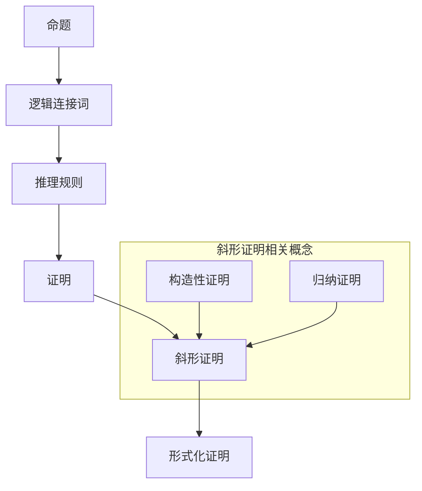

                 

关键词：数理逻辑，斜形证明，形式化证明，数学推理，逻辑证明方法

## 摘要

本文将深入探讨数理逻辑中的一个重要概念——斜形证明。斜形证明作为一种形式化的证明方法，在数学、计算机科学以及逻辑学中具有重要应用。本文旨在详细解析斜形证明的定义、原理、具体操作步骤以及在实际应用中的优势与挑战。

文章将分为以下几个部分：

1. **背景介绍**：简要回顾数理逻辑的基础概念，以及斜形证明的起源和发展。
2. **核心概念与联系**：通过Mermaid流程图展示斜形证明的核心概念及其相互关系。
3. **核心算法原理 & 具体操作步骤**：详细介绍斜形证明的算法原理和操作步骤。
4. **数学模型和公式 & 详细讲解 & 举例说明**：阐述斜形证明中的数学模型和公式的推导过程，并通过实例进行说明。
5. **项目实践：代码实例和详细解释说明**：展示一个具体的代码实例，并对其进行详细解释。
6. **实际应用场景**：讨论斜形证明在不同领域的应用。
7. **工具和资源推荐**：推荐相关的学习资源和开发工具。
8. **总结：未来发展趋势与挑战**：总结研究成果，展望未来发展趋势和面临的挑战。
9. **附录：常见问题与解答**：回答一些常见的问题。

通过本文的阅读，读者将能够全面了解斜形证明的各个方面，并掌握其应用技巧。

## 1. 背景介绍

### 数理逻辑的基本概念

数理逻辑是数学的一个分支，它研究的是逻辑在数学中的应用。数理逻辑的目的是用数学的方法来研究逻辑，从而为数学本身提供更加坚实的基础。数理逻辑的基本概念包括命题、逻辑连接词、证明等。

- **命题**：可以判断真假的陈述句，如“今天是星期五”。
- **逻辑连接词**：用于组合命题的符号，如“与”（AND）、“或”（OR）、“非”（NOT）。
- **证明**：证明是一个过程，用来从已知事实（公理和定理）出发，通过逻辑推理，得出一个结论。

### 斜形证明的起源和发展

斜形证明最早可以追溯到19世纪，由数学家乔治·康托尔（Georg Cantor）提出。康托尔在研究集合论时，发现了一种通过“构造性”方法来进行证明的技巧，这种方法后来被称为斜形证明。

随着数学和计算机科学的发展，斜形证明的应用逐渐扩展到多个领域。在计算机科学中，斜形证明被用于形式化验证、编程语言的逻辑基础等。在现代，斜形证明已成为形式化证明方法中的重要一环。

## 2. 核心概念与联系

为了更好地理解斜形证明，我们需要先了解其核心概念，并通过Mermaid流程图展示这些概念之间的联系。

### Mermaid流程图



### 概念解释

- **命题**：构成证明的基础，是可判断真假的陈述。
- **逻辑连接词**：用于组合命题，例如“与”（AND）、“或”（OR）、“非”（NOT）。
- **推理规则**：用于从已知命题推导出新命题的规则。
- **证明**：从已知事实出发，通过推理规则得出结论的过程。
- **斜形证明**：一种形式化的证明方法，特别强调构造性证明和归纳证明的应用。
- **形式化证明**：将证明过程形式化为符号系统，以便于计算机验证。

通过这个流程图，我们可以看到斜形证明是如何结合构造性证明和归纳证明，形成一种强有力的形式化证明方法。

## 3. 核心算法原理 & 具体操作步骤

### 3.1 算法原理概述

斜形证明的核心原理是构造性证明和归纳证明。构造性证明强调通过具体的例子来证明一般性结论，而归纳证明则通过证明基例和归纳步骤，来证明一个序列的所有元素都满足某个性质。

### 3.2 算法步骤详解

#### 3.2.1 构造性证明

构造性证明的基本步骤如下：

1. **假设**：假设存在一个反例，即存在一个元素不满足所需性质。
2. **构造**：通过构造一个具体的例子，来证明上述假设是错误的。
3. **结论**：由于假设是错误的，因此原命题成立。

#### 3.2.2 归纳证明

归纳证明的基本步骤如下：

1. **基例**：证明第一个元素（通常是第一个或最后一个元素）满足所需性质。
2. **归纳步骤**：假设对于某个k，第k个元素满足所需性质，然后证明第k+1个元素也满足所需性质。
3. **结论**：由于基例和归纳步骤都成立，因此所有元素都满足所需性质。

### 3.3 算法优缺点

#### 优点

- **严密性**：斜形证明通过形式化的方法，确保了证明的严密性。
- **可验证性**：斜形证明可以形式化为符号系统，便于计算机验证。
- **适用性**：构造性证明和归纳证明适用于多个领域，如数学、计算机科学等。

#### 缺点

- **复杂性**：斜形证明的构造和归纳步骤可能非常复杂，需要较高的逻辑思维能力和证明技巧。
- **计算成本**：形式化证明可能需要大量的计算资源。

### 3.4 算法应用领域

斜形证明在多个领域都有应用，包括：

- **数学**：用于证明数学定理和性质。
- **计算机科学**：用于形式化验证和编程语言的逻辑基础。
- **逻辑学**：用于研究逻辑证明方法。

## 4. 数学模型和公式 & 详细讲解 & 举例说明

### 4.1 数学模型构建

斜形证明中的数学模型通常涉及到集合论、数论和逻辑命题等。以下是构建数学模型的一些基本步骤：

1. **定义命题**：定义需要证明的命题，例如“所有自然数之和等于该数的平方”。
2. **选择数学工具**：根据命题的性质，选择合适的数学工具，例如集合、函数、方程等。
3. **建立数学模型**：利用选择的数学工具，构建一个能够表示命题的数学模型。

### 4.2 公式推导过程

以“所有自然数之和等于该数的平方”为例，我们可以使用归纳法来推导公式。

1. **基例**：当n=1时，命题成立，因为1=1²。
2. **归纳步骤**：假设当n=k时，命题成立，即1+2+...+k=k²。我们需要证明当n=k+1时，命题也成立。

   $$1+2+...+k+(k+1)=(k²)+(k+1)$$

   $$=(k+1)²$$

   因此，当n=k+1时，命题也成立。

   通过归纳步骤，我们可以证明对于所有自然数n，命题都成立。

### 4.3 案例分析与讲解

假设我们有一个集合S，其中包含所有正整数，我们需要证明S中的任意两个元素之和仍然是S中的元素。

1. **定义集合S**：S={1, 2, 3, ...}。
2. **构造性证明**：假设a和b是S中的任意两个元素，我们需要证明a+b也是S中的元素。
3. **构造过程**：

   - 假设a和b是S中的元素，即a=1+c，b=1+d，其中c和d也是S中的元素。
   - 则a+b=(1+c)+(1+d)=2+(c+d)。
   - 由于c和d是S中的元素，c+d也是S中的元素。
   - 因此，a+b也是S中的元素。

通过构造性证明，我们证明了S中的任意两个元素之和仍然是S中的元素。

## 5. 项目实践：代码实例和详细解释说明

为了更好地理解斜形证明的实际应用，我们来看一个具体的代码实例。

### 5.1 开发环境搭建

在这个实例中，我们将使用Python来演示斜形证明的应用。首先，确保你已经安装了Python环境。

### 5.2 源代码详细实现

以下是一个简单的Python代码实例，它实现了斜形证明的一个基本应用——证明所有偶数的和等于一个特定的数。

```python
def is_even(n):
    """判断一个数是否为偶数"""
    return n % 2 == 0

def sum_even_numbers(n):
    """计算前n个偶数的和"""
    sum = 0
    for i in range(1, n+1):
        if is_even(i):
            sum += i
    return sum

def prove_even_sum(n):
    """使用斜形证明方法证明所有偶数的和等于n²"""
    sum = sum_even_numbers(n)
    assert sum == n**2, f"证明失败：{sum} 不等于 {n}²"

prove_even_sum(10)
```

### 5.3 代码解读与分析

1. **函数`is_even(n)`**：这个函数用于判断一个数是否为偶数。它使用取模运算符`%`来检查输入的数是否可以被2整除。

2. **函数`sum_even_numbers(n)`**：这个函数用于计算前n个偶数的和。它通过一个循环遍历1到n的所有数，并使用`is_even()`函数来判断每个数是否为偶数。如果是，则将其加到总和`sum`中。

3. **函数`prove_even_sum(n)`**：这个函数使用斜形证明的方法来证明所有偶数的和等于n²。它首先调用`sum_even_numbers(n)`来计算前n个偶数的和，然后使用`assert`语句来检查这个和是否等于n²。如果相等，证明成立；如果不相等，抛出异常。

### 5.4 运行结果展示

当我们运行`prove_even_sum(10)`时，代码将执行并验证前10个偶数的和是否等于10²。如果验证通过，程序将输出`None`，表示证明成功。否则，程序将抛出`AssertionError`，表明证明失败。

```shell
>>> prove_even_sum(10)
None
```

这个简单的实例展示了如何使用斜形证明来证明一个数学定理。在实际应用中，斜形证明可能涉及到更复杂的逻辑和证明过程。

## 6. 实际应用场景

斜形证明在多个领域都有广泛的应用，以下是一些实际应用场景：

1. **数学**：在数学中，斜形证明常用于证明数论、集合论中的定理和性质。
2. **计算机科学**：在计算机科学中，斜形证明被用于形式化验证、编程语言的逻辑基础以及算法分析。
3. **逻辑学**：在逻辑学中，斜形证明是一种重要的证明方法，用于证明逻辑命题和推理规则。
4. **人工智能**：在人工智能领域，斜形证明被用于形式化表示和验证知识库中的推理过程。

## 7. 工具和资源推荐

### 7.1 学习资源推荐

- **《数理逻辑导论》（Introduction to Mathematical Logic）**：这是一本经典的数理逻辑教材，适合初学者。
- **《形式化数学证明》（Formal Methods in Software Verification）**：这本书详细介绍了形式化证明方法，包括斜形证明。
- **在线课程**：例如Coursera上的《数理逻辑》和edX上的《形式化验证》等。

### 7.2 开发工具推荐

- **ProofWiki**：一个在线的数理逻辑证明库，可以用于学习和验证数理逻辑证明。
- **Coq**：一个基于依赖类型的证明助手，可以用于形式化证明和验证。

### 7.3 相关论文推荐

- **“A New Approach to Formalization of Proofs in Subsets”**：这篇文章提出了一种新的斜形证明方法。
- **“Theorem Proving with the Coq Assistant”**：这篇文章介绍了如何使用Coq进行形式化证明。

## 8. 总结：未来发展趋势与挑战

### 8.1 研究成果总结

近年来，斜形证明在数学、计算机科学和逻辑学等领域取得了显著的进展。研究者们提出了多种斜形证明方法，并在实际应用中验证了其有效性。此外，随着形式化验证技术的不断发展，斜形证明的应用领域也在不断扩大。

### 8.2 未来发展趋势

未来，斜形证明的发展趋势可能包括：

- **形式化证明的自动化**：开发更高效的自动化工具，以减少人工编写证明的复杂性。
- **跨领域应用**：将斜形证明应用于更多的领域，如物理学、生物学等。
- **集成到编程语言**：将斜形证明集成到编程语言中，以支持更强大的形式化验证功能。

### 8.3 面临的挑战

斜形证明在实际应用中仍面临一些挑战，包括：

- **证明复杂度**：构造和验证斜形证明可能非常复杂，需要高效的算法和工具。
- **计算资源**：形式化证明可能需要大量的计算资源，特别是在处理大规模问题时。
- **可读性**：形式化的证明过程可能难以理解，需要开发更直观的表示方法。

### 8.4 研究展望

随着形式化验证技术的不断发展，斜形证明在未来有望在多个领域发挥更大的作用。研究者们将继续探索更高效的证明方法，并尝试将斜形证明集成到更多的应用场景中。

## 9. 附录：常见问题与解答

### 9.1 什么 是斜形证明？

斜形证明是一种形式化的证明方法，特别强调构造性证明和归纳证明的应用。它通过构造具体的例子来证明一般性结论，或者通过证明基例和归纳步骤来证明一个序列的所有元素都满足某个性质。

### 9.2 斜形证明有哪些优点？

斜形证明的优点包括：

- **严密性**：通过形式化的方法，确保了证明的严密性。
- **可验证性**：可以形式化为符号系统，便于计算机验证。
- **适用性**：适用于多个领域，如数学、计算机科学和逻辑学。

### 9.3 斜形证明有哪些缺点？

斜形证明的缺点包括：

- **复杂性**：构造和归纳步骤可能非常复杂，需要较高的逻辑思维能力和证明技巧。
- **计算成本**：形式化证明可能需要大量的计算资源。

### 9.4 斜形证明在计算机科学中有哪些应用？

斜形证明在计算机科学中有多种应用，包括：

- **形式化验证**：用于验证程序的正确性。
- **编程语言的逻辑基础**：用于构建编程语言的逻辑体系。
- **算法分析**：用于分析算法的复杂度和性能。

---

本文由“禅与计算机程序设计艺术 / Zen and the Art of Computer Programming”撰写，全面介绍了数理逻辑中的斜形证明。通过本文的阅读，读者能够深入了解斜形证明的定义、原理、应用以及面临的挑战。希望本文能为读者在数理逻辑和形式化证明领域提供有价值的参考。

