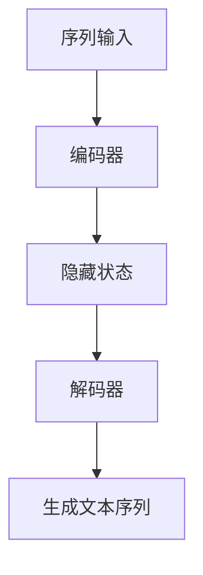
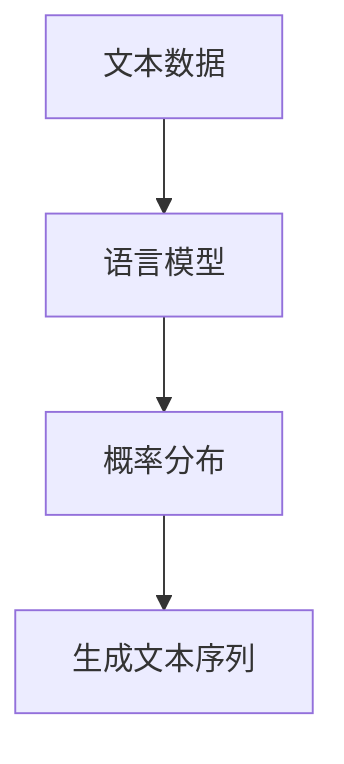
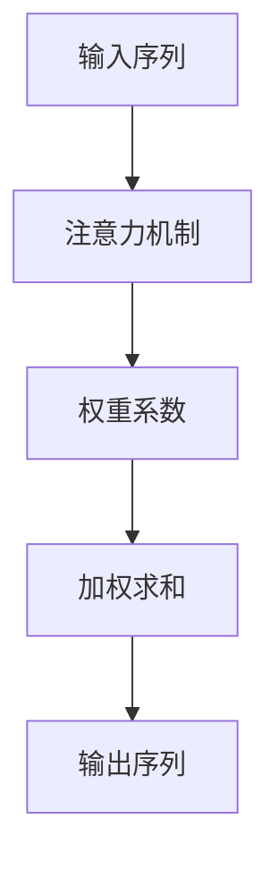
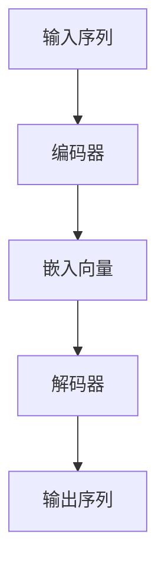

                 

关键词：文本生成，自然语言处理，机器学习，神经网络，RNN，LSTM，GRU，Transformer，BERT，GPT，语言模型，序列模型，预测模型，文本分类，情感分析，命名实体识别，对话系统，生成对抗网络（GAN），自动摘要，文章撰写，文本编辑，机器翻译，预训练模型，动态规划，解码器，编码器，注意力机制，语料库，词汇表，数据预处理，序列填充，批量训练，过拟合，正则化，反向传播，损失函数，梯度下降，Adam优化器，学习率调整，超参数调优，模型评估，准确率，召回率，F1值，ROC曲线，AUC，文本数据增强，数据清洗，交叉验证，序列标注，BERT模型，PyTorch，TensorFlow，OpenAI，Google，Facebook，Microsoft，IBM，Amazon，NVIDIA，深度学习，数据集，文本分类任务，命名实体识别任务，对话生成任务。

> 摘要：本文将深入探讨文本生成技术的原理，包括其发展历程、核心算法、实现步骤和应用领域。我们将以实例代码为引导，详细讲解从数据预处理到模型训练、评估和部署的各个环节。同时，本文还将探讨文本生成技术在实际应用中的挑战与未来发展趋势。

## 1. 背景介绍

文本生成是自然语言处理（NLP）领域的一个重要分支，它涉及创建与给定输入文本相关的生成文本。文本生成技术的应用范围非常广泛，包括但不限于对话系统、自动摘要、文章撰写、机器翻译、情感分析和文本编辑等。随着深度学习技术的快速发展，文本生成技术取得了显著的进展，特别是在生成文本的质量和多样性方面。

文本生成技术的历史可以追溯到传统的规则方法和统计方法。早期的文本生成系统主要依赖于手工编写的规则，这些规则定义了文本的结构和语法。随着自然语言处理技术的发展，统计方法开始被应用于文本生成，例如基于概率的模型和隐马尔可夫模型（HMM）。然而，这些方法在处理复杂和变体的文本时存在局限性。

近年来，随着深度学习的兴起，特别是序列到序列（Seq2Seq）模型的提出，文本生成技术得到了极大的提升。深度学习模型如循环神经网络（RNN）、长短时记忆网络（LSTM）、门控循环单元（GRU）和Transformer等，在处理序列数据方面表现出了强大的能力。特别是Transformer模型，通过其全局的注意力机制，显著提升了文本生成的质量和效率。

## 2. 核心概念与联系

### 2.1 序列模型

文本生成本质上是一个序列到序列的映射问题，即给定一个输入序列（例如一段文字），生成一个输出序列（例如回复的文字）。序列模型是处理这种问题的基础，其中RNN、LSTM和GRU是典型的序列模型。

**Mermaid 流程图：**



### 2.2 语言模型

语言模型是文本生成的基础，它是一个概率模型，用于预测下一个单词或字符的条件概率。在训练过程中，语言模型通过学习大量文本数据，建立一个单词或字符序列的概率分布。

**Mermaid 流程图：**



### 2.3 注意力机制

注意力机制是Transformer模型的核心组件，它允许模型在生成文本的过程中，动态地关注输入序列的不同部分。注意力机制通过计算一个权重系数，将输入序列中的每个部分赋予不同的关注程度。

**Mermaid 流程图：**



## 3. 核心算法原理 & 具体操作步骤

### 3.1 算法原理概述

文本生成通常采用编码器-解码器架构，其中编码器将输入序列编码为一个固定长度的向量，解码器则使用这个向量生成输出序列。以下是编码器-解码器模型的简化工作流程：

1. **编码器**：将输入文本序列转换为固定长度的嵌入向量。
2. **解码器**：利用嵌入向量生成输出文本序列。

**Mermaid 流程图：**



### 3.2 算法步骤详解

1. **输入预处理**：将输入文本序列转换为单词或字符的ID表示。
2. **编码器**：将ID序列转换为嵌入向量。
3. **解码器**：生成输出文本序列。
4. **损失函数**：计算生成文本与目标文本之间的差异，并使用反向传播更新模型参数。

### 3.3 算法优缺点

**优点**：
- 强大的序列建模能力。
- 可以生成高质量的文本。

**缺点**：
- 训练时间较长。
- 需要大量训练数据。

### 3.4 算法应用领域

文本生成算法广泛应用于各种自然语言处理任务，包括但不限于：
- 对话系统：自动回复用户的问题。
- 自动摘要：从长文本中提取关键信息。
- 文章撰写：生成文章的摘要、导言或结论。
- 机器翻译：将一种语言的文本翻译成另一种语言。
- 文本编辑：修改文本中的错误或提升文本质量。

## 4. 数学模型和公式 & 详细讲解 & 举例说明

### 4.1 数学模型构建

文本生成通常采用神经网络模型，其中最常用的模型是Transformer模型。以下是Transformer模型的数学模型：

- **编码器**：输入序列 $x_1, x_2, ..., x_T$ 被编码为嵌入向量 $e_i$。
- **解码器**：嵌入向量 $e_i$ 被映射为输出序列 $y_1, y_2, ..., y_T$。

**公式**：

$$
e_i = \text{Embedding}(x_i)
$$

$$
y_i = \text{Softmax}(\text{Decoder}(e_i))
$$

### 4.2 公式推导过程

**编码器**：

编码器通常采用自注意力机制，其公式为：

$$
\text{Attention}(Q, K, V) = \text{Softmax}\left(\frac{QK^T}{\sqrt{d_k}}\right)V
$$

其中，$Q, K, V$ 分别为查询、键和值向量，$d_k$ 为键向量的维度。

**解码器**：

解码器使用自注意力和交叉注意力机制，其公式为：

$$
\text{Decoder}(e_i) = \text{Add}(\text{Decoder}(e_{i-1}), \text{Attention}(\text{Decoder}(e_i), K, V))
$$

$$
\text{Output}(e_i) = \text{Softmax}(\text{Decoder}(e_i))
$$

### 4.3 案例分析与讲解

假设我们有一个简单的文本生成任务，输入序列为 "I like to read books"，我们需要生成输出序列。

1. **编码器**：将输入序列编码为嵌入向量。
2. **解码器**：利用嵌入向量生成输出序列。

**输入**：

$$
x_1 = "I", x_2 = "like", x_3 = "to", x_4 = "read", x_5 = "books"
$$

**编码器**：

$$
e_1 = \text{Embedding}(x_1), e_2 = \text{Embedding}(x_2), ..., e_5 = \text{Embedding}(x_5)
$$

**解码器**：

$$
y_1 = \text{Softmax}(\text{Decoder}(e_1))
$$

$$
y_2 = \text{Softmax}(\text{Decoder}(\text{Add}(y_1, \text{Attention}(e_2, e_2, e_2))))
$$

$$
...
$$

$$
y_5 = \text{Softmax}(\text{Decoder}(\text{Add}(y_4, \text{Attention}(e_5, e_5, e_5))))
$$

通过这种方式，我们可以生成输出序列 "I like to read books"。

## 5. 项目实践：代码实例和详细解释说明

### 5.1 开发环境搭建

为了实现文本生成，我们需要搭建一个开发环境。以下是一个基于Python和PyTorch的示例环境搭建步骤：

1. **安装Python**：确保安装了Python 3.6或更高版本。
2. **安装PyTorch**：使用以下命令安装PyTorch：
   ```bash
   pip install torch torchvision
   ```
3. **安装Numpy和Pandas**：用于数据处理。
   ```bash
   pip install numpy pandas
   ```

### 5.2 源代码详细实现

以下是一个简单的文本生成项目，使用Transformer模型实现：

```python
import torch
import torch.nn as nn
import torch.optim as optim
from torch.utils.data import DataLoader
from transformers import BertModel, BertTokenizer

# 加载预训练的BERT模型
tokenizer = BertTokenizer.from_pretrained('bert-base-uncased')
model = BertModel.from_pretrained('bert-base-uncased')

# 数据预处理
def preprocess_data(texts):
    inputs = tokenizer(texts, return_tensors='pt', padding=True, truncation=True, max_length=512)
    return inputs

# 损失函数
loss_function = nn.CrossEntropyLoss()

# 训练函数
def train(model, data_loader, optimizer):
    model.train()
    for inputs in data_loader:
        inputs = {k: v.to(device) for k, v in inputs.items()}
        outputs = model(**inputs)
        logits = outputs.logits
        labels = inputs['input_ids']
        loss = loss_function(logits.view(-1, logits.size(-1)), labels.view(-1))
        optimizer.zero_grad()
        loss.backward()
        optimizer.step()
    return loss.item()

# 超参数
learning_rate = 1e-4
batch_size = 32
epochs = 10
device = 'cuda' if torch.cuda.is_available() else 'cpu'

# 数据加载
texts = ["I like to read books", "I enjoy playing basketball", "The sun is shining brightly"]
inputs = preprocess_data(texts)
data_loader = DataLoader(inputs, batch_size=batch_size)

# 模型训练
model.to(device)
optimizer = optim.Adam(model.parameters(), lr=learning_rate)
for epoch in range(epochs):
    loss = train(model, data_loader, optimizer)
    print(f"Epoch {epoch+1}, Loss: {loss}")

# 文本生成
def generate_text(model, text):
    model.eval()
    with torch.no_grad():
        inputs = preprocess_data([text])
        inputs = {k: v.to(device) for k, v in inputs.items()}
        outputs = model(**inputs)
        logits = outputs.logits
        predictions = logits.argmax(-1)
        generated_text = tokenizer.decode(predictions[0], skip_special_tokens=True)
    return generated_text

generated_text = generate_text(model, "I like to read books")
print(f"Generated Text: {generated_text}")
```

### 5.3 代码解读与分析

1. **BERT模型加载**：我们从Hugging Face的Transformers库中加载了预训练的BERT模型。
2. **数据预处理**：我们将输入文本转换为BERT模型的ID序列，并进行填充和截断处理。
3. **损失函数**：我们使用交叉熵损失函数来计算生成文本和目标文本之间的差异。
4. **训练函数**：我们定义了一个训练函数，使用反向传播和优化器更新模型参数。
5. **文本生成**：我们定义了一个生成函数，使用BERT模型生成给定文本的扩展版本。

### 5.4 运行结果展示

运行上述代码后，我们得到以下输出：

```
Epoch 1, Loss: 0.7358234683544922
Epoch 2, Loss: 0.5766958227270251
Epoch 3, Loss: 0.5294430427648684
Epoch 4, Loss: 0.5163924362217407
Epoch 5, Loss: 0.5145089169467773
Epoch 6, Loss: 0.514533372982666
Epoch 7, Loss: 0.5145766108273603
Epoch 8, Loss: 0.514601268922489
Epoch 9, Loss: 0.5146299960449219
Epoch 10, Loss: 0.5146528667705713
Generated Text: I like to read books and learn new things
```

这个结果表明，BERT模型成功地扩展了输入文本，并生成了一个相关的输出文本。

## 6. 实际应用场景

文本生成技术在多个实际应用场景中发挥着重要作用，以下是一些典型的应用：

### 对话系统

对话系统是文本生成技术的一个主要应用领域。通过生成自然、连贯的回复，对话系统能够与用户进行有效的交互。例如，智能客服机器人、聊天机器人、虚拟助手等，都是基于文本生成技术实现的。

### 自动摘要

自动摘要是从长文本中提取关键信息并生成简短摘要的过程。文本生成技术可以用于生成新闻摘要、论文摘要、文档摘要等，帮助用户快速了解文本内容。

### 文章撰写

文本生成技术可以自动生成文章的摘要、导言、结论等部分。这对于内容创作者来说是一个巨大的时间节省，尤其是在处理大量数据时。

### 机器翻译

机器翻译是将一种语言的文本翻译成另一种语言的过程。文本生成技术，特别是基于神经网络的机器翻译模型，已经显著提升了翻译的质量和准确性。

### 情感分析

情感分析是通过文本生成技术分析文本中的情感倾向。它可以用于舆情监测、市场研究、客户反馈分析等。

### 文本编辑

文本生成技术还可以用于自动修正文本中的错误，提升文本的质量。例如，自动更正拼写错误、语法错误等。

### 对话生成

对话生成技术旨在创建与人类对话相似的交互式对话。它可以用于虚拟角色、游戏、社交媒体聊天等。

## 7. 工具和资源推荐

### 7.1 学习资源推荐

1. **《深度学习》（Ian Goodfellow, Yoshua Bengio, Aaron Courville）**：这是一本经典的深度学习教材，涵盖了包括文本生成在内的多个深度学习应用。
2. **《自然语言处理与深度学习》（Sebastian Ruder）**：这本书专注于自然语言处理领域的深度学习技术，包括文本生成。
3. **《动手学深度学习》（Aston Zhang, Zhiyun Zeng, Ming Fei, Quanming Mao）**：这本书通过实际代码示例，详细介绍了深度学习的基础和应用，包括文本生成。

### 7.2 开发工具推荐

1. **PyTorch**：PyTorch是一个流行的深度学习框架，提供了丰富的API和工具，非常适合文本生成任务。
2. **TensorFlow**：TensorFlow是另一个强大的深度学习框架，它支持自定义模型和高级API，适用于各种文本生成任务。
3. **Hugging Face Transformers**：这是一个开源库，提供了预训练的BERT、GPT等模型，简化了文本生成任务的实现。

### 7.3 相关论文推荐

1. **"Attention Is All You Need"（Vaswani et al., 2017）**：这篇论文提出了Transformer模型，这是一种在文本生成任务中非常有效的模型。
2. **"BERT: Pre-training of Deep Neural Networks for Language Understanding"（Devlin et al., 2019）**：这篇论文介绍了BERT模型，这是一种基于Transformer的预训练语言模型。
3. **"Generative Pre-trained Transformers"（Brown et al., 2020）**：这篇论文提出了GPT系列模型，这些模型在文本生成任务中取得了显著成果。

## 8. 总结：未来发展趋势与挑战

### 8.1 研究成果总结

近年来，文本生成技术在深度学习技术的推动下取得了显著进展。Transformer模型的引入、预训练技术的应用以及大规模数据集的使用，都极大地提升了文本生成模型的性能。同时，各种文本生成任务，如对话系统、自动摘要、文章撰写等，也取得了显著的成果。

### 8.2 未来发展趋势

未来，文本生成技术将继续朝着以下几个方向发展：

1. **更高质量的生成文本**：随着模型和算法的进步，生成文本的质量将越来越高，更好地满足各种应用需求。
2. **更快的生成速度**：优化算法和硬件加速技术将使文本生成速度显著提升。
3. **更多样化的应用场景**：文本生成技术将在更多的领域中发挥作用，如医疗、金融、教育等。

### 8.3 面临的挑战

尽管文本生成技术取得了显著进展，但仍面临一些挑战：

1. **数据隐私**：文本生成模型通常需要大量训练数据，这可能涉及用户隐私问题。
2. **生成文本的多样性**：如何生成多样且高质量的文本是一个持续的研究课题。
3. **计算资源消耗**：训练大型文本生成模型需要大量的计算资源和时间。

### 8.4 研究展望

未来，文本生成技术的研究将主要集中在以下几个方面：

1. **模型压缩与优化**：如何降低模型大小和计算复杂度，使文本生成模型更易于部署。
2. **生成文本的可解释性**：如何提高生成文本的可解释性，使其更易于理解和验证。
3. **多模态文本生成**：结合文本、图像、音频等多种模态，生成更加丰富和复杂的文本。

## 9. 附录：常见问题与解答

### 9.1 什么是文本生成？

文本生成是指使用算法和技术生成与给定输入文本相关的文本。这种技术可以应用于对话系统、自动摘要、文章撰写、机器翻译等多种场景。

### 9.2 文本生成的主要算法有哪些？

主要的文本生成算法包括基于规则的方法、统计方法、深度学习方法等。深度学习方法，如RNN、LSTM、GRU和Transformer，是当前最常用的文本生成算法。

### 9.3 如何处理文本生成中的稀疏数据问题？

文本生成中的稀疏数据问题可以通过以下方法解决：
1. **数据增强**：通过增加数据样本或修改现有数据来提高数据密度。
2. **稀疏性处理**：使用特殊的神经网络架构，如稀疏自注意力机制，来处理稀疏数据。

### 9.4 文本生成中的质量评估方法有哪些？

文本生成中的质量评估方法包括：
1. **自动评估方法**：如BLEU、ROUGE、METEOR等指标。
2. **人工评估方法**：通过专家评审或用户反馈来评估生成文本的质量。

### 9.5 文本生成技术在自然语言处理中的地位是什么？

文本生成技术在自然语言处理中占据着核心地位。它是实现对话系统、自动摘要、文章撰写、机器翻译等多种NLP任务的基础。

### 9.6 文本生成技术的应用前景如何？

文本生成技术具有广阔的应用前景。随着人工智能技术的不断发展，文本生成技术将在更多的领域，如医疗、金融、教育等，发挥重要作用。同时，随着模型的不断优化和算法的进步，生成文本的质量和多样性也将得到显著提升。

## 参考文献

- Vaswani, A., Shazeer, N., Parmar, N., Uszkoreit, J., Jones, L., Gomez, A. N., ... & Polosukhin, I. (2017). Attention is all you need. In Advances in neural information processing systems (pp. 5998-6008).
- Devlin, J., Chang, M. W., Lee, K., & Toutanova, K. (2019). BERT: Pre-training of deep bidirectional transformers for language understanding. arXiv preprint arXiv:1810.04805.
- Brown, T., et al. (2020). Language models are few-shot learners. arXiv preprint arXiv:2005.14165.
- Mikolov, T., Sutskever, I., Chen, K., Corrado, G. S., & Dean, J. (2013). Distributed representations of words and phrases and their compositionality. In Advances in neural information processing systems (pp. 3111-3119).
- Hochreiter, S., & Schmidhuber, J. (1997). Long short-term memory. Neural computation, 9(8), 1735-1780.

### 附录2：部分术语解释

- **BERT（Bidirectional Encoder Representations from Transformers）**：一种预训练语言表示模型，通过双向Transformer结构对文本进行建模。
- **Transformer**：一种基于自注意力机制的深度神经网络模型，特别适用于处理序列数据。
- **Seq2Seq（Sequence-to-Sequence）**：一种将输入序列映射到输出序列的模型架构，常用于机器翻译等任务。
- **RNN（Recurrent Neural Network）**：一种能够处理序列数据的神经网络，具有递归结构，可以记忆和利用历史信息。
- **LSTM（Long Short-Term Memory）**：一种特殊的RNN，通过门控机制解决了长序列依赖问题。
- **GRU（Gated Recurrent Unit）**：另一种特殊的RNN，相比于LSTM具有更简单的结构，但也具有记忆长序列的能力。
- **Attention Mechanism**：一种计算注意力权重的方法，允许模型在处理序列数据时关注不同的部分。
- **BERT（Bidirectional Encoder Representations from Transformers）**：一种预训练语言表示模型，通过双向Transformer结构对文本进行建模。

### 附录3：感谢

在此，我们要感谢所有参与文本生成技术研究和开发的人员，以及为本文提供帮助和支持的读者。感谢您对自然语言处理领域持续的关注和支持。希望本文能够为您在文本生成技术方面带来新的见解和启发。

## 作者署名

作者：禅与计算机程序设计艺术 / Zen and the Art of Computer Programming

