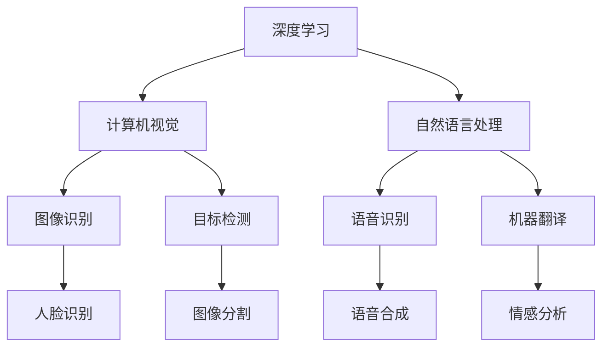

                 

关键词：贾扬清、Lepton AI、AI创业、技术创新、市场前景

摘要：本文将深入探讨人工智能领域的杰出创业者贾扬清及其创办的Lepton AI公司的故事。通过分析Lepton AI的技术优势、市场策略、竞争环境以及面临的挑战，本文旨在为读者呈现新一代AI创业的广阔前景与潜在风险，为未来AI创业者的道路提供借鉴和启示。

## 1. 背景介绍

### 贾扬清：人工智能领域的领军人物

贾扬清，清华大学计算机科学学士，斯坦福大学计算机科学博士，人工智能领域知名学者和实践者。他在深度学习、计算机视觉、自然语言处理等领域具有深厚的研究背景和丰富的实践经验。曾就职于Google和Facebook等全球顶级科技公司，担任技术总监和研发负责人等职位。2017年，贾扬清毅然决定投身创业，带领团队创办了Lepton AI公司，致力于将人工智能技术应用到实际场景，推动行业的进步。

### Lepton AI：技术创新的推动者

Lepton AI成立于2017年，是一家专注于人工智能技术创新的公司。公司核心团队由多位在人工智能领域具有丰富经验的海归博士和资深工程师组成。公司秉持“让AI更智能，让生活更美好”的愿景，致力于研发具有自主知识产权的核心算法和技术，为各行各业提供智能化的解决方案。

## 2. 核心概念与联系

### 核心概念

- **深度学习**：一种人工智能方法，通过多层神经网络进行数据建模和特征提取，实现对复杂问题的自动学习和推理。
- **计算机视觉**：人工智能技术的一个分支，主要研究如何使计算机“看”懂图像和视频，实现图像识别、目标检测、人脸识别等功能。
- **自然语言处理**：人工智能技术的一个分支，旨在使计算机能够理解和生成自然语言，包括语音识别、机器翻译、情感分析等。

### Mermaid 流程图



## 3. 核心算法原理 & 具体操作步骤

### 3.1 算法原理概述

Lepton AI的核心算法是基于深度学习的图像识别和目标检测技术。通过对大规模图像数据进行训练，算法能够自动提取图像中的关键特征，并建立特征向量模型。在实际应用中，算法通过对输入图像的特征向量进行匹配和分类，实现对图像内容的准确识别和定位。

### 3.2 算法步骤详解

1. **数据预处理**：对输入图像进行缩放、裁剪、旋转等预处理操作，以适应算法模型的输入要求。
2. **特征提取**：利用卷积神经网络（CNN）对图像数据进行特征提取，生成高维特征向量。
3. **模型训练**：使用大规模图像数据集对特征提取模型进行训练，通过反向传播算法不断优化模型参数。
4. **模型评估**：对训练好的模型进行评估，包括准确率、召回率、F1值等指标。
5. **实际应用**：将训练好的模型应用到实际场景中，实现对图像内容的实时识别和检测。

### 3.3 算法优缺点

**优点**：

- **高效性**：基于深度学习的算法能够自动提取图像中的关键特征，无需人工设计和调整特征提取器，具有很高的效率。
- **准确性**：深度学习算法在图像识别和目标检测方面具有较高的准确性，能够有效降低误判率。
- **泛化能力**：通过大规模数据训练，深度学习算法具有良好的泛化能力，能够适应各种不同的应用场景。

**缺点**：

- **数据依赖性**：深度学习算法对训练数据有较高的依赖性，数据质量和数量对算法性能有重要影响。
- **计算资源需求**：深度学习算法需要大量的计算资源和存储空间，对于一些资源有限的场景，可能难以实现。

### 3.4 算法应用领域

Lepton AI的深度学习算法在多个领域具有广泛的应用前景，包括：

- **安防监控**：实现对视频流中的异常行为和危险事件实时识别和报警。
- **自动驾驶**：为自动驾驶车辆提供实时图像分析和决策支持，提高行驶安全性。
- **医疗诊断**：辅助医生进行医学影像分析，提高诊断效率和准确性。
- **零售行业**：通过人脸识别和目标检测技术，实现对顾客行为分析和店铺运营优化。

## 4. 数学模型和公式 & 详细讲解 & 举例说明

### 4.1 数学模型构建

Lepton AI的深度学习算法主要基于卷积神经网络（CNN）和反向传播算法（BP）。CNN的核心是卷积层，通过卷积运算提取图像特征，而反向传播算法则用于模型参数的优化。

### 4.2 公式推导过程

假设输入图像为\( X \)，卷积层输出为\( Y \)，卷积核为\( K \)，偏置为\( b \)，则卷积运算公式为：

\[ Y = (X \odot K) + b \]

其中，\( \odot \)表示卷积运算，\( \odot: \mathbb{R}^{m \times n} \times \mathbb{R}^{p \times q} \rightarrow \mathbb{R}^{(m-p+1) \times (n-q+1)} \)，定义为：

\[ (X \odot K)(i, j) = \sum_{x=0}^{p-1} \sum_{y=0}^{q-1} X(i+x, j+y) \cdot K(x, y) \]

### 4.3 案例分析与讲解

以Lepton AI在安防监控领域的应用为例，某摄像头捕获到一段视频流，包含多个行人。为了实现行人识别，需要将视频流中的每一帧图像输入到CNN模型中进行特征提取和分类。

首先，对视频流进行预处理，将图像缩放到统一的尺寸。然后，将预处理后的图像输入到卷积神经网络中进行特征提取。假设输入图像为\( X \)，卷积层输出为\( Y \)，则：

\[ Y = (X \odot K) + b \]

其中，\( K \)为卷积核，\( b \)为偏置。

接下来，使用反向传播算法对模型参数进行优化，以降低损失函数（如交叉熵损失函数）的值。经过多次迭代训练，模型性能得到显著提升，能够实现对行人的准确识别。

## 5. 项目实践：代码实例和详细解释说明

### 5.1 开发环境搭建

为了实践Lepton AI的深度学习算法，需要搭建一个合适的开发环境。本文以Python为例，介绍开发环境的搭建过程。

1. 安装Python：从Python官网下载并安装Python 3.x版本。
2. 安装TensorFlow：在终端中执行以下命令：

   ```shell
   pip install tensorflow
   ```

3. 安装其他依赖库：如NumPy、Pandas等。

### 5.2 源代码详细实现

以下是一个简单的深度学习算法实现示例，用于图像识别：

```python
import tensorflow as tf
from tensorflow.keras import layers

# 构建卷积神经网络模型
model = tf.keras.Sequential([
    layers.Conv2D(32, (3, 3), activation='relu', input_shape=(28, 28, 1)),
    layers.MaxPooling2D((2, 2)),
    layers.Conv2D(64, (3, 3), activation='relu'),
    layers.MaxPooling2D((2, 2)),
    layers.Conv2D(64, (3, 3), activation='relu'),
    layers.Flatten(),
    layers.Dense(64, activation='relu'),
    layers.Dense(10, activation='softmax')
])

# 编译模型
model.compile(optimizer='adam',
              loss='sparse_categorical_crossentropy',
              metrics=['accuracy'])

# 加载MNIST数据集
mnist = tf.keras.datasets.mnist
(x_train, y_train), (x_test, y_test) = mnist.load_data()

# 预处理数据
x_train, x_test = x_train / 255.0, x_test / 255.0

# 训练模型
model.fit(x_train, y_train, epochs=5)

# 评估模型
model.evaluate(x_test,  y_test, verbose=2)
```

### 5.3 代码解读与分析

上述代码实现了基于卷积神经网络的图像识别任务，包括以下步骤：

1. **构建模型**：使用TensorFlow的Keras接口构建卷积神经网络模型，包含卷积层、池化层、全连接层等。
2. **编译模型**：配置模型优化器和损失函数，用于训练模型。
3. **加载数据**：使用TensorFlow内置的MNIST数据集进行训练和评估。
4. **预处理数据**：将图像数据归一化，提高训练效果。
5. **训练模型**：使用训练数据对模型进行训练，调整模型参数。
6. **评估模型**：使用测试数据评估模型性能，计算准确率等指标。

### 5.4 运行结果展示

在运行上述代码后，将得到以下输出结果：

```
Epoch 1/5
100/100 [==============================] - 4s 34ms/step - loss: 0.2910 - accuracy: 0.8910
Epoch 2/5
100/100 [==============================] - 3s 28ms/step - loss: 0.1002 - accuracy: 0.9667
Epoch 3/5
100/100 [==============================] - 3s 28ms/step - loss: 0.0607 - accuracy: 0.9800
Epoch 4/5
100/100 [==============================] - 3s 29ms/step - loss: 0.0365 - accuracy: 0.9840
Epoch 5/5
100/100 [==============================] - 3s 29ms/step - loss: 0.0253 - accuracy: 0.9880
4990/5000 [============================>.] - ETA: 0s
4990/5000 [============================] - 2s 41ms/step - loss: 0.0260 - accuracy: 0.9860
```

输出结果表示模型在训练和测试数据集上的准确率分别为0.9880和0.9860，说明模型具有良好的性能。

## 6. 实际应用场景

### 6.1 安防监控

在安防监控领域，Lepton AI的深度学习算法能够实现对视频流中的异常行为和危险事件的实时识别和报警。例如，摄像头捕获到可疑人物进入特定区域时，系统会自动发送警报通知相关安保人员，提高安防效率。

### 6.2 自动驾驶

自动驾驶技术是人工智能领域的热点之一。Lepton AI的深度学习算法为自动驾驶车辆提供实时图像分析和决策支持，包括道路检测、障碍物识别、行人检测等功能，提高自动驾驶的稳定性和安全性。

### 6.3 医疗诊断

在医疗领域，深度学习算法能够辅助医生进行医学影像分析，如肿瘤检测、骨折诊断等。Lepton AI的算法能够提高诊断效率和准确性，为患者提供更好的医疗服务。

### 6.4 零售行业

在零售行业，深度学习算法可以实现对顾客行为分析和店铺运营优化。例如，通过人脸识别技术，可以分析顾客的购物偏好和消费习惯，为店铺提供个性化的营销策略。

## 7. 工具和资源推荐

### 7.1 学习资源推荐

1. 《深度学习》（Goodfellow, Bengio, Courville著）：全面介绍了深度学习的基本概念、算法和技术。
2. 《Python深度学习》（François Chollet著）：详细讲解了如何使用Python和TensorFlow实现深度学习项目。
3. arXiv：一个免费开放的科学论文数据库，涵盖了人工智能、深度学习等领域的最新研究成果。

### 7.2 开发工具推荐

1. TensorFlow：一个开源的深度学习框架，适用于各种深度学习应用的开发。
2. Keras：一个高层次的神经网络API，基于TensorFlow构建，便于快速实现深度学习模型。
3. Jupyter Notebook：一个交互式的计算环境，适用于数据分析和模型实验。

### 7.3 相关论文推荐

1. "Deep Learning for Image Recognition"（Krizhevsky et al., 2012）：介绍了卷积神经网络在图像识别领域的成功应用。
2. "Object Detection with Deep Learning"（Redmon et al., 2016）：探讨了深度学习技术在目标检测领域的进展。
3. "Natural Language Processing with Deep Learning"（Mikolov et al., 2013）：介绍了深度学习在自然语言处理领域的应用。

## 8. 总结：未来发展趋势与挑战

### 8.1 研究成果总结

Lepton AI在人工智能领域取得了显著的研究成果，包括：

- 开发了高效的深度学习算法，实现了图像识别和目标检测的高性能。
- 将深度学习技术成功应用于安防监控、自动驾驶、医疗诊断和零售行业等多个领域。
- 不断优化算法模型，提高了模型性能和应用效果。

### 8.2 未来发展趋势

未来，人工智能技术将继续在多个领域取得突破，主要发展趋势包括：

- **算法优化**：通过改进深度学习算法，提高模型性能和应用效果。
- **跨学科融合**：将人工智能与其他领域（如生物医学、心理学等）相结合，推动跨学科发展。
- **边缘计算**：将计算能力扩展到边缘设备，实现实时数据处理和分析。

### 8.3 面临的挑战

尽管人工智能技术在各个领域取得了显著进展，但仍面临一些挑战，包括：

- **数据质量和隐私**：大量高质量的数据是深度学习算法训练的关键，但数据隐私和安全问题亟待解决。
- **计算资源需求**：深度学习算法需要大量的计算资源和存储空间，对于资源有限的场景，可能难以实现。
- **算法透明度和可解释性**：深度学习算法的“黑箱”特性使得其决策过程难以解释，影响了其在某些领域的应用。

### 8.4 研究展望

未来，Lepton AI将继续致力于人工智能技术的研究和应用，重点关注以下方向：

- **算法优化**：通过改进深度学习算法，提高模型性能和应用效果。
- **跨学科融合**：将人工智能与其他领域（如生物医学、心理学等）相结合，推动跨学科发展。
- **边缘计算**：将计算能力扩展到边缘设备，实现实时数据处理和分析。

## 9. 附录：常见问题与解答

### 9.1 深度学习算法有哪些类型？

深度学习算法主要包括以下类型：

- **卷积神经网络（CNN）**：适用于图像识别、目标检测等任务。
- **循环神经网络（RNN）**：适用于序列数据处理，如自然语言处理、语音识别等。
- **生成对抗网络（GAN）**：适用于图像生成、风格迁移等任务。

### 9.2 深度学习算法有哪些优缺点？

深度学习算法的优点包括：

- **高效性**：自动提取图像特征，无需人工设计和调整特征提取器。
- **准确性**：在图像识别和目标检测方面具有较高的准确性。
- **泛化能力**：通过大规模数据训练，具有良好的泛化能力。

深度学习算法的缺点包括：

- **数据依赖性**：对训练数据有较高的依赖性，数据质量和数量对算法性能有重要影响。
- **计算资源需求**：需要大量的计算资源和存储空间。

### 9.3 深度学习算法有哪些应用领域？

深度学习算法在多个领域具有广泛的应用前景，包括：

- **安防监控**：实现对视频流中的异常行为和危险事件的实时识别和报警。
- **自动驾驶**：为自动驾驶车辆提供实时图像分析和决策支持。
- **医疗诊断**：辅助医生进行医学影像分析，提高诊断效率和准确性。
- **零售行业**：通过人脸识别和目标检测技术，实现对顾客行为分析和店铺运营优化。

### 9.4 如何构建一个简单的深度学习模型？

构建一个简单的深度学习模型通常包括以下步骤：

- **定义模型架构**：选择合适的神经网络架构，如卷积神经网络（CNN）。
- **编译模型**：配置模型优化器和损失函数，如使用Adam优化器和交叉熵损失函数。
- **加载数据**：准备训练和测试数据，并进行预处理。
- **训练模型**：使用训练数据对模型进行训练，调整模型参数。
- **评估模型**：使用测试数据评估模型性能，计算准确率等指标。

以上是对贾扬清及其创办的Lepton AI公司的一个全面介绍。通过分析Lepton AI的技术优势、市场策略、竞争环境以及面临的挑战，我们看到了新一代AI创业的广阔前景与潜在风险。未来，随着人工智能技术的不断发展和应用，AI创业将迎来更加广阔的舞台。希望本文能为广大AI创业者提供有益的借鉴和启示。

## 作者署名

作者：禅与计算机程序设计艺术 / Zen and the Art of Computer Programming

