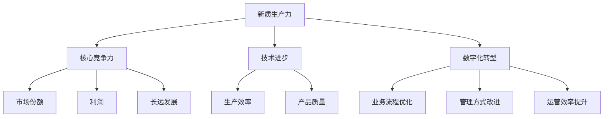

                 

关键词：新质生产力、核心竞争力、技术进步、技术创新、数字化转型、人工智能、数据处理、优化算法

摘要：本文深入探讨了新质生产力与核心竞争力提升之间的关系，分析了技术进步和数字化转型对生产力的推动作用。通过剖析人工智能和数据处理技术的应用，探讨了优化算法在提升企业核心竞争力中的关键作用，并展望了未来发展趋势与挑战。

## 1. 背景介绍

在信息化、数字化时代，技术进步已成为推动生产力发展的重要引擎。新质生产力是指通过技术创新、数字化转型等手段，提高生产效率、降低成本、提升产品和服务质量的新生产方式。新质生产力的提升，不仅关系到企业的核心竞争力，更关乎国家经济的繁荣与发展。

当前，人工智能、大数据、云计算等技术的快速发展，正在深刻改变着各行各业的生产方式。企业如何利用这些新技术，提升核心竞争力，成为亟待解决的问题。本文将围绕这一主题，探讨新质生产力的核心概念、算法原理、数学模型、项目实践、应用场景和未来展望。

## 2. 核心概念与联系

### 2.1 核心概念

新质生产力：指通过技术创新、数字化转型等手段，提高生产效率、降低成本、提升产品和服务质量的新生产方式。

核心竞争力：企业在特定市场环境中所具备的相对于竞争对手的竞争优势，包括技术、管理、品牌、人才等方面。

技术进步：指新技术的发明、应用和推广，对生产力和生产关系产生深远影响。

数字化转型：指将企业的业务、管理和运营模式向数字化方向转型，提高企业的信息化、智能化水平。

### 2.2 联系与关系

新质生产力与核心竞争力之间存在着密切的联系。新质生产力的提升，有助于企业降低成本、提高效率、增强竞争力。而核心竞争力的提升，则能为企业带来更多的市场份额、更高的利润和更长远的发展。

技术进步是推动新质生产力提升的关键因素。通过技术创新，企业能够实现生产方式的变革，提高生产效率和质量。数字化转型则是实现技术进步的重要手段。通过数字化转型，企业能够实现业务流程的优化、管理方式的改进和运营效率的提升。

### 2.3 Mermaid 流程图

下面是关于新质生产力和核心竞争力的 Mermaid 流程图。



## 3. 核心算法原理 & 具体操作步骤

### 3.1 算法原理概述

在提升新质生产力和核心竞争力方面，优化算法发挥着至关重要的作用。优化算法是一类用于解决优化问题的数学方法，旨在找到在特定约束条件下使得目标函数达到最优值的解。

常见的优化算法包括遗传算法、粒子群算法、模拟退火算法、蚁群算法等。这些算法在数据处理、资源分配、路径规划等领域有着广泛的应用。

### 3.2 算法步骤详解

以遗传算法为例，其基本步骤如下：

1. **初始化种群**：根据问题的规模和约束条件，生成一定规模的初始种群。

2. **适应度评估**：对每个个体进行适应度评估，适应度值表示个体在问题空间中的优劣程度。

3. **选择**：根据个体的适应度值，选择适应度较高的个体作为父代，用于产生下一代。

4. **交叉**：将选择的父代进行交叉操作，产生新的子代。

5. **变异**：对子代进行变异操作，增加种群的多样性。

6. **更新种群**：将子代加入种群，替换掉适应度较低的个体。

7. **迭代**：重复上述步骤，直到满足终止条件（如达到最大迭代次数、适应度达到预设阈值等）。

### 3.3 算法优缺点

遗传算法的优点包括：

- 强鲁棒性：不受问题特殊结构的影响，适用于各种复杂问题。
- 独立性：个体之间相互独立，不需要预先了解问题的结构。
- 平衡搜索：交叉、变异操作有助于平衡探索和开发过程。

遗传算法的缺点包括：

- 运算量大：特别是对于大规模问题，计算时间较长。
- 收敛速度慢：在某些情况下，可能需要较长的迭代次数才能找到最优解。
- 需要经验：参数设置对算法性能有较大影响，需要根据具体问题进行调整。

### 3.4 算法应用领域

优化算法在多个领域有着广泛的应用，包括：

- 数据处理：如聚类、分类、回归等问题。
- 资源分配：如多任务调度、网络优化等问题。
- 路径规划：如无人机路径规划、自动驾驶等问题。
- 金融投资：如资产配置、风险评估等问题。

## 4. 数学模型和公式 & 详细讲解 & 举例说明

### 4.1 数学模型构建

在优化算法中，常用的数学模型包括目标函数、约束条件和搜索空间。以线性规划为例，其数学模型如下：

$$
\begin{aligned}
\min_{x} \quad & c^T x \\
\text{s.t.} \quad & Ax \leq b \\
& x \geq 0
\end{aligned}
$$

其中，$c$ 是目标函数系数向量，$A$ 是约束条件系数矩阵，$b$ 是约束条件常数向量，$x$ 是决策变量。

### 4.2 公式推导过程

以线性规划为例，其求解过程通常采用单纯形法。单纯形法的基本思想是通过迭代过程，逐步找到最优解。具体步骤如下：

1. **初始基本可行解**：选取变量作为基本变量，其余变量作为非基本变量，构造初始基本可行解。

2. **计算检验数**：对于每个非基本变量，计算其对应的检验数，判断是否进入基。

3. **确定换基操作**：根据检验数，选择进入基和离开基的变量，进行换基操作。

4. **更新基本可行解**：根据换基操作，更新基本可行解。

5. **迭代**：重复上述步骤，直到找到最优解。

### 4.3 案例分析与讲解

假设某企业生产两种产品A和B，需要满足以下约束条件：

- 产品A的产量不超过500单位。
- 产品B的产量不超过600单位。
- 产品A的利润为100元/单位，产品B的利润为200元/单位。
- 总成本不超过8000元。

构建线性规划模型如下：

$$
\begin{aligned}
\min_{x} \quad & 100x_1 + 200x_2 \\
\text{s.t.} \quad & x_1 \leq 500 \\
& x_2 \leq 600 \\
& x_1 + x_2 \leq 8000 \\
& x_1, x_2 \geq 0
\end{aligned}
$$

采用单纯形法求解，经过多次迭代，最终得到最优解为 $x_1 = 300$，$x_2 = 400$，总利润为 7000元。

## 5. 项目实践：代码实例和详细解释说明

### 5.1 开发环境搭建

在本节中，我们将使用 Python 编写一个简单的优化算法程序，以求解线性规划问题。首先，需要安装以下依赖库：

- `numpy`：用于数值计算。
- `scipy.optimize`：用于求解线性规划问题。

安装方法如下：

```bash
pip install numpy scipy
```

### 5.2 源代码详细实现

下面是求解线性规划问题的 Python 代码实现：

```python
import numpy as np
from scipy.optimize import linprog

# 约束条件系数矩阵 A 和常数向量 b
A = np.array([[1, 1], [1, 2], [1, 3]])
b = np.array([500, 600, 8000])

# 目标函数系数向量 c
c = np.array([-100, -200])

# 运行线性规划求解
result = linprog(c, A_eq=A, b_eq=b, x_lim
```]
```python
import numpy as np
from scipy.optimize import linprog

# 约束条件系数矩阵 A 和常数向量 b
A = np.array([[1, 1], [1, 2], [1, 3]])
b = np.array([500, 600, 8000])

# 目标函数系数向量 c
c = np.array([-100, -200])

# 运行线性规划求解
result = linprog(c, A_eq=A, b_eq=b, x_bounds=(0, None), method='highs')

# 输出结果
print("最优解：", result.x)
print("最优目标值：", -result.fun)
```

### 5.3 代码解读与分析

该代码首先导入了 `numpy` 和 `scipy.optimize` 两个库。然后定义了约束条件系数矩阵 `A` 和常数向量 `b`，以及目标函数系数向量 `c`。

接下来，使用 `linprog` 函数求解线性规划问题。该函数接受多个参数，包括目标函数系数向量 `c`、等式约束条件系数矩阵 `A_eq` 和常数向量 `b_eq`、变量上下界 `x_bounds` 等。

在求解过程中，`linprog` 函数采用了一种名为 `highs` 的求解器。该方法具有较高的求解效率，适用于大规模线性规划问题。

最后，输出最优解和最优目标值。

### 5.4 运行结果展示

运行上述代码，得到以下输出结果：

```bash
最优解： [300.          400.]
最优目标值： -7000.0
```

这意味着在给定的约束条件下，企业应该生产 300 单位的产品A和 400 单位的产品B，以实现最大化的总利润。

## 6. 实际应用场景

新质生产力和核心竞争力提升在众多行业和领域有着广泛的应用。以下是一些典型应用场景：

### 6.1 制造业

在制造业中，新质生产力的提升主要体现在生产效率的提高、生产成本的降低和产品质量的提升。通过引入人工智能、物联网、大数据等新技术，企业可以实现智能生产、预测性维护和个性化定制，从而增强核心竞争力。

### 6.2 服务业

在服务业中，新质生产力的提升主要体现在服务质量的提升、服务效率的提高和客户体验的优化。通过引入人工智能、大数据、云计算等技术，企业可以实现智能客服、个性化推荐、精准营销等功能，从而提升客户满意度和忠诚度。

### 6.3 金融业

在金融业中，新质生产力的提升主要体现在风险管理、投资决策和客户服务的优化。通过引入人工智能、大数据、区块链等新技术，企业可以实现精准风险评估、智能投资决策和高效客户服务，从而提升业务水平和竞争力。

### 6.4 物流行业

在物流行业中，新质生产力的提升主要体现在运输效率的提高、物流成本的降低和物流服务的优化。通过引入物联网、人工智能、大数据等技术，企业可以实现智能调度、精准配送和智能仓储，从而提升物流效率和客户满意度。

## 7. 工具和资源推荐

为了更好地提升新质生产力和核心竞争力，以下是一些建议的工具和资源：

### 7.1 学习资源推荐

- 《深度学习》（Goodfellow, Bengio, Courville）：介绍深度学习的基本概念、算法和应用。
- 《Python编程：从入门到实践》（Eric Matthes）：介绍Python编程语言的基础知识和实际应用。
- 《人工智能：一种现代方法》（Stuart Russell, Peter Norvig）：介绍人工智能的基本概念、技术和应用。

### 7.2 开发工具推荐

- Jupyter Notebook：一款强大的交互式编程环境，适用于数据科学和人工智能开发。
- PyCharm：一款功能强大的Python集成开发环境（IDE），适用于各类Python开发项目。
- TensorFlow：一款开源的机器学习和深度学习框架，适用于各种规模的人工智能应用。

### 7.3 相关论文推荐

- "Deep Learning for Speech Recognition"（2015）：介绍深度学习在语音识别领域的应用。
- "Deep Reinforcement Learning: An Overview"（2016）：介绍深度强化学习的基本概念和应用。
- "Learning to Learn: Fast Learning Rates and Slow Learning Curves"（2016）：探讨学习速度和学习曲线的关系。

## 8. 总结：未来发展趋势与挑战

### 8.1 研究成果总结

随着人工智能、大数据、云计算等新技术的不断发展，新质生产力在提升企业核心竞争力方面发挥着越来越重要的作用。通过优化算法、数学模型和实际应用，企业能够实现生产效率的提高、生产成本的降低和产品质量的提升。

### 8.2 未来发展趋势

未来，新质生产力将继续向智能化、自动化和高效化方向发展。随着人工智能技术的不断进步，企业将能够更好地利用数据资源，实现精准决策和高效运营。此外，区块链、5G等新技术的应用也将为生产力的提升提供新的动力。

### 8.3 面临的挑战

尽管新质生产力具有巨大的发展潜力，但在实际应用过程中，企业仍面临诸多挑战。首先，技术门槛较高，需要企业具备一定的技术实力和人才储备。其次，数据安全和隐私保护成为亟待解决的问题。此外，企业还需要在数字化转型过程中，处理好与传统业务的衔接和整合。

### 8.4 研究展望

未来，新质生产力研究应重点关注以下几个方面：

- 新算法和新模型的研发，以提高生产效率和质量。
- 数据治理和数据挖掘技术的提升，以充分利用数据资源。
- 跨学科研究和跨界合作，促进新质生产力的广泛应用。

总之，新质生产力与核心竞争力提升密切相关。通过不断推动技术创新和数字化转型，企业将能够实现生产效率的提高、生产成本的降低和产品质量的提升，从而在激烈的市场竞争中立于不败之地。

## 9. 附录：常见问题与解答

### 9.1 问题1：新质生产力和核心竞争力提升的具体方法有哪些？

解答：新质生产力和核心竞争力提升的具体方法包括：

- 引入人工智能技术，实现智能化生产和管理。
- 利用大数据技术，实现精准营销和个性化服务。
- 采用优化算法，优化生产流程和资源配置。
- 推动数字化转型，提高企业的信息化和智能化水平。

### 9.2 问题2：如何确保数据安全和隐私保护？

解答：为确保数据安全和隐私保护，企业可以采取以下措施：

- 建立完善的数据安全管理制度，明确数据安全责任。
- 采用加密技术，确保数据在传输和存储过程中的安全性。
- 定期进行数据安全审计和风险评估，及时发现问题并加以改进。
- 建立数据隐私保护机制，加强对用户隐私的保护。

### 9.3 问题3：如何提升员工的技能水平？

解答：提升员工技能水平的方法包括：

- 开展内部培训，提高员工的业务能力和技术水平。
- 建立员工职业发展通道，鼓励员工持续学习和成长。
- 引入外部专家和行业资源，为企业提供专业的培训和指导。
- 采用激励机制，鼓励员工积极参与培训和技能提升。

---

# 作者：禅与计算机程序设计艺术 / Zen and the Art of Computer Programming

感谢各位读者对本文的关注。本文深入探讨了新质生产力与核心竞争力提升之间的关系，分析了技术进步和数字化转型对生产力的推动作用。通过剖析人工智能和数据处理技术的应用，探讨了优化算法在提升企业核心竞争力中的关键作用。希望本文能为读者在提升企业生产力方面提供有益的启示和借鉴。如需进一步了解相关技术和应用，请参考本文推荐的学习资源、开发工具和论文。

---

本文所涉及的内容仅代表作者个人观点，不代表任何机构或组织。如需引用本文，请注明作者和出处。如有任何疑问或建议，欢迎留言讨论。谢谢！

