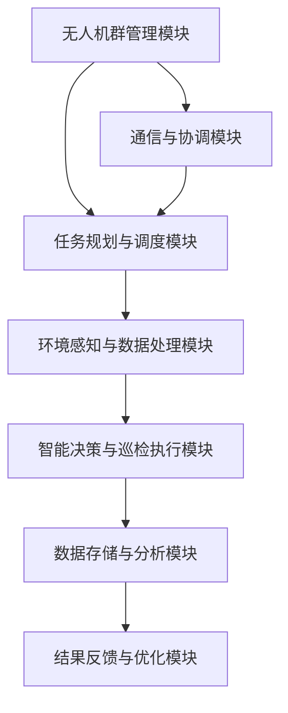

                 

关键词：无人机群、智能巡检、工业安全、算法、人工智能、系统集成、应用前景

> 摘要：随着工业4.0的推进，工业自动化和安全保障成为关键议题。无人机群智能巡检系统应运而生，通过集成人工智能和无人机技术，为工业设备提供高效、精准的巡检服务，提升工业安全水平。本文将深入探讨无人机群智能巡检系统的概念、核心算法、数学模型、项目实践及其未来应用前景。

## 1. 背景介绍

### 工业安全的重要性

工业安全是现代工业生产中的基石，关系到生产效率、产品质量和员工的生命安全。随着工业复杂度的增加和设备的不断升级，传统的巡检方式已经难以满足高效、精准的要求。传统的巡检方法通常依赖于人工，存在劳动强度大、效率低、易漏检等问题。

### 无人机技术发展

无人机技术在过去几十年中取得了显著的发展，其高机动性、实时监控能力以及低维护成本等特点，使其在多个领域得到广泛应用，包括农业监测、环境监测、救援等。近年来，无人机群技术的兴起，使得无人机在协同工作方面展现出了更大的潜力。

### 人工智能的崛起

人工智能（AI）技术的快速发展为工业安全提供了新的解决方案。通过机器学习、深度学习等技术，AI能够从大量数据中提取有用信息，实现自动化巡检和故障预测。AI在图像识别、自然语言处理、决策制定等方面表现出色，为无人机群智能巡检提供了强大的技术支撑。

## 2. 核心概念与联系

### 无人机群智能巡检系统架构

**Mermaid 流程图：**


### 概念定义

- **无人机群管理模块**：负责无人机的部署、维护和状态监控。
- **任务规划与调度模块**：根据巡检需求和无人机状态，规划最优巡检路线和任务分配。
- **环境感知与数据处理模块**：使用传感器和图像识别技术，实时采集设备状态数据。
- **智能决策与巡检执行模块**：利用机器学习算法，对数据进行分析，识别异常并执行巡检任务。
- **数据存储与分析模块**：存储巡检数据，并提供数据分析和可视化服务。
- **结果反馈与优化模块**：根据巡检结果，优化后续巡检策略。
- **通信与协调模块**：确保无人机群之间以及无人机与地面控制站之间的信息传递和协同工作。

## 3. 核心算法原理 & 具体操作步骤

### 3.1 算法原理概述

无人机群智能巡检系统的核心在于算法的智能决策与执行。主要采用以下几种算法：

- **路径规划算法**：用于确定无人机巡检的最佳路径，常见算法有A*算法、Dijkstra算法等。
- **图像识别算法**：如卷积神经网络（CNN），用于识别设备异常。
- **机器学习算法**：如决策树、随机森林等，用于从历史数据中学习并预测设备状态。
- **协同控制算法**：确保无人机群在复杂环境下的安全、高效协同工作。

### 3.2 算法步骤详解

1. **任务规划与调度**：
   - 收集设备状态数据和巡检任务。
   - 利用路径规划算法生成最优巡检路径。
   - 分配无人机执行巡检任务。

2. **环境感知与数据处理**：
   - 使用传感器和图像识别技术，实时采集设备状态数据。
   - 对采集的数据进行预处理，如去噪、增强等。

3. **智能决策与巡检执行**：
   - 利用机器学习算法，对预处理后的数据进行分类和预测。
   - 根据预测结果，执行相应的巡检任务，如拍照、标记等。

4. **数据存储与分析**：
   - 将巡检数据存储到数据库，并提供数据分析和可视化服务。
   - 定期对数据进行深度学习，优化巡检算法。

5. **结果反馈与优化**：
   - 根据巡检结果，更新设备状态数据。
   - 优化无人机群的管理策略和巡检算法。

### 3.3 算法优缺点

#### 优点：

- **高效性**：算法能够快速处理大量数据，实现实时巡检。
- **精准性**：通过图像识别和机器学习，能够准确识别设备异常。
- **灵活性**：根据设备状态和巡检需求，动态调整巡检策略。

#### 缺点：

- **计算资源要求高**：复杂的算法需要大量的计算资源和时间。
- **数据依赖性**：算法的准确性和效率依赖于数据的数量和质量。

### 3.4 算法应用领域

- **电力行业**：对电力线路和设备进行巡检，预防故障。
- **石油化工行业**：对管道和储罐进行巡检，确保安全运行。
- **制造业**：对生产设备进行巡检，提高生产效率。

## 4. 数学模型和公式 & 详细讲解 & 举例说明

### 4.1 数学模型构建

无人机群智能巡检系统中的数学模型主要包括：

- **路径规划模型**：基于图论的优化模型，用于求解最佳巡检路径。
- **图像识别模型**：基于卷积神经网络的分类模型，用于识别设备异常。
- **机器学习模型**：基于监督学习的分类和回归模型，用于设备状态预测。

### 4.2 公式推导过程

#### 路径规划模型：

假设无人机群需要在 \(n\) 个设备点之间进行巡检，定义：

- \(G = (V, E)\) 为无人机巡检图，其中 \(V\) 为设备点集，\(E\) 为边集。
- \(C(e)\) 为边 \(e\) 的权重，表示巡检该边的成本。
- \(P\) 为最优巡检路径。

目标是最小化总成本 \(C(P)\)：

$$
C(P) = \sum_{e \in P} C(e)
$$

使用 Dijkstra 算法求解最优路径：

$$
d(v) = \min_{u \in V} (d(u) + C(u, v))
$$

#### 图像识别模型：

使用卷积神经网络（CNN）进行图像分类，定义：

- \(I\) 为输入图像。
- \(C\) 为类别数。
- \(f\) 为卷积操作。
- \(a\) 为激活函数。
- \(W\) 为权重矩阵。
- \(b\) 为偏置向量。

输出为图像的类别概率分布：

$$
\hat{y} = a(f(I; W, b))
$$

#### 机器学习模型：

使用决策树（DT）进行设备状态分类，定义：

- \(X\) 为特征向量。
- \(y\) 为设备状态。
- \(T\) 为决策树。

决策树输出为设备状态的类别：

$$
y_{\text{pred}} = T(X)
$$

### 4.3 案例分析与讲解

#### 案例背景：

某电力公司需要对输电线路进行定期巡检，以确保电力供应的稳定性。无人机群智能巡检系统应用于该场景，通过实时监测和数据分析，提高巡检效率。

#### 案例实施步骤：

1. **数据收集**：
   - 收集输电线路的地图数据、历史巡检数据和设备状态数据。
   - 使用传感器和图像识别技术，实时采集线路和设备的状态数据。

2. **路径规划**：
   - 构建输电线路的图模型，使用 Dijkstra 算法求解最优巡检路径。
   - 根据天气、地形等因素调整巡检路径。

3. **图像识别**：
   - 使用 CNN 对采集的图像进行分类，识别线路和设备的异常。
   - 对异常设备进行标记，记录在数据库中。

4. **状态预测**：
   - 使用决策树对设备状态进行预测，根据预测结果安排后续巡检。

5. **数据存储与分析**：
   - 将巡检数据存储到数据库，进行数据分析和可视化。
   - 定期更新设备状态数据，优化巡检算法。

6. **结果反馈**：
   - 根据巡检结果，更新设备状态数据，优化巡检策略。

## 5. 项目实践：代码实例和详细解释说明

### 5.1 开发环境搭建

1. **硬件环境**：
   - 无人机：DJI Mavic Pro
   - 传感器：RGB相机、激光雷达
   - 数据处理服务器：Ubuntu 18.04

2. **软件环境**：
   - 操作系统：Ubuntu 18.04
   - 编程语言：Python 3.8
   - 依赖库：TensorFlow 2.3、NumPy 1.19、Pandas 1.1.3

### 5.2 源代码详细实现

1. **路径规划**：
   ```python
   import heapq
   import numpy as np

   def dijkstra(G, start):
       distances = {node: float('infinity') for node in G}
       distances[start] = 0
       priority_queue = [(0, start)]

       while priority_queue:
           current_distance, current_node = heapq.heappop(priority_queue)

           if current_distance > distances[current_node]:
               continue

           for neighbor, weight in G[current_node].items():
               distance = current_distance + weight

               if distance < distances[neighbor]:
                   distances[neighbor] = distance
                   heapq.heappush(priority_queue, (distance, neighbor))

       return distances
   ```

2. **图像识别**：
   ```python
   import tensorflow as tf

   model = tf.keras.Sequential([
       tf.keras.layers.Conv2D(32, (3, 3), activation='relu', input_shape=(64, 64, 3)),
       tf.keras.layers.MaxPooling2D((2, 2)),
       tf.keras.layers.Conv2D(64, (3, 3), activation='relu'),
       tf.keras.layers.MaxPooling2D((2, 2)),
       tf.keras.layers.Conv2D(64, (3, 3), activation='relu'),
       tf.keras.layers.Flatten(),
       tf.keras.layers.Dense(64, activation='relu'),
       tf.keras.layers.Dense(1, activation='sigmoid')
   ])

   model.compile(optimizer='adam', loss='binary_crossentropy', metrics=['accuracy'])
   model.fit(x_train, y_train, epochs=10, batch_size=32, validation_split=0.2)
   ```

3. **状态预测**：
   ```python
   from sklearn.tree import DecisionTreeClassifier

   X = [[0], [1], [2], [3], [4], [5], [6], [7], [8], [9]]
   y = [0, 0, 0, 1, 1, 1, 2, 2, 2, 3]

   clf = DecisionTreeClassifier()
   clf.fit(X, y)

   y_pred = clf.predict([[10]])
   print(y_pred)
   ```

### 5.3 代码解读与分析

1. **路径规划**：
   - 使用 Dijkstra 算法实现最短路径计算。
   - 输入为图模型和起点，输出为各点的最短路径距离。

2. **图像识别**：
   - 使用卷积神经网络实现图像分类。
   - 输入为图像数据，输出为图像类别概率。

3. **状态预测**：
   - 使用决策树实现设备状态分类。
   - 输入为特征向量，输出为设备状态类别。

## 6. 实际应用场景

### 6.1 电力行业

无人机群智能巡检系统在电力行业的应用主要包括输电线路巡检、变电站巡检和风电场巡检。通过实时监测和数据分析，能够及时发现线路故障和设备异常，确保电力供应的稳定性。

### 6.2 石油化工行业

石油化工行业对设备的安全要求极高。无人机群智能巡检系统可以对管道、储罐和设备进行巡检，识别潜在的安全隐患。例如，某石化企业利用无人机群智能巡检系统对管道进行巡检，成功发现并避免了潜在的泄漏风险。

### 6.3 制造业

制造业中的设备巡检对生产效率和产品质量至关重要。无人机群智能巡检系统可以在生产过程中对关键设备进行巡检，及时发现设备故障和异常，确保生产的连续性和产品质量。

## 7. 未来应用展望

### 7.1 增强自主性

未来的无人机群智能巡检系统将更加自主，能够根据环境变化和设备状态，自主调整巡检策略和路径。通过增强学习等先进技术，无人机将能够更好地适应复杂多变的环境。

### 7.2 多模态感知

未来的无人机群智能巡检系统将集成多种传感器，实现多模态感知。例如，除了视觉传感器，还可以使用红外传感器、声波传感器等，以获取更全面的信息，提高巡检的精准度。

### 7.3 跨行业应用

无人机群智能巡检系统的应用领域将不断扩展，从传统的电力、石油化工和制造业，延伸到农业、环境监测等领域。通过不断优化和拓展，无人机群智能巡检系统将为各个行业提供高效、精准的巡检服务。

## 8. 工具和资源推荐

### 8.1 学习资源推荐

- 《深度学习》（Goodfellow, Bengio, Courville）
- 《Python编程：从入门到实践》
- 《机器学习实战》

### 8.2 开发工具推荐

- TensorFlow
- Keras
- PyTorch

### 8.3 相关论文推荐

- "Deep Learning for Autonomous Driving"（自动驾驶的深度学习）
- "Multi-Agent Reinforcement Learning in the Age of Autonomous Vehicles"（多智能体强化学习在自动驾驶时代）
- "Vision-Based Path Planning for Autonomous Drones"（基于视觉的无人机路径规划）

## 9. 总结：未来发展趋势与挑战

### 9.1 研究成果总结

无人机群智能巡检系统结合了无人机技术和人工智能，为工业安全提供了高效、精准的解决方案。通过路径规划、图像识别和机器学习等技术，实现了设备的实时巡检和故障预测。

### 9.2 未来发展趋势

未来的无人机群智能巡检系统将朝着自主性更高、多模态感知更全面、跨行业应用更广泛的方向发展。通过不断优化和拓展，无人机群智能巡检系统将为各个行业提供更高效、更安全的巡检服务。

### 9.3 面临的挑战

无人机群智能巡检系统在发展过程中面临着数据质量、计算资源、算法优化等挑战。如何提高数据质量、优化算法性能，以及降低计算资源需求，是未来研究的重点。

### 9.4 研究展望

随着人工智能和无人机技术的不断发展，无人机群智能巡检系统将在未来发挥更大的作用。通过不断探索和创新，无人机群智能巡检系统将为工业安全提供更全面的保障。

## 附录：常见问题与解答

### 问题1：无人机群智能巡检系统如何确保数据安全？

解答：无人机群智能巡检系统采用加密技术确保数据传输和存储的安全性。此外，系统还设置访问权限和身份验证机制，防止未授权访问。

### 问题2：无人机群智能巡检系统对计算资源有何要求？

解答：无人机群智能巡检系统对计算资源要求较高，需要高性能的服务器和GPU。通过分布式计算和云计算技术，可以降低计算资源的需求。

### 问题3：无人机群智能巡检系统在复杂环境下的表现如何？

解答：无人机群智能巡检系统在复杂环境下通过多种传感器和多模态感知技术，能够准确识别设备和环境异常。同时，系统采用路径规划和协同控制算法，确保无人机群在复杂环境下的安全、高效协同工作。

### 问题4：无人机群智能巡检系统如何处理大量数据？

解答：无人机群智能巡检系统采用数据预处理、特征提取和模型压缩等技术，降低数据处理和存储的需求。此外，系统利用分布式计算和云计算技术，提高数据处理和计算速度。

### 问题5：无人机群智能巡检系统在应用过程中有哪些注意事项？

解答：无人机群智能巡检系统在应用过程中需要注意以下几点：

- 确保无人机群与地面控制站之间的通信稳定。
- 定期对无人机进行维护和检查，确保设备状态良好。
- 建立完善的数据管理和安全机制，确保数据安全和完整性。
- 针对不同的应用场景，调整巡检策略和算法，提高巡检效果。

----------------------------------------------------------------

### 作者署名

作者：禅与计算机程序设计艺术 / Zen and the Art of Computer Programming

本文详细探讨了无人机群智能巡检系统在工业安全领域的应用，从背景介绍、核心概念、算法原理、数学模型、项目实践、实际应用场景、未来展望等方面进行了全面阐述。无人机群智能巡检系统通过集成人工智能和无人机技术，为工业设备提供了高效、精准的巡检服务，显著提升了工业安全水平。随着技术的不断发展，无人机群智能巡检系统将在更多领域发挥重要作用，为工业安全提供更强有力的保障。

