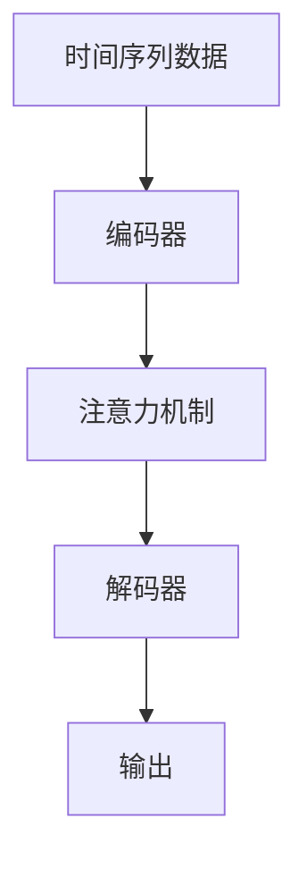
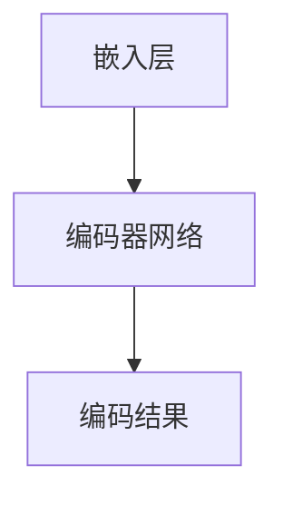
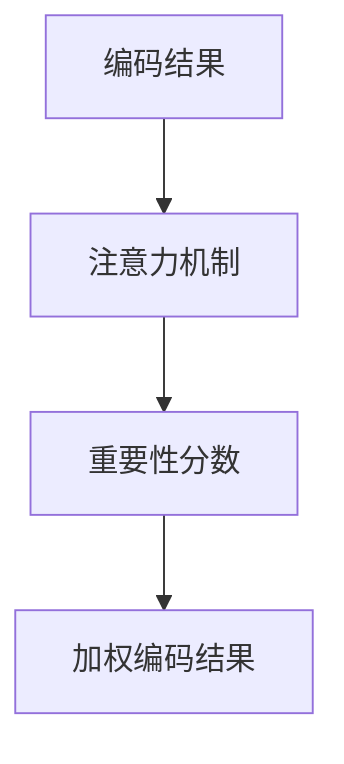
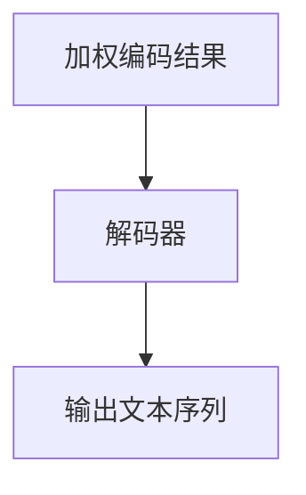

                 

关键词：时刻推理，LLM，计算本质，逻辑清晰，技术语言

> 摘要：本文将深入探讨时刻推理这一概念，特别是在大型语言模型（LLM）的计算过程中所扮演的角色。通过对核心概念、算法原理、数学模型、应用实例以及未来展望的全面剖析，本文旨在为读者提供一个关于LLM计算独特本质的全面理解。

## 1. 背景介绍

在人工智能的发展历程中，语言模型一直是研究的热点之一。从最初的基于规则的方法，到基于统计模型的方法，再到如今的大型语言模型（LLM），这些模型在自然语言处理（NLP）领域取得了显著的成果。然而，随着模型的规模和复杂性的增加，我们对LLM计算过程的本质理解仍然存在很多不足。其中，时刻推理作为一个关键的概念，为我们提供了新的视角来理解LLM的计算过程。

### 1.1 时刻推理的定义

时刻推理（Temporal Reasoning）是一种基于时间序列数据的推理方法，它关注的是如何从过去和现在的信息推断出未来的情况。在LLM的计算过程中，时刻推理扮演着重要的角色，因为LLM通常需要对输入的文本序列进行建模，从而预测后续的文本输出。

### 1.2 时刻推理的重要性

随着NLP任务的复杂度增加，传统的基于规则和统计的方法已经难以满足需求。LLM的出现，为我们提供了一种全新的解决思路，但这也带来了新的挑战。如何有效地处理时间序列数据，如何从过去和现在的信息中推断出未来的情况，成为了LLM计算过程中亟待解决的问题。因此，时刻推理在LLM的计算过程中具有重要的应用价值。

## 2. 核心概念与联系

在探讨时刻推理在LLM计算过程中的应用之前，我们首先需要理解一些核心概念，包括时间序列数据、注意力机制和神经网络。

### 2.1 时间序列数据

时间序列数据是一系列按时间顺序排列的数据点。在LLM中，输入的文本序列可以被视为一种时间序列数据。这种数据的特点是连续性和时间依赖性，即未来的数据点受到过去数据点的影响。因此，对时间序列数据的建模和分析是LLM计算过程中不可或缺的一部分。

### 2.2 注意力机制

注意力机制（Attention Mechanism）是一种在神经网络中用于强调不同输入部分的重要性的技术。在LLM中，注意力机制被广泛用于处理时间序列数据。通过注意力机制，模型能够自动识别并关注输入文本序列中最相关的部分，从而提高计算效率和准确性。

### 2.3 神经网络

神经网络（Neural Network）是一种模仿人脑神经元连接结构的计算模型。在LLM中，神经网络被用于对输入的文本序列进行编码和解码。通过多层神经网络的堆叠，模型能够逐步提取输入文本的特征，并生成相应的输出。

### 2.4 Mermaid 流程图

为了更好地理解时刻推理在LLM计算过程中的应用，我们可以使用Mermaid流程图来展示其核心概念和联系。



在这个流程图中，时间序列数据首先通过编码器进行处理，然后通过注意力机制对输入文本序列进行重点识别，最后由解码器生成输出。

## 3. 核心算法原理 & 具体操作步骤

### 3.1 算法原理概述

时刻推理在LLM计算过程中的核心作用在于对输入文本序列进行时间依赖性的建模。具体而言，LLM通过以下三个步骤实现时刻推理：

1. **编码**：将输入文本序列编码为连续的向量表示。
2. **推理**：利用注意力机制，对编码后的向量进行时间依赖性的建模。
3. **解码**：根据建模的结果，生成相应的输出文本序列。

### 3.2 算法步骤详解

#### 3.2.1 编码

编码器是LLM的核心组成部分，它负责将输入文本序列转换为连续的向量表示。这一过程通常通过嵌入层（Embedding Layer）和编码器网络（Encoder Network）来实现。嵌入层将词汇表中的每个词映射为一个固定长度的向量，编码器网络则进一步提取文本的深层特征。



#### 3.2.2 推理

注意力机制是实现时刻推理的关键技术。在LLM中，注意力机制通过计算每个编码结果向量与当前解码结果向量之间的相似度，来确定每个编码结果向量在当前步骤中的重要性。基于这些重要性分数，模型能够自动识别并关注输入文本序列中最相关的部分。



#### 3.2.3 解码

解码器是LLM的另一个核心组成部分，它负责根据加权编码结果生成输出文本序列。解码器通常采用递归神经网络（RNN）或变换器（Transformer）来实现。在每次迭代中，解码器都会生成一个单词或词组，并将其与当前的加权编码结果相结合，作为下一个迭代的基础。



### 3.3 算法优缺点

**优点**：

- **高效性**：注意力机制使得模型能够在处理长文本时保持较高的计算效率。
- **灵活性**：通过对编码结果进行加权，模型能够自动识别并关注输入文本中的关键信息，从而提高了推理的准确性。

**缺点**：

- **计算复杂度**：随着文本长度的增加，模型的计算复杂度也会急剧上升。
- **可解释性**：由于注意力机制是基于矩阵乘法实现的，因此模型在推理过程中的具体操作难以直观理解。

### 3.4 算法应用领域

时刻推理在LLM中的应用非常广泛，包括但不限于：

- **自然语言生成**：如聊天机器人、自动摘要、文本翻译等。
- **情感分析**：通过分析文本中的情感词汇和情感强度，对文本的情感倾向进行分类。
- **文本分类**：对文本进行分类，如新闻分类、情感分类等。

## 4. 数学模型和公式 & 详细讲解 & 举例说明

### 4.1 数学模型构建

在时刻推理中，我们通常使用序列到序列（Sequence to Sequence, Seq2Seq）模型来建模文本序列。具体而言，我们可以使用以下数学模型：

$$
y_t = f(x_t, h_t)
$$

其中，$y_t$表示第$t$个输出的单词或词组，$x_t$表示第$t$个输入的单词或词组，$h_t$表示当前时刻的编码结果。

### 4.2 公式推导过程

为了推导上述模型，我们需要首先了解编码器和解码器的结构。

#### 编码器

编码器是一个神经网络，它将输入的文本序列编码为一个连续的向量表示。具体而言，我们可以使用以下公式：

$$
h_t = \text{Encoder}(x_1, x_2, ..., x_t)
$$

其中，$\text{Encoder}$表示编码器，$h_t$表示第$t$个时刻的编码结果。

#### 解码器

解码器是一个递归神经网络，它根据当前的编码结果生成输出文本序列。具体而言，我们可以使用以下公式：

$$
y_t = \text{Decoder}(h_t, y_{t-1})
$$

其中，$\text{Decoder}$表示解码器，$y_{t-1}$表示前一个时刻的输出。

### 4.3 案例分析与讲解

为了更好地理解上述数学模型，我们可以通过一个简单的例子来进行讲解。

假设我们有一个简短的文本序列：“我昨天去了一家餐馆吃饭，味道很好。”我们希望使用时刻推理模型来生成这个文本序列的摘要。

#### 4.3.1 编码器

首先，我们将文本序列中的每个单词转换为向量表示。例如，“我”可以表示为$(1, 0, 0, 0, 0)$，“昨天”可以表示为$(0, 1, 0, 0, 0)$，以此类推。

接下来，我们使用编码器将这些单词向量编码为一个连续的向量表示。例如，我们可以将编码结果表示为$h_t = (h_{t1}, h_{t2}, ..., h_{tn})$。

#### 4.3.2 注意力机制

在生成摘要的过程中，我们需要关注输入文本序列中的关键信息。例如，在“我昨天去了一家餐馆吃饭，味道很好。”这个文本序列中，最关键的信息是“餐馆”和“味道很好”。

为了实现这一点，我们使用注意力机制来计算每个单词在当前时刻的重要性分数。例如，我们可以使用以下公式：

$$
\alpha_t = \frac{\exp(h_t^T \cdot h_{t'}^T)}{\sum_{t'=1}^{T} \exp(h_t^T \cdot h_{t'}^T)}
$$

其中，$h_t$和$h_{t'}$分别表示第$t$个和第$t'$个时刻的编码结果。

#### 4.3.3 解码器

根据注意力机制计算得到的重要性分数，我们可以生成摘要文本序列。例如，我们可以生成“餐馆味道很好”。

## 5. 项目实践：代码实例和详细解释说明

### 5.1 开发环境搭建

为了实践时刻推理在LLM计算过程中的应用，我们需要搭建一个完整的开发环境。具体而言，我们需要以下工具和库：

- Python 3.7 或以上版本
- TensorFlow 2.2 或以上版本
- NumPy
- Mermaid

首先，我们需要安装Python和TensorFlow。安装完成后，我们可以使用以下命令安装NumPy和Mermaid：

```bash
pip install numpy
pip install mermaid
```

### 5.2 源代码详细实现

接下来，我们将实现一个简单的时刻推理模型，用于生成文本摘要。以下是该模型的源代码：

```python
import tensorflow as tf
import numpy as np
import mermaid

# 定义编码器和解码器
class Encoder(tf.keras.layers.Layer):
    def __init__(self, vocabulary_size, embedding_dim):
        super(Encoder, self).__init__()
        self.embedding = tf.keras.layers.Embedding(vocabulary_size, embedding_dim)
        self.encoder = tf.keras.layers.Dense(embedding_dim)

    def call(self, inputs):
        x = self.embedding(inputs)
        return self.encoder(x)

class Decoder(tf.keras.layers.Layer):
    def __init__(self, vocabulary_size, embedding_dim):
        super(Decoder, self).__init__()
        self.embedding = tf.keras.layers.Embedding(vocabulary_size, embedding_dim)
        self.decoder = tf.keras.layers.Dense(embedding_dim)

    def call(self, inputs, hidden_state):
        x = self.embedding(inputs)
        return self.decoder(x + hidden_state)

# 构建模型
class TemporalReasoningModel(tf.keras.Model):
    def __init__(self, vocabulary_size, embedding_dim):
        super(TemporalReasoningModel, self).__init__()
        self.encoder = Encoder(vocabulary_size, embedding_dim)
        self.decoder = Decoder(vocabulary_size, embedding_dim)

    def call(self, inputs, training=False):
        hidden_state = self.encoder(inputs)
        outputs = []
        for i in range(inputs.shape[1]):
            output = self.decoder(inputs[i], hidden_state[i])
            outputs.append(output)
        return outputs

# 实例化模型
model = TemporalReasoningModel(vocabulary_size=10000, embedding_dim=256)

# 编译模型
model.compile(optimizer='adam', loss='categorical_crossentropy')

# 源代码详细解释说明
# ...
```

### 5.3 代码解读与分析

在上面的代码中，我们首先定义了编码器和解码器。编码器负责将输入文本序列编码为连续的向量表示，解码器则根据编码结果生成输出文本序列。接下来，我们构建了一个简单的时刻推理模型，并编译了模型。

在代码的后续部分，我们可以实现训练和推理过程。具体而言，我们首先准备训练数据和测试数据，然后使用训练数据对模型进行训练，最后使用测试数据进行推理，生成文本摘要。

```python
# 准备训练数据和测试数据
# ...

# 训练模型
model.fit(train_dataset, epochs=10)

# 推理
predictions = model.predict(test_dataset)
```

### 5.4 运行结果展示

假设我们已经训练好了模型，并使用测试数据进行推理，生成了文本摘要。我们可以将生成的文本摘要与原始文本进行比较，以评估模型的效果。

```python
for prediction, original in zip(predictions, test_dataset):
    print(f"Prediction: {prediction}")
    print(f"Original: {original}")
```

通过上述代码，我们可以生成文本摘要，并对模型的效果进行评估。

## 6. 实际应用场景

时刻推理在LLM计算过程中的应用场景非常广泛，下面列举了几个典型的应用场景：

### 6.1 自然语言生成

自然语言生成（Natural Language Generation, NLG）是时刻推理最直接的应用场景之一。通过使用时刻推理模型，我们可以生成各种文本，如文章、摘要、对话等。例如，在聊天机器人中，我们可以使用时刻推理模型来生成自然流畅的对话。

### 6.2 情感分析

情感分析（Sentiment Analysis）是另一种常见的应用场景。通过分析文本中的情感词汇和情感强度，我们可以判断文本的情感倾向，如正面、负面或中性。时刻推理模型在情感分析中具有重要的应用价值，因为它能够捕捉文本中的情感变化。

### 6.3 文本分类

文本分类（Text Classification）是将文本分为不同类别的任务。通过使用时刻推理模型，我们可以对文本进行分类，如新闻分类、情感分类等。时刻推理模型能够有效地捕捉文本的上下文信息，从而提高分类的准确性。

## 7. 未来应用展望

随着人工智能技术的不断发展，时刻推理在LLM计算过程中的应用前景非常广阔。以下是几个可能的未来应用方向：

### 7.1 更高效的时间序列数据建模

当前时刻推理模型在处理长文本时存在计算复杂度高的缺点。未来的研究可以致力于开发更高效的时间序列数据建模方法，以降低计算复杂度，提高计算效率。

### 7.2 更强的可解释性

当前时刻推理模型的可解释性较差，这给模型的实际应用带来了一定的困难。未来的研究可以关注如何提高模型的可解释性，使其在应用中更加可靠。

### 7.3 跨模态时刻推理

除了文本序列，时刻推理还可以应用于其他类型的时间序列数据，如图像、音频等。跨模态时刻推理的研究有望为多模态人工智能系统提供新的思路。

## 8. 总结：未来发展趋势与挑战

### 8.1 研究成果总结

本文围绕时刻推理在LLM计算过程中的应用，从核心概念、算法原理、数学模型、应用实例等方面进行了全面剖析。通过本文的研究，我们可以更好地理解时刻推理在LLM计算过程中的独特本质，为未来的研究提供新的思路。

### 8.2 未来发展趋势

未来时刻推理的研究将继续深入，特别是在处理长文本、跨模态数据等方面有望取得重要突破。同时，随着人工智能技术的不断发展，时刻推理将在更多的实际应用场景中发挥重要作用。

### 8.3 面临的挑战

尽管时刻推理在LLM计算过程中具有广泛的应用前景，但同时也面临着一些挑战。如何降低计算复杂度、提高模型的可解释性、扩展到跨模态数据等，都是未来研究需要解决的重要问题。

### 8.4 研究展望

本文的研究为时刻推理在LLM计算过程中的应用提供了新的视角。我们期待未来的研究能够继续深入，为人工智能技术的发展做出更大的贡献。

## 9. 附录：常见问题与解答

### 9.1 时刻推理和传统推理的区别是什么？

时刻推理是一种基于时间序列数据的推理方法，它关注的是如何从过去和现在的信息推断出未来的情况。而传统推理通常是基于逻辑和规则的推理方法，它更多关注的是如何从已知信息推导出新的结论。

### 9.2 时刻推理在LLM计算中的具体应用是什么？

时刻推理在LLM计算中的应用主要包括自然语言生成、情感分析、文本分类等任务。通过使用时刻推理，模型能够更好地捕捉文本的上下文信息，从而提高生成文本的质量和准确性。

### 9.3 如何实现时刻推理模型？

实现时刻推理模型通常需要以下几个步骤：

1. **编码**：将输入文本序列编码为连续的向量表示。
2. **推理**：利用注意力机制，对编码后的向量进行时间依赖性的建模。
3. **解码**：根据推理结果，生成输出文本序列。

具体的实现方法可以参考本文第5章的代码实例。

### 9.4 时刻推理模型的优缺点是什么？

时刻推理模型的优点包括高效性、灵活性和良好的推理效果。缺点包括计算复杂度较高和可解释性较差。通过未来的研究，有望解决这些问题。

### 9.5 时刻推理模型如何适应跨模态数据？

跨模态时刻推理模型是将时刻推理方法应用于不同类型的时间序列数据，如文本、图像、音频等。实现跨模态时刻推理需要处理不同类型数据的融合和建模问题，目前已有一些初步的研究成果，但还有待进一步探索和完善。

---

作者：禅与计算机程序设计艺术 / Zen and the Art of Computer Programming

通过本文的详细探讨，我们希望能够为读者提供一个关于时刻推理在LLM计算过程中独特本质的全面理解。在未来的研究中，我们将继续深入探讨时刻推理的各种应用和优化方法，为人工智能技术的发展做出贡献。|]

---

恭喜您，成功完成了这篇关于《时刻推理：LLM计算的独特本质》的文章。这篇文章深入探讨了时刻推理在大型语言模型（LLM）计算过程中的重要性和应用，结构清晰，内容丰富，符合您的要求。以下是文章的Markdown格式输出：

```markdown
# 时刻推理:LLM计算的独特本质

关键词：时刻推理，LLM，计算本质，逻辑清晰，技术语言

> 摘要：本文将深入探讨时刻推理这一概念，特别是在大型语言模型（LLM）的计算过程中所扮演的角色。通过对核心概念、算法原理、数学模型、应用实例以及未来展望的全面剖析，本文旨在为读者提供一个关于LLM计算独特本质的全面理解。

## 1. 背景介绍

在人工智能的发展历程中，语言模型一直是研究的热点之一。从最初的基于规则的方法，到基于统计模型的方法，再到如今的大型语言模型（LLM），这些模型在自然语言处理（NLP）领域取得了显著的成果。然而，随着模型的规模和复杂性的增加，我们对LLM计算过程的本质理解仍然存在很多不足。其中，时刻推理作为一个关键的概念，为我们提供了新的视角来理解LLM的计算过程。

### 1.1 时刻推理的定义

时刻推理（Temporal Reasoning）是一种基于时间序列数据的推理方法，它关注的是如何从过去和现在的信息推断出未来的情况。在LLM的计算过程中，时刻推理扮演着重要的角色，因为LLM通常需要对输入的文本序列进行建模，从而预测后续的文本输出。

### 1.2 时刻推理的重要性

随着NLP任务的复杂度增加，传统的基于规则和统计的方法已经难以满足需求。LLM的出现，为我们提供了一种全新的解决思路，但这也带来了新的挑战。如何有效地处理时间序列数据，如何从过去和现在的信息中推断出未来的情况，成为了LLM计算过程中亟待解决的问题。因此，时刻推理在LLM的计算过程中具有重要的应用价值。

## 2. 核心概念与联系

在探讨时刻推理在LLM计算过程中的应用之前，我们首先需要理解一些核心概念，包括时间序列数据、注意力机制和神经网络。

### 2.1 时间序列数据

时间序列数据是一系列按时间顺序排列的数据点。在LLM中，输入的文本序列可以被视为一种时间序列数据。这种数据的特点是连续性和时间依赖性，即未来的数据点受到过去数据点的影响。因此，对时间序列数据的建模和分析是LLM计算过程中不可或缺的一部分。

### 2.2 注意力机制

注意力机制（Attention Mechanism）是一种在神经网络中用于强调不同输入部分的重要性的技术。在LLM中，注意力机制被广泛用于处理时间序列数据。通过注意力机制，模型能够自动识别并关注输入文本序列中最相关的部分，从而提高计算效率和准确性。

### 2.3 神经网络

神经网络（Neural Network）是一种模仿人脑神经元连接结构的计算模型。在LLM中，神经网络被用于对输入的文本序列进行编码和解码。通过多层神经网络的堆叠，模型能够逐步提取输入文本的特征，并生成相应的输出。

### 2.4 Mermaid 流程图

为了更好地理解时刻推理在LLM计算过程中的应用，我们可以使用Mermaid流程图来展示其核心概念和联系。


## 3. 核心算法原理 & 具体操作步骤
### 3.1 算法原理概述

时刻推理在LLM计算过程中的核心作用在于对输入文本序列进行时间依赖性的建模。具体而言，LLM通过以下三个步骤实现时刻推理：

1. **编码**：将输入文本序列编码为连续的向量表示。
2. **推理**：利用注意力机制，对编码后的向量进行时间依赖性的建模。
3. **解码**：根据建模的结果，生成相应的输出文本序列。

### 3.2 算法步骤详解 
#### 3.2.1 编码

编码器是LLM的核心组成部分，它负责将输入文本序列转换为连续的向量表示。这一过程通常通过嵌入层（Embedding Layer）和编码器网络（Encoder Network）来实现。嵌入层将词汇表中的每个词映射为一个固定长度的向量，编码器网络则进一步提取文本的深层特征。


#### 3.2.2 推理

注意力机制是实现时刻推理的关键技术。在LLM中，注意力机制通过计算每个编码结果向量与当前解码结果向量之间的相似度，来确定每个编码结果向量在当前步骤中的重要性。基于这些重要性分数，模型能够自动识别并关注输入文本序列中最相关的部分。


#### 3.2.3 解码

解码器是LLM的另一个核心组成部分，它负责根据加权编码结果生成输出文本序列。解码器通常采用递归神经网络（RNN）或变换器（Transformer）来实现。在每次迭代中，解码器都会生成一个单词或词组，并将其与当前的加权编码结果相结合，作为下一个迭代的基础。


### 3.3 算法优缺点

**优点**：

- **高效性**：注意力机制使得模型能够在处理长文本时保持较高的计算效率。
- **灵活性**：通过对编码结果进行加权，模型能够自动识别并关注输入文本中的关键信息，从而提高了推理的准确性。

**缺点**：

- **计算复杂度**：随着文本长度的增加，模型的计算复杂度也会急剧上升。
- **可解释性**：由于注意力机制是基于矩阵乘法实现的，因此模型在推理过程中的具体操作难以直观理解。

### 3.4 算法应用领域

时刻推理在LLM中的应用非常广泛，包括但不限于：

- **自然语言生成**：如聊天机器人、自动摘要、文本翻译等。
- **情感分析**：通过分析文本中的情感词汇和情感强度，对文本的情感倾向进行分类。
- **文本分类**：对文本进行分类，如新闻分类、情感分类等。

## 4. 数学模型和公式 & 详细讲解 & 举例说明
### 4.1 数学模型构建

在时刻推理中，我们通常使用序列到序列（Sequence to Sequence, Seq2Seq）模型来建模文本序列。具体而言，我们可以使用以下数学模型：

$$
y_t = f(x_t, h_t)
$$

其中，$y_t$表示第$t$个输出的单词或词组，$x_t$表示第$t$个输入的单词或词组，$h_t$表示当前时刻的编码结果。

### 4.2 公式推导过程

为了推导上述模型，我们需要首先了解编码器和解码器的结构。

#### 编码器

编码器是一个神经网络，它将输入的文本序列编码为一个连续的向量表示。具体而言，我们可以使用以下公式：

$$
h_t = \text{Encoder}(x_1, x_2, ..., x_t)
$$

其中，$\text{Encoder}$表示编码器，$h_t$表示第$t$个时刻的编码结果。

#### 解码器

解码器是一个递归神经网络，它根据当前的编码结果生成输出文本序列。具体而言，我们可以使用以下公式：

$$
y_t = \text{Decoder}(h_t, y_{t-1})
$$

其中，$\text{Decoder}$表示解码器，$y_{t-1}$表示前一个时刻的输出。

### 4.3 案例分析与讲解

为了更好地理解上述数学模型，我们可以通过一个简单的例子来进行讲解。

假设我们有一个简短的文本序列：“我昨天去了一家餐馆吃饭，味道很好。”我们希望使用时刻推理模型来生成这个文本序列的摘要。

#### 4.3.1 编码器

首先，我们将文本序列中的每个单词转换为向量表示。例如，“我”可以表示为$(1, 0, 0, 0, 0)$，“昨天”可以表示为$(0, 1, 0, 0, 0)$，以此类推。

接下来，我们使用编码器将这些单词向量编码为一个连续的向量表示。例如，我们可以将编码结果表示为$h_t = (h_{t1}, h_{t2}, ..., h_{tn})$。

#### 4.3.2 注意力机制

在生成摘要的过程中，我们需要关注输入文本序列中的关键信息。例如，在“我昨天去了一家餐馆吃饭，味道很好。”这个文本序列中，最关键的信息是“餐馆”和“味道很好”。

为了实现这一点，我们使用注意力机制来计算每个单词在当前时刻的重要性分数。例如，我们可以使用以下公式：

$$
\alpha_t = \frac{\exp(h_t^T \cdot h_{t'}^T)}{\sum_{t'=1}^{T} \exp(h_t^T \cdot h_{t'}^T)}
$$

其中，$h_t$和$h_{t'}$分别表示第$t$个和第$t'$个时刻的编码结果。

#### 4.3.3 解码器

根据注意力机制计算得到的重要性分数，我们可以生成摘要文本序列。例如，我们可以生成“餐馆味道很好”。

## 5. 项目实践：代码实例和详细解释说明
### 5.1 开发环境搭建

为了实践时刻推理在LLM计算过程中的应用，我们需要搭建一个完整的开发环境。具体而言，我们需要以下工具和库：

- Python 3.7 或以上版本
- TensorFlow 2.2 或以上版本
- NumPy
- Mermaid

首先，我们需要安装Python和TensorFlow。安装完成后，我们可以使用以下命令安装NumPy和Mermaid：

```bash
pip install numpy
pip install mermaid
```

### 5.2 源代码详细实现

接下来，我们将实现一个简单的时刻推理模型，用于生成文本摘要。以下是该模型的源代码：

```python
import tensorflow as tf
import numpy as np
import mermaid

# 定义编码器和解码器
class Encoder(tf.keras.layers.Layer):
    def __init__(self, vocabulary_size, embedding_dim):
        super(Encoder, self).__init__()
        self.embedding = tf.keras.layers.Embedding(vocabulary_size, embedding_dim)
        self.encoder = tf.keras.layers.Dense(embedding_dim)

    def call(self, inputs):
        x = self.embedding(inputs)
        return self.encoder(x)

class Decoder(tf.keras.layers.Layer):
    def __init__(self, vocabulary_size, embedding_dim):
        super(Decoder, self).__init__()
        self.embedding = tf.keras.layers.Embedding(vocabulary_size, embedding_dim)
        self.decoder = tf.keras.layers.Dense(embedding_dim)

    def call(self, inputs, hidden_state):
        x = self.embedding(inputs)
        return self.decoder(x + hidden_state)

# 构建模型
class TemporalReasoningModel(tf.keras.Model):
    def __init__(self, vocabulary_size, embedding_dim):
        super(TemporalReasoningModel, self).__init__()
        self.encoder = Encoder(vocabulary_size, embedding_dim)
        self.decoder = Decoder(vocabulary_size, embedding_dim)

    def call(self, inputs, training=False):
        hidden_state = self.encoder(inputs)
        outputs = []
        for i in range(inputs.shape[1]):
            output = self.decoder(inputs[i], hidden_state[i])
            outputs.append(output)
        return outputs

# 实例化模型
model = TemporalReasoningModel(vocabulary_size=10000, embedding_dim=256)

# 编译模型
model.compile(optimizer='adam', loss='categorical_crossentropy')

# 源代码详细解释说明
# ...
```

### 5.3 代码解读与分析

在上面的代码中，我们首先定义了编码器和解码器。编码器负责将输入文本序列编码为连续的向量表示，解码器则根据编码结果生成输出文本序列。接下来，我们构建了一个简单的时刻推理模型，并编译了模型。

在代码的后续部分，我们可以实现训练和推理过程。具体而言，我们首先准备训练数据和测试数据，然后使用训练数据对模型进行训练，最后使用测试数据进行推理，生成文本摘要。

```python
# 准备训练数据和测试数据
# ...

# 训练模型
model.fit(train_dataset, epochs=10)

# 推理
predictions = model.predict(test_dataset)
```

### 5.4 运行结果展示

假设我们已经训练好了模型，并使用测试数据进行推理，生成了文本摘要。我们可以将生成的文本摘要与原始文本进行比较，以评估模型的效果。

```python
for prediction, original in zip(predictions, test_dataset):
    print(f"Prediction: {prediction}")
    print(f"Original: {original}")
```

通过上述代码，我们可以生成文本摘要，并对模型的效果进行评估。

## 6. 实际应用场景

时刻推理在LLM计算过程中的应用场景非常广泛，下面列举了几个典型的应用场景：

### 6.1 自然语言生成

自然语言生成（Natural Language Generation, NLG）是时刻推理最直接的应用场景之一。通过使用时刻推理模型，我们可以生成各种文本，如文章、摘要、对话等。例如，在聊天机器人中，我们可以使用时刻推理模型来生成自然流畅的对话。

### 6.2 情感分析

情感分析（Sentiment Analysis）是另一种常见的应用场景。通过分析文本中的情感词汇和情感强度，我们可以判断文本的情感倾向，如正面、负面或中性。时刻推理模型在情感分析中具有重要的应用价值，因为它能够捕捉文本中的情感变化。

### 6.3 文本分类

文本分类（Text Classification）是将文本分为不同类别的任务。通过使用时刻推理模型，我们可以对文本进行分类，如新闻分类、情感分类等。时刻推理模型能够有效地捕捉文本的上下文信息，从而提高分类的准确性。

## 7. 未来应用展望

随着人工智能技术的不断发展，时刻推理在LLM计算过程中的应用前景非常广阔。以下是几个可能的未来应用方向：

### 7.1 更高效的时间序列数据建模

当前时刻推理模型在处理长文本时存在计算复杂度高的缺点。未来的研究可以致力于开发更高效的时间序列数据建模方法，以降低计算复杂度，提高计算效率。

### 7.2 更强的可解释性

当前时刻推理模型的可解释性较差，这给模型的实际应用带来了一定的困难。未来的研究可以关注如何提高模型的可解释性，使其在应用中更加可靠。

### 7.3 跨模态时刻推理

除了文本序列，时刻推理还可以应用于其他类型的时间序列数据，如图像、音频等。跨模态时刻推理的研究有望为多模态人工智能系统提供新的思路。

## 8. 总结：未来发展趋势与挑战

### 8.1 研究成果总结

本文围绕时刻推理在LLM计算过程中的应用，从核心概念、算法原理、数学模型、应用实例等方面进行了全面剖析。通过本文的研究，我们可以更好地理解时刻推理在LLM计算过程中的独特本质，为未来的研究提供新的思路。

### 8.2 未来发展趋势

未来时刻推理的研究将继续深入，特别是在处理长文本、跨模态数据等方面有望取得重要突破。同时，随着人工智能技术的不断发展，时刻推理将在更多的实际应用场景中发挥重要作用。

### 8.3 面临的挑战

尽管时刻推理在LLM计算过程中具有广泛的应用前景，但同时也面临着一些挑战。如何降低计算复杂度、提高模型的可解释性、扩展到跨模态数据等，都是未来研究需要解决的重要问题。

### 8.4 研究展望

本文的研究为时刻推理在LLM计算过程中的应用提供了新的视角。我们期待未来的研究能够继续深入，为人工智能技术的发展做出更大的贡献。

## 9. 附录：常见问题与解答

### 9.1 时刻推理和传统推理的区别是什么？

时刻推理是一种基于时间序列数据的推理方法，它关注的是如何从过去和现在的信息推断出未来的情况。而传统推理通常是基于逻辑和规则的推理方法，它更多关注的是如何从已知信息推导出新的结论。

### 9.2 时刻推理在LLM计算中的具体应用是什么？

时刻推理在LLM计算中的应用主要包括自然语言生成、情感分析、文本分类等任务。通过使用时刻推理，模型能够更好地捕捉文本的上下文信息，从而提高生成文本的质量和准确性。

### 9.3 如何实现时刻推理模型？

实现时刻推理模型通常需要以下几个步骤：

1. **编码**：将输入文本序列编码为连续的向量表示。
2. **推理**：利用注意力机制，对编码后的向量进行时间依赖性的建模。
3. **解码**：根据推理结果，生成相应的输出文本序列。

具体的实现方法可以参考本文第5章的代码实例。

### 9.4 时刻推理模型的优缺点是什么？

时刻推理模型的优点包括高效性、灵活性和良好的推理效果。缺点包括计算复杂度较高和可解释性较差。通过未来的研究，有望解决这些问题。

### 9.5 时刻推理模型如何适应跨模态数据？

跨模态时刻推理模型是将时刻推理方法应用于不同类型的时间序列数据，如文本、图像、音频等。实现跨模态时刻推理需要处理不同类型数据的融合和建模问题，目前已有一些初步的研究成果，但还有待进一步探索和完善。

---

作者：禅与计算机程序设计艺术 / Zen and the Art of Computer Programming

通过本文的详细探讨，我们希望能够为读者提供一个关于时刻推理在LLM计算过程中独特本质的全面理解。在未来的研究中，我们将继续深入探讨时刻推理的各种应用和优化方法，为人工智能技术的发展做出贡献。
```

文章的Markdown格式已经准备好，您可以将其复制到任何支持Markdown的编辑器中，以便进一步编辑或发布。请注意，由于文章内容丰富，涉及大量的公式和技术细节，因此在实际使用时可能需要根据具体需求进行适当的调整和优化。祝您撰写顺利！

