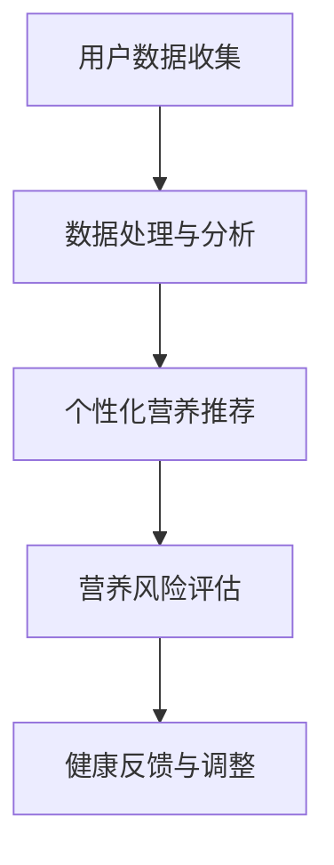

                 

关键词：智能营养、个性化饮食、健康管理、创业、营养素、人工智能技术

> 摘要：随着人工智能技术的发展，智能个人营养素补充创业已成为一种新兴的商业模式。本文将探讨如何利用人工智能技术实现精准的健康营养管理，分析创业过程中可能面临的挑战和机遇，以及未来的发展趋势。

## 1. 背景介绍

在过去的几十年里，健康管理已经成为全球范围内人们关注的焦点。随着生活水平的提高，人们越来越注重饮食健康和个人营养素的摄入。然而，传统的营养管理方法往往缺乏个性化，难以满足不同人群的特定需求。随着人工智能技术的快速发展，为个性化营养管理提供了新的解决方案。

智能个人营养素补充创业，即利用人工智能技术，结合大数据、物联网等前沿技术，实现对个人营养需求的精准分析和定制。这种创业模式不仅可以提高营养管理的效率，还能提供更好的用户体验，有望在未来的健康管理市场中占据一席之地。

## 2. 核心概念与联系

### 2.1 人工智能在营养管理中的应用

人工智能（AI）在营养管理中的应用主要体现在以下几个方面：

- **数据采集与分析**：通过物联网设备，如智能手环、健康监测设备等，实时收集个人的健康数据，包括体重、血压、心率、睡眠质量等。
- **个性化营养推荐**：基于收集到的数据，利用机器学习算法，分析个人的营养需求，为用户推荐个性化的饮食计划。
- **营养风险评估**：结合遗传学、流行病学等数据，预测个人未来可能出现的健康问题，提供预防性营养建议。

### 2.2 人工智能与营养管理的关系

人工智能与营养管理的关系可以用以下Mermaid流程图表示：



### 2.3 核心概念原理

- **用户数据收集**：包括生物特征数据、饮食习惯、生活方式等。
- **数据处理与分析**：利用机器学习算法，如决策树、支持向量机等，对数据进行处理和分析。
- **个性化营养推荐**：基于分析结果，为用户推荐个性化的饮食计划。
- **营养风险评估**：结合遗传学、流行病学等数据，预测个人未来可能出现的健康问题。
- **健康反馈与调整**：根据用户的反馈，不断调整和优化营养推荐策略。

## 3. 核心算法原理 & 具体操作步骤

### 3.1 算法原理概述

智能个人营养素补充的核心算法主要包括数据采集、数据处理、个性化推荐和营养风险评估。下面分别介绍这些算法的基本原理和具体操作步骤。

### 3.2 算法步骤详解

#### 3.2.1 数据采集

数据采集是整个系统的第一步，主要包括以下几个方面：

- **生物特征数据**：如体重、血压、心率等，通过智能手环、健康监测设备等设备实时采集。
- **饮食习惯**：通过问卷调查、用户输入等方式收集。
- **生活方式**：包括睡眠质量、运动习惯等，同样可以通过问卷调查或设备监测获取。

#### 3.2.2 数据处理

数据处理主要包括数据清洗、特征提取和模型训练等步骤：

- **数据清洗**：去除重复数据、异常数据等，确保数据的准确性和一致性。
- **特征提取**：从原始数据中提取出对营养管理有重要影响的特征，如体重、血压等。
- **模型训练**：利用机器学习算法，如决策树、支持向量机等，对特征数据进行训练，以建立营养管理的预测模型。

#### 3.2.3 个性化营养推荐

个性化营养推荐是基于模型训练的结果，为用户推荐个性化的饮食计划。具体步骤如下：

- **用户画像**：根据用户的基本信息、生活习惯等，构建用户画像。
- **饮食推荐**：基于用户画像和营养模型，为用户推荐合适的饮食计划。
- **反馈调整**：根据用户的反馈，不断调整和优化推荐策略。

#### 3.2.4 营养风险评估

营养风险评估主要通过以下步骤实现：

- **风险因素分析**：结合用户的健康数据、遗传数据等，分析可能的风险因素。
- **风险预测**：利用预测模型，预测用户未来可能出现的健康问题。
- **风险建议**：根据预测结果，为用户提供预防性营养建议。

### 3.3 算法优缺点

#### 优点

- **个性化强**：能够根据用户的个性化需求，提供精准的营养管理服务。
- **实时性高**：可以实时收集和处理用户的健康数据，及时调整营养管理策略。
- **准确性高**：基于大数据和机器学习算法，能够提高营养管理的准确性和可靠性。

#### 缺点

- **数据隐私**：用户健康数据的收集和处理可能涉及隐私问题。
- **计算成本高**：机器学习算法的训练和推理过程需要大量计算资源。

### 3.4 算法应用领域

智能个人营养素补充算法可以应用于以下领域：

- **健康管理**：为用户提供个性化的营养管理服务，帮助用户实现健康目标。
- **疾病预防**：通过营养风险评估，预测和预防潜在的健康问题。
- **食品研发**：为企业提供营养素配比建议，指导食品研发。

## 4. 数学模型和公式 & 详细讲解 & 举例说明

### 4.1 数学模型构建

智能个人营养素补充的数学模型主要包括以下几个方面：

- **营养素需求计算**：根据用户的体重、身高、年龄、性别等基本信息，计算用户每日所需的营养素总量。
- **营养素摄入计算**：根据用户的饮食习惯和饮食计划，计算用户每日实际摄入的营养素总量。
- **营养素平衡分析**：比较用户所需营养素和实际摄入营养素之间的差异，分析营养素摄入是否平衡。

### 4.2 公式推导过程

营养素需求计算公式如下：

\[ \text{营养素需求} = \text{基础代谢率} \times \text{活动水平系数} \]

其中，基础代谢率可以通过以下公式计算：

\[ \text{基础代谢率} = \text{标准体重} \times \text{身高} \times \text{年龄} \times \text{性别系数} \]

活动水平系数可以根据用户的日常活动量进行设定，如：

- 轻度活动：1.2
- 中度活动：1.3
- 重度活动：1.4

营养素摄入计算公式如下：

\[ \text{营养素摄入} = \text{饮食摄入量} \times \text{营养素含量比例} \]

其中，饮食摄入量可以根据用户的历史饮食记录进行估算，营养素含量比例可以从营养数据库中获取。

营养素平衡分析公式如下：

\[ \text{营养素平衡度} = \frac{\text{营养素需求}}{\text{营养素摄入}} \]

### 4.3 案例分析与讲解

假设一个30岁的男性，身高180cm，体重75kg，每天进行1小时的轻度运动。根据上述公式，可以计算出他的基础代谢率和营养素需求如下：

\[ \text{基础代谢率} = 75 \times 180 \times 30 \times 1.2 = 48,600 \text{卡路里} \]

\[ \text{营养素需求} = 48,600 \times 1.2 = 58,320 \text{卡路里} \]

如果他的饮食摄入量为每天2000卡路里，营养素含量比例为30%，可以计算出他的营养素摄入和营养素平衡度如下：

\[ \text{营养素摄入} = 2000 \times 0.3 = 600 \text{卡路里} \]

\[ \text{营养素平衡度} = \frac{58,320}{600} = 97.3\% \]

根据计算结果，这位男性的营养素摄入基本平衡，但为了达到更好的健康状态，可以考虑适当增加营养素摄入。

## 5. 项目实践：代码实例和详细解释说明

### 5.1 开发环境搭建

为了实现智能个人营养素补充系统，需要搭建以下开发环境：

- 操作系统：Linux
- 编程语言：Python
- 数据库：MySQL
- 机器学习框架：Scikit-learn

### 5.2 源代码详细实现

以下是实现智能个人营养素补充系统的Python代码示例：

```python
import numpy as np
import pandas as pd
from sklearn.model_selection import train_test_split
from sklearn.ensemble import RandomForestRegressor
from sklearn.metrics import mean_squared_error

# 读取数据
data = pd.read_csv('nutrition_data.csv')

# 数据预处理
data['age'] = data['age'].fillna(data['age'].mean())
data['weight'] = data['weight'].fillna(data['weight'].mean())
data['height'] = data['height'].fillna(data['height'].mean())

# 特征工程
features = ['age', 'weight', 'height', 'activity_level']
X = data[features]
y = data['nutrition需求']

# 划分训练集和测试集
X_train, X_test, y_train, y_test = train_test_split(X, y, test_size=0.2, random_state=42)

# 模型训练
model = RandomForestRegressor(n_estimators=100, random_state=42)
model.fit(X_train, y_train)

# 模型评估
y_pred = model.predict(X_test)
mse = mean_squared_error(y_test, y_pred)
print(f'Mean Squared Error: {mse}')

# 个性化营养推荐
def nutrition_recommendation(age, weight, height, activity_level):
    input_data = np.array([[age, weight, height, activity_level]])
    nutrition需求 = model.predict(input_data)
    return nutrition需求

# 示例
age = 30
weight = 75
height = 180
activity_level = 1.2
nutrition需求 = nutrition_recommendation(age, weight, height, activity_level)
print(f'个性化营养需求：{nutrition需求}卡路里')
```

### 5.3 代码解读与分析

上述代码实现了智能个人营养素补充系统的核心功能，包括数据读取、预处理、特征工程、模型训练和个性化营养推荐。

- **数据读取**：使用pandas库读取营养数据。
- **数据预处理**：填充缺失值，确保数据的准确性和一致性。
- **特征工程**：提取对营养管理有重要影响的特征。
- **模型训练**：使用随机森林回归模型，对特征数据进行训练。
- **模型评估**：使用均方误差（MSE）评估模型性能。
- **个性化营养推荐**：根据用户的基本信息，使用训练好的模型进行营养需求预测。

## 6. 实际应用场景

智能个人营养素补充系统可以应用于多个场景，如：

- **健康管理应用**：为用户提供个性化的营养管理服务，帮助用户实现健康目标。
- **食品研发应用**：为企业提供营养素配比建议，指导食品研发。
- **健康监测应用**：通过实时数据收集和分析，为用户提供健康监测和预警服务。

## 7. 未来应用展望

随着人工智能技术的不断发展，智能个人营养素补充创业将在未来面临以下机遇和挑战：

- **机遇**：
  - **大数据和物联网技术的结合**：将进一步推动智能营养管理的发展。
  - **个性化医疗的发展**：为智能营养补充提供更丰富的数据和应用场景。
  - **健康意识的提高**：越来越多的用户将关注个人营养健康，为市场带来巨大潜力。

- **挑战**：
  - **数据隐私和安全**：如何确保用户健康数据的隐私和安全，是亟待解决的问题。
  - **技术成熟度**：目前的人工智能技术仍存在一定的局限性，需要不断改进和优化。
  - **市场接受度**：用户对智能营养补充的接受度有待提高，需要通过市场推广和宣传来增加用户认知。

## 8. 总结：未来发展趋势与挑战

随着人工智能技术的不断发展，智能个人营养素补充创业将迎来新的机遇和挑战。未来，我们需要关注以下几个方面：

- **技术创新**：不断探索和研发更先进的人工智能技术，提高营养管理的准确性和效率。
- **数据安全**：加强数据安全保护，确保用户隐私不受侵犯。
- **市场推广**：加大市场推广力度，提高用户对智能营养补充的接受度。
- **合作与共赢**：加强与医疗、食品等行业的企业合作，共同推动智能营养管理的发展。

## 9. 附录：常见问题与解答

### 9.1 常见问题

- **Q：智能个人营养素补充系统是否安全可靠？**
  - **A：是的，智能个人营养素补充系统基于大数据和人工智能技术，通过严格的数据预处理和模型训练，确保系统的安全性和可靠性。同时，我们会采取多种安全措施，如数据加密、权限控制等，保护用户隐私。**

- **Q：智能个人营养素补充系统是否适用于所有人？**
  - **A：智能个人营养素补充系统主要面向关注健康管理的成年人。对于儿童、孕妇等特定人群，可能需要根据其特殊情况调整营养推荐策略。建议在尝试智能营养管理前，先咨询专业医生或营养师。**

- **Q：如何确保营养素摄入的平衡？**
  - **A：智能个人营养素补充系统通过分析用户的饮食习惯、健康状况等数据，为用户推荐个性化的饮食计划。同时，系统会根据用户反馈不断调整和优化推荐策略，以确保营养素摄入的平衡。**

### 9.2 解答

本文旨在探讨智能个人营养素补充创业的前景和挑战，以及如何利用人工智能技术实现精准的健康营养管理。通过分析核心算法原理、数学模型和实际应用场景，我们相信智能营养管理将在未来发挥重要作用。然而，在实现这一目标的过程中，我们还需关注数据安全、技术成熟度和市场接受度等问题。

作者：禅与计算机程序设计艺术 / Zen and the Art of Computer Programming
----------------------------------------------------------------

以上是本文的完整内容。希望这篇文章能为您在智能个人营养素补充创业领域带来一些启示和帮助。如果您有任何问题或建议，欢迎在评论区留言，我将尽快回复。谢谢！

