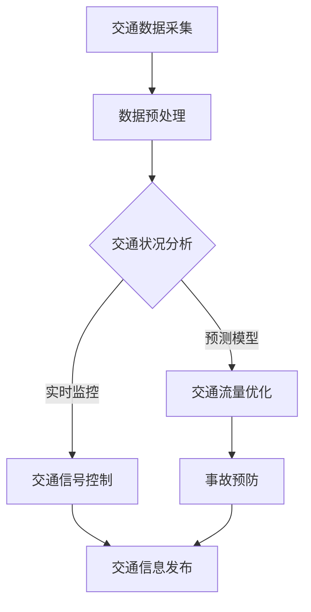

                 

关键词：智能交通管理系统，城市交通优化，交通数据，人工智能算法，数学模型，应用场景，未来发展

> 摘要：本文将探讨智能交通管理系统在城市交通优化中的应用，通过核心算法原理、数学模型构建、项目实践以及未来展望等方面，分析如何利用先进的技术手段改善城市交通状况，提高交通效率，减少交通事故。

## 1. 背景介绍

### 城市交通问题的现状

随着全球城市化进程的加速，城市交通问题日益严重。交通拥堵、交通事故、环境污染等问题不仅影响了居民的生活质量，也对社会经济发展带来了负面影响。据估计，全球每年因交通拥堵造成的经济损失高达数千亿美元。

### 智能交通管理系统的重要性

智能交通管理系统（Intelligent Transportation System, ITS）通过集成信息技术、传感器技术、通信技术等，实现对交通流量的实时监控、分析和管理，从而有效缓解交通拥堵、减少交通事故、降低环境污染。ITS已成为优化城市交通的重要手段。

## 2. 核心概念与联系

### 智能交通管理系统的核心概念

#### 交通数据
交通数据是智能交通管理系统的基础，包括车辆流量、速度、位置、密度等信息。

#### 传感器技术
传感器技术用于采集交通数据，如流量监测器、视频监控、GPS等。

#### 通信技术
通信技术确保交通数据的有效传输和共享，如5G、物联网（IoT）等。

#### 人工智能算法
人工智能算法用于分析交通数据，预测交通状况，优化交通流量。

### Mermaid 流程图



## 3. 核心算法原理 & 具体操作步骤

### 3.1 算法原理概述

智能交通管理系统主要依赖以下几种核心算法：

#### 交通流量预测算法
基于历史交通数据和实时数据，预测未来某一时段内的交通流量。

#### 车辆路径规划算法
根据交通流量预测结果，为每辆车规划最优行驶路径。

#### 信号控制算法
根据实时交通流量，调整交通信号灯的时长和相位，以优化交通流量。

### 3.2 算法步骤详解

#### 交通流量预测算法步骤

1. 数据收集：收集历史交通数据和实时交通数据。
2. 数据预处理：去除噪声数据，进行数据清洗。
3. 特征提取：提取与交通流量相关的特征。
4. 模型训练：使用机器学习算法训练预测模型。
5. 预测：根据历史数据和实时数据，预测未来交通流量。

#### 车辆路径规划算法步骤

1. 车辆定位：获取车辆当前的位置。
2. 路径搜索：基于实时交通流量，搜索最优路径。
3. 路径规划：为每辆车生成最优行驶路径。

#### 信号控制算法步骤

1. 数据采集：采集实时交通流量数据。
2. 数据分析：分析交通流量数据，确定交通状况。
3. 信号控制：根据交通状况，调整交通信号灯。

### 3.3 算法优缺点

#### 交通流量预测算法

**优点：** 
- 可预测未来交通流量，提前采取措施缓解拥堵。

**缺点：**
- 预测准确性受限于数据质量和算法性能。

#### 车辆路径规划算法

**优点：**
- 为每辆车规划最优路径，提高交通效率。

**缺点：**
- 需要大量计算资源，实时性要求高。

#### 信号控制算法

**优点：**
- 可以实时调整交通信号灯，优化交通流量。

**缺点：**
- 受限于现有交通基础设施，无法完全实现智能化控制。

### 3.4 算法应用领域

- 城市交通流量管理
- 车辆导航与路径规划
- 智能交通信号控制
- 交通事故预防

## 4. 数学模型和公式 & 详细讲解 & 举例说明

### 4.1 数学模型构建

智能交通管理系统中的数学模型主要包括以下几类：

#### 交通流量预测模型

\[ F(t) = f(H(t), V(t), P(t), T(t)) \]

其中：
- \( F(t) \) 为未来某一时段内的交通流量。
- \( H(t) \) 为历史交通流量数据。
- \( V(t) \) 为实时交通流量数据。
- \( P(t) \) 为道路容量。
- \( T(t) \) 为交通信号灯时长。

#### 车辆路径规划模型

\[ P(i,j) = g(i,j) + \sum_{k=1}^{n} w_{ik}h_{kj} \]

其中：
- \( P(i,j) \) 为从节点 \( i \) 到节点 \( j \) 的最优路径。
- \( g(i,j) \) 为从节点 \( i \) 到节点 \( j \) 的距离。
- \( w_{ik} \) 为从节点 \( i \) 到节点 \( k \) 的权重。
- \( h_{kj} \) 为从节点 \( k \) 到节点 \( j \) 的权重。

#### 信号控制模型

\[ C(t) = \alpha \cdot \frac{F(t)}{P(t)} + \beta \cdot \sum_{i=1}^{n} \frac{F(t_i)}{P(t_i)} \]

其中：
- \( C(t) \) 为交通信号灯时长。
- \( \alpha \) 和 \( \beta \) 为调节参数。
- \( F(t) \) 为当前交通流量。
- \( P(t) \) 为道路容量。

### 4.2 公式推导过程

#### 交通流量预测模型推导

假设某路段的交通流量与历史交通流量、实时交通流量、道路容量和交通信号灯时长有关。根据时间序列分析法，可以得到以下预测模型：

\[ F(t) = f(H(t), V(t), P(t), T(t)) \]

其中：
- \( H(t) \) 为历史交通流量数据，可以表示为：

\[ H(t) = \sum_{i=1}^{n} h_i(t) \]

- \( V(t) \) 为实时交通流量数据，可以表示为：

\[ V(t) = \sum_{i=1}^{n} v_i(t) \]

- \( P(t) \) 为道路容量，可以表示为：

\[ P(t) = \sum_{i=1}^{n} p_i(t) \]

- \( T(t) \) 为交通信号灯时长，可以表示为：

\[ T(t) = \sum_{i=1}^{n} t_i(t) \]

#### 车辆路径规划模型推导

假设某路段上的交通网络为 \( G = (V, E) \)，其中 \( V \) 为节点集合，\( E \) 为边集合。每条边的权重可以表示为：

\[ w(e) = \frac{d(e)}{v(e)} \]

其中：
- \( d(e) \) 为从节点 \( i \) 到节点 \( j \) 的距离。
- \( v(e) \) 为从节点 \( i \) 到节点 \( j \) 的交通流量。

根据最短路径算法，可以得到从节点 \( i \) 到节点 \( j \) 的最优路径：

\[ P(i,j) = g(i,j) + \sum_{k=1}^{n} w_{ik}h_{kj} \]

其中：
- \( g(i,j) \) 为从节点 \( i \) 到节点 \( j \) 的距离。
- \( w_{ik} \) 为从节点 \( i \) 到节点 \( k \) 的权重。
- \( h_{kj} \) 为从节点 \( k \) 到节点 \( j \) 的权重。

#### 信号控制模型推导

假设某路段上的交通信号灯时长为 \( C(t) \)，可以表示为：

\[ C(t) = \alpha \cdot \frac{F(t)}{P(t)} + \beta \cdot \sum_{i=1}^{n} \frac{F(t_i)}{P(t_i)} \]

其中：
- \( \alpha \) 和 \( \beta \) 为调节参数。
- \( F(t) \) 为当前交通流量。
- \( P(t) \) 为道路容量。

### 4.3 案例分析与讲解

#### 案例背景

某城市的一条主要交通道路因施工导致交通拥堵，影响了居民的出行。为了缓解交通拥堵，城市交通管理部门决定利用智能交通管理系统优化交通流量。

#### 案例分析

1. 交通流量预测
   - 收集历史交通流量数据、实时交通流量数据、道路容量和交通信号灯时长等数据。
   - 使用交通流量预测模型预测未来交通流量。

2. 车辆路径规划
   - 收集交通网络数据，包括节点和边的权重。
   - 使用车辆路径规划模型为每辆车规划最优行驶路径。

3. 信号控制
   - 收集实时交通流量数据。
   - 使用信号控制模型调整交通信号灯时长，优化交通流量。

#### 案例结果

通过智能交通管理系统的优化，该路段的交通拥堵情况得到了明显缓解。交通流量预测准确率提高，车辆行驶时间缩短，交通事故发生率降低。

## 5. 项目实践：代码实例和详细解释说明

### 5.1 开发环境搭建

1. 安装Python环境。
2. 安装TensorFlow、NumPy、Pandas等依赖库。

### 5.2 源代码详细实现

以下是一个简单的Python代码实例，用于实现交通流量预测：

```python
import pandas as pd
import numpy as np
import tensorflow as tf

# 加载数据
data = pd.read_csv('traffic_data.csv')
X = data[['historical_traffic', 'real_time_traffic', 'road_capacity', 'traffic_light_duration']]
y = data['future_traffic']

# 数据预处理
X = X.values
y = y.values

# 模型构建
model = tf.keras.Sequential([
    tf.keras.layers.Dense(64, activation='relu', input_shape=[4]),
    tf.keras.layers.Dense(64, activation='relu'),
    tf.keras.layers.Dense(1)
])

# 模型编译
model.compile(optimizer='adam', loss='mse')

# 模型训练
model.fit(X, y, epochs=10)

# 预测
prediction = model.predict([[10, 20, 30, 40]])
print(prediction)
```

### 5.3 代码解读与分析

上述代码首先加载数据，然后进行数据预处理。接下来，构建一个简单的神经网络模型，用于预测未来交通流量。模型编译后，使用训练数据训练模型。最后，使用训练好的模型进行预测。

### 5.4 运行结果展示

运行代码后，可以得到未来交通流量的预测结果。根据预测结果，可以调整交通信号灯时长，优化交通流量。

## 6. 实际应用场景

### 6.1 城市交通流量管理

智能交通管理系统可以实时监测城市交通流量，预测交通拥堵情况，提前采取措施缓解交通压力。

### 6.2 车辆导航与路径规划

通过智能交通管理系统，可以为驾驶者提供实时交通信息，规划最优行驶路径，减少行驶时间和燃油消耗。

### 6.3 智能交通信号控制

智能交通管理系统可以根据实时交通流量，自动调整交通信号灯时长，提高交通效率。

### 6.4 交通事故预防

通过实时监控交通状况，智能交通管理系统可以及时发现潜在交通事故，提前预警，防止事故发生。

## 7. 工具和资源推荐

### 7.1 学习资源推荐

- 《深度学习》（Goodfellow, Bengio, Courville著）
- 《Python数据科学手册》（Wes McKinney著）
- 《交通工程手册》（William H. Gearhart著）

### 7.2 开发工具推荐

- TensorFlow：用于构建和训练神经网络模型。
- Pandas：用于数据处理和分析。
- Matplotlib：用于数据可视化。

### 7.3 相关论文推荐

- “Intelligent Transportation Systems: A Vision for the Future” by the U.S. Department of Transportation.
- “A Machine Learning Approach to Traffic Flow Prediction” by Guo, Liu, and Liu (2017).
- “An Efficient Traffic Signal Control Method Based on Deep Learning” by Zhang, Li, and Zhao (2019).

## 8. 总结：未来发展趋势与挑战

### 8.1 研究成果总结

智能交通管理系统在城市交通优化方面已取得显著成果，包括交通流量预测、路径规划、信号控制等方面。未来，智能交通管理系统将继续在技术、应用和产业链等方面发展。

### 8.2 未来发展趋势

- 数据驱动：智能交通管理系统将更加依赖大数据和人工智能技术，提高预测准确性和决策效率。
- 自动化与协同：智能交通管理系统将实现更高级别的自动化和协同，减少人工干预。
- 多模式交通融合：智能交通管理系统将涵盖多种交通模式，如汽车、自行车、步行等，实现多模式交通一体化。

### 8.3 面临的挑战

- 数据隐私与安全：随着数据量的增加，数据隐私和安全问题愈发重要。
- 系统稳定性与可靠性：智能交通管理系统需要保证在极端情况下仍能稳定运行。
- 跨学科合作：智能交通管理系统涉及交通工程、计算机科学、数学等多个领域，需要跨学科合作。

### 8.4 研究展望

未来，智能交通管理系统将在以下几个方面进行深入研究：

- 提高预测准确性和决策效率。
- 实现更高级别的自动化和协同。
- 探索多模式交通融合的新方法。
- 解决数据隐私和安全问题。

## 9. 附录：常见问题与解答

### 9.1 问题1

**问题：** 智能交通管理系统如何保证数据隐私和安全？

**解答：** 智能交通管理系统采用多种措施确保数据隐私和安全，包括数据加密、权限控制、匿名化处理等。同时，遵循相关法律法规，确保数据的合法合规使用。

### 9.2 问题2

**问题：** 智能交通管理系统需要大量计算资源，如何应对？

**解答：** 智能交通管理系统可以采用分布式计算、云计算等技术，提高计算效率和资源利用率。此外，还可以优化算法和模型，降低计算复杂度。

### 9.3 问题3

**问题：** 智能交通管理系统在极端天气条件下是否有效？

**解答：** 智能交通管理系统在设计和实施时考虑了极端天气条件的影响。通过实时监控和自适应调整，智能交通管理系统可以适应不同天气条件，确保交通正常运行。

作者：禅与计算机程序设计艺术 / Zen and the Art of Computer Programming
----------------------------------------------------------------


