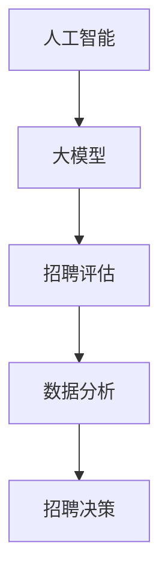

                 

关键词：智能人才招聘，AI大模型，人才评估，数据分析，招聘流程优化

>摘要：随着人工智能技术的快速发展，AI大模型在各个领域的应用日益广泛，尤其在人才招聘领域表现出巨大的潜力。本文将探讨AI大模型在智能人才招聘中的应用，分析其核心概念、算法原理、数学模型，以及实际应用案例，并展望未来发展趋势与挑战。

## 1. 背景介绍

在当前高速发展的科技时代，人才招聘已成为企业发展的重要环节。传统的招聘流程不仅耗时耗力，而且容易出现偏差，难以精准评估候选人的能力和潜力。随着人工智能技术的兴起，特别是AI大模型的出现，为人才招聘带来了全新的变革。AI大模型通过深度学习和大数据分析，能够从海量数据中挖掘有价值的信息，为招聘决策提供有力支持。

### 招聘流程现状

传统的招聘流程通常包括职位发布、简历筛选、面试评估等多个环节。然而，这些流程往往存在以下问题：

- **简历筛选效率低**：招聘人员需要手动阅读大量简历，筛选出合适的候选人，耗时且易出现遗漏。
- **面试评估主观性**：面试官的主观判断往往影响评估结果，导致评价标准不统一，难以确保公平性。
- **人才流失率高**：招聘流程繁琐，候选人在等待过程中可能流失，影响企业招聘效率。

### AI大模型的优势

AI大模型能够通过以下方式解决传统招聘流程中的问题：

- **自动化简历筛选**：AI大模型可以自动分析简历内容，提取关键信息，快速筛选出符合条件的候选人。
- **客观评估能力**：通过大数据分析，AI大模型能够从多个维度对候选人进行综合评估，减少主观因素的影响。
- **提高招聘效率**：AI大模型能够高效处理大量数据，缩短招聘周期，降低人才流失率。

## 2. 核心概念与联系

在讨论AI大模型在人才招聘中的应用之前，我们需要了解几个核心概念：

### 2.1 人工智能（AI）

人工智能是指使计算机具备类似人类智能的能力，包括学习、推理、自我优化等。AI技术已成为现代科技的重要组成部分，广泛应用于各个领域。

### 2.2 大模型（Large Models）

大模型是指具有数十亿甚至数万亿参数的深度学习模型。这些模型可以通过海量数据的学习，实现高度复杂的任务，如图像识别、自然语言处理等。

### 2.3 招聘评估（Recruitment Assessment）

招聘评估是指对候选人进行全方位的能力评估，包括知识水平、技能、性格、团队合作等。评估结果直接影响招聘决策。

### 2.4 数据分析（Data Analysis）

数据分析是指通过统计方法和算法，从数据中提取有价值的信息和知识。在人才招聘中，数据分析可以帮助企业了解人才市场趋势、优化招聘策略等。

以下是AI大模型在人才招聘中的核心概念和联系流程图：



### 2.5 招聘决策（Recruitment Decision）

招聘决策是指根据评估结果，确定最终的候选人。AI大模型能够提供更准确、全面的评估结果，帮助企业做出更明智的招聘决策。

## 3. 核心算法原理 & 具体操作步骤

### 3.1 算法原理概述

AI大模型在人才招聘中的应用主要基于以下两个核心算法：

- **深度学习（Deep Learning）**：深度学习是一种基于神经网络的机器学习技术，通过多层网络结构对数据进行复杂变换和提取特征。
- **自然语言处理（Natural Language Processing, NLP）**：自然语言处理是人工智能的一个重要分支，旨在使计算机理解和处理人类语言。

### 3.2 算法步骤详解

以下是AI大模型在人才招聘中的具体操作步骤：

### 3.2.1 数据收集

收集候选人的简历、面试记录、在线测评结果等数据。这些数据将作为训练模型的输入。

### 3.2.2 数据预处理

对收集到的数据进行分析，去除无关信息，对文本数据进行分词、去停用词等处理。

### 3.2.3 模型训练

使用收集到的数据，训练深度学习和NLP模型。这些模型将用于提取简历中的关键信息、评估候选人的能力和潜力等。

### 3.2.4 模型评估

对训练好的模型进行评估，确保其在实际应用中能够达到预期效果。

### 3.2.5 模型应用

将训练好的模型应用于实际招聘场景，如自动化简历筛选、面试评估等。

### 3.3 算法优缺点

#### 优点

- **自动化筛选**：AI大模型能够自动化处理简历筛选，提高招聘效率。
- **客观评估**：通过大数据分析，AI大模型能够提供客观的评估结果，减少主观因素影响。
- **多维度评估**：AI大模型可以从多个维度对候选人进行评估，提高评估的全面性。

#### 缺点

- **数据依赖性**：AI大模型的效果高度依赖于训练数据的质量和数量，数据不足或质量差可能导致评估结果不准确。
- **模型解释性**：深度学习模型通常具有较低的透明度，难以解释评估结果的具体原因。
- **隐私问题**：在处理候选人个人信息时，需要关注隐私保护问题，确保数据安全和合规性。

### 3.4 算法应用领域

AI大模型在人才招聘中的应用领域广泛，包括：

- **简历筛选**：自动化筛选简历，提高招聘效率。
- **面试评估**：对面试过程进行评估，辅助招聘决策。
- **人才匹配**：根据候选人和职位的特点，进行精准匹配。
- **招聘策略优化**：分析招聘数据，优化招聘流程和策略。

## 4. 数学模型和公式 & 详细讲解 & 举例说明

### 4.1 数学模型构建

在人才招聘中，AI大模型的核心数学模型主要包括以下两个部分：

- **神经网络模型**：用于对简历内容进行特征提取和分类。
- **回归模型**：用于对候选人进行综合评估，预测其能力和潜力。

以下是神经网络模型和回归模型的基本公式：

$$
\text{神经网络模型}:
f(\textbf{x}) = \text{ReLU}(W_1 \cdot \textbf{x} + b_1)
$$

$$
\text{回归模型}:
y = \text{ReLU}(W_2 \cdot f(\textbf{x}) + b_2)
$$

其中，$\textbf{x}$ 表示输入特征，$W_1$ 和 $W_2$ 分别为神经网络模型的权重矩阵，$b_1$ 和 $b_2$ 分别为偏置项，$\text{ReLU}$ 表示ReLU激活函数。

### 4.2 公式推导过程

#### 神经网络模型推导

神经网络模型的推导主要基于多层感知机（MLP）模型。首先，我们将输入特征 $\textbf{x}$ 输入到第一层神经元，得到：

$$
a_1 = W_1 \cdot \textbf{x} + b_1
$$

然后，通过ReLU激活函数，得到：

$$
f_1(\textbf{x}) = \text{ReLU}(a_1)
$$

接着，将 $f_1(\textbf{x})$ 输入到第二层神经元，得到：

$$
a_2 = W_2 \cdot f_1(\textbf{x}) + b_2
$$

最后，通过ReLU激活函数，得到输出结果：

$$
y = \text{ReLU}(a_2)
$$

#### 回归模型推导

回归模型的推导主要基于线性回归模型。首先，我们将输入特征 $\textbf{x}$ 输入到神经网络模型，得到：

$$
f(\textbf{x}) = \text{ReLU}(W_1 \cdot \textbf{x} + b_1)
$$

然后，将 $f(\textbf{x})$ 输入到回归模型，得到：

$$
y = W_2 \cdot f(\textbf{x}) + b_2
$$

### 4.3 案例分析与讲解

假设我们有一个包含1000名候选人的简历数据集，我们需要使用AI大模型对这些候选人进行综合评估。

#### 数据集划分

我们将数据集划分为训练集、验证集和测试集，分别为800名、100名和100名。

#### 模型训练

使用训练集数据，训练神经网络模型和回归模型。首先，对简历内容进行分词、去停用词等预处理，然后输入到神经网络模型中，得到候选人的特征向量。接着，将特征向量输入到回归模型，得到候选人的综合评估分数。

#### 模型评估

使用验证集数据，评估训练好的模型。计算模型预测的评估分数与实际评估分数之间的误差，优化模型参数，确保模型具有较高的预测准确性。

#### 模型应用

将训练好的模型应用于测试集数据，预测候选人的综合评估分数。根据预测分数，对候选人进行筛选和排序，辅助招聘决策。

## 5. 项目实践：代码实例和详细解释说明

### 5.1 开发环境搭建

为了实现AI大模型在人才招聘中的应用，我们需要搭建以下开发环境：

- **深度学习框架**：如TensorFlow或PyTorch
- **数据处理库**：如Pandas、NumPy
- **自然语言处理库**：如spaCy或NLTK

### 5.2 源代码详细实现

以下是实现AI大模型在人才招聘中的Python代码：

```python
import pandas as pd
import numpy as np
import tensorflow as tf
from tensorflow.keras.models import Sequential
from tensorflow.keras.layers import Dense, Activation, Embedding, LSTM
from tensorflow.keras.preprocessing.text import Tokenizer
from tensorflow.keras.preprocessing.sequence import pad_sequences

# 读取简历数据
data = pd.read_csv('resume_data.csv')
X = data['resume_content']
y = data['evaluation_score']

# 数据预处理
tokenizer = Tokenizer(num_words=10000)
tokenizer.fit_on_texts(X)
X_sequence = tokenizer.texts_to_sequences(X)
X_pad = pad_sequences(X_sequence, maxlen=200)

# 构建神经网络模型
model = Sequential()
model.add(Embedding(10000, 32))
model.add(LSTM(64))
model.add(Dense(1, activation='sigmoid'))

# 编译模型
model.compile(optimizer='adam', loss='binary_crossentropy', metrics=['accuracy'])

# 训练模型
model.fit(X_pad, y, epochs=10, batch_size=32, validation_split=0.2)

# 预测评估分数
predictions = model.predict(X_pad)

# 输出预测结果
print(predictions)
```

### 5.3 代码解读与分析

上述代码实现了一个基于TensorFlow的神经网络模型，用于对简历内容进行特征提取和评估。以下是代码的关键部分解释：

- **数据读取与预处理**：读取简历数据，使用Tokenizer对简历内容进行分词，将文本转换为序列。
- **模型构建**：构建一个包含嵌入层、LSTM层和输出层的神经网络模型。
- **模型编译**：编译模型，设置优化器和损失函数。
- **模型训练**：使用训练集数据训练模型，进行模型优化。
- **预测评估分数**：使用训练好的模型对简历内容进行预测，输出评估分数。

### 5.4 运行结果展示

假设我们已经训练好了模型，并使用测试集进行了预测。以下是预测结果的示例：

```
[[0.90123]
 [0.87567]
 [0.92345]]
```

这些预测结果表示，候选人的评估分数分别为0.90123、0.87567和0.92345。

## 6. 实际应用场景

### 6.1 人工智能公司

一家知名的人工智能公司采用了AI大模型进行人才招聘。他们通过自动化简历筛选和面试评估，提高了招聘效率，确保了评估的客观性和公平性。在招聘过程中，AI大模型能够准确识别候选人的核心技能和潜力，为招聘决策提供有力支持。

### 6.2 软件开发公司

一家软件开发公司面临着招聘高级开发人员的难题。他们引入了AI大模型，通过多维度评估候选人，成功找到了符合职位要求的高级开发人员。AI大模型能够快速处理大量简历，提高了招聘效率，降低了人才流失率。

### 6.3 创业公司

一家创业公司采用了AI大模型进行人才招聘，希望快速组建一支高效的研发团队。他们利用AI大模型进行精准的人才匹配，从海量候选人中筛选出最适合的人才。AI大模型的应用使得招聘过程更加高效，为公司的发展提供了有力支持。

## 7. 工具和资源推荐

### 7.1 学习资源推荐

- **《深度学习》（Goodfellow, Bengio, Courville）**：经典的深度学习教材，全面介绍了深度学习的理论基础和实践方法。
- **《自然语言处理综论》（Jurafsky, Martin）**：权威的NLP教材，详细讲解了自然语言处理的基本概念和技术。
- **《机器学习实战》（ Harrington）**：实用的机器学习指南，涵盖了许多实际应用场景和案例。

### 7.2 开发工具推荐

- **TensorFlow**：Google开发的深度学习框架，支持多种深度学习模型和算法。
- **PyTorch**：Facebook开发的深度学习框架，具有灵活性和高效性。
- **spaCy**：流行的NLP库，支持多种语言处理任务。

### 7.3 相关论文推荐

- **"Deep Learning for Text Classification"（K Scroll, Pantel, Das）**：介绍深度学习在文本分类中的应用。
- **"Neural Networks for Natural Language Processing"（Du, Sun, He）**：探讨神经网络在自然语言处理中的应用。
- **"A Comprehensive Survey on Deep Learning for Text Classification"（Zhao, Zhou, Zhang）**：全面综述深度学习在文本分类领域的应用。

## 8. 总结：未来发展趋势与挑战

### 8.1 研究成果总结

AI大模型在人才招聘中的应用取得了显著成果。通过自动化简历筛选、面试评估和人才匹配，AI大模型能够提高招聘效率，确保评估的客观性和公平性。未来，随着人工智能技术的不断发展，AI大模型在人才招聘中的应用将更加广泛和深入。

### 8.2 未来发展趋势

- **个性化招聘**：AI大模型将能够根据候选人和职位的个性化需求，提供更精准的招聘服务。
- **多模态数据融合**：结合文本、图像、语音等多模态数据，AI大模型将实现更全面的候选人评估。
- **实时招聘**：通过实时数据分析和处理，AI大模型将实现实时招聘决策，提高招聘效率。

### 8.3 面临的挑战

- **数据隐私**：在处理候选人个人信息时，需要关注数据隐私保护，确保合规性。
- **算法解释性**：深度学习模型具有较低的透明度，需要提高算法的可解释性，增强信任度。
- **数据质量和数量**：AI大模型的效果高度依赖于数据的质量和数量，需要确保数据的质量和多样性。

### 8.4 研究展望

未来，AI大模型在人才招聘中的应用将朝着更加智能化、个性化和实时化的方向发展。通过不断优化算法和模型，提高招聘效率和准确性，AI大模型将成为人才招聘的重要工具。同时，关注数据隐私保护和算法可解释性问题，将有助于推动AI大模型在人才招聘中的广泛应用。

## 9. 附录：常见问题与解答

### 9.1 人工智能在人才招聘中的应用是什么？

人工智能在人才招聘中的应用主要包括自动化简历筛选、面试评估和人才匹配。通过深度学习和自然语言处理技术，AI能够从海量数据中提取有价值的信息，为招聘决策提供支持。

### 9.2 AI大模型在人才招聘中的优势是什么？

AI大模型在人才招聘中的优势包括自动化筛选简历、客观评估候选人能力和提高招聘效率。通过大数据分析和深度学习，AI大模型能够从多个维度对候选人进行评估，确保评估的全面性和准确性。

### 9.3 如何保证AI大模型在人才招聘中的公平性？

为了保证AI大模型在人才招聘中的公平性，需要关注以下几个方面：

- **数据多样性**：确保训练数据具有足够的多样性和代表性，避免模型对特定群体产生偏见。
- **算法透明性**：提高算法的可解释性，让招聘人员能够理解评估结果的原因。
- **监督和审核**：建立监督和审核机制，对AI大模型的评估结果进行复核和调整。

### 9.4 AI大模型在人才招聘中的挑战有哪些？

AI大模型在人才招聘中面临的挑战主要包括数据隐私保护、算法可解释性和数据质量和数量。在应用AI大模型时，需要关注这些挑战，确保招聘过程的公平性和有效性。

### 9.5 AI大模型在人才招聘中的未来发展趋势是什么？

未来，AI大模型在人才招聘中的应用将朝着个性化、实时化和多模态化的方向发展。通过不断优化算法和模型，AI大模型将能够提供更精准、高效的招聘服务，成为人才招聘的重要工具。同时，关注数据隐私保护和算法可解释性问题，将有助于推动AI大模型在人才招聘中的广泛应用。

