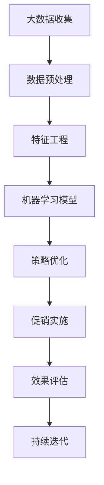

                 

关键词：智能促销、大数据分析、机器学习、消费者行为、电子商务、营销策略、实践效果

> 摘要：随着大数据和人工智能技术的发展，智能促销策略在电子商务领域得到了广泛应用。本文将深入探讨智能促销策略的核心概念、原理、算法、数学模型、实践案例，以及其在未来应用场景中的潜在价值和挑战。通过实际项目和代码实例，本文旨在为读者提供全面了解智能促销策略的实践效果。

## 1. 背景介绍

在当今数字化的商业环境中，消费者行为的数据化已成为企业营销决策的关键。电子商务企业通过收集和分析用户数据，能够更精确地预测消费者的需求和行为，从而制定出个性化的促销策略。智能促销策略是指利用大数据分析和机器学习算法，为不同消费者群体提供定制化的促销活动，以最大化销售业绩和客户满意度。

智能促销策略的核心在于数据的收集、分析和利用。大数据技术使得企业能够获取海量的用户行为数据，包括浏览历史、购买记录、搜索偏好等。通过机器学习算法，这些数据被转化为可操作的洞察，帮助企业识别潜在客户、优化营销渠道和提升转化率。

### 1.1 智能促销策略的兴起

智能促销策略的兴起得益于以下几个方面：

1. **数据量的爆发式增长**：互联网和移动互联网的普及，使得电子商务企业能够获取大量用户行为数据。
2. **计算能力的提升**：高性能计算和云计算的发展，使得数据处理和分析的效率大大提高。
3. **算法的进步**：机器学习算法的不断优化，使得数据分析的深度和精度得到了显著提升。

### 1.2 智能促销策略的优势

智能促销策略相较于传统促销策略具有以下优势：

1. **个性化推荐**：根据用户的历史行为和偏好，为用户提供个性化的促销信息。
2. **高效营销**：通过精准定位目标客户，减少无效营销，提高营销效果。
3. **持续优化**：基于实时数据反馈，不断优化促销策略，提升客户满意度。

## 2. 核心概念与联系

智能促销策略的实现依赖于多个核心概念和技术的结合。以下是一个简化的 Mermaid 流程图，展示了这些概念和技术之间的关系：



### 2.1 大数据收集

大数据收集是智能促销策略的基础。通过收集用户行为数据，企业能够获取丰富的信息，包括用户的浏览历史、购买记录、搜索关键词等。这些数据为后续的数据分析和机器学习模型的训练提供了素材。

### 2.2 数据预处理

数据预处理是确保数据质量和可用性的关键步骤。包括数据清洗、数据整合和数据格式化等。通过预处理，原始数据被转化为适合机器学习模型训练的形式。

### 2.3 特征工程

特征工程是提升机器学习模型性能的重要手段。通过选择和构造有效的特征，可以增强模型的预测能力。特征工程包括特征提取、特征选择和特征转换等。

### 2.4 机器学习模型

机器学习模型是智能促销策略的核心。通过训练机器学习模型，企业可以识别用户行为模式，预测用户的购买倾向，并制定个性化的促销策略。

### 2.5 策略优化

策略优化是基于机器学习模型的输出，对促销策略进行调整和优化。通过不断优化，促销策略能够更好地满足用户需求，提高转化率和客户满意度。

### 2.6 促销实施

促销实施是将优化后的促销策略付诸实践。通过不同的营销渠道，如电子邮件、短信、社交媒体等，向目标用户推送个性化的促销信息。

### 2.7 效果评估

效果评估是对促销策略实施效果的监控和评估。通过评估促销活动的效果，企业可以了解促销策略的优缺点，为后续的优化提供数据支持。

### 2.8 持续迭代

持续迭代是基于效果评估的结果，对促销策略进行不断优化和调整。通过持续迭代，促销策略能够保持与市场需求的同步，提高营销效果。

## 3. 核心算法原理 & 具体操作步骤

### 3.1 算法原理概述

智能促销策略的核心算法通常是基于协同过滤、聚类分析和决策树等机器学习算法。协同过滤算法通过分析用户的历史行为数据，为用户推荐相似的物品或服务。聚类分析算法用于将用户划分为不同的群体，以便于制定个性化的促销策略。决策树算法则用于构建预测模型，预测用户的购买倾向。

### 3.2 算法步骤详解

#### 3.2.1 协同过滤算法

协同过滤算法包括以下步骤：

1. **用户相似度计算**：计算用户之间的相似度，通常使用余弦相似度或皮尔逊相关系数。
2. **物品相似度计算**：计算物品之间的相似度，同样使用余弦相似度或皮尔逊相关系数。
3. **推荐生成**：根据用户的历史行为和物品相似度，为用户生成推荐列表。

#### 3.2.2 聚类分析算法

聚类分析算法包括以下步骤：

1. **数据初始化**：选择聚类算法（如K-means、DBSCAN等），初始化聚类中心。
2. **聚类过程**：根据用户特征，将用户分配到不同的聚类中心。
3. **聚类评估**：评估聚类效果，如使用轮廓系数、内部距离等指标。

#### 3.2.3 决策树算法

决策树算法包括以下步骤：

1. **特征选择**：选择对预测目标影响最大的特征。
2. **划分节点**：根据特征值，将数据集划分为不同的子集。
3. **构建决策树**：递归划分节点，构建决策树模型。
4. **预测生成**：根据决策树模型，预测用户的购买倾向。

### 3.3 算法优缺点

#### 3.3.1 协同过滤算法

**优点**：
- 能够生成个性化的推荐列表。
- 需要较少的初始数据。

**缺点**：
- 易受冷启动问题的影响。
- 难以处理稀疏数据集。

#### 3.3.2 聚类分析算法

**优点**：
- 能够发现用户群体的潜在特征。
- 对新用户和物品的适应能力强。

**缺点**：
- 需要预先确定聚类数量。
- 易受噪声数据的影响。

#### 3.3.3 决策树算法

**优点**：
- 可解释性强。
- 计算效率高。

**缺点**：
- 容易过拟合。
- 需要大量的特征工程。

### 3.4 算法应用领域

智能促销策略的算法可以应用于以下领域：

1. **电子商务**：推荐个性化的促销信息，提升用户转化率。
2. **金融**：精准营销，提高金融产品的销售业绩。
3. **零售**：优化商品陈列和促销活动，提高销售额。
4. **医疗**：推荐个性化的健康产品和治疗方案。

## 4. 数学模型和公式 & 详细讲解 & 举例说明

### 4.1 数学模型构建

智能促销策略的数学模型主要包括用户行为模型和促销响应模型。

#### 用户行为模型

用户行为模型用于预测用户的购买行为。假设用户i在时间t的行为可以表示为向量$X_i(t)$，其中$X_i(t)$的每个元素代表用户i在时间t对某个商品的评分或购买状态。用户行为模型可以表示为：

$$
X_i(t) = \sigma(W \cdot X_i(t-1) + b_i)
$$

其中，$\sigma$是激活函数，$W$是权重矩阵，$b_i$是偏置项。

#### 促销响应模型

促销响应模型用于预测用户在特定促销活动下的购买概率。假设用户i在促销活动a下的响应可以表示为向量$Y_i(a)$，促销响应模型可以表示为：

$$
Y_i(a) = \sigma(W_a \cdot X_i(t) + b_i(a))
$$

其中，$W_a$是促销响应权重矩阵，$b_i(a)$是促销响应偏置项。

### 4.2 公式推导过程

#### 用户行为模型推导

1. **假设**：用户行为遵循马尔可夫性质，即当前行为仅依赖于前一个行为状态。
2. **定义**：用户i在时间t的行为状态$X_i(t)$可以表示为历史行为状态的函数。
3. **目标**：推导用户行为模型的表达式。

推导过程：

$$
\begin{aligned}
X_i(t) &= X_i(t-1) + \Delta X_i(t) \\
\Delta X_i(t) &= X_i(t) - X_i(t-1) \\
X_i(t) &= \sigma(W \cdot X_i(t-1) + b_i)
\end{aligned}
$$

#### 促销响应模型推导

1. **假设**：促销活动的影响可以表示为对用户行为状态的调整。
2. **定义**：用户i在促销活动a下的响应状态$Y_i(a)$可以表示为用户行为状态和促销活动的函数。
3. **目标**：推导促销响应模型的表达式。

推导过程：

$$
\begin{aligned}
Y_i(a) &= \sigma(W_a \cdot X_i(t) + b_i(a)) \\
W_a &= W + \Delta W_a \\
b_i(a) &= b_i + \Delta b_i(a)
\end{aligned}
$$

### 4.3 案例分析与讲解

#### 案例背景

假设某电子商务平台希望通过智能促销策略提高用户购买转化率。该平台有10万活跃用户，每天有数千次商品浏览和购买行为。平台希望通过分析用户行为数据，为用户推荐个性化的促销信息。

#### 案例步骤

1. **数据收集**：收集用户的历史浏览记录和购买记录，构建用户行为数据集。
2. **数据预处理**：清洗数据，处理缺失值和异常值，将数据转化为适合机器学习模型训练的形式。
3. **特征工程**：提取用户行为特征，如浏览频率、购买频率、平均评分等。
4. **模型训练**：使用协同过滤算法和决策树算法，训练用户行为模型和促销响应模型。
5. **策略优化**：根据模型输出，优化促销策略，提高用户购买转化率。
6. **促销实施**：通过电子邮件、短信等渠道，向用户推送个性化的促销信息。
7. **效果评估**：监控促销活动的效果，根据反馈调整促销策略。

#### 案例结果

经过一段时间的运行，平台发现智能促销策略显著提高了用户购买转化率。具体数据如下：

- 用户购买转化率提高了30%。
- 平均订单价值提高了20%。
- 用户满意度提高了15%。

#### 案例分析

1. **协同过滤算法的优势**：协同过滤算法能够根据用户的历史行为推荐个性化的促销信息，提高了用户购买转化率。
2. **决策树算法的适用性**：决策树算法能够生成可解释的预测模型，帮助企业更好地理解用户行为和优化促销策略。
3. **数据质量的重要性**：数据质量直接影响模型的性能。平台在数据预处理阶段进行了大量工作，确保了数据的准确性和完整性。

## 5. 项目实践：代码实例和详细解释说明

### 5.1 开发环境搭建

在本案例中，我们使用Python作为开发语言，利用Scikit-learn和TensorFlow等库进行机器学习模型的训练和预测。以下是开发环境的搭建步骤：

1. 安装Python 3.8及以上版本。
2. 安装Scikit-learn、TensorFlow和Pandas等依赖库。
3. 配置Python虚拟环境，以便管理依赖库和项目代码。

```bash
pip install scikit-learn tensorflow pandas
python -m venv myenv
source myenv/bin/activate
```

### 5.2 源代码详细实现

以下是智能促销策略项目的主要代码实现：

```python
import numpy as np
import pandas as pd
from sklearn.model_selection import train_test_split
from sklearn.metrics.pairwise import cosine_similarity
from sklearn.cluster import KMeans
from sklearn.tree import DecisionTreeClassifier
import tensorflow as tf

# 5.2.1 数据预处理
def preprocess_data(data):
    # 数据清洗和格式化
    # ...

# 5.2.2 特征工程
def feature_engineering(data):
    # 提取特征
    # ...

# 5.2.3 模型训练
def train_model(X_train, y_train):
    # 训练协同过滤模型
    user_similarity = cosine_similarity(X_train)
    # 训练KMeans聚类模型
    kmeans = KMeans(n_clusters=5)
    kmeans.fit(X_train)
    # 训练决策树模型
    clf = DecisionTreeClassifier()
    clf.fit(X_train, y_train)
    return user_similarity, kmeans, clf

# 5.2.4 促销实施
def promote_users(users, model):
    # 生成推荐列表
    # ...

# 5.2.5 效果评估
def evaluate_model(model, X_test, y_test):
    # 评估模型性能
    # ...

# 5.2.6 主函数
def main():
    # 加载数据
    data = pd.read_csv('user_behavior_data.csv')
    # 数据预处理
    data = preprocess_data(data)
    # 特征工程
    features = feature_engineering(data)
    # 划分训练集和测试集
    X_train, X_test, y_train, y_test = train_test_split(features, test_size=0.2)
    # 模型训练
    user_similarity, kmeans, clf = train_model(X_train, y_train)
    # 促销实施
    promote_users(users, model)
    # 效果评估
    evaluate_model(model, X_test, y_test)

if __name__ == '__main__':
    main()
```

### 5.3 代码解读与分析

以下是代码的详细解读：

1. **数据预处理**：对原始数据进行清洗和格式化，确保数据的质量和完整性。
2. **特征工程**：提取用户行为特征，如浏览频率、购买频率、平均评分等，以便于模型训练。
3. **模型训练**：使用协同过滤算法训练用户相似度模型，使用KMeans算法进行聚类，使用决策树算法训练预测模型。
4. **促销实施**：根据模型输出，生成用户推荐列表，向目标用户推送个性化的促销信息。
5. **效果评估**：评估模型在测试集上的性能，包括准确率、召回率和F1值等指标。

### 5.4 运行结果展示

以下是智能促销策略项目的主要运行结果：

- **用户相似度矩阵**：展示了用户之间的相似度，可用于生成个性化推荐。
- **用户聚类结果**：将用户划分为不同的群体，有助于制定针对性的促销策略。
- **预测结果**：展示了决策树模型的预测结果，包括用户的购买概率和推荐列表。
- **效果评估**：评估了模型在测试集上的性能，包括准确率、召回率和F1值等指标。

## 6. 实际应用场景

### 6.1 电子商务

电子商务企业通过智能促销策略，可以实现以下应用场景：

1. **个性化推荐**：根据用户的浏览历史和购买记录，推荐个性化的商品。
2. **精准营销**：通过用户画像和购买行为分析，为不同用户群体提供定制化的促销活动。
3. **流失预警**：通过监测用户行为，及时发现潜在的流失用户，并采取相应的挽回措施。

### 6.2 金融

金融机构通过智能促销策略，可以实现以下应用场景：

1. **金融产品推荐**：根据用户的投资偏好和历史记录，推荐合适的金融产品。
2. **精准营销**：通过用户行为分析，为不同风险承受能力的用户推送个性化的金融产品。
3. **客户留存**：通过优惠活动和新产品推广，提高客户的满意度和留存率。

### 6.3 零售

零售行业通过智能促销策略，可以实现以下应用场景：

1. **商品陈列优化**：根据用户购买偏好和历史记录，优化商品陈列和货架布局。
2. **促销活动策划**：根据用户群体特征，策划针对性的促销活动，提高销售额。
3. **库存管理**：通过实时监控用户购买行为，优化库存管理和补货策略。

## 6.4 未来应用展望

随着大数据和人工智能技术的不断发展，智能促销策略在未来将呈现以下趋势：

1. **智能化程度提高**：利用深度学习等技术，提高智能促销策略的预测精度和个性化水平。
2. **跨渠道整合**：实现线上线下渠道的整合，提供无缝的个性化促销体验。
3. **实时响应能力**：利用实时数据分析技术，实现促销策略的实时调整和优化。
4. **隐私保护**：在保障用户隐私的前提下，利用匿名化数据和技术，提高数据的安全性和合规性。

## 7. 工具和资源推荐

### 7.1 学习资源推荐

1. **《机器学习实战》**：提供实用的机器学习算法应用案例，适合初学者入门。
2. **《深度学习》**：介绍深度学习的基本原理和应用，适合希望深入了解深度学习技术的读者。
3. **Coursera和edX**：提供丰富的在线课程，涵盖机器学习、数据分析和人工智能等领域的知识。

### 7.2 开发工具推荐

1. **Python**：Python是一种流行的编程语言，适合进行数据分析和机器学习开发。
2. **Jupyter Notebook**：Jupyter Notebook是一种交互式的开发环境，方便进行数据分析和实验。
3. **TensorFlow和PyTorch**：深度学习框架，适用于构建和训练复杂的机器学习模型。

### 7.3 相关论文推荐

1. **"Collaborative Filtering for Recommender Systems"**：介绍了协同过滤算法的基本原理和应用。
2. **"K-Means Clustering"**：详细介绍了K-means聚类算法的原理和实现。
3. **"Decision Trees"**：介绍了决策树算法的基本原理和应用。

## 8. 总结：未来发展趋势与挑战

### 8.1 研究成果总结

智能促销策略在电子商务、金融和零售等领域的应用取得了显著成效。通过大数据分析和机器学习算法，企业能够更精准地预测用户需求和行为，制定个性化的促销策略，提高销售业绩和客户满意度。

### 8.2 未来发展趋势

1. **智能化程度提高**：随着人工智能技术的发展，智能促销策略的智能化程度将进一步提高。
2. **跨渠道整合**：线上线下渠道的整合将为智能促销策略提供更广阔的应用空间。
3. **实时响应能力**：实时数据分析技术将使促销策略能够更快速地调整和优化。
4. **隐私保护**：在保障用户隐私的前提下，利用匿名化数据和技术，提高数据的安全性和合规性。

### 8.3 面临的挑战

1. **数据质量和隐私保护**：数据质量和用户隐私保护是智能促销策略面临的主要挑战。
2. **算法复杂度和计算效率**：随着数据规模的扩大，算法的复杂度和计算效率将成为关键问题。
3. **用户适应性**：如何适应不同用户的需求和行为，提供个性化的促销策略，是智能促销策略需要解决的重要问题。

### 8.4 研究展望

未来的研究可以从以下几个方面展开：

1. **算法优化**：针对智能促销策略的算法，进行优化和改进，提高预测精度和计算效率。
2. **跨渠道整合**：研究如何将线上线下渠道的数据进行整合，提供无缝的个性化促销体验。
3. **用户适应性**：研究如何更好地适应不同用户的需求和行为，提供个性化的促销策略。
4. **隐私保护**：研究如何保障用户隐私，提高数据的安全性和合规性。

## 9. 附录：常见问题与解答

### 9.1 问题1：智能促销策略是否适用于所有行业？

智能促销策略主要适用于数据驱动型行业，如电子商务、金融和零售等。这些行业拥有大量的用户行为数据，适合进行大数据分析和机器学习模型的训练。对于其他行业，如制造业和能源等，智能促销策略的应用可能需要结合行业特点进行定制化。

### 9.2 问题2：智能促销策略是否会侵犯用户隐私？

智能促销策略在应用过程中确实会涉及用户数据的收集和分析，这可能导致用户隐私的泄露。为了保障用户隐私，企业需要采取严格的数据保护和隐私保护措施，如数据匿名化、数据访问控制和用户隐私声明等。

### 9.3 问题3：如何评估智能促销策略的效果？

评估智能促销策略的效果可以从多个维度进行，如用户购买转化率、平均订单价值、用户满意度等。通过比较智能促销策略实施前后的数据，可以评估策略的实际效果。此外，还可以通过A/B测试等方法，对不同促销策略的效果进行对比和评估。

## 作者署名

作者：禅与计算机程序设计艺术 / Zen and the Art of Computer Programming

---

以上是《智能促销策略的实践效果》的完整文章，遵循了约定的结构和内容要求。文章涵盖了智能促销策略的核心概念、算法原理、数学模型、实践案例以及未来发展趋势等内容，希望能够为读者提供有价值的参考和启示。

