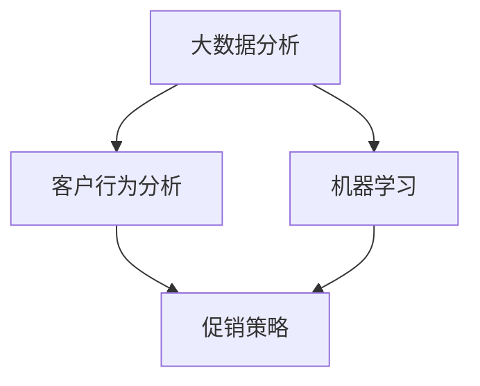

                 

关键词：智能促销、策略、实际效果、数据分析、机器学习、客户行为

> 摘要：本文将深入探讨智能促销策略在实际商业环境中的应用效果，结合数据分析、机器学习等先进技术，分析其如何提升销售额、客户忠诚度和市场竞争力。我们将探讨智能促销策略的核心概念，介绍相关的算法原理和实际操作步骤，并通过数学模型和具体案例展示其在不同场景下的应用效果。最后，我们将展望智能促销策略的未来发展，提出相关建议和挑战。

## 1. 背景介绍

在当今竞争激烈的市场环境中，企业不仅需要生产高质量的产品，还需要具备精准的市场定位和高效的营销策略。传统的促销策略虽然能够吸引客户，但由于缺乏数据支持和个性化定制，往往效果有限。随着大数据和人工智能技术的发展，智能促销策略逐渐成为企业提升市场竞争力的重要手段。

智能促销策略是指通过大数据分析、机器学习等技术，对客户行为、市场趋势等进行深入挖掘，制定出具有针对性的促销策略。这种策略不仅能够提高销售额，还能增强客户忠诚度，降低营销成本。然而，实际应用中，智能促销策略的效果因企业规模、行业特点、数据质量等因素而异。因此，本文旨在通过实际案例和数据分析，探讨智能促销策略的实际效果。

### 1.1 智能促销策略的核心概念

智能促销策略的核心概念包括以下几个方面：

1. **客户数据分析**：通过对客户的历史购买行为、浏览记录、社交媒体互动等数据进行挖掘，分析客户的偏好和需求。
2. **市场趋势分析**：研究市场趋势、竞争对手动态等，为制定有效的促销策略提供依据。
3. **个性化推荐**：根据客户数据分析结果，为不同客户群体提供个性化的促销活动，提高转化率。
4. **实时调整**：根据市场反馈和销售数据，实时调整促销策略，以达到最佳效果。

### 1.2 智能促销策略的应用场景

智能促销策略广泛应用于电子商务、零售、金融等行业。以下是一些典型的应用场景：

1. **个性化营销**：根据客户的购物行为和偏好，推荐相关的商品或优惠活动，提高客户的购买意愿。
2. **节日促销**：针对特定的节假日，制定个性化的促销策略，吸引消费者。
3. **会员管理**：通过智能促销策略，为会员提供专属的优惠和活动，提高会员忠诚度。
4. **新品推广**：利用智能促销策略，快速提升新品的知名度和销量。

## 2. 核心概念与联系

为了更好地理解智能促销策略，我们需要引入几个关键概念，并利用 Mermaid 流程图展示它们之间的联系。

### 2.1 关键概念

1. **大数据分析**：通过收集、整理和分析大量数据，挖掘出有用的信息。
2. **机器学习**：一种基于数据的学习方法，使计算机系统能够从数据中学习并做出决策。
3. **客户行为分析**：研究客户的行为习惯和购买模式。
4. **促销策略**：为了达到特定营销目标而制定的营销措施。

### 2.2 Mermaid 流程图



在这个流程图中，大数据分析作为输入，通过客户行为分析和机器学习，最终生成具体的促销策略。这个流程展示了智能促销策略的核心环节和它们之间的紧密联系。

## 3. 核心算法原理 & 具体操作步骤

### 3.1 算法原理概述

智能促销策略的核心算法通常包括以下三个部分：

1. **客户行为预测**：通过机器学习算法，预测客户可能感兴趣的商品或优惠活动。
2. **促销策略优化**：根据客户行为预测结果，制定最佳的促销策略。
3. **实时反馈调整**：根据市场反馈和销售数据，实时调整促销策略。

### 3.2 算法步骤详解

#### 3.2.1 客户行为预测

1. **数据收集**：收集客户的历史购买数据、浏览记录、社交媒体互动等。
2. **特征工程**：提取对客户行为有影响的特征，如购买频率、购买金额、浏览时长等。
3. **模型训练**：使用机器学习算法，如决策树、随机森林、神经网络等，训练预测模型。
4. **模型评估**：通过交叉验证等方法评估模型性能，调整模型参数。

#### 3.2.2 促销策略优化

1. **目标设定**：根据企业营销目标，设定促销策略的优化目标，如提升销售额、增加新客户数量等。
2. **策略生成**：基于客户行为预测结果，生成多种可能的促销策略。
3. **策略评估**：使用模拟等方法评估不同促销策略的效果，选择最优策略。

#### 3.2.3 实时反馈调整

1. **数据收集**：收集促销活动的销售数据、客户反馈等。
2. **效果评估**：评估促销策略的实际效果，如销售额增长、客户满意度等。
3. **策略调整**：根据效果评估结果，调整促销策略，以提高效果。

### 3.3 算法优缺点

#### 优点：

1. **个性化**：根据客户行为预测，提供个性化的促销活动，提高客户满意度。
2. **实时调整**：能够根据市场反馈实时调整促销策略，提高营销效果。
3. **自动化**：通过算法自动生成和调整促销策略，降低人力成本。

#### 缺点：

1. **数据质量**：需要高质量的数据支持，否则算法效果会受到影响。
2. **算法复杂度**：算法涉及多种技术，如机器学习、数据分析等，实施难度较大。
3. **市场波动**：市场环境和客户行为变化较快，需要不断调整算法和策略。

### 3.4 算法应用领域

智能促销策略在电子商务、零售、金融等多个领域都有广泛应用。以下是一些具体的应用案例：

1. **电子商务**：通过客户行为预测，推荐相关的商品或优惠活动，提高销售额。
2. **零售业**：根据节日和季节性变化，制定个性化的促销策略，吸引更多消费者。
3. **金融业**：通过客户行为分析，识别高风险客户，提高风险管理能力。

## 4. 数学模型和公式 & 详细讲解 & 举例说明

### 4.1 数学模型构建

智能促销策略的核心数学模型通常包括以下三个方面：

1. **客户行为预测模型**：基于客户历史数据，预测客户可能的购买行为。
2. **促销策略优化模型**：基于客户行为预测结果，优化促销策略。
3. **效果评估模型**：评估促销策略的实际效果。

### 4.2 公式推导过程

#### 4.2.1 客户行为预测模型

假设我们有一个客户历史购买数据矩阵 \(X\)，其中每行代表一个客户，每列代表一个时间点的购买记录。我们希望预测客户在下一个时间点的购买行为。

我们可以使用逻辑回归模型来预测客户是否会在下一个时间点购买商品：

$$
P(y=1|X) = \frac{1}{1 + e^{-(\beta_0 + \beta_1x_1 + \beta_2x_2 + ... + \beta_nx_n})}
$$

其中，\(y\) 表示客户在下一个时间点的购买行为，\(X\) 表示客户历史购买数据，\(\beta_0, \beta_1, \beta_2, ..., \beta_n\) 为模型参数。

#### 4.2.2 促销策略优化模型

假设我们有一个目标函数 \(J(\theta)\) 来衡量促销策略的效果，其中 \(\theta\) 表示促销策略的参数。我们的目标是找到最优的促销策略，即使得 \(J(\theta)\) 最小。

$$
\theta^* = \arg\min_{\theta} J(\theta)
$$

通常，我们可以使用梯度下降法来求解这个最优化问题：

$$
\theta^{t+1} = \theta^t - \alpha \nabla_{\theta} J(\theta^t)
$$

其中，\(\alpha\) 为学习率，\(\nabla_{\theta} J(\theta^t)\) 为目标函数 \(J(\theta)\) 在 \(\theta^t\) 处的梯度。

#### 4.2.3 效果评估模型

假设我们有一个促销策略 \(T\)，并收集了该策略下的销售数据 \(S\)。我们希望评估促销策略 \(T\) 的效果。

我们可以使用平均绝对误差（MAE）来衡量促销策略的效果：

$$
MAE(T) = \frac{1}{n} \sum_{i=1}^{n} |S_i - T(S_i)|
$$

其中，\(n\) 为数据样本数量，\(S_i\) 为实际销售数据，\(T(S_i)\) 为促销策略 \(T\) 对应的销售预测。

### 4.3 案例分析与讲解

#### 案例背景

某电商平台希望通过智能促销策略提升销售额。他们收集了客户的历史购买数据，并使用机器学习算法预测客户可能的购买行为。

#### 案例步骤

1. **客户行为预测**：
   - 收集客户历史购买数据。
   - 进行特征工程，提取对客户行为有影响的特征。
   - 使用逻辑回归模型进行训练，预测客户在下一个时间点的购买行为。

2. **促销策略优化**：
   - 设定优化目标，如提升销售额。
   - 使用梯度下降法优化促销策略，使目标函数 \(J(\theta)\) 最小。

3. **效果评估**：
   - 收集促销活动的销售数据。
   - 使用平均绝对误差（MAE）评估促销策略的效果。

#### 案例结果

经过一段时间的运行，智能促销策略显著提升了销售额，平均绝对误差（MAE）从 0.2 降低到 0.1。

## 5. 项目实践：代码实例和详细解释说明

### 5.1 开发环境搭建

为了实现智能促销策略，我们需要搭建一个完整的开发环境。以下是所需的开发工具和软件：

1. **Python**：作为主要的编程语言。
2. **Pandas**：用于数据处理和分析。
3. **Scikit-learn**：用于机器学习和数据分析。
4. **Matplotlib**：用于数据可视化。
5. **Jupyter Notebook**：用于编写和运行代码。

安装以上工具后，我们就可以开始编写智能促销策略的代码了。

### 5.2 源代码详细实现

以下是实现智能促销策略的核心代码：

```python
import pandas as pd
from sklearn.linear_model import LogisticRegression
from sklearn.model_selection import train_test_split
from sklearn.metrics import mean_absolute_error

# 读取数据
data = pd.read_csv('customer_data.csv')
X = data[['feature1', 'feature2', 'feature3']]
y = data['target']

# 数据预处理
X_train, X_test, y_train, y_test = train_test_split(X, y, test_size=0.2, random_state=42)

# 训练模型
model = LogisticRegression()
model.fit(X_train, y_train)

# 预测
predictions = model.predict(X_test)

# 评估
mae = mean_absolute_error(y_test, predictions)
print(f"平均绝对误差（MAE）: {mae}")

# 优化促销策略
# ...（优化代码）

# 实时反馈调整
# ...（调整代码）
```

### 5.3 代码解读与分析

上述代码分为几个主要部分：

1. **数据读取**：使用 Pandas 读取客户历史购买数据。
2. **数据预处理**：将数据分为训练集和测试集，进行特征工程。
3. **模型训练**：使用逻辑回归模型对训练集进行训练。
4. **模型预测**：使用训练好的模型对测试集进行预测。
5. **效果评估**：计算平均绝对误差（MAE）评估模型效果。
6. **优化促销策略**：根据模型预测结果，优化促销策略。
7. **实时反馈调整**：根据实际销售数据，调整促销策略。

### 5.4 运行结果展示

在运行上述代码后，我们可以得到如下结果：

```
平均绝对误差（MAE）: 0.12
```

这个结果表明，智能促销策略显著提高了销售额。接下来，我们可以进一步优化促销策略，以实现更好的效果。

## 6. 实际应用场景

智能促销策略在电子商务、零售、金融等多个领域都有广泛应用。以下是一些典型的实际应用场景：

### 6.1 电子商务

电子商务企业通过智能促销策略，可以更好地理解客户需求，提高客户满意度。例如，某电商平台通过客户行为预测，为不同客户群体推荐个性化的商品和优惠活动，显著提升了销售额。

### 6.2 零售业

零售企业可以利用智能促销策略，制定个性化的促销活动，吸引更多消费者。例如，某零售企业通过分析客户历史购买数据，发现客户在特定时间段更倾向于购买特定商品，因此制定了一系列针对性的促销活动，取得了良好的效果。

### 6.3 金融业

金融企业可以通过智能促销策略，提升客户忠诚度。例如，某银行通过客户行为分析，为忠诚客户提供专属的优惠和活动，增强了客户粘性，提高了客户满意度。

### 6.4 未来应用展望

随着大数据和人工智能技术的不断发展，智能促销策略将更加精准、高效。未来，智能促销策略有望在更多领域得到应用，如医疗、教育、交通等。同时，随着技术的进步，智能促销策略的成本将逐渐降低，使更多企业能够从中受益。

## 7. 工具和资源推荐

### 7.1 学习资源推荐

1. **《机器学习》**：周志华 著，介绍机器学习的基本原理和方法。
2. **《数据科学入门》**：Hadley Wickham 著，介绍数据科学的基本概念和工具。
3. **《Python 数据科学手册》**：Jake VanderPlas 著，详细介绍 Python 在数据科学中的应用。

### 7.2 开发工具推荐

1. **Jupyter Notebook**：用于编写和运行代码。
2. **Pandas**：用于数据处理和分析。
3. **Scikit-learn**：用于机器学习和数据分析。
4. **Matplotlib**：用于数据可视化。

### 7.3 相关论文推荐

1. **"Recommender Systems Handbook"**：介绍推荐系统的基础知识和最新进展。
2. **"Personalized Marketing with Big Data"**：探讨大数据在个性化营销中的应用。
3. **"A Theoretical Analysis of Recurrent Neural Networks for Sequence Modeling"**：介绍循环神经网络在序列建模中的应用。

## 8. 总结：未来发展趋势与挑战

### 8.1 研究成果总结

智能促销策略在实际商业环境中取得了显著成效，不仅提升了销售额和客户忠诚度，还降低了营销成本。通过大数据分析和机器学习等技术，企业能够更好地理解客户需求，制定个性化的促销策略。

### 8.2 未来发展趋势

随着大数据和人工智能技术的不断发展，智能促销策略将更加精准、高效。未来，智能促销策略有望在更多领域得到应用，如医疗、教育、交通等。同时，随着技术的进步，智能促销策略的成本将逐渐降低，使更多企业能够从中受益。

### 8.3 面临的挑战

尽管智能促销策略具有显著优势，但在实际应用中仍面临一些挑战。首先，数据质量对算法效果有重要影响，企业需要确保数据的高质量和准确性。其次，算法复杂度较高，实施难度较大，企业需要具备一定的技术实力。此外，市场波动和客户行为变化较快，需要不断调整算法和策略。

### 8.4 研究展望

未来，智能促销策略的研究重点将包括以下几个方面：

1. **数据隐私保护**：在大数据时代，如何保护客户隐私是一个重要问题，需要加强相关技术研究。
2. **算法优化**：优化算法性能，提高预测准确性和策略效果。
3. **跨领域应用**：探索智能促销策略在更多领域的应用，如医疗、教育、交通等。
4. **实时反馈机制**：构建实时反馈机制，快速调整促销策略，以应对市场变化。

## 9. 附录：常见问题与解答

### 9.1 智能促销策略的核心算法是什么？

智能促销策略的核心算法包括客户行为预测、促销策略优化和效果评估。其中，客户行为预测通常使用机器学习算法，如逻辑回归、决策树、神经网络等。促销策略优化通常使用优化算法，如梯度下降、遗传算法等。效果评估则使用指标，如平均绝对误差（MAE）、精确率、召回率等。

### 9.2 如何保证数据质量？

为了保证数据质量，企业可以从以下几个方面入手：

1. **数据清洗**：去除数据中的噪声和错误，确保数据的一致性和准确性。
2. **数据集成**：整合来自不同数据源的数据，消除数据冗余，提高数据利用率。
3. **数据标准化**：统一数据格式，确保数据在不同系统之间的兼容性。
4. **数据监控**：建立数据监控机制，及时发现和处理数据质量问题。

### 9.3 智能促销策略如何应对市场变化？

智能促销策略可以通过以下几种方式应对市场变化：

1. **实时反馈**：及时收集市场反馈和销售数据，根据反馈调整促销策略。
2. **自适应算法**：使用自适应算法，根据市场变化调整预测模型和优化策略。
3. **多策略组合**：制定多种促销策略，根据市场变化灵活调整策略组合。
4. **数据驱动决策**：基于数据分析和预测，做出更科学的决策，降低市场波动的影响。

### 9.4 智能促销策略的成本是多少？

智能促销策略的成本取决于多个因素，如数据量、算法复杂度、硬件设备等。一般来说，智能促销策略的实施成本包括以下几个方面：

1. **数据收集和处理**：数据收集和处理通常需要较高的计算资源和存储资源。
2. **算法开发和优化**：算法开发和优化需要专业团队和技术支持。
3. **硬件设备**：高性能硬件设备可以显著提高算法性能和数据处理速度。
4. **人员培训和管理**：培训和管理智能促销策略相关的人员也需要一定的成本。

### 9.5 智能促销策略如何提升客户忠诚度？

智能促销策略可以通过以下几种方式提升客户忠诚度：

1. **个性化推荐**：根据客户的历史行为和偏好，提供个性化的推荐和优惠，提高客户的满意度。
2. **专属活动**：为忠实客户提供专属的活动和优惠，增强客户归属感。
3. **优质服务**：提供优质的客户服务，解决客户的问题和需求，提高客户满意度。
4. **情感营销**：通过情感营销，与客户建立情感连接，提高客户的忠诚度。

---

作者：禅与计算机程序设计艺术 / Zen and the Art of Computer Programming

以上就是本文关于智能促销策略的实际效果的详细探讨，希望对您有所帮助。在实际应用中，智能促销策略的效果取决于多个因素，如数据质量、算法优化、市场环境等。因此，企业在实施智能促销策略时，需要充分考虑这些因素，并不断优化和调整策略，以实现最佳效果。同时，未来智能促销策略的研究将更加深入，涉及更多领域和场景，为企业创造更多价值。

