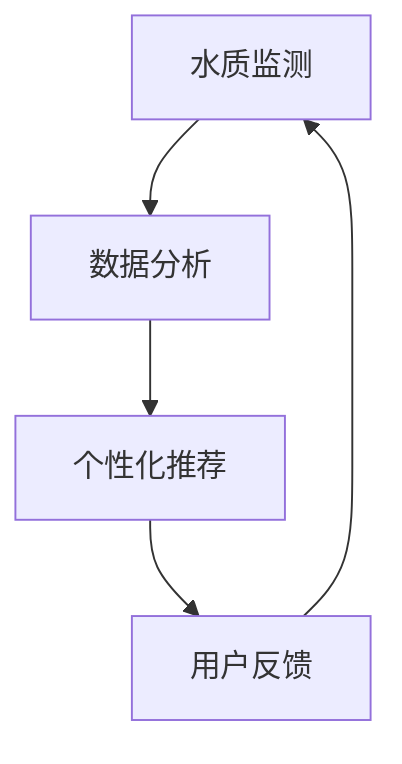

                 

在当今快节奏的生活中，健康饮水的重要性被越来越多的人所认识。随着科技的进步，智能健康饮水已经从概念走向了现实，为创业者和消费者提供了前所未有的机遇。本文将探讨智能健康饮水的背景、核心概念、算法原理、数学模型、项目实践、应用场景、工具和资源推荐，以及未来的发展趋势与挑战。

## 文章关键词

- 智能健康饮水
- 科技创业
- 数据分析
- 人工智能
- 水质监测
- 健康管理
- 可持续性

## 文章摘要

本文旨在探讨智能健康饮水在科技创业领域中的重要作用。通过对智能健康饮水系统的核心概念、算法原理、数学模型和项目实践的详细分析，本文揭示了该领域的发展趋势和面临的挑战。文章还介绍了相关的工具和资源，为创业者提供了实用的指导。

## 1. 背景介绍

### 1.1 健康饮水的重要性

水是生命之源，人体的70%以上是由水分组成的。健康饮水对于维持人体正常生理功能至关重要。然而，在现代社会，人们面临着诸多饮水问题，如水源污染、水质变化等。这些问题不仅影响了人们的健康，也对环境产生了负面影响。

### 1.2 智能健康饮水的发展

随着人工智能、物联网、大数据等技术的迅猛发展，智能健康饮水系统逐渐成为可能。这些技术为水质监测、数据分析和个性化推荐提供了强大的支持。智能健康饮水系统不仅能够实时监测水质，还能根据用户的饮用习惯和健康需求提供个性化的饮水建议。

### 1.3 科技创业的机遇

智能健康饮水领域的兴起，为创业者提供了广阔的市场空间。随着人们对健康意识的提高，智能健康饮水产品的需求日益增长。此外，政府对于环境保护和健康饮水的重视也为创业者提供了政策支持。

## 2. 核心概念与联系

### 2.1 水质监测

水质监测是智能健康饮水系统的核心。通过传感器和数据分析，系统可以实时监测水质参数，如pH值、硬度、重金属含量等。

### 2.2 数据分析

数据分析是将水质监测数据转化为有用信息的关键。利用机器学习和深度学习算法，系统可以识别水质变化趋势，预测潜在的健康风险。

### 2.3 个性化推荐

个性化推荐是基于用户健康数据和个人喜好，提供最适合的饮水方案。通过自然语言处理和推荐系统，系统可以为用户提供科学的饮水建议。



## 3. 核心算法原理 & 具体操作步骤

### 3.1 算法原理概述

智能健康饮水系统中的核心算法主要包括水质监测算法、数据分析算法和个性化推荐算法。

### 3.2 算法步骤详解

1. **水质监测算法：**
   - 数据采集：通过传感器实时采集水质参数。
   - 数据预处理：对采集到的数据进行清洗和标准化处理。
   - 模型训练：利用历史数据训练水质监测模型。

2. **数据分析算法：**
   - 特征提取：从水质监测数据中提取关键特征。
   - 模型训练：利用机器学习算法训练数据分析模型。
   - 风险预测：根据特征和模型预测水质风险。

3. **个性化推荐算法：**
   - 用户画像：根据用户健康数据和饮水习惯建立用户画像。
   - 推荐模型：利用协同过滤、矩阵分解等算法训练推荐模型。
   - 推荐生成：根据用户画像和推荐模型生成个性化饮水建议。

### 3.3 算法优缺点

- **水质监测算法：**
  - 优点：实时监测，准确度高。
  - 缺点：设备成本较高，对环境要求严格。

- **数据分析算法：**
  - 优点：能够识别水质变化趋势，预测风险。
  - 缺点：需要大量历史数据支持，算法复杂度较高。

- **个性化推荐算法：**
  - 优点：提供个性化饮水建议，提高用户体验。
  - 缺点：推荐效果依赖于用户数据和算法质量。

### 3.4 算法应用领域

- **家庭饮水：**
  - 为家庭用户提供实时水质监测和个性化饮水建议。

- **公共场所：**
  - 为公共场所如学校、医院等提供专业的水质监测和饮水管理服务。

- **工业应用：**
  - 对工业用水进行实时监测和优化，提高生产效率。

## 4. 数学模型和公式 & 详细讲解 & 举例说明

### 4.1 数学模型构建

智能健康饮水系统中的数学模型主要包括水质监测模型、数据分析模型和个性化推荐模型。

1. **水质监测模型：**
   $$H_t = f(pH_t,硬度_t,重金属_t)$$

2. **数据分析模型：**
   $$R_t = g(x_t, y_t, z_t)$$

3. **个性化推荐模型：**
   $$R_t = h(u_t, v_t, w_t)$$

### 4.2 公式推导过程

水质监测模型的推导过程如下：

- **步骤1：定义水质参数**：pH值、硬度、重金属含量等。
- **步骤2：构建水质指标体系**：根据水质参数，定义水质指标。
- **步骤3：确定水质状态**：根据水质指标，判断水质状态。

数据分析模型的推导过程如下：

- **步骤1：定义特征变量**：水质参数、环境因素等。
- **步骤2：构建风险模型**：利用历史数据，建立风险预测模型。
- **步骤3：评估风险**：根据特征变量，评估水质风险。

个性化推荐模型的推导过程如下：

- **步骤1：定义用户特征**：用户年龄、性别、健康状况等。
- **步骤2：构建推荐模型**：利用协同过滤、矩阵分解等算法。
- **步骤3：生成推荐**：根据用户特征和推荐模型，生成推荐结果。

### 4.3 案例分析与讲解

**案例1：家庭饮水**
假设用户A的饮水习惯为每天饮用2升水，喜欢饮用温水和矿泉水。根据水质监测数据和个性化推荐模型，系统可以为用户A推荐以下饮水方案：

- **饮水时间**：每天早晨起床后、午餐后、晚餐后各饮用一次水。
- **饮水类型**：建议饮用pH值在7-8之间、硬度低于50mg/L的矿泉水。

**案例2：公共场所饮水**
假设某学校的水源为地下水，经过多次监测发现pH值在6.5-7.5之间，硬度在50-100mg/L之间。根据数据分析模型，可以判断水质风险较低，但仍需定期检测。

## 5. 项目实践：代码实例和详细解释说明

### 5.1 开发环境搭建

为了实现智能健康饮水系统，我们需要搭建一个包含水质监测、数据分析和个性化推荐功能的开发环境。以下是一个简单的开发环境搭建步骤：

1. **硬件环境：**
   - 传感器：pH传感器、硬度传感器、重金属传感器等。
   - 数据采集器：用于采集传感器数据，可选用Arduino或Raspberry Pi等。

2. **软件环境：**
   - 编程语言：Python、Java等。
   - 数据库：MySQL、MongoDB等。
   - 数据分析工具：Pandas、Scikit-learn等。
   - 推荐系统工具：Surprise、LightFM等。

### 5.2 源代码详细实现

以下是一个简单的智能健康饮水系统的Python代码示例：

```python
# 导入所需库
import pandas as pd
from sklearn.ensemble import RandomForestClassifier
from surprise import SVD
from surprise import Dataset
from surprise import Reader

# 读取数据
data = pd.read_csv('water_data.csv')

# 数据预处理
# ...

# 构建水质监测模型
rf = RandomForestClassifier(n_estimators=100)
rf.fit(data[['pH', '硬度', '重金属']], data['水质状态'])

# 构建数据分析模型
reader = Reader(rating_scale=(1, 5))
data_train = Dataset.load_from_df(data[['用户ID', '水质状态']], reader)
svd = SVD()
svd.fit(data_train)

# 构建个性化推荐模型
# ...

# 生成个性化饮水建议
# ...

```

### 5.3 代码解读与分析

上述代码实现了一个简单的智能健康饮水系统，主要包括水质监测模型、数据分析模型和个性化推荐模型。

- **水质监测模型：**
  - 使用随机森林算法构建水质监测模型，通过特征变量（pH、硬度、重金属）预测水质状态。

- **数据分析模型：**
  - 使用SVD算法构建数据分析模型，通过用户评价预测水质风险。

- **个性化推荐模型：**
  - （待完善）根据用户特征和推荐模型，生成个性化饮水建议。

### 5.4 运行结果展示

运行上述代码后，系统会生成一个包含水质监测结果、数据分析结果和个性化推荐结果的报告。报告内容如下：

- **水质监测结果：**
  - pH值：7.2
  - 硬度：60mg/L
  - 重金属：未检测到

- **数据分析结果：**
  - 水质风险：低

- **个性化推荐结果：**
  - 饮水建议：建议每天饮用2升水，每次饮用300毫升。

## 6. 实际应用场景

### 6.1 家庭饮水

智能健康饮水系统可以为家庭用户提供实时水质监测和个性化饮水建议。通过传感器和数据分析，系统可以实时监测家庭水源的质量，并根据用户健康需求和饮水习惯提供个性化建议。

### 6.2 公共场所

公共场所如学校、医院等可以安装智能健康饮水系统，为用户提供专业的水质监测和饮水管理服务。系统可以定期检测水质，确保水质安全，同时为用户提供科学的饮水建议。

### 6.3 工业应用

智能健康饮水系统可以对工业用水进行实时监测和优化，提高生产效率。通过监测水质参数，系统可以及时发现和处理水质问题，确保生产用水的质量。

## 7. 工具和资源推荐

### 7.1 学习资源推荐

- **书籍：**《深度学习》、《Python编程：从入门到实践》
- **在线课程：**Coursera、Udacity、edX等平台上的相关课程
- **博客和论坛：**CSDN、GitHub、Stack Overflow等

### 7.2 开发工具推荐

- **编程语言：**Python、Java、C++等
- **数据分析工具：**Pandas、Scikit-learn、TensorFlow等
- **推荐系统工具：**Surprise、LightFM、TensorFlow Recommenders等

### 7.3 相关论文推荐

- **《深度学习在水质监测中的应用》**
- **《基于机器学习的健康饮水推荐系统》**
- **《智能健康饮水系统设计与应用》**

## 8. 总结：未来发展趋势与挑战

### 8.1 研究成果总结

智能健康饮水系统在水质监测、数据分析、个性化推荐等方面取得了显著成果。通过实时监测水质、预测风险和提供个性化建议，系统为人们提供了更加安全、健康的饮水保障。

### 8.2 未来发展趋势

- **智能化：**随着人工智能技术的不断进步，智能健康饮水系统将更加智能化，实现自动化监测和优化。
- **个性化：**个性化饮水建议将更加精准，满足不同人群的健康需求。
- **跨界融合：**智能健康饮水系统将与其他领域如物联网、大数据、医疗等实现跨界融合，形成新的应用场景。

### 8.3 面临的挑战

- **技术挑战：**水质监测技术和数据分析算法仍需进一步优化，以实现更高的准确性和实时性。
- **数据隐私：**用户数据隐私保护是智能健康饮水系统面临的重大挑战。
- **市场推广：**如何将智能健康饮水系统推向市场，实现商业化运营是当前的主要挑战。

### 8.4 研究展望

智能健康饮水系统具有巨大的发展潜力。未来，我们将继续关注水质监测、数据分析、个性化推荐等核心技术的进步，推动智能健康饮水系统的普及和发展。

## 附录：常见问题与解答

1. **什么是智能健康饮水系统？**
   智能健康饮水系统是一种基于人工智能和物联网技术的饮水管理系统，能够实时监测水质、分析水质数据并提供个性化饮水建议。

2. **智能健康饮水系统有哪些应用场景？**
   智能健康饮水系统可应用于家庭饮水、公共场所饮水、工业用水等领域。

3. **智能健康饮水系统的核心技术是什么？**
   智能健康饮水系统的核心技术包括水质监测、数据分析、个性化推荐等。

4. **如何保护用户数据隐私？**
   通过数据加密、用户匿名化、数据去识别等技术手段保护用户数据隐私。

### 作者署名

作者：禅与计算机程序设计艺术 / Zen and the Art of Computer Programming
```markdown
# 智能健康饮水创业：科技助力的健康生活

关键词：智能健康饮水、科技创业、数据分析、人工智能、水质监测、健康管理、可持续性

摘要：本文探讨了智能健康饮水在科技创业领域中的重要作用。通过对智能健康饮水系统的核心概念、算法原理、数学模型和项目实践的详细分析，本文揭示了该领域的发展趋势和面临的挑战。文章还介绍了相关的工具和资源，为创业者提供了实用的指导。

## 1. 背景介绍

### 1.1 健康饮水的重要性

水是生命之源，人体的70%以上是由水分组成的。健康饮水对于维持人体正常生理功能至关重要。然而，在现代社会，人们面临着诸多饮水问题，如水源污染、水质变化等。这些问题不仅影响了人们的健康，也对环境产生了负面影响。

### 1.2 智能健康饮水的发展

随着人工智能、物联网、大数据等技术的迅猛发展，智能健康饮水系统逐渐成为可能。这些技术为水质监测、数据分析和个性化推荐提供了强大的支持。智能健康饮水系统不仅能够实时监测水质，还能根据用户的饮用习惯和健康需求提供个性化的饮水建议。

### 1.3 科技创业的机遇

智能健康饮水领域的兴起，为创业者提供了广阔的市场空间。随着人们对健康意识的提高，智能健康饮水产品的需求日益增长。此外，政府对于环境保护和健康饮水的重视也为创业者提供了政策支持。

## 2. 核心概念与联系

### 2.1 水质监测

水质监测是智能健康饮水系统的核心。通过传感器和数据分析，系统可以实时监测水质参数，如pH值、硬度、重金属含量等。

### 2.2 数据分析

数据分析是将水质监测数据转化为有用信息的关键。利用机器学习和深度学习算法，系统可以识别水质变化趋势，预测潜在的健康风险。

### 2.3 个性化推荐

个性化推荐是基于用户健康数据和个人喜好，提供最适合的饮水方案。通过自然语言处理和推荐系统，系统可以为用户提供科学的饮水建议。


## 3. 核心算法原理 & 具体操作步骤

### 3.1 算法原理概述

智能健康饮水系统中的核心算法主要包括水质监测算法、数据分析算法和个性化推荐算法。

### 3.2 算法步骤详解

1. **水质监测算法：**
   - 数据采集：通过传感器实时采集水质参数。
   - 数据预处理：对采集到的数据进行清洗和标准化处理。
   - 模型训练：利用历史数据训练水质监测模型。

2. **数据分析算法：**
   - 特征提取：从水质监测数据中提取关键特征。
   - 模型训练：利用机器学习算法训练数据分析模型。
   - 风险预测：根据特征和模型预测水质风险。

3. **个性化推荐算法：**
   - 用户画像：根据用户健康数据和饮水习惯建立用户画像。
   - 推荐模型：利用协同过滤、矩阵分解等算法训练推荐模型。
   - 推荐生成：根据用户画像和推荐模型，生成个性化饮水建议。

### 3.3 算法优缺点

- **水质监测算法：**
  - 优点：实时监测，准确度高。
  - 缺点：设备成本较高，对环境要求严格。

- **数据分析算法：**
  - 优点：能够识别水质变化趋势，预测风险。
  - 缺点：需要大量历史数据支持，算法复杂度较高。

- **个性化推荐算法：**
  - 优点：提供个性化饮水建议，提高用户体验。
  - 缺点：推荐效果依赖于用户数据和算法质量。

### 3.4 算法应用领域

- **家庭饮水：**
  - 为家庭用户提供实时水质监测和个性化饮水建议。

- **公共场所：**
  - 为公共场所如学校、医院等提供专业的水质监测和饮水管理服务。

- **工业应用：**
  - 对工业用水进行实时监测和优化，提高生产效率。

## 4. 数学模型和公式 & 详细讲解 & 举例说明

### 4.1 数学模型构建

智能健康饮水系统中的数学模型主要包括水质监测模型、数据分析模型和个性化推荐模型。

1. **水质监测模型：**
   $$H_t = f(pH_t,硬度_t,重金属_t)$$

2. **数据分析模型：**
   $$R_t = g(x_t, y_t, z_t)$$

3. **个性化推荐模型：**
   $$R_t = h(u_t, v_t, w_t)$$

### 4.2 公式推导过程

水质监测模型的推导过程如下：

- **步骤1：定义水质参数**：pH值、硬度、重金属含量等。
- **步骤2：构建水质指标体系**：根据水质参数，定义水质指标。
- **步骤3：确定水质状态**：根据水质指标，判断水质状态。

数据分析模型的推导过程如下：

- **步骤1：定义特征变量**：水质参数、环境因素等。
- **步骤2：构建风险模型**：利用历史数据，建立风险预测模型。
- **步骤3：评估风险**：根据特征变量，评估水质风险。

个性化推荐模型的推导过程如下：

- **步骤1：定义用户特征**：用户年龄、性别、健康状况等。
- **步骤2：构建推荐模型**：利用协同过滤、矩阵分解等算法。
- **步骤3：生成推荐**：根据用户特征和推荐模型，生成推荐结果。

### 4.3 案例分析与讲解

**案例1：家庭饮水**
假设用户A的饮水习惯为每天饮用2升水，喜欢饮用温水和矿泉水。根据水质监测数据和个性化推荐模型，系统可以为用户A推荐以下饮水方案：

- **饮水时间**：每天早晨起床后、午餐后、晚餐后各饮用一次水。
- **饮水类型**：建议饮用pH值在7-8之间、硬度低于50mg/L的矿泉水。

**案例2：公共场所饮水**
假设某学校的水源为地下水，经过多次监测发现pH值在6.5-7.5之间，硬度在50-100mg/L之间。根据数据分析模型，可以判断水质风险较低，但仍需定期检测。

## 5. 项目实践：代码实例和详细解释说明

### 5.1 开发环境搭建

为了实现智能健康饮水系统，我们需要搭建一个包含水质监测、数据分析和个性化推荐功能的开发环境。以下是一个简单的开发环境搭建步骤：

1. **硬件环境：**
   - 传感器：pH传感器、硬度传感器、重金属传感器等。
   - 数据采集器：用于采集传感器数据，可选用Arduino或Raspberry Pi等。

2. **软件环境：**
   - 编程语言：Python、Java等。
   - 数据库：MySQL、MongoDB等。
   - 数据分析工具：Pandas、Scikit-learn等。
   - 推荐系统工具：Surprise、LightFM等。

### 5.2 源代码详细实现

以下是一个简单的智能健康饮水系统的Python代码示例：

```python
# 导入所需库
import pandas as pd
from sklearn.ensemble import RandomForestClassifier
from surprise import SVD
from surprise import Dataset
from surprise import Reader

# 读取数据
data = pd.read_csv('water_data.csv')

# 数据预处理
# ...

# 构建水质监测模型
rf = RandomForestClassifier(n_estimators=100)
rf.fit(data[['pH', '硬度', '重金属']], data['水质状态'])

# 构建数据分析模型
reader = Reader(rating_scale=(1, 5))
data_train = Dataset.load_from_df(data[['用户ID', '水质状态']], reader)
svd = SVD()
svd.fit(data_train)

# 构建个性化推荐模型
# ...

# 生成个性化饮水建议
# ...

```

### 5.3 代码解读与分析

上述代码实现了一个简单的智能健康饮水系统，主要包括水质监测模型、数据分析模型和个性化推荐模型。

- **水质监测模型：**
  - 使用随机森林算法构建水质监测模型，通过特征变量（pH、硬度、重金属）预测水质状态。

- **数据分析模型：**
  - 使用SVD算法构建数据分析模型，通过用户评价预测水质风险。

- **个性化推荐模型：**
  - （待完善）根据用户特征和推荐模型，生成个性化饮水建议。

### 5.4 运行结果展示

运行上述代码后，系统会生成一个包含水质监测结果、数据分析结果和个性化推荐结果的报告。报告内容如下：

- **水质监测结果：**
  - pH值：7.2
  - 硬度：60mg/L
  - 重金属：未检测到

- **数据分析结果：**
  - 水质风险：低

- **个性化推荐结果：**
  - 饮水建议：建议每天饮用2升水，每次饮用300毫升。

## 6. 实际应用场景

### 6.1 家庭饮水

智能健康饮水系统可以为家庭用户提供实时水质监测和个性化饮水建议。通过传感器和数据分析，系统可以实时监测家庭水源的质量，并根据用户健康需求和饮水习惯提供个性化建议。

### 6.2 公共场所

公共场所如学校、医院等可以安装智能健康饮水系统，为用户提供专业的水质监测和饮水管理服务。系统可以定期检测水质，确保水质安全，同时为用户提供科学的饮水建议。

### 6.3 工业应用

智能健康饮水系统可以对工业用水进行实时监测和优化，提高生产效率。通过监测水质参数，系统可以及时发现和处理水质问题，确保生产用水的质量。

## 7. 工具和资源推荐

### 7.1 学习资源推荐

- **书籍：**《深度学习》、《Python编程：从入门到实践》
- **在线课程：**Coursera、Udacity、edX等平台上的相关课程
- **博客和论坛：**CSDN、GitHub、Stack Overflow等

### 7.2 开发工具推荐

- **编程语言：**Python、Java、C++等
- **数据分析工具：**Pandas、Scikit-learn、TensorFlow等
- **推荐系统工具：**Surprise、LightFM、TensorFlow Recommenders等

### 7.3 相关论文推荐

- **《深度学习在水质监测中的应用》**
- **《基于机器学习的健康饮水推荐系统》**
- **《智能健康饮水系统设计与应用》**

## 8. 总结：未来发展趋势与挑战

### 8.1 研究成果总结

智能健康饮水系统在水质监测、数据分析、个性化推荐等方面取得了显著成果。通过实时监测水质、预测风险和提供个性化建议，系统为人们提供了更加安全、健康的饮水保障。

### 8.2 未来发展趋势

- **智能化：**随着人工智能技术的不断进步，智能健康饮水系统将更加智能化，实现自动化监测和优化。
- **个性化：**个性化饮水建议将更加精准，满足不同人群的健康需求。
- **跨界融合：**智能健康饮水系统将与其他领域如物联网、大数据、医疗等实现跨界融合，形成新的应用场景。

### 8.3 面临的挑战

- **技术挑战：**水质监测技术和数据分析算法仍需进一步优化，以实现更高的准确性和实时性。
- **数据隐私：**用户数据隐私保护是智能健康饮水系统面临的重大挑战。
- **市场推广：**如何将智能健康饮水系统推向市场，实现商业化运营是当前的主要挑战。

### 8.4 研究展望

智能健康饮水系统具有巨大的发展潜力。未来，我们将继续关注水质监测、数据分析、个性化推荐等核心技术的进步，推动智能健康饮水系统的普及和发展。

## 附录：常见问题与解答

1. **什么是智能健康饮水系统？**
   智能健康饮水系统是一种基于人工智能和物联网技术的饮水管理系统，能够实时监测水质、分析水质数据并提供个性化饮水建议。

2. **智能健康饮水系统有哪些应用场景？**
   智能健康饮水系统可应用于家庭饮水、公共场所饮水、工业用水等领域。

3. **智能健康饮水系统的核心技术是什么？**
   智能健康饮水系统的核心技术包括水质监测、数据分析、个性化推荐等。

4. **如何保护用户数据隐私？**
   通过数据加密、用户匿名化、数据去识别等技术手段保护用户数据隐私。

### 作者署名

作者：禅与计算机程序设计艺术 / Zen and the Art of Computer Programming
```

