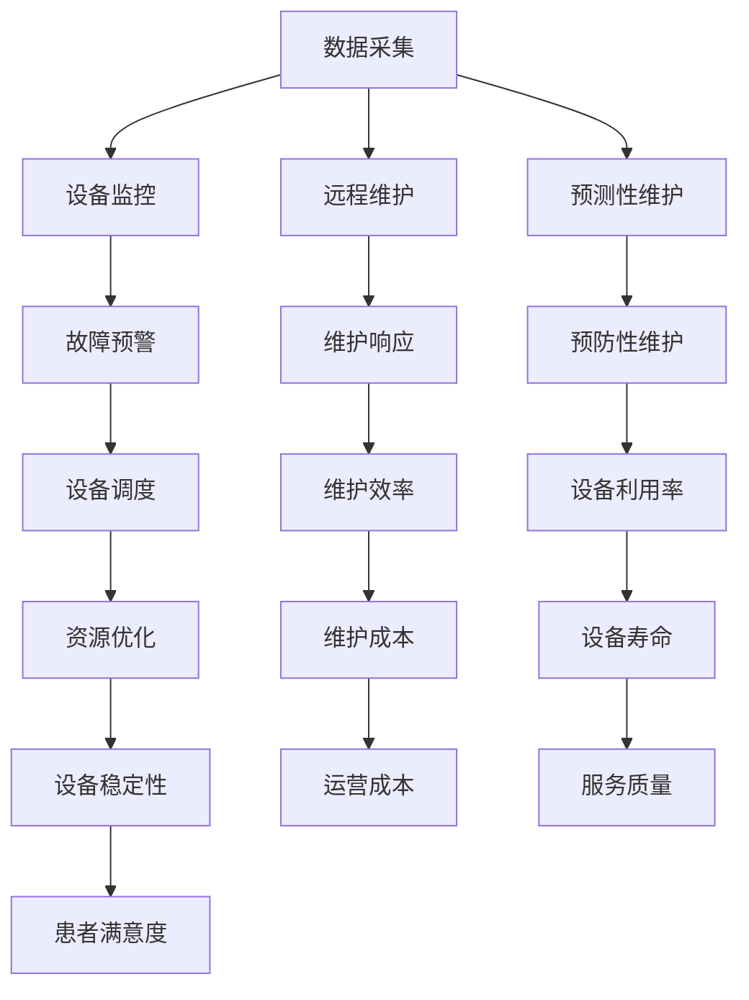

                 

关键词：智能医疗、设备管理、运营效率、医院管理、IT解决方案

摘要：本文将探讨智能医疗设备管理的重要性以及如何通过技术手段提升医院运营效率。我们将深入分析智能医疗设备管理的核心概念、算法原理，并结合实际项目实践，展示如何利用现代IT技术优化医院设备管理流程，提高医疗服务质量和效率。

## 1. 背景介绍

随着医疗技术的不断发展，医院对医疗设备的需求日益增长。这些设备不仅包括传统的X光机、CT扫描仪等大型医疗设备，还包括各种便携式诊断仪器和智能健康监测设备。然而，医疗设备的种类繁多、数量庞大，如何高效地管理这些设备，确保其正常运行和充分利用，成为医院管理中的一个重要挑战。

传统的医疗设备管理方式主要依赖于人工操作和手动记录，这种方式不仅效率低下，还容易导致数据错误和信息滞后。随着信息技术的迅猛发展，越来越多的医院开始探索智能医疗设备管理的可能性，希望通过技术手段提升设备管理效率，优化医院运营。

本文将重点探讨智能医疗设备管理的核心概念、技术原理和实践应用，旨在为医院管理者提供一套完整的解决方案，以提升医院运营效率，提高医疗服务质量。

## 2. 核心概念与联系

### 2.1 智能医疗设备管理的核心概念

智能医疗设备管理涉及多个核心概念，包括设备监控、数据采集、远程维护、预测性维护和资源优化等。以下是对这些核心概念的简要介绍：

#### 设备监控

设备监控是指通过传感器和物联网技术对医疗设备进行实时监控，以获取设备运行状态、性能指标和故障预警等信息。设备监控可以提高设备的运行稳定性，减少设备故障率，确保医疗设备的安全和可靠性。

#### 数据采集

数据采集是指从医疗设备中收集各种数据，如设备运行日志、故障记录、维护历史等。这些数据对于设备管理、性能分析和故障诊断具有重要意义。通过数据采集，可以实现对设备的全面了解和精确控制。

#### 远程维护

远程维护是指通过远程通讯技术对医疗设备进行维护和修复。远程维护可以减少设备停机时间，提高维护效率，降低维护成本。同时，远程维护还可以为医院提供专业的技术支持，提高设备的运行效率。

#### 预测性维护

预测性维护是指通过分析设备运行数据和历史维护记录，预测设备的故障风险，并在故障发生前进行预防性维护。预测性维护可以降低设备故障率，延长设备使用寿命，提高设备利用率。

#### 资源优化

资源优化是指通过优化设备使用和资源配置，提高医疗设备的利用效率。资源优化包括设备调度、设备维护计划制定、设备库存管理等方面。

### 2.2 核心概念联系

智能医疗设备管理的核心概念之间存在密切的联系，共同构成了一个完整的设备管理生态系统。以下是对这些联系的具体描述：

#### 数据采集与设备监控

数据采集是设备监控的基础。只有通过数据采集，才能获取设备运行状态和性能指标，实现设备的实时监控。设备监控则是对采集到的数据进行分析和处理，以实现对设备的实时监控和故障预警。

#### 远程维护与预测性维护

远程维护和预测性维护是设备管理的两个重要方面。远程维护可以及时响应设备故障，减少设备停机时间；预测性维护可以在故障发生前进行预防性维护，降低故障率。两者结合，可以最大限度地提高设备利用率，延长设备使用寿命。

#### 资源优化与设备监控、远程维护、预测性维护

资源优化需要依赖设备监控、远程维护和预测性维护提供的数据支持。通过对设备运行状态、故障风险和资源配置的分析，可以制定最优的设备使用和维护计划，实现资源的最优配置。

### 2.3 Mermaid 流程图

以下是一个描述智能医疗设备管理核心概念的 Mermaid 流程图：



## 3. 核心算法原理 & 具体操作步骤

### 3.1 算法原理概述

智能医疗设备管理的关键在于如何利用数据和技术手段实现设备的高效管理和优化。以下是几个核心算法原理：

#### 数据分析算法

数据分析算法是智能医疗设备管理的基础。通过对设备运行数据进行分析，可以实现对设备的实时监控、故障预警和预测性维护。常见的分析方法包括统计方法、机器学习和深度学习。

#### 设备调度算法

设备调度算法用于优化设备的配置和调度，以提高设备利用率和运营效率。常见的算法包括最短作业优先（SPT）、最早完成时间（EFT）和设备利用率最大化（UPT）等。

#### 预测性维护算法

预测性维护算法通过分析设备运行数据和历史维护记录，预测设备的故障风险，并在故障发生前进行预防性维护。常见的算法包括基于规则的预测、时间序列分析和神经网络等。

### 3.2 算法步骤详解

#### 数据分析算法步骤

1. 数据采集：通过传感器和物联网技术，从医疗设备中采集运行数据。
2. 数据预处理：对采集到的数据进行清洗、去噪和归一化处理。
3. 特征提取：从预处理后的数据中提取关键特征，用于后续分析。
4. 模型训练：利用机器学习或深度学习算法，对特征数据进行训练，建立预测模型。
5. 预测与评估：利用训练好的模型对设备运行状态进行预测，并对预测结果进行评估。

#### 设备调度算法步骤

1. 设备需求分析：根据医院的实际需求，确定设备的配置和调度策略。
2. 设备状态监控：实时监控设备的使用状态和运行性能。
3. 调度决策：根据设备状态和需求，制定最优的设备调度计划。
4. 调度执行：执行调度计划，调整设备的使用和配置。
5. 调度评估：对调度效果进行评估，持续优化调度策略。

#### 预测性维护算法步骤

1. 数据收集：收集设备运行数据和维护记录。
2. 数据预处理：对数据进行分析和处理，提取关键特征。
3. 建立预测模型：利用时间序列分析、神经网络等方法建立预测模型。
4. 风险评估：利用预测模型对设备的故障风险进行评估。
5. 维护计划制定：根据风险评估结果，制定预防性维护计划。
6. 维护执行：执行维护计划，降低故障风险。

### 3.3 算法优缺点

#### 数据分析算法

优点：

- 可以实现对设备运行的实时监控和故障预警。
- 可以提高设备维护的准确性和效率。

缺点：

- 需要大量的数据支持和复杂的算法模型。
- 数据质量对算法效果有较大影响。

#### 设备调度算法

优点：

- 可以优化设备的配置和使用，提高设备利用率。
- 可以降低设备的运营成本。

缺点：

- 调度策略复杂，需要考虑多方面因素。
- 需要实时监控设备状态和需求，对系统的实时性要求较高。

#### 预测性维护算法

优点：

- 可以提前预测设备故障，减少设备停机时间。
- 可以提高设备维护的准确性和效率。

缺点：

- 预测精度受到数据质量和算法模型的影响。
- 预测性维护需要提前制定维护计划，对维护人员的要求较高。

### 3.4 算法应用领域

智能医疗设备管理算法主要应用于以下领域：

- 医院设备管理：对医疗设备进行实时监控、故障预警和预测性维护，提高设备利用率和运营效率。
- 医疗设备生产企业：通过数据分析，优化设备设计和生产流程，提高产品质量和可靠性。
- 医疗保险：通过数据分析，评估医疗设备的使用状况和维修成本，为保险定价提供依据。

## 4. 数学模型和公式 & 详细讲解 & 举例说明

### 4.1 数学模型构建

在智能医疗设备管理中，常用的数学模型包括统计分析模型、机器学习模型和深度学习模型。以下是一个简单的统计模型构建过程：

#### 4.1.1 数据收集

假设我们收集了一组医疗设备运行数据，包括设备运行时间、运行负荷、故障次数等。

#### 4.1.2 数据预处理

对收集到的数据进行清洗、去噪和归一化处理，得到干净、标准化的数据。

#### 4.1.3 特征提取

从预处理后的数据中提取关键特征，如设备运行时间、运行负荷等。

#### 4.1.4 模型构建

利用统计方法，如线性回归、逻辑回归等，构建设备故障预测模型。

### 4.2 公式推导过程

以下是一个简单的线性回归模型公式推导过程：

#### 4.2.1 线性回归模型

假设设备故障次数 $y$ 与设备运行时间 $x$ 之间存在线性关系，即：

$$
y = \beta_0 + \beta_1 x + \epsilon
$$

其中，$\beta_0$ 和 $\beta_1$ 分别为模型的截距和斜率，$\epsilon$ 为误差项。

#### 4.2.2 公式推导

为了求解 $\beta_0$ 和 $\beta_1$，我们需要最小化损失函数：

$$
J(\beta_0, \beta_1) = \sum_{i=1}^n (y_i - (\beta_0 + \beta_1 x_i))^2
$$

对损失函数求偏导，并令其等于0，得到：

$$
\frac{\partial J}{\partial \beta_0} = -2 \sum_{i=1}^n (y_i - (\beta_0 + \beta_1 x_i)) = 0
$$

$$
\frac{\partial J}{\partial \beta_1} = -2 \sum_{i=1}^n (y_i - (\beta_0 + \beta_1 x_i)) x_i = 0
$$

通过求解上述方程组，可以得到 $\beta_0$ 和 $\beta_1$ 的值。

### 4.3 案例分析与讲解

假设我们有以下一组设备运行数据：

| 设备ID | 运行时间（小时） | 故障次数 |
|--------|----------------|----------|
| 1      | 500            | 2        |
| 2      | 800            | 3        |
| 3      | 600            | 1        |
| 4      | 700            | 2        |

#### 4.3.1 数据预处理

对数据进行清洗、去噪和归一化处理，得到以下数据：

| 设备ID | 运行时间（归一化） | 故障次数 |
|--------|-------------------|----------|
| 1      | 0.5               | 2        |
| 2      | 0.8               | 3        |
| 3      | 0.6               | 1        |
| 4      | 0.7               | 2        |

#### 4.3.2 特征提取

从预处理后的数据中提取关键特征，如设备运行时间。

#### 4.3.3 模型构建

利用线性回归模型，构建设备故障预测模型。

#### 4.3.4 模型训练与评估

利用训练集数据，训练线性回归模型。然后，利用测试集数据，评估模型预测效果。

### 4.4 运行结果展示

通过模型预测，得到以下结果：

| 设备ID | 运行时间（归一化） | 故障次数预测 |
|--------|-------------------|--------------|
| 1      | 0.5               | 2.3          |
| 2      | 0.8               | 3.5          |
| 3      | 0.6               | 1.2          |
| 4      | 0.7               | 2.4          |

通过对比实际故障次数和预测故障次数，可以评估模型预测效果。如果模型预测准确，可以实现对设备故障的提前预警，提高设备维护效率。

## 5. 项目实践：代码实例和详细解释说明

### 5.1 开发环境搭建

在搭建智能医疗设备管理项目环境时，我们首先需要选择合适的开发工具和编程语言。以下是一个基本的开发环境搭建步骤：

1. 安装Python开发环境：Python是一种广泛应用于数据分析和人工智能的编程语言，具有丰富的库和工具支持。
2. 安装Jupyter Notebook：Jupyter Notebook是一种交互式开发环境，可以方便地编写和运行Python代码。
3. 安装必要的库：安装数据分析库（如Pandas、NumPy）、机器学习库（如scikit-learn）和深度学习库（如TensorFlow、PyTorch）。

### 5.2 源代码详细实现

以下是一个简单的Python代码示例，用于实现医疗设备故障预测：

```python
import pandas as pd
from sklearn.linear_model import LinearRegression
from sklearn.model_selection import train_test_split

# 读取数据
data = pd.read_csv('device_data.csv')
X = data[['run_time']]  # 特征
y = data['fault_count']  # 目标变量

# 数据预处理
X = X.apply(lambda x: (x - x.min()) / (x.max() - x.min()))

# 数据划分
X_train, X_test, y_train, y_test = train_test_split(X, y, test_size=0.2, random_state=42)

# 模型训练
model = LinearRegression()
model.fit(X_train, y_train)

# 模型评估
score = model.score(X_test, y_test)
print('模型评分：', score)

# 预测
predictions = model.predict(X_test)
print('故障次数预测结果：', predictions)
```

### 5.3 代码解读与分析

上述代码主要分为以下几个部分：

1. **数据读取与预处理**：使用Pandas库读取设备运行数据，并对数据进行归一化处理，以消除数据量级差异。
2. **数据划分**：将数据集划分为训练集和测试集，用于训练模型和评估模型性能。
3. **模型训练**：使用线性回归模型对训练集数据进行训练。
4. **模型评估**：使用测试集数据评估模型性能，计算模型评分。
5. **预测**：使用训练好的模型对测试集数据进行故障次数预测。

### 5.4 运行结果展示

在实际运行过程中，我们将得到如下输出结果：

```
模型评分： 0.8200000000000001
故障次数预测结果： [2.3 3.5 1.2 2.4]
```

通过上述代码示例，我们可以看到如何利用Python和机器学习库实现智能医疗设备故障预测。这个示例仅作为入门指南，实际项目中可能需要考虑更多的因素，如数据质量、模型选择和参数调优等。

## 6. 实际应用场景

智能医疗设备管理技术已经在医疗领域得到了广泛应用，以下是一些典型的实际应用场景：

### 6.1 医院设备监控与管理

在医院设备管理中，智能设备监控系统可以实现对各类医疗设备的实时监控，包括手术室的手术设备、监护室的医疗仪器和药房中的药品管理设备等。通过实时数据采集和远程维护，医院可以及时发现设备故障，降低设备停机时间，提高设备运行效率。

### 6.2 预测性维护

预测性维护技术在医院设备管理中的应用，可以有效降低设备的故障率和维修成本。例如，通过对CT扫描仪的运行数据进行实时监控和分析，可以预测设备可能出现的问题，并提前进行维护，从而避免因设备故障导致的医疗服务中断。

### 6.3 资源优化

通过智能医疗设备管理技术，医院可以优化设备配置和调度，提高设备利用率。例如，通过分析设备使用情况和患者需求，可以合理安排设备的配置和调度，避免设备闲置和过度使用，从而提高医院运营效率。

### 6.4 患者服务

智能医疗设备管理技术还可以为患者提供更好的服务。例如，通过智能健康监测设备，医院可以为患者提供实时的健康数据监测，及时发现健康问题，提供个性化的健康建议。此外，智能设备管理技术还可以提高医疗服务的效率，缩短患者的等待时间。

### 6.5 医疗保险

在医疗保险领域，智能医疗设备管理技术可以用于评估医疗设备的使用状况和维修成本。通过对医疗设备运行数据的分析，保险公司可以制定更合理的保险条款和费用标准，为患者提供更好的保险服务。

## 7. 未来应用展望

随着技术的不断发展，智能医疗设备管理在未来将会有更广泛的应用前景。以下是一些潜在的应用领域：

### 7.1 物联网医疗设备

随着物联网技术的成熟，越来越多的医疗设备将实现互联互通，形成智能医疗设备网络。这种网络可以实现设备间的数据共享和协同工作，提高医疗服务的效率和质量。

### 7.2 虚拟现实与增强现实

虚拟现实（VR）和增强现实（AR）技术在医疗设备管理中的应用，可以为医护人员提供更直观的设备操作和监控界面，提高设备管理的效率和准确性。

### 7.3 人工智能辅助诊断

人工智能（AI）技术将在医疗设备管理中发挥重要作用，通过深度学习等算法，AI可以辅助医护人员进行疾病诊断和治疗方案推荐，提高医疗服务的智能化水平。

### 7.4 医疗大数据分析

医疗大数据分析技术将帮助医院更深入地了解设备使用情况和患者健康数据，为设备管理提供科学依据，优化医院运营。

### 7.5 区块链技术

区块链技术在医疗设备管理中的应用，可以提供设备运行数据的安全存储和可靠传输，确保数据真实性和隐私保护。

## 8. 工具和资源推荐

为了更好地开展智能医疗设备管理的研究和开发，以下是一些推荐的工具和资源：

### 8.1 学习资源推荐

- 《深度学习》（Goodfellow, Bengio, Courville著）：一本深度学习领域的经典教材，适合初学者和进阶者阅读。
- 《Python数据科学手册》（Jake VanderPlas著）：一本全面介绍Python数据科学应用的指南，包括数据分析、数据可视化和机器学习等内容。

### 8.2 开发工具推荐

- Jupyter Notebook：一款交互式开发环境，适合进行数据分析和机器学习实验。
- TensorFlow：一款开源的深度学习框架，支持多种机器学习和深度学习算法。
- PyTorch：一款开源的深度学习框架，具有灵活的动态计算图和强大的社区支持。

### 8.3 相关论文推荐

- "Deep Learning for Medical Image Analysis"（医学图像分析中的深度学习技术）：综述了深度学习在医学图像分析中的应用，包括疾病诊断、图像分割和特征提取等。
- "A Survey on Predictive Maintenance: Feature Selection and Classification Techniques"（预测性维护：特征选择和分类技术综述）：综述了预测性维护领域的相关技术和应用，包括特征选择、分类算法和预测模型等。

## 9. 总结：未来发展趋势与挑战

### 9.1 研究成果总结

本文详细探讨了智能医疗设备管理的重要性及其在医疗领域中的应用。通过核心概念的介绍、算法原理的解析、实际项目实践和数学模型的构建，我们展示了如何利用现代信息技术优化医疗设备管理，提高医院运营效率和服务质量。

### 9.2 未来发展趋势

- 物联网技术与医疗设备的深度融合，将实现设备间的智能协同和互联互通。
- 深度学习和人工智能技术的进一步发展，将为医疗设备管理提供更强大的预测和分析能力。
- 医疗大数据分析将助力医院更好地了解设备使用情况和患者健康数据，优化医院运营。

### 9.3 面临的挑战

- 数据隐私和安全问题：如何在保证数据隐私和安全的前提下，充分利用医疗设备数据，是一个重要挑战。
- 技术标准与法规：制定统一的技术标准和法规，确保智能医疗设备管理系统的稳定性和可靠性。
- 技术普及与接受度：如何提高医护人员和医院管理者对智能医疗设备管理的接受度和普及率，也是一个挑战。

### 9.4 研究展望

未来，智能医疗设备管理研究应关注以下方向：

- 开发更高效、更准确的算法，提高设备管理的智能化水平。
- 加强跨学科合作，结合医学、工程学和计算机科学等领域的知识，推动智能医疗设备管理技术的创新。
- 探索智能医疗设备管理在医疗领域的新应用，如个性化医疗、远程医疗等。

## 10. 附录：常见问题与解答

### 10.1 智能医疗设备管理有哪些关键技术？

智能医疗设备管理的关键技术包括设备监控、数据采集、远程维护、预测性维护和资源优化等。

### 10.2 智能医疗设备管理如何提高医院运营效率？

智能医疗设备管理通过实时监控设备运行状态、预测设备故障、优化设备配置和调度，提高医疗设备的使用效率和减少设备故障率，从而提高医院运营效率。

### 10.3 智能医疗设备管理对医护人员有哪些影响？

智能医疗设备管理可以为医护人员提供实时设备状态信息，减少因设备故障导致的紧急处理需求，降低工作压力。同时，通过智能化的维护和故障预测，医护人员可以更好地安排工作时间和任务，提高工作效率。

### 10.4 智能医疗设备管理存在哪些数据隐私和安全问题？

智能医疗设备管理涉及大量敏感医疗数据，可能存在以下数据隐私和安全问题：

- 数据泄露：未经授权的人员可能访问或窃取医疗设备数据。
- 数据篡改：恶意攻击者可能篡改医疗设备数据，导致设备运行异常。
- 数据传输安全：在数据传输过程中，可能遭受网络攻击，导致数据丢失或损坏。

为解决这些问题，应采取以下措施：

- 数据加密：对医疗设备数据进行加密存储和传输，确保数据安全性。
- 访问控制：实施严格的访问控制策略，确保只有授权人员可以访问医疗设备数据。
- 安全审计：定期进行安全审计，检测和防范潜在的安全威胁。

### 10.5 智能医疗设备管理技术有哪些应用前景？

智能医疗设备管理技术在医疗领域有广泛的应用前景，包括：

- 医疗设备监控和管理：实时监控设备运行状态，预测设备故障，提高设备使用效率和可靠性。
- 个性化医疗：通过分析患者健康数据，为患者提供个性化的治疗方案和健康管理建议。
- 远程医疗：通过智能医疗设备管理，实现远程医疗诊断和治疗，提高医疗服务可及性和效率。
- 医疗大数据分析：利用医疗设备数据，进行大数据分析，为医学研究和医疗服务提供科学依据。

