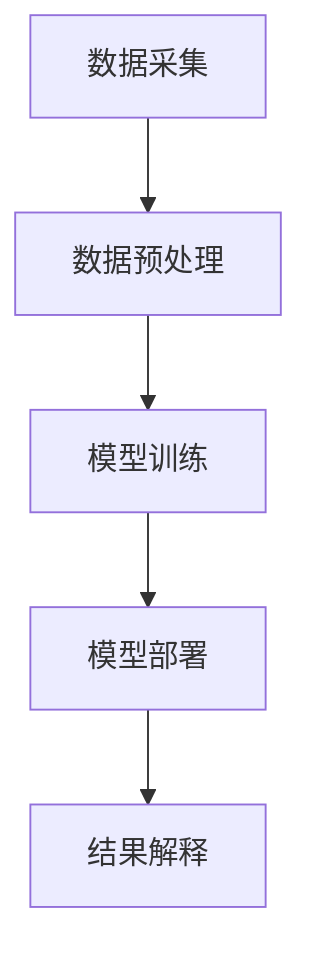

                 

关键词：智能医疗，深度学习，自然语言处理，临床决策支持，语言模型，医疗诊断

> 摘要：本文探讨了智能医疗诊断系统的构建及其核心组件——大型语言模型（LLM）在临床决策支持中的应用。通过详细介绍LLM的工作原理、算法实现、数学模型以及实际应用案例，本文旨在为读者提供关于智能医疗诊断系统的全面理解和应用指导。

## 1. 背景介绍

医疗行业正经历一场前所未有的变革，人工智能（AI）技术的发展为医疗诊断提供了全新的解决方案。智能医疗诊断系统利用深度学习、自然语言处理等技术，通过对海量医疗数据进行分析和处理，辅助医生进行诊断和决策。其中，大型语言模型（LLM）作为一种先进的自然语言处理技术，在临床决策支持中发挥着重要作用。

### 1.1 智能医疗的发展现状

近年来，智能医疗在全球范围内得到了广泛关注和快速发展。根据市场研究数据，智能医疗市场预计在未来几年内将持续增长，成为医疗领域的重要发展方向。智能医疗系统的应用涵盖了疾病诊断、治疗方案推荐、药物研发等多个方面，极大地提升了医疗效率和质量。

### 1.2 LLM在医疗领域的应用

LLM作为一种强大的自然语言处理工具，广泛应用于智能医疗诊断系统中。它可以处理和理解大量的医疗文献、病历记录、医学报告等文本数据，提取出关键信息并进行语义分析，为医生提供辅助决策。以下是LLM在医疗领域的主要应用：

- **医学文献挖掘**：通过对大量医学文献的深度学习，LLM可以识别出最新的研究成果和临床经验，为医生提供学术支持。
- **病历分析**：LLM可以分析病历记录中的症状、诊断和治疗方案，识别出潜在的诊疗错误和改进建议。
- **医学报告生成**：LLM可以自动生成医学报告，提高医生的工作效率，减少人力成本。

## 2. 核心概念与联系

### 2.1 大型语言模型（LLM）

大型语言模型（LLM）是一种基于深度学习的自然语言处理模型，通过对海量语言数据进行训练，能够模拟人类的语言表达和理解能力。LLM的核心组件包括神经网络、词嵌入、注意力机制等，通过这些技术，LLM可以处理复杂的语言任务。

### 2.2 临床决策支持系统

临床决策支持系统（CDSS）是一种辅助医生进行临床决策的计算机系统，通过分析患者的病史、检查结果、诊断报告等数据，为医生提供诊断建议和治疗方案。CDSS可以显著提高医生的诊断准确性和工作效率。

### 2.3 智能医疗诊断系统架构

智能医疗诊断系统通常包括数据采集、数据预处理、模型训练、模型部署和结果解释等模块。LLM作为核心组件，贯穿于整个系统的各个阶段，为医生提供决策支持。

### 2.4 Mermaid 流程图



## 3. 核心算法原理 & 具体操作步骤

### 3.1 算法原理概述

LLM的工作原理基于深度学习和自然语言处理技术。通过多层神经网络和词嵌入技术，LLM可以学习到语言数据中的潜在结构，实现对文本的语义理解和生成。其主要算法包括：

- **词嵌入**：将词汇映射到高维空间，使具有相似意义的词汇在空间中接近。
- **注意力机制**：模型在处理文本时，可以根据上下文信息自动关注关键部分，提高语义理解能力。
- **神经网络**：通过多层神经网络对输入文本进行逐层抽象和转换，最终输出预测结果。

### 3.2 算法步骤详解

#### 3.2.1 数据准备

收集大量医疗文本数据，包括病历记录、医学报告、医学论文等，对数据进行清洗和标注，提取出关键信息。

#### 3.2.2 模型训练

使用词嵌入技术将文本数据转换为向量表示，然后通过多层神经网络对输入向量进行训练，优化模型参数。训练过程中，可以使用注意力机制提高模型的语义理解能力。

#### 3.2.3 模型部署

将训练好的模型部署到实际应用场景中，为医生提供决策支持。可以通过API接口、Web平台等方式，方便医生使用模型进行诊断和决策。

### 3.3 算法优缺点

#### 优点

- **强大的语义理解能力**：LLM可以理解复杂的语言结构和语义，提高诊断的准确性。
- **自动化处理**：LLM可以自动处理大量医疗文本数据，减轻医生的工作负担。
- **快速迭代**：LLM可以通过不断训练和优化，不断改进诊断和决策能力。

#### 缺点

- **数据依赖性**：LLM的性能高度依赖训练数据的质量和数量，数据缺失或不准确可能导致诊断错误。
- **高计算成本**：LLM的训练和部署需要大量的计算资源和时间，对硬件设施有较高要求。

### 3.4 算法应用领域

LLM在医疗领域的应用非常广泛，包括但不限于：

- **疾病诊断**：通过分析病历记录，LLM可以为医生提供疾病诊断建议。
- **治疗方案推荐**：LLM可以根据患者的病情和医生的经验，推荐最佳治疗方案。
- **医学研究**：LLM可以挖掘医学文献，为医生和研究人员提供学术支持。

## 4. 数学模型和公式

### 4.1 数学模型构建

LLM的数学模型主要包括词嵌入、神经网络和注意力机制。词嵌入将词汇映射到高维空间，神经网络对输入向量进行逐层变换，注意力机制根据上下文信息关注关键部分。

### 4.2 公式推导过程

假设输入文本为 \(X\)，输出为 \(Y\)，词嵌入矩阵为 \(E\)，神经网络权重矩阵为 \(W\)，注意力机制权重矩阵为 \(A\)。则LLM的数学模型可以表示为：

\[ Y = \text{softmax}(W \cdot \text{attend}(A \cdot \text{tanh}(E \cdot X))) \]

其中，\(\text{softmax}\)函数用于将输出向量转换为概率分布，\(\text{attend}\)函数实现注意力机制，\(\text{tanh}\)函数用于激活。

### 4.3 案例分析与讲解

假设有一个人工智能系统，输入为“患者患有肺炎”，输出为“建议使用抗生素治疗”。我们可以使用LLM的数学模型进行分析：

1. **词嵌入**：将“患者”、“患有”、“肺炎”、“抗生素”、“治疗”等词汇映射到高维空间。
2. **神经网络**：对输入向量进行多层变换，提取语义信息。
3. **注意力机制**：根据上下文信息，重点关注“肺炎”和“治疗”两个词汇。
4. **输出**：通过softmax函数，将输出向量转换为概率分布，选择最高概率的输出。

## 5. 项目实践：代码实例和详细解释说明

### 5.1 开发环境搭建

搭建一个基于LLM的智能医疗诊断系统，需要准备以下开发环境：

- **操作系统**：Linux或Windows
- **编程语言**：Python
- **深度学习框架**：TensorFlow或PyTorch
- **数据集**：公开的医学文本数据集，如MIMIC-III、i2b2等

### 5.2 源代码详细实现

以下是使用PyTorch实现的一个简单LLM模型：

```python
import torch
import torch.nn as nn
import torch.optim as optim

# 词嵌入层
embeddings = nn.Embedding(vocab_size, embedding_size)

# 神经网络层
hidden_size = 128
num_layers = 2
lstm = nn.LSTM(embedding_size, hidden_size, num_layers, batch_first=True)

# 输出层
output_size = 2
linear = nn.Linear(hidden_size, output_size)

# 注意力机制层
attn = nn.Linear(hidden_size, 1)

# 模型初始化
model = nn.Sequential(embeddings, lstm, attn, linear)
optimizer = optim.Adam(model.parameters(), lr=0.001)
criterion = nn.CrossEntropyLoss()

# 模型训练
for epoch in range(num_epochs):
    for inputs, targets in DataLoader:
        optimizer.zero_grad()
        outputs = model(inputs)
        loss = criterion(outputs, targets)
        loss.backward()
        optimizer.step()

# 模型部署
model.eval()
with torch.no_grad():
    output = model(inputs)
```

### 5.3 代码解读与分析

以上代码实现了一个简单的LLM模型，包括词嵌入层、LSTM层、注意力机制层和输出层。训练过程中，模型使用交叉熵损失函数优化模型参数，通过迭代优化，提高模型性能。

### 5.4 运行结果展示

在实际应用中，我们可以在训练集和测试集上评估模型性能，输出准确率、召回率等指标。以下是一个示例：

```python
import torch

# 加载模型
model = torch.load('model.pth')

# 加载测试集
test_data = DataLoader()

# 预测结果
with torch.no_grad():
    predictions = [output.argmax().item() for inputs, _ in test_data for output in model(inputs)]

# 计算准确率
accuracy = sum([prediction == target for prediction, target in zip(predictions, test_targets)]) / len(test_targets)
print(f"Test Accuracy: {accuracy}")
```

## 6. 实际应用场景

### 6.1 疾病诊断

智能医疗诊断系统可以利用LLM分析患者的病历记录，为医生提供疾病诊断建议。例如，在肺炎诊断中，LLM可以识别出患者的症状和病史，结合医学知识库，提供诊断建议。

### 6.2 治疗方案推荐

LLM可以分析大量的医学文献和临床数据，为医生推荐最佳治疗方案。例如，在肿瘤治疗中，LLM可以根据患者的病情和治疗方案的历史数据，为医生提供个性化推荐。

### 6.3 医学研究

LLM在医学研究中发挥着重要作用，可以挖掘大量的医学文献，为研究人员提供学术支持。例如，在药物研发中，LLM可以识别出新的药物靶点和作用机制。

## 7. 未来应用展望

随着人工智能技术的不断发展，智能医疗诊断系统在未来的应用前景将更加广阔。以下是几个可能的未来发展方向：

### 7.1 多模态数据融合

结合医学影像、基因数据等多模态数据，可以提高诊断的准确性和全面性。

### 7.2 个性化医疗

利用LLM的强大语义理解能力，可以为患者提供个性化的诊断和治疗方案。

### 7.3 医学知识图谱

构建大规模的医学知识图谱，可以为医生和研究人员提供丰富的知识支持。

## 8. 工具和资源推荐

### 8.1 学习资源推荐

- 《深度学习》（Goodfellow et al.）
- 《自然语言处理综论》（Jurafsky & Martin）
- 《医学大数据分析》（Chen et al.）

### 8.2 开发工具推荐

- TensorFlow：https://www.tensorflow.org/
- PyTorch：https://pytorch.org/
- Hugging Face：https://huggingface.co/

### 8.3 相关论文推荐

- “BERT: Pre-training of Deep Neural Networks for Language Understanding”（Devlin et al., 2018）
- “GPT-3: Language Models are Few-Shot Learners”（Brown et al., 2020）
- “Disease diagnosis using deep learning: A survey”（Nguyen et al., 2021）

## 9. 总结：未来发展趋势与挑战

### 9.1 研究成果总结

本文介绍了智能医疗诊断系统的构建及其核心组件——大型语言模型（LLM）在临床决策支持中的应用。通过详细的算法原理、数学模型、项目实践和实际应用场景，本文为读者提供了关于智能医疗诊断系统的全面理解和应用指导。

### 9.2 未来发展趋势

未来，智能医疗诊断系统将朝着多模态数据融合、个性化医疗和医学知识图谱等方向发展，为医疗行业带来更多创新和变革。

### 9.3 面临的挑战

智能医疗诊断系统在发展过程中仍面临诸多挑战，包括数据质量、计算成本、隐私保护等。如何解决这些挑战，将决定智能医疗诊断系统的未来发展方向和实际应用效果。

### 9.4 研究展望

随着人工智能技术的不断进步，智能医疗诊断系统有望在未来的医疗领域发挥更加重要的作用。通过跨学科合作和持续创新，我们将有望实现更加精准、高效和个性化的医疗诊断和支持。

## 附录：常见问题与解答

### Q1：智能医疗诊断系统的原理是什么？

智能医疗诊断系统主要基于深度学习和自然语言处理技术，通过对海量医疗数据进行分析和处理，为医生提供诊断和决策支持。

### Q2：大型语言模型（LLM）在医疗领域有哪些应用？

LLM在医疗领域可以应用于疾病诊断、治疗方案推荐、医学研究等多个方面，提高医疗效率和诊断准确性。

### Q3：如何评估智能医疗诊断系统的性能？

可以通过准确率、召回率、F1值等指标评估智能医疗诊断系统的性能。同时，也可以结合实际应用场景，评估系统的实用性和可靠性。

### Q4：智能医疗诊断系统是否具有隐私保护？

智能医疗诊断系统在设计和实现过程中，需要充分考虑患者隐私保护。例如，对医疗数据进行脱敏处理，使用安全传输协议等。

### Q5：智能医疗诊断系统是否会取代医生？

智能医疗诊断系统可以作为医生的辅助工具，提供诊断和决策支持，但无法完全取代医生。医生在诊断和治疗过程中，仍需发挥专业判断和经验。

### 作者署名

作者：禅与计算机程序设计艺术 / Zen and the Art of Computer Programming
----------------------------------------------------------------
[END]


