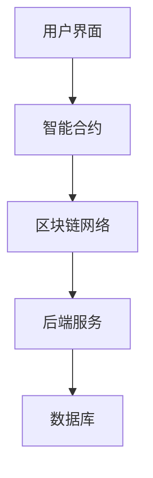

                 

关键词：智能合同管理、区块链、自动化执行、法律流程简化、合同智能执行、数字合约

<|assistant|>摘要：本文将探讨智能合同管理系统，这是一种利用区块链技术和人工智能算法的创新工具，旨在简化法律流程，提高合同执行的效率和透明度。通过详细分析智能合同的基本原理、核心算法、数学模型以及实际应用案例，本文旨在为读者提供一个全面的理解，并展望智能合同管理系统在未来法律领域的发展趋势。

## 1. 背景介绍

在现代社会，合同是商业和经济活动中不可或缺的一部分。然而，传统的合同管理流程通常繁琐且耗时，涉及到多个环节，如起草、谈判、签订、执行和监控。这不仅增加了企业的运营成本，还容易导致合同纠纷和执行风险。随着技术的不断进步，尤其是区块链和人工智能的发展，为合同管理提供了一种全新的解决方案——智能合同管理系统。

智能合同管理系统是一种基于区块链技术的自动化合同管理平台，它利用智能合约（Smart Contract）自动执行合同条款，确保合同的自动履行。智能合同管理系统通过去中心化、不可篡改和透明性等特性，极大地简化了法律流程，提高了合同执行的效率。

## 2. 核心概念与联系

### 2.1. 智能合同

智能合同是一种在区块链上运行的合同，它使用计算机代码来定义和执行合同条款。智能合同通过预定义的逻辑规则自动执行，无需人为干预。这使得合同的执行更加透明、高效且可信。

### 2.2. 区块链技术

区块链是一种分布式数据库技术，具有去中心化、不可篡改和透明性的特点。区块链通过多个节点共同维护数据，确保数据的完整性和安全性。

### 2.3. 智能合约与区块链的关系

智能合约是运行在区块链上的程序，它利用区块链的分布式账本特性，确保合同的自动执行和不可篡改性。智能合约通过预先编写的代码自动执行合同条款，从而简化了合同执行流程。

### 2.4. 智能合同管理系统的架构

智能合同管理系统通常包括以下几个主要组件：用户界面、智能合约、区块链网络、后端服务。用户界面提供合同创建、管理和监控的接口；智能合约定义和执行合同条款；区块链网络确保数据的去中心化和不可篡改；后端服务提供数据存储、处理和监控等功能。



## 3. 核心算法原理 & 具体操作步骤

### 3.1. 算法原理概述

智能合同管理系统的主要算法原理是基于区块链和智能合约技术的。区块链技术提供了一种去中心化的账本，确保数据的不可篡改和透明性。智能合约通过预定义的逻辑规则，自动执行合同条款，实现合同的自动化管理。

### 3.2. 算法步骤详解

#### 3.2.1. 合同创建

用户通过用户界面创建智能合同，包括合同名称、条款、执行条件等。

#### 3.2.2. 智能合约编写

开发人员根据合同条款编写智能合约，并将其部署到区块链网络。

#### 3.2.3. 合同签署

合同双方通过用户界面签署智能合同，确认合同条款。

#### 3.2.4. 合同执行

智能合约根据预定义的逻辑规则自动执行合同条款，如支付、交付等。

#### 3.2.5. 合同监控

智能合同管理系统实时监控合同执行状态，确保合同条款的自动履行。

### 3.3. 算法优缺点

#### 优点：

- **自动化执行**：智能合同能够自动执行合同条款，减少人为干预，提高执行效率。
- **透明性**：区块链技术确保合同数据的透明性和不可篡改性，增强合同的可信度。
- **安全性**：智能合同管理系统基于区块链技术，具有较高的安全性。

#### 缺点：

- **技术门槛**：智能合同管理系统需要一定的技术基础，对非技术人员可能存在一定难度。
- **智能合约漏洞**：智能合约存在漏洞的风险，可能导致合同执行失败。

### 3.4. 算法应用领域

智能合同管理系统在多个领域具有广泛应用，如供应链管理、金融、房地产、租赁等。通过智能合同，企业能够简化合同管理流程，降低运营成本，提高业务效率。

## 4. 数学模型和公式 & 详细讲解 & 举例说明

### 4.1. 数学模型构建

智能合同管理系统中的数学模型主要包括以下部分：

- **条件公式**：定义合同执行的触发条件。
- **执行规则**：定义合同条款的执行规则。
- **状态监控**：定义合同执行状态的监控规则。

### 4.2. 公式推导过程

#### 条件公式

$$
条件 = \begin{cases}
支付金额 \geq 合同金额 \\
交付物品符合要求 \\
时间 \geq 合同期限
\end{cases}
$$

#### 执行规则

$$
执行规则 = \begin{cases}
支付金额 \rightarrow 转账操作 \\
交付物品 \rightarrow 确认交付 \\
时间 \rightarrow 自动续期
\end{cases}
$$

#### 状态监控

$$
状态监控 = \begin{cases}
条件未满足 \rightarrow 提醒操作 \\
条件满足 \rightarrow 执行操作 \\
状态异常 \rightarrow 报警操作
\end{cases}
$$

### 4.3. 案例分析与讲解

#### 案例一：供应链管理

假设某公司A与供应商B签订了一份采购合同，合同金额为100万元，交货期限为30天。智能合同管理系统中的数学模型如下：

- **条件公式**：支付金额 = 合同金额，交付物品符合要求，时间 = 30天。
- **执行规则**：支付金额 → 转账操作，交付物品 → 确认交付，时间 → 自动续期。
- **状态监控**：条件未满足 → 提醒操作，条件满足 → 执行操作，状态异常 → 报警操作。

#### 案例二：金融领域

假设某银行与客户签订了一份贷款合同，贷款金额为50万元，还款期限为一年。智能合同管理系统中的数学模型如下：

- **条件公式**：还款金额 = 贷款金额，时间 = 一年。
- **执行规则**：还款金额 → 转账操作，时间 → 自动还款。
- **状态监控**：条件未满足 → 提醒操作，条件满足 → 执行操作，状态异常 → 报警操作。

## 5. 项目实践：代码实例和详细解释说明

### 5.1. 开发环境搭建

#### 5.1.1. 硬件要求

- **处理器**：Intel Core i5 或 AMD Ryzen 5
- **内存**：8GB RAM
- **存储**：256GB SSD

#### 5.1.2. 软件要求

- **操作系统**：Ubuntu 20.04
- **开发工具**：Visual Studio Code
- **区块链平台**：Ethereum
- **智能合约编程语言**：Solidity

### 5.2. 源代码详细实现

以下是一个简单的智能合同，用于管理货物交付和付款：

```solidity
// SPDX-License-Identifier: MIT
pragma solidity ^0.8.0;

contract DeliveryContract {
    address public seller;
    address public buyer;
    bool public delivered;
    uint256 public deliveryDate;

    constructor() {
        seller = msg.sender;
        buyer = 0x123456...; // 替换为买家地址
        delivered = false;
        deliveryDate = block.timestamp + 30 days; // 交货期限为30天
    }

    function deliver() public {
        require(msg.sender == seller, "Only the seller can deliver");
        require(!delivered, "The goods have already been delivered");
        delivered = true;
    }

    function confirmDelivery() public {
        require(msg.sender == buyer, "Only the buyer can confirm delivery");
        require(delivered, "The goods have not been delivered yet");
        payable(seller).transfer(address(this).balance); // 自动转账付款给卖家
    }

    receive() external payable {
        if (msg.data.length == 0) {
            payable(seller).transfer(msg.value); // 如果没有附加数据，自动转账给卖家
        }
    }
}
```

### 5.3. 代码解读与分析

- **合约结构**：该智能合同包含四个主要部分：构造函数、交付函数、确认交付函数和接收函数。
- **构造函数**：初始化合约状态，包括卖家地址、买家地址、交付状态和交货期限。
- **交付函数**：允许卖家标记货物已交付。
- **确认交付函数**：允许买家确认货物交付，并自动将合同金额支付给卖家。
- **接收函数**：处理接收到的以太币，如果未附加数据，则自动支付给卖家。

### 5.4. 运行结果展示

通过 Remix 环境部署和调用智能合同，可以验证合同的执行效果。首先部署合同，然后通过调用交付函数和确认交付函数，可以模拟实际的合同执行过程。

## 6. 实际应用场景

### 6.1. 供应链管理

智能合同管理系统在供应链管理中具有广泛应用，如管理采购订单、库存跟踪、运输和交付等环节。通过智能合同，企业可以实现自动化订单处理，提高供应链的透明度和效率。

### 6.2. 金融领域

在金融领域，智能合同可以用于管理贷款合同、债券发行、支付协议等。智能合同能够自动执行还款计划，降低违约风险，提高金融交易的透明度和效率。

### 6.3. 房地产

房地产交易中的合同管理具有复杂的流程，智能合同管理系统可以简化交易流程，如房屋买卖合同、租赁合同等。智能合同能够自动执行合同条款，确保交易的透明和高效。

### 6.4. 未来应用展望

随着区块链和人工智能技术的不断进步，智能合同管理系统将在更多领域得到应用。未来，智能合同管理系统有望实现更广泛的自动化和智能化，为企业和个人提供更加便捷和高效的合同管理服务。

## 7. 工具和资源推荐

### 7.1. 学习资源推荐

- **《智能合约与区块链技术》**：提供全面的技术原理和应用案例。
- **《精通区块链开发》**：涵盖区块链开发的深入知识和实践技巧。

### 7.2. 开发工具推荐

- **Remix**：Ethereum智能合约开发环境。
- **Truffle**：Ethereum开发框架。

### 7.3. 相关论文推荐

- **"Smart Contracts: Building Blocks for Digital Markets"**：探讨了智能合同的理论基础。
- **"Blockchain and Smart Contracts for Supply Chain Management"**：研究了智能合同在供应链管理中的应用。

## 8. 总结：未来发展趋势与挑战

### 8.1. 研究成果总结

智能合同管理系统通过结合区块链技术和人工智能算法，实现了合同管理的自动化和透明化，提高了合同执行的效率和可信度。

### 8.2. 未来发展趋势

未来，智能合同管理系统将在更多领域得到应用，如智能城市、数字身份认证、版权管理等。随着技术的进步，智能合同管理系统将实现更高级别的自动化和智能化。

### 8.3. 面临的挑战

智能合同管理系统面临的主要挑战包括技术门槛、智能合约漏洞、法律法规的适应性等。

### 8.4. 研究展望

未来的研究应重点关注提高智能合同的安全性和灵活性，以及制定相关的法律法规，确保智能合同在法律框架内的有效应用。

## 9. 附录：常见问题与解答

### 9.1. 智能合同是什么？

智能合同是一种基于区块链技术的自动化合同管理工具，它通过预定义的逻辑规则自动执行合同条款。

### 9.2. 智能合同的优势是什么？

智能合同的优势包括自动化执行、提高透明度、降低成本和减少人为错误。

### 9.3. 智能合同有哪些应用领域？

智能合同广泛应用于供应链管理、金融、房地产、租赁等领域。

作者：禅与计算机程序设计艺术 / Zen and the Art of Computer Programming

---

以上是文章的主要内容，涵盖了智能合同管理系统的背景介绍、核心概念、算法原理、数学模型、项目实践、实际应用场景、工具和资源推荐，以及未来发展趋势和挑战。希望这篇文章能够为读者提供有价值的见解和启示。

