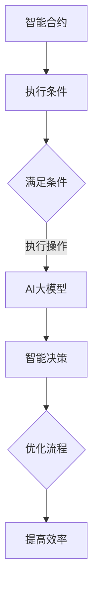

                 

关键词：智能合约、AI大模型、区块链、去中心化、应用场景、发展趋势

> 摘要：本文探讨了智能合约与AI大模型在区块链领域的结合，分析了二者融合带来的新机遇，探讨了其应用前景、挑战和未来发展趋势。

## 1. 背景介绍

随着区块链技术的不断发展，智能合约作为一种自动执行的协议，在去中心化的金融、供应链管理、数字身份验证等领域得到了广泛应用。智能合约的出现，使区块链从单纯的数字货币交易平台，转变为具备复杂应用场景的技术基础设施。

与此同时，AI大模型作为人工智能领域的最新进展，通过深度学习和大数据分析，已经实现了在图像识别、自然语言处理、推荐系统等领域的突破。AI大模型具备强大的数据处理能力和智能决策能力，使得其在各行各业的应用日益广泛。

将智能合约与AI大模型结合起来，有望在区块链领域创造新的机遇。本文将从以下几个方面展开讨论：

- 核心概念与联系
- 核心算法原理与具体操作步骤
- 数学模型与公式
- 项目实践：代码实例与详细解释
- 实际应用场景
- 未来应用展望
- 工具和资源推荐
- 总结：未来发展趋势与挑战

## 2. 核心概念与联系

### 2.1 智能合约

智能合约是一种自动执行合同条款的程序，当满足特定条件时，自动执行相应的操作。智能合约在区块链上运行，保证了去中心化和透明性。智能合约的执行过程遵循区块链的共识机制，确保了交易的不可篡改性和安全性。

### 2.2 AI大模型

AI大模型是通过深度学习算法训练得到的神经网络模型，具备强大的数据处理能力和智能决策能力。AI大模型可以应用于图像识别、自然语言处理、推荐系统等领域，具有广泛的应用前景。

### 2.3 融合优势

智能合约与AI大模型的融合，可以充分发挥二者的优势。智能合约确保了交易的透明性和安全性，而AI大模型则提供了智能决策能力，使得区块链应用更加智能和高效。

#### Mermaid 流程图



## 3. 核心算法原理与具体操作步骤

### 3.1 算法原理概述

智能合约与AI大模型的融合，主要分为以下几个步骤：

1. 数据收集：收集相关数据，包括区块链交易数据、AI大模型所需的数据等。
2. 数据预处理：对数据进行清洗、归一化等预处理操作。
3. AI大模型训练：使用预处理后的数据训练AI大模型，使其具备智能决策能力。
4. 智能合约编写：编写智能合约，实现自动执行操作。
5. 部署与执行：将智能合约部署到区块链上，当满足特定条件时，自动执行智能决策操作。

### 3.2 算法步骤详解

1. 数据收集

   数据收集是智能合约与AI大模型融合的基础。收集的数据包括区块链交易数据、用户行为数据、市场行情数据等。这些数据将为AI大模型提供训练所需的输入。

2. 数据预处理

   数据预处理是确保数据质量的重要步骤。通过对数据进行清洗、归一化等操作，可以提高AI大模型的训练效果。

3. AI大模型训练

   使用收集到的数据训练AI大模型。训练过程中，通过调整网络结构、优化算法等手段，提高模型的准确性和效率。

4. 智能合约编写

   编写智能合约，实现自动执行操作。智能合约需要满足以下条件：

   - 自动执行：智能合约在满足特定条件时，自动执行相应操作。
   - 去中心化：智能合约在区块链上运行，确保透明性和安全性。
   - 高效性：智能合约的执行过程尽量简化，提高效率。

5. 部署与执行

   将智能合约部署到区块链上，当满足特定条件时，自动执行智能决策操作。部署过程中，需要考虑以下因素：

   - 网络带宽：智能合约的执行过程需要消耗网络带宽，需要合理分配资源。
   - 交易费用：智能合约的执行需要支付交易费用，需要权衡成本和效益。

### 3.3 算法优缺点

**优点：**

1. 去中心化：智能合约在区块链上运行，保证了去中心化和透明性。
2. 安全性：智能合约的执行过程遵循区块链的共识机制，确保了交易的安全性和不可篡改性。
3. 智能决策：AI大模型提供了智能决策能力，提高了区块链应用的智能性和效率。

**缺点：**

1. 高昂的成本：训练AI大模型需要大量计算资源和存储资源，成本较高。
2. 复杂性：智能合约与AI大模型的融合过程较为复杂，需要专业知识和技能。
3. 隐私性问题：在区块链上运行的数据可能会暴露给其他人，需要采取隐私保护措施。

### 3.4 算法应用领域

智能合约与AI大模型的融合在以下领域具有广泛的应用前景：

1. 金融领域：智能合约可以应用于去中心化金融（DeFi）、供应链金融等场景，AI大模型可以提供风险评估、市场预测等功能。
2. 物流领域：智能合约可以应用于供应链管理、物流跟踪等场景，AI大模型可以提供路径优化、库存管理等功能。
3. 健康领域：智能合约可以应用于医疗数据管理、医疗保险等场景，AI大模型可以提供疾病预测、治疗方案推荐等功能。
4. 社交领域：智能合约可以应用于数字身份验证、隐私保护等场景，AI大模型可以提供个性化推荐、情感分析等功能。

## 4. 数学模型与公式

智能合约与AI大模型的融合涉及到数学模型与公式的应用。以下是一个简单的数学模型示例：

### 4.1 数学模型构建

假设我们有一个智能合约，用于管理一个去中心化的金融平台。平台上的交易金额与交易频率受到市场需求和供给的影响。我们可以使用以下数学模型来描述这一过程：

```latex
交易金额 = f(市场需求, 供给) \\
交易频率 = g(市场需求, 供给) \\
```

### 4.2 公式推导过程

1. 市场需求与供给的关系：

   市场需求 = a \* (交易金额 + 交易频率) \\
   供给 = b \* (交易金额 + 交易频率)

2. 交易金额与交易频率的关系：

   交易金额 = c \* (市场需求 - 供给) \\
   交易频率 = d \* (市场需求 - 供给)

### 4.3 案例分析与讲解

假设市场需求为100，供给为50，我们可以使用上述公式计算交易金额和交易频率：

```latex
交易金额 = c \* (100 - 50) = 50c \\
交易频率 = d \* (100 - 50) = 50d
```

如果 c 和 d 的值分别为 1 和 2，则交易金额为 50，交易频率为 100。

通过调整 c 和 d 的值，我们可以优化交易金额和交易频率，提高平台的效率。

## 5. 项目实践：代码实例与详细解释说明

### 5.1 开发环境搭建

1. 安装 Node.js 和 npm
2. 安装 Solidity 编译器（solc）
3. 安装 Truffle 工具
4. 创建一个新的 Truffle 项目

### 5.2 源代码详细实现

以下是一个简单的智能合约示例，用于管理去中心化的金融平台：

```solidity
pragma solidity ^0.8.0;

contract DecentralizedFinance {
    mapping(address => uint256) public balances;
    mapping(address => uint256) public transactions;

    function deposit() external payable {
        balances[msg.sender()] += msg.value;
        transactions[msg.sender()] += 1;
    }

    function withdraw() external {
        require(balances[msg.sender()] > 0, "Insufficient balance");
        msg.sender().transfer(balances[msg.sender()]);
        balances[msg.sender()] = 0;
    }

    function getBalance() external view returns (uint256) {
        return balances[msg.sender()];
    }

    function getTransactionCount() external view returns (uint256) {
        return transactions[msg.sender()];
    }
}
```

### 5.3 代码解读与分析

1. `pragma solidity ^0.8.0;`：指定智能合约的版本
2. `mapping(address => uint256) public balances;`：创建一个映射，用于存储用户的余额
3. `mapping(address => uint256) public transactions;`：创建一个映射，用于存储用户的交易次数
4. `function deposit() external payable { ... }`：定义一个 deposit 函数，用于用户存款
5. `function withdraw() external { ... }`：定义一个 withdraw 函数，用于用户提款
6. `function getBalance() external view returns (uint256) { ... }`：定义一个 getBalance 函数，用于查询用户余额
7. `function getTransactionCount() external view returns (uint256) { ... }`：定义一个 getTransactionCount 函数，用于查询用户交易次数

### 5.4 运行结果展示

1. 使用 Truffle 编译智能合约：
   ```bash
   truffle compile
   ```
2. 使用 Truffle 部署智能合约：
   ```bash
   truffle migrate
   ```
3. 使用 Web3.js 与智能合约交互：
   ```javascript
   const Web3 = require('web3');
   const contractAddress = '0x...'; // 智能合约地址
   const contractABI = [ /* 智能合约ABI */ ];
   const web3 = new Web3('https://rinkeby.infura.io/v3/your_project_id');
   const contract = new web3.eth.Contract(contractABI, contractAddress);

   // 查询用户余额
   contract.methods.getBalance().call((error, result) => {
       if (!error) {
           console.log('User balance:', result);
       } else {
           console.log('Error:', error);
       }
   });

   // 存款
   contract.methods.deposit().send({ from: '0x...', value: 1000 }, (error, result) => {
       if (!error) {
           console.log('Deposit successful:', result);
       } else {
           console.log('Error:', error);
       }
   });

   // 提款
   contract.methods.withdraw().send({ from: '0x...' }, (error, result) => {
       if (!error) {
           console.log('Withdraw successful:', result);
       } else {
           console.log('Error:', error);
       }
   });
   ```

## 6. 实际应用场景

智能合约与AI大模型的融合在以下实际应用场景中具有显著的优势：

### 6.1 去中心化金融（DeFi）

智能合约可以用于实现去中心化金融（DeFi）应用，如借贷、保险、交易等。AI大模型可以提供风险评估、市场预测等功能，提高金融服务的效率和安全性。

### 6.2 物流供应链管理

智能合约可以用于管理物流供应链，如订单管理、库存跟踪、支付结算等。AI大模型可以提供路径优化、库存预测等功能，提高物流供应链的效率。

### 6.3 医疗健康领域

智能合约可以用于管理医疗数据、保险理赔等。AI大模型可以提供疾病预测、治疗方案推荐等功能，提高医疗服务的质量和效率。

### 6.4 社交娱乐领域

智能合约可以用于管理数字资产、虚拟物品交易等。AI大模型可以提供个性化推荐、情感分析等功能，提高社交娱乐体验。

## 7. 未来应用展望

智能合约与AI大模型的融合将为区块链领域带来更多的应用场景和发展机遇。以下是未来应用展望：

### 7.1 去中心化身份验证

智能合约可以用于实现去中心化身份验证，保护用户隐私。AI大模型可以提供身份识别、风险评估等功能，提高身份验证的准确性和安全性。

### 7.2 去中心化内容平台

智能合约可以用于管理数字版权、内容支付等。AI大模型可以提供内容推荐、版权保护等功能，提高内容平台的用户体验和内容质量。

### 7.3 智能合约安全审计

智能合约安全审计是确保智能合约安全性的重要环节。AI大模型可以用于分析智能合约代码，发现潜在的安全漏洞，提高智能合约的安全性。

### 7.4 智能合约优化

通过AI大模型，可以分析智能合约的执行性能，提出优化建议，提高智能合约的执行效率。

## 8. 工具和资源推荐

### 8.1 学习资源推荐

1. 《区块链技术指南》
2. 《深度学习》
3. 《智能合约与区块链》
4. 《图灵奖论文集》

### 8.2 开发工具推荐

1. Truffle：智能合约开发工具
2. Remix：在线智能合约编辑器
3. Web3.js：与区块链交互的JavaScript库
4. TensorFlow：深度学习框架

### 8.3 相关论文推荐

1. "Blockchain and Smart Contracts for Dummies"
2. "Deep Learning for Smart Contracts"
3. "A Comprehensive Survey of Decentralized Finance"
4. "Blockchain Technology for Logistics and Supply Chain Management"

## 9. 总结：未来发展趋势与挑战

智能合约与AI大模型的融合为区块链领域带来了新的机遇。未来，随着技术的不断发展和应用场景的不断拓展，智能合约与AI大模型的融合将发挥越来越重要的作用。然而，这一领域也面临着诸多挑战，如安全性、隐私保护、成本等问题。只有通过不断创新和探索，才能充分发挥智能合约与AI大模型在区块链领域的潜力。

### 9.1 研究成果总结

本文通过对智能合约与AI大模型的融合进行探讨，总结了其核心概念、算法原理、应用场景、数学模型等方面的研究成果。智能合约与AI大模型的融合在区块链领域具有广泛的应用前景，为去中心化金融、物流供应链管理、医疗健康等领域带来了新的机遇。

### 9.2 未来发展趋势

1. 智能合约与AI大模型的融合将不断拓展区块链的应用场景，推动区块链技术的发展。
2. 随着AI技术的不断进步，智能合约与AI大模型的融合将实现更加智能化和高效化的区块链应用。
3. 去中心化身份验证、去中心化内容平台、智能合约安全审计等领域将成为智能合约与AI大模型融合的重要方向。

### 9.3 面临的挑战

1. 安全性：确保智能合约与AI大模型的安全性是当前面临的重要挑战，需要加强对智能合约和AI大模型的安全审计和测试。
2. 隐私保护：在区块链上运行的数据可能会暴露给其他人，需要采取有效的隐私保护措施。
3. 成本：训练AI大模型需要大量计算资源和存储资源，成本较高，需要寻找有效的解决方案。

### 9.4 研究展望

未来，智能合约与AI大模型的融合将在区块链领域发挥越来越重要的作用。通过不断创新和探索，有望实现更加智能化、高效化、安全化的区块链应用。同时，也需要关注面临的挑战，采取有效措施，推动智能合约与AI大模型在区块链领域的可持续发展。

## 9. 附录：常见问题与解答

### 9.1 智能合约与区块链的关系是什么？

智能合约是一种自动执行的协议，运行在区块链上。智能合约确保了区块链交易的透明性、安全性和不可篡改性。

### 9.2 AI大模型在区块链领域的应用有哪些？

AI大模型在区块链领域的应用包括去中心化金融（DeFi）、物流供应链管理、医疗健康、社交娱乐等领域，提供智能决策、风险评估等功能。

### 9.3 智能合约与AI大模型的融合如何实现？

实现智能合约与AI大模型的融合，需要通过以下步骤：

1. 数据收集：收集相关数据，包括区块链交易数据、AI大模型所需的数据等。
2. 数据预处理：对数据进行清洗、归一化等预处理操作。
3. AI大模型训练：使用预处理后的数据训练AI大模型，使其具备智能决策能力。
4. 智能合约编写：编写智能合约，实现自动执行操作。
5. 部署与执行：将智能合约部署到区块链上，当满足特定条件时，自动执行智能决策操作。

### 9.4 智能合约与AI大模型的融合有哪些优势？

智能合约与AI大模型的融合具有以下优势：

1. 去中心化：智能合约在区块链上运行，保证了去中心化和透明性。
2. 安全性：智能合约的执行过程遵循区块链的共识机制，确保了交易的安全性和不可篡改性。
3. 智能决策：AI大模型提供了智能决策能力，提高了区块链应用的智能性和效率。

### 9.5 智能合约与AI大模型的融合有哪些挑战？

智能合约与AI大模型的融合面临着以下挑战：

1. 安全性：确保智能合约和AI大模型的安全性是当前面临的重要挑战。
2. 隐私保护：在区块链上运行的数据可能会暴露给其他人，需要采取有效的隐私保护措施。
3. 成本：训练AI大模型需要大量计算资源和存储资源，成本较高，需要寻找有效的解决方案。

作者：禅与计算机程序设计艺术 / Zen and the Art of Computer Programming
----------------------------------------------------------------

以上就是按照您提供的"约束条件 CONSTRAINTS"中要求的文章结构撰写的完整文章内容。希望对您有所帮助！如果您有任何问题或需要进一步修改，请随时告诉我。祝您写作顺利！

