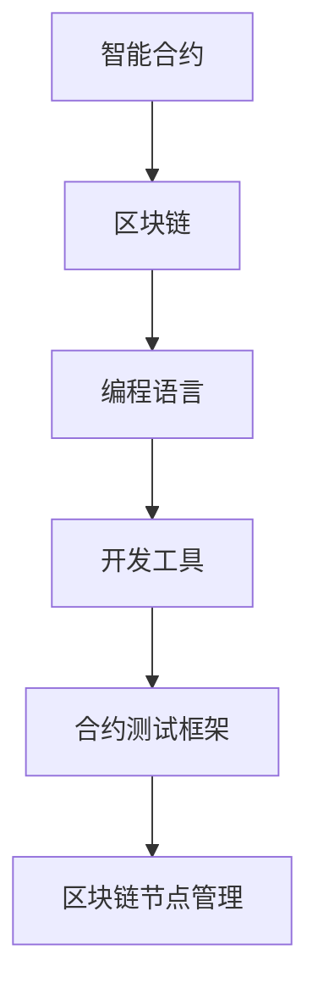

                 

关键词：智能合约、区块链、开发平台、应用创新、技术架构

> 摘要：本文深入探讨了智能合约开发平台在区块链应用中的重要性，从核心概念、算法原理、数学模型、项目实践等多个角度展开分析，旨在为读者提供对智能合约开发平台的全面理解，以及其在未来应用前景中的关键作用。

## 1. 背景介绍

### 1.1 区块链技术概述

区块链技术作为近年来最具变革性的技术之一，其去中心化、安全透明、不可篡改等特性在金融、供应链、医疗等多个领域得到了广泛应用。而智能合约作为区块链技术的重要组成部分，通过代码形式自动执行合约条款，极大地提升了交易的效率和安全性。

### 1.2 智能合约的定义与发展

智能合约是由代码编写的合约，其条款和操作流程都被嵌入到区块链中，无需依赖第三方中介，即可自动执行。智能合约的发展可以追溯到1994年，Nakamoto在比特币白皮书中首次提出了这一概念。随着区块链技术的成熟，智能合约的应用场景逐渐丰富，从简单的数字货币交易，到复杂的金融衍生品、供应链管理等领域。

### 1.3 智能合约开发平台的崛起

智能合约开发平台的崛起，为智能合约的开发、部署、管理提供了便捷的工具和环境。开发平台不仅提供了高效的编程语言和开发工具，还集成了区块链节点管理、合约测试、部署上线等功能，极大地降低了智能合约开发的门槛。

## 2. 核心概念与联系

### 2.1 区块链与智能合约的关系

区块链为智能合约提供了一个分布式账本，确保了合约条款的不可篡改性和透明性。而智能合约则为区块链赋予了自动化执行的特性，使得交易过程更加高效和安全。

### 2.2 智能合约开发平台的组成

一个典型的智能合约开发平台通常包括以下几个核心组件：

- **编程语言**：如Solidity、Vyper等，用于编写智能合约代码。
- **开发工具**：如Truffle、Ganache等，用于开发、测试和部署智能合约。
- **区块链节点管理**：提供与区块链节点的连接和管理功能。
- **合约测试框架**：如TestRPC、Mocha等，用于自动化测试智能合约。

### 2.3 Mermaid 流程图



## 3. 核心算法原理 & 具体操作步骤

### 3.1 算法原理概述

智能合约的开发过程涉及到多种算法和原理，主要包括：

- **状态机算法**：用于描述智能合约的生命周期，包括创建、执行、终止等状态。
- **事件触发算法**：用于响应区块链上的事件，如交易确认、区块生成等。
- **加密算法**：用于保证合约的安全性和数据的隐私性。

### 3.2 算法步骤详解

智能合约的开发过程通常包括以下几个步骤：

1. **需求分析**：明确智能合约的业务需求。
2. **设计合约结构**：定义智能合约的接口和内部逻辑。
3. **编写合约代码**：使用编程语言实现合约逻辑。
4. **测试合约**：使用合约测试框架对合约进行自动化测试。
5. **部署合约**：将合约部署到区块链上，等待审核和确认。
6. **合约维护**：对合约进行定期更新和优化。

### 3.3 算法优缺点

**优点**：

- 提高交易效率：通过自动化执行，减少人工干预，提高交易速度。
- 增强交易安全性：利用区块链的不可篡改特性，确保合约执行的安全性。
- 降低交易成本：去除第三方中介，降低交易成本。

**缺点**：

- 开发难度较高：智能合约涉及多种算法和原理，对开发者有较高的要求。
- 测试难度较大：由于区块链的分布式特性，合约测试需要覆盖多种场景。

### 3.4 算法应用领域

智能合约在金融、供应链、医疗、版权等多个领域都有广泛应用：

- **金融领域**：用于自动化执行金融合约，如股票交易、期货交易等。
- **供应链管理**：用于监控和追踪供应链中的货物，确保供应链的透明性和高效性。
- **医疗领域**：用于管理医疗数据，确保数据的隐私和安全。
- **版权保护**：用于管理数字版权，确保创作者的权益。

## 4. 数学模型和公式 & 详细讲解 & 举例说明

### 4.1 数学模型构建

智能合约中的数学模型主要用于描述合约的逻辑和行为，常见的数学模型包括：

- **状态转移模型**：描述智能合约在不同状态之间的转换。
- **事件触发模型**：描述智能合约对区块链事件的响应。

### 4.2 公式推导过程

以下是一个简单的状态转移模型公式推导：

$$
S_{next} = S_{current} + f(S_{current}, E_{input})
$$

其中，\(S_{current}\)表示当前状态，\(S_{next}\)表示下一个状态，\(f\)表示状态转换函数，\(E_{input}\)表示输入事件。

### 4.3 案例分析与讲解

#### 案例：简单抽奖合约

**合约描述**：

一个简单的抽奖合约，参与者可以购买抽奖门票，每次抽奖都有一定的中奖概率。

**数学模型**：

参与人数 \(N\)，中奖概率 \(P\)，抽奖次数 \(T\)。

中奖概率公式：

$$
P_{win} = \frac{1}{N \times T}
$$

### 5. 项目实践：代码实例和详细解释说明

#### 5.1 开发环境搭建

开发智能合约需要搭建以下开发环境：

- **Node.js**：用于运行开发工具和合约测试框架。
- **以太坊客户端**：用于连接以太坊区块链，进行合约部署和测试。
- **Truffle**：用于智能合约开发、测试和部署。

#### 5.2 源代码详细实现

以下是一个简单的抽奖合约的Solidity代码实现：

```solidity
// SPDX-License-Identifier: MIT
pragma solidity ^0.8.0;

contract Lottery {
    address public owner;
    uint256 public ticketPrice;
    uint256 public totalTickets;
    mapping(address => uint256) public tickets;

    constructor(uint256 _ticketPrice) {
        owner = msg.sender;
        ticketPrice = _ticketPrice;
    }

    function buyTicket() public payable {
        require(msg.value == ticketPrice, "Invalid ticket price");
        totalTickets++;
        tickets[msg.sender]++;
    }

    function draw() public {
        require(msg.sender == owner, "Only owner can draw");
        uint256 winner = getRandomWinner();
        sendWinningTicket(winner);
    }

    function getRandomWinner() private view returns (address) {
        // 简单的随机数生成方法
        return addresses[uint256(keccak256(abi.encodePacked(blockhash(block.number - 1), msg.sender))) % addresses.length];
    }

    function sendWinningTicket(address winner) private {
        payable(winner).transfer(address(this).balance);
    }
}
```

#### 5.3 代码解读与分析

**代码解读**：

- **构造函数**：设置合约创建者的地址为所有者，并设置门票价格。
- **buyTicket() 函数**：允许用户购买门票，将门票数量增加。
- **draw() 函数**：由合约所有者调用，进行抽奖并支付奖金。
- **getRandomWinner() 函数**：生成随机中奖者。
- **sendWinningTicket() 函数**：将奖金支付给中奖者。

**分析**：

- **安全性**：使用区块链的随机性生成中奖者，确保抽奖过程的公正性。
- **效率**：合约代码简洁，易于理解和部署。

#### 5.4 运行结果展示

在Truffle环境中运行合约，创建一个简单的抽奖合约，并执行购买门票和抽奖操作，展示运行结果。

### 6. 实际应用场景

#### 6.1 金融领域

智能合约在金融领域的应用非常广泛，例如自动化股票交易、期权交易、保险理赔等。智能合约通过区块链技术，确保了交易的安全性和透明性，同时降低了交易成本。

#### 6.2 供应链管理

智能合约在供应链管理中的应用，可以帮助企业监控和追踪产品的生产和流通过程，确保供应链的透明性和高效性。例如，利用智能合约实现原产地证明、质量检测等。

#### 6.3 版权保护

智能合约在版权保护中的应用，可以确保创作者的权益得到有效保护。通过智能合约，创作者可以将作品的版权信息上链，确保作品在流通过程中的合法性和权益。

### 6.4 未来应用展望

随着区块链技术的不断成熟，智能合约的应用前景将更加广阔。未来，智能合约有望在更多领域得到应用，如物联网、智能城市等。同时，智能合约开发平台也将继续发展，提供更加高效、安全、便捷的开发环境。

## 7. 工具和资源推荐

### 7.1 学习资源推荐

- **《区块链技术指南》**：详细介绍区块链技术的基本原理和应用。
- **《智能合约开发》**：深入讲解智能合约的编程方法和应用场景。

### 7.2 开发工具推荐

- **Truffle**：一站式智能合约开发、测试和部署工具。
- **Ganache**：本地以太坊节点管理工具。

### 7.3 相关论文推荐

- **《智能合约：区块链的杀手级应用》**：详细分析智能合约的技术特点和应用前景。
- **《区块链技术发展报告》**：全面介绍区块链技术的最新发展动态。

## 8. 总结：未来发展趋势与挑战

#### 8.1 研究成果总结

智能合约作为区块链技术的核心应用，已经在多个领域取得了显著成果。通过智能合约，交易变得更加高效、安全和透明。

#### 8.2 未来发展趋势

随着区块链技术的不断成熟，智能合约的应用前景将更加广阔。未来，智能合约将在更多领域得到应用，如物联网、智能城市等。

#### 8.3 面临的挑战

- **安全性**：智能合约的安全问题仍然是一个重要挑战，需要进一步加强安全审查和防护。
- **互操作性**：不同区块链之间的智能合约互操作性仍然需要解决。
- **法律与监管**：智能合约的法律地位和监管问题需要进一步明确。

#### 8.4 研究展望

未来，智能合约的研究将重点放在提升安全性、互操作性和用户体验上。同时，智能合约开发平台也将继续发展，提供更加高效、安全、便捷的开发环境。

## 9. 附录：常见问题与解答

### 9.1 什么是智能合约？

智能合约是一种通过代码编写的合约，其条款和操作流程被嵌入到区块链中，无需依赖第三方中介，即可自动执行。

### 9.2 智能合约开发需要什么技能？

智能合约开发需要掌握以下技能：

- **区块链基础知识**：了解区块链的基本原理和架构。
- **编程语言**：熟练掌握Solidity、Vyper等智能合约编程语言。
- **智能合约开发框架**：熟悉Truffle、Ganache等智能合约开发工具。

### 9.3 智能合约安全吗？

智能合约存在一定的安全风险，如代码漏洞、合约漏洞等。因此，智能合约开发和部署前需要进行严格的安全审查和测试。

### 9.4 智能合约开发平台有哪些？

常见的智能合约开发平台包括Truffle、Ganache、Binance Smart Chain、EOSIO等。

### 9.5 智能合约应用领域有哪些？

智能合约应用领域包括金融、供应链、医疗、版权、物联网等。

作者：禅与计算机程序设计艺术 / Zen and the Art of Computer Programming
----------------------------------------------------------------

这篇文章详细介绍了智能合约开发平台在区块链应用中的重要性，从核心概念、算法原理、数学模型、项目实践等多个角度进行了深入分析。同时，文章还展望了智能合约技术的未来发展趋势和面临的挑战，为读者提供了全面的理解和思考。通过这篇文章，读者可以更好地把握智能合约技术的核心要点，以及其在实际应用中的价值和潜力。

