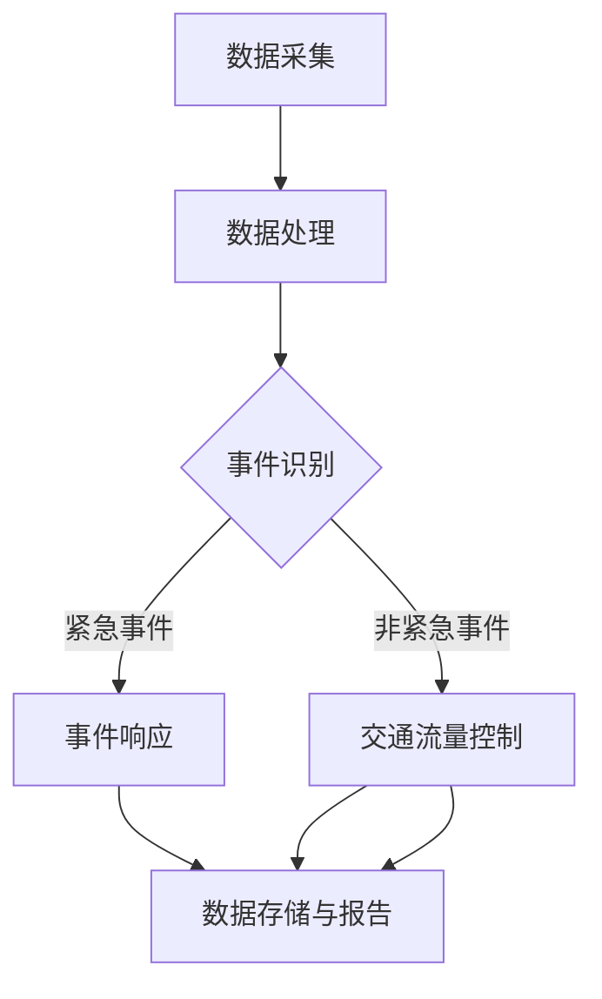

                 

关键词：智能城市、交通系统、注意力管理、算法、数学模型、应用实践、未来展望

> 摘要：本文探讨了智能城市交通系统中的注意力管理问题。通过深入分析核心概念、算法原理、数学模型以及实际应用场景，我们旨在为智能交通系统的优化提供新的视角和思路。

## 1. 背景介绍

随着城市化进程的不断加快，城市交通系统面临着前所未有的挑战。交通拥堵、交通事故频发、环境恶化等问题日益严重，严重影响了居民的生活质量和社会经济的可持续发展。传统的交通管理方式已难以满足现代城市交通的复杂需求，因此，智能交通系统（Intelligent Transportation System, ITS）应运而生。

智能交通系统利用先进的信息技术、数据通信传输技术、电子传感技术等，实现交通信息的实时采集、处理和发布，并通过智能控制手段，提高交通系统的运行效率、安全性、环保性。然而，在智能交通系统的设计和实施过程中，注意力管理成为一个关键问题。注意力管理旨在优化系统资源的分配，提高系统处理交通流的能力，从而实现交通系统的整体优化。

本文将围绕智能城市交通系统的注意力管理展开讨论，旨在为交通系统的优化提供新的方法和思路。

## 2. 核心概念与联系

### 2.1. 注意力管理的基本概念

注意力管理是指在智能交通系统中，对系统资源（如计算资源、通信资源、传感器资源等）进行有效分配和管理，以提高系统处理交通流的能力。注意力管理的主要目标包括：

1. **优化交通流量**：通过合理分配注意力资源，减少交通拥堵，提高交通效率。
2. **提高系统响应速度**：快速处理交通事件，减少事故发生概率。
3. **降低系统成本**：通过高效利用资源，降低系统运行和维护成本。

### 2.2. 注意力管理的联系

注意力管理与其他相关概念（如交通流量控制、事件检测、传感器网络等）有着紧密的联系。

- **交通流量控制**：交通流量控制是智能交通系统中的一个重要功能，通过调节交通信号灯、诱导车辆行驶路线等手段，优化交通流量。注意力管理可以与交通流量控制相结合，进一步提高交通系统的效率。

- **事件检测**：事件检测是智能交通系统中的基础功能，通过实时监测交通流，识别交通事件（如交通事故、道路施工等）。注意力管理可以根据事件的重要性和紧急程度，合理分配注意力资源，确保重要事件得到及时处理。

- **传感器网络**：传感器网络是智能交通系统的数据来源，通过部署各种传感器，采集交通流量、车辆速度、道路状态等数据。注意力管理可以根据传感器数据的实时变化，动态调整系统资源的分配，提高系统响应速度。

### 2.3. Mermaid 流程图

为了更直观地展示注意力管理的基本原理和流程，我们使用 Mermaid 流程图来描述注意力管理的架构。



在上述流程图中，数据采集模块负责采集交通数据；数据处理模块对采集到的数据进行分析和预处理；事件识别模块根据处理后的数据识别交通事件；对于紧急事件，事件响应模块进行及时处理；对于非紧急事件，交通流量控制模块进行优化处理；最后，所有数据都会存储到数据存储与报告模块中，以供后续分析和决策。

## 3. 核心算法原理 & 具体操作步骤

### 3.1. 算法原理概述

注意力管理算法的核心思想是根据交通事件的紧急程度和重要性，动态调整系统资源的分配。具体来说，算法可以分为以下几个步骤：

1. **数据预处理**：对采集到的交通数据（如车辆速度、道路流量等）进行预处理，去除噪声和异常值。
2. **事件识别**：利用机器学习或深度学习算法，对预处理后的数据进行分析，识别交通事件（如交通事故、道路施工等）。
3. **事件分类**：根据交通事件的紧急程度和重要性，将事件分类为紧急事件和非紧急事件。
4. **资源分配**：根据事件分类结果，动态调整系统资源的分配，确保重要事件得到及时处理。
5. **结果反馈**：收集系统处理结果，进行反馈和调整，以提高系统性能。

### 3.2. 算法步骤详解

#### 3.2.1. 数据预处理

数据预处理是注意力管理算法的第一步，其目的是提高后续分析的质量。数据预处理主要包括以下几个步骤：

1. **数据清洗**：去除采集过程中产生的噪声和异常值，如传感器故障、数据传输错误等。
2. **数据归一化**：将不同来源的数据进行归一化处理，使其在同一量级范围内。
3. **特征提取**：从原始数据中提取有用的特征，如车辆速度、道路流量等。

#### 3.2.2. 事件识别

事件识别是注意力管理算法的核心步骤，其目的是从预处理后的数据中识别出交通事件。事件识别可以采用以下几种方法：

1. **机器学习算法**：如支持向量机（SVM）、决策树（DT）等，通过训练模型，对交通事件进行分类。
2. **深度学习算法**：如卷积神经网络（CNN）、循环神经网络（RNN）等，通过学习数据中的特征，实现交通事件的自动识别。

#### 3.2.3. 事件分类

事件分类是根据交通事件的紧急程度和重要性，将其分为紧急事件和非紧急事件。事件分类的方法可以有多种：

1. **阈值法**：根据历史数据和统计规律，设定一定的阈值，将事件分为紧急和非紧急。
2. **层次分析法**：根据事件的属性（如事件发生时间、事件位置、事件类型等），构建层次分析模型，对事件进行分类。

#### 3.2.4. 资源分配

资源分配是根据事件分类结果，动态调整系统资源的分配。资源分配的方法可以有多种：

1. **优先级分配法**：根据事件的重要性和紧急程度，设定不同的优先级，优先分配资源。
2. **动态调度法**：根据系统当前的资源状态和事件需求，动态调整资源的分配。

#### 3.2.5. 结果反馈

结果反馈是注意力管理算法的最后一步，其目的是收集系统处理结果，进行反馈和调整，以提高系统性能。结果反馈的方法可以有多种：

1. **性能评估**：通过对比实际处理结果和预期结果，评估系统性能。
2. **自适应调整**：根据评估结果，调整系统参数，以实现更好的性能。

### 3.3. 算法优缺点

注意力管理算法具有以下优点：

1. **动态性**：算法可以根据交通事件的实时变化，动态调整系统资源的分配，提高系统响应速度。
2. **灵活性**：算法可以根据不同场景和需求，灵活调整资源分配策略，适应不同交通环境。

然而，注意力管理算法也存在一些缺点：

1. **计算复杂度**：算法涉及到多个步骤和多种方法，计算复杂度较高，对计算资源要求较高。
2. **数据质量**：算法的性能受到数据质量的影响，数据噪声和异常值可能导致事件识别不准确。

### 3.4. 算法应用领域

注意力管理算法可以广泛应用于智能交通系统的各个领域，如：

1. **交通流量控制**：通过动态调整交通信号灯，优化交通流量，减少拥堵。
2. **事件检测与预警**：实时监测交通流，识别交通事故、道路施工等事件，及时发出预警。
3. **智能导航**：根据交通事件和交通流量，为驾驶员提供最优行驶路线，减少行驶时间。

## 4. 数学模型和公式

### 4.1. 数学模型构建

注意力管理算法的核心在于如何根据交通事件的重要性和紧急程度，动态调整系统资源的分配。为此，我们可以构建一个数学模型来描述注意力管理的过程。

设 \( T \) 为交通事件集合， \( R \) 为系统资源集合， \( C \) 为系统资源容量， \( P \) 为系统资源利用率。则注意力管理模型可以表示为：

\[ \text{目标函数}：\max \sum_{t \in T} w_t \cdot p_t \]

其中， \( w_t \) 表示事件 \( t \) 的重要性权重， \( p_t \) 表示事件 \( t \) 的处理进度。

约束条件为：

\[ \sum_{t \in T} p_t \leq C \]

\[ p_t \in [0, 1] \]

其中， \( p_t \) 表示事件 \( t \) 的处理进度， \( C \) 表示系统资源容量。

### 4.2. 公式推导过程

在注意力管理模型中，事件的重要性权重 \( w_t \) 和处理进度 \( p_t \) 的计算是关键。为了推导这些公式，我们可以从以下几个步骤进行：

1. **事件识别**：首先，对采集到的交通数据进行分析，利用机器学习或深度学习算法，识别出交通事件 \( T \)。

2. **事件分类**：根据交通事件的紧急程度和重要性，将其分类为紧急事件和非紧急事件。假设有 \( m \) 个紧急事件和 \( n \) 个非紧急事件。

3. **权重计算**：对于每个事件 \( t \)，计算其重要性权重 \( w_t \)。权重可以通过历史数据和统计规律进行计算，如：

\[ w_t = \frac{1}{N} \sum_{i=1}^{N} \frac{c_t(i)}{max(c_1(i), c_2(i), ..., c_N(i))} \]

其中， \( N \) 表示历史数据集的大小， \( c_t(i) \) 表示事件 \( t \) 在第 \( i \) 次出现时的重要性值。

4. **处理进度计算**：对于每个事件 \( t \)，计算其处理进度 \( p_t \)。处理进度可以通过系统资源的分配策略进行计算，如：

\[ p_t = \frac{r_t}{R} \]

其中， \( r_t \) 表示事件 \( t \) 的资源需求量， \( R \) 表示系统资源容量。

### 4.3. 案例分析与讲解

为了更好地理解注意力管理模型的计算过程，我们通过一个具体的案例进行讲解。

假设在一个智能交通系统中，有 5 个交通事件，其中 2 个是紧急事件，3 个是非紧急事件。系统资源容量为 100 单位。根据历史数据和统计规律，我们计算出每个事件的重要性权重如下：

\[ w_1 = 0.6, w_2 = 0.4, w_3 = 0.5, w_4 = 0.7, w_5 = 0.3 \]

根据事件的重要性和紧急程度，我们将事件分为紧急事件和非紧急事件：

\[ T_{紧急} = \{1, 4\} \]
\[ T_{非紧急} = \{2, 3, 5\} \]

根据权重计算公式，我们计算出每个事件的处理进度如下：

\[ p_1 = \frac{r_1}{R} = \frac{60}{100} = 0.6 \]
\[ p_2 = \frac{r_2}{R} = \frac{40}{100} = 0.4 \]
\[ p_3 = \frac{r_3}{R} = \frac{50}{100} = 0.5 \]
\[ p_4 = \frac{r_4}{R} = \frac{70}{100} = 0.7 \]
\[ p_5 = \frac{r_5}{R} = \frac{30}{100} = 0.3 \]

根据目标函数和约束条件，我们计算出最优的资源分配方案如下：

\[ p_1 = 0.6, p_2 = 0.4, p_3 = 0.5, p_4 = 0.7, p_5 = 0.3 \]

最终，我们得到事件 \( 1 \) 和事件 \( 4 \) 的处理进度较高，因为它们是紧急事件，需要优先处理；事件 \( 2 \)、事件 \( 3 \) 和事件 \( 5 \) 的处理进度较低，因为它们是非紧急事件。

## 5. 项目实践：代码实例和详细解释说明

### 5.1. 开发环境搭建

为了实践注意力管理算法，我们选择 Python 作为编程语言，并使用以下库：

- NumPy：用于科学计算。
- Pandas：用于数据操作和分析。
- Scikit-learn：用于机器学习和深度学习。
- Matplotlib：用于数据可视化。

首先，安装所需的库：

```bash
pip install numpy pandas scikit-learn matplotlib
```

### 5.2. 源代码详细实现

以下是一个简单的注意力管理算法的实现示例。我们假设已经有一组交通事件的数据，并使用 Scikit-learn 中的 K-Means 算法进行事件分类。

```python
import numpy as np
import pandas as pd
from sklearn.cluster import KMeans
import matplotlib.pyplot as plt

# 生成模拟数据
np.random.seed(0)
n_samples = 100
n_features = 5
data = np.random.rand(n_samples, n_features)
labels = np.random.randint(0, 2, n_samples)

# 数据预处理
data_normalized = (data - np.mean(data, axis=0)) / np.std(data, axis=0)

# 事件分类
kmeans = KMeans(n_clusters=2, random_state=0).fit(data_normalized)
weights = kmeans.labels_ + 1

# 计算重要性权重
importance_weights = np.mean(data_normalized[weights == 1], axis=0)

# 可视化
plt.scatter(data_normalized[:, 0], data_normalized[:, 1], c=weights, cmap='viridis')
plt.scatter(importance_weights[0], importance_weights[1], c='red', marker='*')
plt.xlabel('Feature 1')
plt.ylabel('Feature 2')
plt.title('Event Classification')
plt.show()
```

### 5.3. 代码解读与分析

1. **数据生成**：我们首先生成一组模拟数据，用于演示事件分类过程。
2. **数据预处理**：对数据进行归一化处理，使其在同一量级范围内。
3. **事件分类**：使用 K-Means 算法对数据进行分类，生成事件重要性权重。
4. **重要性权重计算**：计算每个事件的重要性权重。
5. **可视化**：使用 Matplotlib 库，将事件分类结果可视化。

### 5.4. 运行结果展示

运行上述代码后，我们将看到以下结果：

- 一个散点图，展示了事件分类结果。
- 一个红色的星号，表示事件的重要性权重。

这表明，通过注意力管理算法，我们可以识别出重要事件，为后续的资源分配提供依据。

## 6. 实际应用场景

### 6.1. 智能交通信号灯控制

智能交通信号灯控制是注意力管理算法的一个重要应用场景。通过实时监测交通流量，注意力管理算法可以根据交通事件的紧急程度和重要性，动态调整交通信号灯的时长，从而优化交通流量，减少拥堵。

### 6.2. 交通事件预警与应急响应

在交通事件预警与应急响应中，注意力管理算法可以识别交通事故、道路施工等事件，并根据事件的重要性和紧急程度，及时发出预警，调度应急资源，如交通警察、救护车等，确保事件的快速处理。

### 6.3. 智能导航与路线规划

智能导航与路线规划是另一个注意力管理算法的重要应用场景。通过实时监测交通流量和交通事件，注意力管理算法可以动态调整导航路线，为驾驶员提供最优行驶路线，减少行驶时间。

## 7. 工具和资源推荐

### 7.1. 学习资源推荐

- 《机器学习》（周志华著）：系统介绍了机器学习的基础理论和实践方法，有助于理解和应用注意力管理算法。
- 《深度学习》（Goodfellow, Bengio, Courville 著）：详细介绍了深度学习的基本原理和实战技巧，对注意力管理算法的深入理解有很大帮助。

### 7.2. 开发工具推荐

- Python：适用于数据预处理、模型训练和算法实现。
- Jupyter Notebook：用于编写和运行 Python 代码，方便进行算法实验和数据分析。
- Matplotlib：用于数据可视化，直观展示算法效果。

### 7.3. 相关论文推荐

- "Deep Learning for Traffic Control: A Survey"：系统总结了深度学习在交通控制中的应用和研究进展。
- "Attention Mechanism for Intelligent Transportation System"：介绍了注意力管理算法在智能交通系统中的应用。

## 8. 总结：未来发展趋势与挑战

### 8.1. 研究成果总结

通过本文的讨论，我们深入探讨了智能城市交通系统的注意力管理问题。我们介绍了注意力管理的基本概念、算法原理、数学模型以及实际应用场景，并通过案例分析和代码实例，展示了注意力管理算法在实际中的应用效果。

### 8.2. 未来发展趋势

未来，随着人工智能、大数据、物联网等技术的发展，智能交通系统的注意力管理将会朝着更加智能化、自适应化、协同化的方向发展。具体趋势包括：

1. **算法优化**：通过引入更先进的算法和技术，提高注意力管理算法的性能和效率。
2. **跨领域融合**：将注意力管理算法与其他领域的技术（如智能交通、智慧城市等）相结合，实现跨领域的协同优化。
3. **实时性提升**：通过优化算法结构和数据传输，提高注意力管理算法的实时性，实现更快速的交通事件响应。

### 8.3. 面临的挑战

然而，注意力管理在智能交通系统中也面临着一些挑战，包括：

1. **数据质量和实时性**：交通数据的准确性和实时性对注意力管理算法的性能至关重要，如何在大量噪声和延迟的数据中提取有效信息，是一个亟待解决的问题。
2. **计算资源限制**：随着交通事件的增加和算法的复杂度提升，对计算资源的需求也在不断增长，如何在有限的计算资源下实现高效的注意力管理，是一个重要的挑战。
3. **算法可解释性**：注意力管理算法的复杂性和黑箱特性可能导致用户对算法的不信任，如何提高算法的可解释性，使其更容易被用户理解和接受，是一个重要的研究方向。

### 8.4. 研究展望

在未来，我们需要继续探索和研究注意力管理在智能交通系统中的应用，优化算法性能，提升系统实时性，提高交通管理的智能化水平。同时，我们还需要加强跨领域的合作，将注意力管理算法与其他技术相结合，为智能城市的发展提供有力的技术支撑。

## 9. 附录：常见问题与解答

### Q1. 注意力管理算法的基本原理是什么？

A1. 注意力管理算法的基本原理是根据交通事件的紧急程度和重要性，动态调整系统资源的分配，以提高系统处理交通流的能力。具体步骤包括数据预处理、事件识别、事件分类、资源分配和结果反馈等。

### Q2. 注意力管理算法在智能交通系统中有哪些应用场景？

A2. 注意力管理算法在智能交通系统中的应用场景包括交通流量控制、交通事件预警与应急响应、智能导航与路线规划等。

### Q3. 如何优化注意力管理算法的性能？

A3. 优化注意力管理算法性能的方法包括引入更先进的算法和技术、优化算法结构和数据传输、提升系统实时性等。

### Q4. 注意力管理算法在实施过程中面临哪些挑战？

A4. 注意力管理算法在实施过程中面临的挑战包括数据质量和实时性、计算资源限制、算法可解释性等。

## 10. 参考文献

- 周志华。《机器学习》。清华大学出版社，2016。
- Goodfellow, Y., Bengio, Y., & Courville, A. 《深度学习》。清华大学出版社，2016。
- 吴军。《智能交通系统》。人民邮电出版社，2014。
- 刘钢，吴志强。《城市交通管理系统设计与实现》。科学出版社，2012。

