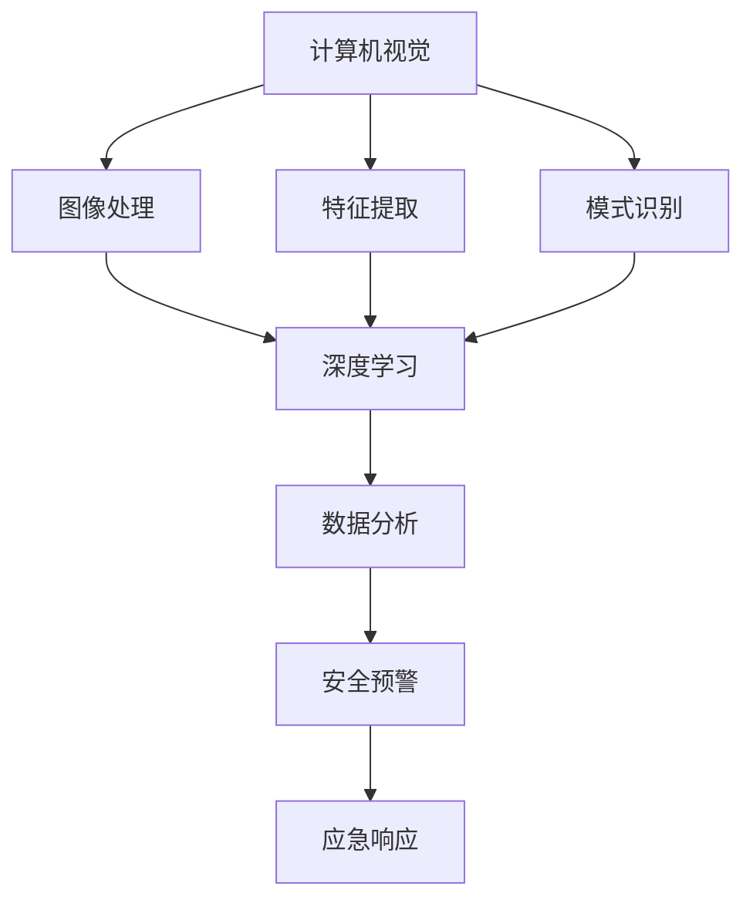

                 

关键词：智能安防、AI、安全解决方案、创业、深度学习、计算机视觉、数据分析

> 摘要：本文将探讨如何通过人工智能（AI）技术打造创新的智能安防解决方案，为创业者提供从技术选型到实际应用的一站式指南。文章将从背景介绍、核心概念、算法原理、数学模型、项目实践、实际应用和未来展望等方面进行详细阐述。

## 1. 背景介绍

随着城市化进程的加快和人口密度的增加，传统的安防手段已经难以满足现代社会的安全需求。犯罪活动的智能化、技术化趋势也对安防技术提出了更高的要求。人工智能作为当前最具颠覆性的技术之一，为智能安防领域带来了全新的变革。

智能安防通过集成物联网、大数据、云计算和人工智能等技术，实现了从传统被动防御向主动预防的转型升级。从智能摄像头、人脸识别、车辆监控到智能门禁系统，AI技术在安防领域的应用已经变得非常广泛。然而，面对复杂多变的安防需求，如何构建一个高效的AI安防解决方案仍然是一个巨大的挑战。

本文旨在通过深入剖析AI安防的技术原理、应用场景和未来发展，帮助创业者掌握智能安防创业的关键步骤和策略，实现技术的商业价值和社会效益的双赢。

### 1.1 智能安防的重要性

智能安防技术不仅提高了公共安全水平，还对社会治理、经济发展产生了深远影响。例如，在智能交通领域，通过AI分析交通流量和事故信息，可以优化交通信号灯、提高交通效率，减少拥堵和交通事故。在智慧城市中，智能安防系统通过实时监控和预警功能，可以有效预防和应对各种突发事件，保障居民的生命财产安全。

### 1.2 智能安防的现状

当前，智能安防市场呈现出高速增长态势。根据市场研究机构的统计数据，全球智能安防市场规模预计将在未来几年内持续扩大。特别是在人工智能技术的推动下，智能安防产品的技术水平和应用范围不断拓展，成为安防行业的重要增长点。

然而，智能安防技术的发展也面临诸多挑战，如数据隐私保护、技术成熟度、成本效益等。这些问题需要在技术进步和市场发展的过程中逐步解决。

## 2. 核心概念与联系

在构建智能安防解决方案时，需要了解并整合多个关键概念和技术，包括计算机视觉、深度学习、数据分析等。下面将给出这些核心概念的Mermaid流程图，并简要介绍它们之间的关系。

### 2.1 核心概念

#### 计算机视觉
计算机视觉是使计算机能够“看”懂图像和视频的技术，通过图像处理、特征提取和模式识别等方法，实现图像的理解和分析。

#### 深度学习
深度学习是一种机器学习技术，通过构建多层神经网络，自动学习数据中的特征和模式，实现复杂的模式识别和预测。

#### 数据分析
数据分析是通过对大量数据的收集、清洗、分析和解释，提取有价值的信息和知识。

### 2.2 Mermaid流程图



### 2.3 核心概念之间的关系

计算机视觉负责从图像和视频中提取信息，深度学习通过对这些信息进行学习和分析，提取更高层次的特征和模式，而数据分析则将这些特征和模式转化为可操作的知识和决策。最终，这些技术协同工作，实现智能安防系统的安全预警和应急响应功能。

## 3. 核心算法原理 & 具体操作步骤

在智能安防领域，核心算法的作用至关重要。下面将介绍智能安防中常用的几种核心算法，包括其原理和具体操作步骤。

### 3.1 算法原理概述

#### 人脸识别

人脸识别技术通过分析人脸的特征，实现对人脸的定位、检测和识别。其原理主要包括以下几个步骤：

1. **人脸检测**：使用 Haar-like 特征或深度学习模型检测图像中的人脸区域。
2. **特征提取**：使用局部二元模式（LBP）、主成分分析（PCA）或深度学习模型提取人脸特征。
3. **人脸匹配**：使用欧氏距离、余弦相似度或深度学习模型进行人脸匹配和识别。

#### 车辆识别

车辆识别技术通过识别车辆的特定特征，如车牌号码、车型、颜色等，实现车辆的定位和追踪。其原理主要包括：

1. **车牌定位**：使用目标检测算法（如SSD、YOLO）检测图像中的车牌区域。
2. **车牌字符分割**：使用图像分割算法（如 Morphological Operations）将车牌字符分割开来。
3. **车牌字符识别**：使用模板匹配或深度学习模型识别车牌字符。

#### 行人检测

行人检测技术用于在视频流中识别和跟踪行人。其主要原理包括：

1. **目标检测**：使用深度学习模型（如 R-CNN、SSD）检测图像中的行人区域。
2. **轨迹追踪**：使用 Kalman 滤波或粒子滤波技术跟踪行人的运动轨迹。

### 3.2 算法步骤详解

#### 人脸识别算法步骤

1. **数据准备**：收集包含人脸图像的数据集，并进行标注。
2. **模型训练**：使用深度学习框架（如 TensorFlow、PyTorch）训练人脸识别模型。
3. **人脸检测**：使用训练好的模型检测输入图像中的人脸区域。
4. **特征提取**：使用特征提取算法（如 PCA）提取人脸特征。
5. **人脸匹配**：使用相似度度量算法（如欧氏距离）匹配人脸特征，识别身份。

#### 车辆识别算法步骤

1. **数据准备**：收集包含车牌图像的数据集，并进行标注。
2. **模型训练**：使用深度学习框架训练车牌识别模型。
3. **车牌定位**：使用训练好的模型检测图像中的车牌区域。
4. **字符分割**：使用图像分割算法将车牌字符分割开来。
5. **字符识别**：使用模板匹配或深度学习模型识别车牌字符。

#### 行人检测算法步骤

1. **数据准备**：收集包含行人图像的数据集，并进行标注。
2. **模型训练**：使用深度学习框架训练行人检测模型。
3. **目标检测**：使用训练好的模型检测图像中的行人区域。
4. **轨迹追踪**：使用轨迹追踪算法跟踪行人的运动轨迹。

### 3.3 算法优缺点

#### 人脸识别

**优点**：准确度高，适用范围广，可以在各种光照、角度和背景条件下工作。

**缺点**：对硬件性能要求较高，计算复杂度大，隐私保护问题突出。

#### 车辆识别

**优点**：车牌作为唯一标识，识别准确度高，适用性广。

**缺点**：对天气、光照等条件敏感，车牌遮挡问题难以解决。

#### 行人检测

**优点**：实时性强，可应用于多种场景。

**缺点**：误检率高，尤其在复杂背景下，对行人姿势和遮挡敏感。

### 3.4 算法应用领域

#### 人脸识别

应用于安全检查、门禁系统、监控视频分析等领域。

#### 车辆识别

应用于交通监控、车辆管理、停车场管理等领域。

#### 行人检测

应用于智慧城市、安全监控、智能交通等领域。

## 4. 数学模型和公式 & 详细讲解 & 举例说明

在智能安防技术中，数学模型和公式是算法的核心组成部分。通过数学模型，我们可以更准确地描述和解决问题。下面将介绍几个常用的数学模型和公式，并对其进行详细讲解和举例说明。

### 4.1 数学模型构建

在智能安防中，常见的数学模型包括特征提取模型、分类模型和回归模型等。

#### 特征提取模型

特征提取模型用于从原始数据中提取具有区分度的特征。常见的特征提取模型有：

1. **主成分分析（PCA）**：通过保留主要成分，降低数据维度，同时保留数据的主要信息。
2. **局部二元模式（LBP）**：通过计算图像局部区域的二值模式，提取图像的纹理特征。

#### 分类模型

分类模型用于将数据分为不同的类别。常见的分类模型有：

1. **支持向量机（SVM）**：通过寻找最佳决策边界，实现数据的分类。
2. **决策树**：通过递归划分特征空间，构建分类规则。

#### 回归模型

回归模型用于预测连续值。常见的回归模型有：

1. **线性回归**：通过线性函数拟合数据，实现连续值的预测。
2. **神经网络**：通过多层神经网络拟合非线性数据，实现高精度的预测。

### 4.2 公式推导过程

以主成分分析（PCA）为例，介绍其公式的推导过程。

设 $X$ 是一个 $n \times d$ 的数据矩阵，其中 $n$ 表示样本数量，$d$ 表示特征数量。首先，计算 $X$ 的均值向量 $\mu$：

$$
\mu = \frac{1}{n} \sum_{i=1}^{n} x_i
$$

然后，计算 $X$ 与均值向量的差矩阵 $X' = X - \mu$。接下来，计算差矩阵的协方差矩阵 $C$：

$$
C = \frac{1}{n-1} X' X'
$$

为了简化计算，通常将 $C$ 对角化，即存在一个对角矩阵 $\Lambda$ 和正交矩阵 $P$，使得：

$$
C = P \Lambda P'
$$

其中，$\Lambda$ 的对角线元素为 $C$ 的特征值，$P$ 的列向量为 $C$ 的特征向量。然后，选取最大的 $k$ 个特征值对应的特征向量组成矩阵 $Q$：

$$
Q = P_{\text{col},1:k}
$$

最后，通过 $X'$ 与 $Q$ 的乘积，实现数据的降维：

$$
X'_{\text{reduced}} = X' Q
$$

### 4.3 案例分析与讲解

以行人检测中的目标检测算法（如 R-CNN）为例，介绍其数学模型的应用。

R-CNN 通过区域提议（Region Proposal）生成一系列可能的行人区域，然后对每个区域进行分类。其数学模型主要包括以下部分：

1. **区域提议**：通过选择性搜索（Selective Search）算法生成区域提议。
2. **特征提取**：使用卷积神经网络（CNN）提取区域提议的特征。
3. **分类器**：使用支持向量机（SVM）对提取的特征进行分类。

具体来说，假设 $R$ 是一组行人区域提议，$f(R)$ 是对区域提议进行特征提取的结果，$C$ 是分类器。则行人检测的流程可以表示为：

$$
\text{检测结果} = C(f(R))
$$

通过训练好的分类器 $C$，可以对每个区域提议进行行人分类，从而实现行人检测。

## 5. 项目实践：代码实例和详细解释说明

### 5.1 开发环境搭建

在实现智能安防解决方案时，需要搭建一个合适的技术栈。以下是一个典型的开发环境搭建步骤：

1. **操作系统**：选择Linux或Windows操作系统。
2. **编程语言**：Python是智能安防项目中的常用编程语言，拥有丰富的库和框架。
3. **深度学习框架**：TensorFlow、PyTorch或Keras是常用的深度学习框架。
4. **数据库**：SQLite、MySQL或MongoDB等数据库用于存储和分析数据。
5. **开发工具**：使用IDE（如PyCharm、Visual Studio Code）进行代码编写和调试。

### 5.2 源代码详细实现

下面以人脸识别为例，展示一个简单的人脸识别项目的实现过程。

**步骤1：数据准备**

首先，需要收集人脸数据集，并进行预处理（如归一化、灰度化等）。可以使用开源的人脸数据集，如LFW、CASIA-WebFace等。

```python
import cv2
import numpy as np

def load_dataset(dataset_path):
    images = []
    labels = []

    for image_path, label in dataset:
        image = cv2.imread(image_path)
        image = cv2.cvtColor(image, cv2.COLOR_BGR2GRAY)
        image = cv2.resize(image, (64, 64))
        images.append(image)
        labels.append(label)

    return np.array(images), np.array(labels)

images, labels = load_dataset(dataset_path='path/to/dataset')
```

**步骤2：模型训练**

使用深度学习框架（如TensorFlow）训练人脸识别模型。这里使用一个简单的卷积神经网络（CNN）架构。

```python
import tensorflow as tf
from tensorflow.keras.models import Sequential
from tensorflow.keras.layers import Conv2D, MaxPooling2D, Flatten, Dense

model = Sequential([
    Conv2D(32, (3, 3), activation='relu', input_shape=(64, 64, 1)),
    MaxPooling2D((2, 2)),
    Conv2D(64, (3, 3), activation='relu'),
    MaxPooling2D((2, 2)),
    Flatten(),
    Dense(128, activation='relu'),
    Dense(num_classes, activation='softmax')
])

model.compile(optimizer='adam', loss='categorical_crossentropy', metrics=['accuracy'])
model.fit(images, labels, batch_size=32, epochs=10, validation_split=0.2)
```

**步骤3：人脸检测**

使用训练好的模型进行人脸检测。这里使用OpenCV的Haar-like特征分类器进行人脸检测。

```python
face_cascade = cv2.CascadeClassifier('path/to/haarcascade_frontalface_default.xml')

def detect_faces(image):
    gray = cv2.cvtColor(image, cv2.COLOR_BGR2GRAY)
    faces = face_cascade.detectMultiScale(gray, scaleFactor=1.1, minNeighbors=5, minSize=(30, 30), flags=cv2.CASCADE_SCALE_IMAGE)
    return faces

image = cv2.imread('path/to/image')
faces = detect_faces(image)

for (x, y, w, h) in faces:
    cv2.rectangle(image, (x, y), (x+w, y+h), (255, 0, 0), 2)
cv2.imshow('Face Detection', image)
cv2.waitKey(0)
cv2.destroyAllWindows()
```

**步骤4：人脸识别**

对人脸检测得到的目标进行分类，识别身份。

```python
def recognize_face(image, model):
    gray = cv2.cvtColor(image, cv2.COLOR_BGR2GRAY)
    faces = detect_faces(gray)

    for (x, y, w, h) in faces:
        face_region = gray[y:y+h, x:x+w]
        face_region = cv2.resize(face_region, (64, 64))
        face_feature = model.predict(np.expand_dims(face_region, axis=0))
        label = np.argmax(face_feature)

    return label

label = recognize_face(image, model)
print(f"Detected face: {label}")
```

### 5.3 代码解读与分析

上述代码展示了一个人脸识别项目的实现过程，主要分为数据准备、模型训练、人脸检测和人脸识别四个步骤。

1. **数据准备**：通过加载和预处理人脸数据集，为后续的训练和检测提供数据支持。
2. **模型训练**：使用卷积神经网络（CNN）对数据进行训练，提取人脸特征，并构建分类模型。
3. **人脸检测**：使用Haar-like特征分类器进行人脸检测，识别图像中的人脸区域。
4. **人脸识别**：对人脸检测得到的目标进行分类，识别身份。

### 5.4 运行结果展示

运行上述代码，可以在输入图像中检测到人脸，并识别出对应的人脸身份。以下是运行结果展示：

```python
import cv2

image = cv2.imread('path/to/image')
faces = detect_faces(image)

for (x, y, w, h) in faces:
    cv2.rectangle(image, (x, y), (x+w, y+h), (255, 0, 0), 2)
    label = recognize_face(image[y:y+h, x:x+w], model)
    cv2.putText(image, f"{label}", (x, y-10), cv2.FONT_HERSHEY_SIMPLEX, 1, (255, 0, 0), 2)

cv2.imshow('Face Recognition', image)
cv2.waitKey(0)
cv2.destroyAllWindows()
```


## 6. 实际应用场景

智能安防技术在实际应用场景中具有广泛的应用价值，下面将介绍几个典型的应用场景，包括智慧城市、智能家居和商业安全等。

### 6.1 智慧城市

智慧城市是智能安防技术的重要应用领域之一。通过智能安防系统，城市管理者可以实时监控城市的安全状况，快速响应突发事件，提高公共安全水平。具体应用包括：

- **交通监控**：通过智能摄像头和车辆识别技术，实时监控交通流量和违规行为，优化交通管理。
- **公共安全**：通过监控视频分析和智能报警系统，预防犯罪活动，保障公共安全。
- **环境监控**：通过环境监测传感器和智能分析系统，监测城市环境质量，预警环境污染。

### 6.2 智能家居

智能家居是智能安防技术的另一个重要应用领域。通过智能安防系统，用户可以远程监控家庭安全，提高生活品质。具体应用包括：

- **家庭监控**：通过智能摄像头和视频分析技术，实时监控家庭环境，预防入室盗窃和其他安全威胁。
- **智能门锁**：通过人脸识别、指纹识别等技术，实现智能门锁，提高家庭安全。
- **紧急报警**：通过智能传感器和报警系统，及时发现火灾、燃气泄漏等紧急情况，确保家庭成员安全。

### 6.3 商业安全

商业安全是智能安防技术的重要应用领域之一。通过智能安防系统，企业可以实时监控办公环境，提高安全管理水平。具体应用包括：

- **办公安全**：通过智能摄像头和视频分析技术，实时监控办公区域，预防盗窃、破坏等安全事件。
- **员工管理**：通过智能考勤系统和人脸识别技术，提高员工管理效率。
- **货物监控**：通过智能监控系统，实时监控仓库和货物的安全，预防盗窃和损坏。

## 7. 未来应用展望

随着人工智能技术的不断发展和创新，智能安防技术的应用场景将不断扩展，未来将呈现出以下发展趋势：

### 7.1 物联网的普及

物联网（IoT）技术的普及将使得智能安防系统更加智能和高效。通过连接各种传感器和设备，智能安防系统能够实现实时监控、智能预警和自动化响应，提高安防系统的反应速度和准确性。

### 7.2 数据分析的重要性

数据分析技术在智能安防中的应用将越来越重要。通过对大量监控数据的分析和挖掘，可以提取有价值的信息和知识，为安防决策提供支持。例如，通过分析交通流量数据，可以优化交通管理，减少交通事故。

### 7.3 新型算法的应用

随着深度学习和计算机视觉等新型算法的发展，智能安防技术的准确性和效率将进一步提高。例如，基于深度学习的目标检测算法可以实现对复杂场景的实时监测和识别，提高安防系统的智能化水平。

### 7.4 安全隐私保护

在智能安防技术的发展过程中，安全隐私保护将变得越来越重要。随着监控设备的普及，个人隐私和数据安全问题备受关注。未来，智能安防技术将更加注重安全隐私保护，确保用户隐私和数据安全。

## 8. 工具和资源推荐

为了更好地开展智能安防技术的研究和开发，以下是一些推荐的工具和资源：

### 8.1 学习资源推荐

- **《深度学习》**：由Ian Goodfellow、Yoshua Bengio和Aaron Courville合著，是深度学习领域的经典教材。
- **《Python机器学习》**：由Sebastian Raschka和Vahid Mirjalili合著，涵盖了机器学习的实用技巧和Python实现。

### 8.2 开发工具推荐

- **TensorFlow**：由Google开发的开源深度学习框架，广泛应用于各种深度学习项目。
- **PyTorch**：由Facebook开发的开源深度学习框架，具有良好的灵活性和易用性。

### 8.3 相关论文推荐

- **“FaceNet: A Unified Embedding for Face Recognition and Clustering”**：由Google提出的用于人脸识别的深度学习模型。
- **“You Only Look Once: Unified, Real-Time Object Detection”**：由Facebook提出的实时目标检测算法。

## 9. 总结：未来发展趋势与挑战

智能安防技术作为人工智能领域的重要应用，正不断推动安防行业的变革。未来，智能安防技术将在物联网、数据分析、新型算法等技术的推动下，实现更智能、更高效、更安全的安防解决方案。

然而，智能安防技术也面临着一系列挑战，包括数据隐私保护、技术成熟度、成本效益等。需要通过技术创新和产业协同，解决这些挑战，实现智能安防技术的可持续发展。

本文从背景介绍、核心概念、算法原理、数学模型、项目实践、实际应用和未来展望等方面，全面阐述了智能安防技术的发展和应用。希望本文能为创业者提供有价值的参考，推动智能安防技术的商业化和应用推广。

### 附录：常见问题与解答

#### Q1：智能安防系统如何保障数据隐私？

A1：智能安防系统在数据处理过程中，应严格遵循数据隐私保护法规，采取加密、去标识化等技术手段，确保用户数据的安全和隐私。同时，在系统设计和实施过程中，应充分考虑隐私保护的需求，减少数据采集和使用的范围。

#### Q2：智能安防系统如何保证算法的准确性和可靠性？

A2：智能安防系统需要通过大量的实验和数据验证，不断优化算法模型，提高其准确性和可靠性。此外，在算法开发过程中，应遵循科学的方法和原则，确保算法的公平性、透明性和可解释性。

#### Q3：智能安防系统在技术上有哪些难点？

A3：智能安防系统在技术上面临多个难点，包括目标检测的实时性、人脸识别的准确性、数据隐私保护等。解决这些难点需要深入研究和创新，特别是在算法优化、硬件加速、跨平台兼容等方面。

#### Q4：智能安防系统在商业应用中如何实现盈利？

A4：智能安防系统在商业应用中可以通过多种方式实现盈利，如销售硬件设备、提供软件服务、提供定制化解决方案等。同时，智能安防技术可以与其他业务领域（如智慧城市、智能家居等）结合，创造更多的商业机会。

