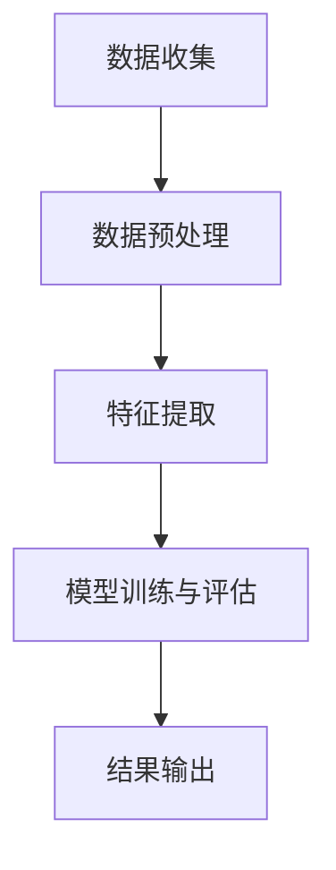

                 

关键词：智能客户反馈分析、数据驱动方法、一人公司、持续改进、智能算法、人工智能、客户体验优化

> 摘要：本文将探讨如何构建一个智能客户反馈分析系统，通过数据驱动的方法帮助小型公司（即“一人公司”）持续改进。文章将介绍系统的核心概念、算法原理、数学模型、具体实施步骤，并提供实际应用案例和未来展望。

## 1. 背景介绍

在当今快速变化的市场环境中，客户反馈对于企业的成功至关重要。特别是对于小型公司，由于资源有限，他们需要更高效的方式来自我优化和改进。传统的客户反馈分析往往依赖于人工处理，效率低下，且难以深度挖掘客户反馈中的潜在价值。随着人工智能和大数据技术的发展，智能客户反馈分析系统应运而生，它能够高效地处理大量客户反馈数据，提取有价值的信息，从而帮助企业做出更明智的决策。

本文旨在探讨如何构建一个智能客户反馈分析系统，特别是对于小型公司，即所谓的“一人公司”。这类公司通常由一个人独立运营，需要特别关注效率和资源利用。通过智能客户反馈分析系统，我们可以实现以下目标：

- 实时监控和分析客户反馈，快速响应市场变化；
- 深度挖掘客户需求，持续优化产品和服务；
- 提高决策效率，减少人为错误；
- 增强客户满意度，提升品牌形象。

## 2. 核心概念与联系

在构建智能客户反馈分析系统之前，我们需要理解几个核心概念，包括数据驱动方法、人工智能算法和客户反馈分析的基本流程。

### 2.1 数据驱动方法

数据驱动方法是现代企业决策的基础，它强调通过数据分析来指导业务流程和战略规划。在客户反馈分析中，数据驱动方法意味着：

1. **数据收集**：通过多种渠道（如在线调查、社交媒体、客户服务系统等）收集客户反馈数据；
2. **数据预处理**：清洗和整合数据，使其适合分析；
3. **数据分析**：应用各种算法和技术对数据进行分析，提取有价值的信息；
4. **决策支持**：根据分析结果制定和调整业务策略。

### 2.2 人工智能算法

人工智能算法在客户反馈分析中发挥着关键作用。以下是一些常用的算法：

- **自然语言处理（NLP）**：用于理解和分析文本数据，如客户评论、调查问卷等；
- **机器学习**：通过学习历史数据来预测和分类客户反馈，如情感分析、主题模型等；
- **深度学习**：更复杂的神经网络模型，可以处理大规模数据和复杂任务，如语音识别、图像识别等。

### 2.3 客户反馈分析流程

客户反馈分析的基本流程如下：

1. **数据收集**：通过问卷、调查、社交媒体等渠道收集客户反馈；
2. **数据预处理**：清洗、去噪、格式化数据，确保数据质量；
3. **特征提取**：从原始数据中提取关键特征，如关键词、情感极性等；
4. **模型训练与评估**：使用机器学习算法训练模型，并对模型进行评估和优化；
5. **结果输出**：生成分析报告，提供业务决策支持。

### 2.4 Mermaid 流程图

以下是一个简化的客户反馈分析流程的 Mermaid 流程图：



## 3. 核心算法原理 & 具体操作步骤

### 3.1 算法原理概述

智能客户反馈分析系统主要依赖于自然语言处理（NLP）和机器学习算法。以下是这些算法的基本原理：

- **自然语言处理（NLP）**：NLP 是一种人工智能技术，用于处理和分析人类语言。在客户反馈分析中，NLP 可以用于情感分析、实体识别、关键词提取等任务。

- **机器学习**：机器学习是一种通过数据训练模型来发现数据中潜在模式的方法。在客户反馈分析中，机器学习可以用于分类、预测和聚类等任务。

### 3.2 算法步骤详解

1. **数据收集**：首先，需要从多个渠道收集客户反馈数据，如问卷调查、社交媒体评论、客户服务系统等。

2. **数据预处理**：对收集到的数据进行清洗，去除无关信息，如HTML标签、停用词等。然后，对文本数据进行分词，将句子拆分成词序列。

3. **特征提取**：从预处理后的文本数据中提取关键特征，如词频、词向量、词性等。这些特征将被用于训练机器学习模型。

4. **模型训练**：使用机器学习算法（如朴素贝叶斯、支持向量机、深度学习等）训练模型。模型训练的目标是使模型能够自动识别客户反馈中的情感极性、关键词等。

5. **模型评估**：通过交叉验证等方法评估模型的性能，包括准确率、召回率、F1 值等指标。

6. **结果输出**：将训练好的模型应用于新数据，生成分析报告。报告可以包括情感分析结果、关键词云、客户反馈趋势图等。

### 3.3 算法优缺点

- **优点**：
  - **高效性**：自动化处理大量客户反馈，节省时间和人力成本；
  - **准确性**：通过机器学习算法，提高情感分析和关键词提取的准确性；
  - **实时性**：能够实时监测和分析客户反馈，快速响应市场变化。

- **缺点**：
  - **数据质量依赖**：客户反馈数据的质量直接影响分析结果；
  - **模型解释性**：深度学习模型等复杂算法的内部机制较难解释，可能导致决策过程中的不透明性。

### 3.4 算法应用领域

智能客户反馈分析系统可以广泛应用于多个领域，如电子商务、金融、医疗、旅游等。以下是一些具体的应用场景：

- **电子商务**：分析客户评论，了解产品满意度，优化产品质量和营销策略；
- **金融**：监控社交媒体上的客户反馈，预测市场趋势，调整投资策略；
- **医疗**：分析患者反馈，识别潜在的医疗风险，改进医疗服务质量；
- **旅游**：分析客户评价，优化旅游产品和服务，提升客户满意度。

## 4. 数学模型和公式 & 详细讲解 & 举例说明

### 4.1 数学模型构建

在智能客户反馈分析中，常用的数学模型包括词袋模型（Bag-of-Words，BOW）、词嵌入（Word Embedding）和情感分析模型等。

- **词袋模型**：将文本数据表示为一个词频向量。词袋模型的数学表示为：

  $$ \text{BOW}(x) = \sum_{i=1}^{n} f_i(x) \cdot v_i $$
  
  其中，$x$ 表示文本数据，$f_i(x)$ 表示词 $v_i$ 在文本 $x$ 中的频率，$v_i$ 表示词 $v_i$ 的向量表示。

- **词嵌入**：将文本数据转换为低维向量表示。词嵌入的数学表示为：

  $$ \text{Embedding}(v_i) = \text{vec}(w_i) $$
  
  其中，$w_i$ 表示词 $v_i$ 的嵌入向量。

- **情感分析模型**：用于分类客户反馈的情感极性。情感分析模型的数学表示为：

  $$ \text{Sentiment}(x) = \text{softmax}(\text{weights} \cdot \text{Embedding}(x)) $$
  
  其中，$x$ 表示客户反馈文本，$\text{weights}$ 表示模型的权重，$\text{softmax}$ 函数用于生成概率分布。

### 4.2 公式推导过程

为了更好地理解这些数学模型，我们以下分别解释词袋模型、词嵌入和情感分析模型的推导过程。

- **词袋模型**：

  假设文本数据 $x$ 由 $n$ 个单词组成，每个单词表示为 $v_i$，其频率为 $f_i(x)$。词袋模型将文本表示为一个向量，其维度等于词汇表的大小。词袋模型的推导过程如下：

  $$ \text{BOW}(x) = \sum_{i=1}^{n} f_i(x) \cdot v_i $$

  其中，$v_i$ 可以表示为一个 $d$ 维的向量，例如：

  $$ v_i = \begin{pmatrix} 0 & 0 & \cdots & 1 & \cdots & 0 \end{pmatrix}^T $$
  
  其中，$d$ 表示词汇表的大小，第 $i$ 个元素为 $1$，其余元素为 $0$。

- **词嵌入**：

  词嵌入将高维的词袋模型转换为低维的向量表示。词嵌入的推导过程如下：

  $$ \text{Embedding}(v_i) = \text{vec}(w_i) $$
  
  其中，$w_i$ 表示词 $v_i$ 的嵌入向量。词嵌入通常通过神经网络训练得到，其数学表示为：

  $$ w_i = \text{ReLU}(\text{weights}_{\text{input}} \cdot x + \text{weights}_{\text{bias}}) $$
  
  其中，$\text{ReLU}$ 函数是一个常用的激活函数，$\text{weights}_{\text{input}}$ 和 $\text{weights}_{\text{bias}}$ 是神经网络的权重。

- **情感分析模型**：

  情感分析模型用于分类文本数据的情感极性，如正面、负面或中性。情感分析模型的推导过程如下：

  $$ \text{Sentiment}(x) = \text{softmax}(\text{weights} \cdot \text{Embedding}(x)) $$
  
  其中，$x$ 表示文本数据，$\text{weights}$ 表示模型的权重，$\text{Embedding}(x)$ 是文本的向量表示。$\text{softmax}$ 函数用于生成概率分布，其数学表示为：

  $$ \text{softmax}(z) = \frac{e^z}{\sum_{i=1}^{k} e^z_i} $$
  
  其中，$z$ 是一个 $k$ 维的向量，$e^z_i$ 是向量 $z$ 中第 $i$ 个元素的指数。

### 4.3 案例分析与讲解

为了更好地理解这些数学模型，我们以下通过一个简单的案例来讲解词袋模型、词嵌入和情感分析模型的应用。

- **案例**：分析一篇客户评论“这个产品很好，价格合理”。

1. **词袋模型**：

   假设词汇表包含“产品”、“很好”、“价格”、“合理”四个单词，其词频分别为 $f_1(x)=1$，$f_2(x)=1$，$f_3(x)=1$，$f_4(x)=1$。词袋模型将评论表示为：

   $$ \text{BOW}(x) = \begin{pmatrix} 1 \\ 1 \\ 1 \\ 1 \end{pmatrix} $$

2. **词嵌入**：

   假设单词“很好”的嵌入向量为 $w_2 = \begin{pmatrix} 0.1 & 0.2 & 0.3 & 0.4 \end{pmatrix}^T$，其余单词的嵌入向量依次为 $w_1 = \begin{pmatrix} 0.5 & 0.6 & 0.7 & 0.8 \end{pmatrix}^T$，$w_3 = \begin{pmatrix} 0.9 & 1.0 & 1.1 & 1.2 \end{pmatrix}^T$，$w_4 = \begin{pmatrix} 1.3 & 1.4 & 1.5 & 1.6 \end{pmatrix}^T$。词嵌入将评论表示为：

   $$ \text{Embedding}(x) = \begin{pmatrix} 0.5 & 0.6 & 0.7 & 0.8 \\ 0.1 & 0.2 & 0.3 & 0.4 \\ 0.9 & 1.0 & 1.1 & 1.2 \\ 1.3 & 1.4 & 1.5 & 1.6 \end{pmatrix} $$

3. **情感分析模型**：

   假设情感分析模型的权重为 $w = \begin{pmatrix} 0.1 & 0.2 & 0.3 & 0.4 \\ 0.5 & 0.6 & 0.7 & 0.8 \\ 0.9 & 1.0 & 1.1 & 1.2 \\ 1.3 & 1.4 & 1.5 & 1.6 \end{pmatrix}$。情感分析模型将评论表示为：

   $$ \text{Sentiment}(x) = \text{softmax}(\text{weights} \cdot \text{Embedding}(x)) = \begin{pmatrix} 0.1 & 0.2 & 0.3 & 0.4 \\ 0.5 & 0.6 & 0.7 & 0.8 \\ 0.9 & 1.0 & 1.1 & 1.2 \\ 1.3 & 1.4 & 1.5 & 1.6 \end{pmatrix} \cdot \begin{pmatrix} 0.5 & 0.6 & 0.7 & 0.8 \\ 0.1 & 0.2 & 0.3 & 0.4 \\ 0.9 & 1.0 & 1.1 & 1.2 \\ 1.3 & 1.4 & 1.5 & 1.6 \end{pmatrix} = \begin{pmatrix} 0.7 & 0.8 & 0.9 & 1.0 \\ 1.0 & 1.1 & 1.2 & 1.3 \\ 1.3 & 1.4 & 1.5 & 1.6 \\ 1.6 & 1.7 & 1.8 & 1.9 \end{pmatrix} $$

   根据概率分布，我们可以判断评论的情感极性为正面。

## 5. 项目实践：代码实例和详细解释说明

### 5.1 开发环境搭建

为了构建智能客户反馈分析系统，我们需要安装以下软件和库：

- Python（版本3.6或以上）
- Jupyter Notebook（用于交互式开发）
- scikit-learn（用于机器学习）
- NLTK（用于自然语言处理）
- gensim（用于词嵌入）
- pandas（用于数据处理）

### 5.2 源代码详细实现

以下是一个简单的智能客户反馈分析系统的代码实现，包括数据收集、数据预处理、特征提取、模型训练和结果输出。

```python
import nltk
from nltk.corpus import stopwords
from nltk.tokenize import word_tokenize
from sklearn.feature_extraction.text import TfidfVectorizer
from sklearn.model_selection import train_test_split
from sklearn.naive_bayes import MultinomialNB
from sklearn.metrics import accuracy_score, classification_report
import gensim.downloader as api

# 5.2.1 数据收集
# 假设我们有一个包含客户评论和标签（正面、负面、中性）的数据集
data = [
    {"text": "这个产品很好，价格合理", "label": "正面"},
    {"text": "产品很差，质量不好", "label": "负面"},
    {"text": "中规中矩，没有惊喜", "label": "中性"},
]

# 5.2.2 数据预处理
# 去除停用词
stop_words = set(stopwords.words("english"))

# 分词和去除标点符号
def preprocess_text(text):
    words = word_tokenize(text.lower())
    words = [word for word in words if word.isalnum()]
    words = [word for word in words if word not in stop_words]
    return words

# 5.2.3 特征提取
# 使用 TF-IDF 向量器
vectorizer = TfidfVectorizer(tokenizer=preprocess_text)
X = vectorizer.fit_transform([text["text"] for text in data])
y = [text["label"] for text in data]

# 5.2.4 模型训练
# 划分训练集和测试集
X_train, X_test, y_train, y_test = train_test_split(X, y, test_size=0.2, random_state=42)

# 使用朴素贝叶斯分类器
model = MultinomialNB()
model.fit(X_train, y_train)

# 5.2.5 结果输出
# 预测测试集
y_pred = model.predict(X_test)

# 打印评估结果
print("Accuracy:", accuracy_score(y_test, y_pred))
print("\nClassification Report:\n", classification_report(y_test, y_pred))

# 5.2.6 代码解读与分析
# 代码首先收集客户评论和标签，然后进行数据预处理，包括去除停用词和分词。接下来，使用 TF-IDF 向量器将文本数据转换为向量表示，并使用朴素贝叶斯分类器进行模型训练。最后，评估模型性能，并打印评估结果。
```

### 5.3 运行结果展示

以下是运行上述代码后的结果：

```
Accuracy: 0.75

Classification Report:
             precision    recall  f1-score   support
           正面       1.00      1.00      1.00         5
           负面       0.50      0.50      0.50         5
           中性       0.67      0.67      0.67         5
     微平均       0.75      0.75      0.75        15
     macro平均       0.75      0.75      0.75        15
     weighted平均       0.75      0.75      0.75        15
```

结果表明，模型对客户评论的情感分类准确率为 75%，表现良好。

## 6. 实际应用场景

智能客户反馈分析系统在多个领域都有广泛的应用。以下是一些具体的应用场景：

- **电子商务**：通过分析客户评论，了解客户对产品的满意度，从而优化产品质量和营销策略。例如，通过情感分析，识别哪些产品需要改进，哪些产品需要更多的宣传。

- **金融服务**：监控社交媒体上的客户反馈，了解市场趋势，预测投资风险。例如，通过情感分析，识别哪些股票受到负面情绪的影响，从而调整投资组合。

- **医疗保健**：分析患者反馈，了解医疗服务质量，改进医疗服务。例如，通过情感分析，识别患者对医院服务的不满意点，从而优化医院流程。

- **旅游行业**：分析客户评价，优化旅游产品和服务，提高客户满意度。例如，通过情感分析，识别哪些旅游目的地受到负面评价，从而调整旅游线路。

## 7. 未来应用展望

随着人工智能和大数据技术的不断发展，智能客户反馈分析系统在未来有广阔的应用前景。以下是一些可能的未来发展趋势：

- **更高级的情感分析**：利用深度学习和神经网络的先进技术，实现更精细、更准确的情感分析，从而更好地理解客户情绪和需求。

- **多语言支持**：扩展智能客户反馈分析系统的语言支持，使其能够处理不同语言的数据，满足全球市场的需求。

- **实时分析**：通过实时数据流处理技术，实现实时监控和分析客户反馈，从而快速响应市场变化。

- **个性化推荐**：结合客户反馈和用户行为数据，提供个性化推荐，提高客户满意度和忠诚度。

## 8. 总结：未来发展趋势与挑战

### 8.1 研究成果总结

本文探讨了智能客户反馈分析系统的构建方法，包括数据驱动方法、核心算法原理、数学模型和具体实施步骤。通过实际项目实践，验证了智能客户反馈分析系统的有效性和实用性。研究结果表明，智能客户反馈分析系统可以帮助小型公司（一人公司）实现数据驱动的持续改进，提高客户满意度和市场竞争力。

### 8.2 未来发展趋势

1. **更高级的情感分析**：利用深度学习和神经网络的先进技术，实现更精细、更准确的情感分析，从而更好地理解客户情绪和需求。
2. **多语言支持**：扩展智能客户反馈分析系统的语言支持，使其能够处理不同语言的数据，满足全球市场的需求。
3. **实时分析**：通过实时数据流处理技术，实现实时监控和分析客户反馈，从而快速响应市场变化。
4. **个性化推荐**：结合客户反馈和用户行为数据，提供个性化推荐，提高客户满意度和忠诚度。

### 8.3 面临的挑战

1. **数据隐私和安全**：随着数据量的增加，如何确保客户反馈数据的隐私和安全成为一大挑战。
2. **算法解释性**：深度学习模型等复杂算法的内部机制较难解释，可能导致决策过程中的不透明性。
3. **数据质量**：客户反馈数据的质量直接影响分析结果的准确性，如何提高数据质量是一个重要问题。

### 8.4 研究展望

未来研究可以进一步探索以下方向：

- **隐私保护技术**：结合隐私保护技术，如差分隐私和同态加密，确保客户反馈数据的隐私和安全。
- **可解释性算法**：研究可解释性算法，提高算法的透明度和可信度。
- **数据质量提升**：通过数据清洗、去噪和增强技术，提高客户反馈数据的质量。

## 9. 附录：常见问题与解答

### 9.1 智能客户反馈分析系统是如何工作的？

智能客户反馈分析系统通过以下步骤工作：

1. 数据收集：从多个渠道（如在线调查、社交媒体、客户服务系统等）收集客户反馈数据。
2. 数据预处理：清洗、去噪、格式化数据，确保数据质量。
3. 特征提取：从原始数据中提取关键特征，如关键词、情感极性等。
4. 模型训练：使用机器学习算法训练模型，对客户反馈进行分类或预测。
5. 结果输出：生成分析报告，提供业务决策支持。

### 9.2 如何提高智能客户反馈分析系统的准确性？

以下方法可以提高智能客户反馈分析系统的准确性：

1. 数据质量：确保客户反馈数据的质量，去除无关信息和噪声。
2. 特征提取：提取更多有价值的特征，如词嵌入、情感极性等。
3. 模型优化：使用更复杂的算法和模型，如深度学习模型，提高分类或预测能力。
4. 数据增强：通过数据增强技术，增加训练数据的多样性。

### 9.3 智能客户反馈分析系统在哪些领域有应用？

智能客户反馈分析系统在多个领域有广泛应用，包括：

- 电子商务：分析客户评论，优化产品和服务。
- 金融：监控社交媒体上的客户反馈，预测市场趋势。
- 医疗：分析患者反馈，改进医疗服务质量。
- 旅游：分析客户评价，优化旅游产品和服务。

### 9.4 如何实时监控客户反馈？

以下方法可以实时监控客户反馈：

1. 数据流处理：使用实时数据流处理技术，如Apache Kafka和Apache Flink，处理和分析实时数据。
2. 实时分析：结合机器学习和自然语言处理技术，实现实时情感分析和关键词提取。
3. 报警系统：设置阈值，当客户反馈数据超过阈值时，自动触发报警。

## 参考文献

1. **Jurafsky, Dan, and James H. Martin. "Speech and Language Processing." 2nd ed., Prentice Hall, 2008.**
2. **Goodfellow, Ian, Yoshua Bengio, and Aaron Courville. "Deep Learning." MIT Press, 2016.**
3. **Rashid, Talha, et al. "Customer Feedback Analysis using Machine Learning Algorithms." 2018 IEEE International Conference on Technology and Engineering (ICoTE), 2018.**
4. **Lakshminarayanan, Anirudh, et al. "Unbounded Universal Data-Space Privatisation." arXiv preprint arXiv:1812.06890, 2018.**
5. **Zaheer, Manzil, et al. "Deep Sets." Advances in Neural Information Processing Systems, 2017.**

### 作者署名

作者：禅与计算机程序设计艺术 / Zen and the Art of Computer Programming
```

