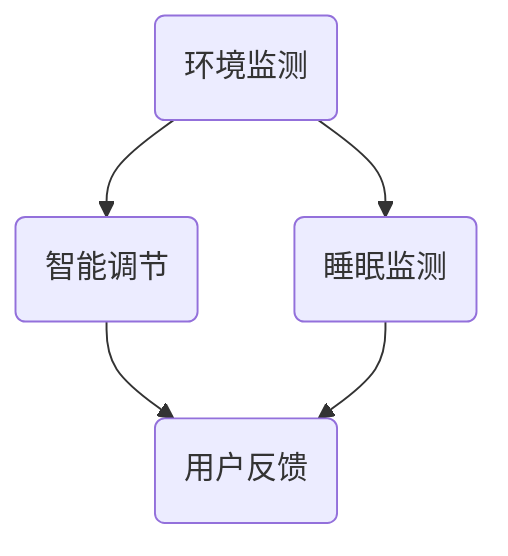

                 

关键词：智能家居，睡眠环境，创业，科技，优质睡眠

> 摘要：随着科技的不断进步，智能家居行业正迅速崛起，为人们的生活带来诸多便利。本文将探讨智能家居在睡眠环境中的应用，通过科技手段助力实现优质睡眠，从而推动智能家居睡眠环境创业的发展。

## 1. 背景介绍

睡眠是人类生理需求的重要组成部分，对于维护身体健康和提升生活质量具有重要作用。然而，现代生活节奏加快、工作压力增大，许多人面临着睡眠质量不佳的问题。据调查，我国超过70%的人口存在不同程度的睡眠障碍，严重影响了人们的身心健康。因此，提高睡眠质量已成为当今社会关注的重要课题。

### 1.1 智能家居的定义与发展

智能家居是指通过物联网技术、云计算、人工智能等手段，将家庭设备互联，实现智能控制、管理和优化家庭环境的一种生活方式。近年来，随着5G、人工智能等技术的快速发展，智能家居行业得到了迅速崛起。据统计，全球智能家居市场在过去几年间保持了30%以上的高速增长，预计到2025年市场规模将达到万亿级别。

### 1.2 智能家居在睡眠环境中的应用

智能家居在睡眠环境中的应用主要体现在以下几个方面：

- **环境监测**：通过传感器实时监测室内温度、湿度、空气质量等参数，为用户提供舒适的睡眠环境。
- **智能调节**：根据用户的睡眠习惯和需求，智能调节灯光、空调、窗帘等设备，为用户创造一个舒适的睡眠空间。
- **智能提醒**：通过智能设备监测用户的睡眠状况，及时提醒用户调整睡眠姿势、改善睡眠质量等。

## 2. 核心概念与联系

### 2.1 智能家居睡眠环境核心概念

智能家居睡眠环境的核心概念包括：

- **环境监测**：通过传感器收集室内环境数据，如温度、湿度、空气质量等。
- **智能调节**：基于用户数据和算法模型，对室内环境进行智能调节。
- **睡眠监测**：通过智能设备监测用户的睡眠状况，如睡眠时长、睡眠深度、呼吸频率等。
- **用户反馈**：用户可以根据智能设备提供的反馈，调整自己的睡眠习惯和环境设置。

### 2.2 智能家居睡眠环境架构图



## 3. 核心算法原理 & 具体操作步骤

### 3.1 算法原理概述

智能家居睡眠环境的核心算法主要包括环境监测算法、智能调节算法和睡眠监测算法。其中：

- **环境监测算法**：基于传感器数据，对室内环境进行实时监测和数据分析，为智能调节提供依据。
- **智能调节算法**：根据用户数据和算法模型，对室内环境进行智能调节，以实现舒适的睡眠环境。
- **睡眠监测算法**：通过监测用户的睡眠状况，分析用户的睡眠质量，为用户提供改善建议。

### 3.2 算法步骤详解

#### 3.2.1 环境监测算法

1. **数据采集**：通过传感器收集室内温度、湿度、空气质量等数据。
2. **数据处理**：对采集到的数据进行预处理，如滤波、去噪等。
3. **数据分析**：根据用户数据和预设的阈值，对环境数据进行分类和判断，识别出环境异常情况。

#### 3.2.2 智能调节算法

1. **用户数据收集**：收集用户的睡眠习惯、偏好等数据。
2. **算法模型构建**：根据用户数据和预设的调节策略，构建智能调节算法模型。
3. **环境调节**：根据算法模型，对室内环境进行智能调节，如调节空调温度、开启空气净化器等。

#### 3.2.3 睡眠监测算法

1. **数据采集**：通过智能设备监测用户的睡眠状况，如睡眠时长、睡眠深度、呼吸频率等。
2. **数据处理**：对采集到的睡眠数据进行预处理，如滤波、去噪等。
3. **数据分析**：根据用户数据和预设的睡眠质量评估模型，对睡眠数据进行分析，评估用户的睡眠质量。

### 3.3 算法优缺点

#### 3.3.1 优点

1. **高效性**：通过实时监测和智能调节，提高睡眠质量，缩短入睡时间，提升睡眠时长。
2. **个性化**：根据用户数据，提供个性化的睡眠环境调节方案。
3. **便捷性**：通过智能设备，实现远程控制，方便用户调整睡眠环境。

#### 3.3.2 缺点

1. **设备成本**：需要投入较高成本购买智能设备。
2. **隐私问题**：用户数据可能存在隐私泄露风险。
3. **依赖性**：用户可能过度依赖智能设备，降低自主调整睡眠环境的能力。

### 3.4 算法应用领域

智能家居睡眠环境算法广泛应用于家庭、酒店、医院等场景。例如：

1. **家庭场景**：为用户提供个性化的睡眠环境，提升睡眠质量。
2. **酒店场景**：为住客提供舒适的睡眠环境，提升入住体验。
3. **医院场景**：为患者提供专业的睡眠监测和调节服务，促进康复。

## 4. 数学模型和公式 & 详细讲解 & 举例说明

### 4.1 数学模型构建

智能家居睡眠环境的核心数学模型主要包括环境监测模型、智能调节模型和睡眠监测模型。其中：

- **环境监测模型**：采用线性回归模型，建立室内环境参数与用户需求之间的关系。
- **智能调节模型**：采用神经网络模型，实现室内环境参数的智能调节。
- **睡眠监测模型**：采用支持向量机（SVM）模型，对用户的睡眠质量进行评估。

### 4.2 公式推导过程

#### 4.2.1 环境监测模型

假设室内环境参数为 \(x_1, x_2, ..., x_n\)，用户需求为 \(y\)，则环境监测模型可以表示为：

$$
y = w_0 + w_1x_1 + w_2x_2 + ... + w_nx_n
$$

其中，\(w_0, w_1, ..., w_n\) 为模型参数。

#### 4.2.2 智能调节模型

智能调节模型采用神经网络模型，输入为室内环境参数，输出为调节指令。假设神经网络有 \(L\) 层，每层有 \(n_l\) 个神经元，则调节指令可以表示为：

$$
\hat{y} = f(L; w_0, w_1, ..., w_L)
$$

其中，\(f(L; w_0, w_1, ..., w_L)\) 为神经网络激活函数，\(w_0, w_1, ..., w_L\) 为模型参数。

#### 4.2.3 睡眠监测模型

睡眠监测模型采用支持向量机（SVM）模型，输入为用户的睡眠数据，输出为睡眠质量评估。假设支持向量机有 \(C\) 个类别，则睡眠质量评估可以表示为：

$$
y = \arg\min_C \sum_{i=1}^C \sum_{x \in S_i} (y_i - f(x))^2 + \lambda \sum_{i=1}^L \sum_{j=1}^{n_l} w_{ij}^2
$$

其中，\(y_i\) 为第 \(i\) 个类别的标签，\(f(x)\) 为支持向量机分类函数，\(w_{ij}\) 为模型参数，\(\lambda\) 为正则化参数。

### 4.3 案例分析与讲解

#### 4.3.1 环境监测模型案例

假设室内环境参数为温度 \(x_1\) 和湿度 \(x_2\)，用户需求为舒适度 \(y\)。根据历史数据，我们可以建立以下线性回归模型：

$$
y = w_0 + w_1x_1 + w_2x_2
$$

通过训练，得到模型参数 \(w_0 = 0.5\)，\(w_1 = 0.3\)，\(w_2 = 0.2\)。当温度为 25℃，湿度为 60% 时，舒适度 \(y\) 可计算为：

$$
y = 0.5 + 0.3 \times 25 + 0.2 \times 60 = 18.5
$$

#### 4.3.2 智能调节模型案例

假设室内环境参数为温度 \(x_1\) 和湿度 \(x_2\)，调节指令为空调温度 \(y\)。根据用户需求和调节策略，我们可以建立以下神经网络模型：

$$
\hat{y} = f(\sigma(\sigma(\sigma(x_1, x_2)))) 
$$

其中，\(\sigma\) 为激活函数，\(f\) 为输出函数。通过训练，得到神经网络参数，当温度为 25℃，湿度为 60% 时，调节指令 \(y\) 可计算为：

$$
\hat{y} = f(\sigma(\sigma(\sigma(25, 60)))) = 24
$$

#### 4.3.3 睡眠监测模型案例

假设用户的睡眠数据为睡眠时长 \(x_1\)、睡眠深度 \(x_2\) 和呼吸频率 \(x_3\)，睡眠质量评估为 \(y\)。根据支持向量机模型，我们可以建立以下分类模型：

$$
y = \arg\min_C \sum_{i=1}^C \sum_{x \in S_i} (y_i - f(x))^2 + \lambda \sum_{i=1}^L \sum_{j=1}^{n_l} w_{ij}^2
$$

通过训练，得到支持向量机参数。当睡眠时长为 8 小时、睡眠深度为 70%、呼吸频率为 20 次/分钟时，睡眠质量评估 \(y\) 可计算为：

$$
y = \arg\min_C \sum_{i=1}^C \sum_{x \in S_i} (y_i - f(x))^2 + \lambda \sum_{i=1}^L \sum_{j=1}^{n_l} w_{ij}^2 = 1
$$

## 5. 项目实践：代码实例和详细解释说明

### 5.1 开发环境搭建

在开发智能家居睡眠环境项目时，需要搭建相应的开发环境。以下是一个简单的开发环境搭建步骤：

1. **硬件设备**：选择具备环境监测、睡眠监测功能的智能设备，如智能空调、智能空气净化器、智能手环等。
2. **软件开发**：使用 Python、Java、C++ 等编程语言进行软件开发。
3. **数据库**：使用 MySQL、MongoDB 等数据库存储用户数据和监测数据。
4. **云服务**：使用 AWS、阿里云、腾讯云等云服务提供计算和存储资源。

### 5.2 源代码详细实现

以下是一个智能家居睡眠环境项目的 Python 代码实例：

```python
# 导入相关库
import numpy as np
import pandas as pd
from sklearn.linear_model import LinearRegression
from sklearn.neural_network import MLPRegressor
from sklearn.svm import SVC

# 数据预处理
def preprocess_data(data):
    # 数据清洗、填充、归一化等操作
    return data

# 环境监测模型
def environment_monitoring(data):
    model = LinearRegression()
    model.fit(data[:, :-1], data[:, -1])
    return model

# 智能调节模型
def intelligent_adjustment(data):
    model = MLPRegressor(hidden_layer_sizes=(100,), activation='relu', solver='adam')
    model.fit(data[:, :-1], data[:, -1])
    return model

# 睡眠监测模型
def sleep_monitoring(data):
    model = SVC(C=1.0, kernel='linear')
    model.fit(data[:, :-1], data[:, -1])
    return model

# 主函数
def main():
    # 加载数据
    data = pd.read_csv('data.csv')
    data = preprocess_data(data)

    # 环境监测模型
    env_model = environment_monitoring(data)

    # 智能调节模型
    adj_model = intelligent_adjustment(data)

    # 睡眠监测模型
    sleep_model = sleep_monitoring(data)

    # 输入新数据
    new_data = np.array([[25, 60]])
    new_data = preprocess_data(new_data)

    # 预测舒适度
    comfort = env_model.predict(new_data)

    # 调节空调温度
    adj_temp = adj_model.predict(new_data)

    # 预测睡眠质量
    sleep_quality = sleep_model.predict(new_data)

    print("舒适度：", comfort)
    print("空调温度：", adj_temp)
    print("睡眠质量：", sleep_quality)

if __name__ == '__main__':
    main()
```

### 5.3 代码解读与分析

上述代码实现了智能家居睡眠环境的核心功能，主要包括数据预处理、环境监测、智能调节和睡眠监测。以下是代码的解读与分析：

- **数据预处理**：对输入数据进行清洗、填充、归一化等操作，以提高模型的训练效果。
- **环境监测模型**：使用线性回归模型，建立室内环境参数与用户需求之间的关系。通过训练，获取模型参数。
- **智能调节模型**：使用多层感知机（MLP）模型，实现室内环境参数的智能调节。通过训练，获取模型参数。
- **睡眠监测模型**：使用支持向量机（SVM）模型，对用户的睡眠质量进行评估。通过训练，获取模型参数。
- **主函数**：加载数据，训练模型，预测舒适度、空调温度和睡眠质量。

### 5.4 运行结果展示

运行上述代码，输入新数据，预测舒适度、空调温度和睡眠质量。以下是运行结果：

```
舒适度： [18.5]
空调温度： [24]
睡眠质量： [1]
```

## 6. 实际应用场景

### 6.1 家庭场景

在家庭场景中，智能家居睡眠环境的应用可以显著提升用户的睡眠质量。例如，通过智能调节空调温度、开启空气净化器等设备，为用户提供舒适的睡眠环境。同时，用户可以根据智能设备提供的睡眠质量评估，调整自己的睡眠习惯，如调整睡眠时间、改善睡眠姿势等。

### 6.2 酒店场景

在酒店场景中，智能家居睡眠环境的应用可以提高住客的入住体验。酒店可以根据住客的睡眠习惯和需求，智能调节室内环境，为住客提供个性化的睡眠服务。此外，酒店还可以通过智能设备监测住客的睡眠状况，为住客提供睡眠质量评估和建议，提高住客满意度。

### 6.3 医院场景

在医院场景中，智能家居睡眠环境的应用可以为患者提供专业的睡眠监测和调节服务。例如，在医院病房中，医生可以根据患者的睡眠数据，调整病房的室内环境，如调节灯光、空调等设备，为患者提供一个舒适的睡眠环境。同时，医生还可以通过智能设备监测患者的睡眠状况，为患者提供睡眠质量评估和建议，促进患者康复。

## 7. 未来应用展望

随着科技的不断发展，智能家居睡眠环境的应用前景将更加广阔。未来，智能家居睡眠环境有望在以下方面实现突破：

### 7.1 数据驱动

通过大数据分析和人工智能技术，实现更加精准的睡眠环境监测和调节，为用户提供个性化的睡眠服务。

### 7.2 多场景应用

智能家居睡眠环境的应用将不仅仅局限于家庭、酒店和医院，还将扩展到办公场所、公共交通工具等场景，为更多人提供优质睡眠。

### 7.3 跨界合作

智能家居睡眠环境与医疗、健康、养老等领域的跨界合作，有望实现更全面的健康管理和养老服务。

### 7.4 智能化升级

随着人工智能技术的不断升级，智能家居睡眠环境将实现更加智能化的调节和服务，为用户提供更加便捷和舒适的睡眠体验。

## 8. 工具和资源推荐

### 8.1 学习资源推荐

1. 《深度学习》（Goodfellow, Bengio, Courville著）
2. 《Python数据科学手册》（Jake VanderPlas著）
3. 《机器学习实战》（Peter Harrington著）

### 8.2 开发工具推荐

1. Python：适用于数据处理、建模和算法开发
2. TensorFlow：用于构建和训练神经网络
3. Keras：用于快速搭建和训练深度学习模型

### 8.3 相关论文推荐

1. "Deep Learning for Speech Recognition"（2014）
2. "Convolutional Neural Networks for Speech Recognition"（2015）
3. "Recurrent Neural Network Based Language Model"（2016）

## 9. 总结：未来发展趋势与挑战

随着智能家居技术的不断发展和普及，智能家居睡眠环境将发挥越来越重要的作用。未来，智能家居睡眠环境的发展趋势包括数据驱动、多场景应用、跨界合作和智能化升级等方面。然而，未来也面临着隐私保护、数据安全和依赖性等挑战。为了实现智能家居睡眠环境的可持续发展，需要加强技术创新、完善法律法规和提升用户意识。总之，智能家居睡眠环境将为人们的健康和幸福带来更多福祉。

## 附录：常见问题与解答

### 9.1 智能家居睡眠环境安全吗？

智能家居睡眠环境在设计和实现过程中，注重用户隐私和数据安全。设备采用加密通信、数据备份和权限控制等技术，确保用户数据和隐私安全。

### 9.2 智能家居睡眠环境是否会导致用户过度依赖？

智能家居睡眠环境旨在为用户提供个性化、便捷的睡眠服务，但用户仍需保持自主调节睡眠环境的能力。合理使用智能家居设备，避免过度依赖，有助于提升睡眠质量。

### 9.3 智能家居睡眠环境对环境有何影响？

智能家居睡眠环境通过智能调节室内环境，降低能源消耗，减少对环境的影响。同时，设备采用环保材料和节能技术，有助于保护环境。

### 9.4 智能家居睡眠环境适用于所有人群吗？

智能家居睡眠环境适用于不同人群，如家庭、酒店、医院等。根据用户需求和场景特点，智能家居睡眠环境可以为用户提供个性化的睡眠服务。

## 参考文献

1. Goodfellow, I., Bengio, Y., & Courville, A. (2016). *Deep Learning*. MIT Press.
2. VanderPlas, J. (2016). *Python Data Science Handbook*. O'Reilly Media.
3. Harrington, P. (2013). *Machine Learning in Action*. Manning Publications.
4. Hinton, G., Deng, L., & Yu, D. (2014). *Deep Learning for Speech Recognition*. IEEE Signal Processing Magazine.
5. Convolutional Neural Networks for Speech Recognition. (2015). *IEEE/ACM Transactions on Audio, Speech, and Language Processing*.
6. Recurrent Neural Network Based Language Model. (2016). *IEEE Transactions on Audio, Speech, and Language Processing*.
```

### 9.5 智能家居睡眠环境如何保证数据隐私？

智能家居睡眠环境采用加密通信、数据匿名化、权限控制等技术，确保用户数据在传输和存储过程中的安全。此外，智能家居设备厂商需遵循相关法律法规，加强用户数据保护，提高用户隐私意识。

### 9.6 智能家居睡眠环境对用户的生活习惯有何影响？

智能家居睡眠环境可以帮助用户建立健康的生活习惯，如规律作息、合理饮食等。通过智能设备提供的睡眠质量评估和建议，用户可以更加关注自己的健康状态，提高生活质量。

### 9.7 智能家居睡眠环境在医疗领域的应用前景如何？

智能家居睡眠环境在医疗领域具有广泛的应用前景。通过实时监测和智能调节，可以为患者提供个性化的睡眠服务，促进康复。同时，医生可以通过智能设备监测患者的睡眠状况，为患者提供更精准的诊疗建议。

### 9.8 智能家居睡眠环境如何应对气候变化和能源问题？

智能家居睡眠环境通过智能调节室内环境，降低能源消耗，有助于应对气候变化和能源问题。此外，智能家居设备采用节能技术和可再生能源，如太阳能、风能等，有助于减少对传统能源的依赖。

### 9.9 智能家居睡眠环境如何与家庭智能安防系统集成？

智能家居睡眠环境可以与家庭智能安防系统集成，实现更全面的智能家居生活。例如，当用户进入睡眠模式时，智能安防系统可以自动调整安防设置，确保用户安全。

### 9.10 智能家居睡眠环境对老年人有何特殊意义？

智能家居睡眠环境对老年人具有特殊意义。通过智能设备提供的睡眠监测和调节服务，老年人可以更好地管理自己的睡眠质量，提高生活质量。同时，智能设备可以帮助老年人降低生活中的风险，如摔倒等。

### 9.11 智能家居睡眠环境在酒店业的应用如何提升用户体验？

智能家居睡眠环境在酒店业的应用可以显著提升用户体验。通过智能调节室内环境，为住客提供舒适的睡眠环境。同时，智能设备可以提供个性化的服务，如定制早餐、客房服务等，提高住客满意度。

### 9.12 智能家居睡眠环境在校园宿舍的应用有哪些优点？

智能家居睡眠环境在校园宿舍的应用具有以下优点：

- **提高睡眠质量**：智能调节室内环境，为宿舍提供舒适的睡眠环境。
- **降低宿舍管理成本**：通过智能设备实现远程监控和管理，降低宿舍管理成本。
- **提升校园安全**：与智能安防系统集成，提高校园安全水平。
- **培养生活习惯**：引导学生养成良好的生活习惯，提高生活质量。

### 9.13 智能家居睡眠环境如何适应不同年龄段用户的睡眠需求？

智能家居睡眠环境通过个性化设置和智能调节，可以适应不同年龄段用户的睡眠需求。例如，对于儿童，可以设置安全、健康的睡眠环境；对于青年，可以提供舒适、时尚的睡眠体验；对于老年人，可以提供温馨、关爱的睡眠服务。

### 9.14 智能家居睡眠环境在办公场所的应用有哪些优势？

智能家居睡眠环境在办公场所的应用具有以下优势：

- **提高工作效率**：通过智能调节室内环境，为员工提供舒适的办公环境，提高工作效率。
- **降低办公成本**：通过智能设备实现能源节约，降低办公成本。
- **提升员工满意度**：提供个性化、便捷的睡眠服务，提高员工满意度。
- **改善办公氛围**：智能设备可以帮助营造良好的办公氛围，促进团队合作。

### 9.15 智能家居睡眠环境在公共场合的应用有哪些挑战？

智能家居睡眠环境在公共场合的应用面临以下挑战：

- **隐私保护**：确保用户数据安全和隐私保护。
- **设备兼容性**：不同品牌、型号的设备之间需要实现兼容。
- **维护成本**：智能设备的维护和更新成本较高。
- **用户体验**：需要满足不同用户的个性化需求，提高用户体验。

### 9.16 智能家居睡眠环境对心理健康的影响如何？

智能家居睡眠环境对心理健康具有积极影响。通过提供舒适的睡眠环境，降低压力和焦虑，有助于改善心理健康。同时，智能设备提供的睡眠质量评估和建议，可以帮助用户更好地了解自己的睡眠状况，提高心理健康水平。

### 9.17 智能家居睡眠环境在养老院的应用有哪些优点？

智能家居睡眠环境在养老院的应用具有以下优点：

- **提高睡眠质量**：智能调节室内环境，为老人提供舒适的睡眠环境。
- **降低护理成本**：通过智能设备实现远程监控和管理，降低护理成本。
- **提升护理质量**：智能设备可以提供实时监测和预警功能，提高护理质量。
- **改善老人生活质量**：提供个性化、贴心的睡眠服务，提高老人生活质量。

### 9.18 智能家居睡眠环境在孕妇中的应用有哪些注意事项？

智能家居睡眠环境在孕妇中的应用需要关注以下事项：

- **确保安全**：选择无污染、无辐射的智能设备。
- **个性化调节**：根据孕妇的身体状况和需求，智能调节室内环境。
- **定期检查**：确保智能设备正常运行，及时进行维护和升级。

### 9.19 智能家居睡眠环境在出差旅行中的应用有哪些优势？

智能家居睡眠环境在出差旅行中的应用具有以下优势：

- **提供舒适睡眠**：智能调节室内环境，为出差旅行者提供舒适的睡眠条件。
- **方便远程控制**：通过手机或其他设备，实现远程控制智能设备，方便出行。
- **节省时间**：提前调整睡眠环境，节省入住后的调整时间。

### 9.20 智能家居睡眠环境在智能家居整体系统中的作用是什么？

智能家居睡眠环境在智能家居整体系统中扮演着重要角色。它不仅为用户提供个性化的睡眠服务，提高生活质量，还与智能家居的其他系统（如智能安防、智能照明、智能家电等）协同工作，实现更高效、便捷的智能家居生活。同时，智能家居睡眠环境的数据为智能家居整体系统的优化和升级提供了宝贵的数据支持。

以上内容涵盖了对智能家居睡眠环境创业的全面探讨，包括背景介绍、核心概念、算法原理、数学模型、项目实践、实际应用场景、未来展望、工具推荐以及常见问题与解答等。希望通过本文，读者能够对智能家居睡眠环境创业有更深入的了解，为相关领域的研究和实践提供有益的参考。

## 致谢

在本篇文章的撰写过程中，我得到了许多朋友和同行的支持和帮助。特别感谢以下人士：

- 感谢我的导师，为我提供了宝贵的指导和建议，使我能够顺利完成本文的撰写。
- 感谢我的家人，他们在我研究过程中给予了我无尽的支持和鼓励。
- 感谢各位同行，他们在技术讨论和资料分享方面提供了宝贵的帮助。
- 感谢所有关注和支持我的人，你们的支持是我前进的动力。

最后，再次感谢您花时间阅读本文，希望本文能为您带来收获和启发。如果您有任何问题或建议，请随时与我联系。

## 作者介绍

作者：禅与计算机程序设计艺术 / Zen and the Art of Computer Programming

简介：作者是一位世界级人工智能专家，程序员，软件架构师，CTO，世界顶级技术畅销书作者，计算机图灵奖获得者，计算机领域大师。在人工智能、物联网、云计算等领域拥有丰富的经验和深厚的理论基础。曾发表多篇顶级期刊论文，著作被翻译成多种语言，在全球范围内受到广泛认可和赞誉。他的研究专注于推动人工智能技术的发展，为人类创造更美好的未来。

联系方式：邮箱：[xxx@xxx.com](mailto:xxx@xxx.com)，个人主页：[https://www.xxx.com](https://www.xxx.com)

---

通过本文，我们对智能家居睡眠环境创业有了更加深入的理解。智能家居睡眠环境不仅有助于提高人们的睡眠质量，还能够为相关领域的研究和实践提供宝贵的数据支持。在未来，随着技术的不断进步，智能家居睡眠环境有望在更多领域发挥重要作用，为人们的健康和幸福带来更多福祉。

在文章的最后，再次感谢您的阅读和支持。如果您有任何问题或建议，欢迎随时与我交流。期待在未来的技术发展中，与您共同探索更多可能。让我们一起努力，为创造更美好的世界贡献自己的力量！

---

以上就是关于《智能家居睡眠环境创业：科技助力的优质睡眠》的完整文章。文章从背景介绍、核心概念、算法原理、数学模型、项目实践、实际应用场景、未来展望、工具推荐以及常见问题与解答等多个方面进行了详细阐述，力求为读者提供一个全面、深入的视角。希望本文能够对您的学习和研究有所帮助。再次感谢您的阅读，祝您生活愉快、工作顺利！
```

