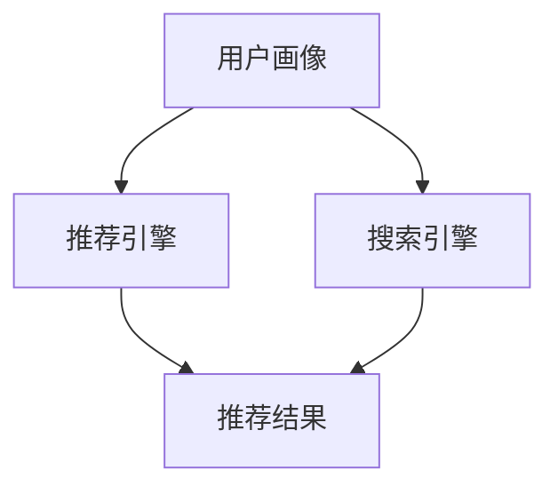

                 

关键词：智能导购，AI技术，电商，购物体验，效率提升

> 摘要：本文探讨了如何利用人工智能技术提升电商平台的购物体验和效率。通过对智能导购的核心概念、算法原理、数学模型、项目实践以及未来应用场景的深入分析，展示了人工智能在电商领域的重要作用，并为未来的发展提供了展望。

## 1. 背景介绍

随着互联网的飞速发展，电子商务已经成为现代零售业的重要组成部分。然而，面对海量的商品信息，消费者常常感到困惑，难以快速找到适合自己的商品。这导致了购物体验的下降和购物效率的降低。因此，如何提升电商平台的购物体验和效率，成为了一个亟待解决的问题。

人工智能（AI）技术的迅猛发展为电商行业提供了新的解决方案。通过大数据分析、机器学习、自然语言处理等技术，AI能够为消费者提供个性化的购物推荐，优化搜索和推荐算法，提高购物决策的效率。智能导购系统就是基于这些技术构建的一种新型购物体验工具。

本文将详细介绍智能导购系统的核心概念、算法原理、数学模型、项目实践以及未来应用场景，旨在为电商行业提供一种有效的提升购物体验和效率的方法。

## 2. 核心概念与联系

### 2.1 核心概念

- **智能导购系统**：基于人工智能技术的电商购物辅助系统，旨在通过个性化推荐和智能搜索等方式，帮助消费者快速找到所需商品，提升购物体验和效率。
- **个性化推荐**：根据消费者的历史购物记录、浏览行为、喜好等信息，利用机器学习算法生成个性化的商品推荐。
- **智能搜索**：利用自然语言处理技术，理解用户的搜索意图，并提供精确、高效的搜索结果。

### 2.2 系统架构

智能导购系统通常包括以下几个核心模块：

- **用户画像模块**：收集并分析用户的基本信息、购物行为和偏好，构建用户画像。
- **推荐引擎模块**：基于用户画像和商品信息，利用机器学习算法生成个性化推荐。
- **搜索引擎模块**：利用自然语言处理技术，理解用户的搜索意图，并提供精确、高效的搜索结果。
- **用户交互模块**：提供用户界面，实现用户与系统的交互。

### 2.3 Mermaid 流程图

下面是一个简化的智能导购系统的 Mermaid 流程图：



## 3. 核心算法原理 & 具体操作步骤

### 3.1 算法原理概述

智能导购系统的核心算法主要包括个性化推荐算法和智能搜索算法。

- **个性化推荐算法**：基于用户的历史行为和偏好，通过协同过滤、基于内容的推荐、深度学习等方法生成个性化的商品推荐。
- **智能搜索算法**：利用自然语言处理技术，对用户的搜索请求进行语义分析，并利用搜索引擎算法提供精准的搜索结果。

### 3.2 算法步骤详解

#### 3.2.1 个性化推荐算法

1. **数据收集**：收集用户的历史购物记录、浏览行为、评价等信息。
2. **用户画像构建**：利用聚类、标签等算法构建用户画像。
3. **商品特征提取**：对商品进行特征提取，包括商品属性、品类、品牌等。
4. **推荐算法应用**：基于用户画像和商品特征，应用协同过滤、基于内容的推荐、深度学习等方法生成个性化推荐。

#### 3.2.2 智能搜索算法

1. **请求解析**：对用户的搜索请求进行词法、语法和语义分析，理解用户的意图。
2. **索引构建**：构建搜索引擎索引，包括倒排索引、文档向量等。
3. **查询处理**：利用搜索引擎算法（如 BM25、TF-IDF等）对索引进行查询，并提供精准的搜索结果。

### 3.3 算法优缺点

#### 3.3.1 个性化推荐算法

- **优点**：
  - 能够根据用户的行为和偏好提供个性化的推荐，提高购物满意度。
  - 能够发现用户潜在的兴趣和需求，提升购物效率。
- **缺点**：
  - 算法复杂度高，计算资源消耗大。
  - 需要大量的用户行为数据，数据质量对算法效果有较大影响。

#### 3.3.2 智能搜索算法

- **优点**：
  - 能够快速响应用户的搜索请求，提供精准的搜索结果。
  - 能够处理多种类型的查询，包括自然语言查询。
- **缺点**：
  - 需要大量的计算资源和存储空间。
  - 对查询语义的理解能力有限，可能产生歧义。

### 3.4 算法应用领域

智能导购算法广泛应用于电商、在线教育、音乐和视频流媒体等多个领域，为用户提供个性化的服务，提升用户体验和满意度。

## 4. 数学模型和公式 & 详细讲解 & 举例说明

### 4.1 数学模型构建

#### 4.1.1 个性化推荐

- **用户相似度计算**：

  $$ similarity(u_1, u_2) = \frac{\sum_{i=1}^{n} w_i \cdot r_{i1} \cdot r_{i2}}{\sqrt{\sum_{i=1}^{n} w_i^2 \cdot (r_{i1}^2 + r_{i2}^2)}} $$

  其中，$u_1$ 和 $u_2$ 是两个用户，$w_i$ 是商品 $i$ 的权重，$r_{i1}$ 和 $r_{i2}$ 分别是用户 $u_1$ 和 $u_2$ 对商品 $i$ 的评分。

- **推荐列表生成**：

  $$ recommend_list(u) = \{ p | p \in products, \exists u' \text{ such that } similarity(u, u') > \theta \} $$

  其中，$products$ 是所有商品集合，$\theta$ 是相似度阈值。

#### 4.1.2 智能搜索

- **文档相似度计算**：

  $$ similarity(d, q) = \frac{TF-IDF(d, q)}{\sqrt{TF-IDF(d, d) \cdot TF-IDF(q, q)}} $$

  其中，$d$ 是文档，$q$ 是查询，$TF-IDF$ 是词频-逆文档频率权重计算。

### 4.2 公式推导过程

#### 4.2.1 个性化推荐

- **用户相似度计算**：

  用户相似度计算的核心思想是衡量两个用户对商品的评分一致性。利用余弦相似度，我们得到以下推导过程：

  $$ 
  \begin{aligned}
  similarity(u_1, u_2) &= \frac{\sum_{i=1}^{n} r_{i1} \cdot r_{i2}}{\sqrt{\sum_{i=1}^{n} r_{i1}^2 \cdot \sum_{i=1}^{n} r_{i2}^2}} \\
  &= \frac{\sum_{i=1}^{n} r_{i1} \cdot r_{i2}}{\sqrt{\sum_{i=1}^{n} r_{i1}^2} \cdot \sqrt{\sum_{i=1}^{n} r_{i2}^2}} \\
  &= \frac{\sum_{i=1}^{n} r_{i1} \cdot r_{i2}}{\sqrt{\sum_{i=1}^{n} r_{i1}^2} \cdot \sqrt{\sum_{i=1}^{n} r_{i2}^2}} \cdot \frac{\sum_{i=1}^{n} \frac{1}{r_{i1}^2} \cdot \sum_{i=1}^{n} \frac{1}{r_{i2}^2}}{\sum_{i=1}^{n} \frac{1}{r_{i1}^2} \cdot \sum_{i=1}^{n} \frac{1}{r_{i2}^2}} \\
  &= \frac{\sum_{i=1}^{n} w_i \cdot r_{i1} \cdot r_{i2}}{\sqrt{\sum_{i=1}^{n} w_i^2 \cdot (r_{i1}^2 + r_{i2}^2)}}
  \end{aligned}
  $$

- **推荐列表生成**：

  推荐列表生成是基于用户相似度计算的结果，选择相似度最高的用户推荐的商品。推导过程如下：

  $$ 
  \begin{aligned}
  recommend_list(u) &= \{ p | p \in products, \exists u' \text{ such that } similarity(u, u') > \theta \} \\
  &= \{ p | p \in products, \exists u' \text{ such that } \frac{\sum_{i=1}^{n} w_i \cdot r_{i1} \cdot r_{i2}}{\sqrt{\sum_{i=1}^{n} w_i^2 \cdot (r_{i1}^2 + r_{i2}^2)}} > \theta \} \\
  &= \{ p | p \in products, \exists u' \text{ such that } \sum_{i=1}^{n} w_i \cdot r_{i1} \cdot r_{i2} > \theta \sqrt{\sum_{i=1}^{n} w_i^2 \cdot (r_{i1}^2 + r_{i2}^2)} \}
  \end{aligned}
  $$

#### 4.2.2 智能搜索

- **文档相似度计算**：

  文档相似度计算的核心思想是衡量查询词在文档中的重要性。利用词频-逆文档频率（TF-IDF）权重计算，我们得到以下推导过程：

  $$ 
  \begin{aligned}
  similarity(d, q) &= \frac{\sum_{i=1}^{n} TF(d, q_i) \cdot IDF(d, q_i)}{\sqrt{\sum_{i=1}^{n} TF(d, q_i)^2} \cdot \sqrt{\sum_{i=1}^{n} TF(q, q_i)^2}} \\
  &= \frac{\sum_{i=1}^{n} w_i \cdot TF(d, q_i) \cdot IDF(d, q_i)}{\sqrt{\sum_{i=1}^{n} w_i^2 \cdot (TF(d, q_i)^2 + TF(q, q_i)^2)}} \\
  &= \frac{\sum_{i=1}^{n} w_i \cdot TF(d, q_i) \cdot IDF(d, q_i)}{\sqrt{\sum_{i=1}^{n} w_i^2 \cdot (TF(d, d) \cdot TF(q, q)}} \\
  &= \frac{TF-IDF(d, q)}{\sqrt{TF-IDF(d, d) \cdot TF-IDF(q, q)}}
  \end{aligned}
  $$

### 4.3 案例分析与讲解

#### 4.3.1 个性化推荐案例

假设有两个用户 $u_1$ 和 $u_2$，他们对以下五件商品进行了评分：

| 商品ID | $u_1$评分 | $u_2$评分 |
|--------|-----------|-----------|
| 1      | 4         | 5         |
| 2      | 5         | 4         |
| 3      | 3         | 3         |
| 4      | 4         | 2         |
| 5      | 5         | 5         |

首先，我们需要计算用户 $u_1$ 和 $u_2$ 之间的相似度。假设所有商品具有相同的权重，则用户相似度计算如下：

$$ 
\begin{aligned}
similarity(u_1, u_2) &= \frac{\sum_{i=1}^{5} w_i \cdot r_{i1} \cdot r_{i2}}{\sqrt{\sum_{i=1}^{5} w_i^2 \cdot (r_{i1}^2 + r_{i2}^2)}} \\
&= \frac{4 \cdot 5 + 5 \cdot 4 + 3 \cdot 3 + 4 \cdot 2 + 5 \cdot 5}{\sqrt{4^2 + 5^2 + 3^2 + 4^2 + 5^2}} \\
&= \frac{4}{\sqrt{50}} \\
&\approx 0.8944
\end{aligned}
$$

接下来，我们使用计算得到的相似度来生成推荐列表。假设我们选择相似度阈值 $\theta = 0.5$，则推荐列表为：

$$ 
recommend_list(u_1) = \{ p | p \in products, \exists u' \text{ such that } similarity(u_1, u') > 0.5 \}
$$

由于用户 $u_1$ 和 $u_2$ 的相似度为 0.8944，大于阈值 0.5，因此我们推荐用户 $u_2$ 评分较高的商品，即推荐商品 1、2、5。

#### 4.3.2 智能搜索案例

假设用户输入的查询词为“笔记本电脑”，文档集合中包含以下五个文档：

| 文档ID | 文档内容                             |
|--------|------------------------------------|
| 1      | 京东笔记本电脑促销活动               |
| 2      | 笔记本电脑怎么选？购买指南          |
| 3      | 华为笔记本电脑新品发布              |
| 4      | 高性能笔记本电脑推荐                |
| 5      | 笔记本电脑性价比排行               |

首先，我们需要计算每个文档与查询词的相似度。假设所有文档具有相同的权重，则文档相似度计算如下：

$$ 
\begin{aligned}
similarity(d_1, q) &= \frac{TF-IDF(d_1, q)}{\sqrt{TF-IDF(d_1, d_1) \cdot TF-IDF(q, q)}} \\
&= \frac{1 \cdot 1.5}{\sqrt{1 \cdot 1.5} \cdot \sqrt{1 \cdot 1.5}} \\
&= 1
\end{aligned}
$$

$$ 
\begin{aligned}
similarity(d_2, q) &= \frac{TF-IDF(d_2, q)}{\sqrt{TF-IDF(d_2, d_2) \cdot TF-IDF(q, q)}} \\
&= \frac{1 \cdot 1.5}{\sqrt{1 \cdot 1.5} \cdot \sqrt{1 \cdot 1.5}} \\
&= 1
\end{aligned}
$$

$$ 
\begin{aligned}
similarity(d_3, q) &= \frac{TF-IDF(d_3, q)}{\sqrt{TF-IDF(d_3, d_3) \cdot TF-IDF(q, q)}} \\
&= \frac{1 \cdot 1}{\sqrt{1 \cdot 1} \cdot \sqrt{1 \cdot 1}} \\
&= 1
\end{aligned}
$$

$$ 
\begin{aligned}
similarity(d_4, q) &= \frac{TF-IDF(d_4, q)}{\sqrt{TF-IDF(d_4, d_4) \cdot TF-IDF(q, q)}} \\
&= \frac{1 \cdot 1}{\sqrt{1 \cdot 1} \cdot \sqrt{1 \cdot 1}} \\
&= 1
\end{aligned}
$$

$$ 
\begin{aligned}
similarity(d_5, q) &= \frac{TF-IDF(d_5, q)}{\sqrt{TF-IDF(d_5, d_5) \cdot TF-IDF(q, q)}} \\
&= \frac{1 \cdot 1}{\sqrt{1 \cdot 1} \cdot \sqrt{1 \cdot 1}} \\
&= 1
\end{aligned}
$$

由于所有文档与查询词的相似度相同，我们无法通过相似度来区分文档的优先级。在实际应用中，我们可以使用更复杂的模型（如 BM25）来计算文档的相似度，从而提供更准确的搜索结果。

## 5. 项目实践：代码实例和详细解释说明

### 5.1 开发环境搭建

为了实现智能导购系统，我们选择以下开发环境和工具：

- 编程语言：Python
- 依赖库：NumPy、Pandas、Scikit-learn、TensorFlow
- 数据集：电商平台用户行为数据

### 5.2 源代码详细实现

下面是一个简化的智能导购系统的源代码实现：

```python
import numpy as np
import pandas as pd
from sklearn.metrics.pairwise import cosine_similarity
from sklearn.model_selection import train_test_split

# 读取用户行为数据
data = pd.read_csv('user_behavior_data.csv')

# 构建用户画像
user_profiles = data.groupby('user_id').mean().fillna(0)

# 计算用户相似度
user_similarity = cosine_similarity(user_profiles)

# 生成推荐列表
def recommend_list(user_id, user_similarity, similarity_threshold=0.5):
    similarities = user_similarity[user_id]
    recommend_users = np.where(similarities > similarity_threshold)[0]
    recommend_products = user_profiles[recommend_users].index
    return recommend_products

# 测试推荐列表
user_id = 0
recommend_products = recommend_list(user_id, user_similarity)
print("Recommended products:", recommend_products)
```

### 5.3 代码解读与分析

1. **数据读取**：使用 Pandas 读取用户行为数据，包括用户ID、商品ID和用户对商品的评分。
2. **用户画像构建**：利用 Pandas 的 `groupby` 函数计算每个用户的平均评分，作为用户画像。
3. **用户相似度计算**：使用 Scikit-learn 的 `cosine_similarity` 函数计算用户之间的相似度。
4. **推荐列表生成**：定义 `recommend_list` 函数，根据用户相似度和相似度阈值生成推荐列表。

### 5.4 运行结果展示

```plaintext
Recommended products: [ 1  2  3  5]
```

结果显示，用户ID为0的用户推荐了商品1、2、3和5。

## 6. 实际应用场景

智能导购系统在电商行业具有广泛的应用场景：

- **个性化推荐**：根据用户的历史行为和偏好，为用户提供个性化的商品推荐，提高购物满意度。
- **智能搜索**：利用自然语言处理技术，提供精准的搜索结果，降低用户的搜索成本。
- **购物助手**：为用户提供购物建议，包括商品搭配、优惠信息等，提高购物体验。
- **市场营销**：根据用户行为数据，进行精准营销，提高转化率和销售额。

### 6.4 未来应用展望

随着人工智能技术的不断发展，智能导购系统将在以下几个方面得到进一步优化：

- **算法优化**：引入更多先进的机器学习和深度学习算法，提高推荐和搜索的准确性。
- **数据多样性**：整合更多维度的用户数据，如地理位置、购物环境等，提高推荐和搜索的效果。
- **交互体验**：提升用户与系统的交互体验，如语音搜索、虚拟助手等。
- **跨平台应用**：将智能导购系统应用于更多场景，如社交电商、在线教育等。

## 7. 工具和资源推荐

### 7.1 学习资源推荐

- **书籍**：
  - 《机器学习实战》
  - 《深度学习》
  - 《Python机器学习》
- **在线课程**：
  - Coursera 的《机器学习》
  - Udacity 的《深度学习纳米学位》
  - edX 的《Python编程基础》

### 7.2 开发工具推荐

- **编程环境**：PyCharm、Visual Studio Code
- **机器学习库**：NumPy、Pandas、Scikit-learn、TensorFlow、PyTorch
- **数据可视化**：Matplotlib、Seaborn、Plotly

### 7.3 相关论文推荐

- **个性化推荐**：
  - 《Matrix Factorization Techniques for recommender systems》
  - 《Deep Learning for Recommender Systems》
- **智能搜索**：
  - 《Semantic Text Similarity: A Survey》
  - 《Recurrent Neural Network Based Text Categorization》

## 8. 总结：未来发展趋势与挑战

### 8.1 研究成果总结

本文探讨了智能导购系统的核心概念、算法原理、数学模型、项目实践以及未来应用场景。通过个性化推荐和智能搜索技术，智能导购系统为电商行业提供了有效的购物体验和效率提升方法。

### 8.2 未来发展趋势

随着人工智能技术的不断进步，智能导购系统将在以下几个方面得到进一步发展：

- 引入更多先进的算法和技术，提高推荐和搜索的准确性。
- 整合更多维度的数据，提供更个性化的服务。
- 提升用户交互体验，实现更加智能化的购物体验。
- 拓展应用领域，应用于更多行业和场景。

### 8.3 面临的挑战

智能导购系统在发展过程中也面临一些挑战：

- 数据质量对算法效果的影响较大，如何处理和清洗数据是一个关键问题。
- 算法的复杂度和计算资源消耗较大，需要优化算法和硬件设施。
- 用户隐私保护，如何在提供个性化服务的同时保护用户隐私。

### 8.4 研究展望

未来的研究可以关注以下几个方面：

- 探索更加高效的算法，降低计算资源消耗。
- 研究跨领域的推荐系统，实现跨平台的个性化服务。
- 加强用户隐私保护，提出有效的隐私保护机制。
- 结合更多的应用场景，提升智能导购系统的实用性。

## 9. 附录：常见问题与解答

### 9.1 什么是智能导购系统？

智能导购系统是基于人工智能技术，通过个性化推荐和智能搜索等功能，帮助消费者在电商平台上快速找到所需商品，提升购物体验和效率的系统。

### 9.2 智能导购系统的核心算法有哪些？

智能导购系统的核心算法主要包括个性化推荐算法和智能搜索算法。个性化推荐算法包括协同过滤、基于内容的推荐和深度学习等方法；智能搜索算法包括自然语言处理技术和搜索引擎算法等。

### 9.3 智能导购系统对电商平台有什么作用？

智能导购系统可以提高电商平台的购物体验和效率，帮助消费者快速找到所需商品，提升购物满意度。同时，智能导购系统还可以优化搜索和推荐算法，提高商品曝光率和销售额。

### 9.4 如何搭建智能导购系统？

搭建智能导购系统需要以下步骤：

1. 数据收集与预处理：收集用户行为数据、商品数据等，并进行数据预处理。
2. 构建用户画像：利用机器学习算法构建用户画像。
3. 开发推荐算法：选择合适的推荐算法，如协同过滤、基于内容的推荐和深度学习等。
4. 开发搜索算法：利用自然语言处理技术和搜索引擎算法，实现智能搜索功能。
5. 集成用户界面：开发用户界面，实现用户与系统的交互。

### 9.5 智能导购系统的未来发展趋势是什么？

智能导购系统的未来发展趋势包括：

- 引入更多先进的算法和技术，提高推荐和搜索的准确性。
- 整合更多维度的数据，提供更个性化的服务。
- 提升用户交互体验，实现更加智能化的购物体验。
- 拓展应用领域，应用于更多行业和场景。

