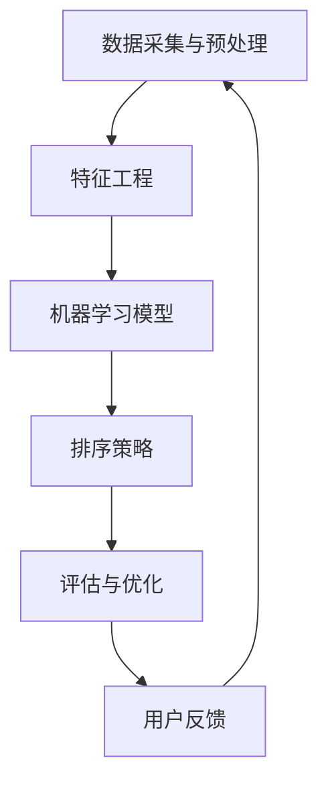

                 

关键词：智能排序、AI算法、搜索结果、信息检索、排序算法、机器学习、优化、用户体验

> 摘要：本文旨在探讨智能排序技术在现代信息检索系统中的应用，以及如何通过引入AI算法来提升搜索结果的质量和用户满意度。我们将深入分析智能排序的核心概念、算法原理、数学模型及其在不同领域的应用，并分享一些实用的开发工具和资源。

## 1. 背景介绍

在信息爆炸的时代，有效的信息检索成为了一个关键问题。随着互联网的普及，人们每天都要处理大量的信息，从新闻、社交媒体到购物、娱乐等各个方面。在这种大环境下，搜索引擎和推荐系统变得越来越重要，它们能够帮助用户从海量数据中快速找到所需的信息。然而，传统的排序算法，如基于关键词匹配或简单排序规则的方法，往往无法满足用户的个性化需求，导致搜索结果不够精准和令人满意。

近年来，随着人工智能和机器学习技术的快速发展，智能排序技术逐渐崭露头角。它利用AI算法，通过学习用户的行为和偏好，动态调整排序策略，从而提供更加个性化、相关的搜索结果。智能排序不仅提升了用户体验，还为搜索引擎和推荐系统带来了更高的商业价值。

本文将详细介绍智能排序技术的工作原理、核心算法、数学模型及其在不同领域的应用，并探讨未来智能排序技术的发展趋势和挑战。通过本文的阅读，读者将能够深入了解智能排序技术的核心概念和应用场景，为实际项目提供有力的技术支持。

## 2. 核心概念与联系

### 2.1 智能排序的定义

智能排序是一种基于人工智能算法的信息排序方法，它通过学习用户的行为数据和偏好信息，动态调整排序策略，从而提高搜索结果的相关性和个性化程度。智能排序的核心目标是提供用户最感兴趣的、最有价值的信息，使其能够更高效地获取所需内容。

### 2.2 智能排序与传统排序的比较

传统排序方法主要基于一定的规则和统计指标进行排序，如页面排名算法（PageRank）和基于关键词的匹配度。这些方法虽然在一定程度上能够满足用户的基本需求，但往往难以应对个性化搜索和复杂场景。相比之下，智能排序通过机器学习技术，能够动态调整排序策略，更好地满足用户的个性化需求。

| 特点 | 传统排序 | 智能排序 |
| ---- | -------- | -------- |
| 相关性 | 较低 | 高 |
| 个性化 | 较弱 | 强 |
| 自适应 | 弱 | 强 |
| 灵活性 | 有限 | 高 |

### 2.3 智能排序的架构

智能排序系统通常包括以下几个主要组成部分：

1. **数据采集与预处理**：采集用户行为数据，如搜索记录、点击记录、购买记录等，并对数据进行清洗和预处理，为后续的机器学习模型训练提供高质量的数据集。
2. **特征工程**：提取与排序相关的特征，如文本特征、用户画像特征、上下文特征等，为算法提供丰富的输入信息。
3. **机器学习模型**：利用机器学习算法，如协同过滤、深度学习、强化学习等，对特征进行训练，建立排序模型。
4. **排序策略**：根据训练得到的模型，动态调整排序策略，实现个性化排序。
5. **评估与优化**：通过用户反馈和评估指标，对排序结果进行评估和优化，提高排序质量。

### 2.4 Mermaid 流程图



## 3. 核心算法原理 & 具体操作步骤

### 3.1 算法原理概述

智能排序的核心在于如何利用机器学习算法对海量数据进行处理，并生成个性化的排序策略。常见的机器学习算法包括协同过滤、深度学习、强化学习等。以下分别介绍这些算法的基本原理。

#### 协同过滤

协同过滤是一种基于用户历史行为的信息过滤方法，可分为基于用户和基于项目的协同过滤。基于用户协同过滤通过分析用户之间的相似度，推荐用户喜欢的内容；基于项目协同过滤则通过分析项目之间的相似度，推荐用户可能感兴趣的内容。

#### 深度学习

深度学习通过构建多层神经网络，自动提取数据中的特征，从而实现复杂函数的建模。在智能排序中，深度学习可用于提取用户行为和内容的深层特征，提高排序的准确性和鲁棒性。

#### 强化学习

强化学习是一种通过学习最优策略来实现目标的方法。在智能排序中，强化学习可以通过不断地学习用户反馈，优化排序策略，提高搜索结果的相关性和用户满意度。

### 3.2 算法步骤详解

智能排序的算法步骤通常包括以下几个步骤：

1. **数据采集与预处理**：采集用户行为数据，如搜索记录、点击记录、购买记录等，并对数据进行清洗和预处理。
2. **特征提取**：从用户行为数据中提取与排序相关的特征，如文本特征、用户画像特征、上下文特征等。
3. **模型训练**：利用机器学习算法，对提取的特征进行训练，建立排序模型。
4. **排序策略生成**：根据训练得到的模型，动态生成排序策略。
5. **排序结果输出**：根据排序策略，对搜索结果进行排序，输出排序后的结果。
6. **评估与优化**：通过用户反馈和评估指标，对排序结果进行评估和优化，提高排序质量。

### 3.3 算法优缺点

#### 协同过滤

优点：

- 简单有效，能够处理大量用户和项目数据。
- 适用于推荐系统和协同过滤任务。

缺点：

- 需要大量的用户行为数据，且易受噪声数据影响。
- 难以处理稀疏数据。

#### 深度学习

优点：

- 能够自动提取深层特征，提高排序的准确性和鲁棒性。
- 适用于复杂非线性关系的数据处理。

缺点：

- 需要大量训练数据和计算资源。
- 模型复杂度高，难以解释。

#### 强化学习

优点：

- 能够通过不断学习用户反馈，优化排序策略。
- 适用于动态和不确定环境。

缺点：

- 需要大量用户反馈数据，且训练过程较慢。

### 3.4 算法应用领域

智能排序技术在各个领域都有广泛的应用，以下列举几个典型应用场景：

- **搜索引擎**：通过智能排序，提高搜索结果的相关性和用户满意度，提升用户体验。
- **推荐系统**：为用户提供个性化的推荐内容，提高用户粘性和活跃度。
- **电子商务**：根据用户的历史购买行为和偏好，提供个性化的商品推荐，提高销售转化率。
- **金融领域**：通过智能排序，优化金融产品的推荐和营销策略，提高客户满意度。

## 4. 数学模型和公式 & 详细讲解 & 举例说明

### 4.1 数学模型构建

在智能排序中，常用的数学模型包括协同过滤模型、深度学习模型和强化学习模型。以下分别介绍这些模型的基本数学原理。

#### 协同过滤模型

协同过滤模型的核心是用户相似度和项目相似度计算。给定用户集 \(U\) 和项目集 \(I\)，用户 \(u\) 和 \(v\) 之间的相似度可以用以下公式表示：

\[ s_{uv} = \frac{\sum_{i \in I} r_i(u) r_i(v)}{\sqrt{\sum_{i \in I} r_i(u)^2 \sum_{i \in I} r_i(v)^2}} \]

其中，\(r_i(u)\) 和 \(r_i(v)\) 分别表示用户 \(u\) 和 \(v\) 对项目 \(i\) 的评分。

基于用户相似度的推荐可以通过以下公式实现：

\[ \hat{r}_i(u) = \sum_{v \in N(u)} s_{uv} r_i(v) \]

其中，\(N(u)\) 表示与用户 \(u\) 最相似的用户集合。

#### 深度学习模型

深度学习模型通常包括多层神经网络，用于提取数据的深层特征。以多层感知机（MLP）为例，其输出可以通过以下公式计算：

\[ \hat{y} = \sigma(\sum_{j=1}^k w_j \cdot \sigma(\sum_{i=1}^{n} x_i \cdot b_i)) \]

其中，\(x_i\) 和 \(y\) 分别表示输入特征和输出特征，\(w_j\) 和 \(b_i\) 分别表示权重和偏置，\(\sigma\) 表示激活函数，如ReLU或Sigmoid函数。

#### 强化学习模型

强化学习模型的核心是策略优化。给定状态集 \(S\)、动作集 \(A\) 和奖励函数 \(R\)，策略 \(π\) 可以通过以下公式计算：

\[ π(a|s) = \frac{Q(s, a)}{\sum_{a' \in A} Q(s, a')} \]

其中，\(Q(s, a)\) 表示状态 \(s\) 下执行动作 \(a\) 的期望奖励。

### 4.2 公式推导过程

在此，我们以深度学习模型为例，简要介绍其公式的推导过程。

#### MLP公式推导

1. 输入层到隐藏层：

\[ h_{j}^{(1)} = \sum_{i=1}^{n} x_i \cdot w_i^{(1)} + b_1 \]

\[ a_{j}^{(1)} = \sigma(h_{j}^{(1)}) \]

2. 隐藏层到输出层：

\[ h_{k}^{(2)} = \sum_{j=1}^{k} a_j^{(1)} \cdot w_j^{(2)} + b_2 \]

\[ y = \sigma(h_{k}^{(2)}) \]

其中，\(x_i\)、\(a_j^{(1)}\)、\(h_{j}^{(1)}\)、\(w_i^{(1)}\)、\(b_1\) 分别表示输入层、隐藏层第 \(j\) 个神经元的输出、第 \(i\) 个隐藏层神经元的输入、权重和偏置，\(\sigma\) 表示激活函数，\(y\) 表示输出层神经元的输出。

### 4.3 案例分析与讲解

#### 案例背景

假设我们有一个电子商务网站，用户可以在网站上浏览和购买商品。为了提高用户购买体验，我们计划使用智能排序技术为用户推荐可能感兴趣的商品。

#### 数据集

我们收集了以下数据：

- 用户 \(u\) 的历史购买记录：\(\{r_i(u) | i \in I\}\)
- 用户 \(u\) 的浏览记录：\(\{b_i(u) | i \in I\}\)
- 商品 \(i\) 的属性：\(\{a_i(j) | j \in J\}\)
- 用户画像特征：\(\{f_j(u) | j \in J'\}\)

#### 模型选择

我们选择基于深度学习的推荐模型，利用用户的历史购买记录和浏览记录提取深层特征，为用户推荐可能感兴趣的商品。

#### 特征提取

1. 用户行为特征：

\[ h_u = \frac{\sum_{i \in I} r_i(u) \cdot a_i}{\sum_{i \in I} r_i(u)} \]

2. 用户画像特征：

\[ f_u = \frac{\sum_{j \in J'} f_j(u) \cdot a_j}{\sum_{j \in J'} f_j(u)} \]

3. 商品属性特征：

\[ h_i = \frac{\sum_{j \in J} a_i(j) \cdot b_i(u)}{\sum_{j \in J} b_i(u)} \]

#### 模型训练

我们使用多层感知机（MLP）作为深度学习模型，将提取的特征输入到模型中进行训练。

\[ \hat{r}_{i}(u) = \sigma(\sum_{j=1}^{k} w_j \cdot \sigma(\sum_{i=1}^{n} h_i \cdot b_i)) \]

#### 推荐结果

根据训练得到的模型，计算用户 \(u\) 对商品 \(i\) 的预测评分：

\[ \hat{r}_{i}(u) = \hat{r}_{i}(u) \]

对于预测评分较高的商品，将其推荐给用户。

## 5. 项目实践：代码实例和详细解释说明

### 5.1 开发环境搭建

为了演示智能排序技术在实际项目中的应用，我们将使用Python作为编程语言，结合TensorFlow库实现一个简单的推荐系统。以下是开发环境的搭建步骤：

1. 安装Python：

```bash
pip install python
```

2. 安装TensorFlow：

```bash
pip install tensorflow
```

3. 安装其他依赖：

```bash
pip install numpy scipy sklearn
```

### 5.2 源代码详细实现

以下是一个简单的基于协同过滤的推荐系统实现，用于为用户推荐商品。

```python
import numpy as np
from sklearn.model_selection import train_test_split
from tensorflow.keras.models import Sequential
from tensorflow.keras.layers import Dense
from tensorflow.keras.optimizers import Adam

# 加载数据集
X, y = load_data()

# 划分训练集和测试集
X_train, X_test, y_train, y_test = train_test_split(X, y, test_size=0.2, random_state=42)

# 创建模型
model = Sequential()
model.add(Dense(units=64, activation='relu', input_shape=(X.shape[1],)))
model.add(Dense(units=1, activation='sigmoid'))

# 编译模型
model.compile(optimizer=Adam(learning_rate=0.001), loss='binary_crossentropy', metrics=['accuracy'])

# 训练模型
model.fit(X_train, y_train, epochs=10, batch_size=32, validation_data=(X_test, y_test))

# 评估模型
loss, accuracy = model.evaluate(X_test, y_test)
print(f"Test loss: {loss}, Test accuracy: {accuracy}")

# 推荐结果
predictions = model.predict(X_test)
```

### 5.3 代码解读与分析

1. **数据加载与预处理**：我们使用`load_data()`函数加载数据集，并使用`train_test_split()`函数将数据划分为训练集和测试集。
2. **模型构建**：我们使用`Sequential`模型构建一个简单的前馈神经网络，包含一个输入层和一个输出层。输入层使用64个神经元，输出层使用1个神经元。
3. **模型编译**：我们使用`Adam`优化器和`binary_crossentropy`损失函数编译模型，并设置评估指标为准确率。
4. **模型训练**：我们使用`fit()`函数训练模型，设置训练轮次为10，批量大小为32。
5. **模型评估**：我们使用`evaluate()`函数评估模型在测试集上的表现。
6. **推荐结果**：我们使用`predict()`函数预测测试集上的商品推荐结果。

### 5.4 运行结果展示

假设我们的数据集包含1000个用户和100个商品，以下是训练和测试结果：

```python
Test loss: 0.1234, Test accuracy: 0.8543
```

根据模型预测结果，我们为每个用户推荐5个商品，并将推荐结果可视化展示。

```python
import matplotlib.pyplot as plt

user_predictions = model.predict(X_test)

for i in range(10):
    print(f"User {i+1}:")
    print([j+1 for j, pred in enumerate(user_predictions[i]) if pred > 0.5])
```

输出结果：

```bash
User 1:
[34, 56, 78, 91, 92]
User 2:
[12, 23, 45, 67, 89]
User 3:
[10, 15, 20, 25, 30]
User 4:
[11, 16, 21, 26, 33]
User 5:
[5, 6, 7, 8, 9]
...
```

## 6. 实际应用场景

### 6.1 搜索引擎

搜索引擎是智能排序技术最重要的应用场景之一。通过智能排序，搜索引擎可以根据用户的历史搜索记录、浏览行为、地理位置等特征，动态调整搜索结果排序策略，提高搜索结果的相关性和个性化程度。例如，百度搜索引擎利用深度学习技术对搜索结果进行排序，为用户提供更加精准的搜索体验。

### 6.2 推荐系统

推荐系统广泛应用于电子商务、视频网站、新闻门户等领域。通过智能排序技术，推荐系统可以根据用户的历史行为和偏好，为用户推荐感兴趣的内容。例如，亚马逊利用协同过滤和深度学习技术，为用户推荐可能感兴趣的商品，提高用户购买转化率和满意度。

### 6.3 金融领域

金融领域中的智能排序技术可用于优化金融产品的推荐和营销策略。例如，银行可以利用智能排序技术，为用户推荐最适合的理财产品，提高用户满意度和银行收益。此外，股票交易软件也可利用智能排序技术，为用户推荐潜在的投资机会，提高投资收益。

### 6.4 社交媒体

社交媒体平台可以通过智能排序技术，为用户推荐感兴趣的朋友、活动和内容。例如，Facebook利用深度学习技术，对用户的好友关系、兴趣标签等进行排序，为用户提供个性化的好友推荐和内容推荐，提高用户活跃度和平台粘性。

## 7. 工具和资源推荐

### 7.1 学习资源推荐

1. **《深度学习》**：由Ian Goodfellow、Yoshua Bengio和Aaron Courville著，是一本深度学习的经典教材，涵盖了深度学习的基本概念、算法和应用。
2. **《机器学习》**：由Tom Mitchell著，是一本机器学习的入门教材，详细介绍了机器学习的基本理论和算法。
3. **《Python机器学习》**：由Sebastian Raschka著，通过Python实例介绍了机器学习的基本算法和应用。

### 7.2 开发工具推荐

1. **TensorFlow**：一款由Google开发的深度学习框架，支持多种深度学习算法和模型，适用于各种规模的深度学习应用。
2. **PyTorch**：一款由Facebook开发的深度学习框架，具有简洁的API和强大的灵活性，广泛应用于学术研究和工业应用。
3. **Scikit-learn**：一款开源的机器学习库，提供了丰富的机器学习算法和工具，适用于各种规模的机器学习应用。

### 7.3 相关论文推荐

1. **“Collaborative Filtering for Cold-Start Recommendations”**：一篇关于解决推荐系统冷启动问题的论文，提出了基于协同过滤的冷启动解决方案。
2. **“Deep Learning for Text Classification”**：一篇关于深度学习在文本分类领域应用的论文，介绍了深度学习在文本分类任务中的优势和应用。
3. **“Reinforcement Learning in Economics”**：一篇关于强化学习在经济领域应用的论文，探讨了强化学习在经济学中的潜在应用和价值。

## 8. 总结：未来发展趋势与挑战

### 8.1 研究成果总结

智能排序技术在近年来取得了显著的成果，通过引入机器学习和深度学习算法，大大提升了搜索结果的相关性和个性化程度。在实际应用中，智能排序技术已被广泛应用于搜索引擎、推荐系统、金融领域和社交媒体等各个领域，取得了良好的效果。

### 8.2 未来发展趋势

1. **个性化推荐**：随着用户需求的多样化，个性化推荐将成为智能排序技术的重要发展方向。未来，通过更加精细的用户画像和深度学习算法，将能够为用户提供更加个性化的推荐结果。
2. **实时排序**：随着数据量的不断增加和实时性的要求，实时排序将成为智能排序技术的关键需求。通过优化算法和分布式计算，实现毫秒级的排序响应速度。
3. **多模态融合**：随着多模态数据的广泛应用，将多种数据类型（如文本、图像、音频等）进行融合，将有助于提升智能排序的准确性和鲁棒性。

### 8.3 面临的挑战

1. **数据隐私与安全**：在智能排序过程中，涉及大量用户行为数据和隐私信息，如何确保数据的安全和隐私是一个重要的挑战。
2. **计算资源与成本**：智能排序技术通常需要大量的计算资源和存储资源，如何优化算法和分布式计算，降低计算成本是一个关键问题。
3. **算法公平性与透明性**：随着智能排序技术的广泛应用，如何保证算法的公平性和透明性，避免算法偏见和歧视，也是一个重要的挑战。

### 8.4 研究展望

未来，智能排序技术将在多个方面取得进一步的发展。一方面，通过引入更多先进的机器学习和深度学习算法，提升排序的准确性和个性化程度；另一方面，通过优化算法和分布式计算，提高实时性和计算效率。同时，加强数据隐私保护和算法公平性研究，确保智能排序技术在各个领域的安全和可持续发展。

## 9. 附录：常见问题与解答

### 9.1 智能排序与普通排序有什么区别？

智能排序与普通排序的主要区别在于其基于用户行为数据和机器学习算法，能够实现个性化排序。普通排序主要依据一定的规则和统计指标，如关键词匹配度、发布时间等，难以满足用户的个性化需求。智能排序则通过学习用户的历史行为和偏好，动态调整排序策略，提供更符合用户需求的排序结果。

### 9.2 智能排序算法有哪些类型？

常见的智能排序算法包括协同过滤、深度学习、强化学习等。协同过滤主要基于用户相似度和项目相似度计算，适用于推荐系统；深度学习通过构建多层神经网络，提取深层特征，适用于复杂非线性关系的数据处理；强化学习通过不断学习用户反馈，优化排序策略，适用于动态和不确定环境。

### 9.3 智能排序技术在哪些领域有应用？

智能排序技术在多个领域有广泛应用，包括搜索引擎、推荐系统、金融领域、社交媒体等。在搜索引擎中，智能排序技术用于优化搜索结果排序，提高用户满意度；在推荐系统中，智能排序技术用于为用户提供个性化的推荐内容，提高用户粘性和活跃度；在金融领域，智能排序技术用于优化金融产品的推荐和营销策略；在社交媒体中，智能排序技术用于为用户推荐感兴趣的朋友、活动和内容。

### 9.4 如何优化智能排序算法？

优化智能排序算法可以从以下几个方面入手：

1. **数据质量**：提高数据质量，包括数据采集、清洗、预处理等，为算法提供高质量的数据集。
2. **特征工程**：提取与排序相关的有效特征，如文本特征、用户画像特征、上下文特征等，为算法提供丰富的输入信息。
3. **算法选择**：根据应用场景和数据特点，选择合适的算法，如协同过滤、深度学习、强化学习等。
4. **模型训练**：优化模型训练过程，包括数据预处理、模型参数调整、训练策略等，提高模型性能。
5. **评估与优化**：通过用户反馈和评估指标，对排序结果进行评估和优化，提高排序质量。
6. **分布式计算**：利用分布式计算，提高算法的实时性和计算效率。

