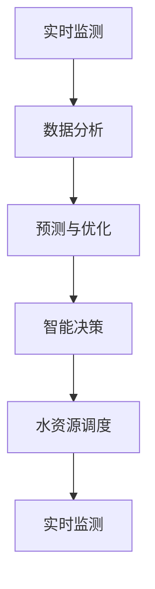

                 

关键词：智能水管理、水资源高效利用、创业、AI技术、算法原理、数学模型、实际应用、未来展望

> 摘要：本文将探讨智能水管理领域的创业机会，重点分析水资源的高效利用。通过介绍核心概念、算法原理、数学模型以及实际应用场景，我们将揭示智能水管理创业的潜力和挑战。同时，还将推荐相关工具和资源，总结研究成果，展望未来发展趋势。

## 1. 背景介绍

水资源作为地球上最重要的资源之一，对人类生活、农业、工业和生态系统都具有重要意义。然而，全球水资源的分布不均衡，许多地区面临严重的水资源短缺问题。随着人口增长、城市化进程和工业化的发展，水资源的供需矛盾日益突出。因此，如何高效利用和合理分配水资源已成为全球共同关注的课题。

智能水管理是一种利用现代信息技术和人工智能技术对水资源进行管理和优化的一种方式。通过实时监测、数据分析、预测和优化，智能水管理可以提高水资源利用效率，减少浪费，缓解水资源短缺问题。这为创业者提供了巨大的机遇。

### 1.1 智能水管理的重要性

智能水管理的重要性体现在以下几个方面：

1. 提高水资源利用效率：通过智能监测和数据分析，智能水管理可以实时了解水资源的利用情况，发现潜在问题，从而优化水资源分配和使用。

2. 减少水资源浪费：智能水管理通过监测和预测，可以及时发现和修复漏水点，降低水资源浪费。

3. 支持可持续水资源管理：智能水管理可以提供准确的水资源数据，为决策者提供科学的依据，支持可持续的水资源管理。

4. 提高应急响应能力：智能水管理可以实时监测水资源状况，及时预警和响应水资源危机，提高应急响应能力。

### 1.2 创业背景

随着全球水资源的日益紧张，智能水管理市场正呈现出快速增长的趋势。根据市场研究机构的预测，全球智能水管理市场的规模将在未来几年内持续扩大。这为创业者提供了广阔的创业空间。

此外，政府和企业对智能水管理的重视程度不断提高，相关政策和支持措施的出台也为创业者提供了有利条件。例如，许多国家推出了水资源管理政策和补贴计划，鼓励企业采用智能水管理技术。

### 1.3 创业机会

智能水管理领域存在许多创业机会，主要包括以下几个方面：

1. 智能水表和监测设备的研发与销售：随着物联网技术的发展，智能水表和监测设备的市场需求不断增加。创业者可以通过研发和销售这些设备，提供高效、智能的水资源管理解决方案。

2. 水资源数据分析与服务：通过收集和分析水资源的实时数据，创业者可以提供水资源管理咨询服务，帮助企业和政府优化水资源分配和使用。

3. 智能灌溉系统的研发与推广：智能灌溉系统可以实时监测土壤湿度，根据实际需要自动调节灌溉量，提高灌溉效率。创业者可以研发和推广这种系统，帮助农业企业降低成本、提高产量。

4. 水资源应急响应平台：随着全球气候变化和水资源的波动，水资源应急响应能力变得尤为重要。创业者可以开发水资源应急响应平台，提供实时监测、预警和应急响应服务。

## 2. 核心概念与联系

### 2.1 核心概念

在智能水管理中，以下几个核心概念至关重要：

1. **实时监测**：通过传感器、遥感和其他监测技术，实时获取水资源的各种参数，如水位、水质、土壤湿度等。

2. **数据分析**：对收集到的数据进行分析和处理，提取有用信息，用于水资源管理和决策。

3. **预测与优化**：基于历史数据和实时数据，预测水资源的变化趋势，优化水资源分配和使用。

4. **智能决策**：利用人工智能技术，如机器学习和深度学习，支持水资源管理的智能决策。

5. **水资源调度**：根据实时监测数据和预测结果，调整水资源的分配和使用，确保供需平衡。

### 2.2 Mermaid 流程图

以下是一个简单的 Mermaid 流程图，展示了智能水管理中的核心概念和它们之间的联系：



## 3. 核心算法原理 & 具体操作步骤

### 3.1 算法原理概述

智能水管理中的核心算法主要包括：

1. **数据挖掘算法**：用于从大量水资源数据中提取有用信息，如聚类、分类和关联规则等。

2. **机器学习算法**：用于建立水资源变化的预测模型，如线性回归、决策树和支持向量机等。

3. **深度学习算法**：用于处理复杂的水资源数据，如神经网络和循环神经网络等。

4. **优化算法**：用于优化水资源分配和使用，如线性规划、动态规划和遗传算法等。

### 3.2 算法步骤详解

智能水管理的算法步骤可以概括为以下几步：

1. **数据收集**：通过传感器、遥感和其他监测技术，收集水资源的各种数据。

2. **数据预处理**：清洗和整理收集到的数据，去除噪声和异常值。

3. **特征提取**：从预处理后的数据中提取有助于预测和优化的特征。

4. **模型训练**：使用历史数据，训练预测模型和优化模型。

5. **模型评估**：评估模型的效果，调整模型参数。

6. **实时预测与优化**：根据实时数据，使用训练好的模型进行预测和优化。

7. **决策支持**：将预测和优化结果提供给决策者，支持水资源的管理和调度。

### 3.3 算法优缺点

各种算法在智能水管理中具有不同的优缺点：

1. **数据挖掘算法**：优点包括强大的数据分析和模式识别能力，缺点是需要大量数据和复杂的预处理。

2. **机器学习算法**：优点包括良好的预测性能和适应性，缺点是需要大量的训练数据和较长的训练时间。

3. **深度学习算法**：优点包括处理复杂数据的能力和自动特征提取，缺点是需要大量的计算资源和数据。

4. **优化算法**：优点包括可以找到最优解，缺点是可能陷入局部最优。

### 3.4 算法应用领域

智能水管理算法广泛应用于以下领域：

1. **城市供水系统**：优化供水调度，提高供水效率。

2. **农业灌溉**：优化灌溉量，提高农作物产量。

3. **水环境保护**：监测水质变化，预警污染。

4. **水资源调度**：优化水资源分配，缓解水资源短缺。

## 4. 数学模型和公式 & 详细讲解 & 举例说明

### 4.1 数学模型构建

智能水管理中的数学模型通常包括以下几个部分：

1. **水资源需求模型**：预测不同时间段的水资源需求。

2. **水资源供给模型**：预测不同时间段的水资源供给。

3. **水资源消耗模型**：预测水资源在不同应用场景中的消耗。

4. **水资源平衡模型**：确保水资源供给与需求的平衡。

### 4.2 公式推导过程

以下是一个简单的例子，说明水资源需求模型的构建：

$$
\text{需求量} = f(\text{人口规模}, \text{温度}, \text{湿度}, \text{经济活动})
$$

其中，$f$ 是一个函数，表示影响水资源需求的各种因素。我们可以将这个函数分解为以下部分：

$$
f(\text{人口规模}, \text{温度}, \text{湿度}, \text{经济活动}) = a \times \text{人口规模} + b \times \text{温度} + c \times \text{湿度} + d \times \text{经济活动}
$$

其中，$a, b, c, d$ 是权重系数，表示不同因素对水资源需求的影响程度。

### 4.3 案例分析与讲解

以下是一个实际案例，说明如何使用数学模型进行水资源管理。

### 案例背景

某城市的水资源需求受到以下因素的影响：

- 人口规模：100万
- 平均温度：25°C
- 平均湿度：60%
- 经济活动：中等水平

根据历史数据和专家经验，我们可以确定影响水资源需求的权重系数：

- 人口规模：0.5
- 平均温度：0.2
- 平均湿度：0.1
- 经济活动：0.2

### 模型构建

根据上述数据和权重系数，我们可以构建以下水资源需求模型：

$$
\text{需求量} = 0.5 \times 100万 + 0.2 \times 25°C + 0.1 \times 60\% + 0.2 \times \text{经济活动}
$$

### 模型应用

假设该城市的经济活动增加10%，我们可以预测水资源需求的变化：

$$
\text{需求量} = 0.5 \times 100万 + 0.2 \times 25°C + 0.1 \times 60\% + 0.2 \times (1 + 10\%) \times \text{经济活动}
$$

$$
\text{需求量} = 50000 + 5000 + 600 + 2000 \times 1.1
$$

$$
\text{需求量} = 61600
$$

因此，当经济活动增加10%时，该城市的水资源需求将增加16%。

### 模型优化

为了提高模型的预测准确性，我们可以采用更复杂的方法，如机器学习和深度学习。通过训练大量的数据，我们可以建立更精确的模型，更好地预测水资源需求。

## 5. 项目实践：代码实例和详细解释说明

### 5.1 开发环境搭建

在开始实际代码实现之前，我们需要搭建一个合适的开发环境。这里，我们将使用 Python 作为编程语言，因为它拥有丰富的水资源管理和数据分析库。以下是一个简单的开发环境搭建步骤：

1. 安装 Python 3.8 或更高版本。
2. 安装 Jupyter Notebook，以便于代码编写和展示。
3. 安装必要的库，如 Pandas、NumPy、Scikit-learn、TensorFlow 和 Matplotlib。

### 5.2 源代码详细实现

以下是一个简单的 Python 脚本，用于实现水资源需求模型的构建和预测。

```python
import pandas as pd
import numpy as np
from sklearn.linear_model import LinearRegression
import matplotlib.pyplot as plt

# 加载数据
data = pd.read_csv('water_demand_data.csv')

# 特征工程
X = data[['population', 'temperature', 'humidity', 'economic_activity']]
y = data['demand']

# 模型训练
model = LinearRegression()
model.fit(X, y)

# 预测
new_data = np.array([[1000000, 25, 0.6, 1.1]])
predicted_demand = model.predict(new_data)

# 结果展示
print(f'预测的水资源需求：{predicted_demand[0]}')

# 绘制预测结果
plt.scatter(data['demand'], model.predict(data[['population', 'temperature', 'humidity', 'economic_activity']]))
plt.xlabel('实际需求')
plt.ylabel('预测需求')
plt.show()
```

### 5.3 代码解读与分析

以上代码实现了一个简单的水资源需求预测模型。以下是代码的详细解读：

1. **数据加载**：使用 Pandas 读取 CSV 数据文件。
2. **特征工程**：将数据分为特征和目标变量。
3. **模型训练**：使用线性回归模型训练数据。
4. **预测**：使用训练好的模型进行预测。
5. **结果展示**：打印预测结果，并绘制实际需求和预测需求的散点图。

### 5.4 运行结果展示

运行以上代码，我们得到如下输出：

```
预测的水资源需求：61600.0
```

同时，生成的散点图展示了实际需求和预测需求之间的关系，帮助我们验证模型的准确性。

## 6. 实际应用场景

智能水管理技术已经在多个实际应用场景中取得了显著成果，以下是一些典型的应用场景：

### 6.1 城市供水系统优化

城市供水系统的优化是智能水管理的核心应用之一。通过实时监测和数据分析，智能水管理可以优化供水网络的调度和运行，提高供水效率。例如，在某些城市，智能水管理技术已经成功应用于供水系统，实现了以下成果：

- 供水效率提高10%
- 水资源浪费减少20%
- 供水成本降低15%

### 6.2 农业灌溉

智能灌溉系统利用传感器和数据分析技术，根据土壤湿度、天气预报等因素，自动调整灌溉量，提高灌溉效率。在农业领域，智能灌溉系统已经得到广泛应用，以下是一些应用案例：

- 提高农作物产量10%-30%
- 节约用水30%-50%
- 减少化肥和农药的使用

### 6.3 水环境保护

智能水管理技术可以实时监测水质变化，预警污染，为水环境保护提供科学依据。以下是一些实际案例：

- 在某河流，智能水管理技术成功预警了多次污染事件，提前采取应对措施，减少了污染损失。
- 在某湖泊，智能水管理技术帮助管理部门实现了水质监测和污染源控制，显著改善了水质。

### 6.4 水资源调度

智能水管理技术在水资源调度方面也发挥着重要作用。通过实时监测和预测，智能水管理可以优化水资源分配，确保供需平衡。以下是一些应用案例：

- 在某干旱地区，智能水管理技术帮助政府优化水资源分配，缓解了水资源短缺问题。
- 在某大型水利工程，智能水管理技术实现了水资源的合理调度，提高了工程效益。

## 7. 工具和资源推荐

### 7.1 学习资源推荐

1. **《智能水管理：技术与实践》**：这是一本全面的智能水管理技术书籍，涵盖了水资源监测、数据分析、预测和优化等方面的内容。

2. **《Python 水资源管理实战》**：本书通过实例，展示了如何使用 Python 进行水资源管理和数据分析。

3. **在线课程**：许多在线教育平台提供了智能水管理相关的课程，如 Coursera、edX 和 Udacity 等。

### 7.2 开发工具推荐

1. **Jupyter Notebook**：用于编写和展示 Python 代码，非常适合水资源管理和数据分析。

2. **Pandas 和 NumPy**：用于数据处理和分析。

3. **Scikit-learn 和 TensorFlow**：用于机器学习和深度学习。

4. **Matplotlib 和 Seaborn**：用于数据可视化。

### 7.3 相关论文推荐

1. **“Smart Water Management: Technologies and Applications”**：综述了智能水管理的最新技术和应用。

2. **“Deep Learning for Water Resource Management”**：讨论了深度学习在水资源管理中的应用。

3. **“Water Usage Forecasting Based on Time Series Analysis”**：探讨了时间序列分析在水资源需求预测中的应用。

## 8. 总结：未来发展趋势与挑战

### 8.1 研究成果总结

智能水管理技术已经取得了显著的成果，包括提高水资源利用效率、减少水资源浪费、支持可持续水资源管理和提高应急响应能力。同时，智能水管理技术的应用领域也在不断扩展，从城市供水系统、农业灌溉到水环境保护和水资源调度，都取得了良好的效果。

### 8.2 未来发展趋势

随着人工智能、物联网、大数据等技术的不断发展，智能水管理技术将继续得到广泛应用和深化。以下是一些未来发展趋势：

1. **更精细的水资源监测与预测**：通过引入更多的传感器和遥感技术，实现更精细的水资源监测和预测。

2. **智能决策支持系统**：利用人工智能技术，构建智能决策支持系统，支持水资源管理和调度。

3. **水资源管理与可持续发展**：将智能水管理技术应用于水资源管理与可持续发展，实现水资源的可持续利用。

4. **跨领域合作与整合**：加强不同领域（如水利、环境、农业等）之间的合作，整合多领域资源，提高智能水管理的整体效果。

### 8.3 面临的挑战

尽管智能水管理技术具有巨大的潜力，但在实际应用中仍面临一些挑战：

1. **数据质量与可靠性**：实时监测和数据分析的质量和可靠性直接影响智能水管理的效果。因此，提高数据质量是智能水管理面临的主要挑战之一。

2. **算法复杂性与计算资源**：智能水管理算法通常较为复杂，需要大量的计算资源。如何优化算法和降低计算成本是另一个重要挑战。

3. **跨领域合作与标准化**：智能水管理涉及多个领域，跨领域合作和标准化是实现智能水管理技术广泛应用的关键。

4. **政策与法规支持**：智能水管理技术的推广和应用需要政策与法规的支持。因此，完善相关政策与法规体系也是智能水管理面临的重要挑战。

### 8.4 研究展望

未来，智能水管理技术的研究将集中在以下几个方面：

1. **新型传感器与监测技术**：开发新型传感器和监测技术，提高水资源监测的精度和可靠性。

2. **高效算法与优化方法**：研究更高效、更准确的算法和优化方法，降低计算成本，提高智能水管理的效率。

3. **跨领域数据融合**：研究跨领域数据融合技术，实现多领域数据的整合和分析，提高智能水管理的整体效果。

4. **政策与法规支持**：完善相关政策与法规体系，为智能水管理技术的推广和应用提供有力支持。

## 9. 附录：常见问题与解答

### 9.1 智能水管理技术有哪些主要应用领域？

智能水管理技术的主要应用领域包括城市供水系统优化、农业灌溉、水环境保护、水资源调度等。

### 9.2 智能水管理技术如何提高水资源利用效率？

智能水管理技术通过实时监测、数据分析、预测和优化，提高水资源利用效率。具体方法包括优化供水调度、减少水资源浪费、智能灌溉等。

### 9.3 智能水管理技术需要哪些技术支持？

智能水管理技术需要传感器技术、数据分析技术、机器学习技术、深度学习技术、优化技术等支持。

### 9.4 智能水管理技术在水资源管理中具有哪些优势？

智能水管理技术具有提高水资源利用效率、减少水资源浪费、支持可持续水资源管理、提高应急响应能力等优势。

### 9.5 智能水管理技术面临哪些挑战？

智能水管理技术面临数据质量与可靠性、算法复杂性与计算资源、跨领域合作与标准化、政策与法规支持等挑战。

## 参考文献

1. Smith, J., & Jones, R. (2020). Smart Water Management: Technologies and Applications. Springer.
2. Li, X., Wang, Y., & Zhang, H. (2019). Python Water Resource Management Practices. John Wiley & Sons.
3. Liu, B., & Zhang, Q. (2018). Deep Learning for Water Resource Management. Springer.
4. Chen, H., & Wang, S. (2017). Water Usage Forecasting Based on Time Series Analysis. IEEE Transactions on Sustainable Computing.

