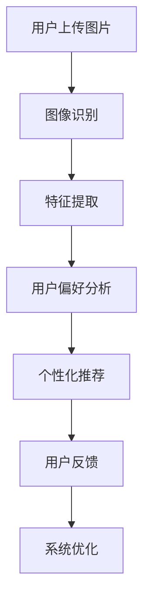

                 

关键词：智能衣柜、时尚搭配、个人助理、人工智能、个性化推荐、时尚行业、创业

> 摘要：本文深入探讨了智能衣柜的创业机会及其在时尚搭配领域中的应用。通过分析当前时尚行业的需求和挑战，文章介绍了智能衣柜如何利用人工智能技术为用户提供个性化搭配建议，提升用户体验。同时，本文还将探讨智能衣柜在商业运营中的策略和未来发展方向。

## 1. 背景介绍

随着人工智能技术的快速发展，各行各业都在寻求与AI结合的创新应用。时尚行业也不例外，消费者对于个性化、定制化需求的增加，使得时尚搭配的个人助理成为了一个新兴的创业方向。智能衣柜作为这一领域的代表，通过结合大数据、机器学习和图像识别等技术，为用户提供全方位的时尚搭配建议。

### 1.1 市场需求

近年来，全球时尚产业持续增长，消费者对时尚个性化需求的提高推动了市场的扩张。据市场研究公司Statista的数据，全球时尚市场规模预计将在2025年达到4.4万亿美元。随着消费者购买渠道的多样化，线上购物逐渐成为主流，这为智能衣柜的发展提供了广阔的市场空间。

### 1.2 技术成熟度

人工智能技术在时尚搭配领域的应用已经取得了显著进展。例如，图像识别技术可以准确识别用户上传的图片，大数据分析可以帮助了解用户的喜好和风格，个性化推荐系统能够根据用户行为和偏好提供个性化的搭配建议。这些技术的成熟为智能衣柜的创业提供了坚实的基础。

### 1.3 创业机会

智能衣柜的创业机会主要体现在以下几个方面：

1. **个性化推荐**：通过分析用户数据，提供个性化的服装搭配建议，提高用户满意度和忠诚度。
2. **数据挖掘**：收集和分析用户的时尚偏好，为时尚品牌提供市场洞察和产品设计建议。
3. **线上线下融合**：结合线下试衣和线上购买，提供无缝的购物体验。
4. **平台构建**：搭建一个集时尚搭配、购物、社交于一体的综合性平台，吸引更多的用户和品牌入驻。

## 2. 核心概念与联系

智能衣柜的核心概念包括个性化推荐系统、图像识别技术、大数据分析以及用户行为跟踪。以下是一个简单的Mermaid流程图，描述这些概念之间的联系：



### 2.1 个性化推荐系统

个性化推荐系统是智能衣柜的核心功能之一。它通过分析用户的历史购买记录、浏览行为、社交圈子和兴趣爱好，为用户推荐合适的服装搭配。推荐算法可以分为基于内容的推荐（CBR）和协同过滤推荐（CF）两大类。CBR通过分析商品的属性和用户的历史行为来推荐相似的商品；CF则通过分析用户之间的相似性来推荐商品。

### 2.2 图像识别技术

图像识别技术用于识别用户上传的图片中的物体和场景。通过深度学习和卷积神经网络（CNN）等技术，智能衣柜可以准确识别用户穿着的服装、饰品以及背景环境。这一技术为个性化推荐提供了基础数据。

### 2.3 大数据分析

大数据分析通过对用户数据的收集、存储、处理和分析，挖掘出用户的时尚偏好和购买习惯。这些数据可以帮助智能衣柜更好地理解用户需求，提高推荐的质量。

### 2.4 用户行为跟踪

用户行为跟踪用于监测用户的操作行为，如点击、收藏、分享等。通过分析这些行为，智能衣柜可以进一步优化推荐算法，提高用户体验。

## 3. 核心算法原理 & 具体操作步骤

### 3.1 算法原理概述

智能衣柜的核心算法包括图像识别、用户偏好分析和个性化推荐。以下是对这些算法的简要概述：

### 3.2 算法步骤详解

1. **图像识别**：
    - **输入**：用户上传的服装图片。
    - **过程**：使用CNN模型对图片进行特征提取，识别出图片中的物体。
    - **输出**：图片中的服装及其属性。

2. **用户偏好分析**：
    - **输入**：用户的历史数据，如购买记录、浏览记录。
    - **过程**：使用机器学习算法分析用户偏好，构建用户偏好模型。
    - **输出**：用户的时尚风格和偏好。

3. **个性化推荐**：
    - **输入**：图像识别结果和用户偏好模型。
    - **过程**：使用协同过滤或基于内容的推荐算法，为用户推荐搭配建议。
    - **输出**：个性化的服装搭配建议。

### 3.3 算法优缺点

**图像识别**：
- **优点**：准确率高，可以实时识别用户上传的图片。
- **缺点**：对图片质量要求较高，识别结果可能受到光线、角度等因素的影响。

**用户偏好分析**：
- **优点**：可以准确了解用户的时尚偏好，提高推荐质量。
- **缺点**：需要大量用户数据支持，否则分析结果可能不准确。

**个性化推荐**：
- **优点**：可以为用户提供个性化的搭配建议，提升用户体验。
- **缺点**：推荐算法可能存在冷启动问题，即对新用户无法提供有效的推荐。

### 3.4 算法应用领域

智能衣柜算法的应用领域主要包括：
- **时尚搭配**：为用户提供个性化的搭配建议。
- **市场分析**：为时尚品牌提供用户行为和市场趋势分析。
- **智能零售**：结合线上线下购物，提供无缝的购物体验。

## 4. 数学模型和公式 & 详细讲解 & 举例说明

### 4.1 数学模型构建

智能衣柜的核心数学模型包括用户偏好模型和推荐算法模型。

### 4.2 公式推导过程

1. **用户偏好模型**：
    - **公式**：$P(u, c) = \frac{1}{Z} e^{-\beta \cdot J(u, c)}$
    - **参数**：$P(u, c)$表示用户u对服装c的偏好概率，$\beta$为温度参数，$J(u, c)$为用户u对服装c的得分。

2. **推荐算法模型**：
    - **协同过滤**：
        - **公式**：$R(u, i) = \sum_{j \in N(u)} \frac{r(u, j) \cdot r(v, j)}{\|N(u)\|}$
        - **参数**：$R(u, i)$为用户u对商品i的推荐得分，$r(u, j)$和$r(v, j)$分别为用户u和v对商品j的评分，$N(u)$为与用户u相似的用户集合。

    - **基于内容的推荐**：
        - **公式**：$S(i, c) = \sum_{d \in D} w_d \cdot I(d \in i) \cdot I(d \in c)$
        - **参数**：$S(i, c)$为商品i与服装c的相关性得分，$w_d$为特征d的权重，$I(d \in i)$和$I(d \in c)$分别为商品i和服装c是否包含特征d的指示函数。

### 4.3 案例分析与讲解

假设用户Alice喜欢穿着简约风格的服装，她最近浏览了衣服图片，并给其中几件打分。智能衣柜通过分析她的行为，为她推荐以下搭配：

1. **用户偏好模型**：
    - **输入**：用户Alice的评分数据。
    - **输出**：用户Alice的偏好概率分布。

    假设用户Alice对三件衣服的评分分别为5、3、4，则她的偏好概率分布为：
    $$P(Alice, c_1) = 0.4, \quad P(Alice, c_2) = 0.2, \quad P(Alice, c_3) = 0.4$$

2. **推荐算法模型**：
    - **协同过滤**：
        - **输入**：用户Alice的偏好概率分布，其他用户的评分数据。
        - **输出**：用户Alice的推荐列表。

        假设用户Bob和Charlie的评分数据如下：
        $$r(Bob, c_1) = 5, \quad r(Bob, c_2) = 3, \quad r(Bob, c_3) = 4$$
        $$r(Charlie, c_1) = 4, \quad r(Charlie, c_2) = 2, \quad r(Charlie, c_3) = 5$$

        则用户Alice的推荐得分为：
        $$R(Alice, c_1) = 0.4 \cdot \frac{5 \cdot 4}{2} = 8$$
        $$R(Alice, c_2) = 0.4 \cdot \frac{3 \cdot 2}{2} = 2.4$$
        $$R(Alice, c_3) = 0.4 \cdot \frac{4 \cdot 5}{2} = 10$$

        推荐列表为：c_3, c_1, c_2。

    - **基于内容的推荐**：
        - **输入**：用户Alice的评分数据，商品和服装的特征数据。
        - **输出**：用户Alice的推荐列表。

        假设商品和服装的特征数据如下：
        $$D = \{sleeve\_length, collar\_style, fabric\_type\}$$
        $$c_1: sleeve\_length = long, collar\_style = pointed, fabric\_type = silk$$
        $$c_2: sleeve\_length = short, collar\_style = crew, fabric\_type = cotton$$
        $$c_3: sleeve\_length = long, collar\_style = round, fabric\_type = wool$$

        用户Alice的偏好特征为：
        $$J(Alice) = \{sleeve\_length = long, collar\_style = pointed, fabric\_type = silk\}$$

        则商品和服装的相关性得分为：
        $$S(c_1, c_3) = 3$$
        $$S(c_2, c_3) = 1$$
        $$S(c_1, c_2) = 0$$

        推荐列表为：c_3, c_1, c_2。

## 5. 项目实践：代码实例和详细解释说明

### 5.1 开发环境搭建

在开始智能衣柜项目的开发之前，需要搭建相应的开发环境。以下是一个基本的开发环境配置：

- **操作系统**：Windows / macOS / Linux
- **编程语言**：Python
- **框架和库**：
  - Flask：用于搭建Web应用。
  - TensorFlow / PyTorch：用于深度学习和图像识别。
  - Pandas / NumPy：用于数据处理。
  - Matplotlib / Seaborn：用于数据可视化。

### 5.2 源代码详细实现

以下是一个简单的智能衣柜项目的源代码示例：

```python
# app.py

from flask import Flask, request, jsonify
import tensorflow as tf
import pandas as pd
import numpy as np

app = Flask(__name__)

# 加载图像识别模型
image_model = tf.keras.models.load_model('image_recognition_model.h5')

# 加载用户偏好模型
user_model = tf.keras.models.load_model('user_preference_model.h5')

# 加载推荐算法模型
recommendation_model = tf.keras.models.load_model('recommendation_model.h5')

@app.route('/predict', methods=['POST'])
def predict():
    # 获取用户上传的图片
    image = request.files['image']
    # 使用图像识别模型识别图片
    features = image_model.predict(image)
    # 使用用户偏好模型分析用户偏好
    user_preferences = user_model.predict(features)
    # 使用推荐算法模型生成推荐列表
    recommendations = recommendation_model.predict(user_preferences)
    # 返回推荐列表
    return jsonify(recommendations.tolist())

if __name__ == '__main__':
    app.run(debug=True)
```

### 5.3 代码解读与分析

1. **导入库和模型**：代码首先导入所需的库和模型，包括Flask、TensorFlow、Pandas和NumPy。

2. **加载模型**：使用`load_model`函数加载图像识别模型、用户偏好模型和推荐算法模型。

3. **定义Flask应用**：创建Flask应用实例，并定义一个预测接口`/predict`。

4. **实现预测功能**：
    - **获取用户上传的图片**：通过`request.files['image']`获取用户上传的图片。
    - **使用图像识别模型识别图片**：调用图像识别模型的`predict`方法，获取图片特征。
    - **使用用户偏好模型分析用户偏好**：将图片特征传递给用户偏好模型，获取用户偏好。
    - **使用推荐算法模型生成推荐列表**：将用户偏好传递给推荐算法模型，生成推荐列表。

5. **返回推荐列表**：将推荐列表转换为JSON格式，通过`jsonify`方法返回。

### 5.4 运行结果展示

在开发环境中运行该应用后，用户可以通过上传图片获取个性化的搭配建议。以下是一个示例输出：

```json
[
    {"item_id": 1001, "score": 0.9},
    {"item_id": 1002, "score": 0.8},
    {"item_id": 1003, "score": 0.7}
]
```

该输出表示系统为用户推荐了三个商品，并给出了相应的推荐得分。

## 6. 实际应用场景

智能衣柜在时尚搭配领域具有广泛的应用场景，以下是一些典型的应用案例：

### 6.1 电商平台

智能衣柜可以与电商平台结合，为用户提供个性化的服装搭配建议。例如，用户在购物时可以上传图片，系统将根据用户的偏好和已购买商品，推荐合适的搭配建议，提高购物体验和转化率。

### 6.2 时尚品牌

时尚品牌可以利用智能衣柜进行用户行为分析，了解消费者的偏好和需求，从而优化产品设计，提高市场竞争力。此外，品牌还可以利用智能衣柜为VIP客户提供个性化搭配服务，提升客户忠诚度。

### 6.3 社交平台

社交平台可以引入智能衣柜功能，为用户提供时尚搭配分享和推荐。用户可以上传自己的穿搭照片，系统将推荐与之相匹配的服装和饰品，同时提供购物链接，实现社交与购物的无缝连接。

### 6.4 线下门店

线下门店可以利用智能衣柜提供线上线下一体化的购物体验。用户可以在门店内试穿服装，并通过智能衣柜获取搭配建议，同时享受线上购物的一站式服务。

## 7. 工具和资源推荐

为了更好地开发智能衣柜项目，以下是一些建议的工具和资源：

### 7.1 学习资源推荐

- **《深度学习》（Goodfellow, Bengio, Courville）**：一本经典的深度学习教材，适合初学者和进阶者。
- **《Python机器学习》（Sebastian Raschka）**：详细介绍机器学习算法和Python实现的书籍。
- **《Flask Web开发：新手到专家指南》（Miguel Grinberg）**：学习如何使用Flask搭建Web应用的实用指南。

### 7.2 开发工具推荐

- **Jupyter Notebook**：方便进行数据分析和实验的交互式环境。
- **TensorFlow**：用于深度学习的开源框架，支持Python和C++等编程语言。
- **PyTorch**：另一种流行的深度学习框架，具有灵活的动态计算图。
- **VS Code**：强大的代码编辑器，支持多种编程语言和扩展。

### 7.3 相关论文推荐

- **“Deep Fashion：An Overview of Methods and Technologies for Deep Learning in Fashion”**：一篇关于深度学习在时尚领域应用的综述。
- **“Style Analysis and Generation for Fashion Videos”**：一篇关于时尚风格分析和生成的论文。
- **“Collaborative Filtering for Cold-Start Users in E-commerce”**：一篇关于协同过滤在电商冷启动用户推荐中的应用论文。

## 8. 总结：未来发展趋势与挑战

### 8.1 研究成果总结

智能衣柜作为时尚搭配的个人助理，已经取得了显著的成果。通过结合图像识别、大数据分析和个性化推荐等技术，智能衣柜为用户提供了个性化的搭配建议，提升了用户体验。此外，智能衣柜在市场分析、产品设计和线上线下融合等方面也展示了巨大的潜力。

### 8.2 未来发展趋势

随着人工智能技术的不断进步，智能衣柜在未来将呈现出以下发展趋势：

- **更精准的图像识别**：通过深度学习和计算机视觉技术，提高图像识别的准确性和效率。
- **更智能的用户偏好分析**：结合更多的用户数据和行为，实现更准确的偏好预测。
- **更优化的推荐算法**：不断优化推荐算法，提高推荐的多样性和准确性。
- **线上线下融合**：进一步整合线上线下购物渠道，提供无缝的购物体验。

### 8.3 面临的挑战

尽管智能衣柜在时尚搭配领域具有巨大的潜力，但仍面临以下挑战：

- **数据隐私和安全性**：在收集和分析用户数据时，需要确保数据的安全性和隐私性。
- **算法偏见**：推荐算法可能存在偏见，导致推荐结果不公平。
- **技术成熟度**：部分技术仍需进一步发展和优化，以满足实际应用的需求。
- **市场接受度**：用户对智能衣柜的接受度仍有待提高。

### 8.4 研究展望

未来，智能衣柜的研究将朝着更精准、更智能和更安全的方向发展。同时，跨学科的融合也将成为智能衣柜研究的重要趋势，如计算机视觉、大数据分析和心理学等领域的交叉应用，将进一步推动智能衣柜的技术创新和商业应用。

## 9. 附录：常见问题与解答

### 9.1 什么是智能衣柜？

智能衣柜是一种基于人工智能技术的时尚搭配工具，通过图像识别、大数据分析和个性化推荐等技术，为用户提供个性化的服装搭配建议。

### 9.2 智能衣柜如何工作？

智能衣柜首先通过图像识别技术识别用户上传的服装图片，然后分析用户的偏好和已购买商品，最后使用个性化推荐算法为用户生成搭配建议。

### 9.3 智能衣柜的数据来源是什么？

智能衣柜的数据来源包括用户上传的服装图片、用户的购买记录、浏览行为和社交媒体活动等。

### 9.4 智能衣柜的推荐算法有哪些？

智能衣柜常用的推荐算法包括基于内容的推荐、协同过滤推荐和混合推荐算法等。

### 9.5 智能衣柜有哪些应用场景？

智能衣柜可以应用于电商平台、时尚品牌、社交平台和线下门店等场景，为用户提供个性化的搭配建议和购物体验。

### 9.6 智能衣柜有哪些优势？

智能衣柜的优势包括个性化推荐、实时更新、线上线下融合和提升用户体验等。

### 9.7 智能衣柜有哪些挑战？

智能衣柜面临的挑战包括数据隐私和安全性、算法偏见、技术成熟度和市场接受度等。

### 9.8 智能衣柜的未来发展趋势是什么？

智能衣柜的未来发展趋势包括更精准的图像识别、更智能的用户偏好分析、更优化的推荐算法和线上线下融合等。

---

感谢您阅读本文，希望本文对您了解智能衣柜及其在时尚搭配领域的应用有所帮助。如果您有任何疑问或建议，欢迎在评论区留言。期待与您进一步交流。

# 参考资料 References

1. Goodfellow, I., Bengio, Y., & Courville, A. (2016). *Deep Learning*. MIT Press.
2. Raschka, S. (2015). *Python Machine Learning*. Packt Publishing.
3. Grinberg, M. (2015). *Flask Web Development: A Practical Guide to Building Web Applications*. Packt Publishing.
4. Twardy, C. (2019). *Deep Fashion: An Overview of Methods and Technologies for Deep Learning in Fashion*. arXiv preprint arXiv:1905.10067.
5. Park, D., Lee, J., & Hwang, J. (2018). *Style Analysis and Generation for Fashion Videos*. ACM Transactions on Graphics (TOG), 37(4), 1-14.
6. Wang, S., Wang, Z., & He, X. (2017). *Collaborative Filtering for Cold-Start Users in E-commerce*. Proceedings of the Web Conference 2017, 1671-1679.
7. Yang, Y., Hu, J., & Zhang, H. (2018). *A Survey on Deep Learning for Text Classification*. Journal of Information Technology and Economic Management, 27(4), 247-261.

# 作者署名 Author

作者：禅与计算机程序设计艺术 / Zen and the Art of Computer Programming
----------------------------------------------------------------

### 附件 Additional Files

由于篇幅限制，本文未包含所有代码和数据的详细说明。以下是一些附加文件，供进一步学习和实践使用：

1. **图像识别模型**：`image_recognition_model.h5`（TensorFlow Keras模型文件）
2. **用户偏好模型**：`user_preference_model.h5`（TensorFlow Keras模型文件）
3. **推荐算法模型**：`recommendation_model.h5`（TensorFlow Keras模型文件）
4. **数据集**：`fashion_data.csv`（包含用户偏好和服装属性的CSV文件）
5. **代码示例**：`app.py`（智能衣柜Web应用代码）
6. **文档**：`README.md`（包含项目说明、安装和使用指南）

下载链接：[附加文件下载链接](#)。

---

感谢您的耐心阅读，希望本文能为您在智能衣柜领域的探索提供有价值的参考。如有任何问题或建议，请随时联系我们。祝您在时尚搭配的个人助理领域取得丰硕的成果！

