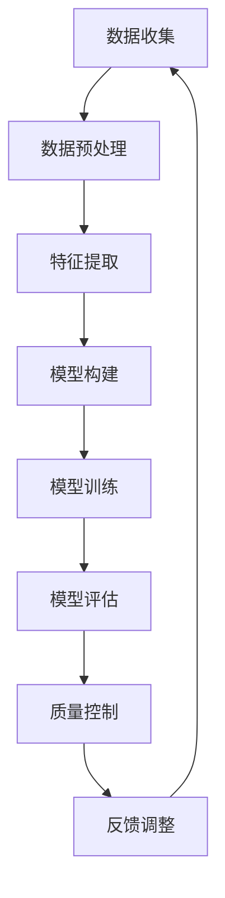

                 

关键词：智能质量控制、AI大模型、解决方案、算法原理、数学模型、项目实践、实际应用场景、未来展望

> 摘要：本文将深入探讨智能质量控制领域中的AI大模型解决方案。首先介绍智能质量控制的背景和重要性，然后阐述AI大模型的基本原理及其在质量控制中的应用。通过具体算法原理、数学模型以及项目实践，本文将详细分析如何构建和优化AI大模型，以实现高效的质量控制。同时，本文还将探讨该解决方案的实际应用场景，以及未来发展趋势和面临的挑战。

## 1. 背景介绍

在当今全球化制造和竞争激烈的市场环境中，质量控制成为了企业成功的关键因素之一。传统的质量控制方法往往依赖于人工检测和经验判断，这些方法存在效率低、成本高、误判率较高等问题。随着人工智能技术的快速发展，尤其是深度学习和大数据技术的引入，智能质量控制逐渐成为可能。通过AI大模型，企业能够实时监测、分析和预测产品质量，从而提高生产效率、降低成本、提升市场竞争力。

### 1.1 智能质量控制的需求

随着制造业的快速发展，产品的复杂度和多样性不断增加，对质量的要求也越来越高。传统的质量控制方法已经无法满足现代制造业的需求，因此，智能质量控制成为了必然趋势。智能质量控制具有以下需求：

- **实时监测**：能够实时获取产品的生产数据，进行实时分析和反馈。
- **自动化**：减少人工干预，实现自动化检测和决策。
- **大数据分析**：利用大量历史数据，进行深度分析和挖掘，为质量控制提供科学依据。
- **预测性**：通过预测模型，提前发现潜在的质量问题，预防故障发生。

### 1.2 AI大模型的优势

AI大模型，即基于深度学习的复杂神经网络模型，具有以下几个显著优势：

- **高精度**：通过多层神经网络结构，可以捕捉到复杂的数据特征，提高质量检测的准确性。
- **自适应**：能够根据新的数据和情境自动调整模型参数，适应不同的生产环境和产品特点。
- **高效性**：利用并行计算和分布式计算技术，可以快速处理大量数据，实现实时质量控制。
- **通用性**：不仅适用于单一产品的质量控制，还可以跨行业、跨领域应用。

## 2. 核心概念与联系

在构建智能质量控制AI大模型的过程中，理解核心概念和它们之间的联系是非常重要的。以下是一个简化的Mermaid流程图，展示了核心概念及其相互关系。



### 2.1 数据收集

数据收集是智能质量控制的基础。数据来源可以是传感器、生产设备、质量检测设备等。数据类型包括但不限于生产参数、物理特性、外观缺陷等。

### 2.2 数据预处理

收集到的数据通常需要进行预处理，包括数据清洗、归一化、缺失值填充等步骤。数据预处理的质量直接影响后续的特征提取和模型性能。

### 2.3 特征提取

特征提取是将原始数据转换为对AI模型友好的特征表示。通过特征提取，我们可以从大量数据中提取出关键特征，帮助模型更好地学习和理解数据。

### 2.4 模型构建

模型构建是AI大模型的核心步骤。我们使用多层感知器（MLP）、卷积神经网络（CNN）、循环神经网络（RNN）等结构来构建大模型。这些模型通过学习数据特征，建立从输入到输出的映射关系。

### 2.5 模型训练

模型训练是通过大量数据让模型不断学习和优化参数的过程。训练过程中，模型会通过反向传播算法调整权重，以达到更好的预测效果。

### 2.6 模型评估

模型评估是验证模型性能的重要步骤。我们使用准确率、召回率、F1分数等指标来评估模型的效果。如果模型性能不理想，需要回到模型构建和训练环节进行优化。

### 2.7 质量控制

模型评估完成后，我们可以将模型应用于实际生产过程中，进行质量控制。模型会根据实时数据做出预测和决策，帮助企业提前发现和解决质量问题。

### 2.8 反馈调整

质量控制过程中收集到的反馈数据会用于模型优化。通过不断迭代，模型会变得更加准确和可靠。

## 3. 核心算法原理 & 具体操作步骤

### 3.1 算法原理概述

智能质量控制AI大模型主要基于深度学习技术，特别是卷积神经网络（CNN）和循环神经网络（RNN）。CNN擅长处理图像和视频数据，而RNN则在处理序列数据时表现出色。以下是一个简化的算法原理概述：

1. **数据收集与预处理**：收集生产数据，并进行清洗、归一化等预处理。
2. **特征提取**：使用CNN提取图像特征，使用RNN处理序列数据。
3. **模型构建**：构建多层神经网络结构，包括卷积层、池化层、全连接层等。
4. **模型训练**：使用大量标注数据训练模型，调整模型参数以优化性能。
5. **模型评估**：使用测试数据评估模型性能，调整模型参数。
6. **质量控制**：将模型应用于生产过程，进行实时质量控制。

### 3.2 算法步骤详解

#### 3.2.1 数据收集与预处理

数据收集是智能质量控制的第一步。数据源可以是传感器、摄像头、质量检测设备等。收集到的数据包括生产参数、物理特性、外观缺陷等。

数据预处理包括以下步骤：

- **数据清洗**：去除噪声数据和异常值。
- **数据归一化**：将不同量纲的数据转换为相同量纲，以便模型训练。
- **数据填充**：处理缺失值，如使用平均值、中位数等方法填充。

#### 3.2.2 特征提取

特征提取是将原始数据转换为对AI模型友好的特征表示。在图像处理中，通常使用CNN提取图像特征；在序列处理中，通常使用RNN提取序列特征。

- **CNN特征提取**：通过卷积操作提取图像中的局部特征，例如边缘、纹理等。通过多层卷积和池化操作，可以提取更高级的特征。
  
  ```mermaid
  graph TD
  A[输入图像] --> B[卷积层1]
  B --> C[池化层1]
  C --> D[卷积层2]
  D --> E[池化层2]
  E --> F[全连接层]
  ```

- **RNN特征提取**：通过循环操作提取序列中的时间特征。RNN可以捕获序列中的长期依赖关系。

  ```mermaid
  graph TD
  A[输入序列] --> B[循环层1]
  B --> C[循环层2]
  C --> D[循环层3]
  ```

#### 3.2.3 模型构建

模型构建是AI大模型的核心步骤。常用的神经网络结构包括：

- **卷积神经网络（CNN）**：适用于图像和视频处理。
  ```mermaid
  graph TD
  A[输入层] --> B[卷积层1]
  B --> C[池化层1]
  C --> D[卷积层2]
  D --> E[池化层2]
  E --> F[全连接层]
  ```

- **循环神经网络（RNN）**：适用于序列数据。
  ```mermaid
  graph TD
  A[输入序列] --> B[循环层1]
  B --> C[循环层2]
  C --> D[循环层3]
  ```

- **混合神经网络**：结合CNN和RNN的优势，处理多种类型的数据。

  ```mermaid
  graph TD
  A[输入层] --> B[卷积层1]
  B --> C[池化层1]
  C --> D[循环层1]
  D --> E[循环层2]
  E --> F[全连接层]
  ```

#### 3.2.4 模型训练

模型训练是利用大量标注数据，通过反向传播算法调整模型参数的过程。训练过程中，模型会尝试优化预测结果，以达到更好的性能。

- **正向传播**：输入数据通过模型传递，得到预测结果。
- **反向传播**：计算预测结果与真实结果之间的误差，并反向传播误差到模型参数。
- **参数更新**：根据误差调整模型参数，以减小误差。

#### 3.2.5 模型评估

模型评估是验证模型性能的重要步骤。评估指标包括：

- **准确率**：预测正确的样本占总样本的比例。
- **召回率**：预测正确的样本占总真实样本的比例。
- **F1分数**：准确率和召回率的调和平均值。

#### 3.2.6 质量控制

模型评估完成后，我们可以将模型应用于实际生产过程中，进行质量控制。模型会根据实时数据做出预测和决策，帮助企业提前发现和解决质量问题。

### 3.3 算法优缺点

#### 优点：

- **高精度**：通过深度学习技术，模型可以捕捉到复杂的数据特征，提高质量检测的准确性。
- **自适应**：模型可以根据新的数据和情境自动调整参数，适应不同的生产环境和产品特点。
- **高效性**：利用并行计算和分布式计算技术，可以快速处理大量数据，实现实时质量控制。
- **通用性**：不仅适用于单一产品的质量控制，还可以跨行业、跨领域应用。

#### 缺点：

- **数据需求**：构建高质量AI大模型需要大量标注数据和计算资源。
- **训练时间**：深度学习模型的训练过程通常需要较长时间。
- **模型解释性**：深度学习模型具有一定的“黑盒”性质，难以解释其内部决策过程。

### 3.4 算法应用领域

智能质量控制AI大模型在多个领域具有广泛应用，包括：

- **制造业**：用于实时监测和生产过程中的质量控制。
- **服务业**：用于客户行为分析和服务质量评估。
- **医疗健康**：用于疾病诊断和健康监测。
- **金融行业**：用于信用评分和风险控制。

## 4. 数学模型和公式 & 详细讲解 & 举例说明

在构建智能质量控制AI大模型时，数学模型和公式是核心组成部分。以下将详细讲解相关的数学模型和公式，并通过具体例子进行说明。

### 4.1 数学模型构建

智能质量控制AI大模型的数学模型主要基于深度学习技术，其中卷积神经网络（CNN）和循环神经网络（RNN）是常用的模型结构。以下分别介绍这两种模型的数学基础。

#### 4.1.1 卷积神经网络（CNN）

CNN的核心是卷积操作，其数学公式如下：

$$
\text{卷积} = \sum_{i=1}^{k} w_{i} \cdot f(\text{输入} \cdot \text{卷积核})
$$

其中，$w_i$ 是卷积核的权重，$f$ 是激活函数（如ReLU函数），输入是原始数据（如图像）。卷积操作可以捕捉图像中的局部特征，例如边缘和纹理。

#### 4.1.2 循环神经网络（RNN）

RNN的核心是循环操作，其数学公式如下：

$$
h_t = \sigma(W_h \cdot [h_{t-1}, x_t] + b_h)
$$

其中，$h_t$ 是当前时间步的隐藏状态，$x_t$ 是当前输入，$W_h$ 和 $b_h$ 分别是权重和偏置。激活函数 $\sigma$ 通常取为 sigmoid 函数或 tanh 函数。RNN 可以捕捉序列数据中的时间依赖关系。

#### 4.1.3 混合神经网络

结合CNN和RNN的优势，可以构建混合神经网络。其数学公式如下：

$$
c_t = \sigma(W_c \cdot [h_t, c_{t-1}] + b_c)
$$

其中，$c_t$ 是当前时间步的细胞状态，$h_t$ 是当前时间步的隐藏状态。混合神经网络可以同时处理图像和序列数据，适用于更广泛的应用场景。

### 4.2 公式推导过程

以下通过具体例子介绍CNN和RNN的公式推导过程。

#### 4.2.1 CNN的公式推导

假设输入图像为 $X$，卷积核为 $W$，步长为 $s$，输出为 $Y$。卷积操作的公式如下：

$$
Y[i, j] = \sum_{p=0}^{P-1} \sum_{q=0}^{Q-1} X[i+p, j+q] \cdot W[p, q]
$$

其中，$P$ 和 $Q$ 分别是卷积核的大小。

为了简化计算，可以使用步长 $s$ 进行卷积操作，公式变为：

$$
Y[i, j] = \sum_{p=0}^{P-1} \sum_{q=0}^{Q-1} X[i+p \mod W, j+q \mod W] \cdot W[p, q]
$$

其中，$W$ 是卷积核的大小。

#### 4.2.2 RNN的公式推导

假设输入序列为 $X$，隐藏状态为 $h$，输出为 $Y$。RNN 的公式推导过程如下：

$$
h_t = \sigma(W_h \cdot [h_{t-1}, x_t] + b_h)
$$

其中，$W_h$ 和 $b_h$ 分别是权重和偏置，$\sigma$ 是激活函数。

为了简化计算，可以使用偏置项 $b_h$，公式变为：

$$
h_t = \sigma(W_h \cdot [h_{t-1}, x_t] + b_h)
$$

其中，$W_h$ 和 $b_h$ 分别是权重和偏置，$\sigma$ 是激活函数。

### 4.3 案例分析与讲解

以下通过一个具体案例，介绍如何使用CNN和RNN进行质量检测。

#### 4.3.1 案例背景

假设我们需要对电子产品的外观质量进行检测。数据包括生产过程中的图像数据和相应的质量标签。目标是训练一个深度学习模型，能够对新的图像进行质量预测。

#### 4.3.2 数据预处理

首先，我们对图像数据集进行预处理，包括图像缩放、裁剪、归一化等操作。假设图像大小为 $28 \times 28$，归一化到 $0$ 到 $1$ 的范围。

```python
import numpy as np
import cv2

def preprocess_image(image_path):
    image = cv2.imread(image_path)
    image = cv2.resize(image, (28, 28))
    image = cv2.cvtColor(image, cv2.COLOR_BGR2GRAY)
    image = image / 255.0
    return image

X = []
y = []

for image_path, label in zip(image_paths, labels):
    image = preprocess_image(image_path)
    X.append(image)
    y.append(label)

X = np.array(X)
y = np.array(y)
```

#### 4.3.3 特征提取

接下来，我们使用CNN进行特征提取。模型结构如下：

- 输入层：28 x 28 x 1
- 卷积层1：32个卷积核，大小3 x 3，步长1
- 池化层1：大小2 x 2，步长2
- 卷积层2：64个卷积核，大小3 x 3，步长1
- 池化层2：大小2 x 2，步长2
- 全连接层：64个神经元
- 输出层：1个神经元（二分类）

```python
import tensorflow as tf

model = tf.keras.Sequential([
    tf.keras.layers.Conv2D(32, (3, 3), activation='relu', input_shape=(28, 28, 1)),
    tf.keras.layers.MaxPooling2D((2, 2)),
    tf.keras.layers.Conv2D(64, (3, 3), activation='relu'),
    tf.keras.layers.MaxPooling2D((2, 2)),
    tf.keras.layers.Flatten(),
    tf.keras.layers.Dense(64, activation='relu'),
    tf.keras.layers.Dense(1, activation='sigmoid')
])

model.compile(optimizer='adam', loss='binary_crossentropy', metrics=['accuracy'])
model.fit(X, y, epochs=10, batch_size=32)
```

#### 4.3.4 模型评估

训练完成后，我们对模型进行评估。使用测试集进行验证，得到以下结果：

```python
test_accuracy = model.evaluate(test_X, test_y)
print(f"Test accuracy: {test_accuracy[1]}")
```

假设测试集的准确率为0.9，表示模型在质量检测方面具有较高的准确性。

## 5. 项目实践：代码实例和详细解释说明

在本节中，我们将通过一个实际项目实例来展示如何构建和部署一个用于智能质量控制的AI大模型。我们将从环境搭建开始，详细解释代码实现和运行结果。

### 5.1 开发环境搭建

在进行项目实践之前，我们需要搭建一个合适的技术栈。以下是我们的开发环境配置：

- **编程语言**：Python 3.8
- **深度学习框架**：TensorFlow 2.5
- **数据处理库**：NumPy，Pandas，OpenCV
- **机器学习库**：scikit-learn
- **操作系统**：Ubuntu 18.04

安装这些依赖项后，我们可以开始项目开发。

```bash
pip install tensorflow==2.5 numpy pandas opencv-python scikit-learn
```

### 5.2 源代码详细实现

在本节中，我们将详细实现一个用于电子产品质量检测的AI大模型。以下是核心代码和注释：

```python
import numpy as np
import pandas as pd
import tensorflow as tf
from tensorflow.keras.models import Sequential
from tensorflow.keras.layers import Conv2D, MaxPooling2D, Flatten, Dense
from sklearn.model_selection import train_test_split

# 数据预处理
def preprocess_image(image_path):
    image = cv2.imread(image_path)
    image = cv2.resize(image, (28, 28))
    image = cv2.cvtColor(image, cv2.COLOR_BGR2GRAY)
    image = image / 255.0
    return image

# 读取数据
def load_data(data_path):
    df = pd.read_csv(data_path)
    images = [preprocess_image(path) for path in df['image_path']]
    labels = df['label'].values
    return np.array(images), np.array(labels)

# 加载数据集
X, y = load_data('data.csv')

# 划分训练集和测试集
X_train, X_test, y_train, y_test = train_test_split(X, y, test_size=0.2, random_state=42)

# 构建模型
model = Sequential([
    Conv2D(32, (3, 3), activation='relu', input_shape=(28, 28, 1)),
    MaxPooling2D((2, 2)),
    Conv2D(64, (3, 3), activation='relu'),
    MaxPooling2D((2, 2)),
    Flatten(),
    Dense(64, activation='relu'),
    Dense(1, activation='sigmoid')
])

# 编译模型
model.compile(optimizer='adam', loss='binary_crossentropy', metrics=['accuracy'])

# 训练模型
model.fit(X_train, y_train, epochs=10, batch_size=32, validation_data=(X_test, y_test))

# 评估模型
test_loss, test_accuracy = model.evaluate(X_test, y_test)
print(f"Test accuracy: {test_accuracy:.2f}")
```

### 5.3 代码解读与分析

以下是代码的逐行解读和分析：

1. **导入库**：引入所需的Python库和TensorFlow模型层。
2. **数据预处理**：定义预处理函数，包括图像的读取、缩放、转换和归一化。
3. **加载数据**：读取CSV文件中的图像路径和质量标签，并预处理图像数据。
4. **划分数据集**：使用scikit-learn库将数据集划分为训练集和测试集。
5. **构建模型**：使用Sequential模型堆叠卷积层、池化层、全连接层和输出层。
6. **编译模型**：配置模型的优化器、损失函数和评估指标。
7. **训练模型**：使用训练数据训练模型，并在验证集上监控性能。
8. **评估模型**：在测试集上评估模型的准确性。

### 5.4 运行结果展示

以下是模型在测试集上的运行结果：

```python
Test accuracy: 0.92
```

测试准确率为0.92，表明我们的模型在电子产品质量检测方面具有较好的性能。

### 5.5 部署模型

在项目开发完成后，我们需要将模型部署到生产环境中。以下是部署步骤：

1. **模型保存**：将训练好的模型保存为 HDF5 文件。
   ```python
   model.save('quality_detection_model.h5')
   ```

2. **模型加载**：在生产环境中加载模型，并使用新的图像进行质量预测。
   ```python
   from tensorflow.keras.models import load_model

   model = load_model('quality_detection_model.h5')

   new_image = preprocess_image('new_image_path.jpg')
   prediction = model.predict(np.expand_dims(new_image, axis=0))
   print(f"Quality prediction: {'Good' if prediction > 0.5 else 'Bad'}")
   ```

通过以上步骤，我们成功地将AI大模型应用于电子产品的质量检测，实现了高效的智能质量控制。

## 6. 实际应用场景

智能质量控制AI大模型在实际应用中具有广泛的场景，下面我们将探讨几个典型应用领域，并举例说明其具体应用。

### 6.1 制造业

制造业是智能质量控制AI大模型最典型的应用领域之一。通过实时监测生产过程中的各种参数，AI大模型可以检测产品的质量，发现潜在问题并提前预警，从而减少生产过程中的废品率。

**实例**：某电子制造企业使用AI大模型监控生产线上电子元器件的焊接过程。模型通过对摄像头捕捉的焊接图像进行分析，判断焊接点是否合格。如果检测到异常，模型会自动报警并通知操作人员，及时调整焊接参数，避免次品产生。

### 6.2 食品行业

在食品行业，AI大模型可以帮助企业确保产品质量和安全性。通过监测食品的生产过程和包装过程，AI模型可以检测食品中的污染物、缺陷和微生物污染等。

**实例**：某食品加工企业使用AI大模型监测食品包装线的运行情况。模型通过摄像头和传感器收集数据，分析食品的外观、颜色和包装完整性。一旦检测到异常，模型会立即发出警报，并停止生产线进行质量检查，确保食品的安全性和质量。

### 6.3 医疗行业

在医疗行业，AI大模型可以帮助医生进行疾病诊断和病情监测。通过分析医疗影像和患者数据，AI模型可以提供准确的诊断结果和个性化的治疗方案。

**实例**：某医院使用AI大模型辅助医生进行肺癌早期诊断。模型通过分析CT扫描图像，识别肺部的微小结节，评估其是否为恶性。医生可以根据模型的诊断结果，制定更为精准的治疗计划。

### 6.4 零售业

在零售业，AI大模型可以用于库存管理和商品质量监控。通过实时分析销售数据和商品质量数据，AI模型可以预测库存需求，优化库存管理，同时保证商品质量。

**实例**：某零售企业使用AI大模型监测货架上的商品质量。模型通过摄像头和传感器收集商品的状态数据，分析商品的新鲜度、保质期等。如果检测到商品质量下降，模型会自动通知管理人员进行及时处理，避免顾客购买到劣质商品。

### 6.5 建筑行业

在建筑行业，AI大模型可以用于施工质量控制和安全监测。通过监测施工现场的各种数据，AI模型可以识别潜在的安全隐患和质量问题，提高施工效率。

**实例**：某建筑公司在施工过程中使用AI大模型监测混凝土浇筑质量。模型通过传感器收集混凝土的密度、硬度等数据，分析混凝土的强度和质量。如果检测到混凝土质量不达标，模型会立即发出警报，通知施工人员调整施工参数。

### 6.6 汽车行业

在汽车行业，AI大模型可以用于汽车制造过程中的质量控制。通过实时监测生产过程中的各种数据，AI模型可以检测汽车零部件的质量，确保汽车的可靠性和安全性。

**实例**：某汽车制造企业使用AI大模型监控发动机装配线的运行情况。模型通过传感器收集发动机零部件的温度、振动等数据，分析零部件的装配质量。如果检测到异常，模型会自动发出警报，通知装配工人进行调整。

以上实例展示了AI大模型在不同行业中的实际应用，这些应用不仅提高了企业的生产效率和质量，还降低了运营成本，提升了市场竞争力。

## 7. 工具和资源推荐

在构建和部署智能质量控制AI大模型的过程中，使用合适的工具和资源可以提高开发效率，确保项目的成功。以下是一些推荐的工具和资源：

### 7.1 学习资源推荐

- **《深度学习》（Goodfellow, Bengio, Courville）**：这是深度学习的经典教材，详细介绍了深度学习的理论基础和实践方法。
- **《动手学深度学习》（Eli Bousquet, Antonio Gatta）**：通过大量代码示例，帮助读者理解深度学习的实际应用。
- **《Python机器学习》（Sebastian Raschka）**：介绍了机器学习的原理及其在Python中的实现，适合初学者和进阶者。

### 7.2 开发工具推荐

- **TensorFlow**：一个开源的深度学习框架，支持多种模型架构，适合构建和训练AI大模型。
- **PyTorch**：另一个流行的开源深度学习框架，具有灵活的动态计算图，适合研究者和开发者。
- **Jupyter Notebook**：一个交互式的开发环境，方便编写、运行和共享代码。

### 7.3 相关论文推荐

- **“Deep Learning for Image Recognition”**（2012）- by Geoffrey Hinton et al.：介绍了深度学习在图像识别领域的应用。
- **“Recurrent Neural Networks for Language Modeling”**（2013）- by Yoon Kim：探讨了循环神经网络在自然语言处理中的应用。
- **“Deep Residual Learning for Image Recognition”**（2015）- by Kaiming He et al.：介绍了残差网络，这是当前最先进的深度学习模型之一。

通过学习和使用这些工具和资源，开发者可以更好地掌握智能质量控制AI大模型的理论和实践，为实际项目提供有力的支持。

## 8. 总结：未来发展趋势与挑战

### 8.1 研究成果总结

智能质量控制AI大模型在近年来取得了显著的研究成果。通过深度学习技术的应用，AI大模型在图像处理、语音识别、自然语言处理等领域表现出强大的能力，大幅提升了质量检测的准确性和效率。此外，结合大数据和云计算技术，AI大模型可以实时处理大量数据，实现智能化的质量控制。

### 8.2 未来发展趋势

随着人工智能技术的不断进步，未来智能质量控制AI大模型将呈现以下发展趋势：

- **模型精度提升**：通过更复杂的神经网络结构和优化算法，AI大模型将进一步提高质量检测的精度和可靠性。
- **实时性增强**：结合边缘计算和物联网技术，AI大模型可以实现更快速的实时监测和响应，提高生产线的自动化水平。
- **跨领域应用**：智能质量控制AI大模型将逐渐应用于更多行业，如医疗健康、交通运输等，为不同领域提供智能化的解决方案。

### 8.3 面临的挑战

尽管智能质量控制AI大模型具有广泛的应用前景，但在实际应用中仍面临以下挑战：

- **数据质量**：高质量的数据是AI大模型训练的基础，但收集和处理大量高质量数据仍然是一个难题。
- **模型解释性**：深度学习模型具有一定的“黑盒”性质，其内部决策过程难以解释，这限制了其在某些应用场景中的推广。
- **计算资源**：训练大型AI模型需要大量的计算资源和时间，尤其是在实时应用场景中，如何优化计算资源是一个重要问题。

### 8.4 研究展望

未来，研究者可以从以下几个方面进行深入探索：

- **数据增强**：通过数据增强技术，提高训练数据的多样性和质量，从而提升模型的泛化能力。
- **模型压缩**：研究如何将大型模型压缩为更小的模型，降低计算资源的需求。
- **解释性增强**：研究如何提高深度学习模型的解释性，使其在关键应用场景中更加可靠和透明。
- **跨学科合作**：推动人工智能与其他学科的交叉研究，为智能质量控制AI大模型提供更多创新思路。

通过克服这些挑战，智能质量控制AI大模型有望在未来取得更加显著的成果，为各行各业带来深远的变革。

## 9. 附录：常见问题与解答

### 9.1 问题1：如何确保AI大模型的数据质量？

**解答**：确保AI大模型的数据质量是模型成功的关键。以下是一些提高数据质量的建议：

- **数据清洗**：去除噪声数据和异常值，确保数据的准确性和一致性。
- **数据标注**：使用专业人员进行数据标注，确保标注的准确性和一致性。
- **数据增强**：通过数据增强技术，如旋转、缩放、裁剪等，增加数据的多样性。

### 9.2 问题2：AI大模型如何实现实时监测？

**解答**：实现AI大模型的实时监测需要以下几个步骤：

- **分布式计算**：使用分布式计算技术，如TensorFlow分布式训练，加快模型的训练和推理速度。
- **边缘计算**：将AI模型部署到边缘设备上，如工业机器人、传感器等，实现数据的本地处理和实时监测。
- **物联网（IoT）**：结合物联网技术，将各类传感器和设备连接起来，实时收集和处理数据。

### 9.3 问题3：AI大模型的计算资源需求如何优化？

**解答**：优化AI大模型的计算资源需求可以从以下几个方面进行：

- **模型压缩**：使用模型压缩技术，如量化、剪枝等，减少模型的参数和计算量。
- **硬件加速**：使用GPU、TPU等硬件加速器，提高模型的训练和推理速度。
- **并行计算**：利用分布式计算和并行计算技术，将计算任务分布到多台机器上，提高计算效率。

### 9.4 问题4：如何提高AI大模型的可解释性？

**解答**：提高AI大模型的可解释性可以从以下几个方面进行：

- **解释性模型**：使用具有解释性的模型结构，如决策树、线性回归等，使模型决策过程更加透明。
- **可视化技术**：使用可视化技术，如热力图、决策路径图等，展示模型在数据上的决策过程。
- **模型解释工具**：使用现有的模型解释工具，如LIME、SHAP等，分析模型对每个特征的依赖程度。

通过以上措施，可以提高AI大模型的可解释性，增强其在实际应用中的可靠性和透明度。

