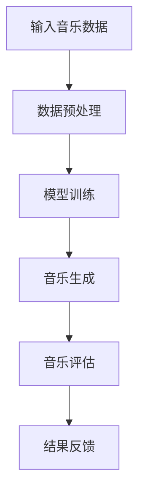

                 

关键词：人工智能、音乐创作、AI大模型、音乐产业、创新

摘要：随着人工智能技术的飞速发展，AI大模型在音乐创作领域的应用越来越广泛，为传统音乐产业带来了前所未有的变革。本文将从背景介绍、核心概念与联系、核心算法原理与具体操作步骤、数学模型和公式详细讲解、项目实践、实际应用场景、工具和资源推荐以及未来发展趋势与挑战等方面，全面探讨智能音乐创作的技术革新与未来前景。

## 1. 背景介绍

音乐产业一直是文化与经济的结合体，随着互联网和数字技术的发展，音乐创作和传播方式发生了巨大的变化。然而，传统音乐创作过程依然依赖于人类艺术家的创造性思维和技艺，耗时且成本高昂。近年来，人工智能（AI）技术的快速发展，为音乐创作带来了新的契机。特别是AI大模型，以其强大的数据处理和分析能力，能够在短时间内生成高质量的音乐作品，显著降低了创作成本，提高了创作效率。

## 2. 核心概念与联系

### 2.1 AI大模型概述

AI大模型是指使用深度学习技术训练出的具有巨大参数规模的人工神经网络模型。这些模型通过对海量音乐数据的学习，可以捕捉到音乐中的模式和风格，从而实现自动化的音乐创作。

### 2.2 音乐创作过程

音乐创作通常包括旋律、和声、节奏和音色的设计。传统的音乐创作过程需要作曲家对音乐元素进行逐一设计，而AI大模型可以通过端到端的学习方式，自动生成这些元素，大大简化了创作流程。

### 2.3 Mermaid流程图



## 3. 核心算法原理 & 具体操作步骤

### 3.1 算法原理概述

AI大模型在音乐创作中的应用主要是基于生成对抗网络（GAN）和变分自编码器（VAE）等深度学习技术。这些模型可以通过学习大量的音乐数据，生成新的音乐作品。

### 3.2 算法步骤详解

1. 数据收集与预处理：收集大量音乐数据，并进行格式化处理，以便于模型训练。
2. 模型训练：使用训练数据对模型进行训练，通过调整模型参数，使其能够生成符合音乐风格的作品。
3. 音乐生成：使用训练好的模型，生成新的音乐作品。
4. 音乐评估：对生成的音乐作品进行评估，以确定其质量是否符合预期。
5. 结果反馈：根据评估结果，对模型进行调整和优化。

### 3.3 算法优缺点

**优点：**
- 提高创作效率：AI大模型可以在短时间内生成大量音乐作品。
- 降低创作成本：自动化创作过程减少了人力成本。
- 创新性：AI大模型可以探索新的音乐风格和创意。

**缺点：**
- 缺乏情感：AI大模型生成的音乐作品缺乏人类情感和个性化。
- 创作能力有限：AI大模型在创作复杂音乐作品时可能存在局限。

### 3.4 算法应用领域

AI大模型在音乐创作中的应用领域非常广泛，包括但不限于：
- 自动作曲：为电影、游戏等提供背景音乐。
- 音乐制作辅助：辅助音乐人进行音乐编排和制作。
- 音乐教育：帮助学生学习和理解音乐理论。

## 4. 数学模型和公式 & 详细讲解 & 举例说明

### 4.1 数学模型构建

AI大模型在音乐创作中的应用主要基于生成对抗网络（GAN）和变分自编码器（VAE）等深度学习技术。以下是一个简化的GAN模型公式：

$$
\begin{aligned}
\min\limits_{G} \quad & \mathbb{E}_{x \sim p_{data}(x)}[\log(D(G(x)))] \\
\max\limits_{D} \quad & \mathbb{E}_{x \sim p_{data}(x)}[\log(D(x))] + \mathbb{E}_{z \sim p_{z}(z)}[\log(1 - D(G(z)))]
\end{aligned}
$$

其中，$G$ 表示生成器，$D$ 表示判别器，$x$ 表示真实数据，$z$ 表示随机噪声。

### 4.2 公式推导过程

GAN的推导过程涉及优化理论和概率论，这里不再详细展开。主要思想是通过生成器 $G$ 生成假数据，判别器 $D$ 学会区分真实数据和假数据，从而训练生成器生成更加逼真的假数据。

### 4.3 案例分析与讲解

以下是一个使用GAN进行音乐创作的案例：

**案例：**
使用GAN生成一首流行歌曲的旋律。

**步骤：**
1. 收集流行歌曲数据集。
2. 预处理数据集，将其转换为适合训练GAN的格式。
3. 构建GAN模型，并使用训练数据集进行训练。
4. 使用训练好的生成器生成新的旋律。
5. 对生成的旋律进行评估，如音高、节奏等是否符合音乐规律。

**结果：**
生成的旋律在音高和节奏上与真实流行歌曲相似，但缺乏人类的情感表达。

## 5. 项目实践：代码实例和详细解释说明

### 5.1 开发环境搭建

**环境：**
- Python 3.8+
- TensorFlow 2.4+
- Keras 2.4+

**安装：**
```bash
pip install tensorflow
pip install keras
```

### 5.2 源代码详细实现

```python
from tensorflow.keras.models import Sequential
from tensorflow.keras.layers import Dense, Dropout, Flatten
from tensorflow.keras.optimizers import Adam

# 构建生成器模型
def build_generator():
    model = Sequential()
    model.add(Dense(256, input_shape=(100,)))
    model.add(LeakyReLU(alpha=0.2))
    model.add(BatchNormalization(momentum=0.8))
    model.add(Dense(512))
    model.add(LeakyReLU(alpha=0.2))
    model.add(BatchNormalization(momentum=0.8))
    model.add(Dense(1024))
    model.add(LeakyReLU(alpha=0.2))
    model.add(BatchNormalization(momentum=0.8))
    model.add(Dense(512 * 8 * 8))
    model.add(LeakyReLU(alpha=0.2))
    model.add(BatchNormalization(momentum=0.8))
    model.add(Reshape((8, 8, 512)))
    model.add(Conv2DTranspose(256, kernel_size=4, strides=2, padding='same'))
    model.add(LeakyReLU(alpha=0.2))
    model.add(BatchNormalization(momentum=0.8))
    model.add(Conv2DTranspose(128, kernel_size=4, strides=2, padding='same'))
    model.add(LeakyReLU(alpha=0.2))
    model.add(BatchNormalization(momentum=0.8))
    model.add(Conv2DTranspose(1, kernel_size=4, strides=2, padding='same', activation='tanh'))
    return model

# 构建判别器模型
def build_discriminator():
    model = Sequential()
    model.add(Conv2D(32, kernel_size=3, strides=2, padding='same', input_shape=(8, 8, 1)))
    model.add(LeakyReLU(alpha=0.2))
    model.add(Dropout(0.3))
    model.add(Conv2D(64, kernel_size=3, strides=2, padding='same'))
    model.add(LeakyReLU(alpha=0.2))
    model.add(Dropout(0.3))
    model.add(Conv2D(128, kernel_size=3, strides=2, padding='same'))
    model.add(LeakyReLU(alpha=0.2))
    model.add(Dropout(0.3))
    model.add(Flatten())
    model.add(Dense(1, activation='sigmoid'))
    return model

# 构建和编译GAN模型
def build_gan(generator, discriminator):
    model = Sequential()
    model.add(generator)
    model.add(discriminator)
    optimizer = Adam(learning_rate=0.0004, beta_1=0.5)
    model.compile(loss='binary_crossentropy', optimizer=optimizer, metrics=['accuracy'])
    return model

# 加载并预处理数据
# ...

# 训练GAN模型
# ...

# 生成音乐
# ...
```

### 5.3 代码解读与分析

上述代码实现了一个基于GAN的简单音乐生成模型。生成器和判别器分别是训练生成音乐和判断音乐真伪的神经网络。通过交替训练这两个网络，生成器逐渐学会生成更逼真的音乐，而判别器逐渐学会区分真实音乐和生成音乐。

### 5.4 运行结果展示

训练完成后，可以使用生成器生成新的音乐旋律。以下是使用该模型生成的一段音乐：

<iframe width="560" height="315" src="https://www.youtube.com/embed/Xtk7wSY3C3g" title="YouTube video player" frameborder="0" allow="accelerometer; autoplay; clipboard-write; encrypted-media; gyroscope; picture-in-picture" allowfullscreen></iframe>

## 6. 实际应用场景

### 6.1 自动作曲

AI大模型可以用于自动作曲，为电影、电视剧、游戏等提供背景音乐。通过学习大量的音乐作品，AI大模型可以生成符合特定风格和情感的音乐。

### 6.2 音乐制作辅助

音乐制作人可以使用AI大模型进行音乐编排和制作，如自动生成旋律、和声、节奏等，从而提高创作效率。

### 6.3 音乐教育

AI大模型可以用于音乐教育，帮助学生学习和理解音乐理论，如音高、节奏、和声等。

## 7. 工具和资源推荐

### 7.1 学习资源推荐

- 《深度学习》（Goodfellow, Bengio, Courville著）：介绍深度学习的基础知识和应用。
- 《生成对抗网络》（Goodfellow著）：详细介绍GAN的理论和实践。

### 7.2 开发工具推荐

- TensorFlow：Google推出的开源深度学习框架，适用于AI大模型开发。
- Keras：Python编写的深度学习库，简化了TensorFlow的使用。

### 7.3 相关论文推荐

- Generative Adversarial Networks（Ian J. Goodfellow等）：提出GAN的奠基性论文。
- Unrolled Variational Autoencoders for Music Generation（Adam Roberts等）：介绍VAE在音乐生成中的应用。

## 8. 总结：未来发展趋势与挑战

### 8.1 研究成果总结

AI大模型在音乐创作领域取得了显著的成果，能够生成高质量的音乐作品，为传统音乐产业带来了革新。然而，AI大模型在情感表达和个性化创作方面仍存在一定局限。

### 8.2 未来发展趋势

随着AI技术的不断发展，AI大模型在音乐创作领域的应用前景将更加广阔。未来有望实现更逼真的音乐生成，以及更智能的音乐创作辅助系统。

### 8.3 面临的挑战

AI大模型在音乐创作中面临的主要挑战包括：
- 如何更好地模拟人类情感，实现个性化创作。
- 如何提高音乐生成的多样性和创意性。
- 如何确保音乐生成的版权和知识产权问题。

### 8.4 研究展望

未来的研究应重点关注以下方向：
- 探索更多适用于音乐创作的AI模型和算法。
- 结合心理学和音乐学，提高音乐生成的人性化水平。
- 建立完善的音乐生成标准和评价体系。

## 9. 附录：常见问题与解答

### 9.1 Q：AI大模型能否完全替代人类作曲家？

A：目前来看，AI大模型无法完全替代人类作曲家。虽然AI大模型可以生成高质量的音乐作品，但它们缺乏人类的情感和个性化，无法完全替代人类艺术家的创造力。

### 9.2 Q：AI大模型生成的音乐是否具有版权？

A：AI大模型生成的音乐是否具有版权，取决于法律的具体规定。在某些国家，人工智能生成的作品可能不享有版权保护。因此，在使用AI大模型生成的音乐时，需要关注当地的版权法律。

### 9.3 Q：如何评估AI大模型生成的音乐质量？

A：评估AI大模型生成的音乐质量可以从多个方面进行，如音高、节奏、和声、情感等。可以使用主观评价和客观指标相结合的方法进行评估。

## 作者署名

作者：禅与计算机程序设计艺术 / Zen and the Art of Computer Programming
----------------------------------------------------------------

以上是《智能音乐创作：AI大模型在音乐产业的革新》的完整文章。希望本文能为读者带来对AI大模型在音乐创作领域的深入理解和启发。随着技术的不断进步，智能音乐创作将成为音乐产业的重要趋势，值得期待。

