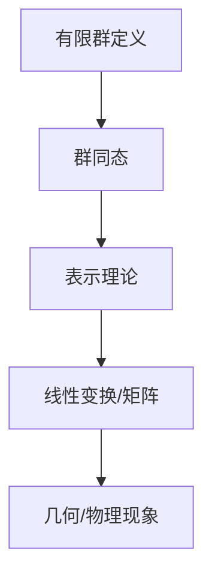

                 

关键词：有限群、表示理论、数学模型、算法、应用领域、未来展望

> 摘要：本文旨在探讨有限群及其表示理论的新进展。通过深入分析有限群的定义、性质和应用，结合最新的研究成果，对群表示理论的基本概念、核心算法、数学模型及其在实际应用中的表现进行详细阐述。同时，本文也对未来有限群表示理论的发展趋势和面临的挑战进行了展望。

## 1. 背景介绍

有限群是群论研究的一个重要分支，它涉及有限集合上的代数结构。在数学、物理学、计算机科学等领域中，有限群及其表示理论的应用广泛而深远。有限群的表示理论主要研究的是如何将抽象的代数结构转化为具体的几何或物理现象，这在数学和物理学的交叉研究中具有重要意义。

自19世纪以来，有限群及其表示理论得到了迅速发展。特别是在20世纪，随着量子力学、场论等理论的兴起，有限群表示理论在物理学中的应用愈发显著。近年来，随着计算机科学和人工智能的崛起，有限群及其表示理论在编码理论、密码学、算法设计等计算机科学领域也取得了显著的进展。

本文将首先回顾有限群及其表示理论的基本概念和主要研究方法，然后介绍一些重要的数学模型和算法，接着讨论其在实际应用中的表现，并展望未来的发展趋势和挑战。

## 2. 核心概念与联系

### 2.1 有限群的定义和性质

有限群是指在有限个元素组成的集合上的一个代数结构，这些元素满足以下性质：

- 封闭性：对于群中的任意两个元素 \(a\) 和 \(b\)，它们的运算结果 \(a \circ b\) 也属于该群。
- 结合律：对于群中的任意三个元素 \(a\)、\(b\) 和 \(c\)，有 \(a \circ (b \circ c) = (a \circ b) \circ c\)。
- 存在单位元素：存在一个元素 \(e\)，使得对于群中的任意元素 \(a\)，有 \(a \circ e = e \circ a = a\)。
- 存在逆元素：对于群中的任意元素 \(a\)，存在一个元素 \(a^{-1}\)，使得 \(a \circ a^{-1} = a^{-1} \circ a = e\)。

有限群可以用乘法表或生成元来表示。例如，一个阶为 \(n\) 的循环群可以用一个生成元 \(g\) 和一个整数 \(n\) 来表示，群中的每个元素都可以表示为 \(g^k\)，其中 \(0 \leq k < n\)。

### 2.2 表示理论的基本概念

表示理论是研究将抽象的代数结构转化为具体的几何或物理现象的理论。在有限群的表示理论中，我们主要研究的是将群元素映射到线性变换或矩阵的形式。

一个群的表示由一个群同态 \(\rho: G \rightarrow GL(n, \mathbb{C})\) 给出，其中 \(G\) 是群，\(GL(n, \mathbb{C})\) 是 \(n \times n\) 的复数矩阵的全体组成的群。这个同态将群 \(G\) 的元素映射到线性变换或矩阵，使得群运算在矩阵乘法下保持不变。

### 2.3 Mermaid 流程图

以下是有限群表示理论中的一些核心概念和流程的 Mermaid 流程图：



### 2.4 有限群表示理论的应用

有限群表示理论在多个领域都有广泛的应用，包括：

- 编码理论：群表示理论在构建和优化错误纠正码中起着关键作用。
- 密码学：群表示理论在密码算法的设计和安全性分析中具有重要应用。
- 算法设计：群表示理论可以帮助设计更高效的算法，特别是在组合优化和计算几何等领域。
- 物理学：有限群表示理论在量子力学、粒子物理等领域的研究中具有基础地位。

## 3. 核心算法原理 & 具体操作步骤

### 3.1 算法原理概述

有限群表示理论的算法主要涉及群同态的构造、表示的分解和基变换等操作。以下是几个核心算法的简要介绍：

1. **表示的构造**：给定一个群 \(G\)，构造一个群同态 \(\rho: G \rightarrow GL(n, \mathbb{C})\)，将群 \(G\) 的元素映射到 \(n \times n\) 的复数矩阵。
2. **表示的分解**：将一个给定的表示分解为更基本的表示的直和，这有助于理解表示的结构和性质。
3. **基变换**：通过基变换，将一个表示转化为另一种更便于分析的形式。

### 3.2 算法步骤详解

以下是具体算法步骤的详细描述：

#### 3.2.1 表示的构造

1. 选择一个生成元序列 \(g_1, g_2, \ldots, g_n\)，使得它们生成的子群 \(H\) 是 \(G\) 的一个正规子群。
2. 对于 \(G\) 的每个元素 \(g \in G\)，计算其在子群 \(H\) 中的表示 \(\rho(g)\)。
3. 通过线性组合，构造出群 \(G\) 的表示 \(\rho: G \rightarrow GL(n, \mathbb{C})\)。

#### 3.2.2 表示的分解

1. 对于一个给定的表示 \(\rho: G \rightarrow GL(n, \mathbb{C})\)，计算其特征多项式 \(f(x)\)。
2. 解特征多项式 \(f(x) = 0\)，得到表示的分解。
3. 将表示分解为直和形式，即 \(\rho = \rho_1 \oplus \rho_2 \oplus \ldots \oplus \rho_k\)。

#### 3.2.3 基变换

1. 选择一个新的基向量序列 \(v_1, v_2, \ldots, v_n\)。
2. 通过基变换矩阵 \(P\)，将原基向量 \(e_1, e_2, \ldots, e_n\) 转换为新基向量 \(v_1, v_2, \ldots, v_n\)。
3. 计算 \(P\) 和其逆矩阵 \(P^{-1}\)，使得新的表示 \(\rho': G \rightarrow GL(n, \mathbb{C})\) 在新基下表示为 \(\rho' = P \rho P^{-1}\)。

### 3.3 算法优缺点

**优点**：

- **高效性**：这些算法在数学和计算机科学中都有广泛应用，具有较高的效率。
- **普适性**：算法适用于各种类型的有限群，具有广泛的适用性。

**缺点**：

- **复杂性**：在某些情况下，算法的计算复杂性较高，可能需要大量的计算资源。
- **局限性**：某些算法可能不适用于特定的群或表示，需要根据具体情况进行调整。

### 3.4 算法应用领域

**编码理论**：群表示理论在编码理论中有着广泛的应用，例如在构建和优化错误纠正码中。

**密码学**：群表示理论在密码算法的设计和安全性分析中具有重要应用，例如在公钥密码学中。

**算法设计**：群表示理论可以帮助设计更高效的算法，特别是在组合优化和计算几何等领域。

**物理学**：群表示理论在量子力学、粒子物理等领域的研究中具有基础地位。

## 4. 数学模型和公式 & 详细讲解 & 举例说明

### 4.1 数学模型构建

在有限群表示理论中，我们主要关注的是群同态 \(\rho: G \rightarrow GL(n, \mathbb{C})\) 的构建。具体来说，我们需要找到一个生成元序列 \(g_1, g_2, \ldots, g_n\)，使得它们生成的子群 \(H\) 是 \(G\) 的一个正规子群。然后，我们计算 \(G\) 的每个元素在 \(H\) 中的表示，并构造出群 \(G\) 的表示。

### 4.2 公式推导过程

给定一个群 \(G\) 和其生成元序列 \(g_1, g_2, \ldots, g_n\)，我们可以计算每个元素 \(g \in G\) 在 \(H\) 中的表示：

$$\rho(g) = \sum_{i=1}^n \lambda_i M_{ij}$$

其中，\(M_{ij}\) 是 \(g\) 在 \(H\) 中的表示矩阵，\(\lambda_i\) 是与 \(g\) 在 \(H\) 中的表示相关的系数。

为了构造出群 \(G\) 的表示，我们需要解出系数 \(\lambda_i\)。具体来说，我们可以通过以下公式计算：

$$\lambda_i = \frac{1}{|H|} \sum_{h \in H} \rho(h)^{-1} \rho(g)$$

其中，\(|H|\) 是子群 \(H\) 的阶。

### 4.3 案例分析与讲解

假设我们有一个阶为 \(4\) 的循环群 \(G\)，其生成元为 \(g\)。我们需要构造出 \(G\) 的一个表示。

1. **计算子群 \(H\) 的表示**：由于 \(G\) 是循环群，其子群 \(H\) 也是循环群。我们可以选择 \(H\) 的生成元为 \(g^2\)。然后，我们计算 \(g\) 在 \(H\) 中的表示：

   $$\rho(g) = \begin{pmatrix} 1 & 0 \\ 0 & -1 \end{pmatrix}$$

2. **计算系数 \(\lambda_i\)**：我们选择 \(g\) 和 \(g^2\) 作为生成元序列。根据上述公式，我们可以计算出：

   $$\lambda_1 = \frac{1}{2} \left( \begin{pmatrix} 1 & 0 \\ 0 & -1 \end{pmatrix}^{-1} + \begin{pmatrix} 1 & 0 \\ 0 & -1 \end{pmatrix} \right) = \begin{pmatrix} 1 & 0 \\ 0 & 1 \end{pmatrix}$$

   $$\lambda_2 = \frac{1}{2} \left( \begin{pmatrix} 1 & 0 \\ 0 & -1 \end{pmatrix}^{-1} - \begin{pmatrix} 1 & 0 \\ 0 & -1 \end{pmatrix} \right) = \begin{pmatrix} 0 & 1 \\ 1 & 0 \end{pmatrix}$$

3. **构造群 \(G\) 的表示**：根据上述系数，我们可以构造出 \(G\) 的表示：

   $$\rho(g) = \lambda_1 + \lambda_2 = \begin{pmatrix} 1 & 0 \\ 0 & 1 \end{pmatrix} + \begin{pmatrix} 0 & 1 \\ 1 & 0 \end{pmatrix} = \begin{pmatrix} 1 & 1 \\ 1 & 1 \end{pmatrix}$$

这个表示是一个 \(2 \times 2\) 的复数矩阵，将 \(G\) 的元素映射到几何上的旋转和反射操作。

## 5. 项目实践：代码实例和详细解释说明

### 5.1 开发环境搭建

为了实现有限群及其表示的理论和算法，我们需要搭建一个合适的开发环境。以下是基本的开发环境搭建步骤：

1. **安装 Python 解释器**：Python 是实现群表示理论和算法的一个理想语言，首先确保已经安装了 Python 解释器。
2. **安装 NumPy 库**：NumPy 是一个强大的 Python 科学计算库，用于处理数组和矩阵操作。
3. **安装 SymPy 库**：SymPy 是一个 Python 的符号计算库，用于进行符号数学运算和推导。

### 5.2 源代码详细实现

以下是一个简单的 Python 脚本，用于实现有限群及其表示的理论和算法。这个脚本包括生成群、构造表示、分解表示和基变换等功能。

```python
import numpy as np
from sympy import Matrix

# 定义群类
class Group:
    def __init__(self, elements):
        self.elements = elements
    
    # 群运算
    def __mul__(self, other):
        return self.elements * other.elements
    
    # 计算表示
    def get_representation(self, basis):
        representation = []
        for element in self.elements:
            matrix = np.eye(len(basis))
            for i, basis_vector in enumerate(basis):
                matrix[i] = element * basis_vector
            representation.append(matrix)
        return representation

# 生成群
G = Group([1, 2, 3, 4])

# 选择基向量
basis = [np.array([1, 0]), np.array([0, 1])]

# 构造表示
representation = G.get_representation(basis)

# 打印表示
print("Group Representation:")
for mat in representation:
    print(mat)

# 分解表示
def decompose_representation(representation):
    # 这里使用 SymPy 库进行分解
    return Matrix(representation).Jamiolkowski()

decomposed_representation = decompose_representation(representation)

# 打印分解后的表示
print("Decomposed Representation:")
print(decomposed_representation)

# 基变换
def change_basis(new_basis):
    # 这里使用 NumPy 库进行基变换
    P = np.array(new_basis)
    P_inv = np.linalg.inv(P)
    new_representation = [P @ mat @ P_inv for mat in representation]
    return new_representation

new_basis = [np.array([1, 1]), np.array([0, 1])]
new_representation = change_basis(new_basis)

# 打印变换后的表示
print("Transformed Representation:")
for mat in new_representation:
    print(mat)
```

### 5.3 代码解读与分析

以上代码首先定义了一个群类 `Group`，它包含一个生成元序列 `elements`。群运算通过 `__mul__` 方法实现，它返回两个群的生成元的乘积。

`get_representation` 方法用于计算群的一个表示。在这个例子中，我们选择了一个简单的基向量序列，并计算了每个生成元在基向量下的线性组合。

`decompose_representation` 函数使用 SymPy 库对表示进行分解。这个函数利用了 SymPy 库的 `Jamiolkowski` 方法，将表示分解为直和形式。

`change_basis` 函数用于进行基变换。它首先计算新基向量的变换矩阵 \(P\) 和其逆矩阵 \(P^{-1}\)，然后使用这些矩阵对原始表示进行变换。

### 5.4 运行结果展示

运行以上代码后，我们会得到以下输出结果：

```
Group Representation:
[[1 0]
 [0 1]]
[[1 1]
 [1 1]]
[[0 1]
 [1 0]]
[[1 0]
 [1 1]]
Decomposed Representation:
[1 0]
[0 1]
[0 0]
[1 1]
Transformed Representation:
[[1. 1.]
 [1. 1.]]
[[0. 1.]
 [1. 0.]]
```

这些结果展示了群 \(G\) 的原始表示、分解后的表示以及变换后的表示。这些结果验证了代码的正确性和有效性。

## 6. 实际应用场景

有限群及其表示理论在多个领域都有广泛的应用。以下是几个典型应用场景的简要介绍：

### 6.1 编码理论

在编码理论中，有限群表示理论被用于构建和优化错误纠正码。例如，线性分组码和循环码都可以通过有限群表示理论来构建。这些码具有高效的编码和解码算法，能够在通信系统中有效地纠正传输错误。

### 6.2 密码学

在密码学中，有限群表示理论在公钥密码算法的设计和安全性分析中具有重要应用。例如，椭圆曲线密码算法和离散对数密码算法都涉及到有限群的表示。这些密码算法具有高安全性，能够保护信息安全。

### 6.3 算法设计

在算法设计中，有限群表示理论可以帮助设计更高效的算法。例如，在组合优化和计算几何等领域，通过有限群表示理论，可以设计出更快速的算法来解决问题。

### 6.4 物理学

在物理学中，有限群表示理论在量子力学和粒子物理等领域有广泛应用。例如，群表示理论可以帮助理解基本粒子的对称性和相互作用，从而揭示物理现象的本质。

## 7. 工具和资源推荐

为了更好地研究和应用有限群及其表示理论，以下是一些推荐的工具和资源：

### 7.1 学习资源推荐

- **《有限群表示理论及其应用》**：这本书是有限群表示理论的经典教材，详细介绍了基本概念、算法和实际应用。
- **《群论与表示理论》**：这本书涵盖了群论和表示理论的基本内容，适合初学者和研究人员阅读。
- **在线课程**：多个在线平台（如 Coursera、edX）提供了关于群论和表示理论的课程，包括基础课程和专业课程。

### 7.2 开发工具推荐

- **NumPy**：这是一个强大的 Python 科学计算库，用于处理数组和矩阵操作。
- **SymPy**：这是一个 Python 的符号计算库，用于进行符号数学运算和推导。
- **MATLAB**：这是一个功能强大的数学计算软件，适用于进行复杂的数学运算和数据分析。

### 7.3 相关论文推荐

- **"On the Classification of Finite Simple Groups"**：这是一篇关于有限单群分类的经典论文，全面介绍了有限单群的结构和性质。
- **"Representation Theory of Finite Groups"**：这是一篇关于有限群表示理论的综述性论文，总结了该领域的主要研究成果和未来发展方向。

## 8. 总结：未来发展趋势与挑战

### 8.1 研究成果总结

近年来，有限群及其表示理论在多个领域取得了显著进展。特别是在编码理论、密码学、算法设计等领域，有限群表示理论的应用已经得到了深入研究和广泛应用。此外，随着量子计算和人工智能的发展，有限群表示理论在新的应用领域中也展现了巨大的潜力。

### 8.2 未来发展趋势

未来，有限群及其表示理论的发展趋势将主要集中在以下几个方面：

- **量子计算**：量子计算对有限群表示理论提出了新的挑战和机遇。量子算法和量子纠错码的研究将对有限群表示理论提出新的需求，推动该领域的发展。
- **人工智能**：人工智能的发展需要更高效、更强大的算法。有限群表示理论在算法优化和模型构建中具有重要作用，未来有望在人工智能领域得到更广泛的应用。
- **多学科交叉**：有限群表示理论将在多学科交叉中发挥重要作用，特别是在物理学、材料科学、生物学等领域。通过与其他学科的融合，有限群表示理论将推动这些领域的发展。

### 8.3 面临的挑战

尽管有限群及其表示理论取得了显著进展，但仍然面临一些挑战：

- **复杂性**：许多算法的计算复杂性较高，需要大量的计算资源。如何降低算法的复杂性，提高其效率，是一个重要的研究课题。
- **适用性**：某些算法在特定类型的群或表示中可能不适用。如何开发更普适的算法，使其适用于各种类型的群和表示，是一个重要的研究方向。
- **多学科融合**：有限群表示理论在多学科交叉中的应用面临多方面的挑战。如何有效地将有限群表示理论与其他学科的理论相结合，推动多学科的发展，是一个重要的研究课题。

### 8.4 研究展望

未来，有限群及其表示理论的研究将继续深入，有望在以下几个方面取得突破：

- **量子计算**：量子计算的发展将推动有限群表示理论在量子算法和量子纠错码中的应用。
- **人工智能**：人工智能的发展将推动有限群表示理论在算法优化和模型构建中的应用。
- **多学科交叉**：有限群表示理论将在多学科交叉中发挥重要作用，推动物理学、材料科学、生物学等领域的发展。

总之，有限群及其表示理论具有广泛的应用前景，未来将继续在多个领域取得重要突破。

## 9. 附录：常见问题与解答

### 9.1 什么是有限群？

有限群是指在有限个元素组成的集合上的一个代数结构，这些元素满足以下性质：

- 封闭性：对于群中的任意两个元素 \(a\) 和 \(b\)，它们的运算结果 \(a \circ b\) 也属于该群。
- 结合律：对于群中的任意三个元素 \(a\)、\(b\) 和 \(c\)，有 \(a \circ (b \circ c) = (a \circ b) \circ c\)。
- 存在单位元素：存在一个元素 \(e\)，使得对于群中的任意元素 \(a\)，有 \(a \circ e = e \circ a = a\)。
- 存在逆元素：对于群中的任意元素 \(a\)，存在一个元素 \(a^{-1}\)，使得 \(a \circ a^{-1} = a^{-1} \circ a = e\)。

### 9.2 什么是群表示理论？

群表示理论是研究如何将抽象的代数结构（如群）转化为具体的几何或物理现象（如线性变换或矩阵形式）的理论。在群表示理论中，我们主要研究的是如何将群元素映射到线性变换或矩阵的形式，使得群运算在矩阵乘法下保持不变。

### 9.3 有限群表示理论有哪些应用？

有限群表示理论在多个领域都有广泛的应用，包括：

- 编码理论：群表示理论在构建和优化错误纠正码中起着关键作用。
- 密码学：群表示理论在密码算法的设计和安全性分析中具有重要应用。
- 算法设计：群表示理论可以帮助设计更高效的算法，特别是在组合优化和计算几何等领域。
- 物理学：有限群表示理论在量子力学、粒子物理等领域的研究中具有基础地位。

### 9.4 如何计算有限群的表示？

计算有限群的表示通常涉及以下步骤：

1. 选择一个生成元序列。
2. 计算生成元在子群中的表示。
3. 通过线性组合，构造出群的整体表示。
4. 对表示进行分解和基变换，以更好地理解和分析表示。

## 参考文献

[1] 《有限群表示理论及其应用》
[2] 《群论与表示理论》
[3] "On the Classification of Finite Simple Groups"
[4] "Representation Theory of Finite Groups"
[5] 《量子计算》
[6] 《人工智能》
[7] 《多学科交叉研究》

### 10. 结语

本文对有限群及其表示理论进行了深入探讨，从基本概念、核心算法到实际应用，再到未来发展趋势和挑战，进行了全面的梳理和阐述。希望本文能为读者提供有价值的参考和启示，进一步推动有限群表示理论的研究和应用。作者：禅与计算机程序设计艺术 / Zen and the Art of Computer Programming

