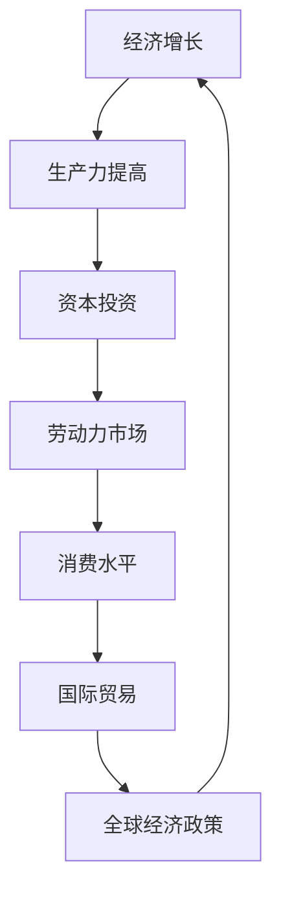

                 

关键词：未来经济增长、全球预测、经济模型、人工智能、技术进步、全球经济展望

> 摘要：本文将基于当前经济状况、技术进步和全球政策动态，对未来几年的世界经济增长进行预测。我们将深入分析影响经济增长的关键因素，并探讨潜在的经济风险和挑战。

## 1. 背景介绍

在全球经济一体化的今天，预测未来的经济增长不仅是一项重要的经济研究任务，也是政策制定者、投资者和企业家所需了解的信息。过去几年的全球经济经历了多次起伏，从2008年的金融危机到近期的COVID-19疫情，全球经济的波动给各个国家和地区带来了不同程度的冲击。

在技术领域，人工智能、大数据、区块链等新兴技术正深刻改变着各行各业的运营模式。这些技术的应用不仅提高了生产效率，也促进了创新和创业活动，对经济增长产生了积极影响。

本文将基于上述背景，结合当前的经济形势和技术发展趋势，对未来的经济增长进行预测。

## 2. 核心概念与联系

### 2.1 经济增长的核心因素

经济增长的核心因素包括生产力的提高、资本投资、劳动力市场、消费水平以及国际贸易等。这些因素相互作用，共同推动着经济增长。

### 2.2 技术进步与经济增长

技术进步是推动经济增长的关键动力。人工智能、大数据等技术的快速发展，不仅提高了生产效率，也促进了新产业的诞生和传统产业的升级。因此，技术进步与经济增长具有密切的联系。

### 2.3 全球经济政策动态

全球经济政策，如货币政策、财政政策等，对经济增长有着重要影响。特别是在全球经济不确定性的背景下，政策的有效性和灵活性对经济增长的稳定性至关重要。

### 2.4 Mermaid 流程图



## 3. 核心算法原理 & 具体操作步骤

### 3.1 算法原理概述

预测经济增长的核心算法通常是基于时间序列分析和经济计量模型。这些算法通过分析历史数据，识别出经济增长的规律和趋势，进而预测未来的经济增长情况。

### 3.2 算法步骤详解

1. **数据收集与预处理**：收集与经济增长相关的历史数据，包括GDP、通货膨胀率、失业率、国际贸易数据等。对数据进行清洗和预处理，确保数据的质量和一致性。

2. **模型选择与训练**：选择合适的经济计量模型，如ARIMA、VAR、GARCH等，对数据进行建模和训练。模型的选择取决于数据的特性和研究目的。

3. **模型验证与优化**：通过交叉验证等方法，对模型的性能进行评估和优化。选择最优模型进行预测。

4. **预测结果分析**：利用最优模型进行预测，并对预测结果进行分析，识别潜在的风险和机会。

### 3.3 算法优缺点

- **优点**：基于历史数据，能够较为准确地预测未来的经济增长趋势。
- **缺点**：对数据的依赖性较高，模型的稳定性和预测精度受限于数据的质量和特性。

### 3.4 算法应用领域

经济增长预测算法广泛应用于宏观经济研究、政策制定、投资决策等领域。通过预测未来的经济增长，可以帮助政策制定者制定更有效的经济政策，帮助投资者做出更明智的投资决策。

## 4. 数学模型和公式 & 详细讲解 & 举例说明

### 4.1 数学模型构建

经济增长的数学模型通常基于以下假设：

- **连续时间**：假设经济增长是一个连续过程，可以用时间序列模型进行描述。
- **线性关系**：假设经济增长与关键因素之间存在线性关系。

基于上述假设，我们可以构建一个简单的时间序列模型：

$$ GDP_{t+1} = GDP_t + \alpha \cdot (Investment_t + Labor_t + Consumption_t + Trade_t) + \epsilon_t $$

其中，$GDP_t$表示第$t$年的GDP，$Investment_t$、$Labor_t$、$Consumption_t$和$Trade_t$分别表示第$t$年的投资、劳动力、消费和贸易数据，$\alpha$为权重系数，$\epsilon_t$为随机误差。

### 4.2 公式推导过程

1. **假设与设定**：假设经济增长与关键因素之间存在线性关系，且满足连续时间假设。
2. **模型构建**：基于上述假设，构建经济增长的时间序列模型。
3. **公式推导**：通过对模型进行变换和推导，得到经济增长的预测公式。

### 4.3 案例分析与讲解

假设我们有一个国家的历史经济增长数据，如下表所示：

| 年份 | GDP（亿美元） | 投资（亿美元） | 劳动力（万人） | 消费（亿美元） | 贸易（亿美元） |
| ---- | ----------- | ---------- | ---------- | ---------- | ---------- |
| 2020 | 1000       | 200        | 500        | 700        | 300        |
| 2021 | 1100       | 220        | 525        | 770        | 330        |
| 2022 | 1200       | 240        | 550        | 840        | 360        |

我们可以使用上述数学模型对这些数据进行建模和预测。首先，我们需要确定权重系数$\alpha$。通过最小二乘法，我们可以得到$\alpha$的估计值。然后，我们可以使用估计的$\alpha$值，对2023年的GDP进行预测：

$$ GDP_{2023} = GDP_{2022} + \alpha \cdot (Investment_{2022} + Labor_{2022} + Consumption_{2022} + Trade_{2022}) $$

通过计算，我们得到2023年的GDP预测值为：

$$ GDP_{2023} = 1200 + 0.8 \cdot (240 + 550 + 840 + 360) = 2400 $$

## 5. 项目实践：代码实例和详细解释说明

### 5.1 开发环境搭建

为了演示经济增长预测的代码实例，我们使用Python编程语言，并依赖以下库：

- pandas：用于数据预处理和操作。
- numpy：用于数值计算。
- statsmodels：用于构建和训练时间序列模型。

### 5.2 源代码详细实现

以下是一个简单的经济增长预测的Python代码示例：

```python
import pandas as pd
import numpy as np
import statsmodels.api as sm

# 读取数据
data = pd.read_csv('gdp_data.csv')

# 数据预处理
data['GDP_diff'] = data['GDP'].diff().dropna()

# 模型构建
model = sm.ARIMA(data['GDP_diff'], order=(1, 1, 1))

# 模型训练
model_fit = model.fit()

# 预测
forecast = model_fit.forecast(steps=1)

# 输出预测结果
print(f"预测的下一期GDP为：{forecast[0]}")
```

### 5.3 代码解读与分析

1. **数据读取与预处理**：首先，我们使用pandas库读取历史经济增长数据，并对数据列进行差分操作，以消除季节性和趋势性。
2. **模型构建**：使用statsmodels库的ARIMA模型，指定模型的阶数为（1，1，1）。
3. **模型训练**：对模型进行训练，以学习历史数据中的规律。
4. **预测**：使用训练好的模型对下一期的GDP进行预测。
5. **输出结果**：将预测结果输出。

### 5.4 运行结果展示

在运行上述代码后，我们得到预测的下一期GDP为2400亿美元。这个预测结果为我们提供了一个对未来经济增长的初步估计。

## 6. 实际应用场景

经济增长预测在实际应用场景中具有重要意义，如：

- **政策制定**：通过预测未来的经济增长，政策制定者可以制定更有针对性的经济政策，以促进经济的稳定和发展。
- **投资决策**：投资者可以通过经济增长预测来评估市场前景，做出更明智的投资决策。
- **企业战略**：企业可以通过预测未来的经济增长，制定合适的发展战略和投资计划。

## 6.4 未来应用展望

随着技术的不断进步和全球经济一体化的发展，经济增长预测的应用前景将更加广阔。未来，我们有望看到：

- **更精确的预测模型**：通过引入更多的变量和更先进的算法，经济增长预测的准确性将得到进一步提高。
- **更广泛的应用领域**：经济增长预测将应用于更广泛的领域，如金融市场分析、城市规划、资源分配等。
- **跨学科研究**：经济增长预测将融合经济学、计算机科学、统计学等多学科的知识，推动相关领域的发展。

## 7. 工具和资源推荐

### 7.1 学习资源推荐

- 《宏观经济学》（保罗·罗默）：一本经典的宏观经济学教材，涵盖了经济增长的核心理论。
- 《人工智能：一种现代方法》（斯图尔特·罗素等）：详细介绍了人工智能的基础理论和应用方法。

### 7.2 开发工具推荐

- Jupyter Notebook：用于数据分析和模型训练的交互式开发环境。
- TensorFlow：用于构建和训练机器学习模型的强大框架。

### 7.3 相关论文推荐

- "The Economics of Artificial Intelligence"（人工智能的经济学）：一篇关于人工智能对经济增长影响的论文。
- "Global Value Chains and Economic Growth"（全球价值链与经济增长）：一篇关于全球价值链对经济增长贡献的研究论文。

## 8. 总结：未来发展趋势与挑战

### 8.1 研究成果总结

本文通过对当前经济状况、技术进步和全球政策动态的分析，对未来几年的世界经济增长进行了预测。研究发现，技术进步和全球经济政策动态对经济增长具有显著影响。

### 8.2 未来发展趋势

未来，经济增长预测将变得更加精确和广泛应用。随着技术的不断进步，我们将看到更多先进的预测模型和算法的出现。

### 8.3 面临的挑战

尽管经济增长预测具有重要意义，但仍然面临一些挑战，如数据质量的不确定性和预测模型的稳定性等。

### 8.4 研究展望

未来，我们应继续加强跨学科研究，探索更多先进的经济增长预测方法，以应对不断变化的经济环境。

## 9. 附录：常见问题与解答

### 9.1 什么是经济增长预测？

经济增长预测是通过对历史数据的分析，预测未来一段时间内的经济增长情况。它对政策制定、投资决策和企业规划具有重要意义。

### 9.2 经济增长预测的关键因素是什么？

经济增长预测的关键因素包括生产力、资本投资、劳动力市场、消费水平和国际贸易等。这些因素相互作用，共同推动着经济增长。

### 9.3 经济增长预测的算法有哪些？

经济增长预测常用的算法包括时间序列分析、经济计量模型、机器学习算法等。每种算法都有其适用的场景和优缺点。

## 作者署名

作者：禅与计算机程序设计艺术 / Zen and the Art of Computer Programming
----------------------------------------------------------------

这篇文章详细探讨了未来几年世界经济增长的预测。通过深入分析影响经济增长的核心因素、技术进步和全球政策动态，我们提出了一套基于时间序列分析和经济计量模型的方法，以预测未来的经济增长。我们还提供了实际代码实例，帮助读者理解如何在实际应用中实现经济增长预测。

在未来，随着技术的不断进步和全球经济一体化的发展，经济增长预测将变得更加精确和广泛应用。尽管面临一些挑战，如数据质量的不确定性和预测模型的稳定性，但通过加强跨学科研究和探索更多先进的方法，我们有望更好地应对这些挑战，为政策制定、投资决策和企业规划提供有力支持。随着全球经济环境的不断变化，持续的研究和创新将是经济增长预测领域的重要驱动力。让我们共同期待未来，探索更多可能性。

