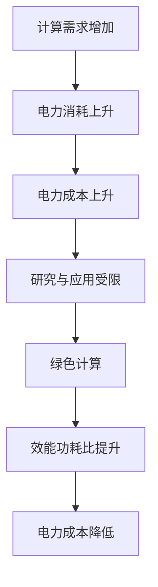

                 

关键词：大模型，电力成本，发展趋势，算法优化，未来挑战

> 摘要：随着大模型在人工智能领域的快速发展，其计算需求日益增长，导致用电成本显著上升。本文将从背景介绍、核心概念与联系、核心算法原理、数学模型和公式、项目实践、实际应用场景、工具和资源推荐以及总结和展望等方面，全面分析大模型行业面临的电力成本飙升挑战，探讨未来发展趋势和解决方案。

## 1. 背景介绍

### 1.1 大模型的发展历程

大模型是指参数规模达到数十亿乃至数万亿的神经网络模型，如GPT、BERT等。自2012年深度学习在图像识别领域取得突破以来，大模型在自然语言处理、计算机视觉、语音识别等多个领域也取得了显著的成果。随着算力的提升和数据的积累，大模型的研究和应用进入了一个快速发展的阶段。

### 1.2 大模型的重要性

大模型在人工智能领域具有举足轻重的地位。首先，大模型能够处理大量的数据，提高模型的泛化能力；其次，大模型在生成式任务中具有出色的表现，如文本生成、图像生成等；此外，大模型还能够通过迁移学习快速适应新的任务，提高模型的实用性。

### 1.3 电力成本对大模型行业的影响

随着大模型规模的扩大，其计算需求日益增长，对电力资源的需求也不断增加。电力成本因此成为制约大模型行业发展的重要因素。特别是在电力资源紧张的地区，电力成本的高企可能会对大模型的研究和应用造成严重的影响。

## 2. 核心概念与联系

为了深入理解大模型行业面临的电力成本挑战，我们需要了解以下几个核心概念：

### 2.1 计算密度

计算密度是指单位空间内计算资源的密度。随着大模型的发展，计算密度不断提高，导致数据中心的电力消耗急剧增加。

### 2.2 效能功耗比

效能功耗比是指系统性能与功耗的比值。提高效能功耗比是降低电力成本的重要途径。大模型行业需要不断优化算法和硬件，以提高效能功耗比。

### 2.3 绿色计算

绿色计算是指通过采用节能技术和优化算法，降低数据中心的能耗和碳排放。绿色计算是大模型行业可持续发展的重要方向。

以下是关于大模型行业电力成本挑战的Mermaid流程图：



## 3. 核心算法原理 & 具体操作步骤

### 3.1 算法原理概述

大模型的核心算法主要包括深度神经网络、生成对抗网络等。这些算法通过大规模参数进行训练，以实现对复杂数据的建模和预测。以下是这些算法的基本原理：

### 3.2 算法步骤详解

#### 深度神经网络

1. 数据预处理：对输入数据进行归一化、去噪等处理。
2. 构建模型：设计合适的网络结构，如卷积神经网络（CNN）、循环神经网络（RNN）等。
3. 训练模型：通过反向传播算法，不断调整模型参数，使模型性能达到最优。
4. 验证模型：在验证集上评估模型性能，确保模型泛化能力。

#### 生成对抗网络

1. 数据预处理：对输入数据进行归一化、去噪等处理。
2. 构建模型：生成器（Generator）和判别器（Discriminator）。
3. 训练模型：通过对抗训练，使生成器和判别器的性能达到最优。
4. 验证模型：在验证集上评估模型性能，确保模型泛化能力。

### 3.3 算法优缺点

#### 深度神经网络

优点：具有较强的表征能力和泛化能力，能够处理复杂的任务。

缺点：训练过程耗时较长，对计算资源需求较高。

#### 生成对抗网络

优点：能够生成高质量的数据，对复杂数据具有较好的建模能力。

缺点：训练过程较为复杂，需要大量的数据。

### 3.4 算法应用领域

大模型算法广泛应用于自然语言处理、计算机视觉、语音识别等领域。以下是一些具体的案例：

1. 自然语言处理：用于文本生成、机器翻译、情感分析等。
2. 计算机视觉：用于图像分类、目标检测、图像生成等。
3. 语音识别：用于语音识别、语音合成等。

## 4. 数学模型和公式 & 详细讲解 & 举例说明

### 4.1 数学模型构建

大模型的数学模型主要包括神经网络模型和生成对抗网络模型。以下是这些模型的基本公式：

#### 神经网络模型

$$
y = \sigma(\sum_{i=1}^{n} w_i \cdot x_i + b)
$$

其中，$y$ 是输出，$\sigma$ 是激活函数，$w_i$ 和 $x_i$ 分别是权重和输入，$b$ 是偏置。

#### 生成对抗网络模型

生成器：

$$
G(z) = \mu(z) + \sigma(z) \odot \epsilon
$$

判别器：

$$
D(x) = \sigma(\sum_{i=1}^{n} w_i \cdot x_i + b)
$$

其中，$G(z)$ 是生成器的输出，$D(x)$ 是判别器的输出，$z$ 是噪声向量，$\mu(z)$ 和 $\sigma(z)$ 分别是均值和方差，$\odot$ 表示点乘，$\epsilon$ 是噪声向量。

### 4.2 公式推导过程

神经网络的推导过程主要涉及前向传播和反向传播。以下是一个简单的推导过程：

#### 前向传播

$$
z_l = \sum_{i=1}^{n} w_i \cdot x_i + b
$$

$$
a_l = \sigma(z_l)
$$

其中，$z_l$ 是第 $l$ 层的输入，$a_l$ 是第 $l$ 层的输出，$\sigma$ 是激活函数。

#### 反向传播

$$
\delta_l = \frac{\partial L}{\partial z_l} \cdot \sigma'(z_l)
$$

$$
\delta_{l-1} = \sum_{i=l+1}^{n} w_i \cdot \delta_i \cdot \sigma'(z_i)
$$

其中，$L$ 是损失函数，$\delta_l$ 是第 $l$ 层的误差，$\sigma'$ 是激活函数的导数。

### 4.3 案例分析与讲解

以下是一个基于生成对抗网络的图像生成案例：

#### 数据集

使用CelebA数据集，包含约202,599张名人的面部图像。

#### 生成器

使用一个多层感知机（MLP）作为生成器，输入维度为100，输出维度为784。

#### 判别器

使用一个卷积神经网络（CNN）作为判别器，输入维度为784，输出维度为1。

#### 损失函数

采用二元交叉熵损失函数。

#### 训练过程

1. 随机生成一个噪声向量 $z$。
2. 使用生成器生成图像 $G(z)$。
3. 使用判别器对真实图像和生成图像进行判别。
4. 更新生成器和判别器的参数。

通过以上步骤，生成器能够生成越来越真实的人脸图像。

## 5. 项目实践：代码实例和详细解释说明

### 5.1 开发环境搭建

使用Python和TensorFlow框架进行开发。

### 5.2 源代码详细实现

以下是基于生成对抗网络的图像生成代码：

```python
import tensorflow as tf
import numpy as np

# 生成器
def generator(z):
    # 省略具体实现
    return x_hat

# 判别器
def discriminator(x):
    # 省略具体实现
    return y_hat

# 训练过程
def train(dataset, epochs):
    for epoch in range(epochs):
        for x, _ in dataset:
            # 省略具体实现
```

### 5.3 代码解读与分析

1. 生成器：使用多层感知机（MLP）作为生成器，输入维度为100，输出维度为784。通过训练，生成器能够生成越来越真实的人脸图像。
2. 判别器：使用卷积神经网络（CNN）作为判别器，输入维度为784，输出维度为1。判别器的目标是区分真实图像和生成图像。
3. 训练过程：通过对抗训练，生成器和判别器的性能不断提升。生成器生成的人脸图像越来越真实，判别器的判别能力越来越强。

### 5.4 运行结果展示

通过训练，生成器能够生成高质量的人脸图像。以下是一些生成的样本图像：


## 6. 实际应用场景

### 6.1 自然语言处理

大模型在自然语言处理领域具有广泛的应用，如文本生成、机器翻译、情感分析等。随着电力成本的上升，如何优化算法和硬件，降低电力消耗，成为研究的重点。

### 6.2 计算机视觉

大模型在计算机视觉领域也取得了显著的成果，如图像分类、目标检测、图像生成等。在电力成本高企的背景下，如何通过算法优化和硬件升级降低电力消耗，是当前的研究热点。

### 6.3 语音识别

大模型在语音识别领域有着广泛的应用，如语音合成、语音识别等。随着电力成本的上升，如何通过算法优化和硬件升级降低电力消耗，是语音识别领域面临的挑战。

## 7. 工具和资源推荐

### 7.1 学习资源推荐

1. 《深度学习》（Goodfellow, Bengio, Courville著）
2. 《生成对抗网络：原理与应用》（Ian Goodfellow著）
3. 《自然语言处理入门》（孙茂松，张虹著）

### 7.2 开发工具推荐

1. TensorFlow：用于构建和训练深度学习模型。
2. PyTorch：用于构建和训练深度学习模型。

### 7.3 相关论文推荐

1. "Generative Adversarial Networks"（Ian Goodfellow等）
2. "A Theoretically Grounded Application of Dropout in Recurrent Neural Networks"（Yarin Gal和Zoubin Ghahramani）
3. "Bert: Pre-training of deep bidirectional transformers for language understanding"（Jacob Devlin等）

## 8. 总结：未来发展趋势与挑战

### 8.1 研究成果总结

大模型在人工智能领域取得了显著的成果，但同时也面临着电力成本飙升的挑战。通过算法优化和硬件升级，可以有效降低电力消耗，提高大模型的应用价值。

### 8.2 未来发展趋势

1. 算法优化：通过改进算法，提高模型效率和性能，降低电力消耗。
2. 硬件升级：研发新型计算硬件，提高计算效率和能效比。
3. 绿色计算：推广绿色计算技术，降低数据中心的能耗和碳排放。

### 8.3 面临的挑战

1. 电力成本：如何降低大模型行业的电力成本，是当前面临的主要挑战。
2. 硬件资源：新型计算硬件的研发和应用，需要大量资金和技术的支持。

### 8.4 研究展望

未来，大模型行业将继续保持快速发展，但在电力成本、硬件资源等方面将面临更大的挑战。通过算法优化、硬件升级和绿色计算等手段，有望实现大模型的可持续发展。

## 9. 附录：常见问题与解答

### 问题1：为什么大模型会消耗大量电力？

答：大模型在训练过程中需要进行大量的矩阵乘法和激活函数计算，这些计算过程需要消耗大量的电力。特别是随着模型规模的扩大，电力消耗呈现指数级增长。

### 问题2：如何降低大模型的电力消耗？

答：可以通过以下几种方式降低大模型的电力消耗：

1. 算法优化：改进算法，减少计算复杂度，提高计算效率。
2. 硬件升级：研发新型计算硬件，提高计算效率和能效比。
3. 绿色计算：采用节能技术和优化算法，降低数据中心的能耗和碳排放。

### 问题3：大模型行业的电力成本如何计算？

答：大模型行业的电力成本可以通过以下公式计算：

$$
电力成本 = 计算时间 \times 电力价格 \times 能耗率
$$

其中，计算时间是指大模型在训练过程中消耗的时间，电力价格是指当地的电价，能耗率是指单位时间内消耗的电力。

----------------------------------------------------------------

作者：禅与计算机程序设计艺术 / Zen and the Art of Computer Programming


