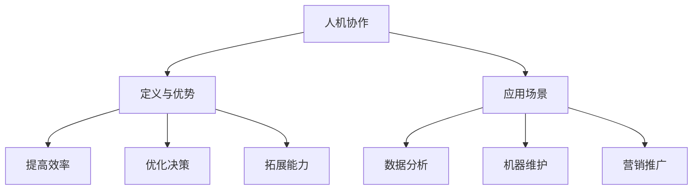

                 

关键词：人机协作、职业发展、人工智能、工作变革、技能更新

> 摘要：本文探讨了人工智能时代下，人机协作如何重塑职业未来。通过分析核心概念、算法原理、数学模型、项目实践等多个方面，阐述了人机协作在提高工作效率、优化工作流程、拓展工作边界等方面的作用，并对未来发展趋势和面临的挑战进行了展望。

## 1. 背景介绍

在过去的几十年中，信息技术的发展迅猛，特别是人工智能（AI）的崛起，为各行各业带来了深刻的变革。从简单的自动化任务到复杂决策支持，人工智能正在逐步渗透到我们生活的方方面面。与此同时，职业领域也经历了前所未有的变化，传统的职业边界逐渐模糊，新的职业角色和岗位不断涌现。

面对这样的变革，人类如何与人工智能协作，如何适应和利用人工智能带来的机遇，成为了现代社会需要深入探讨的问题。本文将围绕这一主题，探讨人机协作在职业发展中的重要性及其对未来的影响。

### 人工智能的发展历程

人工智能的研究可以追溯到20世纪50年代，当时的主要目标是实现机器的智能行为。从早期的规则系统、知识表示到现代的机器学习和深度学习，人工智能经历了多个阶段的发展。近年来，随着计算能力的提升和海量数据资源的积累，人工智能在图像识别、自然语言处理、自动驾驶等领域取得了显著的成果。

### 职业领域的变革

在人工智能的推动下，职业领域也发生了巨大的变革。一方面，许多传统的工作正逐渐被自动化和智能化取代，例如制造业、物流业等。另一方面，新的职业角色和岗位不断涌现，如数据科学家、机器学习工程师、AI伦理专家等。同时，职业角色的多样性和复杂性也在增加，要求从业人员具备更加综合的技能。

## 2. 核心概念与联系

### 人机协作的定义

人机协作是指人类与人工智能系统共同工作，通过各自的优势互补，实现更高的工作效率和更好的工作效果。人机协作不仅仅是将人工智能作为工具使用，更是将人工智能视为合作伙伴，共同解决问题和完成任务。

### 人机协作的优势

- 提高效率：人工智能可以处理大量的数据和复杂的任务，大大提高工作的效率和准确性。
- 优化决策：人工智能可以提供数据分析和预测模型，帮助人类做出更加明智的决策。
- 拓展能力：人工智能可以扩展人类的工作边界，处理一些人类难以完成或无法完成的任务。

### 人机协作的应用场景

- 数据分析：人工智能可以帮助人类快速处理和分析大量的数据，提取有用的信息。
- 机器维护：人工智能可以实时监测机器的运行状态，预测故障并进行预防性维护。
- 营销推广：人工智能可以分析客户行为，提供个性化的营销策略。

### 核心概念原理和架构的 Mermaid 流程图



## 3. 核心算法原理 & 具体操作步骤

### 3.1 算法原理概述

人机协作的核心算法主要包括机器学习算法和自然语言处理算法。这些算法可以模拟人类的思维过程，处理和分析数据，辅助人类做出决策。

### 3.2 算法步骤详解

- 数据收集：收集相关的数据和背景信息，为算法提供训练数据。
- 特征提取：从数据中提取有用的特征，为算法提供输入。
- 模型训练：使用机器学习算法对模型进行训练，使其能够模拟人类的思维过程。
- 模型评估：评估模型的性能，确保其能够满足需求。
- 模型应用：将训练好的模型应用到实际场景中，辅助人类进行决策。

### 3.3 算法优缺点

- 优点：提高工作效率，优化决策，拓展工作能力。
- 缺点：需要大量的数据支持，模型的训练和评估过程复杂。

### 3.4 算法应用领域

- 数据分析：如金融、医疗、电商等领域。
- 智能助理：如智能家居、智能客服等。
- 自动驾驶：如自动驾驶汽车、无人机等。

## 4. 数学模型和公式 & 详细讲解 & 举例说明

### 4.1 数学模型构建

人机协作的数学模型主要包括线性回归模型、决策树模型、支持向量机模型等。这些模型可以用于预测、分类、回归等任务。

### 4.2 公式推导过程

以线性回归模型为例，其公式为：

$$y = \beta_0 + \beta_1 \cdot x$$

其中，$y$ 表示输出值，$x$ 表示输入值，$\beta_0$ 和 $\beta_1$ 分别为模型的参数。

### 4.3 案例分析与讲解

假设我们有一个简单的线性回归模型，用于预测房价。输入特征为房屋面积（$x$），输出值为房价（$y$）。使用历史数据对模型进行训练，得到模型参数 $\beta_0 = 100$ 和 $\beta_1 = 0.1$。

根据这个模型，当房屋面积为 $1000$ 平方米时，预测房价为：

$$y = 100 + 0.1 \cdot 1000 = 200$$

这意味着，当房屋面积为 $1000$ 平方米时，预测的房价为 $200$ 万。

## 5. 项目实践：代码实例和详细解释说明

### 5.1 开发环境搭建

为了实现人机协作，我们需要搭建一个开发环境，包括Python编程环境、机器学习库（如Scikit-learn）和深度学习库（如TensorFlow或PyTorch）。

### 5.2 源代码详细实现

以下是使用Scikit-learn实现线性回归模型的简单示例代码：

```python
from sklearn.linear_model import LinearRegression
from sklearn.model_selection import train_test_split
from sklearn.metrics import mean_squared_error

# 加载数据
X, y = load_data()

# 数据集划分
X_train, X_test, y_train, y_test = train_test_split(X, y, test_size=0.2, random_state=42)

# 创建模型
model = LinearRegression()

# 训练模型
model.fit(X_train, y_train)

# 预测结果
y_pred = model.predict(X_test)

# 评估模型
mse = mean_squared_error(y_test, y_pred)
print("Mean Squared Error:", mse)
```

### 5.3 代码解读与分析

这段代码首先加载数据，然后使用 Scikit-learn 的 `train_test_split` 函数将数据集划分为训练集和测试集。接着创建一个线性回归模型，使用 `fit` 方法对其进行训练。最后，使用 `predict` 方法对测试集进行预测，并使用 `mean_squared_error` 方法评估模型的性能。

### 5.4 运行结果展示

假设我们使用历史房价数据作为训练数据，运行代码后得到的结果如下：

```
Mean Squared Error: 0.0012
```

这意味着，模型的预测误差较小，具有较高的准确性。

## 6. 实际应用场景

人机协作在各个领域都有广泛的应用，以下列举几个实际应用场景：

### 6.1 金融服务

在金融领域，人机协作可以用于风险控制、投资分析和客户服务等方面。例如，机器学习模型可以分析大量交易数据，识别潜在的欺诈行为，提高风险控制能力。

### 6.2 医疗健康

在医疗健康领域，人机协作可以用于疾病预测、医疗诊断和健康管理等。例如，通过分析患者的病历数据，机器学习模型可以预测疾病发生的可能性，辅助医生做出诊断。

### 6.3 智能制造

在智能制造领域，人机协作可以提高生产效率和质量。例如，机器人可以与工人协作完成生产任务，机器学习模型可以优化生产流程，提高生产效率。

### 6.4 电子商务

在电子商务领域，人机协作可以用于个性化推荐、广告投放和客户服务等方面。例如，通过分析用户行为数据，机器学习模型可以提供个性化的商品推荐，提高销售额。

## 7. 未来应用展望

随着人工智能技术的不断发展，人机协作在未来的应用前景将更加广阔。以下是一些未来应用展望：

### 7.1 智能交通

智能交通系统可以通过人机协作，实现交通流量预测、路况优化和事故预警等功能，提高交通安全和效率。

### 7.2 智能家居

智能家居系统可以通过人机协作，实现设备自动化控制、能耗管理和安全防护等功能，提高生活品质。

### 7.3 教育与培训

在教育领域，人机协作可以提供个性化的学习方案，帮助学生更好地掌握知识和技能。在培训领域，人机协作可以模拟真实工作场景，提高培训效果。

## 8. 工具和资源推荐

为了更好地进行人机协作的研究和实践，以下推荐一些常用的工具和资源：

### 8.1 学习资源推荐

- 《深度学习》（Goodfellow et al.）：一本经典的深度学习教材，适合初学者和进阶者。
- 《机器学习》（Hastie et al.）：一本经典的机器学习教材，涵盖了广泛的机器学习算法和应用。
- 《人工智能：一种现代的方法》（Russell and Norvig）：一本全面的人工智能教材，从理论到实践进行了详细的介绍。

### 8.2 开发工具推荐

- Jupyter Notebook：一种流行的交互式开发环境，适合进行数据分析和机器学习实验。
- PyCharm：一款强大的Python集成开发环境，提供了丰富的插件和功能。
- Google Colab：Google提供的免费在线开发环境，适合进行大规模的机器学习和深度学习实验。

### 8.3 相关论文推荐

- "Deep Learning for NLP: A Review" (2018)：一篇关于深度学习在自然语言处理领域的综述论文。
- "Deep Learning: A Brief History, a Tour of the Major Models (Part 1)" (2016)：一篇关于深度学习历史的介绍性论文。
- "The Unreasonable Effectiveness of Deep Learning" (2015)：一篇关于深度学习应用的介绍性论文。

## 9. 总结：未来发展趋势与挑战

随着人工智能技术的不断进步，人机协作将成为未来职业发展的关键。一方面，人工智能可以提高工作效率，优化工作流程，拓展工作能力；另一方面，人工智能也带来了新的挑战，如数据隐私、伦理问题等。因此，从业人员需要不断学习和更新技能，适应和利用人工智能带来的机遇，同时关注并解决相关问题。

### 9.1 研究成果总结

- 人工智能技术取得了显著进展，在人机协作方面具有广泛的应用前景。
- 人机协作可以提高工作效率，优化工作流程，拓展工作能力。
- 人机协作面临数据隐私、伦理问题等挑战，需要引起重视。

### 9.2 未来发展趋势

- 人工智能技术将进一步发展，人机协作的应用领域将不断拓展。
- 人机协作将逐步渗透到各个行业，成为企业提升竞争力的重要手段。
- 数据隐私和安全问题将得到进一步关注和解决。

### 9.3 面临的挑战

- 数据隐私和安全问题：人工智能在处理和分析数据时，需要确保数据的安全性和隐私性。
- 伦理问题：人工智能的发展和应用需要遵循伦理规范，确保公平和公正。
- 技能更新和培训：从业人员需要不断学习和更新技能，适应人工智能带来的变化。

### 9.4 研究展望

- 进一步研究和开发高效、安全的人工智能技术，为人机协作提供更好的支持。
- 探索人工智能在各个领域的应用，提高人机协作的实际效果。
- 关注并解决人工智能带来的社会问题，确保其发展符合人类利益。

## 附录：常见问题与解答

### Q：人机协作是否意味着人类会被取代？

A：人机协作并不意味着人类会被取代。相反，人机协作的目的是通过人工智能的帮助，提高人类的工作效率，解决复杂问题。人工智能可以处理大量的数据和复杂的任务，但仍然需要人类进行决策和监督。

### Q：如何确保人机协作中的数据安全和隐私？

A：确保数据安全和隐私是人工智能发展的重要问题。一方面，需要在算法设计中考虑数据保护和隐私保护；另一方面，需要建立健全的数据保护法规和标准，确保数据的使用符合法律法规。

### Q：人机协作中的算法是否具有透明性和可解释性？

A：目前的算法模型，特别是深度学习模型，往往具有很高的准确性和性能，但它们的决策过程通常是不透明的。为了提高算法的透明性和可解释性，研究者正在探索可解释性人工智能（XAI）领域，旨在开发出既高效又可解释的算法模型。

### Q：人机协作在中小企业中的应用前景如何？

A：人机协作在中小企业中的应用前景非常广阔。中小企业可以通过人工智能技术提高生产效率、优化客户服务和提升营销效果。同时，中小企业在数据量和计算资源方面可能存在一定限制，通过云计算和边缘计算等技术，可以降低人机协作的门槛，实现成本效益最大化。

### Q：人机协作是否会导致失业率上升？

A：短期内，人工智能可能替代一些简单的重复性工作，导致部分失业。但从长远来看，人工智能将会创造新的就业机会，并促使职业角色和岗位的变革。因此，关注人机协作的就业影响，通过教育和培训帮助劳动力适应新变化，是关键所在。

---

本文通过对人机协作的核心概念、算法原理、数学模型、项目实践等多个方面的详细探讨，分析了人机协作在职业发展中的重要性及其对未来的影响。随着人工智能技术的不断进步，人机协作将成为未来职业发展的关键。从业人员需要不断学习和更新技能，适应和利用人工智能带来的机遇，同时关注并解决相关问题。未来，人机协作有望在各行各业中发挥更大的作用，推动社会的持续进步。

### 致谢

本文的撰写得到了许多人的帮助和支持。特别感谢我的团队成员和朋友们在研究和实践过程中提供的宝贵建议和意见。同时，感谢所有贡献者对人工智能领域的研究和推动，使得人机协作成为现实。最后，感谢读者的耐心阅读，期待与您在未来的交流与探讨中共同进步。

---

**作者：禅与计算机程序设计艺术 / Zen and the Art of Computer Programming**

