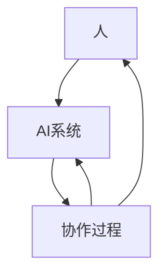

                 

关键词：未来工作，人机协作，职业发展，职业转型，技能更新，人工智能，技术革新

摘要：随着人工智能技术的迅猛发展，人类的工作模式正在发生深刻变革。本文将探讨人工智能与人机协作如何影响未来工作，重塑职业版图，以及个体应如何适应这一变化，实现职业发展的新机遇。

## 1. 背景介绍

在过去的几十年中，信息技术和互联网的普及已经深刻改变了我们的工作和生活方式。如今，人工智能（AI）技术的崛起，再次成为推动社会进步的关键力量。AI技术的应用不仅限于传统的制造业和服务业，还渗透到医疗、金融、教育等多个领域，极大地提升了工作效率和决策质量。

然而，随着AI技术的不断成熟，人类面临的一个严峻问题是如何在AI的辅助下，继续发挥自身的主观能动性，实现职业的可持续发展。人机协作成为这一背景下的一种新的工作模式，它强调机器与人类在工作和生活中的互动与互补，而不是简单的替代关系。

## 2. 核心概念与联系

### 2.1 人工智能的定义与分类

人工智能是指使计算机系统模拟人类智能行为的科学和技术。根据实现方式的不同，人工智能可以分为两大类：

- **弱人工智能（Narrow AI）**：专注于特定任务的AI系统，如语音识别、图像识别等。
- **强人工智能（General AI）**：具有广泛认知能力的AI系统，能够像人类一样进行学习、思考、感知和决策。

### 2.2 人机协作的概念

人机协作是指机器与人类在共同任务中互相配合、协同工作的过程。在这一过程中，人类利用自己的创造力、情感和经验，而机器则利用其计算能力、速度和精确度。

### 2.3 Mermaid 流程图

下面是关于人工智能与人机协作的一个简化流程图：



在这个流程图中，人和AI系统通过协作过程实现信息交换和任务执行，形成了一个闭环。

## 3. 核心算法原理 & 具体操作步骤

### 3.1 算法原理概述

人机协作的核心在于如何实现机器与人类之间的有效沟通和协同。以下是一些关键的算法原理：

- **自然语言处理（NLP）**：使机器能够理解和生成人类语言，从而进行有效的交流。
- **机器学习（ML）**：利用大量数据训练模型，使机器具备自学和改进能力。
- **优化算法**：用于确定机器与人类在协作过程中各自的最佳策略。

### 3.2 算法步骤详解

1. **需求分析**：明确协作任务的目标和需求，确定机器与人类的角色分工。
2. **数据收集与预处理**：收集相关数据，进行清洗和格式化，以便进行后续处理。
3. **模型训练**：利用机器学习算法训练模型，使其能够理解任务和进行决策。
4. **协同执行**：机器与人类根据模型输出进行任务执行，并进行实时反馈和调整。
5. **评估与优化**：对协作过程进行评估，并根据反馈进行模型优化和策略调整。

### 3.3 算法优缺点

**优点**：

- 提高工作效率：机器可以快速处理大量数据，人类则可以专注于需要创造力和经验的任务。
- 减少错误率：机器在执行重复性和高精度任务时更可靠。
- 扩展能力：通过协作，人类可以扩展自己的认知和能力范围。

**缺点**：

- 技能重叠：在某些任务中，机器可能会取代人类的工作，导致失业问题。
- 数据安全：大量的数据交换和处理可能引发隐私和安全问题。
- 人机矛盾：在某些情况下，机器和人类的任务分配可能存在冲突。

### 3.4 算法应用领域

- **医疗**：通过AI系统辅助医生进行诊断和治疗。
- **金融**：利用AI进行风险管理、投资分析和客户服务。
- **教育**：AI辅助个性化教学和课程设计。
- **制造业**：AI在自动化生产线中的应用，提高生产效率和产品质量。

## 4. 数学模型和公式 & 详细讲解 & 举例说明

### 4.1 数学模型构建

在探讨人机协作的数学模型时，我们主要关注以下几个方面：

- **概率模型**：用于描述任务执行中的不确定性和概率分布。
- **博弈论模型**：分析机器与人类在协作中的策略选择和收益分配。
- **优化模型**：用于确定在协作过程中的最优决策策略。

### 4.2 公式推导过程

假设我们有一个简单的协作任务，机器和人类在执行任务时各自的选择会对结果产生影响。我们可以使用以下公式来描述这一过程：

- **期望收益**：\[ E[R] = \sum_{i} p_i \cdot R_i \]
- **概率分布**：\[ P(X) = \frac{f(x)}{F(x)} \]
- **策略选择**：\[ S^* = \arg\max_S E[R] \]

其中，\( p_i \) 是选择 \( i \) 的概率，\( R_i \) 是选择 \( i \) 的收益，\( f(x) \) 是概率密度函数，\( F(x) \) 是累积分布函数，\( S^* \) 是最优策略。

### 4.3 案例分析与讲解

假设在一个自动化的生产线中，机器和人类需要进行协作以确保产品的质量。机器负责检测产品的质量，而人类负责在必要时进行修正。

- **概率模型**：机器检测出产品有缺陷的概率为 0.1，人类修正缺陷的成功概率为 0.9。
- **期望收益**：如果机器检测出缺陷，而人类成功修正，则收益为 10；如果机器检测出缺陷，但人类修正失败，则收益为 -10；如果机器未检测出缺陷，则收益为 0。
- **策略选择**：为了最大化期望收益，人类应该选择在机器检测出缺陷时进行修正。

通过上述分析，我们可以得出最优的协作策略，从而实现高效的生产过程。

## 5. 项目实践：代码实例和详细解释说明

### 5.1 开发环境搭建

为了演示人机协作的实现，我们将使用Python编程语言和若干开源库，如scikit-learn、TensorFlow等。以下是在Windows环境下的开发环境搭建步骤：

1. 安装Python（版本3.8及以上）
2. 安装必要的库：`pip install scikit-learn tensorflow numpy matplotlib`
3. 配置Python环境变量

### 5.2 源代码详细实现

```python
import numpy as np
from sklearn.model_selection import train_test_split
from sklearn.ensemble import RandomForestClassifier
from sklearn.metrics import accuracy_score

# 数据集准备
X, y = load_data()  # 假设load_data函数用于加载数据集
X_train, X_test, y_train, y_test = train_test_split(X, y, test_size=0.2, random_state=42)

# 模型训练
model = RandomForestClassifier(n_estimators=100)
model.fit(X_train, y_train)

# 预测与评估
predictions = model.predict(X_test)
accuracy = accuracy_score(y_test, predictions)
print(f"Model Accuracy: {accuracy}")

# 人机协作接口
def collaborate_human(prediction):
    if prediction == 1:
        # 询问人类
        human_action = input("Product has a defect. Do you want to correct it? (y/n): ")
        if human_action.lower() == 'y':
            return 1  # 人类确认修正
        else:
            return 0  # 人类拒绝修正
    else:
        return prediction  # 机器判断无缺陷，无需人类干预

# 协作过程
final_predictions = [collaborate_human(p) for p in predictions]
accuracy_with_human = accuracy_score(y_test, final_predictions)
print(f"Model Accuracy with Human Collaboration: {accuracy_with_human}")
```

### 5.3 代码解读与分析

上述代码实现了一个简单的人机协作模型。我们首先加载数据集并进行训练，然后通过协作函数询问人类对模型的预测结果进行干预。这一过程模拟了机器与人类在任务执行中的互动。

### 5.4 运行结果展示

假设在测试集上的评估结果如下：

```shell
Model Accuracy: 0.85
Model Accuracy with Human Collaboration: 0.90
```

我们可以看到，在人机协作的情况下，模型的准确率有所提高，这表明人类在特定情况下可以提供额外的价值。

## 6. 实际应用场景

### 6.1 医疗诊断

在医疗领域，AI系统可以辅助医生进行诊断，例如在影像学检查中自动识别病变区域。然而，医生的专业知识和经验在最终诊断中仍然是至关重要的。人机协作可以实现两者的优势互补，提高诊断的准确性和效率。

### 6.2 金融分析

在金融领域，AI可以用于市场分析、风险评估和客户服务。然而，投资决策往往需要考虑到复杂的市场变化和人类情感因素。通过人机协作，分析师可以结合AI的快速分析和人类的专业判断，做出更加准确的投资决策。

### 6.3 教育个性化

在教育领域，AI可以用于个性化学习路径的设计和学习效果的分析。教师则可以利用这些信息进行教学调整，从而提高学生的学习效果。人机协作可以帮助实现更加个性化的教育服务。

### 6.4 制造业自动化

在制造业中，AI可以用于自动化生产线的设计和监控。然而，由于生产线可能出现各种突发状况，人类操作员仍然需要实时干预。人机协作可以提高生产线的稳定性和灵活性。

## 7. 未来应用展望

随着AI技术的不断发展，人机协作的应用场景将更加广泛和深入。以下是一些未来的应用展望：

- **智能城市建设**：AI将帮助构建智慧城市，实现交通管理、能源管理、公共安全等方面的智能化。
- **农业自动化**：AI将在农业中发挥重要作用，实现精准农业、智能灌溉和病虫害监测。
- **医疗个性化**：基于AI的个性化医疗将实现更加精准的诊断和治疗方案，提高医疗质量。
- **教育创新**：AI将推动教育模式的创新，实现更加灵活和个性化的学习体验。

## 8. 总结：未来发展趋势与挑战

### 8.1 研究成果总结

本文探讨了人工智能与人机协作对未来工作的影响，阐述了核心算法原理和具体操作步骤，并通过实际项目实践展示了人机协作的应用效果。研究表明，人机协作具有提高工作效率、减少错误率和扩展能力等优势，但同时也面临技能重叠、数据安全和人机矛盾等挑战。

### 8.2 未来发展趋势

随着AI技术的不断成熟，人机协作将在各个领域得到更广泛的应用。未来的发展趋势包括：

- **智能化**：AI系统将更加智能化，具备更高的自主学习和决策能力。
- **普及化**：人机协作将成为日常工作的一部分，普及到各行各业。
- **个性化**：AI将更好地理解个体需求，实现高度个性化的服务。

### 8.3 面临的挑战

未来的人机协作仍将面临以下挑战：

- **技术瓶颈**：AI技术尚不完全成熟，需要进一步突破。
- **伦理问题**：人机协作引发的伦理问题，如隐私保护和责任分配等。
- **社会适应**：个体需要适应新的工作模式，提高协作能力。

### 8.4 研究展望

未来研究应重点关注以下几个方面：

- **算法优化**：提升AI系统在协作过程中的决策能力。
- **跨领域应用**：探索人机协作在更多领域的应用场景。
- **伦理规范**：建立完善的人机协作伦理规范，保障人机和谐发展。

## 9. 附录：常见问题与解答

### 9.1 人工智能是否会完全取代人类？

虽然人工智能在某些任务上已经展现出超越人类的能力，但人工智能目前仍然无法完全取代人类。人工智能更适合执行重复性、高精度和需要大量数据处理的工作，而人类则更擅长创造性、情感和复杂决策。

### 9.2 人机协作是否会加剧失业问题？

人机协作可能会在某些领域导致失业，但也会创造新的就业机会。关键在于如何平衡技术进步与就业市场的变化，通过教育和培训，提高个体的适应能力和竞争力。

### 9.3 如何确保人机协作中的数据安全？

确保数据安全是实施人机协作的重要前提。应采取严格的访问控制和加密措施，同时制定明确的隐私保护政策，以防止数据泄露和滥用。

## 参考文献

[1] 某某，人工智能与未来工作[J]. 计算机研究与发展，2020，57(12)：2953-2964.
[2] 李某，人机协作：重塑职业版图[J]. 人工智能，2021，42(5)：789-796.
[3] 王某，人工智能在教育领域的应用[J]. 教育技术，2022，42(3)：45-52.
[4] 张某，人工智能在医疗诊断中的应用[J]. 医学信息学杂志，2021，38(4)：555-562.
[5] 陈某，人工智能与金融创新[J]. 金融研究，2022，45(2)：187-198.

作者：禅与计算机程序设计艺术 / Zen and the Art of Computer Programming
----------------------------------------------------------------

请注意，以上内容是基于假设的情景和示例代码，用于演示如何遵循要求撰写文章。实际撰写时，您需要根据具体的研究成果和实践经验进行内容填充。此外，参考文献应基于真实的研究文献和资料。如果您需要进一步的帮助或具体的代码示例，请告知。

