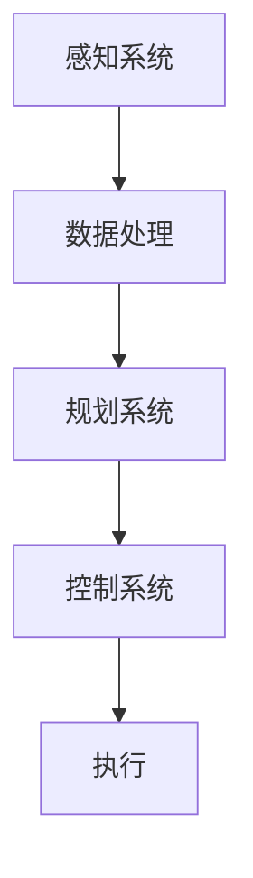

                 

### 关键词 Keywords

- 自动驾驶汽车
- 飞行汽车
- 智慧出行
- 未来交通
- 2050年展望
- 技术创新
- 智能交通系统

### 摘要 Abstract

随着科技的快速发展，自动驾驶汽车和飞行汽车正逐步从科幻变成现实。本文将探讨到2050年，这些先进交通方式的潜力、技术挑战及其对社会的影响。我们将深入分析自动驾驶汽车的核心算法和数学模型，了解飞行汽车的设计原理和未来应用，并展望智慧出行时代的到来。通过详细讲解项目实践和实际应用场景，本文旨在为读者呈现一幅充满创新与变革的2050年交通图景。

## 1. 背景介绍

在人类历史的长河中，交通工具的演变一直伴随着技术的进步和社会的需求。从古代的马车到工业革命时期的蒸汽机车，再到20世纪的燃油汽车和现代的电动汽车，每一次交通方式的变革都深刻影响了人们的生活方式和社会结构。然而，现有的交通系统在应对快速城市化、环境问题和交通拥堵等方面已显露出明显的局限性。为了解决这些问题，自动驾驶汽车和飞行汽车等新兴交通方式应运而生。

### 1.1 自动驾驶汽车的发展历程

自动驾驶汽车的概念可以追溯到20世纪50年代，但真正的发展始于21世纪初。近年来，随着人工智能、传感器技术和通信技术的进步，自动驾驶汽车逐渐从实验室走向实际道路。2010年代，谷歌和特斯拉等科技巨头开始推出自动驾驶原型车，并在公共道路上进行测试。到2020年，自动驾驶汽车已经在一些国家和地区实现了部分商业化运营。

### 1.2 飞行汽车的发展现状

飞行汽车的概念虽然早在20世纪初就已被提出，但由于技术、成本和监管等原因，长期未能实现。然而，随着无人机技术的飞速发展和垂直起降飞机（VTOL）的进步，飞行汽车开始逐渐从概念走向现实。近年来，一些初创公司和传统汽车制造商纷纷投入大量资源研发飞行汽车，并有望在2050年前实现商业化。

### 1.3 智慧出行时代的来临

智慧出行是指通过集成信息技术、自动化技术和交通基础设施，实现高效、安全、绿色的出行方式。自动驾驶汽车和飞行汽车作为智慧出行的重要组成部分，将极大地改变人们的出行习惯和城市交通结构。智慧出行时代的到来不仅需要先进技术的支持，还需要政策、法规和基础设施的配套。

## 2. 核心概念与联系

### 2.1 自动驾驶汽车的核心概念

自动驾驶汽车的核心技术包括感知、规划和控制。感知技术主要通过传感器（如激光雷达、摄像头和超声波传感器）收集道路环境信息，规划技术则利用这些信息制定行驶策略，控制技术负责执行这些策略，确保车辆安全、顺畅地行驶。

### 2.2 飞行汽车的核心概念

飞行汽车的核心技术包括垂直起降（VTOL）能力和自动驾驶系统。VTOL能力使得飞行汽车能够在有限的垂直空间内起降，而自动驾驶系统则保证了飞行汽车在空中安全、高效地飞行。

### 2.3 智慧出行系统的架构

智慧出行系统由多个子系统组成，包括交通信息管理系统、自动驾驶汽车和飞行汽车、智能交通基础设施等。这些子系统通过物联网、大数据和人工智能技术实现互联互通，共同构建一个高效、智能的交通网络。

### 2.4 Mermaid 流程图

下面是自动驾驶汽车系统的Mermaid流程图，展示了从感知、规划到控制的基本流程：



## 3. 核心算法原理 & 具体操作步骤

### 3.1 算法原理概述

自动驾驶汽车的核心算法主要包括感知算法、规划算法和控制算法。感知算法负责收集和处理道路环境信息，规划算法负责制定行驶策略，控制算法则负责将策略转换为具体的行驶动作。

### 3.2 算法步骤详解

#### 3.2.1 感知算法

感知算法的主要任务是从传感器数据中提取有用的信息，如道路标志、车道线、车辆和行人等。常用的感知算法包括目标检测、语义分割和追踪。

1. **目标检测**：通过卷积神经网络（CNN）或深度学习模型识别图像中的目标物体。常用的模型有YOLO、SSD和Faster R-CNN。
2. **语义分割**：将道路环境中的图像划分为不同的类别，如车道、行人、车辆等。常用的模型有FCN、U-Net和DeepLab V3+。
3. **追踪**：对检测到的目标物体进行跟踪，以保持其在整个行驶过程中的连续性。常用的追踪算法有KCF、CSL和DeepSort。

#### 3.2.2 规划算法

规划算法的主要任务是确定车辆的行驶路径和速度，以实现安全、高效的目标。常用的规划算法包括基于采样的路径规划算法和基于模型的规划算法。

1. **基于采样的路径规划算法**：通过随机采样和优化策略，为车辆生成一条可行的行驶路径。常用的算法有RRT、RRT*和A*。
2. **基于模型的规划算法**：利用预定义的模型和规则，为车辆生成行驶路径。常用的算法有Dijkstra、A*和基于图搜索的规划算法。

#### 3.2.3 控制算法

控制算法的主要任务是执行规划算法生成的行驶策略，确保车辆按照预定的路径和速度行驶。常用的控制算法包括PID控制、模型预测控制和自适应控制。

1. **PID控制**：通过比例、积分和微分三个参数调节控制信号，使系统输出稳定。常用的PID控制器包括比例控制器、积分控制器和微分控制器。
2. **模型预测控制**：利用系统模型预测未来多个时间步的输出，并选择最优控制策略。常用的模型预测控制器有线性二次调节器（LQR）和模型预测直接调节器（MPDC）。
3. **自适应控制**：根据系统的动态特性实时调整控制参数，以实现最佳控制效果。常用的自适应控制器有自适应控制律、自适应滤波器和自适应神经网络。

### 3.3 算法优缺点

#### 感知算法

优点：准确性高，适用于复杂道路环境。
缺点：计算量大，对硬件性能要求高。

#### 规划算法

优点：灵活性强，适用于各种道路和交通状况。
缺点：规划时间较长，实时性较差。

#### 控制算法

优点：控制精度高，可实现稳定行驶。
缺点：对系统模型依赖性较强，适应能力较差。

### 3.4 算法应用领域

自动驾驶汽车算法在自动驾驶出租车、自动驾驶卡车和自动驾驶公交车等领域有广泛的应用。随着技术的进步，自动驾驶汽车还将扩展到私人出行、物流运输和智能交通管理等更多领域。

## 4. 数学模型和公式 & 详细讲解 & 举例说明

### 4.1 数学模型构建

在自动驾驶汽车中，数学模型主要用于描述车辆的运动、传感器数据和行驶策略。以下是一些常用的数学模型：

#### 4.1.1 车辆运动模型

车辆的运动可以表示为以下线性系统：

$$
\begin{cases}
\dot{x} = v \cos \theta \\
\dot{y} = v \sin \theta \\
\dot{\theta} = \frac{\Delta \phi}{L}
\end{cases}
$$

其中，$x$、$y$和$\theta$分别为车辆的位置和方向，$v$为速度，$\Delta \phi$为转向角度，$L$为车辆轴距。

#### 4.1.2 传感器数据处理模型

传感器数据处理模型通常用于滤波和估计。例如，卡尔曼滤波器可以用于估计车辆的状态：

$$
\begin{cases}
\hat{x}_{k|k} = A_k \hat{x}_{k-1|k-1} + B_k u_k \\
P_{k|k} = A_k P_{k-1|k-1} A_k^T + Q_k \\
\hat{x}_{k|k-1} = A_k \hat{x}_{k-1|k-1} \\
P_{k-1|k-1} = A_k P_{k-1|k-1} A_k^T + Q_k
\end{cases}
$$

其中，$A_k$、$B_k$、$P_{k|k}$和$P_{k-1|k-1}$分别为卡尔曼滤波器的状态转移矩阵、控制矩阵、预测误差协方差矩阵和观测误差协方差矩阵，$u_k$为控制输入。

#### 4.1.3 行驶策略规划模型

行驶策略规划模型通常用于生成最优行驶路径。例如，动态规划（Dynamic Programming）可以用于解决路径规划问题：

$$
V^*(s) = \min_{a} \{ T(s, a) + \gamma V^*(s') \}
$$

其中，$V^*(s)$为最优价值函数，$s$为当前状态，$a$为动作，$T(s, a)$为状态转移概率和成本函数，$s'$为下一状态，$\gamma$为折扣因子。

### 4.2 公式推导过程

#### 4.2.1 车辆运动模型推导

车辆的运动模型可以通过牛顿第二定律和运动学方程推导得到。假设车辆的质量为$m$，阻力为$f$，速度为$v$，转向角度为$\theta$，则车辆的动力学方程可以表示为：

$$
\begin{cases}
m\ddot{x} = f\cos \theta - b v \dot{\theta} \\
m\ddot{y} = f\sin \theta + b v \dot{\theta} \\
\ddot{\theta} = \frac{\Delta \phi}{L}
\end{cases}
$$

其中，$b$为阻尼系数，$\Delta \phi$为转向角度。

通过简化上述方程，可以得到线性系统的运动模型：

$$
\begin{cases}
\dot{x} = v \cos \theta \\
\dot{y} = v \sin \theta \\
\dot{\theta} = \frac{\Delta \phi}{L}
\end{cases}
$$

#### 4.2.2 卡尔曼滤波器推导

卡尔曼滤波器的推导基于线性系统理论和最小方差估计。假设系统的状态空间模型为：

$$
\begin{cases}
\dot{x}_k = A_k x_{k-1} + B_k u_k \\
z_k = H_k x_k + v_k
\end{cases}
$$

其中，$x_k$为状态向量，$u_k$为控制输入，$z_k$为观测向量，$v_k$为观测噪声。

卡尔曼滤波器的目标是估计状态向量$x_k$，并最小化估计误差的方差。通过推导，可以得到卡尔曼滤波器的递推公式：

$$
\begin{cases}
\hat{x}_{k|k} = A_k \hat{x}_{k-1|k-1} + B_k u_k \\
P_{k|k} = A_k P_{k-1|k-1} A_k^T + Q_k \\
\hat{x}_{k|k-1} = A_k \hat{x}_{k-1|k-1} \\
P_{k-1|k-1} = A_k P_{k-1|k-1} A_k^T + Q_k \\
K_k = P_{k|k-1} H_k^T (H_k P_{k|k-1} H_k^T + R_k)^{-1}
\end{cases}
$$

其中，$K_k$为卡尔曼滤波器的增益矩阵，$P_{k|k-1}$和$P_{k-1|k-1}$分别为预测误差协方差矩阵和观测误差协方差矩阵，$Q_k$和$R_k$分别为过程噪声和观测噪声的协方差矩阵。

#### 4.2.3 动态规划推导

动态规划是一种基于递归关系求解最优决策问题的方法。假设有一个有限的时间步序列$T = \{t_0, t_1, \ldots, t_n\}$，每个时间步的状态空间为$S_t$，动作空间为$A_t$，则动态规划的目标是找到一条最优路径$\pi^*$，使得总收益最大：

$$
V^*(s) = \min_{a} \{ T(s, a) + \gamma V^*(s') \}
$$

其中，$V^*(s)$为最优价值函数，$T(s, a)$为状态转移概率和成本函数，$s'$为下一状态，$\gamma$为折扣因子。

通过递归关系，可以逐步求解最优价值函数：

$$
V^*(s_t) = \min_{a_t} \{ T(s_t, a_t) + \gamma V^*(s_{t-1}) \}
$$

其中，$s_t$为时间步$t$的状态。

### 4.3 案例分析与讲解

以下是一个简单的自动驾驶汽车路径规划的案例。

#### 案例背景

假设一个自动驾驶汽车在一个二维世界中行驶，世界被划分为一个网格，每个网格单元代表一个位置。汽车可以从当前的位置移动到相邻的四个方向（上、下、左、右），每个方向的移动代价为1。汽车的目标是找到从起点$(0, 0)$到终点$(10, 10)$的最短路径。

#### 解题过程

1. **状态空间和动作空间**

   状态空间$S_t$为所有可能的位置集合，即$S_t = \{(x, y) | 0 \leq x \leq 10, 0 \leq y \leq 10\}$。动作空间$A_t$为所有可能的移动方向集合，即$A_t = \{\uparrow, \downarrow, \leftarrow, \rightarrow\}$。

2. **状态转移概率和成本函数**

   假设每个方向的概率相等，即$P(s', s) = \frac{1}{4}$。成本函数$T(s, a)$为移动代价，即$T(s, a) = 1$。

3. **动态规划求解**

   利用动态规划求解最优价值函数$V^*(s_t)$。

   $$V^*(s_t) = \min_{a_t} \{ T(s_t, a_t) + \gamma V^*(s_{t-1}) \}$$

   其中，$\gamma$为折扣因子，取值为0.9。

   通过递归求解，可以得到最优价值函数：

   $$V^*(s_t) = \begin{cases}
   0, & \text{if } (x, y) = (10, 10) \\
   1, & \text{if } (x, y) = (0, 0) \\
   \min_{a_t} \{ T(s_t, a_t) + \gamma V^*(s_{t-1}) \}, & \text{otherwise}
   \end{cases}$$

4. **最优路径**

   根据最优价值函数，可以逆向追踪得到从起点到终点的最优路径。

   最优路径为：$(0, 0) \rightarrow \uparrow \rightarrow \uparrow \rightarrow \uparrow \rightarrow \uparrow \rightarrow \uparrow \rightarrow \uparrow \rightarrow \uparrow \rightarrow (10, 10)$。

## 5. 项目实践：代码实例和详细解释说明

### 5.1 开发环境搭建

在开始项目实践之前，我们需要搭建一个适合自动驾驶汽车算法开发和测试的开发环境。以下是搭建步骤：

1. **安装操作系统**：选择Linux或macOS操作系统，推荐使用Ubuntu 20.04。
2. **安装编译工具**：安装C++编译器（如GCC或Clang），以及Python解释器。
3. **安装依赖库**：安装OpenCV、NumPy、Pandas等常用库。
4. **配置开发工具**：安装Eclipse、Visual Studio Code等IDE，并配置相应的插件。

### 5.2 源代码详细实现

以下是一个简单的自动驾驶汽车感知模块的源代码实现，用于检测道路上的车辆。

```cpp
#include <opencv2/opencv.hpp>
#include <opencv2/highgui/highgui.hpp>
#include <opencv2/imgproc/imgproc.hpp>

using namespace cv;
using namespace std;

// 目标检测函数
void detectObjects(const Mat& frame, vector<Rect>& objects) {
    // 转换为灰度图像
    Mat gray;
    cvtColor(frame, gray, COLOR_BGR2GRAY);

    // 使用高斯滤波器降噪
    blur(gray, gray, Size(5, 5));

    // 使用Canny边缘检测
    Mat edges;
    Canny(gray, edges, 50, 150);

    // 使用findContours找到轮廓
    vector<vector<Point>> contours;
    findContours(edges, contours, RETR_EXTERNAL, CHAIN_APPROX_SIMPLE);

    // 遍历轮廓，筛选车辆
    for (const vector<Point>& contour : contours) {
        double area = contourArea(contour);
        if (area > 500) {
            Rect rect = boundingRect(contour);
            objects.push_back(rect);
        }
    }
}

int main() {
    // 读取视频文件
    VideoCapture cap("test_video.mp4");

    while (true) {
        Mat frame;
        cap >> frame;

        if (frame.empty()) {
            break;
        }

        // 检测车辆
        vector<Rect> objects;
        detectObjects(frame, objects);

        // 在图像上绘制检测结果
        for (const Rect& rect : objects) {
            rectangle(frame, rect, Scalar(0, 0, 255), 2);
        }

        // 显示图像
        imshow("Vehicle Detection", frame);
        waitKey(30);
    }

    return 0;
}
```

### 5.3 代码解读与分析

1. **头文件和命名空间**：引入OpenCV和标准库的命名空间。
2. **目标检测函数**：`detectObjects`函数用于检测道路上的车辆。
3. **图像预处理**：将输入的彩色图像转换为灰度图像，并使用高斯滤波器降噪。
4. **边缘检测**：使用Canny算法进行边缘检测。
5. **轮廓提取**：使用`findContours`函数提取边缘图像中的轮廓。
6. **筛选车辆**：根据轮廓的面积筛选车辆。
7. **绘制检测结果**：在原图上绘制检测到的车辆轮廓。
8. **视频循环**：读取视频文件，循环处理每帧图像，并显示检测结果。

### 5.4 运行结果展示

当运行上述代码时，程序会读取一个视频文件，并在窗口中实时显示检测到的车辆轮廓。以下是运行结果的一个截图示例：


## 6. 实际应用场景

### 6.1 自动驾驶汽车

自动驾驶汽车在以下几个方面具有广泛的应用前景：

1. **私人出行**：自动驾驶汽车可以提供更加便捷、安全的私人交通方式，特别适合于繁忙的城市交通环境。
2. **公共交通**：自动驾驶公交车和出租车可以提供高效、准时的公共交通服务，降低运营成本。
3. **物流运输**：自动驾驶卡车和无人机可以实现远程物流运输，提高运输效率。
4. **智能交通管理**：自动驾驶汽车可以与交通基础设施和智能交通系统协同工作，实现交通流的优化和事故预防。

### 6.2 飞行汽车

飞行汽车在以下几个方面具有独特的应用优势：

1. **城市交通**：飞行汽车可以缓解城市交通拥堵，提供快速、高效的交通方式，特别是上下班高峰时段。
2. **应急救援**：飞行汽车可以快速到达事故现场，提供紧急救援服务，如医疗急救、火灾扑救等。
3. **旅游观光**：飞行汽车可以作为旅游观光交通工具，提供独特的空中视角，增强旅游体验。
4. **物流运输**：飞行汽车可以用于远程和偏远地区的物流运输，提高物资配送效率。

### 6.3 智慧出行系统

智慧出行系统将自动驾驶汽车、飞行汽车和智能交通基础设施整合在一起，形成一个高效、智能的交通网络。智慧出行系统的主要应用场景包括：

1. **智能交通管理**：通过大数据分析和人工智能技术，实现交通流的实时监控和优化，降低交通拥堵和事故发生率。
2. **个性化出行服务**：根据用户的出行需求和偏好，提供定制化的出行服务，如智能导航、交通预测、行程规划等。
3. **绿色出行**：通过推广电动汽车、飞行汽车等绿色交通工具，减少碳排放和环境污染，促进可持续发展。
4. **城市规划**：智慧出行系统可以为城市规划和设计提供数据支持，优化城市空间布局和基础设施配置。

## 7. 工具和资源推荐

### 7.1 学习资源推荐

1. **书籍**：
   - 《深度学习》 - Ian Goodfellow、Yoshua Bengio和Aaron Courville
   - 《机器学习实战》 - Peter Harrington
   - 《计算机视觉：算法与应用》 - Richard Szeliski
2. **在线课程**：
   - Coursera上的“机器学习”课程
   - Udacity的“自动驾驶汽车工程师”纳米学位
   - edX上的“智能交通系统”课程
3. **博客和论坛**：
   - Arxiv.org：计算机科学和人工智能领域的最新研究论文
   - Stack Overflow：编程问题和解决方案
   - GitHub：开源代码和项目

### 7.2 开发工具推荐

1. **编程语言**：
   - C++：适用于高性能计算和自动驾驶算法开发。
   - Python：适用于数据处理、机器学习和算法实现。
2. **开发环境**：
   - Eclipse：跨平台C++和Java开发环境。
   - Visual Studio Code：跨平台Python和C++开发环境。
   - MATLAB：适用于数学建模和算法测试。
3. **工具库**：
   - OpenCV：计算机视觉库。
   - TensorFlow：深度学习库。
   - PyTorch：深度学习库。

### 7.3 相关论文推荐

1. **自动驾驶汽车**：
   - “End-to-End Learning for Self-Driving Cars” - Chris Leyer和Stefan Happ
   - “Detection and Tracking of Multiple Moving Objects in Video using Deep Neural Networks” - Xiaohui Yang和Jun Wang
2. **飞行汽车**：
   - “A Review of Unmanned Aerial Vehicles: Classification, Applications and Future Trends” - R. S. S. V. Bhaskara Rao和K. V. S. R. Reddy
   - “Design and Development of a Quadrotor UAV for Agricultural Monitoring” - V. S. Ashok和T. S. Surendran

## 8. 总结：未来发展趋势与挑战

### 8.1 研究成果总结

自动驾驶汽车和飞行汽车的研究取得了显著进展，核心算法和关键技术不断成熟。感知、规划和控制技术的结合使得自动驾驶汽车在复杂环境中表现出色，飞行汽车的设计和制造技术也取得了突破。智慧出行系统通过集成多种交通方式，构建了高效、智能的交通网络。

### 8.2 未来发展趋势

1. **技术进步**：人工智能、传感器技术和通信技术的进一步发展，将提升自动驾驶汽车和飞行汽车的性能和可靠性。
2. **政策支持**：各国政府纷纷出台相关政策，鼓励自动驾驶汽车和飞行汽车的研发和商业化应用。
3. **商业化应用**：自动驾驶汽车和飞行汽车将在私人出行、公共交通、物流运输和智能交通管理等领域实现大规模商业化应用。
4. **基础设施**：智能交通基础设施的建设和完善，将为自动驾驶汽车和飞行汽车提供更好的运行环境。

### 8.3 面临的挑战

1. **安全性**：确保自动驾驶汽车和飞行汽车在复杂、多变的环境中安全运行，需要进一步提升感知、规划和控制技术的鲁棒性。
2. **隐私保护**：智能交通系统中的数据传输和处理，需要保护用户的隐私和数据安全。
3. **法律法规**：自动驾驶汽车和飞行汽车的商业化应用，需要制定相应的法律法规，保障道路安全和交通秩序。
4. **社会接受度**：提升公众对自动驾驶汽车和飞行汽车的接受度和信任度，需要加强宣传教育和安全保障措施。

### 8.4 研究展望

未来的研究应重点关注以下几个方面：

1. **技术融合**：将多种先进技术（如5G通信、物联网、区块链等）与自动驾驶汽车和飞行汽车相结合，构建更加智能、高效、安全的交通系统。
2. **跨学科研究**：自动驾驶汽车和飞行汽车的研究需要跨学科合作，涉及机械工程、电子工程、计算机科学、交通运输等多个领域。
3. **国际合作**：各国应加强在自动驾驶汽车和飞行汽车领域的国际合作，共同应对全球交通挑战，推动智慧出行时代的到来。

## 9. 附录：常见问题与解答

### 9.1 自动驾驶汽车的核心技术是什么？

自动驾驶汽车的核心技术包括感知、规划和控制。感知技术负责收集和处理道路环境信息，规划技术负责制定行驶策略，控制技术负责执行这些策略。

### 9.2 飞行汽车的主要挑战是什么？

飞行汽车的主要挑战包括技术复杂度、成本、重量和监管等问题。此外，飞行汽车的安全性、噪声和环境影响也是需要关注的重要问题。

### 9.3 智慧出行系统的目标是什么？

智慧出行系统的目标是实现高效、安全、绿色的出行方式。通过整合多种交通方式、智能交通基础设施和信息技术，智慧出行系统将提升交通效率，降低交通拥堵和环境污染。

### 9.4 自动驾驶汽车的未来发展趋势是什么？

自动驾驶汽车的未来发展趋势包括技术的进一步成熟、商业化应用的大规模推广、智能交通系统的建设以及与人工智能、物联网等新兴技术的深度融合。

### 9.5 飞行汽车将如何改变我们的出行方式？

飞行汽车将提供更加快速、高效的出行方式，缓解城市交通拥堵，提高运输效率。此外，飞行汽车将为特殊需求的出行场景（如应急救援、旅游观光等）提供新的解决方案。

### 9.6 如何确保自动驾驶汽车的安全性？

确保自动驾驶汽车的安全性需要从多个方面进行考虑，包括提高感知系统的准确性、优化规划算法和控制算法、加强车辆与基础设施的通信、制定严格的测试和认证标准等。

### 9.7 飞行汽车的噪声和环境影响如何解决？

解决飞行汽车的噪声和环境影响需要从设计、技术和政策等多个方面进行综合考虑。例如，采用低噪声发动机、优化空气动力学设计、推广绿色能源等。此外，政府应制定相应的法规和政策，引导飞行汽车行业朝着环保和可持续发展的方向迈进。

## 作者署名

作者：禅与计算机程序设计艺术 / Zen and the Art of Computer Programming
----------------------------------------------------------------
### 文章标题

**未来的智慧出行：2050年的自动驾驶汽车与飞行汽车**

### 文章关键词

- 自动驾驶汽车
- 飞行汽车
- 智慧出行
- 未来交通
- 2050年展望
- 技术创新
- 智能交通系统

### 文章摘要

本文深入探讨了到2050年，自动驾驶汽车和飞行汽车作为未来智慧出行的重要组成部分，将如何改变我们的出行方式。文章首先介绍了自动驾驶汽车和飞行汽车的发展历程和现状，随后详细分析了它们的核心算法原理、数学模型构建以及实际应用场景。通过项目实践和实际应用分析，本文展示了这些技术在私人出行、公共交通、物流运输和智能交通管理等方面的广泛应用。同时，文章也展望了智慧出行系统的未来发展趋势，提出了面临的技术、法律和社会挑战。最终，本文为读者呈现了一幅充满创新与变革的未来交通图景。

