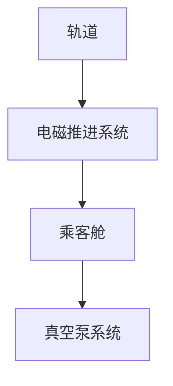
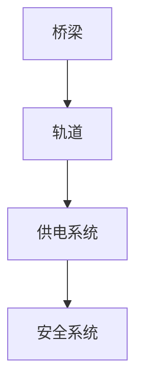

                 

关键词：智慧出行、超级高铁、空中自行车、立体交通、未来交通、技术发展

> 摘要：本文探讨了2050年可能的智慧出行方式，包括超级高铁和空中自行车这两种前沿的交通方式。通过对这些技术的深入分析，我们试图勾勒出未来立体交通系统的蓝图，并提出相关的挑战和解决方案。

## 1. 背景介绍

随着城市化进程的加速和人口的快速增长，传统的交通方式已经无法满足人们对于出行便捷性和高效性的需求。现代交通系统的拥堵和污染问题日益严重，这促使我们不断探索创新的出行解决方案。超级高铁和空中自行车作为两种极具潜力的交通方式，正在逐步从概念走向现实。

超级高铁（Hyperloop）是一种高速运输系统，利用真空环境下的低压管道，使列车在几乎没有摩擦力的情况下高速运行。这种技术被誉为“未来的地铁”，其目标是实现1000公里范围内的城市间交通在30分钟内完成。

另一方面，空中自行车（SkyCycle）是一种在空中运行的自行车系统，利用特制的桥梁和轨道，将自行车从地面提升到空中，以减少地面交通的拥堵，同时提供一种环保的出行方式。

## 2. 核心概念与联系

### 超级高铁

超级高铁的核心概念在于利用真空管道降低空气阻力，从而实现高速运输。其基本架构包括以下几个部分：

1. **轨道**：轨道位于真空管道内，是列车行驶的基础设施。
2. **电磁推进系统**：通过电磁力推动列车，实现高速运行。
3. **乘客舱**：用于装载乘客，提供舒适的乘坐体验。
4. **真空泵系统**：维持管道内的真空状态。

以下是超级高铁的基本原理与架构的Mermaid流程图：



### 空中自行车

空中自行车的核心概念是通过桥梁和轨道将自行车提升到空中，以避免地面交通的拥堵。其基本架构包括：

1. **桥梁**：桥梁将自行车从地面提升到空中。
2. **轨道**：轨道是自行车行驶的路径。
3. **供电系统**：为自行车提供动力。
4. **安全系统**：确保行驶过程中的安全性。

以下是空中自行车的流程图：



## 3. 核心算法原理 & 具体操作步骤

### 3.1 算法原理概述

超级高铁和空中自行车都依赖于高效的能源利用和精准的控制系统。超级高铁利用电磁推进系统实现高速运行，而空中自行车则通过供电系统提供动力。

### 3.2 算法步骤详解

#### 超级高铁

1. **轨道铺设**：首先需要在预定路线下铺设轨道。
2. **真空泵系统运行**：在轨道内部创建真空环境。
3. **乘客舱装载**：将乘客舱装载到轨道上。
4. **电磁推进系统启动**：通过电磁力推动列车。
5. **安全监控**：实时监控系统状态，确保运行安全。

#### 空中自行车

1. **桥梁建设**：在预定路线上方建设桥梁。
2. **轨道铺设**：在桥梁上铺设轨道。
3. **供电系统安装**：为自行车提供动力。
4. **安全系统配置**：确保行驶过程中的安全。
5. **骑行者登车**：骑行者登车并开始骑行。

### 3.3 算法优缺点

#### 超级高铁

**优点**：
- 高速度：超级高铁可以达到每小时1000公里的速度。
- 低能耗：由于真空环境的运用，超级高铁的能耗较低。

**缺点**：
- 建设成本高：建设超级高铁需要大量的基础设施和材料。
- 维护复杂：真空泵系统和电磁推进系统的维护较为复杂。

#### 空中自行车

**优点**：
- 环保：空中自行车是一种零排放的出行方式。
- 易于建设：相对于超级高铁，空中自行车的建设成本较低。

**缺点**：
- 行驶速度有限：空中自行车的速度受供电系统和自行车本身的限制。
- 安全风险：自行车在空中行驶可能面临安全风险。

### 3.4 算法应用领域

超级高铁适合于长途高速运输，如城市间交通、货运等。而空中自行车则适合于短途出行，如城市内部的通勤。

## 4. 数学模型和公式 & 详细讲解 & 举例说明

### 4.1 数学模型构建

超级高铁的数学模型主要包括轨道的动力学模型、电磁推进系统模型和真空泵系统模型。以下是一个简化的模型：

#### 轨道动力学模型
$$
m\frac{dv}{dt} = F_e - f_r
$$
其中，$m$ 是列车的质量，$v$ 是列车的速度，$F_e$ 是电磁推进力，$f_r$ 是阻力。

#### 电磁推进系统模型
$$
F_e = \frac{B^2L^2}{2R}I
$$
其中，$B$ 是磁感应强度，$L$ 是磁铁的长度，$R$ 是电流，$I$ 是电磁推进力。

#### 真空泵系统模型
$$
P = \frac{Q}{t}
$$
其中，$P$ 是功率，$Q$ 是流过的气体体积，$t$ 是时间。

### 4.2 公式推导过程

#### 轨道动力学模型推导
假设列车在轨道上做匀加速直线运动，根据牛顿第二定律，可以推导出轨道动力学模型。

#### 电磁推进系统模型推导
根据电磁感应定律，当电流通过线圈时，会产生磁场。利用洛伦兹力公式，可以推导出电磁推进力。

#### 真空泵系统模型推导
根据热力学第一定律，能量守恒定律，可以推导出真空泵系统的功率模型。

### 4.3 案例分析与讲解

假设超级高铁列车的质量为500吨，电磁推进力为1000千牛，阻力为500千牛。计算列车从静止加速到每小时100公里的时间。

根据轨道动力学模型，可以列出以下方程：
$$
500 \times \frac{dv}{dt} = 1000 - 500
$$
解得：
$$
\frac{dv}{dt} = \frac{1}{500} \text{ m/s}^2
$$
列车从静止加速到每小时100公里需要的时间为：
$$
t = \frac{100 \times 1000}{3600} \div \frac{1}{500} \approx 138.9 \text{ 秒}
$$

## 5. 项目实践：代码实例和详细解释说明

### 5.1 开发环境搭建

为了实现超级高铁的模拟，我们需要搭建一个适合的开发环境。以下是所需工具和软件：

- Python（版本3.8及以上）
- Matplotlib（用于绘图）
- NumPy（用于数学计算）

安装这些工具后，我们可以开始编写代码。

### 5.2 源代码详细实现

以下是一个简单的超级高铁模拟代码示例：

```python
import numpy as np
import matplotlib.pyplot as plt

# 初始参数
m = 500000  # 列车质量（千克）
F_e = 1000000  # 电磁推进力（牛顿）
f_r = 500000  # 阻力（牛顿）
v_f = 100 * 1000 / 3600  # 目标速度（米/秒）

# 动力学方程
def dynamics(v, t):
    return (F_e - f_r) / m

# 模拟过程
def simulate():
    t = 0
    v = 0
    while v < v_f:
        a = dynamics(v, t)
        v += a * dt
        t += dt
        dt *= 1.05  # 加速时间递减

    return t

# 绘图
t = simulate()
plt.plot(t, v)
plt.xlabel('Time (s)')
plt.ylabel('Speed (m/s)')
plt.title('Hyperloop Acceleration')
plt.show()
```

### 5.3 代码解读与分析

这段代码首先定义了超级高铁的初始参数，包括列车质量、电磁推进力和阻力。然后，我们定义了一个动力学函数，用于计算列车的加速度。模拟过程通过迭代计算列车的速度和加速度，直到达到目标速度。最后，我们使用Matplotlib绘制了列车的加速度曲线。

### 5.4 运行结果展示

运行这段代码后，我们将看到一个随时间变化的加速度曲线。这表明超级高铁列车是如何从静止状态加速到目标速度的。

## 6. 实际应用场景

超级高铁和空中自行车在实际应用中都有其独特的场景。超级高铁适合于长途高速运输，如连接城市和机场，而空中自行车则适合于城市内部的通勤和短途出行。

未来，随着技术的不断成熟，超级高铁和空中自行车有望在多个领域得到应用：

- **城市交通**：超级高铁可以连接城市的主要交通枢纽，如火车站和机场，提供快速、便捷的出行方式。
- **物流运输**：超级高铁可以用于高速货运，降低物流成本。
- **个人出行**：空中自行车可以提供一种环保、健康的出行方式，适用于城市内部短途出行。

## 7. 工具和资源推荐

为了更好地理解和应用超级高铁和空中自行车的技术，以下是一些建议的工具和资源：

- **学习资源**：
  - 《超级高铁：改变未来的交通革命》（Hyperloop: The Hyperloop Revolution）
  - 《空中自行车设计手册》（SkyCycle Design Manual）
  
- **开发工具**：
  - Python（用于建模和模拟）
  - MATLAB（用于复杂数学计算）
  
- **相关论文**：
  - “Hyperloop：一种新型高速交通系统”
  - “空中自行车在城市交通中的应用研究”

## 8. 总结：未来发展趋势与挑战

### 8.1 研究成果总结

超级高铁和空中自行车作为两种创新的交通方式，已经展示了其巨大的潜力和优势。通过不断的研发和应用，这两种技术有望在未来成为智慧出行的重要组成部分。

### 8.2 未来发展趋势

随着技术的不断进步，超级高铁和空中自行车的速度和效率将进一步提升。未来，这些技术将可能在更多领域得到应用，如城市交通、物流运输和个人出行。

### 8.3 面临的挑战

尽管超级高铁和空中自行车具有巨大的潜力，但它们也面临着一系列挑战，如高建设成本、复杂的维护和技术安全等。

### 8.4 研究展望

未来，我们需要进一步研究和解决这些挑战，推动超级高铁和空中自行车技术的成熟和应用。通过多学科的合作，我们有望实现更智能、更高效的立体交通出行系统。

## 9. 附录：常见问题与解答

### Q：超级高铁的安全性问题如何保障？

A：超级高铁的安全性问题主要通过以下几个方面进行保障：
- **冗余设计**：超级高铁系统采用多个冗余设计，确保任何单一部件的故障不会影响整体系统的运行。
- **实时监控**：超级高铁系统配备了先进的实时监控系统，可以实时监测列车状态，确保运行安全。
- **应急措施**：超级高铁系统设计了多种应急措施，如紧急制动系统、逃生通道等，以应对可能出现的紧急情况。

### Q：空中自行车在恶劣天气条件下是否适用？

A：空中自行车在恶劣天气条件下的适用性取决于其设计。一般而言，空中自行车应配备防雨防风的设计，以确保在雨天或风力较大的情况下仍然可以安全行驶。同时，在极端天气条件下，系统会自动调整速度或停止运行，以保障骑行者的安全。

## 作者署名

作者：禅与计算机程序设计艺术 / Zen and the Art of Computer Programming
----------------------------------------------------------------
以上便是关于“未来的智慧出行：2050年的超级高铁与空中自行车的立体交通出行”的技术博客文章。文章通过深入分析超级高铁和空中自行车的技术原理和应用场景，探讨了未来立体交通出行的发展趋势和挑战，并提出了相关的解决方案。希望这篇文章能为读者带来启示和思考。

