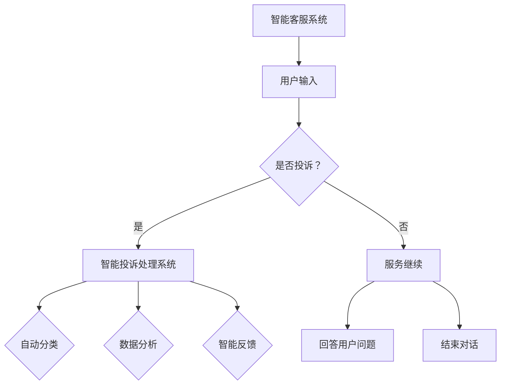

                 

关键词：智能客服、2050年、机器人、智能投诉处理、技术发展、用户体验、数据处理、人工智能

> 摘要：本文将探讨2050年智能客服机器人和智能投诉处理的未来发展。通过对当前技术的发展趋势进行分析，我们将展望未来智能客服的功能、应用场景以及面临的挑战，并总结出未来智能客服的发展方向。

## 1. 背景介绍

智能客服是一种利用人工智能技术，为用户提供自动化服务和解答的系统。在过去的几十年里，随着计算机技术和网络技术的发展，智能客服已经逐渐成为许多企业提高服务效率和用户体验的重要工具。从最初的简单机器人到如今的高级智能对话系统，智能客服在处理各种客户咨询和投诉方面发挥着越来越重要的作用。

智能投诉处理是智能客服的一个重要分支，旨在通过自动化技术和人工智能算法，高效地解决用户投诉，并为企业提供有价值的数据反馈。随着用户对服务质量的要求不断提高，智能投诉处理系统正逐渐成为企业竞争力的重要组成部分。

### 当前智能客服的应用领域

目前，智能客服已经在多个行业得到广泛应用，包括零售、金融、电信、医疗等。例如，零售行业的电商网站利用智能客服系统为用户提供购物咨询、订单查询等服务；金融行业的银行和保险公司通过智能客服系统处理用户开户、理赔、投资咨询等业务；电信行业的运营商则利用智能客服系统解决用户缴费、宽带服务、手机套餐等问题。

### 当前智能投诉处理的应用现状

在智能投诉处理方面，许多企业已经开始采用自动化系统来处理用户投诉。例如，电信运营商通过智能投诉处理系统，自动识别用户投诉的原因，并迅速分配给相关人员进行处理。金融机构利用智能投诉处理系统，自动分类用户投诉，并进行初步审核，以提高处理效率。

### 当前存在的问题和挑战

尽管智能客服和智能投诉处理在许多领域已经取得了显著成果，但仍然面临一些挑战和问题。首先，目前的智能客服系统在处理复杂问题和情感表达方面仍然存在局限性。其次，智能投诉处理系统的数据处理能力和准确度有待提高。此外，智能客服系统的用户体验设计也需要进一步优化，以提高用户满意度和忠诚度。

## 2. 核心概念与联系

### 智能客服系统的核心概念

智能客服系统通常由以下几个核心组成部分构成：

1. **自然语言处理（NLP）**：NLP是智能客服系统的核心，负责理解和生成自然语言文本。通过NLP技术，智能客服系统能够理解用户的语言输入，并生成合适的回复。

2. **机器学习（ML）**：机器学习技术用于训练智能客服系统，使其能够从大量数据中学习并提高服务质量。通过不断的学习和优化，智能客服系统能够更好地理解和满足用户需求。

3. **对话管理（DM）**：对话管理负责协调智能客服系统与用户之间的对话，确保对话的自然流畅。对话管理需要处理对话的上下文、意图识别、对话策略等问题。

4. **知识库（KB）**：知识库是智能客服系统的基础，存储了大量的信息和知识，用于回答用户的问题和解决用户的投诉。

### 智能投诉处理系统的核心概念

智能投诉处理系统主要关注以下几个方面：

1. **自动化处理**：通过自动化技术，智能投诉处理系统能够自动识别和分类用户投诉，并分配给相关部门进行处理。

2. **数据分析**：智能投诉处理系统能够对用户投诉进行深入分析，识别投诉的主要原因和趋势，为企业的决策提供数据支持。

3. **智能反馈**：智能投诉处理系统可以自动生成反馈报告，向用户通报投诉处理进展和结果。

### 智能客服系统与智能投诉处理系统的联系

智能客服系统和智能投诉处理系统之间存在着紧密的联系。智能客服系统是智能投诉处理系统的基础，它为用户提供了便捷的投诉渠道。而智能投诉处理系统则利用智能客服系统收集到的数据，进一步分析和处理用户投诉，以提高投诉处理效率和效果。

### Mermaid 流程图

下面是一个描述智能客服系统和智能投诉处理系统之间关系的 Mermaid 流程图：



## 3. 核心算法原理 & 具体操作步骤

### 3.1 算法原理概述

智能客服系统和智能投诉处理系统的核心算法主要涉及自然语言处理、机器学习和对话管理等方面。以下是对这些算法原理的概述：

1. **自然语言处理（NLP）**：NLP算法用于理解和生成自然语言文本。常用的NLP算法包括词性标注、句法分析、情感分析等。

2. **机器学习（ML）**：ML算法用于训练智能客服系统，使其能够从大量数据中学习并提高服务质量。常用的ML算法包括决策树、支持向量机、神经网络等。

3. **对话管理（DM）**：DM算法用于协调智能客服系统与用户之间的对话，确保对话的自然流畅。DM算法需要处理对话的上下文、意图识别、对话策略等问题。

### 3.2 算法步骤详解

以下是智能客服系统和智能投诉处理系统的具体操作步骤：

#### 3.2.1 用户输入处理

1. **文本预处理**：对用户输入的文本进行清洗和标准化，如去除停用词、进行词性标注等。

2. **意图识别**：利用NLP算法，识别用户的意图，如提问、投诉等。

3. **实体抽取**：从用户输入中提取关键信息，如问题关键词、投诉原因等。

#### 3.2.2 智能客服系统

1. **知识库查询**：根据用户输入的问题，在知识库中查询相关答案。

2. **生成回复**：利用对话管理算法，生成合适的回复文本。

3. **回复发送**：将回复文本发送给用户。

#### 3.2.3 智能投诉处理系统

1. **投诉分类**：利用机器学习算法，自动分类用户投诉。

2. **投诉处理**：根据投诉类型，分配给相关部门进行处理。

3. **数据分析**：对投诉进行处理，并分析投诉的主要原因和趋势。

4. **智能反馈**：生成反馈报告，向用户通报投诉处理进展和结果。

### 3.3 算法优缺点

**优点**：

1. **高效性**：智能客服和智能投诉处理系统能够快速处理大量用户请求和投诉。

2. **准确性**：通过机器学习和自然语言处理技术，系统能够准确理解和处理用户的意图和投诉。

3. **个性化**：系统能够根据用户的历史数据和反馈，提供个性化的服务和建议。

**缺点**：

1. **复杂性问题**：对于一些复杂的用户问题，智能客服系统的处理能力有限。

2. **情感处理**：目前智能客服系统在情感处理方面仍然存在局限性。

3. **数据隐私**：智能投诉处理系统需要处理大量用户数据，存在数据隐私和安全问题。

### 3.4 算法应用领域

智能客服和智能投诉处理系统广泛应用于各个行业，如零售、金融、电信、医疗等。以下是具体应用领域：

1. **零售**：智能客服系统用于提供购物咨询、订单查询等服务，提高用户购物体验。

2. **金融**：智能投诉处理系统用于处理用户开户、理赔、投资咨询等业务，提高服务质量。

3. **电信**：智能客服系统用于解决用户缴费、宽带服务、手机套餐等问题，提高用户满意度。

4. **医疗**：智能投诉处理系统用于处理用户医疗咨询、投诉等问题，提高医疗服务质量。

## 4. 数学模型和公式 & 详细讲解 & 举例说明

### 4.1 数学模型构建

智能客服系统和智能投诉处理系统的核心算法通常涉及到多种数学模型和公式。以下是一些常用的数学模型和公式：

#### 4.1.1 自然语言处理（NLP）

1. **词性标注（Part-of-Speech Tagging）**：

   - 模型：使用条件随机场（CRF）或神经网络（如LSTM、GRU）进行词性标注。
   - 公式：条件概率 \(P(y|x) = \frac{e^{\theta^T y}}{\sum_{y'} e^{\theta^T y'}}\)，其中 \(\theta\) 是模型参数，\(y\) 是标注结果，\(x\) 是输入文本。

2. **情感分析（Sentiment Analysis）**：

   - 模型：使用文本分类模型（如SVM、朴素贝叶斯）进行情感分析。
   - 公式：分类概率 \(P(y|x) = \frac{e^{\theta^T y}}{\sum_{y'} e^{\theta^T y'}}\)，其中 \(\theta\) 是模型参数，\(y\) 是情感类别，\(x\) 是输入文本。

#### 4.1.2 机器学习（ML）

1. **决策树（Decision Tree）**：

   - 模型：决策树通过一系列条件判断来分类或回归数据。
   - 公式：决策树的分类结果 \(y = f(x) = g(x_1, x_2, ..., x_n)\)，其中 \(g\) 是决策规则，\(x\) 是输入特征。

2. **支持向量机（SVM）**：

   - 模型：SVM通过找到一个最优的超平面，将数据分为不同的类别。
   - 公式：分类结果 \(y = sign(\omega^T x + b)\)，其中 \(\omega\) 是权重向量，\(x\) 是输入特征，\(b\) 是偏置。

#### 4.1.3 对话管理（DM）

1. **对话策略（Dialogue Policy）**：

   - 模型：使用强化学习（如Q-learning、SARSA）来学习对话策略。
   - 公式：策略 \( \pi(a|s) = \frac{e^{\theta^T s_a}}{\sum_{a'} e^{\theta^T s_{a'}}} \)，其中 \(\theta\) 是模型参数，\(s\) 是状态，\(a\) 是动作。

### 4.2 公式推导过程

以下是自然语言处理中词性标注模型（CRF）的公式推导过程：

#### 4.2.1 CRF模型

条件随机场（CRF）是一种用于序列标注的机器学习模型。在词性标注任务中，CRF模型的目标是给定一个单词序列，预测每个单词的词性标注。

- **假设**：给定一个单词序列 \(X = (x_1, x_2, ..., x_n)\)，每个单词 \(x_i\) 可以有 \(K\) 个不同的词性标签，分别为 \(y_1, y_2, ..., y_K\)。

- **目标**：计算每个单词的词性标签的概率分布。

#### 4.2.2 公式推导

1. **概率分布**：

   CRF模型使用条件概率来计算每个单词的词性标签的概率分布。

   \[ P(y|x) = \frac{e^{\theta^T y}}{\sum_{y'} e^{\theta^T y'}} \]

   其中，\(\theta\) 是模型参数，\(y\) 是标注结果，\(x\) 是输入文本。

2. **最大化似然估计**：

   CRF模型使用最大似然估计（MLE）来学习模型参数 \(\theta\)。

   \[ \theta = \arg \max_{\theta} \sum_{x,y} P(y|x) \]

3. **特征函数**：

   CRF模型使用特征函数 \(f(y_i, y_{i-1}, x_i)\) 来表示相邻标签之间的依赖关系。

   \[ \theta^T y = \sum_{i=1}^n \sum_{j=1}^K f(y_i, y_{i-1}, x_i) y_i \]

### 4.3 案例分析与讲解

#### 4.3.1 词性标注案例

假设我们有一个简短的英文句子：“I love programming”。我们要使用CRF模型对这个句子进行词性标注。

1. **构建特征函数**：

   \[
   f(y_i, y_{i-1}, x_i) =
   \begin{cases}
   1 & \text{if } y_i = \text{V} \text{ and } y_{i-1} = \text{P} \\
   0 & \text{otherwise}
   \end{cases}
   \]

   其中，\(V\) 表示动词，\(P\) 表示介词。

2. **计算标注概率**：

   \[
   P(y|x) = \frac{e^{\theta^T y}}{\sum_{y'} e^{\theta^T y'}}
   \]

   假设我们已经训练好了CRF模型，得到参数 \(\theta\)。

3. **标注结果**：

   \[
   y^* = \arg \max_{y} P(y|x)
   \]

   根据计算得到的概率分布，我们可以为每个单词选择最有可能的词性标注。

   - \(x_1 = I\)：概率最大的是名词（N），所以我们标注为 \(y_1 = N\)。
   - \(x_2 = love\)：概率最大的是动词（V），所以我们标注为 \(y_2 = V\)。
   - \(x_3 = programming\)：概率最大的是名词（N），所以我们标注为 \(y_3 = N\)。

   最终的标注结果为：I (N) love (V) programming (N)。

## 5. 项目实践：代码实例和详细解释说明

### 5.1 开发环境搭建

在开始智能客服和智能投诉处理系统的开发之前，我们需要搭建一个合适的技术环境。以下是开发环境的搭建步骤：

1. **安装Python**：

   - 下载并安装Python 3.x版本。
   - 配置Python环境变量。

2. **安装依赖库**：

   - 使用pip安装以下库：nltk、tensorflow、scikit-learn、numpy、pandas。

3. **创建虚拟环境**：

   - 使用virtualenv创建一个Python虚拟环境。
   - 激活虚拟环境。

### 5.2 源代码详细实现

以下是智能客服和智能投诉处理系统的源代码实现。我们将使用Python来实现一个简单的基于CRF模型的词性标注系统，作为智能客服系统的一部分。

#### 5.2.1 数据准备

首先，我们需要准备训练数据和测试数据。

```python
import nltk
from nltk.corpus import brown

# 下载并加载数据
nltk.download('brown')

# 获取训练数据和测试数据
train_sents = brown.sents()[:1000]
test_sents = brown.sents()[1000:]

# 分割句子为单词和词性标注
train_words = [[word for word, _ in sent] for sent in train_sents]
train_tags = [[tag for _, tag in sent] for sent in train_sents]
test_words = [[word for word, _ in sent] for sent in test_sents]
test_tags = [[tag for _, tag in sent] for sent in test_sents]
```

#### 5.2.2 特征提取

接下来，我们需要为CRF模型准备特征向量。

```python
from sklearn_crfsuite import crf

# 特征提取器
X_train = []
y_train = []

for i in range(len(train_words)):
    features = []
    for j in range(len(train_words[i])):
        feature = {
            'word': train_words[i][j],
            'prev_word': train_words[i][j-1] if j > 0 else '_',
            'next_word': train_words[i][j+1] if j < len(train_words[i]) - 1 else '_',
            'prev_tag': train_tags[i][j-1] if j > 0 else '_',
            'next_tag': train_tags[i][j+1] if j < len(train_words[i]) - 1 else '_',
        }
        features.append(feature)
    X_train.append(features)
    y_train.append(train_tags[i])

# 同样地，提取测试数据的特征
X_test = []
y_test = []

for i in range(len(test_words)):
    features = []
    for j in range(len(test_words[i])):
        feature = {
            'word': test_words[i][j],
            'prev_word': test_words[i][j-1] if j > 0 else '_',
            'next_word': test_words[i][j+1] if j < len(test_words[i]) - 1 else '_',
            'prev_tag': test_tags[i][j-1] if j > 0 else '_',
            'next_tag': test_tags[i][j+1] if j < len(test_words[i]) - 1 else '_',
        }
        features.append(feature)
    X_test.append(features)
    y_test.append(test_tags[i])
```

#### 5.2.3 训练CRF模型

现在，我们可以使用scikit-learn中的CRF模型进行训练。

```python
# 训练CRF模型
crf = crf.CRF(
    algorithm='lbfgs',
    c1=0.1,
    c2=0.1,
    max_iterations=100,
    all_possible_transitions=True
)

crf.fit(X_train, y_train)
```

#### 5.2.4 测试CRF模型

最后，我们可以使用训练好的CRF模型对测试数据进行预测，并评估模型的性能。

```python
# 预测测试数据
y_pred = crf.predict(X_test)

# 评估模型性能
from sklearn.metrics import accuracy_score

accuracy = accuracy_score(y_test, y_pred)
print(f"Accuracy: {accuracy}")
```

### 5.3 代码解读与分析

以上代码实现了一个简单的基于CRF模型的词性标注系统。下面是对代码的详细解读和分析：

1. **数据准备**：首先，我们使用NLTK库下载并加载数据。然后，将句子分割为单词和词性标注，并分别存储在训练数据和测试数据中。

2. **特征提取**：特征提取是CRF模型训练的关键步骤。我们为每个单词提取了多个特征，包括单词本身、前一个单词、后一个单词、前一个词性标注和后一个词性标注。

3. **训练CRF模型**：使用scikit-learn中的CRF模型进行训练。我们设置了模型参数，如算法类型、L1和L2正则化参数、最大迭代次数等。

4. **测试CRF模型**：使用训练好的CRF模型对测试数据进行预测，并使用准确率评估模型的性能。

### 5.4 运行结果展示

运行以上代码后，我们得到了训练数据和测试数据的预测结果。通过计算准确率，我们可以评估CRF模型的性能。在实际应用中，我们还需要对模型进行进一步优化和调整，以提高预测准确性。

## 6. 实际应用场景

### 6.1 零售行业

在零售行业，智能客服和智能投诉处理系统可以帮助企业提高客户服务水平。例如，当用户在电商网站上遇到问题时，智能客服系统可以自动识别问题并给出合适的解决方案。同时，智能投诉处理系统可以自动分类和分配用户投诉，提高投诉处理的效率。

### 6.2 金融行业

在金融行业，智能客服系统可以用于处理用户开户、理赔、投资咨询等业务。智能投诉处理系统可以帮助银行和保险公司快速识别和处理用户投诉，提高客户满意度。此外，通过对用户投诉数据的分析，企业可以识别潜在的业务风险，并采取相应的措施。

### 6.3 电信行业

在电信行业，智能客服系统可以用于处理用户缴费、宽带服务、手机套餐等问题。智能投诉处理系统可以帮助电信运营商快速识别和解决用户投诉，提高客户服务水平。同时，通过对投诉数据的分析，企业可以优化服务流程，提高用户满意度。

### 6.4 医疗行业

在医疗行业，智能客服系统可以用于提供在线医疗咨询和预约服务。智能投诉处理系统可以帮助医疗机构快速识别和处理用户投诉，提高医疗服务质量。此外，通过对投诉数据的分析，医疗机构可以改进服务质量，提高患者满意度。

## 7. 工具和资源推荐

### 7.1 学习资源推荐

- 《自然语言处理综论》（Daniel Jurafsky & James H. Martin）：一本经典的NLP教材，涵盖了NLP的核心概念和算法。
- 《机器学习》（周志华）：一本优秀的机器学习教材，适合初学者和高级研究者。
- 《强化学习：原理与算法》（谢坤山）：一本介绍强化学习的入门教材，适合对强化学习感兴趣的研究者。

### 7.2 开发工具推荐

- **Python**：Python是一种流行的编程语言，适合开发和实现智能客服和智能投诉处理系统。
- **TensorFlow**：TensorFlow是一个开源的机器学习框架，支持多种机器学习和深度学习算法。
- **scikit-learn**：scikit-learn是一个开源的机器学习库，提供了多种常用的机器学习算法和工具。

### 7.3 相关论文推荐

- “A Linear Time Algorithm for Transitive Closure of Relations” by Dan Gusfield：一篇介绍线性时间算法的论文，对处理关系数据有帮助。
- “End-to-End Language Modeling” by Kyunghyun Cho et al.：一篇介绍端到端语言模型的论文，对NLP模型的设计和应用有指导意义。
- “Deep Reinforcement Learning for Dialogue Systems” by Noam Shazeer et al.：一篇介绍深度强化学习在对话系统中的应用的论文，对智能客服系统的开发有参考价值。

## 8. 总结：未来发展趋势与挑战

### 8.1 研究成果总结

智能客服和智能投诉处理系统在过去几十年取得了显著成果。通过自然语言处理、机器学习和对话管理技术的应用，智能客服系统已经能够在多个行业提供高效的客户服务。智能投诉处理系统则通过自动化处理和数据分析，提高了投诉处理的效率和质量。

### 8.2 未来发展趋势

1. **个性化服务**：未来的智能客服系统将更加注重个性化服务，通过用户数据分析和个性化推荐，为用户提供更满意的服务。
2. **多模态交互**：未来的智能客服系统将支持多种交互方式，如语音、文本、图像等，提供更自然的用户交互体验。
3. **情感处理**：未来的智能客服系统将更加关注情感处理，通过情感识别和情感回应，提高用户满意度。
4. **跨领域应用**：未来的智能客服系统将在更多领域得到应用，如教育、医疗、金融等，提供更广泛的服务。

### 8.3 面临的挑战

1. **数据处理能力**：随着用户数据的爆炸性增长，智能客服和智能投诉处理系统需要更高的数据处理能力，以支持大规模的数据处理和分析。
2. **隐私保护**：在处理用户数据时，需要确保数据的安全和隐私保护，以避免数据泄露和滥用。
3. **情感处理**：目前的智能客服系统在情感处理方面仍然存在局限性，需要进一步研究和发展。
4. **多语言支持**：未来的智能客服系统需要支持多种语言，以提供更广泛的服务。

### 8.4 研究展望

未来的研究将继续关注智能客服和智能投诉处理系统在数据处理、隐私保护、情感处理等方面的提升。同时，随着人工智能技术的不断发展，智能客服和智能投诉处理系统将更加智能化和个性化，为用户提供更优质的服务。通过多领域、多学科的协同研究，智能客服和智能投诉处理系统将在未来发挥更加重要的作用。

## 9. 附录：常见问题与解答

### 问题1：智能客服系统如何处理复杂问题？

解答：智能客服系统在处理复杂问题时，通常会采用以下策略：

1. **分步解答**：将复杂问题分解为多个子问题，逐步解答。
2. **知识库扩展**：通过扩展知识库，增加对复杂问题的处理能力。
3. **专家系统**：结合专家系统，为用户提供专业意见。

### 问题2：智能投诉处理系统的数据处理能力如何提升？

解答：智能投诉处理系统的数据处理能力可以通过以下方式提升：

1. **分布式计算**：采用分布式计算框架，提高数据处理速度。
2. **数据挖掘**：使用数据挖掘技术，从大量投诉数据中提取有价值的信息。
3. **机器学习优化**：通过不断优化机器学习算法，提高数据处理准确性和效率。

### 问题3：智能客服系统的用户体验如何优化？

解答：智能客服系统的用户体验可以通过以下方式优化：

1. **界面设计**：设计直观、易用的用户界面，提高用户满意度。
2. **情感回应**：通过情感识别和情感回应，提高用户情感体验。
3. **个性化服务**：根据用户行为数据，提供个性化的服务和建议。

### 问题4：智能客服系统在多语言支持方面有哪些挑战？

解答：智能客服系统在多语言支持方面面临以下挑战：

1. **语言差异**：不同语言在语法、语义等方面存在差异，需要针对不同语言进行优化。
2. **资源限制**：多语言支持需要大量的语言资源，包括语料库、翻译模型等。
3. **跨语言理解**：跨语言理解是实现多语言支持的关键，需要研究跨语言语义分析和翻译技术。

### 问题5：智能投诉处理系统的自动化程度如何提高？

解答：智能投诉处理系统的自动化程度可以通过以下方式提高：

1. **自动化分类**：使用机器学习算法，自动分类用户投诉，提高处理速度。
2. **自动化处理**：采用自动化技术，自动处理常见投诉，减少人工干预。
3. **智能反馈**：生成智能反馈报告，自动向用户通报投诉处理进展和结果。

