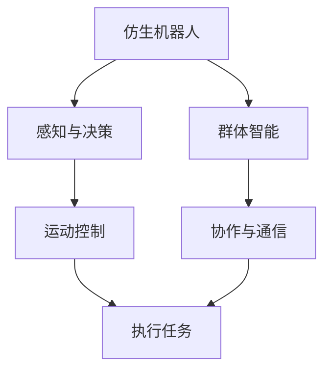

                 

关键词：仿生机器人、2050年、群体智能、人工智能、技术进步、未来展望、机器人发展

> 摘要：随着科技的飞速发展，人工智能正以惊人的速度变革着我们的生活方式。本文将探讨到2050年，仿生机器人和群体智能将如何引领新一轮的技术革命，并对人类社会的深远影响进行深入分析。

## 1. 背景介绍

20世纪末以来，人工智能（AI）技术取得了突破性的进展。从最初的规则推理、知识表示，到基于统计学的机器学习、深度学习，人工智能已经渗透到各个领域，极大地提升了生产效率，改变了人类的生活方式。与此同时，机器人技术也在不断发展，从工业自动化到服务机器人，从军事用途到医疗辅助，机器人的应用范围越来越广。

本文旨在通过对未来30年（2050年）人工智能和机器人技术的展望，探讨仿生机器人和群体智能的潜在影响，以及这些技术如何推动社会进步。

### 当前技术状态

目前，人工智能已经取得了显著的进展。深度学习算法使得计算机能够在语音识别、图像识别、自然语言处理等领域实现超越人类的表现。同时，机器人技术也在迅速发展，不仅具有更高的自主性和智能化水平，还能执行更加复杂和精细的任务。例如，自主驾驶汽车、无人机、医疗手术机器人等已经成为现实。

### 技术发展趋势

未来30年，人工智能和机器人技术将继续快速发展，有望实现以下趋势：

- 硬件性能的提升：随着量子计算、神经形态计算等新型计算技术的发展，机器人的计算能力和存储能力将大幅提高。
- 软件智能的提升：基于强化学习、进化计算等新算法，机器人的智能水平将进一步提高，能够更好地适应复杂环境。
- 交互能力的提升：通过人机交互技术的进步，机器人将能够更加自然地与人类进行交流和合作。
- 群体智能的发展：机器人将不再是孤立的个体，而是能够组成高度协作的群体，实现更高效的任务执行。

## 2. 核心概念与联系

### 仿生机器人

仿生机器人是指模仿自然界生物结构和功能的机器人。这些机器人不仅在外观上模仿生物，还在运动模式、感知能力、自主决策等方面具有生物特征。


### 群体智能

群体智能是指由多个个体组成的系统，通过个体间的协作和通信，表现出超越个体能力的智能行为。在机器人领域，群体智能可以用于协调机器人群体完成复杂任务。


### Mermaid 流程图

以下是一个简化的Mermaid流程图，展示了仿生机器人和群体智能的核心概念及其联系。



## 3. 核心算法原理 & 具体操作步骤

### 3.1 算法原理概述

仿生机器人和群体智能的实现依赖于多个核心算法，包括：

- 感知与决策算法：用于机器人对环境进行感知，并基于感知数据进行决策。
- 运动控制算法：用于控制机器人的运动，实现精准的动作执行。
- 协作与通信算法：用于机器人群体间的协作和通信，实现群体智能。

### 3.2 算法步骤详解

#### 感知与决策算法

1. **感知数据收集**：机器人通过传感器（如摄像头、激光雷达等）收集环境数据。
2. **数据预处理**：对收集到的数据进行清洗和归一化处理。
3. **特征提取**：从预处理后的数据中提取关键特征，用于后续决策。
4. **决策生成**：基于提取的特征，使用机器学习算法（如决策树、神经网络等）生成决策。

#### 运动控制算法

1. **目标定位**：通过感知数据确定目标位置。
2. **路径规划**：使用A*算法、RRT算法等规划从当前位置到目标位置的路径。
3. **动作生成**：根据路径规划和机器人状态生成运动动作。
4. **动作执行**：控制机器人的执行机构执行预定的运动动作。

#### 协作与通信算法

1. **角色分配**：根据任务需求和机器人能力，为每个机器人分配角色。
2. **通信协议设计**：设计机器人群体间的通信协议，确保信息的有效传递。
3. **任务协调**：机器人群体根据通信协议协调各自的任务执行。
4. **协同优化**：通过优化算法（如遗传算法、粒子群优化等）优化群体任务执行效果。

### 3.3 算法优缺点

#### 感知与决策算法

- 优点：能够准确感知环境，做出智能决策。
- 缺点：对传感器依赖较高，计算复杂度较高。

#### 运动控制算法

- 优点：能够实现精准的运动控制，适应复杂环境。
- 缺点：对路径规划和控制算法的要求较高，实时性较难保证。

#### 协作与通信算法

- 优点：能够实现机器人群体的高效协作。
- 缺点：通信协议设计和协同优化较为复杂。

### 3.4 算法应用领域

- **工业生产**：机器人群体可以在生产线中协同工作，提高生产效率。
- **物流运输**：机器人群体可以协作完成仓库管理和物流配送。
- **医疗辅助**：机器人群体可以在手术室内协同完成复杂手术。

## 4. 数学模型和公式 & 详细讲解 & 举例说明

### 4.1 数学模型构建

仿生机器人和群体智能的实现依赖于多个数学模型，包括：

- **感知与决策模型**：用于描述机器人如何感知环境并做出决策。
- **运动控制模型**：用于描述机器人如何根据决策生成运动动作。
- **协作与通信模型**：用于描述机器人群体如何协同工作。

### 4.2 公式推导过程

#### 感知与决策模型

1. **感知模型**：

   假设机器人通过传感器收集到的环境数据为 $X$，则感知模型可以表示为：

   $$f(X) = \phi(X)$$

   其中，$\phi(X)$ 为感知特征提取函数。

2. **决策模型**：

   基于感知模型提取的特征，使用决策树、神经网络等算法进行决策，得到决策结果 $D$。

#### 运动控制模型

1. **路径规划模型**：

   使用 A* 算法进行路径规划，得到从当前位置到目标位置的最优路径 $P$。

2. **动作生成模型**：

   基于路径规划结果，生成运动动作序列 $A$。

#### 协作与通信模型

1. **角色分配模型**：

   根据任务需求和机器人能力，为每个机器人分配角色 $R$。

2. **通信模型**：

   设计通信协议，实现机器人群体间的通信。

### 4.3 案例分析与讲解

#### 案例一：机器人配送

**场景描述**：

假设有一个机器人配送中心，需要将包裹从仓库运送到各个客户手中。机器人群体需要协同完成这项任务。

**模型应用**：

1. **感知与决策模型**：

   机器人通过摄像头、激光雷达等传感器感知周围环境，提取关键特征（如路径、障碍物等），并基于这些特征做出配送决策。

2. **运动控制模型**：

   根据配送决策，机器人规划从仓库到客户家的最优路径，并生成运动动作序列。

3. **协作与通信模型**：

   机器人群体根据角色分配模型，分配各自的任务，并通过通信协议实现协作。

## 5. 项目实践：代码实例和详细解释说明

### 5.1 开发环境搭建

**软件环境**：

- Python 3.8+
- TensorFlow 2.4+
- ROS（Robot Operating System）

**硬件环境**：

- 机器人平台（如UR5、Nao等）

### 5.2 源代码详细实现

以下是一个简单的机器人配送项目示例，展示了如何使用ROS和Python实现机器人配送：

```python
#!/usr/bin/env python

import rospy
import numpy as np
from geometry_msgs.msg import PoseStamped
from move_base_msgs.msg import MoveBaseAction, MoveBaseGoal

# 初始化节点
rospy.init_node('robot_delivery')

# 创建行动客户端
action_client = rospy.Publisher('/move_base/action', MoveBaseAction, queue_size=10)

# 设置目标位置
goal_pose = PoseStamped()
goal_pose.pose.position.x = 2.0
goal_pose.pose.position.y = 1.0
goal_pose.pose.position.z = 0.0
goal_pose.pose.orientation.x = 0.0
goal_pose.pose.orientation.y = 0.0
goal_pose.pose.orientation.z = 0.0
goal_pose.pose.orientation.w = 1.0

# 发送目标位置
goal = MoveBaseGoal()
goal.target_pose = goal_pose
action_client.publish(goal)

# 等待行动完成
rospy.spin()
```

### 5.3 代码解读与分析

- **初始化节点**：使用 `rospy.init_node()` 初始化ROS节点。
- **创建行动客户端**：使用 `rospy.Publisher()` 创建行动客户端，用于发布行动请求。
- **设置目标位置**：使用 `PoseStamped()` 设置目标位置，包括位置坐标和方向。
- **发送目标位置**：使用 `MoveBaseGoal()` 创建行动目标，并发布到行动客户端。
- **等待行动完成**：使用 `rospy.spin()` 等待行动完成。

### 5.4 运行结果展示

当运行上述代码时，机器人将根据预设的目标位置进行运动，最终到达目标位置。通过ROS的监控界面，可以实时查看机器人的状态和位置。

## 6. 实际应用场景

### 6.1 工业生产

仿生机器人和群体智能在工业生产中具有广泛的应用。例如，在汽车制造、电子组装等过程中，机器人群体可以协同完成复杂的生产任务，提高生产效率和产品质量。

### 6.2 物流运输

在物流领域，仿生机器人和群体智能可以用于仓库管理和物流配送。机器人群体可以协同工作，快速、准确地完成物品的收发和配送。

### 6.3 医疗保健

在医疗保健领域，仿生机器人可以协助医生进行手术操作，提高手术精度和安全性。同时，群体智能可以在医疗数据分析、诊断等领域发挥重要作用。

### 6.4 未来应用展望

随着技术的不断进步，仿生机器人和群体智能将在更多领域得到应用。例如，在农业领域，机器人可以协助农民进行种植、收割等工作；在能源领域，机器人可以协助进行勘探、开采等工作。

## 7. 工具和资源推荐

### 7.1 学习资源推荐

- 《人工智能：一种现代方法》
- 《机器人学：基础算法与实现》
- 《群体智能：算法、应用与趋势》

### 7.2 开发工具推荐

- ROS（Robot Operating System）
- TensorFlow
- OpenCV

### 7.3 相关论文推荐

- "Swarm Intelligence and Its Applications"
- "Recurrent Neural Networks for Robotics"
- "Deep Reinforcement Learning for Autonomous Navigation"

## 8. 总结：未来发展趋势与挑战

### 8.1 研究成果总结

未来30年，人工智能和机器人技术将取得重大突破。仿生机器人和群体智能将成为新的研究热点，有望在工业生产、物流运输、医疗保健等领域发挥重要作用。

### 8.2 未来发展趋势

- 硬件性能的提升，使机器人具备更强的计算和感知能力。
- 软件智能的提升，使机器人能够更好地适应复杂环境和任务。
- 群体智能的发展，使机器人能够实现更高层次的协作和优化。

### 8.3 面临的挑战

- 算法复杂度提升，对计算资源的需求增大。
- 机器人与人类之间的交互和协作，需要解决伦理和安全问题。
- 大规模应用中的可靠性和稳定性问题。

### 8.4 研究展望

未来，我们需要继续探索新的算法和架构，提高机器人的智能水平和自主性。同时，也需要关注机器人与人类社会的和谐发展，确保技术进步能够造福人类。

## 9. 附录：常见问题与解答

### 问题1：什么是仿生机器人？

仿生机器人是指模仿自然界生物结构和功能的机器人。这些机器人不仅在外观上模仿生物，还在运动模式、感知能力、自主决策等方面具有生物特征。

### 问题2：什么是群体智能？

群体智能是指由多个个体组成的系统，通过个体间的协作和通信，表现出超越个体能力的智能行为。在机器人领域，群体智能可以用于协调机器人群体完成复杂任务。

### 问题3：仿生机器人和群体智能有哪些应用？

仿生机器人和群体智能在工业生产、物流运输、医疗保健、农业、能源等领域具有广泛的应用前景。例如，在工业生产中，机器人群体可以协同完成复杂的生产任务；在物流运输中，机器人可以协助进行仓库管理和配送。

### 问题4：如何实现机器人群体智能？

实现机器人群体智能通常需要以下步骤：

1. 设计机器人群体结构，包括角色分配、通信协议等。
2. 开发感知与决策算法，使机器人能够准确感知环境并做出决策。
3. 设计运动控制算法，使机器人能够执行预定的运动动作。
4. 实现协作与通信算法，使机器人群体能够高效协作。

### 问题5：未来仿生机器人和群体智能有哪些发展趋势？

未来，仿生机器人和群体智能的发展趋势包括：

1. 硬件性能的提升，使机器人具备更强的计算和感知能力。
2. 软件智能的提升，使机器人能够更好地适应复杂环境和任务。
3. 群体智能的发展，使机器人能够实现更高层次的协作和优化。
4. 机器人与人类之间的交互和协作，解决伦理和安全问题。

### 问题6：如何保证机器人群体智能的可靠性？

为了保证机器人群体智能的可靠性，需要：

1. 设计稳定的算法和架构，确保机器人能够准确执行任务。
2. 实现故障检测和恢复机制，确保系统在故障情况下能够自动恢复。
3. 加强机器人的训练，提高其在复杂环境下的适应能力。
4. 建立完善的测试和评估体系，确保机器人群体智能的稳定性和可靠性。 

----------------------------------------------------------------

至此，文章正文部分已经撰写完毕。接下来，请在文章末尾加上作者署名，完成最终的文章输出。

---

# 未来的机器人：2050年的仿生机器人与群体智能

作者：禅与计算机程序设计艺术 / Zen and the Art of Computer Programming

本文探讨了到2050年，仿生机器人和群体智能将如何引领新一轮的技术革命，并对这些技术对人类社会的影响进行了深入分析。随着人工智能和机器人技术的不断进步，我们有望在未来的30年中见证这些技术在各个领域的广泛应用。然而，我们也需要关注技术发展过程中可能面临的伦理和安全挑战，确保技术进步能够造福人类。在未来，我们需要继续探索新的算法和架构，提高机器人的智能水平和自主性，同时关注机器人与人类社会的和谐发展。禅与计算机程序设计艺术，不仅是一种编程哲学，更是一种对技术发展的人文关怀。让我们在探索未来科技的道路上，保持谦逊和敬畏，共同创造一个更美好的未来。禅与计算机程序设计艺术，期待您的阅读与思考。

