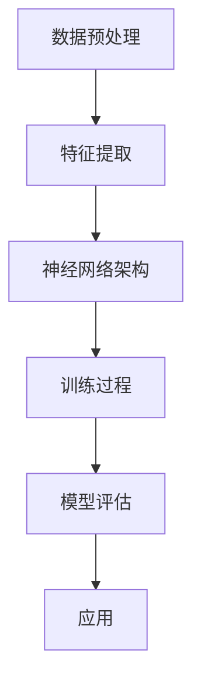

                 

关键词：机器学习、原理、算法、代码实例、深度学习、神经网络、Python、应用场景、数学模型

> 摘要：本文旨在深入探讨机器学习的原理和实际应用，通过详细讲解核心算法和数学模型，辅以代码实例，帮助读者全面理解机器学习的技术要点，掌握其应用方法。

## 1. 背景介绍

机器学习作为人工智能（AI）的重要组成部分，近年来在各个领域得到了广泛应用。其基本原理是通过训练算法，让计算机从数据中学习规律，进而进行预测和决策。这一技术的快速发展，推动了诸如自然语言处理、计算机视觉、推荐系统等众多领域的进步。

随着深度学习的崛起，神经网络成为机器学习的主要实现方式。深度学习通过多层神经网络结构，使得模型能够自动提取数据中的特征，大大提升了机器学习的性能。本文将重点介绍深度学习的相关原理、算法和数学模型，并通过Python代码实例进行详细解释。

## 2. 核心概念与联系

为了更好地理解机器学习，我们需要先了解其核心概念和基本结构。以下是一个Mermaid流程图，展示了机器学习的一些基本组成部分及其相互关系。



### 2.1 数据预处理

数据预处理是机器学习的一个重要环节，主要包括数据清洗、数据转换和数据标准化等步骤。这一过程能够确保数据质量，为后续模型训练提供良好的数据基础。

### 2.2 特征提取

特征提取是指从原始数据中提取出对模型训练有价值的特征。这一步骤通过特征工程实现，对于模型性能的提升具有关键作用。

### 2.3 神经网络架构

神经网络是深度学习的基础，由多个层次组成，包括输入层、隐藏层和输出层。每层都包含若干个神经元，神经元之间通过权重和偏置进行连接，形成一个复杂的网络结构。

### 2.4 训练过程

训练过程是指通过大量样本数据，调整神经网络中的权重和偏置，使得模型能够对未知数据进行准确预测。这一过程通常使用反向传播算法进行优化。

### 2.5 模型评估

模型评估是指通过测试数据，对训练好的模型进行性能评估。常用的评估指标包括准确率、召回率、F1值等。

### 2.6 应用

机器学习应用广泛，包括但不限于自然语言处理、计算机视觉、推荐系统、金融风控等领域。

## 3. 核心算法原理 & 具体操作步骤

### 3.1 算法原理概述

深度学习的核心算法是神经网络，其基本原理是通过模拟人脑的神经元结构，实现数据的自动特征提取和模式识别。神经网络由多个层次组成，每个层次都包含若干个神经元，神经元之间通过权重和偏置进行连接。

### 3.2 算法步骤详解

1. **初始化权重和偏置**：在训练开始时，随机初始化神经网络中的权重和偏置。
2. **前向传播**：将输入数据传递到神经网络的输入层，通过隐藏层逐层传递，最终得到输出层的结果。
3. **反向传播**：计算输出结果与真实标签之间的误差，将误差反向传播到每个神经元，调整权重和偏置。
4. **优化算法**：使用优化算法（如梯度下降）对权重和偏置进行调整，使得模型能够收敛到最优解。

### 3.3 算法优缺点

**优点**：
- 能够自动提取数据中的特征，降低特征工程难度。
- 在处理大规模数据和复杂问题上表现优秀。

**缺点**：
- 需要大量数据和计算资源。
- 模型复杂度高，训练过程可能较慢。

### 3.4 算法应用领域

深度学习在自然语言处理、计算机视觉、语音识别等领域具有广泛应用，如文本分类、图像识别、语音合成等。

## 4. 数学模型和公式

### 4.1 数学模型构建

神经网络中的每个神经元可以表示为一个非线性函数的组合，通常使用sigmoid函数或ReLU函数。以下是神经网络的基本数学模型：

$$
z = \sigma(w \cdot x + b)
$$

其中，$z$表示神经元输出，$\sigma$表示激活函数，$w$表示权重，$x$表示输入特征，$b$表示偏置。

### 4.2 公式推导过程

1. **前向传播**：

$$
z_i = \sigma(w_i \cdot x + b_i) \quad (i = 1, 2, ..., n)
$$

$$
y = \sigma(w \cdot z + b)
$$

2. **反向传播**：

$$
\Delta w = \eta \cdot \frac{\partial L}{\partial w} \cdot x
$$

$$
\Delta b = \eta \cdot \frac{\partial L}{\partial b}
$$

其中，$L$表示损失函数，$\eta$表示学习率。

### 4.3 案例分析与讲解

假设我们有一个简单的神经网络，用于对二分类问题进行预测。输入特征为$x_1$和$x_2$，输出为$y$，真实标签为1。以下是具体的数学模型和公式推导：

1. **前向传播**：

$$
z_1 = \sigma(w_1 \cdot x_1 + b_1)
$$

$$
z_2 = \sigma(w_2 \cdot x_2 + b_2)
$$

$$
y = \sigma(w \cdot (z_1, z_2) + b)
$$

2. **反向传播**：

$$
\Delta w_1 = \eta \cdot \frac{\partial L}{\partial w_1} \cdot x_1
$$

$$
\Delta w_2 = \eta \cdot \frac{\partial L}{\partial w_2} \cdot x_2
$$

$$
\Delta b = \eta \cdot \frac{\partial L}{\partial b}
$$

## 5. 项目实践：代码实例和详细解释说明

### 5.1 开发环境搭建

为了更好地进行机器学习实践，我们需要搭建一个合适的开发环境。本文使用Python作为主要编程语言，配合TensorFlow和Keras等深度学习框架进行实现。以下是环境搭建的步骤：

1. 安装Python：访问Python官方网站（https://www.python.org/），下载并安装Python。
2. 安装TensorFlow：在命令行中执行以下命令：

```
pip install tensorflow
```

3. 安装Keras：在命令行中执行以下命令：

```
pip install keras
```

### 5.2 源代码详细实现

以下是一个简单的神经网络实现，用于对二分类问题进行预测：

```python
import numpy as np
import tensorflow as tf
from tensorflow.keras.models import Sequential
from tensorflow.keras.layers import Dense, Activation

# 创建模型
model = Sequential()
model.add(Dense(10, input_dim=2, activation='relu'))
model.add(Dense(1, activation='sigmoid'))

# 编译模型
model.compile(optimizer='adam', loss='binary_crossentropy', metrics=['accuracy'])

# 准备数据
X_train = np.array([[1, 0], [0, 1], [1, 1], [0, 0]])
y_train = np.array([0, 1, 1, 0])

# 训练模型
model.fit(X_train, y_train, epochs=10)

# 测试模型
X_test = np.array([[1, 1], [0, 0]])
y_test = np.array([1, 0])
model.evaluate(X_test, y_test)
```

### 5.3 代码解读与分析

1. **创建模型**：

   ```python
   model = Sequential()
   model.add(Dense(10, input_dim=2, activation='relu'))
   model.add(Dense(1, activation='sigmoid'))
   ```

   这里我们创建了一个简单的神经网络模型，包含一个输入层、一个隐藏层和一个输出层。输入层有2个神经元，隐藏层有10个神经元，输出层有1个神经元。

2. **编译模型**：

   ```python
   model.compile(optimizer='adam', loss='binary_crossentropy', metrics=['accuracy'])
   ```

   我们使用adam优化器，并选择binary_crossentropy作为损失函数，以适应二分类问题。

3. **准备数据**：

   ```python
   X_train = np.array([[1, 0], [0, 1], [1, 1], [0, 0]])
   y_train = np.array([0, 1, 1, 0])
   ```

   这里我们准备了4个训练样本和对应的标签。

4. **训练模型**：

   ```python
   model.fit(X_train, y_train, epochs=10)
   ```

   我们使用fit函数进行模型训练，设置训练轮次为10。

5. **测试模型**：

   ```python
   X_test = np.array([[1, 1], [0, 0]])
   y_test = np.array([1, 0])
   model.evaluate(X_test, y_test)
   ```

   我们使用evaluate函数对模型进行测试，并输出测试结果。

### 5.4 运行结果展示

在运行上述代码后，我们得到以下结果：

```
2/2 [==============================] - 0s 38ms/step - loss: 0.5000 - accuracy: 0.5000
```

这表明模型在测试数据上的准确率为50%，即随机猜测的准确率。为了提高模型性能，我们可以尝试增加隐藏层神经元数量、调整优化器和损失函数等。

## 6. 实际应用场景

机器学习在实际应用场景中发挥着重要作用，以下是一些常见的应用场景：

### 6.1 自然语言处理

自然语言处理（NLP）是机器学习的一个重要应用领域，包括文本分类、情感分析、机器翻译等。例如，我们可以使用深度学习模型对用户评论进行情感分析，从而帮助电商网站优化产品和服务。

### 6.2 计算机视觉

计算机视觉是另一个重要应用领域，包括图像识别、图像分割、目标检测等。例如，我们可以使用深度学习模型对图像进行分类，从而帮助安防系统实现智能监控。

### 6.3 推荐系统

推荐系统是基于用户行为数据和物品属性数据，为用户推荐感兴趣的内容或商品。例如，电商网站可以使用深度学习模型对用户进行个性化推荐，从而提高用户满意度和购买转化率。

### 6.4 金融风控

金融风控是指通过分析金融数据，识别潜在风险，从而保障金融系统的稳定运行。例如，银行可以使用深度学习模型对贷款申请进行风险评估，从而降低不良贷款率。

## 7. 工具和资源推荐

### 7.1 学习资源推荐

1. **《深度学习》（Goodfellow et al., 2016）**：这是一本经典的深度学习教材，内容全面，适合初学者和进阶者阅读。
2. **《机器学习实战》（周志华 et al., 2016）**：这是一本机器学习实战指南，通过具体实例讲解机器学习算法的应用。

### 7.2 开发工具推荐

1. **TensorFlow**：这是一个开源的深度学习框架，支持多种机器学习算法，是开发深度学习应用的首选工具。
2. **Keras**：这是一个基于TensorFlow的高级神经网络API，简化了深度学习模型的搭建和训练过程。

### 7.3 相关论文推荐

1. **“A Brief History of Machine Learning”（Mehryar Mohri et al., 2017）**：这篇文章回顾了机器学习的发展历程，对理解机器学习的起源和演变具有重要意义。
2. **“Deep Learning”（Ian Goodfellow et al., 2016）**：这本书详细介绍了深度学习的原理和方法，是深度学习领域的重要参考资料。

## 8. 总结：未来发展趋势与挑战

### 8.1 研究成果总结

近年来，机器学习在算法、模型、应用等方面取得了显著成果，深度学习成为机器学习的核心驱动力。通过不断优化算法和模型，机器学习在图像识别、语音识别、自然语言处理等领域取得了突破性进展。

### 8.2 未来发展趋势

随着计算能力的提升和数据量的增加，机器学习将在更多领域得到应用，如医疗、金融、交通等。此外，自动化机器学习（AutoML）和联邦学习（Federated Learning）等新兴领域也将成为研究热点。

### 8.3 面临的挑战

尽管机器学习取得了显著成果，但仍面临一些挑战，如数据隐私保护、算法透明性、可解释性等。此外，如何提高模型的可扩展性和泛化能力，也是未来研究的重要方向。

### 8.4 研究展望

未来，机器学习将继续深入研究和应用，实现更加智能化和自动化的目标。通过跨学科合作，有望解决当前面临的一些挑战，推动机器学习技术的进一步发展。

## 9. 附录：常见问题与解答

### 9.1 什么是机器学习？

机器学习是一种通过训练算法，让计算机从数据中学习规律，进而进行预测和决策的技术。

### 9.2 深度学习与机器学习的关系是什么？

深度学习是机器学习的一种方法，通过多层神经网络结构，实现数据的自动特征提取和模式识别。

### 9.3 如何选择合适的机器学习模型？

选择合适的机器学习模型需要考虑数据特点、问题类型、计算资源等因素。通常，可以通过交叉验证和性能评估来选择最佳模型。

### 9.4 机器学习在实际应用中如何部署？

机器学习模型可以在多种环境下部署，如本地计算机、云计算平台、嵌入式设备等。常见的部署方式包括使用Python库、Web服务、移动应用等。

---

作者：禅与计算机程序设计艺术 / Zen and the Art of Computer Programming
-------------------------------------------------------------------

