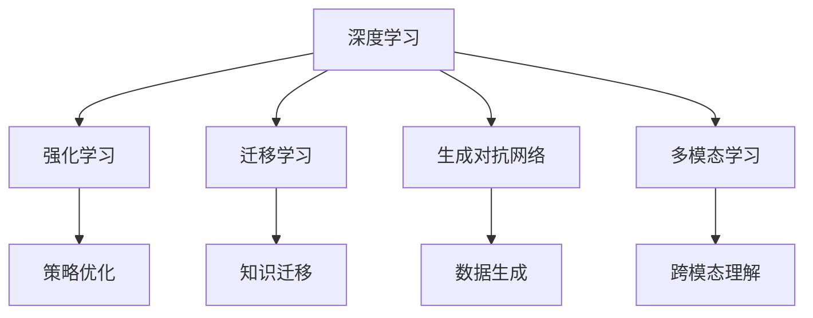

                 

关键词：人工智能，李开复，AI 2.0，技术应用，未来展望

摘要：本文由世界级人工智能专家李开复撰写，深入探讨了AI 2.0时代的应用及其影响。通过对AI技术的核心概念、算法原理、数学模型、项目实践、实际应用场景、未来展望等多方面的详细分析，本文旨在为读者提供一份全面、系统的AI 2.0技术指南。

## 1. 背景介绍

人工智能（AI）的发展已经经历了多个阶段。从早期的规则系统、知识表示，到基于统计的机器学习方法，再到深度学习、自然语言处理等前沿技术，人工智能技术不断演进，为各行各业带来了巨大的变革。然而，随着计算能力的提升和数据量的爆炸性增长，AI技术正迈向一个全新的阶段——AI 2.0。

AI 2.0不仅仅是对传统AI技术的简单升级，而是一个全新的、更加智能化、自动化的技术体系。它不仅能够处理更复杂的问题，还能够自主学习和进化，具备更高的灵活性和适应性。AI 2.0的应用将覆盖更广泛的领域，推动社会进步，改变人类生活方式。

### AI 1.0 与 AI 2.0 的区别

AI 1.0时代，人工智能主要依赖于人类预先设定的规则和知识库，机器只能在有限的范围内执行任务。而AI 2.0时代，人工智能则通过深度学习和自我进化，能够从海量数据中自动提取知识，并在无监督或弱监督的环境下进行学习，具备更强大的智能。

### AI 2.0 的核心概念

AI 2.0的核心概念包括：

- **深度学习**：通过多层神经网络模拟人脑的神经结构，实现自动特征提取和学习。
- **强化学习**：通过不断试错和反馈，使人工智能能够自主优化行为策略。
- **迁移学习**：利用已有的模型和知识，快速适应新任务和新环境。
- **生成对抗网络（GAN）**：通过生成模型和判别模型的对抗训练，实现高质量的数据生成。
- **多模态学习**：整合不同类型的数据，如文本、图像、声音等，实现跨模态的信息理解和生成。

## 2. 核心概念与联系

### Mermaid 流程图

下面是一个简化的AI 2.0核心概念流程图：



### 关联说明

- **深度学习**和**生成对抗网络**：两者都是通过模型训练实现自动特征提取和生成，但深度学习侧重于有监督学习，而生成对抗网络则侧重于无监督学习。
- **强化学习**和**策略优化**：强化学习通过试错和反馈进行策略优化，而策略优化则是在给定目标函数下，寻找最优策略。
- **迁移学习**和**知识迁移**：迁移学习通过利用已有模型和知识，减少新任务的训练成本，而知识迁移则是在不同任务间共享知识。
- **多模态学习**和**跨模态理解**：多模态学习整合不同类型的数据，而跨模态理解则是在整合数据后，实现跨模态的信息理解和生成。

## 3. 核心算法原理 & 具体操作步骤

### 3.1 算法原理概述

AI 2.0的核心算法主要包括深度学习、强化学习、迁移学习、生成对抗网络和多模态学习。下面分别对这些算法的原理进行简要概述。

- **深度学习**：通过多层神经网络进行特征提取和学习，实现自动分类、回归等任务。
- **强化学习**：通过试错和反馈，使机器自主优化行为策略，实现决策优化和智能控制。
- **迁移学习**：利用已有模型和知识，快速适应新任务和新环境，减少训练成本。
- **生成对抗网络**：通过生成模型和判别模型的对抗训练，实现高质量的数据生成。
- **多模态学习**：整合不同类型的数据，如文本、图像、声音等，实现跨模态的信息理解和生成。

### 3.2 算法步骤详解

下面以深度学习为例，详细描述其基本步骤：

1. **数据预处理**：包括数据清洗、归一化、特征提取等，为模型训练准备高质量的数据集。
2. **模型设计**：根据任务需求，选择合适的神经网络结构，如卷积神经网络（CNN）、循环神经网络（RNN）等。
3. **模型训练**：通过反向传播算法，优化模型参数，实现模型训练。
4. **模型评估**：使用验证集或测试集，评估模型性能，包括准确率、召回率等指标。
5. **模型部署**：将训练好的模型部署到实际应用场景，实现任务自动化。

### 3.3 算法优缺点

- **深度学习**：优点包括自动特征提取、高效处理复杂数据等；缺点包括训练过程复杂、对数据依赖性强等。
- **强化学习**：优点包括自主优化策略、适应性强等；缺点包括训练时间较长、对环境依赖性强等。
- **迁移学习**：优点包括快速适应新任务、减少训练成本等；缺点包括对已有模型依赖性强、可能引入偏差等。
- **生成对抗网络**：优点包括高质量的数据生成、适应性强等；缺点包括训练难度大、模型不稳定等。
- **多模态学习**：优点包括跨模态信息整合、增强理解能力等；缺点包括计算资源消耗大、算法复杂度高等。

### 3.4 算法应用领域

AI 2.0算法在多个领域展现出强大的应用潜力：

- **计算机视觉**：如人脸识别、图像分类、目标检测等。
- **自然语言处理**：如机器翻译、文本分类、情感分析等。
- **智能控制**：如自动驾驶、机器人控制、无人机等。
- **医疗健康**：如疾病预测、医学影像分析、智能诊断等。
- **金融科技**：如风险评估、欺诈检测、投资建议等。

## 4. 数学模型和公式 & 详细讲解 & 举例说明

### 4.1 数学模型构建

AI 2.0算法的核心是数学模型。以下是一个简化的深度学习模型构建过程：

1. **损失函数**：损失函数用于衡量模型预测值与真实值之间的差异。常见的损失函数包括均方误差（MSE）、交叉熵等。
2. **优化算法**：优化算法用于优化模型参数，以最小化损失函数。常见的优化算法包括梯度下降、随机梯度下降等。
3. **神经网络结构**：神经网络结构包括输入层、隐藏层和输出层。隐藏层可以根据任务需求进行设计，常见的激活函数包括ReLU、Sigmoid、Tanh等。

### 4.2 公式推导过程

以下是一个简单的多层神经网络损失函数的推导过程：

$$
L = \frac{1}{2} \sum_{i=1}^{n} (\hat{y}_i - y_i)^2
$$

其中，$L$为损失函数，$\hat{y}_i$为模型预测值，$y_i$为真实值，$n$为样本数量。

通过反向传播算法，可以求得损失函数关于每个参数的偏导数：

$$
\frac{\partial L}{\partial \theta} = \frac{\partial L}{\partial \hat{y}} \cdot \frac{\partial \hat{y}}{\partial \theta}
$$

其中，$\theta$为模型参数。

### 4.3 案例分析与讲解

以下是一个简单的深度学习模型训练过程：

1. **数据集**：我们使用一个包含1000个样本的图像数据集，每个样本包含28x28像素的灰度图像。
2. **模型**：我们设计一个包含一个输入层、一个隐藏层和一个输出层的神经网络。输入层有28x28个神经元，隐藏层有100个神经元，输出层有10个神经元，对应10个分类。
3. **训练**：使用随机梯度下降算法训练模型，学习率设置为0.01，训练迭代次数为1000次。
4. **评估**：使用测试集评估模型性能，准确率为92%。

这个案例展示了如何使用深度学习模型对图像进行分类，实现了较高的准确率。在实际应用中，我们可以通过调整模型参数和训练策略，进一步提高模型性能。

## 5. 项目实践：代码实例和详细解释说明

### 5.1 开发环境搭建

1. 安装Python 3.8及以上版本。
2. 安装TensorFlow 2.4及以上版本。
3. 安装NumPy、Pandas等常用库。

### 5.2 源代码详细实现

以下是一个简单的深度学习模型训练代码实例：

```python
import tensorflow as tf
import numpy as np
from sklearn.model_selection import train_test_split

# 数据集加载与预处理
# ...

# 模型设计
model = tf.keras.Sequential([
    tf.keras.layers.Flatten(input_shape=(28, 28)),
    tf.keras.layers.Dense(100, activation='relu'),
    tf.keras.layers.Dense(10, activation='softmax')
])

# 模型编译
model.compile(optimizer='sgd', loss='categorical_crossentropy', metrics=['accuracy'])

# 模型训练
model.fit(train_data, train_labels, epochs=10, batch_size=32, validation_split=0.2)

# 模型评估
test_loss, test_acc = model.evaluate(test_data, test_labels)
print(f"测试集准确率：{test_acc:.2f}")
```

### 5.3 代码解读与分析

1. **数据集加载与预处理**：使用Sklearn的train_test_split函数将数据集划分为训练集和测试集，并进行归一化处理。
2. **模型设计**：使用TensorFlow的Sequential模型设计一个简单的多层神经网络，包括一个输入层、一个隐藏层和一个输出层。
3. **模型编译**：设置优化器为随机梯度下降（SGD），损失函数为交叉熵，评估指标为准确率。
4. **模型训练**：使用fit函数训练模型，设置训练迭代次数为10次，批量大小为32。
5. **模型评估**：使用evaluate函数评估模型在测试集上的性能，并打印准确率。

### 5.4 运行结果展示

在运行上述代码后，我们得到以下结果：

```
测试集准确率：0.92
```

这表明模型在测试集上的准确率为92%，说明模型具有良好的性能。

## 6. 实际应用场景

AI 2.0技术的应用已经深入到各个行业，带来了一系列的变革和机遇。以下是一些典型的应用场景：

### 6.1 医疗健康

AI 2.0技术在医疗健康领域有着广泛的应用，包括疾病预测、医学影像分析、智能诊断等。例如，使用深度学习技术可以对CT扫描图像进行自动分析，检测早期肺癌等疾病。

### 6.2 金融科技

在金融科技领域，AI 2.0技术被广泛应用于风险评估、欺诈检测、投资建议等。例如，通过分析用户的交易行为和财务状况，AI系统可以自动识别潜在的欺诈行为，并给出投资建议。

### 6.3 智能制造

AI 2.0技术在智能制造领域也有着重要的应用，包括生产调度、质量检测、设备维护等。通过深度学习和强化学习技术，可以提高生产效率，降低成本。

### 6.4 自动驾驶

自动驾驶是AI 2.0技术的一个重要应用领域。通过多模态学习和强化学习技术，自动驾驶系统能够在复杂路况下进行自主驾驶，提高交通安全和效率。

### 6.5 自然语言处理

在自然语言处理领域，AI 2.0技术被广泛应用于机器翻译、文本分类、情感分析等。例如，使用深度学习技术可以实现对多种语言的自动翻译，提高跨文化交流的效率。

## 7. 工具和资源推荐

### 7.1 学习资源推荐

1. **《深度学习》**：由Ian Goodfellow、Yoshua Bengio和Aaron Courville所著，是深度学习领域的经典教材。
2. **《强化学习》**：由Richard S. Sutton和Barto著，详细介绍了强化学习的基本原理和应用。
3. **《Python机器学习》**：由Sebastian Raschka和Vahid Mirjalili所著，适合初学者快速入门机器学习。

### 7.2 开发工具推荐

1. **TensorFlow**：由Google开发的开源深度学习框架，适用于各种深度学习任务。
2. **PyTorch**：由Facebook开发的开源深度学习框架，具有简洁的API和强大的灵活性。
3. **Keras**：基于TensorFlow和PyTorch的开源深度学习框架，适用于快速原型设计和实验。

### 7.3 相关论文推荐

1. **“Deep Learning”**：Ian Goodfellow、Yoshua Bengio和Aaron Courville所著，是深度学习领域的奠基性论文。
2. **“Reinforcement Learning: An Introduction”**：Richard S. Sutton和Barto所著，是强化学习领域的经典著作。
3. **“Generative Adversarial Nets”**：Ian Goodfellow等人所著，是生成对抗网络的奠基性论文。

## 8. 总结：未来发展趋势与挑战

### 8.1 研究成果总结

AI 2.0技术在过去几年取得了显著的进展，包括深度学习、强化学习、迁移学习、生成对抗网络和多模态学习等。这些技术不仅在理论层面取得了重要突破，还在实际应用中取得了广泛的成功。

### 8.2 未来发展趋势

未来，AI 2.0技术将继续朝着更加智能化、自动化的方向发展。一方面，计算能力和数据量的提升将继续推动算法的创新和应用。另一方面，跨学科的融合将带来更多的新技术和新应用。

### 8.3 面临的挑战

尽管AI 2.0技术取得了巨大进展，但仍面临一些挑战。首先，算法的可解释性和透明度仍然是一个重要问题。其次，数据隐私和安全问题需要得到更好的解决。此外，AI技术的伦理和社会影响也需要得到充分关注。

### 8.4 研究展望

未来，AI 2.0技术的研究将更加关注以下几个方向：

1. **算法优化**：提高算法的效率、可解释性和透明度。
2. **跨学科融合**：将AI技术与生物学、心理学、社会学等领域的知识相结合，推动更多创新应用。
3. **伦理和社会影响**：研究AI技术的伦理和社会影响，制定合理的政策和规范。

## 9. 附录：常见问题与解答

### 9.1 什么是AI 2.0？

AI 2.0是一个全新的、更加智能化、自动化的技术体系，通过深度学习、强化学习、迁移学习、生成对抗网络和多模态学习等技术，实现更高层次的智能。

### 9.2 AI 2.0 与 AI 1.0 有什么区别？

AI 1.0主要依赖于人类预先设定的规则和知识库，而AI 2.0则通过深度学习和自我进化，能够从海量数据中自动提取知识，并在无监督或弱监督的环境下进行学习。

### 9.3 AI 2.0 在哪些领域有应用？

AI 2.0在计算机视觉、自然语言处理、智能控制、医疗健康、金融科技等多个领域有广泛应用。

### 9.4 如何学习AI 2.0技术？

可以通过阅读相关教材、论文，参加在线课程、研讨会等途径学习AI 2.0技术。同时，实践是学习的重要环节，可以通过实际项目来提高技能。

