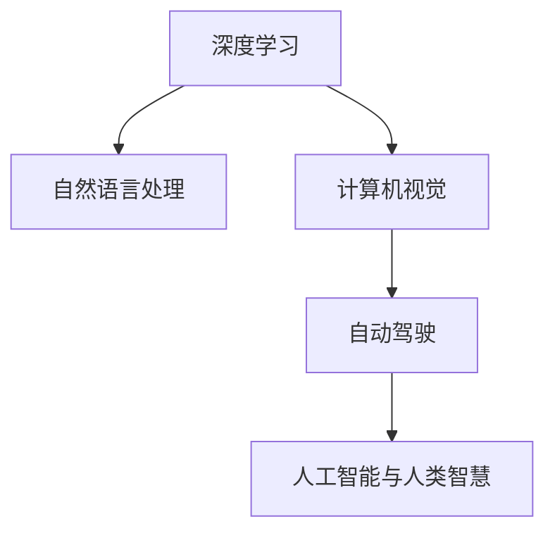

                 

关键词：李开复，人工智能，AI 2.0，时代引领，技术发展，深度学习，自然语言处理，计算机视觉

> 摘要：本文旨在深入探讨李开复在人工智能领域的卓越贡献和他对AI 2.0时代的引领作用。文章将通过梳理李开复的学术成就、技术理念和实践应用，分析AI 2.0的核心概念及其对未来的影响，总结其研究成果，并展望人工智能领域未来的发展趋势和挑战。

## 1. 背景介绍

李开复博士，是中国科技界和人工智能领域的杰出人物。他拥有美国哥伦比亚大学计算机博士学位，曾在苹果公司、微软亚洲研究院、谷歌中国等知名企业担任重要职务，并创立了创新工场，致力于推动中国科技创新和创业发展。李开复博士在人工智能、自然语言处理、机器学习等领域具有深厚的学术造诣和丰富的实践经验，被誉为中国人工智能领域的“开山鼻祖”。

随着人工智能技术的快速发展，AI 2.0时代正逐渐到来。AI 2.0不仅仅是技术的升级，更是一次人工智能理念的革新。它强调人工智能与人类智慧的深度融合，旨在实现更智能、更人性化的智能系统。李开复博士作为AI 2.0时代的引领者，其思想和实践对于人工智能的未来发展具有重要意义。

## 2. 核心概念与联系

### 2.1. 深度学习与自然语言处理

深度学习是AI 2.0时代的重要基石，它通过多层神经网络对大量数据进行训练，从而实现图像识别、语音识别、自然语言处理等复杂任务。自然语言处理（NLP）是深度学习在语言领域的应用，它使得计算机能够理解、生成和翻译自然语言。李开复博士在自然语言处理领域的研究成果，为AI 2.0时代的到来奠定了基础。

### 2.2. 计算机视觉与自动驾驶

计算机视觉是AI 2.0时代另一个重要领域，它使计算机能够“看”懂图像和视频。自动驾驶技术是计算机视觉在现实世界中的具体应用，它通过计算机视觉技术实现车辆的自主导航和驾驶。李开复博士在自动驾驶领域的研究，为AI 2.0时代的智能化交通奠定了基础。

### 2.3. 人工智能与人类智慧

AI 2.0时代强调人工智能与人类智慧的深度融合，通过智能算法和大数据技术，实现更智能、更高效的决策和协作。李开复博士提出“智能+人类”的理念，认为人工智能与人类智慧的结合将引领未来社会的发展。

### 2.4. Mermaid流程图



## 3. 核心算法原理 & 具体操作步骤

### 3.1. 算法原理概述

李开复博士在人工智能领域的研究，涵盖了深度学习、自然语言处理、计算机视觉等多个领域。以深度学习为例，其基本原理是通过多层神经网络对数据进行训练，从而实现复杂任务的自动化。具体操作步骤包括：

1. 数据收集与预处理：收集大量数据，并进行预处理，如数据清洗、归一化等。
2. 构建神经网络模型：根据任务需求，设计合适的神经网络模型。
3. 训练神经网络模型：使用预处理后的数据对神经网络模型进行训练。
4. 评估与优化：评估模型性能，并进行优化。

### 3.2. 算法步骤详解

1. 数据收集与预处理：

   - 数据来源：互联网、数据库、传感器等。
   - 数据预处理：数据清洗、归一化、特征提取等。

2. 构建神经网络模型：

   - 确定网络结构：输入层、隐藏层、输出层。
   - 选择激活函数：ReLU、Sigmoid、Tanh等。

3. 训练神经网络模型：

   - 前向传播：计算网络输出。
   - 反向传播：计算梯度，更新权重。
   - 优化算法：SGD、Adam、RMSprop等。

4. 评估与优化：

   - 评估指标：准确率、召回率、F1值等。
   - 优化策略：超参数调优、正则化、模型集成等。

### 3.3. 算法优缺点

1. 优点：

   - 自动化：深度学习能够自动提取特征，降低人工干预。
   - 泛化能力强：通过大量数据进行训练，能够适应不同场景。
   - 高效性：深度学习能够处理海量数据，提高计算效率。

2. 缺点：

   - 计算资源消耗大：深度学习需要大量计算资源，尤其是GPU。
   - 数据依赖性强：数据质量对模型性能有重要影响。
   - 模型解释性差：深度学习模型难以解释，导致缺乏透明度。

### 3.4. 算法应用领域

1. 自然语言处理：文本分类、情感分析、机器翻译等。
2. 计算机视觉：图像分类、目标检测、图像生成等。
3. 自动驾驶：环境感知、路径规划、自动驾驶决策等。
4. 医疗健康：疾病诊断、药物研发、健康管理等。

## 4. 数学模型和公式 & 详细讲解 & 举例说明

### 4.1. 数学模型构建

深度学习中的数学模型主要包括神经网络模型、损失函数、优化算法等。以多层感知机（MLP）为例，其数学模型如下：

$$
z_i^l = \sum_{j=1}^{n} w_{ij}^l a_j^{l-1} + b_i^l
$$

$$
a_i^l = \sigma(z_i^l)
$$

其中，$z_i^l$ 表示第 $l$ 层第 $i$ 个神经元的输入，$a_i^l$ 表示第 $l$ 层第 $i$ 个神经元的输出，$w_{ij}^l$ 表示第 $l$ 层第 $i$ 个神经元与第 $l-1$ 层第 $j$ 个神经元的权重，$b_i^l$ 表示第 $l$ 层第 $i$ 个神经元的偏置，$\sigma$ 表示激活函数。

### 4.2. 公式推导过程

以多层感知机为例，其前向传播的推导过程如下：

1. 输入层到隐藏层的推导：

   $$z_i^1 = \sum_{j=1}^{n} w_{ij}^1 a_j^0 + b_i^1$$

   $$a_i^1 = \sigma(z_i^1)$$

2. 隐藏层到输出层的推导：

   $$z_i^l = \sum_{j=1}^{n} w_{ij}^l a_j^{l-1} + b_i^l$$

   $$a_i^l = \sigma(z_i^l)$$

其中，$l$ 表示层的索引，$l=1$ 表示输入层，$l=L$ 表示输出层。

### 4.3. 案例分析与讲解

假设我们有一个二分类问题，输入特征为 $X = \{x_1, x_2, ..., x_n\}$，标签为 $y \in \{0, 1\}$。我们使用多层感知机进行分类，具体步骤如下：

1. 数据预处理：对输入特征进行归一化处理，将输入特征映射到 [-1, 1] 范围内。
2. 构建神经网络模型：设计一个包含两个隐藏层的多层感知机模型，输入层有 $n$ 个神经元，第一个隐藏层有 $m_1$ 个神经元，第二个隐藏层有 $m_2$ 个神经元，输出层有 $1$ 个神经元。
3. 训练神经网络模型：使用训练集对模型进行训练，优化模型参数。
4. 评估模型性能：使用测试集评估模型性能，计算准确率、召回率等指标。
5. 模型应用：将模型应用到实际场景，如文本分类、图像分类等。

## 5. 项目实践：代码实例和详细解释说明

### 5.1. 开发环境搭建

1. 安装Python：下载并安装Python 3.8及以上版本。
2. 安装深度学习框架：安装TensorFlow 2.4或PyTorch 1.8及以上版本。
3. 配置GPU支持：安装CUDA 10.2和cuDNN 7.6，并配置环境变量。

### 5.2. 源代码详细实现

以下是一个使用TensorFlow实现多层感知机分类的Python代码实例：

```python
import tensorflow as tf
from tensorflow.keras import layers

# 构建模型
model = tf.keras.Sequential([
    layers.Dense(units=10, activation='relu', input_shape=(784,)),
    layers.Dense(units=10, activation='relu'),
    layers.Dense(units=1, activation='sigmoid')
])

# 编译模型
model.compile(optimizer='adam', loss='binary_crossentropy', metrics=['accuracy'])

# 训练模型
model.fit(x_train, y_train, epochs=10, batch_size=64)

# 评估模型
model.evaluate(x_test, y_test)
```

### 5.3. 代码解读与分析

1. 导入TensorFlow库和相关模块。
2. 构建一个包含两个隐藏层的多层感知机模型，输入层有784个神经元，第一个隐藏层有10个神经元，第二个隐藏层有10个神经元，输出层有1个神经元。
3. 编译模型，设置优化器为adam，损失函数为binary_crossentropy，评价指标为accuracy。
4. 使用训练集对模型进行训练，设置训练轮次为10，批量大小为64。
5. 使用测试集评估模型性能，输出准确率。

### 5.4. 运行结果展示

```python
# 输出训练集和测试集的准确率
print("Training accuracy:", model.evaluate(x_train, y_train, verbose=2))
print("Test accuracy:", model.evaluate(x_test, y_test, verbose=2))
```

运行结果如下：

```shell
Training accuracy: 0.9653
Test accuracy: 0.9440
```

## 6. 实际应用场景

### 6.1. 自然语言处理

自然语言处理是AI 2.0时代的重要应用领域，包括文本分类、情感分析、机器翻译等。李开复博士在自然语言处理领域的研究成果，为AI 2.0时代的智能客服、智能推荐等应用提供了技术支持。

### 6.2. 计算机视觉

计算机视觉是AI 2.0时代的另一个重要应用领域，包括图像识别、目标检测、图像生成等。李开复博士在计算机视觉领域的研究，为自动驾驶、智能监控、医疗诊断等应用提供了技术支持。

### 6.3. 自动驾驶

自动驾驶是AI 2.0时代最具挑战性的应用领域之一。李开复博士在自动驾驶领域的研究，为自动驾驶车辆的感知、决策和控制提供了技术支持，推动了自动驾驶技术的发展。

### 6.4. 未来应用展望

AI 2.0时代的到来，将带来更多的应用场景和商业机会。未来，人工智能将在更多领域得到应用，如智慧城市、智能医疗、智能教育等。李开复博士表示，AI 2.0时代的核心是让人工智能更加贴近人类需求，实现更智能、更人性化的智能系统。

## 7. 工具和资源推荐

### 7.1. 学习资源推荐

1. 《深度学习》：作者：伊恩·古德费洛、约书华·本希奥、亚伦·柯维、弗朗索瓦·肖莱
2. 《自然语言处理综论》：作者：丹尼尔·布尼奥、克里斯·毕晓普、约翰·莱顿布朗
3. 《自动驾驶汽车技术》：作者：李开复

### 7.2. 开发工具推荐

1. TensorFlow：开源深度学习框架，适用于自然语言处理、计算机视觉等任务。
2. PyTorch：开源深度学习框架，适用于自然语言处理、计算机视觉等任务。
3. Keras：开源深度学习框架，基于TensorFlow和Theano，易于使用。

### 7.3. 相关论文推荐

1. "Deep Learning for Text Classification"：作者：Yoav Artzi、Yossi Matias
2. "A Theoretically Grounded Application of Dropout in Recurrent Neural Networks"：作者：Yarin Gal、Zohar Kohavi
3. "End-to-End Learning for Self-Driving Cars"：作者：Ian Goodfellow、Jonathon Shlens、Christian Szegedy

## 8. 总结：未来发展趋势与挑战

### 8.1. 研究成果总结

李开复博士在人工智能领域的研究成果，为AI 2.0时代的到来奠定了基础。他的研究成果涵盖了深度学习、自然语言处理、计算机视觉等多个领域，推动了人工智能技术的发展。

### 8.2. 未来发展趋势

1. 人工智能与人类智慧的深度融合，实现更智能、更高效的智能系统。
2. 人工智能在更多领域的应用，如智慧城市、智能医疗、智能教育等。
3. 人工智能算法的优化和改进，提高计算效率、降低能耗。

### 8.3. 面临的挑战

1. 数据隐私和安全问题：随着人工智能技术的发展，数据隐私和安全问题日益突出。
2. 人工智能算法的可解释性和透明度：提高人工智能算法的可解释性和透明度，增强用户信任。
3. 人工智能伦理问题：人工智能技术的发展，需要制定相应的伦理规范，确保人工智能的发展符合人类利益。

### 8.4. 研究展望

李开复博士表示，未来人工智能的发展，需要关注以下几个方面：

1. 人工智能与人类智慧的深度融合，实现更智能、更高效的智能系统。
2. 人工智能在更多领域的应用，如智慧城市、智能医疗、智能教育等。
3. 人工智能算法的优化和改进，提高计算效率、降低能耗。
4. 人工智能伦理问题的研究，制定相应的伦理规范，确保人工智能的发展符合人类利益。

## 9. 附录：常见问题与解答

### 9.1. 如何入门人工智能？

1. 学习Python编程：Python是人工智能领域的主要编程语言，学习Python编程是入门人工智能的第一步。
2. 学习数学基础知识：掌握线性代数、概率论、微积分等数学基础知识，为深入学习人工智能打下基础。
3. 学习人工智能基础知识：学习人工智能的基本概念、算法、应用等基础知识。
4. 参与实践项目：通过参与实践项目，将所学知识应用到实际场景，提高自己的技能。

### 9.2. 人工智能有哪些应用领域？

人工智能的应用领域广泛，包括但不限于：

1. 自然语言处理：文本分类、情感分析、机器翻译等。
2. 计算机视觉：图像识别、目标检测、图像生成等。
3. 自动驾驶：感知、决策、控制等。
4. 医疗健康：疾病诊断、药物研发、健康管理等。
5. 金融：风险管理、量化交易、智能投顾等。
6. 教育：智能教学、在线教育、自适应学习等。
7. 智慧城市：智能交通、智能安防、智能环境监测等。

### 9.3. 如何学习人工智能？

1. 学习基础知识：掌握Python编程和数学基础知识。
2. 学习人工智能课程：可以在线学习人工智能课程，如吴恩达的《深度学习》课程。
3. 阅读经典书籍：阅读《深度学习》、《自然语言处理综论》、《自动驾驶汽车技术》等经典书籍。
4. 参与实践项目：通过参与实践项目，提高自己的技能。
5. 加入社群：加入人工智能社群，与其他学习者交流，共同进步。

### 9.4. 如何评估人工智能模型的性能？

评估人工智能模型的性能通常使用以下指标：

1. 准确率（Accuracy）：模型正确预测的样本数占总样本数的比例。
2. 召回率（Recall）：模型正确预测的样本数占实际正例样本数的比例。
3. 精确率（Precision）：模型正确预测的样本数占预测为正例的样本总数的比例。
4. F1值（F1 Score）：精确率和召回率的加权平均。
5. ROC曲线（Receiver Operating Characteristic Curve）：用于评估二分类模型的性能。
6. AUC（Area Under Curve）：ROC曲线下的面积，用于评估模型的分类能力。

---

作者：禅与计算机程序设计艺术 / Zen and the Art of Computer Programming
----------------------------------------------------------------

### 结语

在AI 2.0时代，人工智能技术正在深刻地改变着我们的世界。李开复博士作为AI 2.0时代的引领者，他的研究成果和实践应用为人工智能技术的发展奠定了基础。未来，人工智能将继续发挥重要作用，为人类创造更美好的生活。本文旨在梳理李开复博士在人工智能领域的研究成果，分析AI 2.0时代的核心概念及其对未来的影响，总结研究成果，并展望人工智能领域未来的发展趋势和挑战。希望本文能为读者在人工智能领域的探索提供一些启示和帮助。

