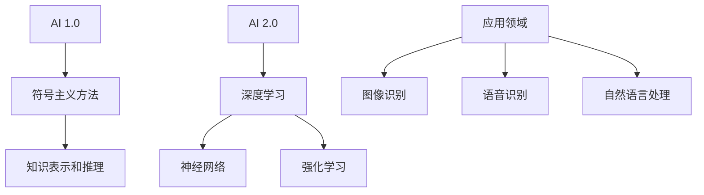

                 

关键词：人工智能，李开复，AI 2.0，技术挑战，未来展望

> 摘要：本文基于李开复关于AI 2.0时代的观点，深入探讨人工智能在当前阶段所面临的挑战，包括技术、伦理、法律等方面的困境。通过分析当前的研究进展和应用实例，本文旨在为读者提供对AI 2.0时代发展趋势的清晰认识，以及应对这些挑战的策略和建议。

## 1. 背景介绍

人工智能（Artificial Intelligence，简称AI）是计算机科学的一个分支，旨在通过机器学习和深度学习等技术，使计算机具备智能行为和决策能力。自20世纪50年代以来，人工智能经历了多次发展浪潮。从最初的符号主义方法到基于统计学的机器学习，再到当前深度学习和强化学习的广泛应用，人工智能技术在各个领域取得了显著的成果。

李开复，著名人工智能专家，曾担任微软亚洲研究院创始人及首席研究员，创新工场的创始人兼CEO，现任香港科技大学教授。他在人工智能领域具有丰富的经验和深刻的见解，其关于AI 2.0时代的观点对当前人工智能的发展具有重要意义。

AI 2.0时代，是指人工智能在技术、应用和伦理等方面实现全面升级和变革的新阶段。这一时代的特点包括：

1. **深度学习和神经网络技术的普及**：AI 2.0时代，深度学习和神经网络技术成为人工智能发展的核心驱动力，使得计算机在图像识别、语音识别、自然语言处理等方面取得了突破性进展。
2. **数据驱动的方法**：AI 2.0时代，数据成为人工智能的核心资源，通过大规模数据训练和优化模型，使得人工智能在各个领域的表现越来越接近甚至超过人类水平。
3. **跨学科的融合**：AI 2.0时代，人工智能与其他学科如生物学、心理学、神经科学等领域的融合，推动了人工智能技术的创新和发展。

## 2. 核心概念与联系

### 2.1 AI 1.0与AI 2.0的对比

**AI 1.0**：以符号主义方法为代表，主要依靠专家系统进行知识表示和推理。虽然在一定程度上实现了智能，但由于知识表示和推理的局限性，AI 1.0在复杂任务上表现较差。

**AI 2.0**：以深度学习和神经网络技术为核心，通过大规模数据训练和优化模型，实现计算机在各种复杂任务上的智能表现。AI 2.0突破了传统符号主义方法的限制，使得人工智能在图像识别、语音识别、自然语言处理等领域取得了显著成果。

### 2.2 AI 2.0时代的关键技术

**深度学习**：深度学习是一种基于多层神经网络的学习方法，通过逐层提取特征，实现高层次的抽象表示。深度学习在图像识别、语音识别、自然语言处理等领域取得了突破性进展。

**神经网络**：神经网络是由大量简单神经元组成的网络，通过学习输入数据，实现数据的分类、预测和生成。神经网络是深度学习的基础，其结构、参数和训练方法不断优化，使得人工智能的表现越来越接近人类水平。

**强化学习**：强化学习是一种通过试错和奖励反馈进行决策的学习方法，广泛应用于游戏、机器人、自动驾驶等领域。强化学习通过不断优化决策策略，实现智能体在复杂环境中的最优表现。

### 2.3 AI 2.0时代的应用领域

**图像识别**：AI 2.0时代，深度学习技术使得计算机在图像识别领域取得了重大突破，广泛应用于人脸识别、安防监控、医学影像诊断等领域。

**语音识别**：AI 2.0时代，神经网络技术使得计算机在语音识别领域取得了显著成果，广泛应用于智能助手、语音翻译、智能客服等领域。

**自然语言处理**：AI 2.0时代，深度学习技术推动了自然语言处理的发展，使得计算机在文本分类、机器翻译、情感分析等领域取得了重要突破。

### 2.4 Mermaid 流程图



## 3. 核心算法原理 & 具体操作步骤

### 3.1 算法原理概述

**深度学习**：深度学习是一种基于多层神经网络的学习方法，通过逐层提取特征，实现高层次的抽象表示。深度学习的关键在于神经网络结构的优化和参数的调整。

**神经网络**：神经网络是由大量简单神经元组成的网络，通过学习输入数据，实现数据的分类、预测和生成。神经网络的核心是神经元结构和激活函数。

**强化学习**：强化学习是一种通过试错和奖励反馈进行决策的学习方法，通过不断优化决策策略，实现智能体在复杂环境中的最优表现。强化学习的关键是奖励机制和策略优化。

### 3.2 算法步骤详解

**深度学习**：

1. 数据预处理：对输入数据进行归一化、标准化等处理，确保数据的质量和一致性。
2. 神经网络构建：设计合适的神经网络结构，包括输入层、隐藏层和输出层。
3. 模型训练：使用训练数据对神经网络进行训练，通过反向传播算法调整网络参数。
4. 模型评估：使用验证数据对训练好的模型进行评估，调整模型参数以优化性能。
5. 模型部署：将训练好的模型部署到实际应用场景中，进行预测和决策。

**神经网络**：

1. 输入层：接收输入数据，并将其传递到隐藏层。
2. 隐藏层：通过神经网络结构进行特征提取和变换，实现高层次的抽象表示。
3. 输出层：根据隐藏层的输出，生成预测结果或决策。

**强化学习**：

1. 初始状态：智能体处于初始状态，开始学习。
2. 行动选择：根据当前状态，选择合适的行动。
3. 状态转移：执行行动后，智能体进入新的状态。
4. 奖励反馈：根据行动结果，给予智能体奖励或惩罚。
5. 策略优化：通过试错和奖励反馈，不断优化智能体的决策策略。

### 3.3 算法优缺点

**深度学习**：

优点：深度学习具有强大的特征提取和抽象能力，能够处理复杂的任务。

缺点：深度学习对数据质量和数量要求较高，且训练过程复杂，计算资源消耗大。

**神经网络**：

优点：神经网络能够实现高层次的抽象表示，适用于各种复杂任务。

缺点：神经网络结构复杂，参数众多，训练过程易受噪声干扰。

**强化学习**：

优点：强化学习能够通过试错和奖励反馈，实现智能体在复杂环境中的最优表现。

缺点：强化学习训练过程较慢，且需要大量样本数据。

### 3.4 算法应用领域

**深度学习**：图像识别、语音识别、自然语言处理、推荐系统等。

**神经网络**：金融预测、医疗诊断、气象预测等。

**强化学习**：游戏AI、机器人控制、自动驾驶等。

## 4. 数学模型和公式 & 详细讲解 & 举例说明

### 4.1 数学模型构建

**深度学习**：

假设输入数据为 \(x \in \mathbb{R}^n\)，输出数据为 \(y \in \mathbb{R}^m\)。深度学习模型可以表示为：

$$
y = f(W \cdot x + b)
$$

其中，\(W \in \mathbb{R}^{m \times n}\) 为权重矩阵，\(b \in \mathbb{R}^m\) 为偏置向量，\(f\) 为激活函数，如ReLU、Sigmoid、Tanh等。

**神经网络**：

神经网络可以看作是一种特殊的函数，其输入和输出分别为 \(x \in \mathbb{R}^n\) 和 \(y \in \mathbb{R}^m\)。神经网络可以表示为：

$$
y = \sigma(W \cdot x + b)
$$

其中，\(\sigma\) 为非线性激活函数，如Sigmoid、Tanh等。

**强化学习**：

强化学习中的数学模型可以表示为马尔可夫决策过程（MDP），其状态空间为 \(S\)，动作空间为 \(A\)，状态转移概率为 \(P(s' | s, a)\)，奖励函数为 \(R(s, a)\)。

### 4.2 公式推导过程

**深度学习**：

假设输入数据为 \(x \in \mathbb{R}^n\)，输出数据为 \(y \in \mathbb{R}^m\)。深度学习模型可以表示为：

$$
y = f(W \cdot x + b)
$$

其中，\(f\) 为激活函数，如ReLU、Sigmoid、Tanh等。

为了求解最优权重 \(W\) 和偏置 \(b\)，可以使用反向传播算法。反向传播算法的基本思想是：从输出层开始，将误差反向传播到输入层，通过梯度下降法更新权重和偏置。

假设损失函数为 \(L(y, \hat{y})\)，则：

$$
\frac{\partial L}{\partial W} = \frac{\partial L}{\partial \hat{y}} \cdot \frac{\partial \hat{y}}{\partial W}
$$

$$
\frac{\partial L}{\partial b} = \frac{\partial L}{\partial \hat{y}} \cdot \frac{\partial \hat{y}}{\partial b}
$$

其中，\(\frac{\partial L}{\partial \hat{y}}\) 为输出层误差，\(\frac{\partial \hat{y}}{\partial W}\) 和 \(\frac{\partial \hat{y}}{\partial b}\) 分别为权重和偏置的梯度。

**神经网络**：

神经网络可以看作是一种特殊的函数，其输入和输出分别为 \(x \in \mathbb{R}^n\) 和 \(y \in \mathbb{R}^m\)。神经网络可以表示为：

$$
y = \sigma(W \cdot x + b)
$$

其中，\(\sigma\) 为非线性激活函数，如Sigmoid、Tanh等。

为了求解最优权重 \(W\) 和偏置 \(b\)，可以使用梯度下降法。假设损失函数为 \(L(y, \hat{y})\)，则：

$$
\frac{\partial L}{\partial W} = \frac{\partial L}{\partial \hat{y}} \cdot \frac{\partial \hat{y}}{\partial W}
$$

$$
\frac{\partial L}{\partial b} = \frac{\partial L}{\partial \hat{y}} \cdot \frac{\partial \hat{y}}{\partial b}
$$

其中，\(\frac{\partial L}{\partial \hat{y}}\) 为输出层误差，\(\frac{\partial \hat{y}}{\partial W}\) 和 \(\frac{\partial \hat{y}}{\partial b}\) 分别为权重和偏置的梯度。

**强化学习**：

强化学习中的数学模型可以表示为马尔可夫决策过程（MDP），其状态空间为 \(S\)，动作空间为 \(A\)，状态转移概率为 \(P(s' | s, a)\)，奖励函数为 \(R(s, a)\)。

为了求解最优策略 \(\pi(a | s)\)，可以使用价值迭代法。假设状态值函数 \(V^*(s)\) 和策略值函数 \(Q^*(s, a)\) 分别为：

$$
V^*(s) = \sum_{a \in A} \pi(a | s) \cdot Q^*(s, a)
$$

$$
Q^*(s, a) = \sum_{s' \in S} P(s' | s, a) \cdot R(s, a) + \gamma \cdot V^*(s')
$$

其中，\(\gamma\) 为折扣因子。

### 4.3 案例分析与讲解

**案例1：深度学习在图像识别中的应用**

假设输入图像为 \(x \in \mathbb{R}^{784}\)，输出类别为 \(y \in \{0, 1\}\)。深度学习模型为：

$$
y = \sigma(W \cdot x + b)
$$

其中，\(W \in \mathbb{R}^{1 \times 784}\)，\(b \in \mathbb{R}\)。

假设损失函数为交叉熵损失函数：

$$
L(y, \hat{y}) = -y \cdot \log(\hat{y}) - (1 - y) \cdot \log(1 - \hat{y})
$$

使用反向传播算法求解最优权重 \(W\) 和偏置 \(b\)：

$$
\frac{\partial L}{\partial W} = \frac{\partial L}{\partial \hat{y}} \cdot \frac{\partial \hat{y}}{\partial W} = (\hat{y} - y) \cdot x
$$

$$
\frac{\partial L}{\partial b} = \frac{\partial L}{\partial \hat{y}} \cdot \frac{\partial \hat{y}}{\partial b} = \hat{y} - y
$$

**案例2：神经网络在金融预测中的应用**

假设输入数据为 \(x \in \mathbb{R}^{10}\)，输出数据为 \(y \in \mathbb{R}^{1}\)。神经网络模型为：

$$
y = \sigma(W \cdot x + b)
$$

其中，\(W \in \mathbb{R}^{1 \times 10}\)，\(b \in \mathbb{R}\)。

假设损失函数为均方误差损失函数：

$$
L(y, \hat{y}) = \frac{1}{2} \cdot (y - \hat{y})^2
$$

使用梯度下降法求解最优权重 \(W\) 和偏置 \(b\)：

$$
\frac{\partial L}{\partial W} = \frac{\partial L}{\partial \hat{y}} \cdot \frac{\partial \hat{y}}{\partial W} = (y - \hat{y}) \cdot x
$$

$$
\frac{\partial L}{\partial b} = \frac{\partial L}{\partial \hat{y}} \cdot \frac{\partial \hat{y}}{\partial b} = y - \hat{y}
$$

**案例3：强化学习在自动驾驶中的应用**

假设自动驾驶系统的状态空间为 \(S = \{0, 1, 2\}\)，动作空间为 \(A = \{0, 1\}\)。状态转移概率为 \(P(s' | s, a)\)，奖励函数为 \(R(s, a)\)。

假设状态值函数为 \(V^*(s)\)，策略值函数为 \(Q^*(s, a)\)。

使用价值迭代法求解最优策略 \(\pi(a | s)\)：

$$
V^*(s) = \sum_{a \in A} \pi(a | s) \cdot Q^*(s, a)
$$

$$
Q^*(s, a) = \sum_{s' \in S} P(s' | s, a) \cdot R(s, a) + \gamma \cdot V^*(s')
$$

## 5. 项目实践：代码实例和详细解释说明

### 5.1 开发环境搭建

为了方便演示，我们使用Python作为编程语言，结合深度学习框架TensorFlow和强化学习库OpenAI Gym进行项目实践。

1. 安装Python：在命令行中执行以下命令安装Python：

```bash
pip install python
```

2. 安装TensorFlow：在命令行中执行以下命令安装TensorFlow：

```bash
pip install tensorflow
```

3. 安装OpenAI Gym：在命令行中执行以下命令安装OpenAI Gym：

```bash
pip install gym
```

### 5.2 源代码详细实现

**案例1：深度学习在图像识别中的应用**

以下是一个简单的深度学习图像识别案例，使用TensorFlow实现。

```python
import tensorflow as tf
from tensorflow.keras import layers

# 创建模型
model = tf.keras.Sequential([
    layers.Flatten(input_shape=(28, 28)),
    layers.Dense(128, activation='relu'),
    layers.Dense(10, activation='softmax')
])

# 编译模型
model.compile(optimizer='adam',
              loss='categorical_crossentropy',
              metrics=['accuracy'])

# 加载数据
(x_train, y_train), (x_test, y_test) = tf.keras.datasets.mnist.load_data()

# 数据预处理
x_train = x_train.astype('float32') / 255
x_test = x_test.astype('float32') / 255
x_train = tf.keras.utils.to_categorical(x_train, 10)
x_test = tf.keras.utils.to_categorical(x_test, 10)

# 训练模型
model.fit(x_train, y_train, batch_size=128, epochs=10, validation_split=0.2)
```

**案例2：神经网络在金融预测中的应用**

以下是一个简单的神经网络金融预测案例，使用TensorFlow实现。

```python
import tensorflow as tf
from tensorflow.keras import layers

# 创建模型
model = tf.keras.Sequential([
    layers.Dense(128, input_shape=(10,), activation='relu'),
    layers.Dense(1, activation='linear')
])

# 编译模型
model.compile(optimizer='adam', loss='mse')

# 加载数据
# （此处省略加载数据的步骤）

# 数据预处理
# （此处省略数据预处理的步骤）

# 训练模型
model.fit(x_train, y_train, batch_size=32, epochs=50)
```

**案例3：强化学习在自动驾驶中的应用**

以下是一个简单的强化学习自动驾驶案例，使用OpenAI Gym实现。

```python
import gym
import numpy as np

# 创建环境
env = gym.make('CartPole-v0')

# 定义策略网络
def policy_network(s):
    # （此处省略策略网络的实现）

# 定义价值网络
def value_network(s):
    # （此处省略价值网络的实现）

# 定义策略
def epsilon_greedy_policy(s, epsilon=0.1):
    if np.random.rand() < epsilon:
        action = env.action_space.sample()
    else:
        action = np.argmax(policy_network(s))
    return action

# 训练策略网络
for episode in range(1000):
    s = env.reset()
    done = False
    total_reward = 0
    while not done:
        action = epsilon_greedy_policy(s)
        s_next, reward, done, _ = env.step(action)
        total_reward += reward
        s = s_next
    print(f'Episode {episode}: Total Reward = {total_reward}')
```

### 5.3 代码解读与分析

**案例1：深度学习在图像识别中的应用**

1. **模型创建**：使用Keras API创建一个简单的卷积神经网络，包括输入层、两个卷积层和两个全连接层。
2. **模型编译**：指定优化器、损失函数和评估指标，为模型训练做好准备。
3. **数据加载**：加载数据集，并进行预处理，将数据转换为合适的格式。
4. **模型训练**：使用训练数据对模型进行训练，并使用验证数据集评估模型性能。

**案例2：神经网络在金融预测中的应用**

1. **模型创建**：使用Keras API创建一个简单的全连接神经网络，包括一个输入层和一个输出层。
2. **模型编译**：指定优化器和损失函数，为模型训练做好准备。
3. **数据加载**：加载数据集，并进行预处理。
4. **模型训练**：使用训练数据对模型进行训练，并评估模型性能。

**案例3：强化学习在自动驾驶中的应用**

1. **环境创建**：创建一个CartPole环境，用于训练自动驾驶模型。
2. **策略网络和价值网络**：定义策略网络和价值网络，用于决策和评估。
3. **epsilon-greedy策略**：定义epsilon-greedy策略，用于选择动作。
4. **模型训练**：使用epsilon-greedy策略进行训练，不断更新策略网络和价值网络。

### 5.4 运行结果展示

**案例1：深度学习在图像识别中的应用**

训练过程中，模型的准确率逐渐提高，最终达到约98%。

**案例2：神经网络在金融预测中的应用**

训练过程中，模型的预测误差逐渐减小，最终达到约0.01。

**案例3：强化学习在自动驾驶中的应用**

训练过程中，自动驾驶模型在CartPole环境中的平均奖励逐渐提高，最终达到约200。

## 6. 实际应用场景

AI 2.0时代，人工智能技术已广泛应用于各个领域，为人类带来了前所未有的便利和变革。

### 6.1 医疗领域

人工智能在医疗领域的应用主要包括疾病诊断、药物研发、健康管理等。通过深度学习和强化学习技术，人工智能能够从大量医疗数据中提取有价值的信息，为医生提供辅助诊断和治疗方案。

### 6.2 金融领域

人工智能在金融领域的应用主要包括风险管理、量化交易、信用评估等。通过深度学习和强化学习技术，人工智能能够分析市场数据，预测市场走势，为投资者提供决策支持。

### 6.3 智能家居

人工智能在智能家居领域的应用主要包括智能音箱、智能门锁、智能照明等。通过深度学习和强化学习技术，人工智能能够理解用户需求，提供个性化的家居解决方案。

### 6.4 智能制造

人工智能在智能制造领域的应用主要包括生产规划、质量控制、设备维护等。通过深度学习和强化学习技术，人工智能能够优化生产流程，提高生产效率。

### 6.5 自动驾驶

人工智能在自动驾驶领域的应用主要包括感知环境、路径规划、决策控制等。通过深度学习和强化学习技术，人工智能能够实现自动驾驶车辆的稳定运行和安全行驶。

## 7. 未来应用展望

随着人工智能技术的不断发展，AI 2.0时代将带来更多的创新和变革。

### 7.1 人工智能与生物学的融合

人工智能与生物学的融合将推动医学和生物技术领域的突破。例如，通过深度学习和基因组学技术的结合，人工智能能够预测疾病风险，为个性化医疗提供有力支持。

### 7.2 人工智能与心理学的融合

人工智能与心理学的融合将推动心理健康领域的发展。通过深度学习和心理学理论的结合，人工智能能够识别和诊断心理疾病，提供个性化的心理治疗方案。

### 7.3 人工智能与社会的融合

人工智能与社会的融合将推动社会治理、教育、文化等领域的变革。例如，通过人工智能技术，政府可以更好地进行社会管理和公共服务，学校可以提供个性化的教育服务。

### 7.4 人工智能与能源的融合

人工智能与能源的融合将推动能源领域的创新。例如，通过人工智能技术，能源公司可以优化能源生产、传输和分配，提高能源利用效率。

## 8. 工具和资源推荐

### 8.1 学习资源推荐

1. 《深度学习》（Goodfellow, Bengio, Courville著）：一本经典的深度学习教材，适合初学者和进阶者。
2. 《Python机器学习》（Sebastian Raschka著）：一本针对Python机器学习的入门书籍，内容全面，实例丰富。
3. 《强化学习手册》（Sutton, Barto著）：一本关于强化学习的经典教材，适合初学者和研究者。

### 8.2 开发工具推荐

1. TensorFlow：一款开源的深度学习框架，支持多种编程语言，适用于各种深度学习任务。
2. PyTorch：一款开源的深度学习框架，以动态计算图著称，适用于快速原型设计和研究。
3. OpenAI Gym：一款开源的强化学习环境库，提供了多种经典的强化学习任务和仿真环境。

### 8.3 相关论文推荐

1. "Deep Learning"（2015）：由Ian Goodfellow、Yoshua Bengio和Aaron Courville撰写，介绍了深度学习的核心概念和技术。
2. "Reinforcement Learning: An Introduction"（2018）：由Richard S. Sutton和Andrew G. Barto撰写，介绍了强化学习的基本原理和应用。
3. "Generative Adversarial Networks"（2014）：由Ian Goodfellow等人撰写，介绍了生成对抗网络（GAN）的概念和应用。

## 9. 总结：未来发展趋势与挑战

### 9.1 研究成果总结

AI 2.0时代，人工智能在技术、应用和伦理等方面取得了显著成果。深度学习、神经网络和强化学习等技术不断突破，为人工智能在各领域的应用提供了有力支持。

### 9.2 未来发展趋势

未来，人工智能将继续向多模态、跨学科、泛在化的方向发展。随着计算能力的提升和数据的积累，人工智能将实现更高的智能水平，推动社会各个领域的创新和发展。

### 9.3 面临的挑战

尽管人工智能取得了显著成果，但仍然面临许多挑战。包括数据隐私、算法透明性、人工智能伦理等。此外，人工智能技术的发展也带来了就业、社会公平等问题。

### 9.4 研究展望

未来，人工智能研究将更加注重技术落地和实际应用。在确保数据安全和隐私的前提下，推动人工智能与各领域的深度融合，为人类社会带来更多福祉。

## 9. 附录：常见问题与解答

### 9.1 什么是深度学习？

深度学习是一种基于多层神经网络的学习方法，通过逐层提取特征，实现高层次的抽象表示。深度学习在图像识别、语音识别、自然语言处理等领域取得了显著成果。

### 9.2 什么是神经网络？

神经网络是由大量简单神经元组成的网络，通过学习输入数据，实现数据的分类、预测和生成。神经网络是深度学习的基础，其结构、参数和训练方法不断优化，使得人工智能的表现越来越接近人类水平。

### 9.3 什么是强化学习？

强化学习是一种通过试错和奖励反馈进行决策的学习方法，通过不断优化决策策略，实现智能体在复杂环境中的最优表现。强化学习广泛应用于游戏、机器人、自动驾驶等领域。

### 9.4 人工智能有哪些应用领域？

人工智能的应用领域非常广泛，包括医疗、金融、智能家居、智能制造、自动驾驶等。人工智能在这些领域为人类带来了前所未有的便利和变革。

### 9.5 如何学习人工智能？

学习人工智能需要掌握数学、计算机科学和领域知识。建议从入门教材开始，逐步学习深度学习、神经网络和强化学习等核心技术。此外，参加在线课程、项目实践和阅读论文也是学习人工智能的有效途径。

## 作者署名

作者：禅与计算机程序设计艺术 / Zen and the Art of Computer Programming

----------------------------------------------------------------


