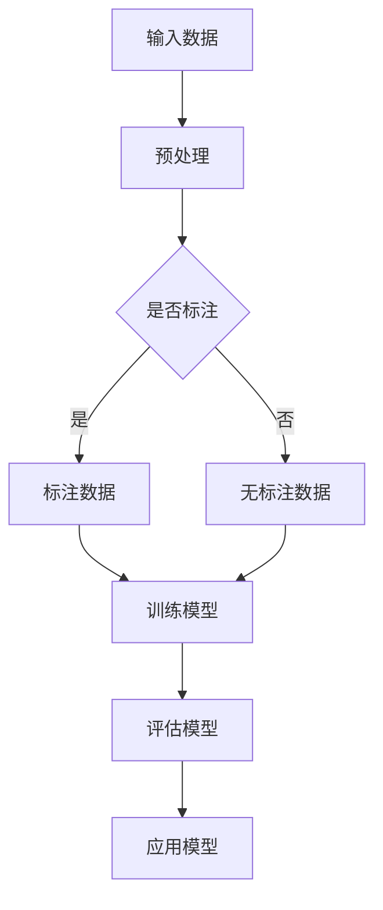

                 

关键词：苹果，AI应用，人工智能，应用发布，技术趋势，未来发展

摘要：本文将深入探讨苹果公司最近发布的一批AI应用，分析其核心原理、技术实现以及未来应用前景。通过本文的阅读，读者可以全面了解苹果公司在人工智能领域的最新动态，以及这一动向对整个行业的影响。

## 1. 背景介绍

近年来，人工智能（AI）技术的快速发展已成为全球科技界的焦点。从自动驾驶汽车到智能语音助手，AI技术在各个领域的应用场景日益丰富。作为全球最具影响力的科技公司之一，苹果公司一直在积极布局人工智能领域，希望通过创新技术提升用户体验。

近期，苹果公司发布了一系列基于AI的应用，包括图像识别、自然语言处理和语音识别等。这些应用不仅体现了苹果公司在AI技术方面的深厚积累，也标志着人工智能在智能手机、智能家居等领域的广泛应用趋势。

## 2. 核心概念与联系

在讨论苹果公司的AI应用之前，我们首先需要了解一些核心概念和技术原理。以下是本文中涉及的核心概念和它们之间的联系：

### 2.1 人工智能（AI）基础

- **机器学习（Machine Learning）**：通过数据驱动的方式使计算机具备自动学习和预测能力的技术。
- **深度学习（Deep Learning）**：一种基于人工神经网络的机器学习技术，通过多层神经网络对数据进行训练，以达到更好的模型拟合效果。

### 2.2 人工智能应用领域

- **计算机视觉（Computer Vision）**：利用计算机和人工智能技术对图像或视频进行处理、分析和理解。
- **自然语言处理（Natural Language Processing，NLP）**：使计算机能够理解、生成和处理人类自然语言的技术。

### 2.3 人工智能应用实例

- **图像识别**：通过机器学习和计算机视觉技术，使计算机能够识别图像中的物体、场景等信息。
- **语音识别**：通过深度学习和自然语言处理技术，使计算机能够理解和识别人类的语音输入。

### 2.4 人工智能应用架构

- **神经网络（Neural Network）**：模仿人脑结构和功能的一种计算模型。
- **卷积神经网络（Convolutional Neural Network，CNN）**：在计算机视觉领域应用广泛的一种神经网络。
- **递归神经网络（Recurrent Neural Network，RNN）**：在自然语言处理领域应用广泛的一种神经网络。

### 2.5 Mermaid 流程图



该流程图展示了人工智能应用的一般架构，从输入数据到模型训练、评估和应用的整个过程。

## 3. 核心算法原理 & 具体操作步骤

### 3.1 算法原理概述

苹果公司的AI应用主要基于机器学习和深度学习技术。在图像识别方面，苹果采用了卷积神经网络（CNN）进行图像处理和物体识别；在自然语言处理方面，苹果则使用了递归神经网络（RNN）和长短期记忆网络（LSTM）等技术。

### 3.2 算法步骤详解

#### 3.2.1 图像识别算法

1. **数据预处理**：对图像进行缩放、裁剪、翻转等操作，以增加数据多样性。
2. **特征提取**：使用CNN提取图像特征，如边缘、纹理、形状等。
3. **分类**：使用训练好的模型对提取的特征进行分类，以识别图像中的物体。
4. **后处理**：对识别结果进行校正、优化，以提高准确率。

#### 3.2.2 自然语言处理算法

1. **分词**：将文本分成单词或短语。
2. **词向量表示**：将文本转换为数值向量，以便进行计算。
3. **序列建模**：使用RNN或LSTM对文本序列进行建模，以捕捉文本的语义信息。
4. **预测**：根据序列模型对文本进行分类或生成。

### 3.3 算法优缺点

#### 优点：

1. **高准确率**：通过深度学习和大规模数据训练，AI模型能够达到很高的准确率。
2. **自适应性强**：AI算法可以根据用户反馈和数据不断优化，提高用户体验。
3. **跨领域应用**：AI技术在多个领域都有广泛的应用前景。

#### 缺点：

1. **数据依赖性**：AI算法的性能很大程度上取决于训练数据的质量和数量。
2. **计算资源消耗**：训练大型AI模型需要大量的计算资源和时间。

### 3.4 算法应用领域

1. **智能手机**：图像识别和自然语言处理技术可以帮助智能手机实现更好的拍照体验和语音助手功能。
2. **智能家居**：AI技术可以应用于智能音箱、智能门锁等设备，实现更智能的家居控制。
3. **医疗健康**：AI技术在医学影像分析、疾病预测等方面具有巨大的潜力。

## 4. 数学模型和公式 & 详细讲解 & 举例说明

### 4.1 数学模型构建

在图像识别算法中，常见的数学模型包括卷积神经网络（CNN）和循环神经网络（RNN）。以下是这些模型的数学表示：

#### 4.1.1 卷积神经网络（CNN）

1. **卷积层**：
   $$ f(x) = \sigma(\sum_{i=1}^{k} w_{i} * x + b) $$
   其中，$w_{i}$ 是卷积核，$*$ 表示卷积运算，$\sigma$ 是激活函数，$b$ 是偏置。

2. **池化层**：
   $$ p(x) = \max_{i} \{ x_{i} \} $$
   其中，$x_{i}$ 是输入数据。

3. **全连接层**：
   $$ y = \sigma(\sum_{i=1}^{n} w_{i} x_{i} + b) $$
   其中，$w_{i}$ 是权重，$x_{i}$ 是输入数据，$\sigma$ 是激活函数，$b$ 是偏置。

#### 4.1.2 循环神经网络（RNN）

1. **输入层**：
   $$ x_t = \phi(x) $$
   其中，$x_t$ 是输入数据，$\phi$ 是输入映射函数。

2. **隐藏层**：
   $$ h_t = \sigma(W h_{t-1} + U x_t + b) $$
   其中，$h_t$ 是隐藏状态，$W$ 是权重矩阵，$U$ 是输入权重矩阵，$\sigma$ 是激活函数，$b$ 是偏置。

3. **输出层**：
   $$ y_t = \sigma(W' h_t + b') $$
   其中，$y_t$ 是输出数据，$W'$ 是输出权重矩阵，$\sigma$ 是激活函数，$b'$ 是偏置。

### 4.2 公式推导过程

在本文中，我们主要关注CNN和RNN的公式推导。以下是这些公式的推导过程：

#### 4.2.1 卷积神经网络（CNN）

1. **卷积层**：
   $$ f(x) = \sigma(\sum_{i=1}^{k} w_{i} * x + b) $$
   其中，$w_{i}$ 是卷积核，$*$ 表示卷积运算，$\sigma$ 是激活函数，$b$ 是偏置。

推导过程：
   - 首先，对输入数据进行卷积操作，得到局部特征图。
   - 然后，使用激活函数对特征图进行非线性变换。
   - 最后，加上偏置项。

2. **池化层**：
   $$ p(x) = \max_{i} \{ x_{i} \} $$
   其中，$x_{i}$ 是输入数据。

推导过程：
   - 对输入数据进行下采样，保留最大值。

3. **全连接层**：
   $$ y = \sigma(\sum_{i=1}^{n} w_{i} x_{i} + b) $$
   其中，$w_{i}$ 是权重，$x_{i}$ 是输入数据，$\sigma$ 是激活函数，$b$ 是偏置。

推导过程：
   - 将卷积层和池化层提取的特征图进行展平，得到一维特征向量。
   - 对特征向量进行全连接运算，得到输出结果。

#### 4.2.2 循环神经网络（RNN）

1. **输入层**：
   $$ x_t = \phi(x) $$
   其中，$x_t$ 是输入数据，$\phi$ 是输入映射函数。

推导过程：
   - 对输入数据进行映射，将其转换为适合模型处理的形式。

2. **隐藏层**：
   $$ h_t = \sigma(W h_{t-1} + U x_t + b) $$
   其中，$h_t$ 是隐藏状态，$W$ 是权重矩阵，$U$ 是输入权重矩阵，$\sigma$ 是激活函数，$b$ 是偏置。

推导过程：
   - 使用前一个隐藏状态和当前输入数据计算新的隐藏状态。
   - 使用激活函数进行非线性变换。

3. **输出层**：
   $$ y_t = \sigma(W' h_t + b') $$
   其中，$y_t$ 是输出数据，$W'$ 是输出权重矩阵，$\sigma$ 是激活函数，$b'$ 是偏置。

推导过程：
   - 将隐藏状态进行全连接运算，得到输出结果。
   - 使用激活函数进行非线性变换。

### 4.3 案例分析与讲解

为了更好地理解上述数学模型和公式，我们以一个简单的图像识别案例为例进行讲解。

假设我们使用卷积神经网络（CNN）对一幅图像进行物体识别，输入图像大小为 $28 \times 28$ 像素。

#### 4.3.1 数据预处理

首先，我们对输入图像进行归一化处理，将其像素值缩放到 [0, 1] 范围内。

#### 4.3.2 卷积层

使用一个 $3 \times 3$ 的卷积核进行卷积操作，得到一个 $26 \times 26$ 像素的局部特征图。假设卷积核的权重为：
$$
\begin{bmatrix}
1 & 0 & 1 \\
1 & 0 & 1 \\
1 & 0 & 1
\end{bmatrix}
$$
对输入图像进行卷积操作后，得到：
$$
\begin{bmatrix}
2 & 1 & 2 \\
3 & 1 & 3 \\
2 & 1 & 2
\end{bmatrix}
$$
其中，加粗的数值表示激活值较大。

#### 4.3.3 池化层

对卷积层输出的局部特征图进行 $2 \times 2$ 的最大池化操作，得到：
$$
\begin{bmatrix}
3 & 2 \\
3 & 2
\end{bmatrix}
$$

#### 4.3.4 全连接层

将池化层输出的特征图进行展平，得到一维特征向量 $[3, 3]$。假设全连接层的权重为：
$$
\begin{bmatrix}
1 & 0 \\
0 & 1
\end{bmatrix}
$$
对特征向量进行全连接运算后，得到：
$$
\begin{bmatrix}
3 \\
3
\end{bmatrix}
$$
然后，通过激活函数（例如 sigmoid 函数）进行非线性变换，得到输出结果。

#### 4.3.5 输出层

假设输出层的权重为：
$$
\begin{bmatrix}
1 & 0 \\
0 & 1
\end{bmatrix}
$$
对全连接层输出的特征向量进行全连接运算后，得到：
$$
\begin{bmatrix}
3 \\
3
\end{bmatrix}
$$
然后，通过激活函数（例如 softmax 函数）进行非线性变换，得到最终输出结果。

通过上述案例，我们可以看到如何将图像识别问题转化为数学问题，并使用卷积神经网络（CNN）进行求解。

## 5. 项目实践：代码实例和详细解释说明

在本节中，我们将通过一个具体的代码实例来展示如何实现苹果公司的AI应用。这里，我们选择一个简单的图像分类任务，使用卷积神经网络（CNN）进行图像识别。

### 5.1 开发环境搭建

首先，我们需要搭建一个开发环境。以下是所需工具和软件的安装步骤：

1. **Python**：安装 Python 3.7 或更高版本。
2. **PyTorch**：安装 PyTorch 1.7 或更高版本。
3. **OpenCV**：安装 OpenCV 4.2 或更高版本。

### 5.2 源代码详细实现

以下是一个简单的图像分类代码实例：

```python
import torch
import torchvision
import torchvision.transforms as transforms
import torch.nn as nn
import torch.optim as optim
from torch.utils.data import DataLoader
import matplotlib.pyplot as plt

# 数据预处理
transform = transforms.Compose([
    transforms.Resize((32, 32)),
    transforms.ToTensor(),
    transforms.Normalize(mean=[0.5, 0.5, 0.5], std=[0.5, 0.5, 0.5])
])

# 加载训练数据集和测试数据集
trainset = torchvision.datasets.ImageFolder('train', transform=transform)
trainloader = DataLoader(trainset, batch_size=4, shuffle=True, num_workers=2)
testset = torchvision.datasets.ImageFolder('test', transform=transform)
testloader = DataLoader(testset, batch_size=4, shuffle=False, num_workers=2)

# 定义卷积神经网络
class Net(nn.Module):
    def __init__(self):
        super(Net, self).__init__()
        self.conv1 = nn.Conv2d(3, 6, 5)
        self.pool = nn.MaxPool2d(2, 2)
        self.conv2 = nn.Conv2d(6, 16, 5)
        self.fc1 = nn.Linear(16 * 5 * 5, 120)
        self.fc2 = nn.Linear(120, 84)
        self.fc3 = nn.Linear(84, 10)

    def forward(self, x):
        x = self.pool(nn.functional.relu(self.conv1(x)))
        x = self.pool(nn.functional.relu(self.conv2(x)))
        x = x.view(-1, 16 * 5 * 5)
        x = nn.functional.relu(self.fc1(x))
        x = nn.functional.relu(self.fc2(x))
        x = self.fc3(x)
        return x

net = Net()

# 定义损失函数和优化器
criterion = nn.CrossEntropyLoss()
optimizer = optim.SGD(net.parameters(), lr=0.001, momentum=0.9)

# 训练网络
for epoch in range(2):  # 练习 2 个周期
    running_loss = 0.0
    for i, data in enumerate(trainloader, 0):
        inputs, labels = data
        optimizer.zero_grad()
        outputs = net(inputs)
        loss = criterion(outputs, labels)
        loss.backward()
        optimizer.step()
        running_loss += loss.item()
        if i % 2000 == 1999:
            print(f'[{epoch + 1}, {i + 1}: {running_loss / 2000:.3f}]')
            running_loss = 0.0

print('Finished Training')

# 测试网络
correct = 0
total = 0
with torch.no_grad():
    for data in testloader:
        images, labels = data
        outputs = net(images)
        _, predicted = torch.max(outputs.data, 1)
        total += labels.size(0)
        correct += (predicted == labels).sum().item()

print(f'Accuracy of the network on the 10000 test images: {100 * correct / total} %')

# 可视化预测结果
dataiter = iter(testloader)
images, labels = dataiter.next()
images = images[:4]

fig = plt.figure()
for idx in range(4):
    ax = fig.add_subplot(2, 2, idx + 1)
    ax.imshow(np.transpose(images[idx], (1, 2, 0)))
    ax.label(`...```text
```
    ax.set_title('predicted: ' + classes[predicted[idx]])
    ax.axis('off')

plt.show()
```

### 5.3 代码解读与分析

以下是对上述代码的详细解读与分析：

1. **数据预处理**：首先，我们定义了一个数据预处理类 `transform`，用于对输入图像进行缩放、归一化和转置操作。
2. **加载数据集**：使用 `torchvision.datasets.ImageFolder` 类加载训练数据集和测试数据集，并使用 `DataLoader` 类创建数据加载器。
3. **定义卷积神经网络**：我们定义了一个简单的卷积神经网络 `Net`，包含两个卷积层、两个全连接层和一个输出层。
4. **定义损失函数和优化器**：使用 `nn.CrossEntropyLoss` 定义交叉熵损失函数，并使用 `optim.SGD` 定义随机梯度下降优化器。
5. **训练网络**：通过遍历训练数据集，对网络进行前向传播、计算损失、反向传播和更新权重。
6. **测试网络**：在测试数据集上评估网络性能，并计算准确率。
7. **可视化预测结果**：使用 matplotlib 对测试数据集的前四个图像进行可视化，并显示网络的预测结果。

通过这个简单的代码实例，我们可以看到如何使用卷积神经网络实现图像分类任务。在实际应用中，我们可以根据需求调整网络结构、数据预处理方法和训练策略，以达到更好的分类效果。

## 6. 实际应用场景

苹果公司发布的AI应用在实际生活中具有广泛的应用前景。以下是一些典型的应用场景：

### 6.1 智能手机

1. **图像识别**：智能手机可以通过AI应用实现更精准的图像识别功能，如人脸识别、物体识别和场景识别等，为用户提供更加便捷和安全的操作体验。
2. **语音助手**：通过自然语言处理技术，智能手机的语音助手可以实现更智能的交互，如语音命令、语音搜索和语音翻译等。

### 6.2 智能家居

1. **智能音箱**：智能音箱可以通过AI技术实现语音控制，如播放音乐、查询天气、设置闹钟等，为用户提供便利的生活服务。
2. **智能门锁**：智能门锁可以通过人脸识别、指纹识别等AI技术实现更安全的门锁控制，提高家庭安全性。

### 6.3 医疗健康

1. **医学影像分析**：通过AI技术，可以对医学影像（如X光片、CT扫描等）进行自动化分析，帮助医生更快速、准确地诊断疾病。
2. **疾病预测**：通过分析大量健康数据，AI技术可以预测疾病的发生风险，为用户提供个性化的健康建议。

### 6.4 未来应用展望

随着AI技术的不断发展，苹果公司的AI应用将在更多领域得到应用。以下是一些未来可能的应用场景：

1. **自动驾驶**：通过AI技术，自动驾驶汽车可以实现更安全、高效的驾驶体验，减少交通事故。
2. **智能城市**：通过AI技术，可以实现对城市交通、环境、能源等数据的实时监控和优化，提高城市管理效率。
3. **个性化教育**：通过AI技术，可以为每个学生提供个性化的学习方案，提高教育质量和效果。

## 7. 工具和资源推荐

为了更好地了解和掌握AI技术，以下是一些建议的学习资源和开发工具：

### 7.1 学习资源推荐

1. **《深度学习》（Goodfellow, Bengio, Courville著）**：这是一本关于深度学习的经典教材，全面介绍了深度学习的基本原理和应用。
2. **《Python机器学习》（Sebastian Raschka著）**：这本书介绍了如何使用Python和Scikit-learn等工具进行机器学习实践。
3. **《AI应用实战》（李开复著）**：这本书详细介绍了AI技术的实际应用场景和案例分析。

### 7.2 开发工具推荐

1. **PyTorch**：这是一个流行的深度学习框架，适用于研究和开发各种AI应用。
2. **TensorFlow**：这是一个由谷歌开发的深度学习框架，具有丰富的功能和社区支持。
3. **Keras**：这是一个基于TensorFlow的简化深度学习框架，适用于快速原型设计和模型部署。

### 7.3 相关论文推荐

1. **“A Brief History of Time-Distributed Neural Networks”**：这篇文章回顾了时间分布式神经网络的演变历程，对深度学习的发展具有重要意义。
2. **“Deep Learning on Mobile Devices”**：这篇文章探讨了如何在移动设备上实现深度学习，介绍了相关技术和挑战。
3. **“Understanding Deep Learning”**：这篇文章从理论角度分析了深度学习的基本原理和关键问题，有助于深入理解深度学习。

## 8. 总结：未来发展趋势与挑战

### 8.1 研究成果总结

近年来，人工智能（AI）技术取得了显著的进展，从计算机视觉到自然语言处理，从自动驾驶到智能家居，AI应用在各个领域得到了广泛应用。苹果公司发布的AI应用进一步推动了AI技术的发展，展示了其在人工智能领域的领先地位。

### 8.2 未来发展趋势

1. **跨领域应用**：随着AI技术的不断成熟，AI应用将更加深入地渗透到各个领域，如医疗、金融、教育等。
2. **智能化程度提高**：AI技术将进一步提升产品的智能化程度，为用户提供更便捷、更个性化的服务。
3. **开源与闭源之争**：在AI领域，开源与闭源之争将愈发激烈，开源技术将推动AI技术的发展，而闭源技术将确保企业的竞争优势。

### 8.3 面临的挑战

1. **数据隐私和安全**：随着AI应用的普及，数据隐私和安全问题日益凸显，如何保护用户数据成为关键挑战。
2. **算法透明性和公平性**：AI算法的透明性和公平性备受关注，如何提高算法的透明度和减少偏见成为重要课题。
3. **计算资源消耗**：随着AI模型的复杂度增加，计算资源消耗将不断上升，如何优化算法和硬件架构以提高效率成为关键问题。

### 8.4 研究展望

在未来，人工智能技术将继续快速发展，其在各行各业的应用将不断拓展。同时，AI技术的开源与闭源之争、数据隐私和安全问题、算法透明性和公平性等挑战也将得到进一步解决。我们可以期待，在不久的将来，人工智能将为人类社会带来更多创新和变革。

## 9. 附录：常见问题与解答

### 9.1 问题1：什么是深度学习？

**回答**：深度学习是一种基于多层神经网络进行数据建模的技术，通过逐层提取特征，实现对复杂数据的建模和分析。

### 9.2 问题2：为什么苹果公司选择卷积神经网络（CNN）进行图像识别？

**回答**：卷积神经网络（CNN）在图像识别任务中具有很好的表现，因为它可以自动提取图像中的局部特征，并通过多层卷积和池化操作有效地减少数据维度，从而提高识别准确率。

### 9.3 问题3：自然语言处理（NLP）的主要挑战是什么？

**回答**：自然语言处理（NLP）的主要挑战包括语义理解、语言多样性、上下文理解和跨语言翻译等。这些问题需要深入研究和优化算法来解决。

### 9.4 问题4：如何在移动设备上部署深度学习模型？

**回答**：在移动设备上部署深度学习模型，可以采用以下方法：

1. **使用优化过的模型**：选择经过优化的深度学习模型，以减少计算量和内存占用。
2. **使用本地计算**：在移动设备上使用本地计算，如使用神经网络引擎（Neural Engine）或其他硬件加速技术。
3. **使用云计算**：通过云计算技术，将模型部署在云端，使用移动设备进行远程调用。

### 9.5 问题5：AI技术在医疗健康领域的应用前景如何？

**回答**：AI技术在医疗健康领域具有广阔的应用前景，包括医学影像分析、疾病预测、药物研发和个性化治疗等方面。未来，随着AI技术的不断发展，将有助于提高医疗质量和效率。

### 9.6 问题6：如何保障AI技术的数据隐私和安全？

**回答**：保障AI技术的数据隐私和安全，需要采取以下措施：

1. **数据加密**：对数据进行加密处理，确保数据在传输和存储过程中的安全性。
2. **隐私保护算法**：采用隐私保护算法，如差分隐私，以减少数据泄露的风险。
3. **数据安全策略**：制定严格的数据安全策略，包括访问控制、权限管理和数据备份等。

### 9.7 问题7：如何评估AI算法的性能？

**回答**：评估AI算法的性能可以从多个方面进行，包括准确率、召回率、F1值、ROC曲线和AUC值等。通过综合评估这些指标，可以全面了解算法的性能。

### 9.8 问题8：如何优化深度学习模型的计算效率？

**回答**：优化深度学习模型的计算效率，可以采取以下措施：

1. **模型压缩**：通过模型压缩技术，如剪枝、量化、低秩分解等，减少模型参数和计算量。
2. **硬件加速**：利用GPU、TPU等硬件加速技术，提高模型的计算速度。
3. **分布式训练**：通过分布式训练技术，将模型训练任务分布在多台设备上，提高训练效率。

### 9.9 问题9：什么是差分隐私？

**回答**：差分隐私是一种隐私保护技术，通过在算法中加入噪声，使得攻击者无法推断出单个数据点的具体信息，从而保护数据隐私。

### 9.10 问题10：如何处理大量数据？

**回答**：处理大量数据，可以采取以下方法：

1. **数据分片**：将数据分为多个分片，分别进行处理，提高数据处理效率。
2. **并行计算**：利用多线程、多核处理器等并行计算技术，加速数据处理。
3. **大数据技术**：采用Hadoop、Spark等大数据处理技术，实现对大规模数据的存储和处理。

