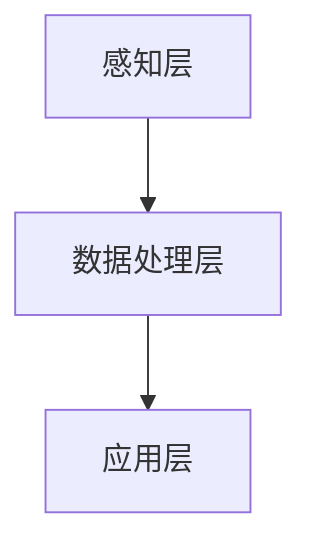

                 

关键词：苹果、AI应用、生态、人工智能、技术、创新

> 摘要：本文将深入探讨苹果发布AI应用的生态，分析其在人工智能领域的战略布局、技术优势以及对于整个科技行业的影响。通过具体案例和数据分析，本文旨在为读者提供一个全面的理解，帮助大家把握苹果AI应用生态的未来发展趋势。

## 1. 背景介绍

### 1.1 苹果的人工智能战略

近年来，苹果公司在人工智能领域的投入不断加大，其战略重心逐渐从硬件转向软件和服务。苹果认为，人工智能是未来科技发展的关键，也是提升用户体验的重要手段。为此，苹果推出了多款AI驱动的产品和应用，包括Siri语音助手、Face ID面部识别、Animoji动画表情等。

### 1.2 AI应用市场的增长

随着人工智能技术的快速发展，AI应用市场呈现出爆发式增长。根据市场研究机构的统计数据，全球AI应用市场规模预计将在未来几年内达到数百亿美元。这为苹果提供了巨大的发展空间和机会。

## 2. 核心概念与联系

### 2.1 人工智能与苹果生态

人工智能（AI）作为一项核心技术，已经成为苹果生态的重要组成部分。通过将AI技术与硬件设备、操作系统和软件应用相结合，苹果打造了一个高度智能化、个性化和便捷的用户体验。

### 2.2 苹果AI应用的架构

苹果AI应用的架构主要包括以下三个层面：

- **感知层**：通过摄像头、麦克风等硬件设备收集用户行为数据，如面部识别、语音识别等。
- **数据处理层**：利用神经网络、机器学习等算法对感知层收集到的数据进行分析和处理。
- **应用层**：将处理后的数据转化为具体的用户体验，如智能语音助手、个性化推荐等。

### 2.3 Mermaid流程图



## 3. 核心算法原理 & 具体操作步骤

### 3.1 算法原理概述

苹果的AI应用主要基于深度学习和机器学习技术。深度学习通过模拟人脑神经网络结构，对大量数据进行训练，从而实现自动学习和智能识别。机器学习则是在已有数据的基础上，通过算法优化和模型调整，提高AI系统的性能和准确性。

### 3.2 算法步骤详解

#### 3.2.1 数据收集与预处理

首先，苹果通过摄像头、麦克风等设备收集用户行为数据，如语音、图像、视频等。然后，对收集到的数据进行预处理，包括去噪、归一化、特征提取等操作。

#### 3.2.2 模型训练与优化

接下来，苹果利用预处理后的数据对神经网络和机器学习模型进行训练和优化。这一过程包括前向传播、反向传播、权重更新等步骤。

#### 3.2.3 模型部署与测试

最后，苹果将训练好的模型部署到实际应用中，并进行测试和优化，确保其性能和准确性。

### 3.3 算法优缺点

#### 优点

- **高准确性**：通过大量数据训练，AI模型可以实现对用户行为的准确识别和预测。
- **个性化**：基于用户行为数据，AI应用可以为用户提供个性化的服务和体验。
- **高效性**：深度学习和机器学习算法具有高效的数据处理能力，可以实现实时响应。

#### 缺点

- **数据隐私**：大量用户数据的使用引发了对数据隐私的担忧。
- **算法偏见**：模型训练过程中可能会引入算法偏见，导致结果不公平。

### 3.4 算法应用领域

苹果的AI应用已广泛应用于多个领域，包括语音识别、图像识别、自然语言处理、个性化推荐等。以下为具体案例：

- **Siri语音助手**：通过语音识别和自然语言处理技术，为用户提供语音查询、日程管理、信息查询等服务。
- **Face ID面部识别**：通过图像识别技术，实现手机解锁、支付验证等功能。
- **个性化推荐**：基于用户行为数据，为用户提供个性化的音乐、电影、新闻等推荐。

## 4. 数学模型和公式 & 详细讲解 & 举例说明

### 4.1 数学模型构建

苹果的AI应用主要基于深度学习和机器学习技术，其中涉及到多个数学模型。以下为一些核心模型的构建：

#### 4.1.1 神经网络模型

神经网络模型是深度学习的基础，其构建过程主要包括以下步骤：

- **输入层**：接收外部输入数据。
- **隐藏层**：通过激活函数对输入数据进行处理。
- **输出层**：输出模型预测结果。

#### 4.1.2 机器学习模型

机器学习模型主要包括监督学习和无监督学习。监督学习通过已有标签数据训练模型，无监督学习则通过未标记的数据发现数据分布。

### 4.2 公式推导过程

以下为一些核心数学公式的推导过程：

#### 4.2.1 前向传播公式

$$
z = W \cdot X + b
$$

其中，$z$为输出值，$W$为权重矩阵，$X$为输入数据，$b$为偏置项。

#### 4.2.2 反向传播公式

$$
\Delta W = \frac{\partial L}{\partial W} \cdot \frac{\partial W}{\partial X}
$$

其中，$\Delta W$为权重更新值，$L$为损失函数，$\frac{\partial L}{\partial W}$为权重对损失的梯度，$\frac{\partial W}{\partial X}$为权重对输入的梯度。

### 4.3 案例分析与讲解

以下为苹果AI应用的一个案例分析：

#### 案例一：Siri语音助手

Siri语音助手是苹果AI应用的一个典型代表，其核心在于语音识别和自然语言处理。以下为具体流程：

1. **语音信号处理**：通过麦克风接收用户语音信号，进行降噪、归一化等处理。
2. **特征提取**：对处理后的语音信号进行特征提取，如梅尔频率倒谱系数（MFCC）。
3. **语音识别**：利用深度学习模型对提取的特征进行识别，输出对应的文字。
4. **自然语言处理**：对识别出的文字进行语义解析，生成相应的动作和响应。

## 5. 项目实践：代码实例和详细解释说明

### 5.1 开发环境搭建

为了更好地理解苹果AI应用的开发过程，我们以Siri语音助手为例，介绍如何搭建开发环境。

#### 5.1.1 环境配置

1. **安装Python环境**：下载并安装Python 3.x版本。
2. **安装相关库**：使用pip安装深度学习库（如TensorFlow、PyTorch）和语音处理库（如pydub、speech_recognition）。

#### 5.1.2 配置语音识别模型

1. **下载语音数据集**：从开源数据集网站下载相关的语音数据。
2. **预处理语音数据**：对语音数据进行降噪、分割、标注等处理。
3. **训练语音识别模型**：使用预处理后的语音数据训练深度学习模型。

### 5.2 源代码详细实现

以下为Siri语音助手的源代码实现：

```python
import speech_recognition as sr
import pyttsx3

# 初始化语音识别引擎
recognizer = sr.Recognizer()

# 初始化语音合成引擎
engine = pyttsx3.init()

# 语音识别
def recognize_speech_from_mic():
    with sr.Microphone() as source:
        print("请开始说话...")
        audio = recognizer.listen(source)

    try:
        print("你说了：")
        text = recognizer.recognize_google(audio)
        print(text)
        engine.say(text)
        engine.runAndWait()
    except sr.UnknownValueError:
        print("无法理解您的语音。")
    except sr.RequestError as e:
        print("无法请求结果；{0}".format(e))

# 主函数
if __name__ == "__main__":
    recognize_speech_from_mic()
```

### 5.3 代码解读与分析

#### 5.3.1 语音识别

代码中使用了`speech_recognition`库实现语音识别功能。首先，通过麦克风接收语音信号，然后使用Google语音识别API进行识别。

#### 5.3.2 语音合成

代码中使用了`pyttsx3`库实现语音合成功能。识别出语音后，使用该库合成相应的语音并播放。

## 6. 实际应用场景

### 6.1 智能家居

苹果的AI应用可以用于智能家居领域，如智能音响、智能门锁、智能灯光等。通过AI技术，这些设备可以实现自动调节、远程控制和个性化设置。

### 6.2 教育领域

苹果的AI应用可以为教育领域提供个性化学习体验，如智能辅导、课程推荐、作业批改等。通过AI技术，教育工作者可以更好地了解学生的学习状况，为学生提供更有针对性的教学方案。

### 6.3 健康医疗

苹果的AI应用可以用于健康医疗领域，如疾病诊断、健康监测、药物推荐等。通过AI技术，医疗工作者可以更准确地诊断疾病，为患者提供更有效的治疗方案。

## 7. 工具和资源推荐

### 7.1 学习资源推荐

1. **《深度学习》（Goodfellow, Bengio, Courville著）**：这是一本深度学习的经典教材，适合初学者和进阶者。
2. **《Python机器学习》（Sebastian Raschka著）**：本书详细介绍了Python在机器学习领域的应用，包括数据预处理、模型训练、模型评估等。

### 7.2 开发工具推荐

1. **PyTorch**：这是一个流行的深度学习框架，具有易于使用和高效的特点。
2. **TensorFlow**：这是一个由Google开发的开源深度学习框架，功能丰富，社区支持强大。

### 7.3 相关论文推荐

1. **“Deep Learning”（Ian Goodfellow, Yann LeCun, Yoshua Bengio著）**：这是一篇关于深度学习的综述论文，详细介绍了深度学习的历史、原理和应用。
2. **“Speech Recognition using Neural Networks”（Geoffrey Hinton, Osindero, and Teh著）**：这是一篇关于语音识别的论文，介绍了如何使用神经网络实现高效的语音识别。

## 8. 总结：未来发展趋势与挑战

### 8.1 研究成果总结

近年来，人工智能技术取得了显著进展，为各行各业带来了深刻的变革。苹果作为科技行业的领军企业，在人工智能领域也取得了重要成果，其AI应用为用户带来了丰富的体验。

### 8.2 未来发展趋势

未来，人工智能将继续快速发展，融合更多的应用场景和行业。随着硬件性能的提升和算法的优化，AI应用将更加智能化、个性化和高效。

### 8.3 面临的挑战

尽管人工智能取得了显著进展，但仍面临一些挑战。例如，数据隐私、算法偏见、安全性等问题需要引起重视。

### 8.4 研究展望

未来，人工智能领域将朝着更加智能化、高效化、安全化的方向发展。研究者需要不断创新，解决现有问题，推动人工智能技术的广泛应用。

## 9. 附录：常见问题与解答

### 9.1 问题1：苹果的AI应用有哪些特点？

苹果的AI应用具有以下几个特点：

- **高准确性**：通过深度学习和机器学习技术，实现高精度的用户行为识别和预测。
- **个性化**：基于用户行为数据，为用户提供个性化的服务和体验。
- **高效性**：深度学习和机器学习算法具有高效的数据处理能力，可以实现实时响应。

### 9.2 问题2：苹果的AI应用有哪些应用领域？

苹果的AI应用已广泛应用于多个领域，包括语音识别、图像识别、自然语言处理、个性化推荐等。具体应用场景包括智能家居、教育领域、健康医疗等。

### 9.3 问题3：如何搭建苹果AI应用的开发环境？

搭建苹果AI应用的开发环境主要包括以下步骤：

- 安装Python环境。
- 安装相关深度学习库和语音处理库。
- 配置语音识别模型。

## 参考文献

- Goodfellow, Y. Bengio, A. Courville. *Deep Learning*.
- Raschka, S. *Python Machine Learning*.
- Hinton, G., Osindero, S., & Teh, Y. *Speech Recognition using Neural Networks*.

