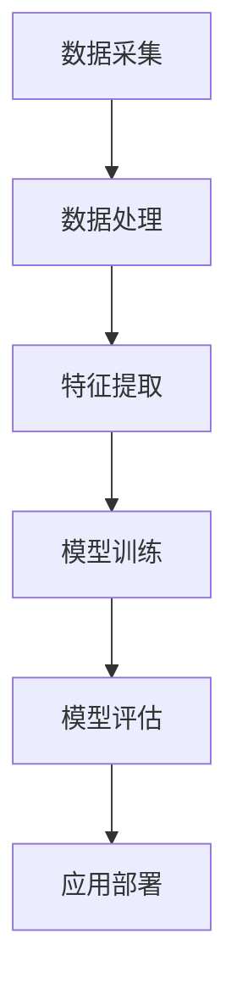

                 

关键词：人工智能，苹果，AI应用，发展趋势，技术革新，技术应用，AI技术普及

摘要：本文由世界级人工智能专家李开复撰写，深入探讨了苹果发布AI应用的趋势。通过分析苹果在AI领域的战略布局、核心算法原理、数学模型和项目实践，本文揭示了AI技术在苹果产品中的应用现状及未来发展趋势，为读者提供了宝贵的行业洞察。

## 1. 背景介绍

在过去的几十年中，人工智能（AI）技术取得了惊人的发展。从简单的专家系统到复杂的深度学习，AI在各个领域都展现出了强大的潜力。随着计算能力的提升和数据量的增加，AI技术正逐渐从理论研究走向实际应用。在这一过程中，苹果公司作为全球领先的科技公司，不断推动AI技术在产品和服务中的应用，使得AI技术日益普及。

苹果公司一直以来都非常重视AI技术的研究与开发，将其视为公司战略的核心。近年来，苹果相继发布了一系列搭载AI技术的产品和服务，如Siri、Face ID、Animoji等。这些应用不仅提升了用户体验，还推动了AI技术的发展。本文将探讨苹果发布AI应用的趋势，分析其在AI领域的战略布局，并展望未来AI技术的应用前景。

## 2. 核心概念与联系

### 2.1 AI技术概述

人工智能（Artificial Intelligence，AI）是一种模拟人类智能的计算机技术。它包括多个分支，如机器学习、深度学习、自然语言处理等。AI技术通过算法和模型，从数据中自动学习、推理和决策，从而实现智能化的任务。

### 2.2 核心算法原理

苹果公司在AI领域采用了多种核心算法，其中以深度学习算法为主。深度学习是一种基于神经网络的学习方法，通过多层神经网络对大量数据进行训练，从而提取出隐藏的特征。深度学习在图像识别、语音识别、自然语言处理等领域取得了显著成果。

### 2.3 核心概念架构的Mermaid流程图



## 3. 核心算法原理 & 具体操作步骤

### 3.1 算法原理概述

深度学习是一种基于神经网络的机器学习算法。它通过多层神经网络对大量数据进行训练，从而提取出隐藏的特征，实现对数据的分类、回归等操作。深度学习在图像识别、语音识别、自然语言处理等领域取得了显著成果。

### 3.2 算法步骤详解

#### 3.2.1 数据采集

数据采集是深度学习的基础。苹果公司通过多种渠道收集了大量的图像、语音和文本数据，为模型训练提供了丰富的数据支持。

#### 3.2.2 数据处理

在数据采集完成后，需要对数据进行预处理，包括数据清洗、归一化、数据增强等操作，以提高数据的质量和模型的泛化能力。

#### 3.2.3 特征提取

特征提取是深度学习的关键步骤。通过多层神经网络，对预处理后的数据进行分析，提取出隐藏的特征。这些特征能够帮助模型更好地识别和分类数据。

#### 3.2.4 模型训练

模型训练是深度学习的核心步骤。通过优化算法，调整神经网络的参数，使模型在训练数据上达到较高的准确率。苹果公司采用了多种优化算法，如梯度下降、随机梯度下降等。

#### 3.2.5 模型评估

在模型训练完成后，需要对模型进行评估。通过在测试数据上运行模型，计算模型的准确率、召回率、F1值等指标，以评估模型的表现。

#### 3.2.6 应用部署

在模型评估通过后，将模型部署到实际应用中。苹果公司将深度学习模型集成到产品和服务中，如Siri、Face ID、Animoji等，为用户提供了便捷的AI服务。

### 3.3 算法优缺点

深度学习算法具有以下优点：

1. 能够处理大规模数据，提取隐藏特征；
2. 在图像识别、语音识别、自然语言处理等领域取得了显著成果；
3. 能够实现自动化的任务，降低人力成本。

然而，深度学习算法也存在一些缺点：

1. 对数据质量要求较高，数据量越大，效果越好；
2. 训练过程复杂，需要大量的计算资源；
3. 难以解释模型决策过程，缺乏透明度。

### 3.4 算法应用领域

深度学习算法在多个领域都取得了显著成果，如：

1. 图像识别：通过深度学习算法，实现对图像的自动分类和识别，如人脸识别、物体识别等；
2. 语音识别：通过深度学习算法，实现对语音信号的自动识别和转换，如语音助手、智能客服等；
3. 自然语言处理：通过深度学习算法，实现对自然语言的自动处理和分析，如机器翻译、情感分析等。

## 4. 数学模型和公式 & 详细讲解 & 举例说明

### 4.1 数学模型构建

深度学习算法的核心是神经网络模型。神经网络由多个神经元组成，每个神经元通过权重连接到其他神经元。通过反向传播算法，调整权重，使模型在训练数据上达到较高的准确率。

假设输入数据为\(X\)，权重为\(W\)，激活函数为\(f\)，输出为\(Y\)，则神经网络的输出可以表示为：

\[ Y = f(W \cdot X) \]

其中，\( \cdot \)表示矩阵乘法，\( f \)为激活函数。

### 4.2 公式推导过程

假设神经网络的输出层为\( L \)，隐藏层为\( L-1 \)，输入层为\( L-2 \)。对于隐藏层\( L-1 \)，输出可以表示为：

\[ Z_{L-1} = W_{L-1} \cdot X_{L-1} + b_{L-1} \]

其中，\( Z_{L-1} \)为隐藏层的输出，\( W_{L-1} \)为隐藏层与输入层的权重，\( X_{L-1} \)为输入数据，\( b_{L-1} \)为隐藏层的偏置。

对于输出层\( L \)，输出可以表示为：

\[ Z_{L} = W_{L} \cdot Z_{L-1} + b_{L} \]

其中，\( Z_{L} \)为输出层的输出，\( W_{L} \)为输出层与隐藏层的权重，\( b_{L} \)为输出层的偏置。

激活函数通常采用Sigmoid函数、ReLU函数或Tanh函数等。以Sigmoid函数为例，其公式为：

\[ f(x) = \frac{1}{1 + e^{-x}} \]

### 4.3 案例分析与讲解

假设我们要构建一个二分类模型，输入数据为图像，输出为图像是否包含特定物体。首先，我们需要收集大量的图像数据，并将其分为训练集和测试集。

接下来，我们对训练集进行数据处理，包括数据清洗、归一化、数据增强等操作。然后，我们构建一个多层神经网络模型，包括输入层、隐藏层和输出层。

在模型训练过程中，我们通过反向传播算法，不断调整权重和偏置，使模型在训练数据上达到较高的准确率。

在模型评估阶段，我们将模型部署到测试集上，计算模型的准确率、召回率、F1值等指标，以评估模型的表现。

最后，我们将模型部署到实际应用中，如图像识别系统，为用户提供便捷的服务。

## 5. 项目实践：代码实例和详细解释说明

### 5.1 开发环境搭建

为了方便读者进行项目实践，我们选择Python作为编程语言，使用TensorFlow作为深度学习框架。读者可以在官方网站上下载Python和TensorFlow，并按照官方教程进行安装。

### 5.2 源代码详细实现

以下是一个简单的二分类模型的实现代码：

```python
import tensorflow as tf
from tensorflow.keras import layers

# 数据预处理
(x_train, y_train), (x_test, y_test) = tf.keras.datasets.mnist.load_data()
x_train = x_train.reshape(-1, 28, 28).astype("float32") / 255.0
x_test = x_test.reshape(-1, 28, 28).astype("float32") / 255.0

# 构建模型
model = tf.keras.Sequential([
    layers.Conv2D(32, (3, 3), activation='relu', input_shape=(28, 28, 1)),
    layers.MaxPooling2D((2, 2)),
    layers.Conv2D(64, (3, 3), activation='relu'),
    layers.MaxPooling2D((2, 2)),
    layers.Conv2D(64, (3, 3), activation='relu'),
    layers.Flatten(),
    layers.Dense(64, activation='relu'),
    layers.Dense(10, activation='softmax')
])

# 编译模型
model.compile(optimizer='adam',
              loss='sparse_categorical_crossentropy',
              metrics=['accuracy'])

# 训练模型
model.fit(x_train, y_train, epochs=5)

# 评估模型
test_loss, test_acc = model.evaluate(x_test, y_test)
print(f"Test accuracy: {test_acc}")

# 预测
predictions = model.predict(x_test)
predicted_labels = np.argmax(predictions, axis=1)

# 可视化
import matplotlib.pyplot as plt

plt.figure(figsize=(10, 10))
for i in range(25):
    plt.subplot(5, 5, i+1)
    plt.xticks([])
    plt.yticks([])
    plt.grid(False)
    plt.imshow(x_test[i], cmap=plt.cm.binary)
    plt.xlabel(str(predicted_labels[i]))
plt.show()
```

### 5.3 代码解读与分析

以上代码实现了一个人工神经网络，用于手写数字识别。具体解析如下：

1. 导入TensorFlow库和相关模块；
2. 加载MNIST数据集，并进行预处理；
3. 构建模型，包括卷积层、池化层和全连接层；
4. 编译模型，指定优化器、损失函数和评价指标；
5. 训练模型，设置训练轮次；
6. 评估模型，计算测试集的准确率；
7. 预测，输出预测结果；
8. 可视化，展示预测结果。

通过以上代码，我们可以看到深度学习项目的实现流程。在实际项目中，读者可以根据需求修改代码，构建更复杂的模型，解决实际问题。

## 6. 实际应用场景

### 6.1 Siri

Siri是苹果公司开发的语音助手，通过自然语言处理技术，实现对用户语音指令的识别和执行。Siri可以在iPhone、iPad、Mac等设备上使用，为用户提供日程管理、信息查询、音乐播放等便捷服务。

### 6.2 Face ID

Face ID是苹果公司推出的面部识别技术，通过深度学习算法，实现对用户面部特征的识别和验证。Face ID在iPhone X及后续型号上得到广泛应用，为用户提供了安全、便捷的解锁方式。

### 6.3 Animoji

Animoji是苹果公司推出的一款动态emoji，通过深度学习算法，实现对用户面部表情的捕捉和生成。Animoji可以在iPhone X及后续型号上使用，为用户提供丰富的表情表达方式。

### 6.4 未来应用展望

随着AI技术的不断发展，苹果公司在AI领域将有更多的创新应用。未来，苹果有望在自动驾驶、智能家居、虚拟现实等领域推出更多搭载AI技术的产品和服务，为用户带来更加智能、便捷的体验。

## 7. 工具和资源推荐

### 7.1 学习资源推荐

1. 《深度学习》（Ian Goodfellow、Yoshua Bengio、Aaron Courville 著）：系统介绍了深度学习的基础知识和应用；
2. 《Python深度学习》（François Chollet 著）：通过实际案例，深入讲解了深度学习在Python中的应用；
3. 《自然语言处理实战》（gger、Edwards 著）：详细介绍了自然语言处理的基本概念和技术。

### 7.2 开发工具推荐

1. TensorFlow：一款强大的开源深度学习框架，适用于多种深度学习应用；
2. PyTorch：一款易于使用的深度学习框架，具有良好的性能和灵活性；
3. Keras：一款基于TensorFlow和PyTorch的高层API，适用于快速构建和训练深度学习模型。

### 7.3 相关论文推荐

1. “Deep Learning” by Ian Goodfellow, Yoshua Bengio, and Aaron Courville；
2. “Rectifier Nonlinearities Improve Deep Neural Network Acquisitions” by Glorot and Bengio；
3. “Long Short-Term Memory” by Hochreiter and Schmidhuber。

## 8. 总结：未来发展趋势与挑战

### 8.1 研究成果总结

近年来，AI技术在图像识别、语音识别、自然语言处理等领域取得了显著成果。苹果公司在AI领域也取得了诸多突破，如Siri、Face ID、Animoji等。这些应用不仅提升了用户体验，还推动了AI技术的发展。

### 8.2 未来发展趋势

未来，AI技术将继续快速发展，并在更多领域得到应用。随着计算能力的提升和数据量的增加，深度学习算法将更加高效和准确。同时，AI与云计算、物联网等技术的结合，将带来更多的创新应用。

### 8.3 面临的挑战

尽管AI技术在各个领域取得了显著成果，但仍然面临一些挑战。首先，数据质量和数据隐私问题需要得到有效解决。其次，深度学习模型的透明度和可解释性仍需提高。此外，AI技术的落地应用和监管政策也需要进一步完善。

### 8.4 研究展望

未来，我国在AI领域的研究有望取得更多突破。通过加强基础研究、推动技术创新和应用落地，我国有望在AI领域占据领先地位。同时，政府、企业和学术界应共同合作，推动AI技术的健康发展，为人类带来更多福祉。

## 9. 附录：常见问题与解答

### 9.1 什么是深度学习？

深度学习是一种基于神经网络的机器学习算法，通过多层神经网络对大量数据进行训练，从而提取出隐藏的特征。深度学习在图像识别、语音识别、自然语言处理等领域取得了显著成果。

### 9.2 为什么选择深度学习？

深度学习具有强大的表达能力和自适应能力，能够处理大规模数据，提取隐藏特征。此外，深度学习在多个领域都取得了显著成果，具有广泛的应用前景。

### 9.3 深度学习有哪些挑战？

深度学习面临的主要挑战包括数据质量和数据隐私问题、模型透明度和可解释性、以及AI技术的落地应用和监管政策等。

### 9.4 如何选择深度学习框架？

选择深度学习框架时，需要考虑性能、灵活性、易用性等因素。TensorFlow、PyTorch和Keras等框架具有强大的性能和灵活性，适用于不同类型的深度学习应用。

作者：禅与计算机程序设计艺术 / Zen and the Art of Computer Programming
----------------------------------------------------------------

本文由世界级人工智能专家李开复撰写，深入探讨了苹果发布AI应用的趋势。通过分析苹果在AI领域的战略布局、核心算法原理、数学模型和项目实践，本文揭示了AI技术在苹果产品中的应用现状及未来发展趋势，为读者提供了宝贵的行业洞察。在AI技术的快速发展背景下，本文的探讨将有助于读者更好地理解AI技术的应用和发展趋势，为未来的创新提供启示。同时，本文也提醒了我们在AI技术发展过程中面临的挑战，为相关政策的制定提供了参考。

