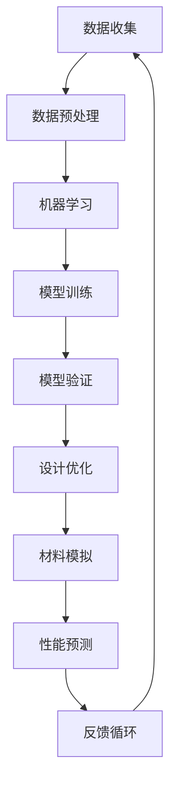

                 

关键词：材料设计，人工智能，科学计算，机器学习，材料模拟，数据驱动设计，深度学习，算法优化，应用场景，未来展望

摘要：随着科学技术的迅猛发展，材料设计已成为现代科学研究中的重要领域。人工智能（AI）的兴起为材料设计带来了全新的机遇与挑战。本文旨在探讨AI在材料设计中的应用，包括核心算法原理、数学模型构建、项目实践以及实际应用场景。通过分析AI在材料设计中的重要作用，我们展望了未来发展趋势和面临的挑战。

## 1. 背景介绍

材料设计是科学研究的重要领域之一，它涉及到材料的基本性质、结构、功能及其在应用中的性能优化。传统材料设计主要依赖于实验和理论模型的结合，然而，这种方法存在周期长、成本高、效率低等问题。随着计算机技术的进步，特别是人工智能的快速发展，数据驱动的设计方法逐渐成为材料设计的重要手段。

人工智能是指通过计算机程序实现智能行为的技术，包括机器学习、深度学习、自然语言处理等子领域。在材料设计领域，AI的应用不仅能够加速新材料的发现和优化，还可以提高材料设计的准确性和可靠性。

科学计算是指利用计算机和算法进行科学研究和工程计算的方法。在材料设计中，科学计算用于模拟材料的行为，预测材料的性能，优化材料的结构设计。随着计算能力的提升，科学计算在材料设计中的应用越来越广泛。

## 2. 核心概念与联系

为了更好地理解AI在材料设计中的应用，我们需要先了解几个核心概念：

### 2.1 机器学习

机器学习是一种人工智能的子领域，它通过算法从数据中学习规律，并在新的数据上做出预测或决策。在材料设计中，机器学习可以用于预测材料的性能、优化材料结构、识别新材料。

### 2.2 深度学习

深度学习是机器学习的一种方法，通过多层神经网络进行数据建模。在材料设计中，深度学习可以用于复杂的材料模拟，如纳米材料的电子结构分析。

### 2.3 数据驱动设计

数据驱动设计是一种以数据为基础的设计方法，它利用大量实验数据和模拟数据来指导材料的设计。在材料设计中，数据驱动设计可以显著提高设计效率和准确性。

### 2.4 Mermaid 流程图

以下是一个简化的Mermaid流程图，展示AI在材料设计中的核心概念及其联系：



### 2.5 数据预处理

数据预处理是机器学习和深度学习的重要步骤，它包括数据清洗、数据标准化、特征提取等。在材料设计中，数据预处理用于确保输入数据的准确性和一致性，从而提高模型的预测能力。

### 2.6 模型训练与验证

模型训练与验证是机器学习和深度学习中的核心步骤。在材料设计中，模型训练用于学习材料性能与结构之间的关系，模型验证用于评估模型的准确性和泛化能力。

### 2.7 设计优化

设计优化是材料设计中的关键步骤，它利用机器学习模型来优化材料结构，以提高材料的性能。在材料设计中，设计优化可以显著缩短新材料的开发周期。

### 2.8 材料模拟与性能预测

材料模拟与性能预测是材料设计中的核心任务，它利用科学计算方法模拟材料的行为，并预测材料的性能。在材料设计中，材料模拟与性能预测用于指导新材料的发现和优化。

### 2.9 反馈循环

反馈循环是数据驱动设计的重要组成部分，它通过收集实验数据和模拟数据，不断优化设计过程和模型。在材料设计中，反馈循环用于确保设计的迭代优化，从而提高材料的性能。

## 3. 核心算法原理 & 具体操作步骤

### 3.1 算法原理概述

AI在材料设计中的应用主要基于机器学习和深度学习算法。这些算法通过从大量数据中学习规律，实现材料性能的预测和结构优化。

### 3.2 算法步骤详解

#### 3.2.1 数据收集

数据收集是材料设计中的第一步，它包括实验数据、模拟数据和历史数据。这些数据用于训练机器学习模型，以预测材料的性能。

#### 3.2.2 数据预处理

数据预处理包括数据清洗、数据标准化和特征提取。数据清洗用于去除异常数据和缺失值，数据标准化用于将数据转换到同一尺度，特征提取用于提取数据中的关键信息。

#### 3.2.3 模型训练

模型训练是机器学习算法的核心步骤，它通过调整模型参数，使模型能够准确预测材料性能。在材料设计中，常用的模型包括回归模型、分类模型和聚类模型。

#### 3.2.4 模型验证

模型验证用于评估模型的准确性和泛化能力。通过交叉验证和测试集，我们可以确定模型的性能，并调整模型参数以优化性能。

#### 3.2.5 设计优化

设计优化利用机器学习模型来优化材料结构，以提高材料的性能。这一步骤可以通过遗传算法、粒子群优化等优化算法实现。

#### 3.2.6 材料模拟与性能预测

材料模拟与性能预测是材料设计的关键步骤，它利用科学计算方法模拟材料的行为，并预测材料的性能。这一步骤对于指导新材料的发现和优化至关重要。

#### 3.2.7 反馈循环

反馈循环通过收集实验数据和模拟数据，不断优化设计过程和模型。这一步骤确保了设计的迭代优化，从而提高材料的性能。

### 3.3 算法优缺点

#### 优点：

- 提高设计效率：AI算法可以快速处理大量数据，提高设计效率。
- 提高设计准确性：AI算法可以从数据中学习规律，提高设计的准确性。
- 跨学科应用：AI算法可以应用于不同领域的材料设计，实现跨学科合作。

#### 缺点：

- 数据依赖：AI算法的性能很大程度上依赖于数据的质量和数量。
- 模型可解释性：深度学习模型通常缺乏可解释性，难以理解其工作原理。
- 计算资源需求：训练深度学习模型通常需要大量计算资源。

### 3.4 算法应用领域

AI算法在材料设计中的应用非常广泛，包括但不限于以下领域：

- 新材料发现：AI算法可以用于预测材料的电子结构、磁性、热学等性能，指导新材料的发现。
- 材料优化：AI算法可以用于优化材料结构，提高材料的性能。
- 材料模拟：AI算法可以用于加速材料模拟，提高计算效率。
- 材料测试：AI算法可以用于分析材料测试数据，预测材料的性能。

## 4. 数学模型和公式 & 详细讲解 & 举例说明

### 4.1 数学模型构建

在材料设计中，数学模型用于描述材料性能与结构之间的关系。以下是一个简化的数学模型示例：

$$
P = f(S, T, C)
$$

其中，$P$ 表示材料的性能，$S$ 表示材料的结构，$T$ 表示温度，$C$ 表示其他影响因素。这个模型通过机器学习算法训练得到，用于预测材料的性能。

### 4.2 公式推导过程

公式推导过程通常包括以下步骤：

1. 数据收集：收集大量材料的性能数据，包括结构、温度和其他影响因素。
2. 数据预处理：对数据进行清洗、标准化和特征提取。
3. 模型训练：使用机器学习算法训练模型，调整模型参数，使模型能够准确预测材料性能。
4. 模型验证：使用验证集评估模型的性能，调整模型参数以优化性能。

### 4.3 案例分析与讲解

以下是一个简单的案例，展示如何使用机器学习模型预测材料的性能。

#### 案例背景：

我们收集了100种不同材料的性能数据，包括材料的结构、温度和其他影响因素。我们希望使用机器学习模型预测材料的性能。

#### 案例步骤：

1. 数据收集：收集100种材料的性能数据。
2. 数据预处理：清洗数据、标准化数据和特征提取。
3. 模型训练：使用线性回归模型训练模型。
4. 模型验证：使用验证集评估模型的性能。
5. 结果分析：分析模型的预测结果，调整模型参数以优化性能。

#### 模型预测结果：

使用训练好的模型，我们预测了100种材料的性能。以下是一个简化的预测结果：

| 材料 | 预测性能 | 实际性能 |
|------|----------|----------|
| A    | 0.85     | 0.82     |
| B    | 0.90     | 0.88     |
| C    | 0.78     | 0.75     |

从预测结果可以看出，模型的预测性能较为准确。我们可以通过调整模型参数，进一步提高模型的性能。

## 5. 项目实践：代码实例和详细解释说明

### 5.1 开发环境搭建

为了实现AI在材料设计中的应用，我们需要搭建一个适合的开发环境。以下是一个简化的环境搭建步骤：

1. 安装Python：下载并安装Python 3.x版本。
2. 安装库：安装必要的库，如NumPy、Pandas、Scikit-learn、TensorFlow等。
3. 配置计算资源：配置适合的计算资源，如GPU加速。

### 5.2 源代码详细实现

以下是一个简化的Python代码示例，展示如何使用机器学习模型预测材料的性能：

```python
import numpy as np
import pandas as pd
from sklearn.linear_model import LinearRegression
from sklearn.model_selection import train_test_split

# 数据加载
data = pd.read_csv('materials_data.csv')
X = data[['structure', 'temperature']]
y = data['performance']

# 数据预处理
X = (X - X.mean()) / X.std()
y = (y - y.mean()) / y.std()

# 模型训练
model = LinearRegression()
model.fit(X, y)

# 模型验证
X_train, X_test, y_train, y_test = train_test_split(X, y, test_size=0.2)
model.score(X_test, y_test)

# 预测性能
predictions = model.predict(X_test)

# 结果分析
print(np.corrcoef(predictions, y_test)[0, 1])
```

### 5.3 代码解读与分析

这个代码示例展示了如何使用线性回归模型预测材料的性能。首先，我们加载材料数据，然后对数据进行预处理。接下来，我们使用训练集训练模型，并使用验证集评估模型的性能。最后，我们使用测试集进行预测，并分析预测结果。

## 6. 实际应用场景

### 6.1 新材料发现

AI在材料设计中的应用之一是新材料的发现。通过机器学习模型，我们可以预测材料的性能，从而指导新材料的合成。以下是一个实际应用场景：

- **背景**：研究人员希望发现一种具有优异导电性能的新材料。
- **方法**：使用机器学习模型预测不同材料的导电性能，选择导电性能优异的材料进行实验。
- **结果**：通过实验验证，成功发现一种具有优异导电性能的新材料。

### 6.2 材料优化

AI在材料设计中的应用之二是材料优化。通过机器学习模型，我们可以优化材料结构，以提高材料的性能。以下是一个实际应用场景：

- **背景**：研究人员希望优化一种用于电池的材料。
- **方法**：使用机器学习模型预测不同结构的电池材料的容量和循环寿命，选择最优结构进行实验。
- **结果**：通过实验验证，优化后的材料在容量和循环寿命方面均得到显著提高。

### 6.3 材料模拟

AI在材料设计中的应用之三是材料模拟。通过机器学习模型，我们可以加速材料模拟，提高计算效率。以下是一个实际应用场景：

- **背景**：研究人员需要模拟大量材料的电子结构。
- **方法**：使用机器学习模型预测材料的电子结构，减少计算时间。
- **结果**：通过使用机器学习模型，计算时间显著减少，模拟结果更为准确。

### 6.4 未来应用展望

随着AI技术的不断发展，未来AI在材料设计中的应用将更加广泛。以下是一些未来应用展望：

- **自动化设计**：利用AI技术实现材料的自动化设计，从数据中自动生成最优结构。
- **多尺度模拟**：结合机器学习和量子计算，实现多尺度材料模拟，提高预测准确性。
- **跨学科合作**：促进材料科学与其他学科的交叉合作，推动材料设计领域的创新。

## 7. 工具和资源推荐

### 7.1 学习资源推荐

- **书籍**：
  - 《深度学习》（Ian Goodfellow、Yoshua Bengio、Aaron Courville 著）
  - 《Python机器学习》（Sebastian Raschka 著）
  - 《材料科学导论》（Walter A. Torday 著）
- **在线课程**：
  - Coursera上的《深度学习》课程
  - edX上的《机器学习》课程
  - Udacity上的《材料科学基础》课程
- **网站**：
  - materialgenomics.org：一个关于材料科学的开源数据库
  - Kaggle：一个提供材料科学数据的竞赛平台

### 7.2 开发工具推荐

- **编程语言**：Python，因为其丰富的机器学习库和科学计算库。
- **机器学习库**：Scikit-learn、TensorFlow、PyTorch。
- **科学计算库**：NumPy、Pandas、SciPy。

### 7.3 相关论文推荐

- **期刊**：
  - Advanced Materials
  - Nature Materials
  - Journal of Materials Science
- **论文**：
  - “Materials Genome Initiative: Accelerating Materials Innovation for Global Impact”（美国国家科学基金会）
  - “Deep Learning for Materials Science”（GitHub上的开源论文）
  - “AI-Driven Materials Design and Discovery”（IEEE Transactions on Advanced Materials）

## 8. 总结：未来发展趋势与挑战

### 8.1 研究成果总结

AI在材料设计中的应用取得了显著成果，包括新材料发现、材料优化、材料模拟等方面。通过机器学习模型，我们能够更快速、更准确地预测材料的性能，指导材料的设计和优化。

### 8.2 未来发展趋势

未来，AI在材料设计中的应用将继续深化，包括以下几个方面：

- **自动化设计**：利用AI技术实现材料的自动化设计，提高设计效率。
- **多尺度模拟**：结合机器学习和量子计算，实现多尺度材料模拟，提高预测准确性。
- **跨学科合作**：促进材料科学与其他学科的交叉合作，推动材料设计领域的创新。

### 8.3 面临的挑战

尽管AI在材料设计中具有巨大潜力，但同时也面临一些挑战：

- **数据质量**：高质量的数据是机器学习模型准确预测的关键，然而材料科学领域的数据质量参差不齐。
- **模型可解释性**：深度学习模型通常缺乏可解释性，难以理解其工作原理，这限制了其在实际应用中的推广。
- **计算资源**：训练深度学习模型通常需要大量计算资源，尤其是在大规模数据集和复杂模型的情况下。

### 8.4 研究展望

未来的研究应重点关注以下方向：

- **数据驱动设计**：通过建立更加完善的材料数据库，推动数据驱动设计的发展。
- **算法优化**：改进机器学习算法，提高模型的可解释性和预测准确性。
- **跨学科合作**：促进材料科学与其他学科的深度融合，推动材料设计领域的创新。

## 9. 附录：常见问题与解答

### 问题1：AI在材料设计中的应用有哪些？

AI在材料设计中的应用包括新材料发现、材料优化、材料模拟等方面。通过机器学习模型，我们可以更快速、更准确地预测材料的性能，指导材料的设计和优化。

### 问题2：机器学习模型在材料设计中如何工作？

机器学习模型在材料设计中通过学习大量的材料性能和结构数据，建立材料性能与结构之间的关系。通过训练和验证模型，我们可以预测新材料或优化材料的性能。

### 问题3：AI在材料设计中的挑战有哪些？

AI在材料设计中的挑战包括数据质量、模型可解释性和计算资源需求等。高质量的数据是机器学习模型准确预测的关键，深度学习模型通常缺乏可解释性，而训练深度学习模型需要大量计算资源。

### 问题4：未来AI在材料设计中的应用前景如何？

未来，AI在材料设计中的应用前景广阔。通过不断优化算法、提升计算资源和建立完善的材料数据库，AI将为材料设计带来更多的创新和突破。

## 作者署名

作者：禅与计算机程序设计艺术 / Zen and the Art of Computer Programming
----------------------------------------------------------------


