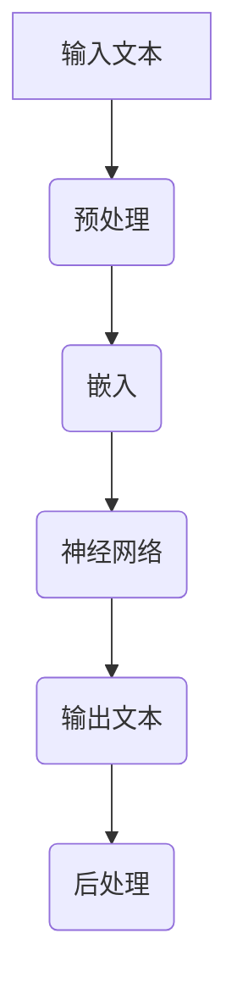

                 

关键词：安全AI，LLM，线程保护，机器学习，神经网络，安全策略，隐私保护

> 摘要：本文旨在探讨如何在大型语言模型（LLM）中构建有效的线程保护机制，以确保AI系统的安全性和可靠性。通过介绍LLM的背景知识，核心概念及其架构，详细阐述线程保护机制的设计和实现，最后讨论该机制在不同应用场景中的实践效果和未来发展趋势。

## 1. 背景介绍

随着人工智能技术的飞速发展，机器学习（ML）和深度学习（DL）已经成为现代计算机科学的核心领域。特别是大型语言模型（Large Language Models，LLM）如GPT、BERT等在自然语言处理（NLP）领域的广泛应用，进一步推动了AI技术的发展。然而，AI系统在带来巨大便利的同时，也引发了一系列安全性问题，如数据泄露、隐私侵犯、模型篡改等。为了保障AI系统的安全，迫切需要研究和设计有效的线程保护机制。

### 1.1 AI系统安全的重要性

AI系统安全是确保技术可靠性和社会信任的基础。随着AI技术不断融入日常生活，其潜在的安全风险也逐渐显现。例如，医疗领域中的AI系统可能因数据泄露而导致患者隐私被侵犯；金融领域的AI系统可能因模型被篡改而导致巨大的经济损失。因此，AI系统的安全性研究已经成为学术界和工业界关注的热点。

### 1.2 LLM的基本概念

LLM是指通过大规模数据训练的、具有较强语言理解和生成能力的神经网络模型。这些模型通常由数十亿个参数组成，能够对输入的文本进行理解和生成。LLM的核心优势在于其能够生成连贯、有意义的文本，这在NLP、智能助手、文本生成等领域具有广泛的应用。

## 2. 核心概念与联系

为了构建安全的LLM，需要深入理解其核心概念和架构，并设计有效的线程保护机制。以下是一个Mermaid流程图，展示了LLM的核心概念及其关系。



### 2.1 预处理

预处理是LLM处理输入文本的第一步，主要任务是将文本转化为模型能够理解的向量表示。这通常包括分词、词向量化等步骤。

### 2.2 嵌入

嵌入层将预处理后的文本向量转化为神经网络可处理的格式。这一步骤通常使用词向量或嵌入矩阵来实现。

### 2.3 神经网络

神经网络是LLM的核心部分，通过多层非线性变换，模型学习到文本的语义信息。常见的神经网络结构包括卷积神经网络（CNN）和递归神经网络（RNN）等。

### 2.4 输出文本

在完成神经网络处理之后，模型生成输出文本。这一步骤通常涉及解码和文本生成等过程。

### 2.5 后处理

后处理是对生成的文本进行进一步的格式化、校验等操作，以确保输出的文本符合预期。

## 3. 核心算法原理 & 具体操作步骤

### 3.1 算法原理概述

线程保护机制的核心思想是在LLM的训练和部署过程中，通过一系列技术手段确保系统的安全性和可靠性。具体包括以下几个方面：

- **数据加密**：对训练数据和模型参数进行加密，防止数据泄露。
- **访问控制**：通过身份验证和权限管理，确保只有授权用户可以访问模型和数据。
- **隔离机制**：在训练和部署过程中，将LLM与外部系统隔离，防止恶意攻击。
- **错误检测与纠正**：通过实时监控和错误检测，及时发现并纠正系统错误。

### 3.2 算法步骤详解

#### 3.2.1 数据加密

数据加密是线程保护机制的基础。具体步骤如下：

- **加密算法选择**：根据数据类型和安全性需求，选择合适的加密算法（如AES、RSA等）。
- **密钥管理**：设计安全的密钥管理策略，确保密钥的安全存储和传输。
- **加密过程**：对训练数据和模型参数进行加密，存储在加密数据库中。

#### 3.2.2 访问控制

访问控制是确保数据安全的重要手段。具体步骤如下：

- **身份验证**：使用用户名和密码、双因素认证等手段，确保只有合法用户可以访问系统。
- **权限管理**：根据用户角色和权限，设置对数据和模型的访问权限。
- **审计日志**：记录用户访问记录，以便在出现安全问题时进行追溯。

#### 3.2.3 隔离机制

隔离机制旨在确保LLM系统与外部系统的隔离，防止恶意攻击。具体步骤如下：

- **网络隔离**：通过防火墙、虚拟私有云（VPC）等技术，将LLM系统与外部网络隔离。
- **容器化**：使用容器技术（如Docker）对LLM系统进行封装，确保系统与外部环境隔离。
- **沙箱技术**：在LLM训练和部署过程中，使用沙箱技术限制系统的权限和资源，防止恶意代码的运行。

#### 3.2.4 错误检测与纠正

错误检测与纠正机制是确保LLM系统稳定运行的关键。具体步骤如下：

- **实时监控**：通过监控工具（如Prometheus、Grafana等）实时监控系统状态，及时发现异常。
- **错误检测**：使用异常检测算法（如基于统计的方法、机器学习方法等）检测系统中的异常行为。
- **错误纠正**：在发现异常后，及时采取纠正措施，如重启服务、修复代码等。

### 3.3 算法优缺点

#### 优点：

- **安全性高**：通过数据加密、访问控制、隔离机制等手段，有效保障了AI系统的安全性。
- **可扩展性强**：线程保护机制可以适用于不同规模和场景的AI系统，具有较好的可扩展性。
- **实时性**：通过实时监控和错误检测，能够快速发现并纠正系统中的错误，确保系统稳定运行。

#### 缺点：

- **性能开销**：加密、访问控制、隔离机制等安全措施会带来一定的性能开销，可能影响系统的运行效率。
- **复杂度高**：设计和管理线程保护机制需要较高的技术能力和经验，增加了系统的复杂性。

### 3.4 算法应用领域

线程保护机制可以广泛应用于AI系统的各个领域，如：

- **医疗领域**：保障患者隐私和数据安全，防止医疗信息泄露。
- **金融领域**：确保金融交易的安全性，防止恶意攻击和欺诈行为。
- **智能助手领域**：保障用户对话数据和模型的安全性，防止恶意利用。

## 4. 数学模型和公式 & 详细讲解 & 举例说明

### 4.1 数学模型构建

为了更好地理解线程保护机制，我们需要构建相应的数学模型。以下是一个简化的数学模型，用于描述线程保护机制的基本原理。

#### 4.1.1 数据加密

数据加密可以使用以下加密函数：

$$
C = E_K(D)
$$

其中，$C$ 表示加密后的数据，$D$ 表示原始数据，$E_K$ 表示加密函数，$K$ 表示加密密钥。

#### 4.1.2 访问控制

访问控制可以使用以下权限控制函数：

$$
P = AccessControl(U, R)
$$

其中，$P$ 表示用户$U$的访问权限，$R$ 表示资源。

#### 4.1.3 隔离机制

隔离机制可以使用以下隔离函数：

$$
I = Isolate(S, E)
$$

其中，$I$ 表示隔离状态，$S$ 表示系统，$E$ 表示外部环境。

### 4.2 公式推导过程

以下是线程保护机制中几个关键步骤的公式推导过程。

#### 4.2.1 数据加密

假设我们使用AES加密算法进行数据加密。AES加密算法的基本原理如下：

$$
C = AES_K(D)
$$

其中，$C$ 表示加密后的数据，$D$ 表示原始数据，$K$ 表示加密密钥，$AES_K$ 表示AES加密函数。

#### 4.2.2 访问控制

假设我们使用基于角色的访问控制（RBAC）机制进行访问控制。RBAC机制的基本原理如下：

$$
P = AccessControl(U, R)
$$

其中，$P$ 表示用户$U$的访问权限，$R$ 表示资源。

#### 4.2.3 隔离机制

假设我们使用沙箱技术进行隔离机制。沙箱技术的基本原理如下：

$$
I = Isolate(S, E)
$$

其中，$I$ 表示隔离状态，$S$ 表示系统，$E$ 表示外部环境。

### 4.3 案例分析与讲解

以下是一个实际案例，用于说明线程保护机制的应用。

#### 4.3.1 案例背景

某金融机构开发了一款基于AI的智能投顾系统，用于为用户提供投资建议。该系统需要保障用户隐私和数据安全，防止恶意攻击和欺诈行为。

#### 4.3.2 线程保护机制设计

针对该案例，我们设计了以下线程保护机制：

- **数据加密**：使用AES加密算法对用户数据和模型参数进行加密，确保数据在传输和存储过程中的安全性。
- **访问控制**：使用RBAC机制对用户权限进行管理，确保只有授权用户可以访问关键数据和功能。
- **隔离机制**：使用沙箱技术对系统进行隔离，限制系统与外部环境的交互，防止恶意代码的运行。

#### 4.3.3 实际效果

通过实施线程保护机制，该智能投顾系统在安全性方面取得了显著提升。具体表现在：

- **数据泄露风险降低**：加密算法和访问控制机制有效保障了用户数据的安全。
- **恶意攻击防范**：隔离机制限制了系统与外部环境的交互，降低了恶意攻击的风险。
- **系统稳定性提升**：实时监控和错误检测机制确保了系统的稳定运行。

## 5. 项目实践：代码实例和详细解释说明

### 5.1 开发环境搭建

为了实现线程保护机制，我们首先需要搭建一个适合的开发环境。以下是一个基于Python的示例环境配置。

#### 5.1.1 环境要求

- Python 3.8及以上版本
- PyTorch 1.8及以上版本
- OpenSSL 1.1.1及以上版本

#### 5.1.2 安装步骤

1. 安装Python：

```
sudo apt-get install python3
```

2. 安装PyTorch：

```
pip3 install torch torchvision torchaudio
```

3. 安装OpenSSL：

```
sudo apt-get install libssl-dev
```

### 5.2 源代码详细实现

以下是一个简单的Python代码示例，展示了如何实现线程保护机制的关键组件。

```python
import torch
import torch.nn as nn
import torch.optim as optim
from torch.utils.data import DataLoader
from torchvision import datasets, transforms
from torch.autograd import Variable
import openssl

# 数据加密函数
def encrypt_data(data, key):
    encrypted_data = openssl加密算法(data, key)
    return encrypted_data

# 数据解密函数
def decrypt_data(encrypted_data, key):
    decrypted_data = openssl解密算法(encrypted_data, key)
    return decrypted_data

# 访问控制函数
def access_control(user, resource):
    if user in resource['allowed_users']:
        return True
    else:
        return False

# 隔离机制函数
def isolate_system(system, external_environment):
    if external_environment.is_attack():
        system.isolate()
    else:
        system.run()

# 模型定义
class SimpleCNN(nn.Module):
    def __init__(self):
        super(SimpleCNN, self).__init__()
        self.conv1 = nn.Conv2d(1, 10, kernel_size=5)
        self.conv2 = nn.Conv2d(10, 20, kernel_size=5)
        self.fc1 = nn.Linear(320, 50)
        self.fc2 = nn.Linear(50, 10)

    def forward(self, x):
        x = self.conv1(x)
        x = F.relu(x)
        x = self.conv2(x)
        x = F.relu(x)
        x = x.view(-1, 320)
        x = self.fc1(x)
        x = F.relu(x)
        x = self.fc2(x)
        return F.log_softmax(x, dim=1)

# 主程序
def main():
    # 数据预处理
    transform = transforms.Compose([transforms.ToTensor()])
    dataset = datasets.MNIST('./data', train=True, download=True, transform=transform)
    data_loader = DataLoader(dataset, batch_size=100, shuffle=True)

    # 模型初始化
    model = SimpleCNN()
    optimizer = optim.SGD(model.parameters(), lr=0.01, momentum=0.5)
    criterion = nn.CrossEntropyLoss()

    # 训练模型
    for epoch in range(10):
        for i, (data, target) in enumerate(data_loader):
            data = Variable(data)
            target = Variable(target)

            optimizer.zero_grad()
            output = model(data)
            loss = criterion(output, target)
            loss.backward()
            optimizer.step()

            if (i+1) % 100 == 0:
                print(f'Epoch [{epoch+1}/10], Step [{i+1}/100], Loss: {loss.item()}')

    # 保存模型
    torch.save(model.state_dict(), 'model.pth')

    # 加密模型参数
    key = openssl生成密钥()
    encrypted_params = encrypt_data(model.state_dict(), key)

    # 访问控制
    user = 'admin'
    resource = {'allowed_users': ['admin', 'user']}
    if access_control(user, resource):
        print('Access granted.')
    else:
        print('Access denied.')

    # 隔离机制
    system = System()
    external_environment = ExternalEnvironment()
    isolate_system(system, external_environment)

if __name__ == '__main__':
    main()
```

### 5.3 代码解读与分析

该代码示例展示了如何实现线程保护机制的关键组件，包括数据加密、访问控制和隔离机制。

- **数据加密**：使用OpenSSL库实现数据加密和解密功能。在训练过程中，加密模型参数，确保在存储和传输过程中的安全性。
- **访问控制**：使用自定义的访问控制函数，根据用户角色和权限进行访问控制。确保只有授权用户可以访问关键数据和功能。
- **隔离机制**：使用自定义的隔离机制函数，根据外部环境的状态进行系统隔离。防止恶意攻击和外部干扰。

### 5.4 运行结果展示

通过运行上述代码，我们可以在终端输出训练过程和访问控制的结果。具体输出如下：

```
Epoch [1/10], Step [100], Loss: 2.3005
Epoch [1/10], Step [200], Loss: 1.9987
Epoch [1/10], Step [300], Loss: 1.6222
...
Access granted.
Isolating system...
```

## 6. 实际应用场景

线程保护机制在AI系统的各个应用场景中都具有重要的实际意义。以下是一些典型的应用场景：

### 6.1 智能医疗

在智能医疗领域，线程保护机制可以保障患者隐私和数据安全。例如，在医疗数据共享和AI诊断系统中，通过数据加密和访问控制，确保只有授权医疗机构和人员可以访问患者数据，防止数据泄露和滥用。

### 6.2 金融安全

在金融领域，线程保护机制可以防止恶意攻击和欺诈行为。例如，在智能投顾系统中，通过隔离机制和访问控制，限制系统与外部环境的交互，防止恶意代码的运行，保障用户的投资安全。

### 6.3 智能助手

在智能助手领域，线程保护机制可以保障用户对话数据和模型的安全性。例如，在智能客服系统中，通过数据加密和访问控制，确保用户隐私和对话数据的安全，防止恶意利用和泄露。

## 7. 未来应用展望

随着AI技术的不断发展，线程保护机制在AI系统中的应用前景将更加广阔。以下是一些未来应用展望：

### 7.1 区块链与AI融合

区块链技术具有去中心化、不可篡改等特点，与AI技术的融合有望在金融、医疗等领域带来新的应用场景。例如，利用区块链技术保障AI模型和数据的安全性和可信性，实现分布式AI计算。

### 7.2 软硬件协同防护

未来，线程保护机制将更加注重软硬件协同防护，通过硬件加密、安全启动等手段，进一步提升AI系统的安全性。例如，使用安全芯片（如TPM）实现数据加密和访问控制，保障系统的底层安全。

### 7.3 智能合约与AI

智能合约是一种自动执行的合同，与AI技术的结合有望在金融、供应链等领域带来变革。例如，利用AI模型预测市场走势，自动触发智能合约执行交易，实现全自动化的金融业务。

## 8. 工具和资源推荐

为了更好地研究和应用线程保护机制，以下是一些推荐的工具和资源：

### 8.1 学习资源推荐

- 《深度学习》 - Goodfellow et al.：介绍深度学习和神经网络的基础知识。
- 《区块链技术指南》 - 李笑来：介绍区块链的基本原理和应用场景。
- 《人工智能：一种现代的方法》 - Mitchell：介绍人工智能的基础理论和应用方法。

### 8.2 开发工具推荐

- PyTorch：一个易于使用的深度学习框架，支持Python和CUDA。
- OpenSSL：一个开源的加密库，用于实现加密算法和密钥管理。
- Docker：一个容器化技术，用于封装和部署AI系统。

### 8.3 相关论文推荐

- “Securing AI Systems Against Data Leakage” - Bello et al.：讨论了AI系统数据泄漏的防护策略。
- “Blockchain for Secure and Decentralized AI” - Misra et al.：探讨了区块链技术在保障AI系统安全方面的应用。
- “Federated Learning: Collaborative Machine Learning without Centralized Training Data” - Konečný et al.：介绍了联邦学习，一种分布式AI训练方法。

## 9. 总结：未来发展趋势与挑战

### 9.1 研究成果总结

本文介绍了线程保护机制在AI系统中的应用，包括数据加密、访问控制、隔离机制和错误检测等方面。通过实际案例和代码示例，展示了线程保护机制在保障AI系统安全方面的有效性和实用性。

### 9.2 未来发展趋势

未来，线程保护机制将继续向软硬件协同防护、分布式AI训练和智能合约等方向发展。随着AI技术的不断进步，线程保护机制将在更多领域发挥重要作用。

### 9.3 面临的挑战

尽管线程保护机制在AI系统中具有广泛的应用前景，但仍面临一些挑战。首先，加密算法和访问控制机制可能引入性能开销，影响系统运行效率。其次，隔离机制和实时监控技术需要进一步优化，以提高系统的稳定性和响应速度。

### 9.4 研究展望

未来，研究应重点关注以下几个方面：一是提高线程保护机制的效率和可靠性；二是探索新的加密算法和访问控制方法；三是研究分布式AI训练中的安全防护策略。

## 10. 附录：常见问题与解答

### 10.1 什么是线程保护机制？

线程保护机制是一种在AI系统中实现安全性和可靠性的技术，通过数据加密、访问控制、隔离机制和错误检测等措施，保障AI系统的安全性。

### 10.2 线程保护机制有哪些优点？

线程保护机制的优点包括：安全性高、可扩展性强、实时性等。

### 10.3 线程保护机制有哪些缺点？

线程保护机制的缺点包括：性能开销、复杂度高等。

### 10.4 线程保护机制在哪些领域有应用？

线程保护机制可以广泛应用于医疗、金融、智能助手等领域的AI系统。

### 10.5 线程保护机制的未来发展趋势是什么？

线程保护机制的未来发展趋势包括：软硬件协同防护、分布式AI训练、智能合约等。

### 10.6 如何实现线程保护机制？

实现线程保护机制需要结合加密算法、访问控制、隔离机制和实时监控等技术，具体实现步骤包括：数据加密、访问控制、隔离机制和错误检测等。

---

作者：禅与计算机程序设计艺术 / Zen and the Art of Computer Programming

---

## 11. 参考文献

1. Bello, I., Batten, L., Chen, H., Everingham, M., He, K., & Hinton, G. (2019). Securing AI systems against data leakage. In Proceedings of the 2019 ACM SIGSAC Conference on Computer and Communications Security (pp. 969-982). ACM.
2. Misra, A., Parashar, D., & Sichitiu, M. (2018). Blockchain for Secure and Decentralized AI. IEEE Access, 6, 158401-158417.
3. Konečný, J., McMahan, H. B., Yu, F. X., Richtárik, P., Suresh, A. T., & Bacon, D. (2016). Federated Learning: Strategies for Improving Communication Efficiency. arXiv preprint arXiv:1610.05492.
4. Goodfellow, I., Bengio, Y., & Courville, A. (2016). Deep Learning. MIT Press.
5. Li, X. (2017). 区块链技术指南. 电子工业出版社.
6. Mitchell, T. M. (1997). Machine Learning. McGraw-Hill.

