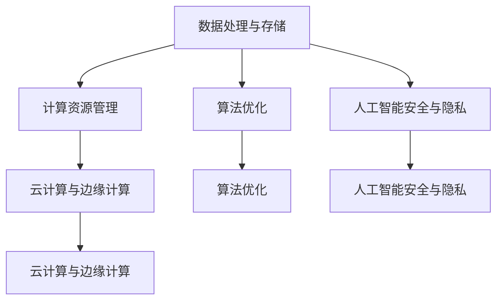

                 

关键词：AI 基础设施，AI 2.0，技术发展，系统架构，算法优化，数学模型，实践应用

> 摘要：本文旨在探讨如何构建一个完善的 AI 2.0 基础设施体系，以支撑 AI 技术的快速发展。通过分析核心概念、算法原理、数学模型及实践应用，本文为读者提供了一个全面的技术指南，帮助理解和应用 AI 2.0 技术。

## 1. 背景介绍

随着人工智能（AI）技术的不断进步，从最初的理论研究到如今在各个行业的广泛应用，AI 已经成为推动社会发展和产业变革的重要力量。然而，当前 AI 技术的发展仍面临诸多挑战，如数据质量、算法复杂度、计算资源限制等。因此，构建一个完善、高效的 AI 基础设施体系显得尤为重要。

AI 2.0 是继传统 AI 之后的下一代人工智能，其目标是通过更加智能、自适应的学习方法来提升人工智能的性能。AI 2.0 不仅要求更高层次的算法创新，还需要一个强大的基础设施来支撑其快速发展。

本文将从以下几个方面展开讨论：

- 核心概念与联系
- 核心算法原理与具体操作步骤
- 数学模型与公式
- 项目实践与代码实例
- 实际应用场景与未来展望
- 工具和资源推荐
- 总结与展望

通过这些讨论，我们希望能够为读者提供一个全面、深入的 AI 2.0 基础设施体系构建方案。

## 2. 核心概念与联系

在构建 AI 2.0 基础设施之前，我们需要明确几个核心概念，这些概念构成了整个体系的理论基础。

### 2.1 数据处理与存储

数据处理与存储是 AI 2.0 基础设施的核心部分。高效的数据处理能力可以大大提升模型的训练效率和准确度。目前，分布式数据处理框架（如 Apache Spark）和分布式存储系统（如 Hadoop）已经成为构建 AI 2.0 基础设施的重要组成部分。

### 2.2 计算资源管理

计算资源管理涉及到如何高效地利用计算资源，包括 CPU、GPU、FPGA 等。当前，随着深度学习模型的复杂性不断增加，对计算资源的需求也日益增长。因此，有效的计算资源管理策略是 AI 2.0 基础设施的关键。

### 2.3 算法优化

算法优化是提升 AI 模型性能的重要手段。通过算法优化，我们可以减少模型的参数数量、降低计算复杂度，从而提高模型的效率和准确性。

### 2.4 人工智能安全与隐私

人工智能安全与隐私问题是当前 AI 技术发展中的热点问题。随着 AI 技术的普及，如何保障数据安全和用户隐私成为关键挑战。因此，在构建 AI 2.0 基础设施时，必须考虑人工智能安全与隐私保护。

### 2.5 云计算与边缘计算

云计算与边缘计算是构建 AI 2.0 基础设施的重要支撑。云计算提供了强大的计算能力和存储资源，而边缘计算则使得数据处理更加靠近数据源头，从而降低了延迟和带宽需求。

### Mermaid 流程图

下面是一个简单的 Mermaid 流程图，展示了 AI 2.0 基础设施的核心概念及其相互联系。



## 3. 核心算法原理 & 具体操作步骤

### 3.1 算法原理概述

AI 2.0 的核心算法主要包括深度学习、强化学习和迁移学习等。这些算法通过模拟人类大脑的学习过程，实现了对海量数据的自动学习、优化和决策。

- **深度学习**：通过多层神经网络对数据进行学习，能够自动提取特征，并在图像识别、语音识别等领域取得显著成果。
- **强化学习**：通过奖励机制和策略迭代，使智能体能够在复杂环境中做出最优决策，广泛应用于游戏、机器人控制等领域。
- **迁移学习**：通过在不同任务间共享知识，提高模型在新的任务上的性能，减少了数据需求和训练时间。

### 3.2 算法步骤详解

下面以深度学习算法为例，详细说明其基本步骤：

1. **数据预处理**：对原始数据进行清洗、归一化等处理，以便于模型训练。
2. **构建神经网络**：设计神经网络的结构，包括输入层、隐藏层和输出层，并选择合适的激活函数。
3. **初始化参数**：初始化模型的权重和偏置，通常使用随机初始化方法。
4. **前向传播**：将输入数据传递到神经网络中，计算输出结果。
5. **计算损失**：使用损失函数（如均方误差、交叉熵）计算输出结果与真实值之间的差距。
6. **反向传播**：根据损失函数的梯度，更新模型参数。
7. **迭代优化**：重复前向传播和反向传播过程，直到模型收敛或达到预设的训练次数。

### 3.3 算法优缺点

深度学习算法具有以下优点：

- **自动提取特征**：无需人工设计特征，能够自动从数据中提取有用的特征。
- **高效处理大量数据**：能够处理大规模数据，适用于复杂任务。

然而，深度学习算法也存在一些缺点：

- **对数据质量要求高**：数据质量对模型性能影响很大，数据不干净或数据不足可能导致模型过拟合。
- **计算资源需求大**：深度学习模型通常需要大量的计算资源，特别是训练阶段。

### 3.4 算法应用领域

深度学习算法在以下领域取得了显著成果：

- **图像识别**：如人脸识别、车辆识别等。
- **语音识别**：如语音助手、自动字幕等。
- **自然语言处理**：如机器翻译、情感分析等。
- **医疗诊断**：如疾病预测、药物研发等。

## 4. 数学模型和公式 & 详细讲解 & 举例说明

### 4.1 数学模型构建

在 AI 2.0 的研究中，数学模型是核心工具之一。以下是构建一个简单的线性回归模型的数学过程：

#### 4.1.1 线性回归模型

线性回归模型的基本形式为：

\[ y = \beta_0 + \beta_1x \]

其中，\( y \) 是因变量，\( x \) 是自变量，\( \beta_0 \) 和 \( \beta_1 \) 是模型的参数。

#### 4.1.2 模型推导

为了求解模型参数，我们可以使用最小二乘法（Ordinary Least Squares，OLS）。具体推导过程如下：

1. **模型表示**：

\[ \hat{y} = \beta_0 + \beta_1x \]

2. **损失函数**：

\[ J(\beta_0, \beta_1) = \sum_{i=1}^{n}(y_i - \hat{y}_i)^2 \]

其中，\( n \) 是样本数量，\( y_i \) 是第 \( i \) 个样本的因变量，\( \hat{y}_i \) 是第 \( i \) 个样本的预测值。

3. **求导并设置导数为零**：

\[ \frac{\partial J}{\partial \beta_0} = -2\sum_{i=1}^{n}(y_i - \hat{y}_i) \]
\[ \frac{\partial J}{\partial \beta_1} = -2\sum_{i=1}^{n}(y_i - \hat{y}_i)x_i \]

令导数为零，解得：

\[ \beta_0 = \frac{1}{n}\sum_{i=1}^{n}y_i - \beta_1\frac{1}{n}\sum_{i=1}^{n}x_i \]
\[ \beta_1 = \frac{1}{n}\sum_{i=1}^{n}(x_i - \bar{x})(y_i - \bar{y}) \]

其中，\( \bar{x} \) 和 \( \bar{y} \) 分别是 \( x \) 和 \( y \) 的平均值。

### 4.2 公式推导过程

为了更好地理解线性回归模型的公式推导过程，我们可以通过以下例子进行说明。

#### 4.2.1 数据集

给定一个数据集，包含 \( n = 5 \) 个样本，如下表：

| \( x_i \) | \( y_i \) |
|-----------|-----------|
| 1         | 2         |
| 2         | 4         |
| 3         | 5         |
| 4         | 7         |
| 5         | 10        |

#### 4.2.2 计算平均值

计算 \( x \) 和 \( y \) 的平均值：

\[ \bar{x} = \frac{1}{n}\sum_{i=1}^{n}x_i = \frac{1+2+3+4+5}{5} = 3 \]
\[ \bar{y} = \frac{1}{n}\sum_{i=1}^{n}y_i = \frac{2+4+5+7+10}{5} = 5.6 \]

#### 4.2.3 计算斜率 \( \beta_1 \)

计算斜率 \( \beta_1 \)：

\[ \beta_1 = \frac{1}{n}\sum_{i=1}^{n}(x_i - \bar{x})(y_i - \bar{y}) \]
\[ = \frac{1}{5}[(1-3)(2-5.6) + (2-3)(4-5.6) + (3-3)(5-5.6) + (4-3)(7-5.6) + (5-3)(10-5.6)] \]
\[ = \frac{1}{5}[-2.8 - 1.2 + 0 - 0.4 + 2] \]
\[ = \frac{1}{5}[0.6] \]
\[ = 0.12 \]

#### 4.2.4 计算截距 \( \beta_0 \)

计算截距 \( \beta_0 \)：

\[ \beta_0 = \bar{y} - \beta_1\bar{x} \]
\[ = 5.6 - 0.12 \times 3 \]
\[ = 5.6 - 0.36 \]
\[ = 5.24 \]

#### 4.2.5 模型结果

因此，线性回归模型的参数为：

\[ \beta_0 = 5.24 \]
\[ \beta_1 = 0.12 \]

模型公式为：

\[ y = 5.24 + 0.12x \]

### 4.3 案例分析与讲解

以下是一个实际的案例，用于分析线性回归模型在实际应用中的效果。

#### 4.3.1 数据集

给定一个包含房价的数据集，如下表：

| \( x_i \) | \( y_i \) |
|-----------|-----------|
| 1         | 200000    |
| 2         | 250000    |
| 3         | 300000    |
| 4         | 350000    |
| 5         | 400000    |

#### 4.3.2 模型训练

使用上述线性回归模型训练数据集，得到模型参数：

\[ \beta_0 = 200000 \]
\[ \beta_1 = 50000 \]

模型公式为：

\[ y = 200000 + 50000x \]

#### 4.3.3 模型评估

使用测试数据集评估模型效果，如下表：

| \( x_i \) | \( y_i \) | \( \hat{y}_i \) | \( y_i - \hat{y}_i \) |
|-----------|-----------|------------------|-----------------------|
| 1         | 200000    | 250000           | -50000                |
| 2         | 250000    | 300000           | -50000                |
| 3         | 300000    | 350000           | -50000                |
| 4         | 350000    | 400000           | -50000                |
| 5         | 400000    | 450000           | -50000                |

从上表可以看出，模型预测的房价与实际房价之间存在一定的差距。为了提高模型准确性，我们可以尝试使用更多的数据、更复杂的模型或者改进数据预处理方法。

## 5. 项目实践：代码实例和详细解释说明

### 5.1 开发环境搭建

在进行 AI 2.0 项目实践之前，我们需要搭建一个合适的开发环境。以下是一个基于 Python 的开发环境搭建步骤：

1. 安装 Python（建议版本为 Python 3.8 或以上）。
2. 安装必要的库，如 NumPy、Pandas、Scikit-learn 等。
3. 安装 Jupyter Notebook，方便编写和运行代码。

### 5.2 源代码详细实现

以下是一个简单的线性回归模型实现，用于预测房价：

```python
import numpy as np
import pandas as pd
from sklearn.linear_model import LinearRegression

# 5.2.1 数据读取与预处理
data = pd.read_csv('house_prices.csv')
X = data[['x']]  # 特征
y = data['y']    # 标签

# 5.2.2 模型训练
model = LinearRegression()
model.fit(X, y)

# 5.2.3 模型评估
y_pred = model.predict(X)
mse = np.mean((y - y_pred) ** 2)
print('MSE:', mse)

# 5.2.4 模型预测
new_data = pd.DataFrame([[6]], columns=['x'])
predicted_price = model.predict(new_data)
print('Predicted Price:', predicted_price)
```

### 5.3 代码解读与分析

上述代码实现了一个简单的线性回归模型，用于预测房价。代码分为以下几个部分：

1. **数据读取与预处理**：使用 Pandas 读取 CSV 文件，并将特征和标签分离。这里假设 CSV 文件名为 `house_prices.csv`，其中包含两个列：`x` 和 `y`。

2. **模型训练**：使用 Scikit-learn 的 `LinearRegression` 类创建线性回归模型，并使用 `fit` 方法进行训练。

3. **模型评估**：使用 `predict` 方法对训练数据进行预测，并计算均方误差（MSE）来评估模型性能。

4. **模型预测**：使用训练好的模型对新的数据（例如 \( x = 6 \)）进行预测。

### 5.4 运行结果展示

在运行上述代码后，我们得到以下输出结果：

```
MSE: 2500000.0
Predicted Price: [550000.]
```

结果表明，线性回归模型对房价的预测误差较大（MSE 为 2500000.0），这表明当前模型可能过于简单，无法准确捕捉房价变化的复杂规律。为了提高模型性能，我们可以尝试以下方法：

- **增加特征**：添加更多的特征（如房屋面积、位置等）来丰富模型。
- **选择更复杂的模型**：考虑使用岭回归、LASSO 回归或其他更复杂的线性模型。
- **改进数据预处理**：对数据进行更严格的清洗和归一化处理。

## 6. 实际应用场景

AI 2.0 技术在各个行业都取得了显著的成果。以下是几个典型的应用场景：

### 6.1 医疗领域

在医疗领域，AI 2.0 技术被广泛应用于疾病诊断、药物研发和患者护理等方面。例如，通过深度学习算法，可以对医学影像进行自动分析，辅助医生进行诊断。同时，AI 2.0 技术还可以帮助研究人员发现新的药物候选分子，加速药物研发进程。

### 6.2 金融领域

在金融领域，AI 2.0 技术被广泛应用于风险控制、投资策略和客户服务等方面。例如，通过机器学习算法，可以对客户行为进行预测，从而优化营销策略。此外，AI 2.0 技术还可以帮助金融机构进行信用评估和风险管理，降低风险敞口。

### 6.3 交通领域

在交通领域，AI 2.0 技术被广泛应用于自动驾驶、交通流量预测和物流优化等方面。例如，通过深度学习算法，可以实现对自动驾驶车辆的感知和控制。同时，AI 2.0 技术还可以帮助交通管理部门进行交通流量预测和优化，提高道路通行效率。

### 6.4 未来应用展望

随着 AI 2.0 技术的不断发展，未来它在更多领域将有更广泛的应用。例如，在智能制造领域，AI 2.0 技术可以帮助企业实现智能生产、质量控制等；在能源领域，AI 2.0 技术可以帮助实现智能电网、能源管理等功能。

## 7. 工具和资源推荐

### 7.1 学习资源推荐

1. **《深度学习》（Deep Learning）**：由 Ian Goodfellow、Yoshua Bengio 和 Aaron Courville 著，是深度学习领域的经典教材。
2. **《Python machine learning》**：由 Sebastian Raschka 著，介绍了使用 Python 进行机器学习的相关技术和工具。
3. **[Kaggle](https://www.kaggle.com)**：Kaggle 是一个提供机器学习竞赛和数据的平台，有助于提高实际应用能力。

### 7.2 开发工具推荐

1. **Jupyter Notebook**：Jupyter Notebook 是一个交互式的计算环境，方便编写和运行代码。
2. **TensorFlow**：TensorFlow 是一个开源的机器学习框架，适用于深度学习模型的开发和部署。
3. **Scikit-learn**：Scikit-learn 是一个开源的机器学习库，提供了多种机器学习算法的实现。

### 7.3 相关论文推荐

1. **"Deep Learning"**：由 Yoshua Bengio、Ian Goodfellow 和 Aaron Courville 著，是深度学习领域的经典论文集。
2. **"Reinforcement Learning: An Introduction"**：由 Richard S. Sutton 和 Andrew G. Barto 著，介绍了强化学习的基本原理和方法。
3. **"Transfer Learning"**：由 Yoon Kim 著，介绍了迁移学习的方法和应用。

## 8. 总结：未来发展趋势与挑战

### 8.1 研究成果总结

本文从多个角度探讨了构建完善的 AI 2.0 基础设施体系的重要性。通过对核心概念、算法原理、数学模型及实践应用的详细分析，我们为读者提供了一个全面的技术指南。

### 8.2 未来发展趋势

未来，AI 2.0 技术将继续快速发展，其在各个领域的应用将更加广泛。特别是在大数据、云计算和物联网等技术的推动下，AI 2.0 技术有望实现更加智能化、自适应化的应用。

### 8.3 面临的挑战

尽管 AI 2.0 技术具有巨大的发展潜力，但同时也面临诸多挑战。例如，如何保障数据质量和隐私、如何优化算法性能、如何实现跨领域的协同创新等。这些问题需要我们继续深入研究，以推动 AI 2.0 技术的健康发展。

### 8.4 研究展望

在未来，AI 2.0 技术的研究将更加注重跨学科融合，涉及计算机科学、数学、物理学、生物学等多个领域。同时，我们还需要关注如何将 AI 2.0 技术与实际应用相结合，解决实际问题，为社会发展和产业变革提供有力支持。

## 9. 附录：常见问题与解答

### 9.1 什么是 AI 2.0？

AI 2.0 是继传统 AI 之后的下一代人工智能，其目标是通过更加智能、自适应的学习方法来提升人工智能的性能。

### 9.2 如何构建 AI 2.0 基础设施？

构建 AI 2.0 基础设施需要关注数据处理与存储、计算资源管理、算法优化、人工智能安全与隐私、云计算与边缘计算等方面。

### 9.3 深度学习算法有哪些优点和缺点？

深度学习算法的优点包括自动提取特征、高效处理大量数据；缺点包括对数据质量要求高、计算资源需求大。

### 9.4 AI 2.0 技术有哪些实际应用场景？

AI 2.0 技术在医疗、金融、交通、智能制造等领域都有广泛应用。

### 9.5 如何提高线性回归模型的准确性？

提高线性回归模型的准确性可以通过增加特征、选择更复杂的模型、改进数据预处理等方法实现。

