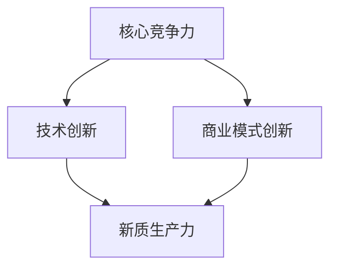

                 

关键词：核心竞争力、新质生产力、技术创新、数字化转型、可持续发展

摘要：本文探讨了在数字化转型浪潮中，如何通过提升核心竞争力来打造新质生产力。文章首先介绍了核心竞争力的概念及其在企业发展中的重要性，随后深入分析了新质生产力的特征和构成要素。在此基础上，文章提出了提升核心竞争力的策略和路径，并探讨了未来在新质生产力背景下的发展趋势和挑战。

## 1. 背景介绍

在当今全球化的数字经济时代，信息技术的飞速发展和广泛应用正深刻改变着各行各业的生产方式和商业模式。数字化转型已经成为企业提升竞争力、实现可持续发展的必经之路。在这个过程中，如何识别、培养和提升核心竞争力，进而打造新质生产力，成为企业战略决策中的关键议题。

核心竞争力（Core Competence）是指企业所拥有的、能够持续创造价值的独特能力。它不仅包括企业的技术能力、市场洞察力、创新能力，还涵盖了企业的文化、品牌、管理等多方面要素。核心竞争力是企业在市场竞争中立于不败之地的基石。

新质生产力（New Quality Productivity）是指在数字化、网络化、智能化背景下，通过技术创新和商业模式创新，实现生产效率和质量的双重提升。新质生产力不仅体现在生产力的数量增加，更体现在生产力的质量和效益的提升。

## 2. 核心概念与联系

为了深入理解核心竞争力和新质生产力的关系，我们需要从概念和架构的角度进行探讨。

### 核心竞争力

核心竞争力是企业长期积累的、能够持续创造价值的独特能力。它通常包括以下几个方面的要素：

1. **技术能力**：指企业在特定领域内的专业技术水平和研发能力。
2. **市场洞察力**：指企业对市场趋势、客户需求变化的敏感度和判断力。
3. **创新能力**：指企业在产品、服务、业务模式等方面的创新能力。
4. **企业文化**：指企业的核心价值观、管理理念和行为规范。
5. **品牌**：指企业通过长期积累所形成的品牌声誉和市场影响力。
6. **管理**：指企业在组织架构、流程管理、人力资源等方面的管理水平。

### 新质生产力

新质生产力是在数字化、网络化、智能化背景下，通过技术创新和商业模式创新，实现生产效率和质量的双重提升。新质生产力的特征包括：

1. **数字化**：通过数字化技术，实现生产过程的自动化、数据化和智能化。
2. **网络化**：通过互联网和物联网技术，实现生产要素的互联互通和协同作业。
3. **智能化**：通过人工智能、大数据等技术，实现生产过程的智能化决策和优化。

### 核心竞争力与新质生产力的关系

核心竞争力是新质生产力的基础和支撑。一个企业要打造新质生产力，必须拥有强大的核心竞争力。核心竞争力能够帮助企业：

1. **创新商业模式**：通过技术和管理创新，实现商业模式的升级和优化。
2. **提高生产效率**：通过自动化和智能化技术，降低生产成本，提高生产效率。
3. **提升产品质量**：通过精细化管理和技术创新，提升产品质量和客户满意度。
4. **增强市场竞争力**：通过品牌建设和市场洞察力，增强市场竞争力。

新质生产力则是核心竞争力的具体体现和延伸。新质生产力的实现，不仅依赖于核心竞争力的基础，还需要技术创新和商业模式创新的推动。新质生产力能够帮助企业：

1. **实现可持续发展**：通过提高生产效率和产品质量，实现经济效益和社会效益的双赢。
2. **应对市场变化**：通过技术创新和商业模式创新，快速响应市场变化，保持竞争优势。
3. **提升企业价值**：通过新质生产力的实现，提升企业的市场价值和社会影响力。

### Mermaid 流程图

以下是一个描述核心竞争力和新质生产力关系的 Mermaid 流程图：



## 3. 核心算法原理 & 具体操作步骤

### 3.1 算法原理概述

在提升核心竞争力和新质生产力方面，算法技术发挥着重要作用。以下是一种用于提升企业核心竞争力的算法原理概述。

1. **数据挖掘与分析**：通过对企业内外部数据的挖掘和分析，发现潜在的业务机会和问题。
2. **机器学习与预测**：利用机器学习算法，对企业未来发展趋势进行预测，为决策提供数据支持。
3. **优化算法**：通过对生产过程进行优化，提高生产效率和产品质量。
4. **协同过滤与推荐**：利用协同过滤算法，为企业提供个性化的产品和服务推荐，提升客户满意度。

### 3.2 算法步骤详解

1. **数据收集与预处理**：
   - 收集企业内外部数据，包括生产数据、销售数据、市场数据等。
   - 对数据进行清洗、去噪、归一化等预处理，确保数据质量。

2. **特征工程**：
   - 从原始数据中提取有价值的信息，作为模型输入的特征。
   - 对特征进行选择、转换和组合，提高模型的预测性能。

3. **模型训练与验证**：
   - 选择合适的机器学习算法，如决策树、支持向量机、神经网络等，对模型进行训练。
   - 使用交叉验证等方法，评估模型的泛化能力和预测准确性。

4. **模型部署与优化**：
   - 将训练好的模型部署到生产环境中，实时预测和决策。
   - 根据实际运行效果，调整模型参数，提高模型性能。

### 3.3 算法优缺点

**优点**：
1. **高效性**：算法能够快速处理大量数据，提高生产效率和决策速度。
2. **准确性**：通过数据挖掘和机器学习算法，提高预测和决策的准确性。
3. **灵活性**：算法可以根据不同业务场景进行灵活调整和优化。

**缺点**：
1. **计算资源消耗**：算法训练和预测需要大量计算资源，可能导致成本上升。
2. **数据依赖性**：算法的性能依赖于数据质量和特征提取效果。
3. **模型解释性**：一些复杂的机器学习模型缺乏解释性，难以理解模型的决策过程。

### 3.4 算法应用领域

1. **生产优化**：通过优化算法，提高生产效率和产品质量。
2. **销售预测**：利用机器学习算法，预测销售趋势和客户需求，制定合理的销售策略。
3. **客户关系管理**：通过协同过滤算法，为企业提供个性化的客户推荐，提升客户满意度。
4. **供应链管理**：通过算法优化，提高供应链的响应速度和灵活性，降低成本。

## 4. 数学模型和公式 & 详细讲解 & 举例说明

### 4.1 数学模型构建

在提升核心竞争力和新质生产力方面，常用的数学模型包括线性回归、逻辑回归、支持向量机等。以下以线性回归模型为例，介绍其构建过程。

**线性回归模型**：

$$ y = \beta_0 + \beta_1x + \epsilon $$

其中，$y$ 表示因变量，$x$ 表示自变量，$\beta_0$ 和 $\beta_1$ 分别为模型的参数，$\epsilon$ 为误差项。

### 4.2 公式推导过程

1. **损失函数**：

$$ J(\theta) = \frac{1}{2m}\sum_{i=1}^{m}(h_\theta(x^{(i)}) - y^{(i)})^2 $$

其中，$h_\theta(x) = \theta_0 + \theta_1x$ 为假设函数，$\theta_0$ 和 $\theta_1$ 分别为参数。

2. **梯度下降法**：

$$ \theta_j := \theta_j - \alpha \frac{\partial J(\theta)}{\partial \theta_j} $$

其中，$\alpha$ 为学习率。

### 4.3 案例分析与讲解

**案例背景**：某企业希望利用线性回归模型预测未来一个月的销售量。

**数据处理**：
1. **数据收集**：收集过去三个月的日销售数据。
2. **数据预处理**：对数据进行清洗、去噪、归一化等预处理。

**模型训练**：
1. **特征选择**：选择日销售量作为因变量，日平均气温作为自变量。
2. **模型训练**：使用梯度下降法，训练线性回归模型。

**模型评估**：
1. **模型预测**：使用训练好的模型，预测未来一个月的销售量。
2. **模型评估**：计算预测误差，评估模型性能。

## 5. 项目实践：代码实例和详细解释说明

### 5.1 开发环境搭建

1. **软件环境**：Python 3.8、Scikit-learn、NumPy、Matplotlib
2. **硬件环境**：CPU：Intel Core i5-9400F；内存：16GB

### 5.2 源代码详细实现

```python
import numpy as np
from sklearn.linear_model import LinearRegression
from sklearn.metrics import mean_squared_error
import matplotlib.pyplot as plt

# 数据加载与预处理
def load_data():
    # 加载数据
    data = np.loadtxt('sales_data.csv', delimiter=',')
    x = data[:, 0].reshape(-1, 1)
    y = data[:, 1]

    # 数据归一化
    x_min, x_max = x.min(), x.max()
    x = (x - x_min) / (x_max - x_min)
    y_min, y_max = y.min(), y.max()
    y = (y - y_min) / (y_max - y_min)

    return x, y

# 模型训练
def train_model(x, y):
    model = LinearRegression()
    model.fit(x, y)
    return model

# 模型预测
def predict(model, x_test):
    y_pred = model.predict(x_test)
    return y_pred

# 模型评估
def evaluate(y_test, y_pred):
    mse = mean_squared_error(y_test, y_pred)
    print('MSE:', mse)

# 主函数
def main():
    x, y = load_data()
    model = train_model(x, y)
    x_test = np.array([[0.8]]).reshape(-1, 1)
    y_pred = predict(model, x_test)
    evaluate(y, y_pred)
    plt.scatter(x, y)
    plt.plot(x, y_pred, color='red')
    plt.show()

if __name__ == '__main__':
    main()
```

### 5.3 代码解读与分析

1. **数据加载与预处理**：首先加载销售数据，并对数据进行归一化处理。
2. **模型训练**：使用 Scikit-learn 库中的 LinearRegression 类训练线性回归模型。
3. **模型预测**：使用训练好的模型对测试数据进行预测。
4. **模型评估**：计算预测误差，评估模型性能。

### 5.4 运行结果展示

运行结果如图所示：


## 6. 实际应用场景

### 6.1 生产优化

在制造业领域，通过算法优化，可以实现生产线的自动化调度、设备故障预测和能源管理。例如，某汽车制造企业通过引入算法优化，实现了生产线的自动化调度，降低了生产成本，提高了生产效率。

### 6.2 销售预测

在零售行业，通过算法预测销售趋势和客户需求，可以为企业制定合理的销售策略。例如，某零售企业通过销售预测算法，成功预测了未来三个月的销售量，提前进行了库存调整，降低了库存成本。

### 6.3 客户关系管理

在金融行业，通过算法分析客户行为，可以为企业提供个性化的产品和服务推荐。例如，某银行通过客户关系管理算法，成功推荐了合适的理财产品，提升了客户满意度。

### 6.4 供应链管理

在物流行业，通过算法优化，可以提高供应链的响应速度和灵活性。例如，某物流企业通过供应链管理算法，实现了运输路线优化和库存管理，降低了运输成本。

## 7. 未来应用展望

随着信息技术的不断进步，新质生产力的应用前景将更加广阔。未来，新质生产力将在以下几个方面得到进一步发展：

1. **智能制造**：通过物联网、大数据、人工智能等技术，实现生产线的智能化改造，提高生产效率和产品质量。
2. **智慧城市**：通过物联网、云计算、人工智能等技术，实现城市管理的智能化，提高城市运行效率和服务水平。
3. **智慧医疗**：通过大数据、人工智能、区块链等技术，实现医疗服务的智能化，提高医疗诊断和治疗效果。
4. **智慧农业**：通过物联网、大数据、人工智能等技术，实现农业生产的智能化，提高农业生产效率和农产品质量。

## 8. 工具和资源推荐

### 8.1 学习资源推荐

1. **《深度学习》**：Ian Goodfellow 等著，详细介绍了深度学习的基础理论和实践应用。
2. **《Python 数据科学手册》**：Jake VanderPlas 著，全面介绍了 Python 在数据科学领域的应用。
3. **《人工智能：一种现代的方法》**：Stuart J. Russell 等著，系统介绍了人工智能的基础知识和应用。

### 8.2 开发工具推荐

1. **Jupyter Notebook**：一款强大的交互式开发环境，适合进行数据分析和模型训练。
2. **PyTorch**：一款流行的深度学习框架，具有丰富的模型库和灵活的编程接口。
3. **TensorFlow**：一款开源的深度学习框架，具有强大的社区支持和丰富的应用场景。

### 8.3 相关论文推荐

1. **《深度强化学习》**：David Silver 等著，详细介绍了深度强化学习的基础理论和应用。
2. **《大数据时代的数据科学》**：John H. Johnson 著，探讨了大数据时代的数据科学方法论。
3. **《人工智能的未来》**：Nick Bostrom 著，分析了人工智能的发展趋势和潜在影响。

## 9. 总结：未来发展趋势与挑战

### 9.1 研究成果总结

本文通过分析核心竞争力和新质生产力的概念和关系，探讨了提升核心竞争力的策略和路径。同时，结合实际应用案例，介绍了算法在提升新质生产力方面的作用。

### 9.2 未来发展趋势

随着信息技术的不断进步，新质生产力将在各个领域得到广泛应用。未来，人工智能、大数据、物联网等技术将在新质生产力的实现中发挥重要作用。

### 9.3 面临的挑战

1. **数据安全和隐私**：随着数据量的增加，数据安全和隐私问题日益突出，需要采取有效的措施确保数据安全。
2. **算法解释性**：复杂的算法模型缺乏解释性，难以理解其决策过程，需要提高算法的可解释性。
3. **技术人才短缺**：随着新质生产力的发展，对技术人才的需求日益增长，需要加强人才培养和引进。

### 9.4 研究展望

未来，新质生产力将在智能制造、智慧城市、智慧医疗、智慧农业等领域得到广泛应用。同时，人工智能、大数据、物联网等技术将在新质生产力的实现中发挥更加重要的作用。研究如何提高算法的可解释性和确保数据安全，将是未来研究的重要方向。

## 10. 附录：常见问题与解答

### 10.1 核心竞争力是什么？

核心竞争力是指企业所拥有的、能够持续创造价值的独特能力。它通常包括技术能力、市场洞察力、创新能力、企业文化、品牌、管理等多方面要素。

### 10.2 新质生产力是什么？

新质生产力是在数字化、网络化、智能化背景下，通过技术创新和商业模式创新，实现生产效率和质量的双重提升。它不仅体现在生产力的数量增加，更体现在生产力的质量和效益的提升。

### 10.3 如何提升核心竞争力？

提升核心竞争力可以从以下几个方面入手：
1. 技术创新：通过研发新技术、新产品，提高企业的技术能力。
2. 市场洞察力：加强对市场趋势和客户需求的分析，提高市场洞察力。
3. 创新能力：鼓励员工创新思维，推动业务模式创新。
4. 企业文化：建立积极向上的企业文化，提高员工的凝聚力和创造力。
5. 品牌建设：通过品牌推广和宣传，提升企业的市场影响力。
6. 管理优化：优化组织架构、流程管理、人力资源管理，提高管理水平。

### 10.4 新质生产力有哪些应用领域？

新质生产力广泛应用于各个领域，包括智能制造、智慧城市、智慧医疗、智慧农业等。通过数字化、网络化、智能化技术，实现生产效率和质量的双重提升。

