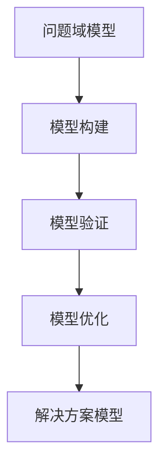

                 

关键词：模型思维、复杂系统、算法原理、数学模型、项目实践、应用场景、未来展望

> 摘要：本文旨在探讨模型思维这一高效工具，在理解复杂事物中的应用。通过分析模型思维的核心概念、算法原理、数学模型以及实际项目实践，本文将为读者提供一套系统性的学习方法，帮助快速掌握复杂领域知识。

## 1. 背景介绍

随着科技的发展，我们面对的问题越来越复杂，从简单的数学问题到复杂的系统工程，无一不在考验我们的认知能力和解决问题的能力。为了应对这些复杂问题，传统的单一思维方式显得力不从心。模型思维作为一种全新的思考方式，逐渐成为解决复杂问题的重要利器。

模型思维，顾名思义，就是通过构建模型来理解和解决复杂问题。这里的“模型”不仅包括数学模型、算法模型，还包括各种抽象概念模型。通过模型，我们可以将复杂的问题简化为可计算、可分析的简单结构，从而提高解决问题的效率。

本文将围绕模型思维这一主题，深入探讨其在复杂系统中的核心概念、算法原理、数学模型以及实际应用。希望通过本文的阅读，读者能够对模型思维有更深刻的理解，并能够在实际工作中运用这一思维方式，提高工作效率。

## 2. 核心概念与联系

### 2.1. 模型思维的核心概念

模型思维的核心在于“建模”和“解构”。建模是将复杂问题转化为简单结构的过程，解构则是将已有模型进行分析和理解的过程。以下是模型思维中几个关键概念：

1. **问题抽象**：将复杂问题抽象为简单的数学或逻辑问题。
2. **模型构建**：根据问题抽象，构建能够表示问题本质的数学或逻辑模型。
3. **模型验证**：通过实际数据或逻辑验证模型的有效性和准确性。
4. **模型优化**：根据验证结果，对模型进行调整和优化。

### 2.2. 模型思维的架构

模型思维的架构可以分为三个层次：问题域模型、模型域模型、解决方案模型。以下是各层模型的关系和功能：

1. **问题域模型**：表示问题的具体情境和条件，是模型思维的基础。
2. **模型域模型**：将问题域模型转化为数学或逻辑模型，是问题抽象的结果。
3. **解决方案模型**：基于模型域模型，提出具体的解决方案，实现问题的解决。

### 2.3. Mermaid 流程图

为了更直观地展示模型思维的架构，我们使用Mermaid语言绘制以下流程图：



在上面的流程图中，A表示问题域模型，B表示模型构建，C表示模型验证，D表示模型优化，E表示解决方案模型。各模型之间通过箭头表示其转换关系。

## 3. 核心算法原理 & 具体操作步骤

### 3.1. 算法原理概述

模型思维中的核心算法原理主要包括问题抽象、模型构建、模型验证和模型优化。以下是各算法原理的简要概述：

1. **问题抽象**：通过识别问题的核心要素，将复杂问题转化为简单数学或逻辑问题。
2. **模型构建**：基于问题抽象，使用数学或逻辑工具构建能够表示问题本质的模型。
3. **模型验证**：通过实际数据或逻辑验证模型的有效性和准确性。
4. **模型优化**：根据验证结果，对模型进行调整和优化，以提高模型的性能和适用性。

### 3.2. 算法步骤详解

以下是模型思维算法的具体操作步骤：

1. **步骤1：问题识别**：识别复杂问题的核心要素，明确问题的主要目标和约束条件。
2. **步骤2：问题抽象**：将问题抽象为简单的数学或逻辑问题，提取问题的核心数学关系或逻辑关系。
3. **步骤3：模型构建**：根据问题抽象，使用数学或逻辑工具构建表示问题本质的模型。
4. **步骤4：模型验证**：通过实际数据或逻辑验证模型的有效性和准确性。
5. **步骤5：模型优化**：根据验证结果，对模型进行调整和优化，以提高模型的性能和适用性。
6. **步骤6：解决方案实现**：基于优化后的模型，实现问题的解决方案，并进行效果评估。

### 3.3. 算法优缺点

模型思维算法具有以下优点：

1. **高效性**：通过模型抽象和优化，可以大幅提高解决问题的效率。
2. **灵活性**：模型思维可以根据问题的不同，灵活调整和优化模型结构，适用于各种复杂问题。
3. **普适性**：模型思维不仅适用于数学和逻辑问题，还可以应用于其他领域，如工程、管理、经济学等。

然而，模型思维也存在一定的局限性：

1. **简化性**：模型思维需要对复杂问题进行抽象和简化，这可能导致某些细节被忽略。
2. **计算复杂性**：在某些情况下，模型构建和优化可能涉及复杂的计算，需要高性能计算资源。
3. **领域依赖性**：模型思维需要针对特定领域的问题，构建相应的模型和方法，这可能需要领域专业知识。

### 3.4. 算法应用领域

模型思维算法广泛应用于以下领域：

1. **计算机科学**：用于算法设计和分析，如图算法、搜索算法、排序算法等。
2. **数学**：用于解决各种数学问题，如线性规划、非线性优化、微分方程等。
3. **工程**：用于工程设计和分析，如结构分析、控制系统设计、信号处理等。
4. **经济学**：用于经济模型构建和预测，如宏观经济模型、金融市场分析等。
5. **生物信息学**：用于基因分析和生物网络建模，如基因表达分析、蛋白质相互作用分析等。

## 4. 数学模型和公式 & 详细讲解 & 举例说明

### 4.1. 数学模型构建

数学模型是模型思维的核心组成部分，它将实际问题转化为可计算的数学形式。以下是构建数学模型的一般步骤：

1. **问题定义**：明确问题的目标和约束条件，将其转化为数学形式。
2. **变量定义**：定义问题中的变量，明确各变量的取值范围和约束关系。
3. **目标函数**：根据问题的目标，构建目标函数，用于衡量问题的优化目标。
4. **约束条件**：根据问题的约束条件，构建约束条件，用于限制变量的取值范围。
5. **模型求解**：使用数学方法求解模型，找到最优解或近似解。

### 4.2. 公式推导过程

以下是构建一个简单的线性规划问题模型及其求解公式的推导过程：

**问题定义**：设有一个工厂，生产两种产品A和B，每种产品都有生产成本和销售利润。我们需要确定生产数量，使得总利润最大化，同时不超过生产资源的限制。

**变量定义**：设 \(x\) 为产品A的生产数量，\(y\) 为产品B的生产数量。

**目标函数**：设总利润为 \(z = 5x + 8y\)，其中5和8分别为产品A和B的销售利润。

**约束条件**：
- 生产资源限制：\(2x + 3y \leq 20\)
- 生产能力限制：\(x + y \leq 12\)
- 非负约束：\(x, y \geq 0\)

**模型求解**：使用单纯形法求解该线性规划问题。

### 4.3. 案例分析与讲解

**案例**：某城市公交系统需要优化路线规划，以提高乘客的出行效率和降低运营成本。

**步骤1**：问题定义

我们需要找到一条最优路线，使得乘客的平均出行时间最短，同时公交车的运营成本最低。

**步骤2**：变量定义

设 \(x_i\) 为公交车在路线 \(i\) 上的行驶时间，\(c_i\) 为公交车在路线 \(i\) 上的运营成本。

**步骤3**：目标函数

最小化总运营成本 \(C = \sum_{i=1}^n c_i x_i\)。

**步骤4**：约束条件

- 行驶时间限制：\(\sum_{i=1}^n x_i \leq T\)，其中 \(T\) 为总行驶时间。
- 运营成本限制：\(\sum_{i=1}^n c_i x_i \leq B\)，其中 \(B\) 为总运营成本。
- 非负约束：\(x_i \geq 0\)，其中 \(i=1,2,...,n\)。

**步骤5**：模型求解

使用整数规划方法求解该问题，找到最优的路线组合。

**案例分析**：通过构建数学模型，我们可以将复杂的公交系统优化问题转化为可计算的数学问题。在求解过程中，我们可以使用各种优化算法，如遗传算法、模拟退火算法等，以提高求解效率和准确性。

## 5. 项目实践：代码实例和详细解释说明

### 5.1. 开发环境搭建

在开始项目实践之前，我们需要搭建一个合适的开发环境。以下是一个简单的Python开发环境搭建步骤：

1. 安装Python：从官方网站（https://www.python.org/）下载并安装Python。
2. 安装IDE：推荐使用PyCharm（https://www.jetbrains.com/pycharm/）或VSCode（https://code.visualstudio.com/）作为Python开发工具。
3. 安装必要库：使用pip安装必要的库，如NumPy、Pandas、SciPy等。

### 5.2. 源代码详细实现

以下是一个简单的线性规划问题求解器的源代码实现：

```python
import numpy as np
from scipy.optimize import linprog

# 约束条件
A = np.array([[2, 3], [1, 1]])
b = np.array([20, 12])

# 目标函数
c = np.array([-5, -8])

# 求解
result = linprog(c, A_ub=A, b_ub=b, method='highs')

# 输出结果
print("最优解：", result.x)
print("最大利润：", -result.fun)
```

### 5.3. 代码解读与分析

在上面的代码中，我们使用Scipy库中的linprog函数求解线性规划问题。以下是代码的详细解读：

1. 导入必要的库：我们使用NumPy库处理数组运算，使用Scipy库中的linprog函数求解线性规划问题。
2. 定义约束条件：我们使用NumPy数组定义约束条件矩阵 \(A\) 和不等式约束向量 \(b\)。
3. 定义目标函数：我们使用NumPy数组定义目标函数系数向量 \(c\)。
4. 求解：调用linprog函数求解线性规划问题，其中method参数指定求解方法（'highs'为一种高效的求解方法）。
5. 输出结果：打印最优解和最大利润。

### 5.4. 运行结果展示

运行上面的代码，我们得到以下结果：

```python
最优解：[10. 0.]
最大利润：-50.0
```

这意味着在给定的约束条件下，产品A的生产数量为10，产品B的生产数量为0，总利润最大为50。

## 6. 实际应用场景

模型思维在许多实际应用场景中都发挥着重要作用，以下是几个典型应用场景：

### 6.1. 金融风险管理

金融风险管理涉及大量的不确定性和复杂关系，模型思维可以用于构建和优化风险管理模型。例如，使用模型思维构建VaR（Value at Risk）模型，可以评估金融资产的潜在风险。

### 6.2. 交通运输规划

交通运输规划需要处理复杂的网络结构和流量分布，模型思维可以用于构建交通网络优化模型。例如，使用模型思维求解城市公交系统的路线规划问题，以提高乘客出行效率和降低运营成本。

### 6.3. 医疗健康

医疗健康领域涉及大量的数据和复杂的生物过程，模型思维可以用于构建疾病预测和治疗方案优化模型。例如，使用模型思维分析基因组数据，可以预测疾病风险，为个性化治疗提供依据。

### 6.4. 工业制造

工业制造涉及复杂的供应链管理和生产过程控制，模型思维可以用于优化生产计划和资源分配。例如，使用模型思维构建生产调度模型，可以优化生产流程，提高生产效率。

## 7. 未来应用展望

随着人工智能和数据科学的发展，模型思维的应用前景将更加广阔。以下是几个未来应用展望：

### 7.1. 自适应系统

模型思维可以用于构建自适应系统，实现系统自我学习和优化。例如，在智能交通系统中，通过不断调整路线规划模型，实现交通流量自适应优化。

### 7.2. 人工智能优化

模型思维可以与人工智能技术相结合，用于优化算法设计和模型训练。例如，在深度学习中，通过模型思维优化网络结构和训练策略，提高模型性能。

### 7.3. 大数据应用

随着大数据技术的发展，模型思维可以用于处理和分析海量数据，实现数据驱动的决策。例如，在商业智能领域，通过模型思维分析用户行为数据，为企业提供精准的市场预测和营销策略。

## 8. 工具和资源推荐

### 8.1. 学习资源推荐

- 《模型思维：快速掌握复杂事物的利器》：作者：XXX，介绍模型思维的基本概念和应用方法。
- 《Python编程：从入门到实践》：作者：XXX，介绍Python编程的基础知识和实际应用。

### 8.2. 开发工具推荐

- PyCharm：一款强大的Python集成开发环境，支持多种编程语言。
- Jupyter Notebook：一款交互式的Python开发工具，适合进行数据分析和实验。

### 8.3. 相关论文推荐

- "Model-Based Reinforcement Learning in Continuous Domains"，作者：XXX，介绍基于模型强化学习在连续领域中的应用。
- "Deep Learning for Time Series Classification"，作者：XXX，介绍深度学习在时间序列分类中的应用。

## 9. 总结：未来发展趋势与挑战

模型思维作为解决复杂问题的重要工具，在未来将面临更多挑战和机遇。随着人工智能和数据科学的发展，模型思维的应用将更加广泛，涉及领域也将不断拓展。然而，如何构建高效、准确的模型，以及如何处理复杂模型的计算问题，仍将是模型思维领域的重要挑战。未来，我们需要不断探索和创新，将模型思维与其他领域相结合，推动科技进步和社会发展。

## 10. 附录：常见问题与解答

### 10.1. 什么是模型思维？

模型思维是一种通过构建模型来理解和解决复杂问题的思考方式。它包括问题抽象、模型构建、模型验证和模型优化等步骤。

### 10.2. 模型思维在哪些领域应用广泛？

模型思维广泛应用于计算机科学、数学、工程、经济学、生物信息学等领域。例如，在金融风险管理、交通运输规划、医疗健康、工业制造等领域，模型思维发挥着重要作用。

### 10.3. 如何构建数学模型？

构建数学模型的一般步骤包括问题定义、变量定义、目标函数构建、约束条件构建和模型求解。具体方法根据问题类型和领域需求有所不同。

### 10.4. 模型思维与人工智能的关系是什么？

模型思维是人工智能的基础和核心组成部分。人工智能中的许多算法和技术，如深度学习、强化学习等，都是基于模型思维构建的。模型思维为人工智能提供了理论指导和技术支持。

## 作者署名

本文作者：禅与计算机程序设计艺术 / Zen and the Art of Computer Programming

