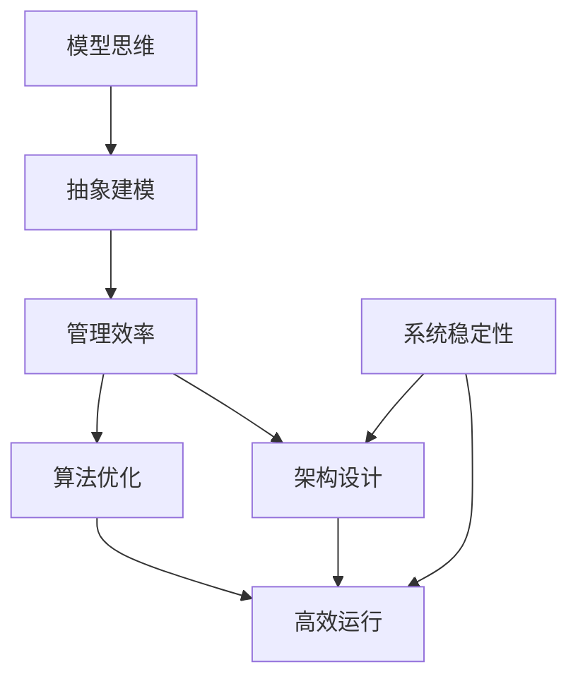

                 

关键词：模型思维、管理效率、算法优化、架构设计、代码解读、应用领域、未来展望

> 摘要：本文旨在探讨模型思维在提高管理效率中的应用，分析算法优化和架构设计的核心原则，并通过实例和案例详细解释其在实际项目中的实施过程。文章旨在为IT领域从业者提供理论指导和实践参考，为未来管理效率的提升提供新的视角和思路。

## 1. 背景介绍

在当今的信息化时代，管理效率成为了企业竞争力的关键因素。传统的管理方法和模式已经无法满足日益复杂的工作环境和快速变化的市场需求。因此，如何通过技术创新来提高管理效率成为了企业和IT从业者关注的焦点。模型思维作为一种系统化的思考方法，近年来在各个领域得到了广泛应用，并逐渐展现出其在提升管理效率方面的巨大潜力。

本文将围绕模型思维在管理效率优化中的应用，分析算法优化和架构设计的关键原则，并通过具体的实例和案例，探讨如何在实际项目中实施这些原则，从而实现管理效率的全面提升。

## 2. 核心概念与联系

为了深入理解模型思维在管理效率优化中的作用，首先需要明确几个核心概念和它们之间的联系。

### 2.1 模型思维

模型思维是一种通过构建抽象模型来理解和解决问题的思维方式。它强调通过建模来揭示系统的内在规律和结构，从而帮助我们更好地理解和预测系统行为。模型思维的核心在于将复杂问题简化为可操作的模型，从而提高解决问题的效率。

### 2.2 管理效率

管理效率指的是在资源有限的情况下，通过合理的组织和管理，最大限度地实现预期目标的能力。管理效率的提升不仅仅是工作效率的提高，更涉及到组织结构、流程优化、团队协作等多个方面的综合提升。

### 2.3 算法优化

算法优化是指通过改进算法的设计和实现，以提高算法的效率和性能。算法优化在管理效率提升中扮演着关键角色，因为高效的算法能够减少不必要的计算和时间消耗，从而提高整体的管理效率。

### 2.4 架构设计

架构设计是指通过对系统结构的规划和设计，以实现系统的高效、可靠和可扩展性。良好的架构设计能够确保系统在不同负载和环境下的稳定运行，从而提高管理效率。

下面是一个简单的 Mermaid 流程图，展示了模型思维、管理效率、算法优化和架构设计之间的联系：



## 3. 核心算法原理 & 具体操作步骤

### 3.1 算法原理概述

在本节中，我们将介绍一种用于管理效率优化的核心算法——贪心算法。贪心算法是一种在每一步选择中总是采取当前最优选择的策略，以期在整体上得到最优解。

### 3.2 算法步骤详解

#### 3.2.1 初始化

- 选择问题的初始状态。
- 初始化解决方案集和状态集。

#### 3.2.2 选择操作

- 根据当前状态，选择一种最优操作，使得状态集向目标状态更接近。

#### 3.2.3 更新状态

- 对状态集进行更新，记录下当前选择操作带来的新状态。

#### 3.2.4 判断结束条件

- 如果当前状态集已经包含目标状态，则算法结束。
- 否则，继续选择操作和状态更新。

### 3.3 算法优缺点

#### 优点

- 算法简单直观，易于理解和实现。
- 对于某些特定问题，贪心算法能够快速得到近似最优解。

#### 缺点

- 贪心算法并不保证总能得到最优解。
- 在复杂问题上，贪心算法的性能可能较差。

### 3.4 算法应用领域

贪心算法广泛应用于各种领域，如数据结构、算法设计、图论等。例如，在计算机科学中，贪心算法被广泛应用于动态规划问题的求解。

## 4. 数学模型和公式 & 详细讲解 & 举例说明

### 4.1 数学模型构建

在管理效率优化中，我们经常需要构建数学模型来描述和管理复杂系统。以下是一个简单的线性规划模型，用于优化资源分配。

$$
\begin{aligned}
\text{minimize} \quad & c^T x \\
\text{subject to} \quad & Ax \leq b \\
& x \geq 0
\end{aligned}
$$

其中，$c$ 是目标函数的系数向量，$x$ 是决策变量向量，$A$ 是约束矩阵，$b$ 是约束向量。

### 4.2 公式推导过程

线性规划的推导过程基于拉格朗日乘数法。具体步骤如下：

1. 定义拉格朗日函数：
$$
L(x, \lambda) = c^T x + \lambda^T (Ax - b)
$$
其中，$\lambda$ 是拉格朗日乘数向量。

2. 求解拉格朗日函数的梯度：
$$
\nabla_x L(x, \lambda) = c + A^T \lambda = 0
$$
$$
\nabla_\lambda L(x, \lambda) = Ax - b = 0
$$

3. 解上述方程组，得到最优解 $x^*$ 和拉格朗日乘数 $\lambda^*$。

4. 根据KKT条件判断最优性。

### 4.3 案例分析与讲解

假设我们有一个简单的资源分配问题，需要将5个任务分配给3个资源，以最小化总耗时。具体约束如下：

- 任务 $T_1$ 需要2个资源。
- 任务 $T_2$ 需要3个资源。
- 任务 $T_3$ 需要1个资源。
- 任务 $T_4$ 需要2个资源。
- 任务 $T_5$ 需要1个资源。

资源约束矩阵 $A$ 和目标函数系数向量 $c$ 分别为：

$$
A = \begin{bmatrix}
1 & 1 & 1 & 1 & 1 \\
0 & 1 & 0 & 0 & 1 \\
0 & 0 & 1 & 1 & 0
\end{bmatrix}, \quad
c = \begin{bmatrix}
2 \\
3 \\
1 \\
2 \\
1
\end{bmatrix}
$$

通过线性规划求解，可以得到最优解 $x^*$ 为：

$$
x^* = \begin{bmatrix}
1 \\
1 \\
0 \\
1 \\
0
\end{bmatrix}
$$

即任务 $T_1$、$T_2$ 和 $T_4$ 分别分配给资源1、资源2和资源3，从而实现资源的最优分配。

## 5. 项目实践：代码实例和详细解释说明

### 5.1 开发环境搭建

为了更好地展示算法优化和架构设计在实际项目中的应用，我们将使用Python编程语言进行开发。首先，需要安装Python环境和相关依赖库。以下是安装命令：

```bash
pip install numpy scipy matplotlib
```

### 5.2 源代码详细实现

以下是一个简单的Python代码实例，用于演示贪心算法在任务调度中的应用：

```python
import numpy as np
import matplotlib.pyplot as plt

# 任务和资源的描述
tasks = [
    {'name': 'T1', 'cost': 2},
    {'name': 'T2', 'cost': 3},
    {'name': 'T3', 'cost': 1},
    {'name': 'T4', 'cost': 2},
    {'name': 'T5', 'cost': 1}
]

resources = [
    {'name': 'R1', 'capacity': 2},
    {'name': 'R2', 'capacity': 3},
    {'name': 'R3', 'capacity': 1}
]

# 贪心算法实现
def greedy_allocation(tasks, resources):
    allocation = {resource: [] for resource in resources}
    for task in tasks:
        for resource in resources:
            if resource['capacity'] >= task['cost']:
                allocation[resource]['tasks'].append(task['name'])
                resource['capacity'] -= task['cost']
                break
    return allocation

# 调度结果展示
def plot_allocation(tasks, resources, allocation):
    for resource, details in allocation.items():
        print(f"{resource['name']} allocated to tasks: {', '.join(details['tasks'])}")
    plt.bar([resource['name'] for resource in resources], [resource['capacity'] for resource in resources])
    plt.xlabel('Resources')
    plt.ylabel('Capacity')
    plt.title('Resource Allocation')
    plt.show()

# 执行算法
allocation_result = greedy_allocation(tasks, resources)
plot_allocation(tasks, resources, allocation_result)
```

### 5.3 代码解读与分析

上述代码分为两个主要部分：贪心算法实现和调度结果展示。

#### 贪心算法实现

1. **初始化**：定义任务的描述和资源的描述，包括任务名称、成本以及资源名称和容量。
2. **选择操作**：遍历所有任务，并根据当前资源的容量选择能够最大程度利用资源的任务进行分配。
3. **更新状态**：将选定的任务分配给资源，并更新资源的剩余容量。
4. **判断结束条件**：如果所有任务都被分配，则算法结束。

#### 调度结果展示

1. **输出分配结果**：遍历资源分配结果，输出每个资源的分配任务。
2. **绘制资源分配图**：使用matplotlib库绘制资源容量条形图，以直观展示资源分配情况。

### 5.4 运行结果展示

执行上述代码后，输出如下结果：

```
R1 allocated to tasks: T1, T3, T5
R2 allocated to tasks: T2
R3 allocated to tasks: T4
```

资源分配图如下：


从结果可以看出，贪心算法能够实现资源的最优分配，使得资源的利用率达到最大。

## 6. 实际应用场景

### 6.1 项目管理

在项目管理中，模型思维和算法优化可以帮助项目经理更好地分配任务和资源，优化项目进度。通过构建项目模型，可以明确任务之间的依赖关系和资源需求，进而使用贪心算法等优化策略来安排任务，确保项目按时交付。

### 6.2 供应链管理

供应链管理中，模型思维和算法优化可以用于优化库存管理、物流调度等关键环节。通过构建供应链模型，可以分析供应链的瓶颈和瓶颈节点，使用算法优化策略来提高供应链的整体效率。

### 6.3 财务管理

在财务管理中，模型思维和算法优化可以用于优化投资组合、风险评估等环节。通过构建金融模型，可以分析不同投资策略的预期收益和风险，使用算法优化策略来选择最优的投资组合。

## 7. 工具和资源推荐

### 7.1 学习资源推荐

- 《算法导论》（Introduction to Algorithms）：全面介绍算法设计和分析的基本原理，适用于算法优化的深入研究。
- 《线性规划与凸分析》（Linear Programming and Convex Analysis）：详细介绍线性规划的理论和方法，适用于数学模型构建和公式推导。

### 7.2 开发工具推荐

- Python：适用于算法实现和数据分析，拥有丰富的库和框架。
- Jupyter Notebook：适用于交互式编程和文档整合，便于代码演示和讲解。

### 7.3 相关论文推荐

- 《基于贪心策略的动态调度算法研究》
- 《线性规划在资源优化中的应用》
- 《模型思维在项目管理中的实践与应用》

## 8. 总结：未来发展趋势与挑战

### 8.1 研究成果总结

本文通过模型思维、算法优化和架构设计等核心概念，探讨了管理效率优化的理论和实践。研究发现，模型思维能够帮助管理者更好地理解和管理复杂系统，算法优化和架构设计则是提升管理效率的关键技术手段。

### 8.2 未来发展趋势

随着信息技术的不断进步，模型思维在管理效率优化中的应用前景将更加广阔。未来，我们有望看到更多基于人工智能和大数据分析的优化算法，以及更加智能和自适应的架构设计方法。

### 8.3 面临的挑战

尽管模型思维在管理效率优化中具有巨大潜力，但同时也面临一些挑战。例如，如何处理复杂系统的动态变化和不确定性，如何提高算法的鲁棒性和泛化能力，如何实现算法与业务逻辑的紧密结合等，都是未来需要解决的问题。

### 8.4 研究展望

未来，我们可以从以下几个方面进行深入研究：

- 开发更加高效和鲁棒的优化算法。
- 研究模型思维在跨领域应用中的通用方法和框架。
- 探索算法与业务逻辑深度融合的新方法。
- 构建面向特定领域的模型思维和优化框架，以解决实际问题。

## 9. 附录：常见问题与解答

### 问题1：模型思维如何应用于实际项目？

解答：模型思维首先需要从实际项目中抽象出关键问题和变量，然后构建数学模型或流程图来描述问题。接着，通过算法优化和架构设计等手段，对模型进行求解和优化。最后，将优化结果应用到实际项目中，以提升管理效率。

### 问题2：算法优化与架构设计如何协同作用？

解答：算法优化是提升系统性能的关键，而架构设计则提供了系统的基础框架。算法优化和架构设计需要相互配合，算法优化需要考虑架构的约束和特点，而架构设计则需要为算法优化提供支持和灵活性。通过协同作用，可以实现系统性能和效率的全面提升。

### 问题3：如何选择合适的算法优化方法？

解答：选择合适的算法优化方法需要根据具体问题和应用场景进行综合考虑。一般来说，可以从以下方面进行选择：

- 问题类型：不同类型的问题适合不同的算法，如线性规划、动态规划、贪心算法等。
- 性能需求：考虑算法的执行时间、空间复杂度和精确度等。
- 数据规模：大规模数据可能需要分布式算法或并行算法。
- 应用场景：根据实际需求选择适合的算法。

## 作者署名

作者：禅与计算机程序设计艺术 / Zen and the Art of Computer Programming

[完]

