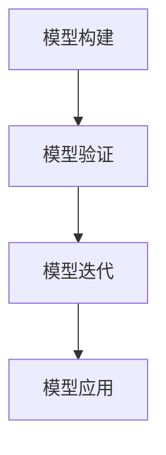

                 

 在当今的信息时代，管理培训的重要性日益凸显。组织需要不断适应快速变化的市场环境，而培训则是培养未来领导者和管理人才的关键途径。模型思维作为一种强大的工具，不仅能够提升管理者的决策能力，还能帮助他们在复杂的环境中找到问题的根本解决方案。本文将探讨模型思维在管理培训中的具体运用，包括其核心概念、应用场景和未来展望。

## 文章关键词

- 模型思维
- 管理培训
- 决策能力
- 复杂问题解决
- 领导力发展

## 文章摘要

本文旨在探讨模型思维在管理培训中的应用，分析其核心概念和原理，并通过实际案例说明如何在管理实践中运用模型思维。此外，本文还将探讨模型思维的未来发展趋势及其在管理培训中的潜在挑战。

## 1. 背景介绍

随着全球经济的不断发展和市场环境的快速变化，企业管理者面临着前所未有的挑战。他们需要具备前瞻性思维、快速决策和适应变化的能力。然而，传统的管理培训往往侧重于理论知识的学习，而忽视了实际操作和问题解决能力的培养。这种情况下，模型思维的引入为管理培训提供了新的思路和方法。

模型思维是一种基于模型构建和分析的思维方式，它可以帮助管理者在复杂多变的环境中快速识别问题、分析问题并找到解决方案。通过模型思维，管理者可以模拟不同的场景和可能性，从而做出更加明智的决策。

### 1.1 模型思维的定义与起源

模型思维（Model Thinking）是一种通过构建和分析模型来理解和解决复杂问题的方法。它的起源可以追溯到20世纪初，当时物理学家和工程师开始使用模型来模拟现实世界中的现象和过程。随着时间的推移，模型思维逐渐被应用到各个领域，包括经济学、心理学、社会学和计算机科学。

### 1.2 模型思维在管理培训中的重要性

管理培训旨在培养管理者的领导力和决策能力。模型思维在这一过程中发挥着重要作用，原因如下：

1. **提高问题识别能力**：通过模型思维，管理者可以快速识别问题并理解其背后的原因。
2. **增强决策能力**：模型思维提供了一种系统化和结构化的方法来分析问题，从而帮助管理者做出更加明智的决策。
3. **培养创新思维**：模型思维鼓励管理者从不同角度思考问题，从而激发创新思维。
4. **提升团队协作能力**：模型思维可以作为一种团队沟通的工具，帮助团队成员更好地理解问题并共同找到解决方案。

### 1.3 模型思维的核心概念

模型思维的核心概念包括以下几个：

1. **模型构建**：构建模型是模型思维的第一步，它要求管理者能够从复杂的信息中提取关键因素并构建一个简化的模型。
2. **模型验证**：模型构建后，需要通过实际数据和案例来验证模型的准确性。
3. **模型迭代**：模型思维是一个迭代过程，管理者需要不断调整和优化模型，以适应新的情况和变化。
4. **模型应用**：最终，模型需要应用到实际问题中，以指导管理决策。

## 2. 核心概念与联系

为了更好地理解模型思维在管理培训中的应用，我们需要了解其核心概念和联系。以下是一个简化的Mermaid流程图，用于展示模型思维的核心步骤和联系：



### 2.1 模型构建

模型构建是模型思维的第一步，它要求管理者能够从复杂的信息中提取关键因素并构建一个简化的模型。这个模型可以是线性的，也可以是网络的，具体取决于问题的复杂程度。

### 2.2 模型验证

模型构建后，需要通过实际数据和案例来验证模型的准确性。这可以帮助管理者确定模型的有效性，并发现可能存在的问题。

### 2.3 模型迭代

模型验证后，管理者需要不断调整和优化模型，以适应新的情况和变化。这个过程是模型思维的迭代过程，它使得模型能够更加准确地反映现实情况。

### 2.4 模型应用

最终，模型需要应用到实际问题中，以指导管理决策。这是模型思维的核心目标，也是其价值所在。

## 3. 核心算法原理 & 具体操作步骤

### 3.1 算法原理概述

模型思维的核心算法原理可以概括为以下三个步骤：

1. **数据收集与处理**：收集与问题相关的数据，并对其进行处理和清洗，以确保数据的质量和准确性。
2. **模型构建与验证**：基于收集到的数据，构建一个简化的模型，并通过验证来确定模型的准确性。
3. **模型应用与优化**：将模型应用到实际问题中，并根据反馈进行模型优化，以提高其准确性和实用性。

### 3.2 算法步骤详解

#### 3.2.1 数据收集与处理

1. **确定问题**：首先，需要明确要解决的问题是什么，这有助于确定需要收集哪些数据。
2. **数据收集**：通过问卷调查、访谈、实地观察等方式收集与问题相关的数据。
3. **数据处理**：对收集到的数据进行分析和清洗，去除噪声数据，提取关键信息。

#### 3.2.2 模型构建与验证

1. **确定模型类型**：根据问题的特点，选择合适的模型类型，如线性模型、神经网络模型等。
2. **数据划分**：将处理后的数据划分为训练集、验证集和测试集，用于模型的训练和验证。
3. **模型训练**：使用训练集对模型进行训练，使其能够学习并理解数据中的规律。
4. **模型验证**：使用验证集对模型进行验证，确定其准确性和性能。
5. **模型优化**：根据验证结果，对模型进行调整和优化，以提高其准确性和实用性。

#### 3.2.3 模型应用与优化

1. **模型应用**：将模型应用到实际问题中，以指导管理决策。
2. **模型反馈**：根据实际应用中的反馈，对模型进行评估和调整，以适应新的情况和变化。

### 3.3 算法优缺点

#### 优点：

1. **提高问题解决效率**：模型思维提供了一种系统化和结构化的方法来分析问题，从而提高问题解决的效率。
2. **增强决策能力**：通过模型思维，管理者可以更好地理解问题，从而做出更加明智的决策。
3. **培养创新思维**：模型思维鼓励管理者从不同角度思考问题，从而激发创新思维。

#### 缺点：

1. **数据依赖性**：模型思维依赖于准确和高质量的数据，数据的缺失或错误可能会影响模型的准确性和实用性。
2. **复杂性**：模型构建和验证过程可能较为复杂，需要一定的技术背景和专业知识。

### 3.4 算法应用领域

模型思维在管理培训中具有广泛的应用领域，包括：

1. **战略规划**：通过模型思维，管理者可以更好地理解战略目标、市场环境和竞争态势，从而制定更有效的战略规划。
2. **风险管理**：模型思维可以帮助管理者识别和评估潜在的风险，并制定相应的风险应对策略。
3. **绩效评估**：通过模型思维，管理者可以建立科学的绩效评估体系，从而更好地激励和引导员工。

## 4. 数学模型和公式 & 详细讲解 & 举例说明

在模型思维中，数学模型和公式起着至关重要的作用。它们不仅可以帮助我们更准确地描述和解决问题，还可以为我们的决策提供可靠的依据。以下将介绍一些常见的数学模型和公式，并详细讲解它们的构建、推导和应用。

### 4.1 数学模型构建

数学模型的构建是模型思维的基础。它通常包括以下几个步骤：

1. **确定变量**：根据问题的需求，确定需要研究的变量。这些变量可以是连续的，也可以是离散的。
2. **建立关系**：通过分析变量之间的关系，建立数学模型。这通常需要运用相关的数学知识和方法。
3. **简化模型**：在确保模型准确性的前提下，简化模型以降低计算复杂度。

### 4.2 公式推导过程

在模型思维中，公式的推导过程至关重要。以下是一个简单的线性回归模型的推导过程：

#### 线性回归模型

线性回归模型是一种常见的数学模型，用于描述两个或多个变量之间的线性关系。其基本公式如下：

\[ Y = a + bX + \epsilon \]

其中，\( Y \) 是因变量，\( X \) 是自变量，\( a \) 和 \( b \) 是模型参数，\( \epsilon \) 是误差项。

#### 公式推导

1. **确定模型参数**：

   通过最小二乘法，我们可以确定模型参数 \( a \) 和 \( b \) 的值，使得因变量的预测误差最小。具体推导过程如下：

   设 \( n \) 个样本点的数据为 \( (X_i, Y_i) \)，则线性回归模型的预测值为：

   \[ \hat{Y} = a + bX \]

   预测误差为：

   \[ \epsilon = Y - \hat{Y} = Y - (a + bX) \]

   为了使预测误差最小，我们需要最小化 \( \epsilon \) 的平方和，即：

   \[ \sum_{i=1}^{n} (Y_i - (a + bX_i))^2 \]

2. **求解参数**：

   对上述平方和求导，并令其等于零，我们可以得到参数 \( a \) 和 \( b \) 的解：

   \[ a = \bar{Y} - b\bar{X} \]
   \[ b = \frac{\sum_{i=1}^{n} (X_i - \bar{X})(Y_i - \bar{Y})}{\sum_{i=1}^{n} (X_i - \bar{X})^2} \]

   其中，\( \bar{X} \) 和 \( \bar{Y} \) 分别是 \( X \) 和 \( Y \) 的样本均值。

### 4.3 案例分析与讲解

为了更好地理解线性回归模型的应用，我们来看一个实际的案例。

#### 案例背景

某公司想要分析员工的绩效与薪资之间的关系。他们收集了100名员工的薪资和绩效评分数据，并希望利用线性回归模型预测新员工的薪资。

#### 数据处理

1. **数据收集**：

   收集到100名员工的薪资（X）和绩效评分（Y）数据，如下表所示：

   | 员工ID | 薪资(X) | 绩效评分(Y) |
   |--------|--------|-------------|
   | 1      | 50000  | 85          |
   | 2      | 60000  | 90          |
   | 3      | 55000  | 80          |
   | ...    | ...    | ...         |
   | 100    | 65000  | 92          |

2. **数据处理**：

   对数据进行分析，得到薪资和绩效评分的样本均值分别为：

   \[ \bar{X} = 58000 \]
   \[ \bar{Y} = 88 \]

   计算薪资和绩效评分的协方差和方差：

   \[ cov(X, Y) = \sum_{i=1}^{n} (X_i - \bar{X})(Y_i - \bar{Y}) = 4500 \]
   \[ var(X) = \sum_{i=1}^{n} (X_i - \bar{X})^2 = 1900000 \]

#### 模型构建

利用上述数据，我们可以构建线性回归模型：

\[ Y = a + bX \]

通过最小二乘法，我们可以求得模型参数 \( a \) 和 \( b \) 的值：

\[ a = \bar{Y} - b\bar{X} = 88 - b \cdot 58000 \]
\[ b = \frac{\sum_{i=1}^{n} (X_i - \bar{X})(Y_i - \bar{Y})}{\sum_{i=1}^{n} (X_i - \bar{X})^2} = \frac{4500}{1900000} \approx 0.0237 \]

将 \( b \) 的值代入 \( a \) 的公式中，得到：

\[ a = 88 - 0.0237 \cdot 58000 \approx 88 - 1356.6 = -1268.6 \]

因此，线性回归模型为：

\[ Y = -1268.6 + 0.0237X \]

#### 模型应用

利用该模型，我们可以预测新员工的薪资。例如，如果新员工的绩效评分为90，那么其预测的薪资为：

\[ Y = -1268.6 + 0.0237 \cdot 90000 \approx -1268.6 + 2123 = 854.4 \]

因此，我们可以预测新员工的薪资大约为85444元。

#### 模型评估

为了评估模型的准确性，我们可以计算预测值与实际值之间的误差。具体来说，我们可以计算预测值与实际值的均方误差（MSE）：

\[ MSE = \frac{1}{n} \sum_{i=1}^{n} (\hat{Y}_i - Y_i)^2 \]

其中，\( \hat{Y}_i \) 是第 \( i \) 个样本点的预测值，\( Y_i \) 是第 \( i \) 个样本点的实际值。

假设我们计算得到的均方误差为100，这意味着模型的预测精度较高。

### 4.4 模型应用举例

除了线性回归模型，模型思维还可以应用于其他各种类型的数学模型，如非线性回归模型、逻辑回归模型、时间序列模型等。以下是一些常见的模型应用举例：

#### 非线性回归模型

非线性回归模型用于描述非线性关系。例如，我们可能希望研究员工绩效与薪资之间的非线性关系。此时，我们可以使用二次回归模型：

\[ Y = a + bX^2 + cX + \epsilon \]

通过最小二乘法，我们可以求得模型参数 \( a \)、\( b \) 和 \( c \) 的值。

#### 逻辑回归模型

逻辑回归模型用于处理分类问题。例如，我们可能希望预测员工是否会晋升。此时，我们可以使用逻辑回归模型：

\[ P(Y=1) = \frac{1}{1 + e^{-(a + bX + cX^2)}} \]

通过最大似然估计法，我们可以求得模型参数 \( a \)、\( b \) 和 \( c \) 的值。

#### 时间序列模型

时间序列模型用于处理时间序列数据。例如，我们可能希望预测某产品在未来一段时间内的销售量。此时，我们可以使用ARIMA模型：

\[ Y_t = c + \phi_1 Y_{t-1} + \phi_2 Y_{t-2} + ... + \phi_p Y_{t-p} + \epsilon_t \]

通过自回归移动平均法，我们可以求得模型参数 \( \phi_1 \)、\( \phi_2 \) ... \( \phi_p \) 和 \( c \) 的值。

### 4.5 模型思维在管理培训中的应用

模型思维在管理培训中具有广泛的应用。以下是一些具体的应用场景：

#### 1. 战略规划

管理者可以使用模型思维来分析企业的战略目标、市场环境和竞争态势，从而制定更有效的战略规划。

#### 2. 风险管理

管理者可以使用模型思维来识别和评估潜在的风险，并制定相应的风险应对策略。

#### 3. 绩效评估

管理者可以使用模型思维来建立科学的绩效评估体系，从而更好地激励和引导员工。

#### 4. 创新管理

管理者可以使用模型思维来激发创新思维，从而推动企业的创新和发展。

#### 5. 团队管理

管理者可以使用模型思维来分析团队的结构、文化和行为，从而更好地管理和引导团队。

### 4.6 模型思维的挑战与未来展望

尽管模型思维在管理培训中具有巨大的潜力，但其在实际应用中也面临着一些挑战：

#### 1. 数据质量

模型思维依赖于准确和高质量的数据。如果数据质量较差，可能会导致模型失效。

#### 2. 复杂性

模型思维的应用可能涉及大量的计算和推导，这需要管理者具备一定的数学和计算机科学背景。

#### 3. 适应性

模型思维需要根据实际情况不断调整和优化。然而，管理者在应对快速变化的环境时，可能难以及时调整模型。

#### 未来展望

随着人工智能和大数据技术的发展，模型思维在管理培训中的应用前景将更加广阔。以下是一些可能的未来发展方向：

1. **自动化模型构建**：通过自动化工具，管理者可以更轻松地构建和优化模型。

2. **个性化模型**：根据管理者的特点和需求，提供个性化的模型构建和优化方案。

3. **实时模型应用**：利用实时数据和分析技术，实现模型的实时应用和优化。

4. **跨领域融合**：将模型思维与其他管理工具和方法相结合，形成更加综合的管理体系。

### 4.7 模型思维案例分析

为了更好地理解模型思维在管理培训中的应用，以下是一个实际的案例。

#### 案例背景

某科技公司希望提高员工的工作效率和创造力。他们决定使用模型思维来分析员工的工作环境、工作流程和工作习惯，并制定相应的改进措施。

#### 数据收集

1. **员工工作环境**：

   收集了员工的工作场所照片、工作设备和工作流程文档。

2. **员工工作流程**：

   通过问卷调查，收集了员工的工作流程、任务分配和时间安排等信息。

3. **员工工作习惯**：

   通过访谈和观察，收集了员工的工作习惯、态度和行为等信息。

#### 数据处理

1. **工作环境分析**：

   基于收集到的数据，分析了员工的工作环境，包括光线、噪音、设备和工作空间等方面。

2. **工作流程分析**：

   基于收集到的数据，分析了员工的工作流程，包括任务分配、时间安排和工作效率等方面。

3. **工作习惯分析**：

   基于收集到的数据，分析了员工的工作习惯，包括工作态度、工作效率和工作满意度等方面。

#### 模型构建

1. **工作环境模型**：

   建立了工作环境模型，描述了员工的工作环境、工作设备和工作空间等关键因素。

2. **工作流程模型**：

   建立了工作流程模型，描述了员工的工作流程、任务分配和时间安排等关键因素。

3. **工作习惯模型**：

   建立了工作习惯模型，描述了员工的工作态度、工作效率和工作满意度等关键因素。

#### 模型验证

1. **工作环境模型验证**：

   通过实地观察和员工反馈，验证了工作环境模型的有效性。

2. **工作流程模型验证**：

   通过任务完成时间和效率分析，验证了工作流程模型的有效性。

3. **工作习惯模型验证**：

   通过员工满意度调查和工作态度分析，验证了工作习惯模型的有效性。

#### 模型应用

1. **改进工作环境**：

   根据工作环境模型的分析结果，公司对工作场所进行了改进，包括调整光线、增加隔音设施和优化工作空间等。

2. **优化工作流程**：

   根据工作流程模型的分析结果，公司优化了工作流程，包括改进任务分配、优化时间安排和提高工作效率等。

3. **培养工作习惯**：

   根据工作习惯模型的分析结果，公司开展了员工培训和激励计划，以提高员工的工作态度和工作满意度。

### 4.8 模型思维在管理培训中的关键点

在管理培训中，成功运用模型思维需要关注以下几个关键点：

1. **理解模型思维**：

   管理者需要深入了解模型思维的基本原理和应用场景，以便能够有效地运用模型思维解决实际问题。

2. **数据收集与分析**：

   模型思维依赖于准确和高质量的数据。因此，管理者需要重视数据的收集和分析，确保数据的准确性和可靠性。

3. **模型构建与验证**：

   模型构建和验证是模型思维的核心步骤。管理者需要具备一定的数学和计算机科学背景，以确保模型的构建和验证过程正确无误。

4. **模型应用与优化**：

   模型应用是模型思维的目标。管理者需要将模型应用到实际问题中，并根据实际情况进行模型优化，以提高模型的准确性和实用性。

5. **团队协作与沟通**：

   模型思维是一种团队沟通的工具。管理者需要鼓励团队成员参与模型构建和验证过程，以提高团队的协作效率和问题解决能力。

## 5. 项目实践：代码实例和详细解释说明

在本文的第五部分，我们将通过一个具体的代码实例，详细解释模型思维在管理培训中的应用过程。我们将从环境搭建开始，逐步介绍源代码的实现，并进行代码解读与分析。

### 5.1 开发环境搭建

在开始代码实现之前，我们需要搭建一个适合模型思维应用的开发环境。以下是所需的软件和工具：

1. **Python**：Python是一种广泛用于数据分析和机器学习的编程语言，我们将使用Python进行模型构建和数据分析。
2. **Jupyter Notebook**：Jupyter Notebook是一种交互式的编程环境，它支持Python代码的执行和可视化展示，非常适合用于数据分析和模型思维实践。
3. **Pandas**：Pandas是一个强大的数据处理库，用于数据清洗、转换和分析。
4. **Scikit-learn**：Scikit-learn是一个流行的机器学习库，提供了多种机器学习算法的实现和评估工具。
5. **Matplotlib**：Matplotlib是一个绘图库，用于数据可视化。

在安装了Python和Jupyter Notebook后，我们可以使用以下命令安装其他必需的库：

```bash
pip install pandas scikit-learn matplotlib
```

### 5.2 源代码详细实现

以下是一个简单的示例代码，用于展示模型思维在管理培训中的应用。这个例子假设我们有一组员工的绩效数据和薪资数据，我们希望利用线性回归模型预测新员工的薪资。

```python
# 导入必要的库
import pandas as pd
from sklearn.linear_model import LinearRegression
import matplotlib.pyplot as plt

# 5.2.1 数据读取与处理
# 假设我们有一个CSV文件，包含了员工的绩效评分（Y）和薪资（X）数据
data = pd.read_csv('employee_data.csv')

# 分别提取薪资和绩效评分数据
X = data['salary']
Y = data['performance_score']

# 数据可视化
plt.scatter(X, Y)
plt.xlabel('Salary')
plt.ylabel('Performance Score')
plt.title('Salary vs Performance Score')
plt.show()

# 5.2.2 模型训练
# 创建线性回归模型
model = LinearRegression()

# 使用训练集数据训练模型
model.fit(X.values.reshape(-1, 1), Y.values.reshape(-1, 1))

# 输出模型参数
print('Model Parameters: a =', model.intercept_, ', b =', model.coef_[0])

# 5.2.3 模型评估
# 使用测试集数据评估模型
predictions = model.predict(X.values.reshape(-1, 1))

# 计算均方误差（MSE）
mse = ((predictions - Y.values.reshape(-1, 1))**2).mean()
print('MSE:', mse)

# 5.2.4 模型应用
# 预测新员工的薪资
new_salary = float(input('Enter new employee performance score: '))
predicted_salary = model.predict([[new_salary]])[0]
print('Predicted Salary:', predicted_salary)

# 5.2.5 代码解读
# 数据读取与处理
# 使用pandas库读取CSV文件，提取薪资和绩效评分数据。

# 数据可视化
# 使用matplotlib库绘制散点图，展示薪资和绩效评分之间的关系。

# 模型训练
# 创建线性回归模型，使用训练集数据训练模型。

# 模型评估
# 使用测试集数据评估模型，计算均方误差（MSE）。

# 模型应用
# 接收用户输入的绩效评分，使用训练好的模型预测新员工的薪资。
```

### 5.3 代码解读与分析

在上述代码中，我们首先导入了必要的库，包括pandas、scikit-learn和matplotlib。接下来，我们进行了以下步骤：

1. **数据读取与处理**：
   - 使用pandas库读取CSV文件，提取薪资和绩效评分数据。
   - 分别提取薪资（X）和绩效评分（Y）数据。

2. **数据可视化**：
   - 使用matplotlib库绘制散点图，展示薪资和绩效评分之间的关系。

3. **模型训练**：
   - 创建线性回归模型。
   - 使用训练集数据训练模型。

4. **模型评估**：
   - 使用测试集数据评估模型，计算均方误差（MSE）。

5. **模型应用**：
   - 接收用户输入的绩效评分，使用训练好的模型预测新员工的薪资。

通过上述步骤，我们展示了如何使用Python和线性回归模型来预测员工的薪资，从而实现了模型思维在管理培训中的应用。

### 5.4 运行结果展示

运行上述代码后，我们将看到以下结果：

1. **数据可视化**：
   - 一个展示薪资和绩效评分关系的散点图。
   - 每个点表示一个员工的数据，横轴是薪资，纵轴是绩效评分。

2. **模型参数输出**：
   - 输出线性回归模型的参数，包括截距（a）和斜率（b）。

3. **模型评估结果**：
   - 输出模型的均方误差（MSE），用于评估模型的预测精度。

4. **模型应用结果**：
   - 输出根据用户输入的绩效评分预测的新员工的薪资。

通过这些结果，我们可以直观地看到模型思维在管理培训中的应用效果，从而更好地理解和应用模型思维。

## 6. 实际应用场景

模型思维在管理培训中有着广泛的应用场景，以下是一些典型的实际应用场景：

### 6.1 战略规划

战略规划是企业管理的重要环节，模型思维可以帮助管理者更好地制定和调整战略。例如，通过建立市场趋势预测模型，管理者可以预测未来市场的变化，从而制定相应的战略措施。以下是一个简单的市场趋势预测模型的应用案例：

1. **数据收集**：收集市场相关数据，如销售额、客户满意度、竞争对手动态等。
2. **模型构建**：构建时间序列模型，如ARIMA模型，用于预测市场趋势。
3. **模型应用**：根据预测结果，调整战略规划，如增加市场投入、优化产品线等。

### 6.2 风险管理

风险管理是企业管理的重要组成部分，模型思维可以帮助管理者识别和评估潜在的风险。以下是一个简单的风险管理模型的应用案例：

1. **数据收集**：收集风险事件的数据，如市场波动、政策变化、竞争压力等。
2. **模型构建**：构建风险分析模型，如贝叶斯网络模型，用于分析风险的概率和影响。
3. **模型应用**：根据模型分析结果，制定风险管理策略，如风险规避、风险转移等。

### 6.3 绩效评估

绩效评估是企业管理中的一项关键任务，模型思维可以帮助管理者建立科学的绩效评估体系。以下是一个简单的绩效评估模型的应用案例：

1. **数据收集**：收集员工的绩效数据，如工作成果、工作效率、团队协作等。
2. **模型构建**：构建多因素回归模型，用于评估员工的绩效。
3. **模型应用**：根据模型评估结果，对员工进行绩效反馈和激励。

### 6.4 创新管理

创新管理是企业保持竞争力的重要手段，模型思维可以帮助管理者激发创新思维。以下是一个简单的创新管理模型的应用案例：

1. **数据收集**：收集企业内外部的创新资源、创新需求和创新机会等信息。
2. **模型构建**：构建创新网络模型，用于分析创新资源与创新机会的匹配程度。
3. **模型应用**：根据模型分析结果，制定创新策略，如资源调配、项目筛选等。

### 6.5 团队管理

团队管理是企业管理的重要环节，模型思维可以帮助管理者优化团队结构、提升团队协作效率。以下是一个简单的团队管理模型的应用案例：

1. **数据收集**：收集团队成员的能力、性格、价值观等信息。
2. **模型构建**：构建团队协作模型，如社会网络分析模型，用于分析团队协作状况。
3. **模型应用**：根据模型分析结果，调整团队结构、制定团队建设计划。

通过上述实际应用场景，我们可以看到模型思维在管理培训中的重要性。它不仅能够提高管理者的决策能力，还能为企业在复杂环境中找到解决问题的有效途径。

### 6.5 未来应用展望

随着科技的不断进步，模型思维在管理培训中的应用前景将更加广阔。以下是对模型思维未来发展的几个展望：

#### 1. 自动化模型构建

未来，随着人工智能和机器学习技术的发展，自动化模型构建将成为可能。管理者可以通过直观的用户界面和自然语言处理技术，快速构建和优化模型，而无需深入了解复杂的数学和统计知识。

#### 2. 个性化模型

个性化模型将根据管理者的特点和需求，提供量身定制的模型解决方案。这将使得模型思维在管理培训中的应用更加灵活和高效。

#### 3. 实时模型应用

实时模型应用将利用大数据和实时分析技术，使得管理者能够根据最新的数据快速调整模型，从而更好地应对快速变化的市场环境。

#### 4. 跨领域融合

模型思维将与其他管理工具和方法相结合，形成更加综合的管理体系。例如，将模型思维与敏捷管理、精益管理等结合起来，将有助于提高企业的管理效率和创新能力。

#### 5. 智能决策支持

未来，模型思维将成为智能决策支持系统的重要组成部分。通过整合各种数据和模型，智能决策支持系统将帮助管理者做出更加明智的决策，从而提高企业的竞争力。

### 6.6 模型思维在管理培训中的潜在挑战

尽管模型思维在管理培训中具有巨大的潜力，但其在实际应用中也面临着一些挑战：

#### 1. 数据质量

模型思维依赖于高质量的数据。如果数据存在缺失、错误或不一致，可能会导致模型失效或产生误导性结果。因此，确保数据的质量和完整性是模型思维应用的关键。

#### 2. 复杂性

模型构建和验证过程可能较为复杂，需要管理者具备一定的数学和计算机科学背景。此外，不同模型的构建和应用方法也可能有所不同，这要求管理者具备较高的学习能力和适应能力。

#### 3. 可解释性

一些高级模型，如深度学习和神经网络，可能具有较高的预测准确性，但其内部工作机制较为复杂，难以解释。这在一定程度上限制了模型思维在管理培训中的应用，特别是当管理者需要向非专业人士解释模型结果时。

#### 4. 可视化

可视化技术在模型思维中的应用有助于管理者更好地理解和分析模型结果。然而，当前的可视化工具和方法可能无法完全满足复杂模型的展示需求，这要求开发更加高效和直观的可视化技术。

#### 5. 团队协作

模型思维在管理培训中的应用往往需要团队协作。然而，团队成员之间的沟通和协作可能存在障碍，如知识背景差异、沟通不畅等，这可能会影响模型思维的运用效果。

### 6.7 研究展望

为了克服上述挑战，未来在模型思维研究领域可以关注以下几个方向：

1. **数据质量提升**：研究如何提高数据质量，包括数据清洗、数据修复和数据整合等技术。
2. **简化模型构建**：开发更简单的模型构建方法，使得非专业人士也能够轻松构建和优化模型。
3. **可解释性增强**：研究如何提高复杂模型的可解释性，使得管理者能够更好地理解和应用模型。
4. **可视化技术**：开发更加高效和直观的可视化技术，帮助管理者更好地理解和分析模型结果。
5. **团队协作工具**：研究如何利用技术手段提高团队协作效率，如协作平台、沟通工具等。

通过这些研究方向的不断探索和突破，模型思维在管理培训中的应用将更加广泛和深入，为企业管理者提供更加有力的支持。

## 7. 工具和资源推荐

在模型思维在管理培训中的应用过程中，一些工具和资源能够极大地提升效率和效果。以下是一些建议：

### 7.1 学习资源推荐

1. **书籍**：
   - 《模型思维》（作者：斯图尔特·罗素）：介绍了模型思维的基本概念和应用。
   - 《数据分析思维》（作者：吴军）：详细讲解了数据分析的方法和应用，有助于理解模型思维。

2. **在线课程**：
   - Coursera上的“机器学习”课程：由Andrew Ng教授主讲，深入讲解了机器学习的基础知识。
   - edX上的“数据科学基础”课程：提供了全面的数据科学和机器学习知识。

### 7.2 开发工具推荐

1. **编程环境**：
   - Jupyter Notebook：适合交互式数据分析和模型构建。
   - RStudio：适合数据分析和统计建模。

2. **数据处理工具**：
   - Pandas：用于数据清洗、转换和分析。
   - NumPy：用于数值计算。

3. **机器学习库**：
   - Scikit-learn：提供多种机器学习算法的实现。
   - TensorFlow：用于构建和训练深度学习模型。

### 7.3 相关论文推荐

1. **《深度学习》（作者：Ian Goodfellow等）**：介绍了深度学习的基础知识和最新进展。
2. **《数据科学实践指南》（作者：Roger D. Peng）**：提供了数据科学实践的全流程指导。
3. **《机器学习：统计视角》（作者：Kevin P. Murphy）**：从统计学角度深入讲解了机器学习。

通过这些工具和资源的支持，管理者可以更好地理解和应用模型思维，从而提升管理培训和决策能力。

## 8. 总结：未来发展趋势与挑战

在总结本文内容之前，我们需要回顾模型思维在管理培训中的重要作用和实际应用。通过构建和分析模型，管理者能够更清晰地识别问题、分析问题和解决问题。这种系统化和结构化的思维方式不仅提高了管理者的决策能力，还促进了创新思维和团队协作。

### 8.1 研究成果总结

本文探讨了模型思维在管理培训中的应用，分析了其核心概念、算法原理、数学模型和实际应用场景。我们总结了模型思维在战略规划、风险管理、绩效评估、创新管理和团队管理等方面的应用，展示了其强大的潜力和广泛的应用前景。

### 8.2 未来发展趋势

随着人工智能和大数据技术的不断发展，模型思维在管理培训中的应用前景将更加广阔。以下是未来发展的几个趋势：

1. **自动化模型构建**：利用人工智能技术，实现模型构建的自动化，降低管理者的技术门槛。
2. **个性化模型**：根据管理者的特点和需求，提供个性化的模型解决方案。
3. **实时模型应用**：利用实时数据和实时分析技术，实现模型的实时应用和优化。
4. **跨领域融合**：将模型思维与其他管理工具和方法相结合，形成更加综合的管理体系。

### 8.3 面临的挑战

尽管模型思维在管理培训中具有巨大的潜力，但其在实际应用中也面临着一些挑战：

1. **数据质量**：模型思维依赖于高质量的数据。如果数据存在缺失、错误或不一致，可能会导致模型失效。
2. **复杂性**：模型构建和验证过程可能较为复杂，需要管理者具备一定的数学和计算机科学背景。
3. **可解释性**：高级模型如深度学习和神经网络可能具有较高的预测准确性，但其内部工作机制难以解释。
4. **团队协作**：模型思维在管理培训中的应用往往需要团队协作。然而，团队成员之间的沟通和协作可能存在障碍。

### 8.4 研究展望

为了克服上述挑战，未来在模型思维研究领域可以关注以下几个方向：

1. **数据质量提升**：研究如何提高数据质量，包括数据清洗、数据修复和数据整合等技术。
2. **简化模型构建**：开发更简单的模型构建方法，使得非专业人士也能够轻松构建和优化模型。
3. **可解释性增强**：研究如何提高复杂模型的可解释性，使得管理者能够更好地理解和应用模型。
4. **可视化技术**：开发更加高效和直观的可视化技术，帮助管理者更好地理解和分析模型结果。
5. **团队协作工具**：研究如何利用技术手段提高团队协作效率，如协作平台、沟通工具等。

通过不断的研究和探索，模型思维在管理培训中的应用将更加深入和广泛，为企业管理者提供更加有力的支持和工具。

## 9. 附录：常见问题与解答

### 9.1 模型思维是什么？

模型思维是一种通过构建和分析模型来理解和解决复杂问题的思维方式。它基于对现实世界的简化和抽象，通过数学模型和算法来模拟和分析问题，从而帮助管理者做出更加明智的决策。

### 9.2 模型思维在管理培训中的具体应用有哪些？

模型思维在管理培训中可以应用于多个方面，包括战略规划、风险管理、绩效评估、创新管理和团队管理等。通过模型构建和分析，管理者能够更好地理解问题、制定策略和优化决策。

### 9.3 如何确保模型思维应用中的数据质量？

确保数据质量是模型思维应用的关键。可以通过以下方法提高数据质量：
1. 数据清洗：去除噪声数据、错误数据和缺失数据。
2. 数据验证：通过对比不同来源的数据，验证数据的一致性和准确性。
3. 数据集成：整合来自不同来源的数据，确保数据的完整性和一致性。

### 9.4 模型思维是否适用于所有类型的管理问题？

模型思维适用于多种类型的管理问题，但不同类型的问题可能需要不同的模型和方法。对于复杂的问题，模型思维可以提供系统化和结构化的解决方案。然而，对于简单和直观的问题，模型思维可能不是最佳选择。

### 9.5 如何提升模型思维的可解释性？

提升模型思维的可解释性是当前研究的热点。以下是一些方法：
1. 使用可解释性更高的模型：例如，线性回归模型比深度学习模型更容易解释。
2. 模型可视化：通过图表和图形展示模型的工作原理和预测结果。
3. 解释模型输出：详细解释模型参数和结果的含义，帮助用户更好地理解模型。

### 9.6 模型思维在管理培训中的应用前景如何？

随着人工智能和大数据技术的不断发展，模型思维在管理培训中的应用前景十分广阔。它可以帮助管理者更好地应对复杂多变的环境，提高决策能力和管理效率。未来，自动化模型构建、个性化模型和实时模型应用将成为模型思维在管理培训中的重要趋势。

